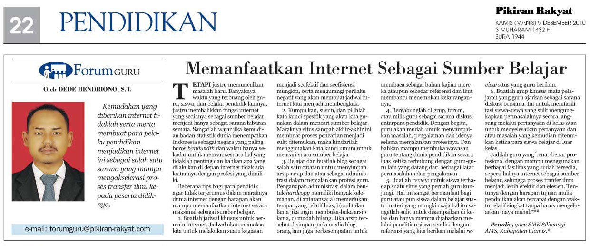

title: Memanfaatkan Internet Sebagai Sumber Belajar
description: Memanfaatkan Internet Sebagai Sumber Belajar
hero: Memanfaatkan Internet Sebagai Sumber Belajar
path: tree/master/docs/blog/2019
source: internet-sumber-belajar.md
disqus: henduino

# Internet Sebagai Sumber Belajar

Internet merupakan salah satu perkembangan teknologi informasi bukanlah sesuatu yang eksklusif bahkan sudah menjadi suatu hal yang biasa bagi masyarakat Indonesia saat ini. Bahkan beberapa *provider* (perusahaan penyedia layanan internet) telah merambah kedaerah terpencil dalam memberikan layanan jaringan internet. Ini mempermudah bagi siapa saja dan dimana saja untuk mengakses internet. Undangan, informasi, berita dan berbagai kejadian dibelahan dunia satu dapat langsung diterima dibelahan bumi lainnya. Perkembangan teknologi informasi ini mampu menekan biaya dan waktu menjadi lebih murah, mudah dan cepat.

***

## Perilaku Didepan Internet

Kemudahan yang diberikan internet tidaklah serta merta membuat para pelaku pendidikan menjadikan internet ini sebagai salah satu sarana yang mampu mengakselerasi proses transfer ilmu kepada peserta didiknya tapi justru memunculkan masalah baru. Banyaknya waktu yang terbuang oleh guru, siswa dan pelaku pendidik justru membalikan fungsi internet yang sedianya sebagai sumber belajar menjadi hanya sebagai sarana hiburan semata. Sangatlah wajar jika kemudian badan statistik dunia menempatkan Indonesia sebagai negara yang paling boros bandwidth dan waktu hanya sekedar untuk mencari sesuatu hal yang tidaklah penting dan bahkan apa yang dilakukan didepan internet tidak ada kaitannya dengan profesi yang dimiliki.

Perhatikan di sekitar kita ketika seorang guru tersenyum-senyum bahkan tertawa lepas didepan monitor tanpa ada seorang teman pun disampingnya. Atau perhatikanlah siswa-siswi kita yang justru sibuk membuat status dan membalas komentar-komentar yang sama sekali tidak ada hubungannya dengan pelajaran yang sedang dihadapi. Beberapa contoh inilah yang justru kemudian membuat internet menjadi tidaklah efektif dan efisien sebagai sumber belajar.
Dalih sebagai hiburan menjadikan seseorang “*kebablasan*” tanpa disadarinya. Tingkah laku negatif didepan internet akan mempengaruhi tingkah laku yang aneh pula didunia nyata, bahkan mampu merubah cara berfikir seseorang.

***

## Tips Memanfaatkan Internet

Dibawah ini beberapa tips bagi para pendidik agar tidak terjerumus dalam maraknya dunia internet dengan harapan akan mampu memanfaatkan internet secara maksimal sebagai sumber belajar.

1.	Buatlah jadwal khusus untuk bermain internet. Jadwal akan memaksa kita untuk melakukan suatu kegiatan menjadi seefektif dan seefisiensi mungkin serta mengurangi perilaku negatif yang akan membuat jadwal internet kita menjadi membengkak.
2.	Kumpulkan, susun dan pilihlah kata kunci spesifik yang akan kita gunakan dalam mencari sumber belajar. Maraknya situs sampah akhir-akhir ini membuat proses pencarian menjadi sulit ditemukan maka hindarilah menggunakan kata kunci umum untuk mencari suatu sumber belajar.
3.	Belajar dan buatlah blog sebagai salah satu catatan untuk menyimpan arsip-arsip dan atau sebagai administrasi dalam menjalankan profesi guru. Pengarsipan administrasi dalam bentuk *hardcopy* memiliki banyak kelemahan, diantaranya;

    * Memerlukan tempat yang relatif luas, 
    * Sulit dan lama jika ingin membuka-buka arsip lama, 
    * Mudah hilang. Jika arsip tersebut disimpan pada media blog maka orang lain juga berkesempatan untuk membaca sebagai bahan kajian mereka ataupun sekedar referensi dan ikut membantu menemukan kekurangannya.

4.	Bergabunglah di grup, forum atau milis guru sebagai sarana diskusi antar para pendidik. Dengan begitu guru akan mudah untuk menyampaikan masalah, pengalaman dan idenya selama menjalankan profesinya. Dan bahkan mampu membuka wawasan guru tentang dunia pendidikan secara luas ketika terhubung dengan guru-guru lain yang datang dari berbagai latar permasalahan dan pengalaman.
5.	Buatlah “*review*” untuk siswa terhadap suatu situs yang pernah guru kunjungi. Hal ini sangat bermanfaat bagi guru atau pun siswa dalam belajar suatu materi yang mungkin saja hal itu sangatlah sulit untuk disampaikan dikelas dan hanya mampu dijabarkan melalui penelitian siswa sendiri dengan referensi yang kita berikan melalui review situs yang guru berikan.
6.	Buatlah grup khusus mata pelajaran yang guru ajarkan sebagai sarana diskusi bersama, hal ini untuk memfasilitasi bagi siswa-siswa yang sulit mengungkapkan permasalahnya secara langsung melalui pertanyaan dikelas atau untuk menyelesaikan pertanyaan dan atau masalah yang kemudian ditemukan ketika para siswa belajar diluar kelas.

Jadilah guru yang benar-benar profesional dengan mampu menggunakan berbagai fasilitas yang sudah tersedia seperti halnya internet sebagai sumber belajar sehingga proses transfer ilmu menjadi lebih efektif dan efesien tentunya dengan harapan tujuan mulia pendidikan akan tercapai dengan waktu relatif singkat tanpa harus mengeluarkan biaya yang mahal.

***