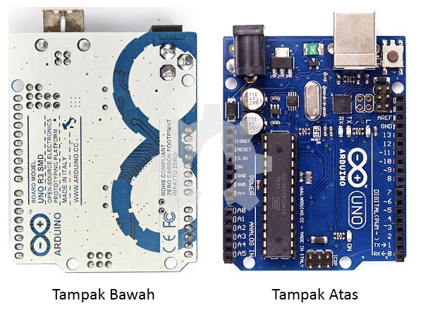
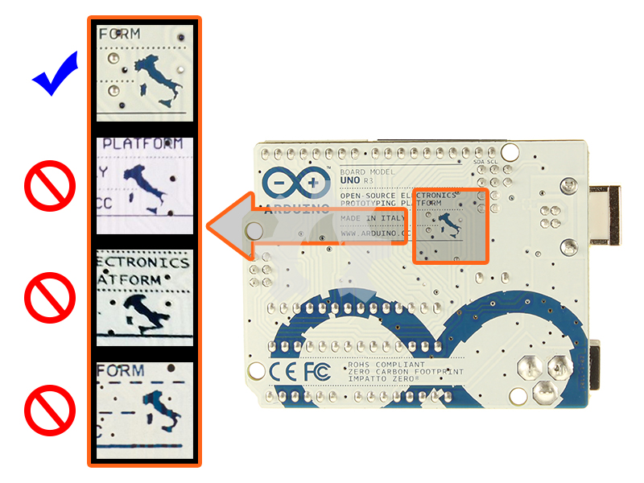
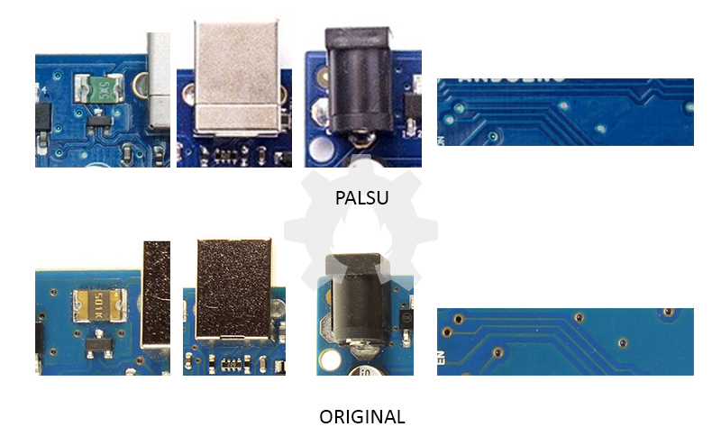
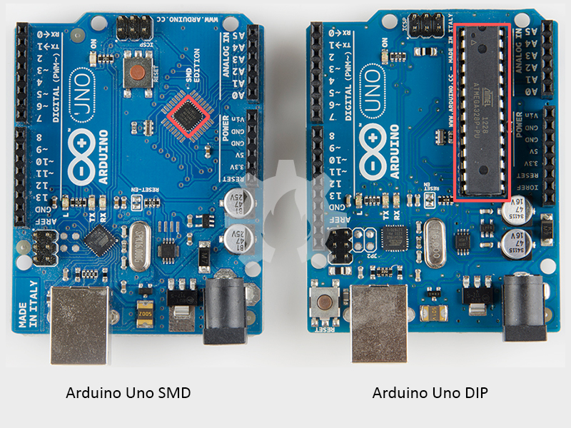

title: Memilih Arduino Uno Untuk Pemula
description: Arduino Uno Original, Arduino Compatible dan Arduino Clone menjadi sangat membingungkan bagi para pemula yang hendak belajar tentang pemrograman Arduino
hero: Memilih Arduino Uno Untuk Pemula
path: tree/master/docs/blog/2019
source: memilih-arduino.md
disqus: henduino

# Memilih Arduino Uno Untuk Pemula

Arduino Uno Original, Arduino Compatible dan Arduino Clone menjadi sangat membingungkan bagi para pemula yang hendak belajar tentang pemrograman Arduino. Arikel ini membahas tips dan trik menentukan pilihan papan Arduino Uno yang tepat terutama bagi pemula. Tepat sesuai dengan tujuan penggunaan dan tepat sesuai dengan dana yang dimiliki oleh penggunanya. Informasi tentang jenis-jenis Arduino yang ada dipasaran Indonesia tidak terlalu jelas, bahkan beberapa penjual Arduino sengaja tidak memberikan informasi detail tentang Arduino Uno yang dijualnya.

Arduino Uno merupakan salah satu varian dari keluarga Arduino. Seperti dibahas sebelumnya mengenai "[Apa itu Arduino?][1]", diharapkan ada sedikit gambaran mengenai fungsi, spesifikasi dan hal-hal lain tentang Arduino. Ketika akan memulai belajar tentang Arduino, terutama pemula, maka kita akan dihadapkan pada pemilihan yang tepat tentang papan Arduino yang akan digunakan. 

Beberapa pertanyaan akan muncul dalam benak para pengguna pemula, diantaranya:

1. Arduino tipe apa yang akan digunakan untuk belajar? Hal ini karena ada banyak tipe atau varian dari keluarga Arduino. Ada Arduino Uno, Arduino Leonardo, Arduino Nano, Arduino Pro Mini, Arduino Pro Micro, Arduino Mega2560, Arduino Mega ADK, Arduino Yun, dan masih ada beberapa varian lagi baik yang dikembangkan oleh perusahaan Arduino-nya atau yang dikembangkan oleh perusahaan rekanan. Jika papan Arduino yang akan dibeli bertujuan sebagai sarana pembelajaran, maka lebih baik anda menggunakan papan Arduno Uno. Hal ini karena papan Arduino Uno merupakan papan standar yang banyak digunakan sebagai awal pembelajaran pemrograman robotika diseluruh dunia, mudah didapat, dan relatif lebih murah.

2. Pilih Arduino Original atau Arduino Compatible? Pertanyaan ini yang paling membingungkan karena berhubungan dengan anggaran yang akan digunakan. Rasa takut dan bingung membuat para pengguna pemula sering membatalkan pembelian. "Apa bedanya sih papan Arduino original dengan papan Arduino compatible? Kok harganya beda jauh...? Beli murah takutnya bajakan, beli yang mahal tidak ada dananya..."

* * *

## Arduino Uno Original

Arduino Uno Original adalah papan Arduino Uno yang dibuat oleh perusahaan yang ditunjuk oleh perusahaan Arduino dan dijual pada situs resmi Arduino dan atau pada toko yang telah menjalin kerjasama secara resmi dengan perusahaan Arduino.

*Gambar 1. Arduino Uno Original*

Namun, kita bisa saja menemukan papan Arduino original di toko-toko yang tidak secara resmi tercantum sebagai pihak yang ditunjuk oleh perusahaan Arduino. Dibawah ini adalah toko-toko resmi di Indonesia yang menjual papan Arduino dengan kualitas original:

!!! info "DigiWare Surabaya"
	* (DigiWare, Surabaya, East Java, Indonesia)
	* Email: onlineorder@digiwarestore.com
	* Phone/Fax : +62-31-5039460
	* Whatsapp: 62-81-259 989 885
	* Line: @digiware_store
	* Situs: [DigiWare][2]

!!! info "DigiWare Bandung"
	* (DigiWare, Bandung, West Java, Indonesia)
	* Email: digiware.bandung@digiwarestore.com
	* Phone: +62-22-7276690
	* Whatsapp: 62-82-126 168 065
	* Line: @digiware_store

!!! info "RDD Technologies"
	* Bandung - Indonesia
	* Tel. +62811540593
	* Whatsapp: +6281321099180
	* Email: support@rdd-tech.com
	* Situs: [RDD Technologies][3]

* * *

## Arduino Uno Compatible

Sedangkan Arduino Uno Compatible adalah papan Arduino Uno yang dibuat dan dikembangkan oleh perusahaan rekanan yang bukan bagian atau bawahan perusahaan Arduino. Perusahaan ini membuat papan yang memiliki fungsi sama dengan Arduino Uno tetapi tidak menggunakan nama "Arduino Uno". Hal ini karena sifat Arduino yang open hardware sehingga siapapun bisa membuat dan menjual papan Arduino-nya dengan syarat "tidak menggunakan nama yang sama dengan merk dagang produk yang dibuat oleh perusahaan Arduino" kecuali perusahaan tersebut telah mendapat ijin dari pihak Arduino untuk menggunakan nama merk dagang tersebut. Beberapa perusahaan membuat papan Arduino Compatible dengan melakukan beberapa perubahan rangkaian dan komponen namun tetap memiliki fungsi dan perlakukan yang sama dengan Ardiuno Uno asli.

*Gambar 2. Arduino Uno Compatible*

Beberapa merk dagang papan Arduino yang dibuat oleh pihak rekanan misalnya; RedBoard dibuat oleh Sparkfun, Seeeduino dibuat oleh Seeed Studio, Arduino Nano dibuat oleh Gravitech, Freeduino dibuat oleh Freeduino, dan masih banyak lagi Arduino Uno Compatible lainnya. Beberapa papan diberi nama menggunakan merk dagang "Arduino", penggunaan merk dagang ini diperbolehkan jika telah di beri ijin oleh perusahaan Arduino.
Namun sebenarnya pihak Arduino tidak pernah menyatakan bahwa papan-papan Arduino yang dibuat oleh pihak lain diperbolehkan dengan sebutan Arduino Uno Compatible. Pihak Arduino tetap menyatakan bahwa Arduino Compatible adalah palsu atau bajakan. Dan pihak rekanan sebagai pembuat papan Arduino Compatible pun tidak pernah menyatakan produk mereka dengan istilah Arduino Compatible. Misal Sparkfun, perusahaan ini tidak pernah menyebut RedBoard itu sebagai Arduino Uno Compatible, mereka tetap menyatakan dengan nama RedBoard tanpa menggunakan kata "Arduino", "Uno" ataupun "Compatible".

* * *

## Arduino Uno Palsu

Arduino Uno Palsu atau dikenal dipasaran dengan nama Arduino Uno Clone adalah papan Arduino Uno yang dibuat oleh orang atau perusahaan tanpa nama dengan segala halnya sama persis dengan papan Arduino Uno original. Menggunakan merk dagang "Arduino Uno", dengan warna yang hampir sama, dengan tata letak yang sama, dengan komponen yang hampir sama, segala halnya disamakan dengan Arduino Uno original.

*Gambar 3. Arduino Uno Palsu*

Bahkan penulis memiliki satu papan Arduino Uno Palsu dengan kualitas yang hampir sama dengan aslinya yang dipasaran Indonesia sering di kenal dengan "Arduino Uno Grade A". Arduino Uno Grade A memiliki tata letak komponen yang sangat rapi, kualitas cat yang bagus, masking atas bawah yang bagus, komponen dengan kualitas lumayan bagus, walaupun sebenarnya jika kita jeli akan ditemukan beberapa perbedaan mencolok. Yang menjadi pertanyaan "Kenapa mereka harus membajak?". Padahal jika diberi nama lain, misal "Henduino" maka papan tersebut akan masuk kategori Arduino Compatible. Papan Arduino dikembangkan dibawah lisensi Open Source Open Hardware yang ini berarti siapapun dapat membuat, mengembangkan dan menjualnya kepasaran internasional dengan syarat "tidak menggunakan merk dagang yang sama dan tidak membuat papan dengan segala hal yang sama, harus ada pengembangan atau modifikasi".
Arduino Uno bajakan dijual dengan harga sangat murah jika dibandingkan dengan Arduino Uno original. Dalam hal ini penulis tidak menyarankan apa-apa, apakah harus original atau bajakan. Kembali kepada anda sebagai pengguna.

* * *

## Perbedaan Arduino Original dengan Arduino Palsu

Mau menggunakan Arduino Uno original, compatible, atau bahkan clone adalah menjadi hak para penggunanya. Namun untuk para pembuat papan Arduino Clone, semestinya mereka tidak menggunakan merk dagang "Arduino" hal ini karena pengembang Arduino sudah bermurah hati dengan lisensi Open Hardware untuk papan Arduino-nya dan lisensi Open Source untuk perangkat lunak Arduino IDE-nya. Penggunaan merk dagang "Arduino" hanya akan menyakiti dan merugikan perusahaan Arduino serta membingungkan dan merugikan konsumen.
Kita sebagai konsumen diharapkan bijak dan jeli dalam merencakan pembelian papan Arduino. Dibawah ini ada beberapa indikator yang bisa kita gunakan untuk mengidentifikasi papan Arduino yang original dan yang bajakan.

* Warna

	Warna otentik papan Arduino adalah percampuran antara warna hijau dengan biru atau warna klasik lebut dan seperti warna pudar. Sedangkan papan Arduino palsu biasanya berwarna biru hingga warna biru tajam (dominan warna biru).

*Gambar 4. Warna Papan Arduino Original dan Bajakan*

* Logo

	Pada bagian logo Arduino, kita akan menemukan perbedaan yang cukup jelas. Perhatikan logo asli Arduino, dan bandingkan dengan yang palsu. Logo pada papan palsu tercetak kurang tajam, lubang pada huruf "A" menghilang, bagian tepi garis logo bergelombang dan kurang rapi terutama pada bagian lengkungan logo.

*Gambar 5. Logo Huruf Arduino Original dan Bajakan*

* Huruf

	Amati huruf dengan hati-hati pada kata "Arduino" dan "Uno" yang tertulis pada papan, maka akan ditemukan perbedaan. Jenis huruf Arduino di rancang secara khusus, sedangkan pada papan Arduino palsu atau bajakan cenderung diabaikan atau tidak sama persis. Perhatikan huruf "O" pada gambar!

* Peta

	Perhatikan juga bagian peta. Pada papan asli tampak dengan jelas peta negara Itali hal ini untuk menghormati tempat kelahiran Arduino. Sedangkan pada papan Arduino palsu peta tidak begitu jelas bahkan seperti layang-layang terbang.

*Gambar 6. Peta Arduino Original dan Bajakan*

* Jalur dan konektor

	Pada papan Arduino Asli terlihat jalur dan konektor antar komponen tampak rapi dan teranyam dengan indah. Sedangkan pada papan Arduino Palsu tampak berantakan dan jelek.

*Gambar 7. Jalur Komponen Arduino Original dan Bajakan*

* Komponen

	Komponen merupakan bagian yang paling sulit untuk dipalsukan. Komponen dengan kode 501K yang terletak dekat dengan Regulator Tegangan biasanya berwarna hijau pada papan Arduino palsu. Sebenarnya yang berwarna hijau memiliki properti yang hampir sama dengan yang digunakan pada papan Arduino Asli dengan warna emas-hitam. Hal ini menjadi hal spesial bagi Arduino Asli karena komponen ini merupakan komponen yang paling sulit di cari.

* Kata Kunci (Keyword)

	Sebenarnya para pembuat dan penjual papan Arduino palsu tahu bahwa mereka melanggar merk dagang. Makanya dalam menjualnya pun mereka tidak berani terang-terangan dengan mengatakan/menuliskan "Arduino Uno". Biasanya mereka menggunakan kata kunci pendekatan, misal; Arduino Uno Compatible, Arduino Uno Clone, Uno for Arduino, Arduino Uno Grade A, dan beberapa kata kunci yang mirip.

* Harga

	Inilah bagian yang paling mencolok diantara perbedaan yang sudah disebut diatas. Papan Arduino Palsu atau Clone dijual dengan harga sangat murah hingga 50% jika dibandingkan dengan harga papan Arduino Original. Papan Arduino Palsu dijual rata-rata setengah dari harga Arduino asli. Bahkan biasanya penjual memberikan tambahan berupa kabel data USB.

* * *

## ATmega328 DIP Chip dan SMD Chip

Pihak Arduino telah mengembangkan 2 versi Arduino Uno, yaitu Arduino Uno dengan mikrokontroller ATmega328 tipe DIP (Dual-Inline Package) dan Arduino Uno dengan mikrokontroller ATmega328 tipe SMD (Small Mount Device). Tipe DIP merupakan papan Arduino yang paling banyak kita temukan dipasaran. Chip mikrokontroller dipasang pada sebuah socket untuk memudahkan penggantian jika suatu hari mikrokontroller tersebut sudah habis masa guna-nya. Tipe DIP sangat cocok untuk para pemula yang sedang belajar dan sering melakukan upload kode.

*Gambar 8. Arduino Uno SMD dan Arduino Uno DIP*

Sedangkan tipe SMD menggunakan mikrokontroller berbentuk kecil yang tertanam langsung pada papan tanpa bisa dilepas. Jika masa guna-nya telah habis maka kita sulit untuk menggantinya. Tipe ini cocok digunakan untuk proyek robotik yang tidak terlalu sering melakukan upload kode.
Dari sisi harga, tipe SMD lebih murah dibandingkan dengan tipe DIP. Jika anda sedang belajar tentang pemrograman Arduino penulis menyarankan untuk memilih Arduino Uno dengan mikrokontroller tipe DIP.

* * *

## USB-to-Serial Chip

USB-to-Serial Chip yang digunakan pada Arduino Uno ada beberapa jenis, yaitu; ATmega16U2, FTDI dan CH340. Arduino Uno yang menggunakan USB-to-Serial dengan chip ATmega16U2 biasanya dibandrol dengan harga tertinggi. Sedangkan papan Arduino Uno yang menggunakan USB-to-Serial dengan chip FTDI dijual lebih murah.

*Gambar 9. USB-to-Serial Chip pada Arduino Uno*

Sedangkan yang termurah adalah papan Arduino Uno yang menggunakan USB-to-Serial dengan chip CH340, bahkan perbadaan harganya sangat jauh jika dibandingkan dengan yang menggunakan chip ATmega16U2 ataupun chip FTDI. Papan Arduino Uno yang menggunakan USB-to-Serial dengan chip CH340 dapat dipastikan sebagai papan Arduino Bajakan. Karena tidak ada satu varian pun Arduino yang menggunakan USB-to-Serial CH340. Namun demikian, papan Arduino Uno dengan USB-to-Serial CH340 tetap mampu bekerja dengan baik layaknya yang menggunakan chip FTDI ataupun ATmega16U2.

* * *

## Rekomendasi Pembelian

Untuk menentukan pilihan tepat tentang papan Arduino Uno yang akan dibeli maka kita harus mampu mendefinisikan maksud dan tujuan kita. Pada dasarnya ada 2 kepentingan, yaitu; (1) Membeli Arduino untuk belajar dan, (2) Membeli Arduino untuk sebuah proyek yang berhubungan dengan dana orang lain.
Jika rencananya untuk belajar tentang pemrograman Arduino maka akan lebih tepat untuk membeli Arduino Uno dengan harga murah, terlepas dari masalah original atau pun bajakan. Sesuaikan saja dengan ketersediaan dana yang anda miliki. Arduino dengan harga murah akan memaksimalkan proses pembelajaran, sedikit rasa takut baik takut rusak maupun takut masa guna-nya habis.

Jika rencananya untuk membuat proyek yang berhubungan dengan dana orang lain, maka akan lebih tepat untuk menggunakan Arduino berkualitas (Original). Hal ini karena Arduino original terjaga kualitasnya. Selain itu jika kita menggunakan Arduino Original berarti kita telah menjaga keberlangsungan perusahaan Arduino. Harga yang mahal setara dengan apa yang diberikan oleh perusahaan Arduino kepada penggunanya. Secara langsung kita telah membantu pendanaan perusahaan Arduino dan telah menciptakan:

1. Pengembangan hardware open source baru dan terbaru.
2. Dokumentasi yang lebih baik.
3. Sertifikat CE/FCC.
4. Kontrol Kualitas (Quality Control).
5. Memanajemen Komunitas.
6. Penerbitan Tutorial.
7. Menyumbang proyek open source lainnya.
8. Memelihara hosting/pemeliharaan website dan forum.

* * *

## Kesimpulan

Sebagai penegasan, bahwa di pasaran hanya ada 2 kategori, yaitu Original (Asli) dan Palsu (Bajakan). Tidak ada istilah compatible untuk mengkamuflasekan kualitas palsu. Artikel diatas menggunakan istilah compatible sebenarnya hanya untuk memudahkan pembagian papan Arduino yang beredar dipasaran. RedBoard, Seeduino, Arduino Nano, Freeduino adalah tetap masuk kategori original (asli) tetapi karena tidak dibuat oleh perusahaan Arduino maka dimasukan kategori compatible untuk mempermudah pemahaman. Dan harus diingat, istilah compatible yang digunakan di pasaran Indonesia maupun internasional tetap mengacu pada papan Arduino bajakan.

Jika kita ingin membantu pengembangan Arduino maka belilah Arduino Original atau Asli. Memang lebih mahal tapi dana tersebut digunakan untuk penelitian dan pengembangan Arduino dimasa mendatang. Tapi dana saya tidak cukup untuk membeli kualitas original? Ah itu sih terserah anda...
Jika dana tidak mencukupi untuk membeli kualitas original sebenarnya kita masih bisa untuk membuatnya sendiri tanpa harus membeli bajakan. Pada artikel mendatang akan dibahas cara membuat sendiri papan Arduino dengan fungsi sama dengan proses dan rangkaian yang lebih sederhana. Mau???

* * *

## Daftar Pustaka

1. [How to spot a counterfeit Arduino][4]
2. [Distributor Resmi Arduino][5]

[1]: https://henduino.github.io/library/papan/apa-itu-arduino/
[2]: https://digiwarestore.com/en/
[3]: http://rdd-tech.com/
[4]: https://www.arduino.cc/en/Products/Counterfeit
[5]: http://arduino.cc/en/Main/Buy

* * *