title: The Untold History of Arduino
description: Behind The Scene of Arduino
hero: The Untold History of Arduino
path: tree/master/docs/blog/2019
source: the-untold-history-of-arduino.md
disqus: hendriono

# The Untold History of Arduino

## Why Are You Writing This?

Hello.  My name is [Hernando Barragán][70].

Through the years, and more recently due to the affairs between [Arduino LLC and Arduino S.R.L.][1], I have received a lot of questions from people about the history of Wiring and, of course, Arduino.

I was also shown [this US Federal Courts website][2], which presents documents citing my work to support the plaintiff's claims which, in my opinion, contribute to the distortion of information surrounding my work.

The history of Arduino has been told by many people, and no two stories match.  I want to clarify some facts around the history of Arduino, with proper supported references and documents, to better communicate to people who are interested, about Arduino's origin.

As well, I will attempt to correct some things that have distorted my role or work by pointing out common mistakes, misleading information, and poor journalism.

I will go through a summary of the history first, then I will answer a series of questions that I have been often asked over the years.

* * *

## Why Did You Create Wiring?

I started Wiring in 2003 as my Master's thesis project at the [Interaction Design Institute Ivrea (IDII)][3] in Italy.

The objective of the thesis was to make it easy for artists and designers to work with electronics, by abstracting away the often complicated details of electronics so they can focus on their own objectives.

The full thesis document can be downloaded here:[http://people.interactionivrea.org/h.barragan/thesis/thesis_low_res.pdf][4]

Massimo Banzi and [Casey Reas][5] (known for his work on [Processing][6]) were supervisors for my thesis.

The project received plenty of attention at IDII, and was used for [several][7] other projects from 2004, up until the closure of the school in 2005.

Because of my thesis, I was proud to graduate with distinction; the only individual at IDII in 2004 to receive the distinction. I continued the development of Wiring while working at the [Universidad de Los Andes][8] in Colombia, where I began teaching as an instructor in Interaction Design.

What Wiring is, and why it was created can be extracted from the abstract section of my thesis document.  Please keep in mind that it was 2003, and these premises are not to be taken lightly.  You may have heard them before recited as proclamations:

> "... Current prototyping tools for electronics and programming are mostly targeted to engineering, robotics and technical audiences. They are hard to learn, and the programming languages are far from useful in contexts outside a specific technology ..."

> "... It can also be used to teach and learn computer programming and prototyping with electronics..."

> "Wiring builds on Processing..."

These were the key resulting elements of Wiring:

1.  Simple integrated development environment (IDE), based on the Processing.org IDE running on Microsoft Windows, Mac OS X, and Linux to create software programs or "sketches"[^1], with a simple editor
2.  Simple "language" or programming "framework" for microcontrollers
3.  Complete toolchain integration (transparent to user)
4.  Bootloader for easy uploading of programs
5.  Serial monitor to inspect and send data from/to the microcontroller
6.  Open source software
7.  Open source hardware designs based on an Atmel microcontroller
8.  Comprehensive online reference for the commands and libraries, examples, tutorials, forum and a showcase of projects done using Wiring

* * *

## How Was Wiring Created?

Through the thesis document, it is possible to understand the design process I followed.  Considerable research and references to prior work has served as a basis for my work. To quickly illustrate the process, a few key points are provided below.

### The Language

Have you ever wondered where those commands come from?

Probably one of the most distinctive things, that is widely known and used today by Arduino users in their sketches, is the set of commands I created as the language definition for Wiring.

*   `pinMode()`
*   `digitalRead()`
*   `digitalWrite()`
*   `analogRead()`
*   `analogWrite()`
*   `delay()`
*   `millis()`
*   etc...

Abstracting the microcontroller pins as numbers was, without a doubt, a major decision, possible because the syntax was defined prior to implementation in any hardware platform. All the language command naming and syntax were the result of an exhaustive design process I conducted, which included user testing with students, observation, analysis, adjustment and iteration.

As I developed the hardware prototypes, the language also naturally developed.  It wasn't until after the final prototype had been made that the language became solid and refined.

If you are still curious about the design process, it is detailed in the thesis document, including earlier stages of command naming and syntax that were later discarded.

### The Hardware

From a designer's point of view, this was probably the most difficult part to address.  I asked for or bought evaluation boards from different microcontroller manufacturers.

Here are some key moments in the hardware design for Wiring.

#### Prototype 1

The first prototype for Wiring used the [Parallax][9] Javelin Stamp microcontroller. It was a natural option since it was programmed in a subset of the Java language, which was already being used by Processing.

Problem: as described in the thesis document on page 40, compiling, linking and uploading of user's programs relied on Parallax's proprietary tools. Since Wiring was planned as open source software, the Javelin Stamp was simply not a viable option.

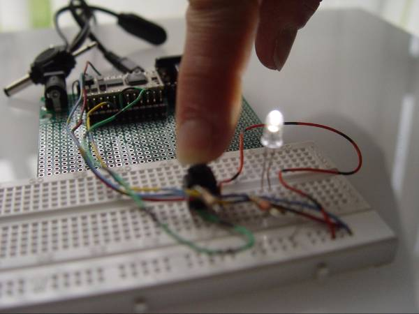

*Above: Cupcake indexer in progress*

For the next prototypes, microcontrollers were chosen on a basis of availability of open source tools for compiling, linking and uploading the user's code. This led to discarding the very popular Microchip PIC family of microcontrollers very early, because, at the time (circa 2003), Microchip did not have an open source toolchain.

#### Prototype 2

For the second Wiring hardware prototype, the [Atmel][10] ARM-based [AT91R40008][11] microcontroller was selected, which lead to excellent results.  The first sketch examples were developed and command naming testing began. For example, `pinWrite()` used to be the name of the now ubiquitous `digitalWrite()`.

The Atmel R40008 served as a test bed for the digital input/output API and the serial communications API, during my evaluation of its capabilities. The Atmel R40008 was a very powerful microcontroller, but was far too complex for a hands-on approach because it was almost impossible to solder by hand onto a printed circuit board.

For more information on this prototype, see page 42 in the thesis document.

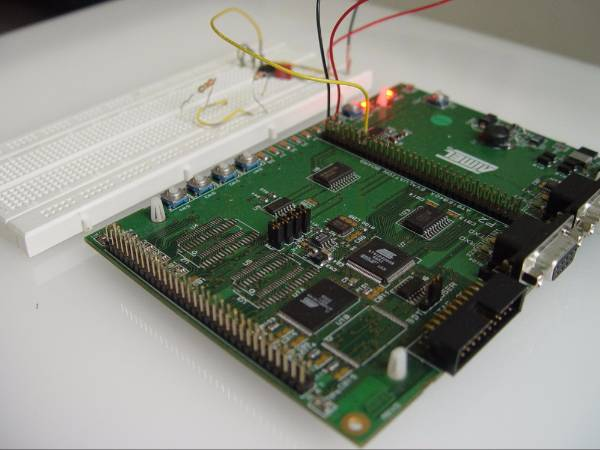

#### Prototype 3

The previous prototype experiments led to the third prototype, where the microcontroller was downscaled to one still powerful, yet with the possibility of tinkering with it without the requirements of specialized equipment or on-board extra peripherals.

I selected the Atmel [ATmega128][12] microcontroller and bought an Atmel [STK500][13]evaluation board with a special socket for the ATmega128.
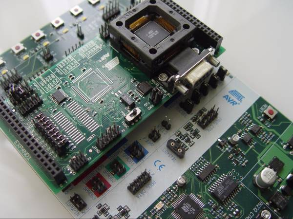
***Photo of Atmel STK500 with ATmega128 expansion.***

Tests with the STK500 were immediately successful, so I bought a [MAVRIC][14] board from [BDMICRO][15] with the ATmega128 soldered.  Brian Dean's work on his MAVRIC boards were unparalleled at that time, and his work drove him to build a software tool to easily upload new programs to his board.  It is still used today in the Arduino software, and is called "avrdude".

As traditional COM ports were disappearing from computers, I selected [FTDI][16] hardware for communication through a USB port on the host computer. FTDI provided drivers for Windows, Mac OS X and Linux which was required for the Wiring environment to work on all platforms.
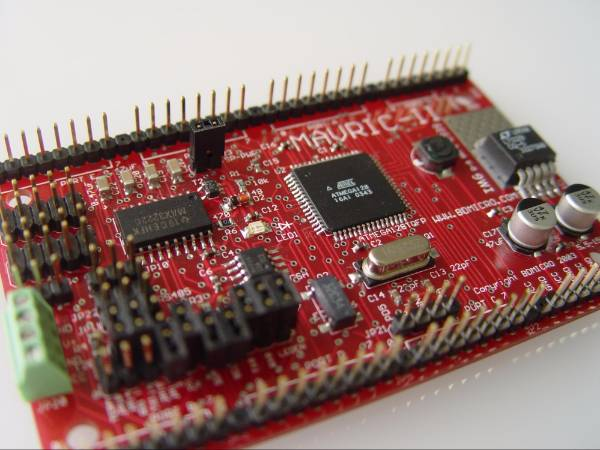
***Photo of BDMICRO MAVRIC-II used for the third Wiring hardware prototype.***
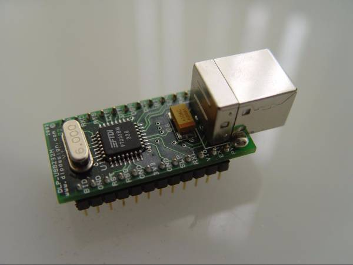
***Photo of an FTDI FT232BM evaluation board used in the third Wiring hardware prototype.***

The FTDI evaluation board was interfaced with the MAVRIC board and tested with the third Wiring prototype.
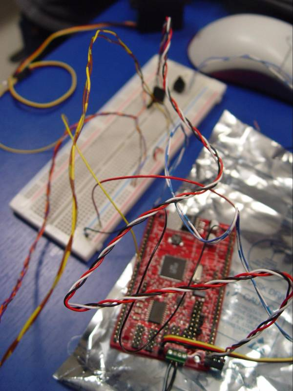
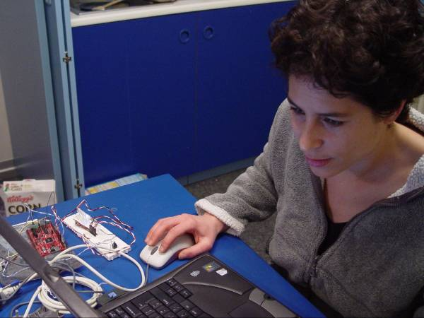
***Testing with the BDMICRO MAVRIC-II board and FTDI-FT232BM.***

In early 2004, based on the prototype using the MAVRIC board (Prototype 3), I used Brian Dean's and Pascal Stang's schematic designs as a reference to create the first Wiring board design.  It had the following features:

*   ATmega128
*   FTDI232BM for serial to USB conversion
*   An on-board LED connected to a pin
*   A power LED and serial RX/TX LEDs

I used [Eagle PCB from Cadsoft][17] to design the schematic and printed circuit board.

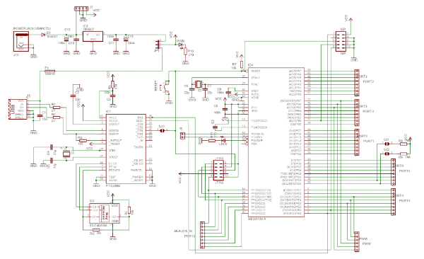

***Wiring board schematic.***

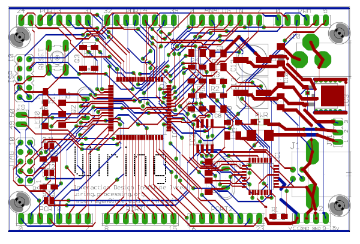

***Wiring board printed circuit board layout.***

Along with the third prototype, the final version of the API was tested and refined. More examples were added and I wrote the first LED blink example *that is still used today* as the first sketch that a user runs on an Arduino board to learn the environment. Even more examples were developed to support liquid crystal displays (LCDs), serial port communication, servo motors, etc. and even to interface Wiring with Processing via serial communication. Details can be found on page 50 in the thesis document.

In March 2004, 25 Wiring printed circuit boards were ordered and manufactured at [SERP][18], and paid for by IDII.

I hand-soldered these 25 boards and started to conduct usability tests with some of my classmates at IDII. It was an exciting time!

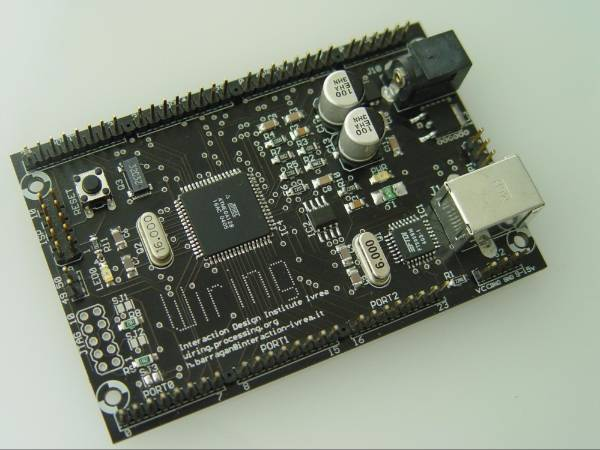
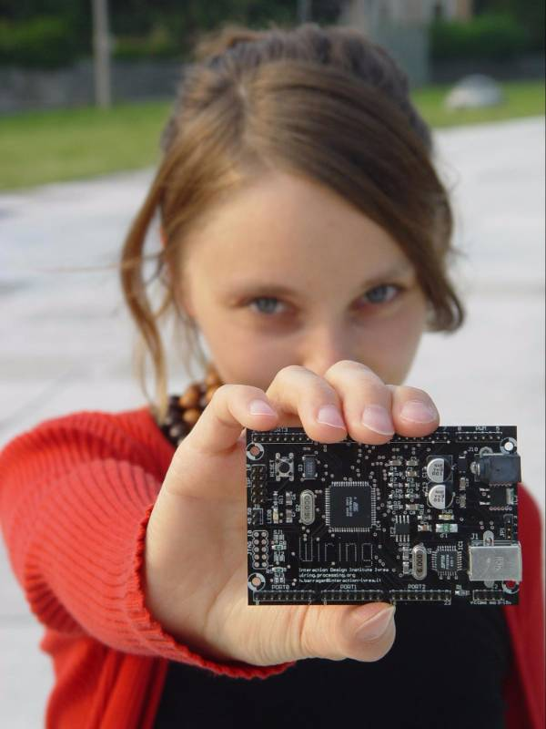
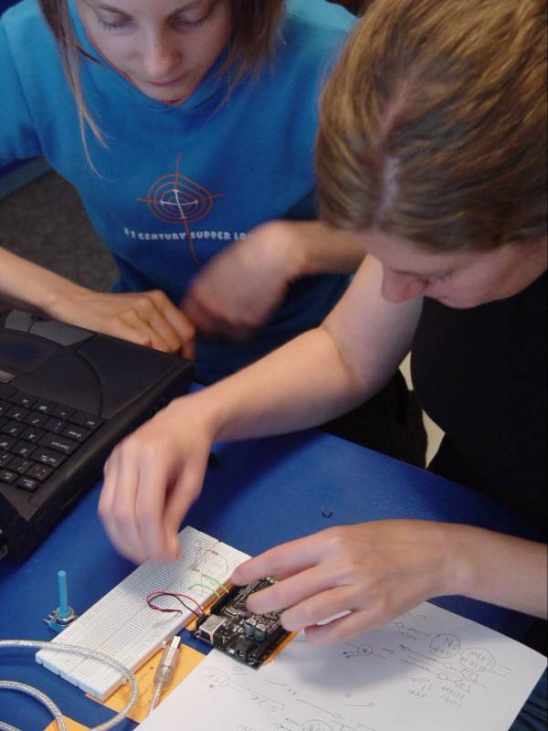
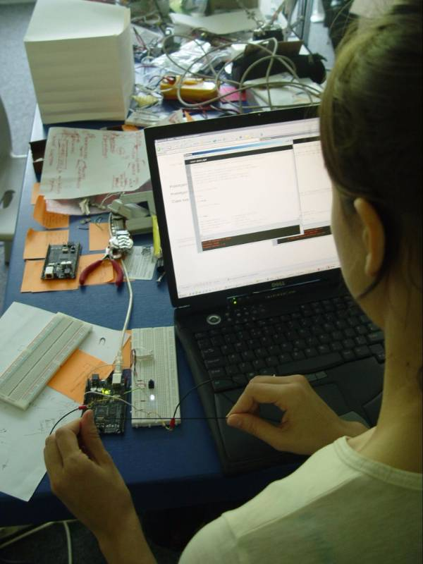

***Photos of the first Wiring board***

### Continuing the Development

After graduating from IDII in 2004, I moved back to Colombia, and began teaching as an instructor in Interaction Design at the Universidad de Los Andes. As I continued to develop Wiring, IDII decided to print and assemble a batch of 100 Wiring boards to teach physical computing at IDII in late 2004. [Bill Verplank][19] (a former IDII faculty member) asked Massimo Banzi to send 10 of the boards to me for use in my classes in Colombia.

In 2004, Faculty member [Yaniv Steiner][20], former student of Giorgio Olivero and Paolo Sancis, started the [Instant Soup Project][21], based on Wiring at IDII.

### First Major Success - Strangely Familiar

In the autumn of 2004, Wiring was used to teach physical computing at IDII through a project called Strangely Familiar, consisting of 22 students, and 11 successful projects. Four faculty members ran the 4-week project:

*   Massimo Banzi
*   Heather Martin
*   Yaniv Steiner
*   Reto Wettach

It turned out to be a resounding success for both the students as well as the professors and teachers.  Strangely Familiar demonstrated the potential of Wiring as an innovation platform for interaction design.

On December 16th, 2004, Bill Verplank sent an email to me saying:

>[The projects] were wonderful.  Everyone had things working.  Five of the projects had motors in them!  The most advanced (from two MIT grads - architect and mathematician) allowed drawing a profile in Proce55ing and feeling it with a wheel/motor run by Wiring...

>It is clear that one of the elements of success was [the] use of the Wiring board.

Here is the brief for the course:

* [http://wiring.org.co/exhibition/images/brief.pdf][22]

Here is a booklet with the resulting projects:

* [http://wiring.org.co/exhibition/images/book01.pdf][23]

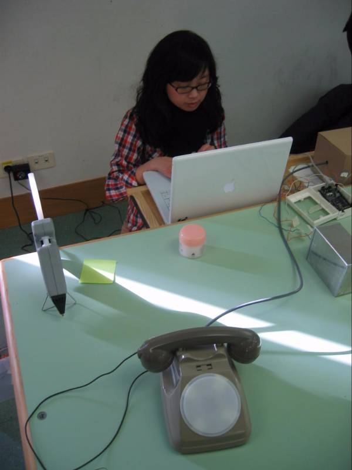
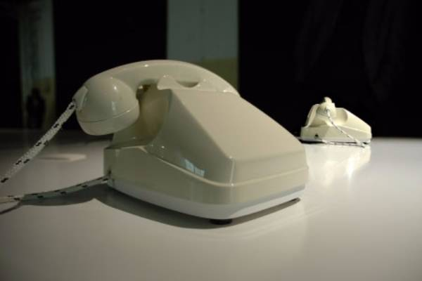

***Tug Tug phones by Haiyan Zhang (with Aram Armstrong)***

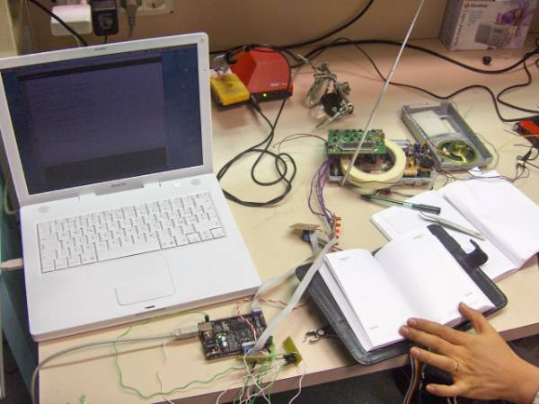
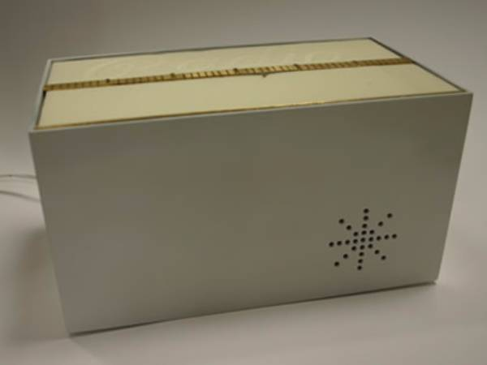

***[Commitment Radio][24] by David Chiu and Alexandra Deschamps-Sonsino***

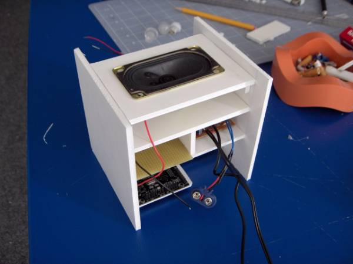
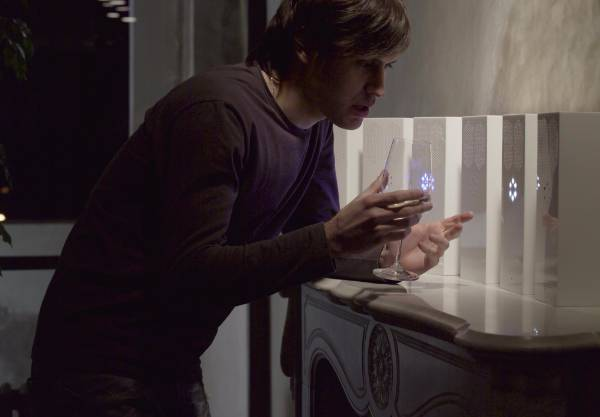

***[Speak Out][25] by Tristam Sparks and Andreea Cherlaru (with Ana Camila Amorim)***

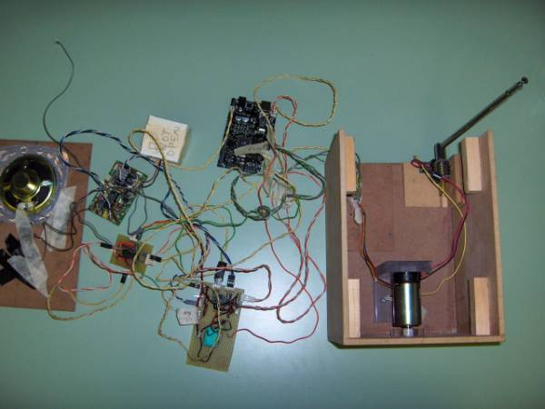
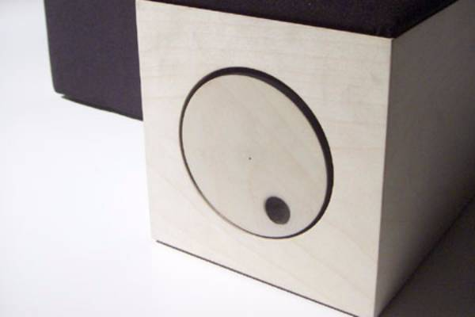

***Feel the Music I by James Tichenor and David A. Mellis***

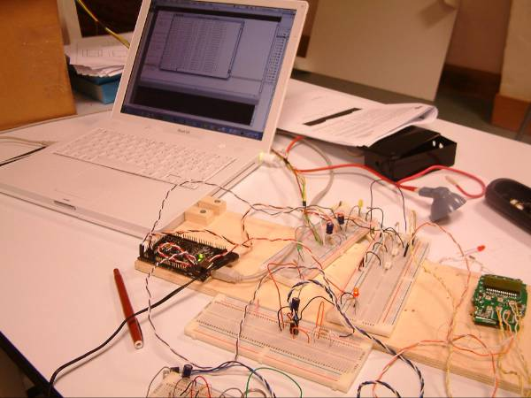
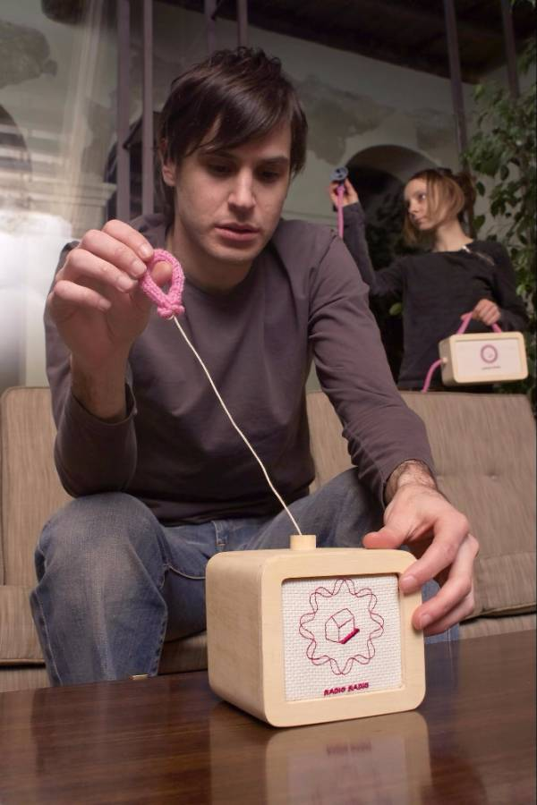

***[The Amazing All Band Radio][26] by Oren Horev & Myriel Milicevic (with Marcos Weskamp)***

### The Rest of the World

In May 2005, I contracted [Advanced Circuits][27] in the USA to print the first 200 printed circuit boards outside of IDII, and assembled them in Colombia.  I began selling and shipping boards to various schools and universities, and by the end of 2005, Wiring was being used around the world.

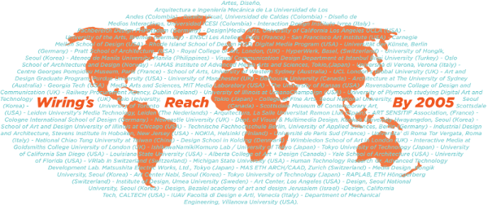

***"Wiring's Reach by 2005" graphic, provided by [Collin Reisdorf][28]***

* * *

## When Did Arduino Begin and Why Weren't You a Member of the Arduino Team?

### The Formation of Arduino

When IDII manufactured the first set of Wiring boards, the cost was probably around USD$50 each. (I don't know what the actual cost was, as I wasn't involved in the process.  However, I was selling the boards from Colombia for about USD$60.)  This was a considerable drop in price from the boards that were currently available, but it was still a significant cost for most people.

In 2005, Massimo Banzi, along with David Mellis (an IDII student at the time) and David Cuartielles, added support for the cheaper ATmega8 microcontroller to Wiring. Then they forked (or copied) the Wiring source code and started running it as a separate project, called Arduino.

There was no need to create a separate project, as I would have gladly helped them and developed support for the ATmega8 and any other microcontrollers.  I had planned to do this all along.

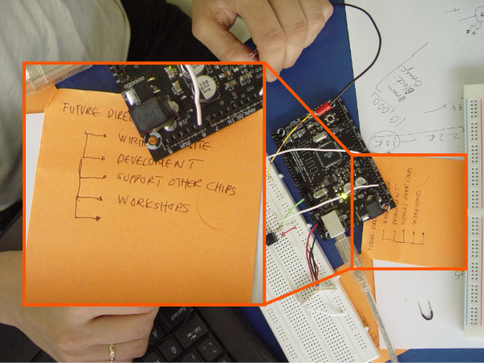

***I had inadvertantly taken a photo of some notes about my plans for Wiring, in the photo of Karmen Franinovic (former IDII student from 2002 to 2004) testing a stretch sensor for a lamp in March 2004.***

Wiring and Arduino shared many of the early development done by [Nicholas Zambetti][29], a former IDII student in the same class as David Mellis.  For a brief time, Nicholas had been considered a member of the Arduino Team.

Around the same time, Gianluca Martino (he was a consultant at SERP, the printed circuit board factory at Ivrea where the first Wiring boards were made), joined the Arduino Team to help with manufacturing and hardware development. So, to reduce the cost of their boards, Gianluca, with some help from David Cuartielles, developed cheaper hardware by using the ATmega8.

***Apparently this is [the first "Arduino" prototype][30] - dubbed Wiring Lite. I think Massimo Banzi designed this one, but I'm unsure.***

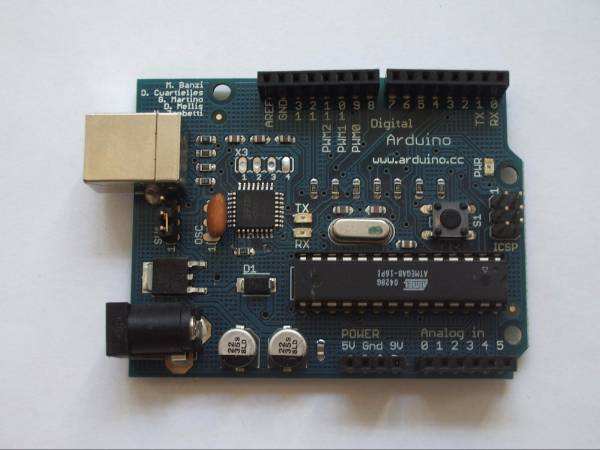

***[Arduino Extreme v2][31] - "Second production version of the Arduino USB boards. This has been properly engineered by Gianluca Martino."***

Tom Igoe (a faculty member at the ITP at NYU[^2]) was invited by Massimo Banzi to IDII for a workshop and became part of the Arduino Team.

To this day, I do not know exactly why the Arduino Team forked the code from Wiring.  It was also puzzling why we didn't work together. So, to answer the question, I was never asked to become a member of the Arduino Team.

Even though I was perplexed by the Arduino Team forking the code, I continued development on Wiring, and almost all of the improvements that had been made to Wiring, by me and plenty of contributors, were merged into the Arduino source code.  I tried to ignore the fact that they were still taking my work and also wondered about the redundancy and waste of resources in duplicating efforts.

By the end of 2005, I started to work with Casey Reas on a chapter for the book "[Processing: A Programming Handbook for Visual Artists and Designers][32]."  [The chapter][33] presents a short history of electronics in the Arts.  It includes examples for interfacing Processing with Wiring and Arduino. I presented those examples in both platforms and made sure the examples included worked for both Wiring and Arduino.

The book got a second edition in 2013 and the chapter was revised again by Casey and me, and [the extension][34] has been made available online since 2014.

* * *

## Did The Arduino Team Work with Wiring Before Arduino?

Yes, each of them had experience with Wiring before creating Arduino.

Massimo Banzi taught with Wiring at IDII from 2004.

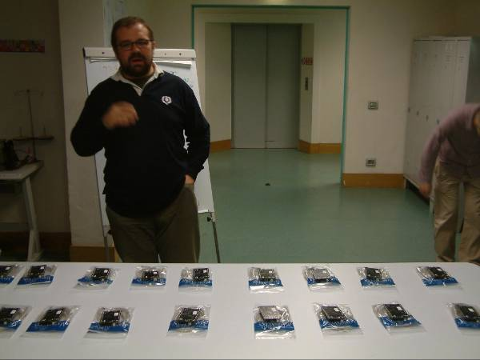

***Massimo Banzi teaching interaction design at IDII with Wiring boards in 2004.***

David Mellis was a student at IDII from 2004 to 2005.

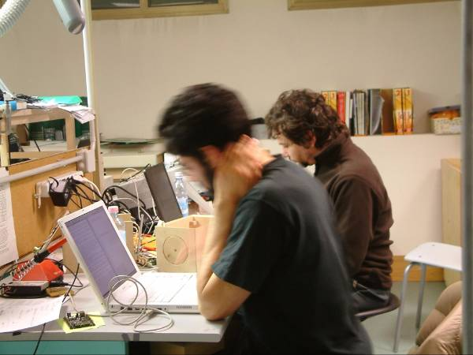

***A blurry version of David Mellis learning physical computing with Wiring in 2004.***

In January 2005, IDII hired David Cuartielles to develop a couple of plug-in boards for the Wiring board, for motor control and bluetooth connectivity.

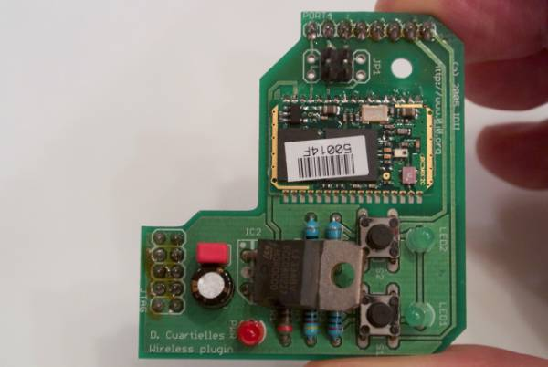

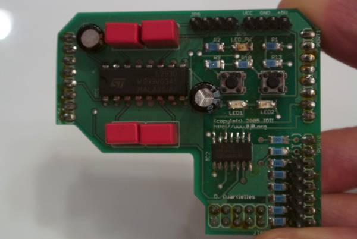

***Two plug-in boards developed at IDII by David Cuartielles and his brother. Bluetooth shield on the left, and a motor controller shield on the right.***

I showed early versions of Wiring to Tom Igoe during a visit to ITP in New York in 2003\. At the time, he had no experience with Atmel hardware, as Tom was using PIC microcontrollers at ITP as an alternative to the costly platforms like Parallax Basic Stamp or Basic X. One of Tom's recommendations at this visit was: "well, do it for PIC, because this is what we use here."

Years later, in 2007, Tom Igoe released the first edition of the "Making Things Talk" book published by O'Reilly[^3], which presents the use of both Wiring and Arduino.

Gianluca Martino originally worked for SERP (the factory that made the first 25 Wiring circuit boards) and later he founded Smart Projects SRL (April 1st, 2004).  Smart Projects made the first batch of 100 Wiring boards for IDII to teach physical computing in 2004.

* * *

## What is Programma2003 and How is it Related to You or to Wiring?

Programma2003 was a [Microchip][25] PIC microcontroller board developed by Massimo Banzi in 2003\. After using BasicX to teach Physical computing in the winter of 2002, Massimo decided to do a board using the PIC chip in 2003\. The problem with the PIC microcontrollers was that there wasn't an open source toolchain available at the time, to use a language like C to program them.

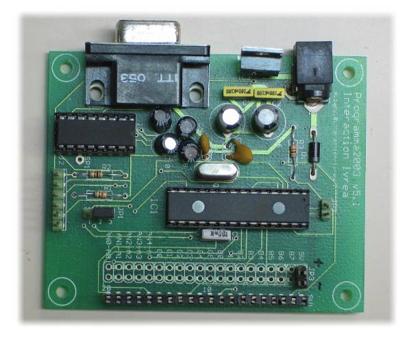

***[Programma2003][36] board designed by Massimo Banzi in 2003***

Because of the lack of an open source toolchain, Massimo decided to use an environment called [JAL][37](Just Another Language) to program the PIC microcontroller.  JAL was created by Wouter van Ooijen.

It consisted of the JAL compiler, linker, uploader, bootloader and examples for the PIC.  However, the software would only run on Windows.

To make JAL easier to use, Massimo used the base examples from JAL and simplified some of them for the distribution package for IDII.

However, in 2003, most students at IDII used Mac computers. So I volunteered to help Massimo by making a small and simple environment for Mac OS X so students with a Mac could use it as well.

In my thesis document, I characterized Programma2003 as a non-viable model to follow, since other more comprehensive tools were already available in the market. The main problems were:

*   the language is far from useful in any other context (e.g. you can't program your computer using JAL)
*   it's arcane syntax and the hardware design made it highly unlikely to go somewhere in the future for teaching and learning
*   the board didn't have a power LED (a design flaw)

It was impossible to know if it was powered or not (frustrating/dangerous in a learning environment) and an additional RS232 to USB expensive converter was required to connect it to a computer.

As a gesture to help Massimo's Programma2003 project, I also wrote something I called Programma2003 Interface, which basically interfaced any serial communication between a microcontroller and a computer with the network. This expanded the prototyping toolbox at IDII. It allowed students to use software like Adobe Flash (formerly Macromedia) to communicate with a microcontroller.

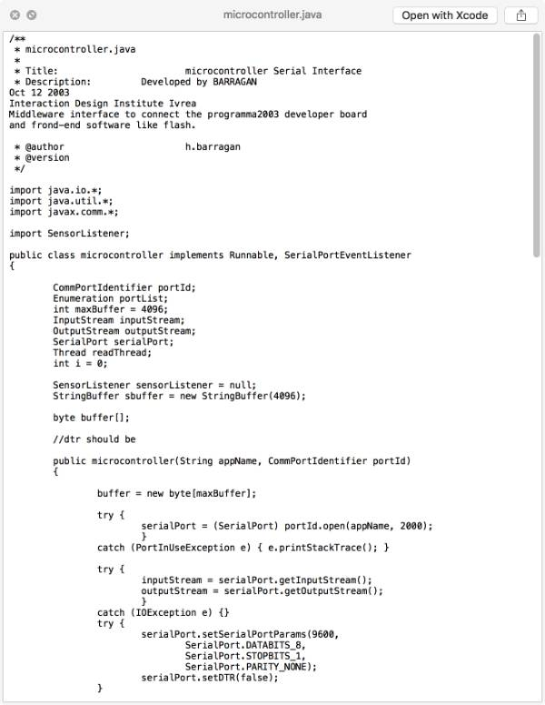

***Programma2003 Interface Code***

* * *

## Why Hasn't Arduino Acknowledged Wiring Better?

I don't know.

The reference to Wiring on the Arduino.cc website, although it has improved slightly over time, is misleading as it tries to attribute Wiring to Programma2003.

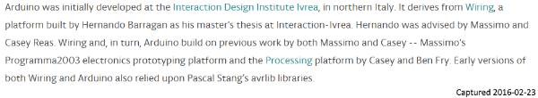

***Arduino.cc website version of Arduino's History from [https://www.arduino.cc/en/Main/Credits][38]***

Adding to the confusion is this Flickr photo album by Massimo Banzi:

[https://www.flickr.com/photos/mbanzi/albums/72157633136997919/with/8610131426/][39]

It is called "Teaching: IDII 2004 Strangely Familiar".  Strangely Familiar was taught with Wiring (see above). This photo album seems to associate the Programma2003 with the class, but it was, in fact, never used.  It is odd that the Wiring boards are absent from the album, however [one Wiring board picture][40] does appear.

It is no secret that the acknowledgement of Wiring has been very limited in the past. Back in 2013, at [Open Hardware Summit][41] at MIT, during the panel "Implications of Open Source Business: Forking and Attribution", David Mellis acknowledges, for the first time, that the Arduino Team hadn't done a very good job acknowledging Wiring. Unfortunately, he didn't go into details why they hadn't.

* * *

## The Plaintiff vs. The Defendant

I've been quiet about everything that has happened with Arduino for a long time.  But now that people are fraudulently saying that my work is their's, I feel like I need to speak up about the past.

For example, in the ongoing case between Arduino LLC and Arduino S.R.L., [there is a claim][42], by the Plaintiff, such that:

>34\. Banzi is the creator of the Programma2003 Development Platform, a precursor of the many ARDUINO-branded products. See: [http://sourceforge.net/projects/programma2003/][43]. Banzi was also the Master's Thesis advisor of Hernando Barragan whose work would result in the Wiring Development Platform which inspired Arduino.

Here is what, in my opinion, is wrong with that claim:

1.  The Programma2003 was not a Development Platform, it was simply a board.  There was no software developed by the Plaintiff to accompany that board.
2.  The link is empty, there are no files in that Sourceforge repository, so why present an empty repository as evidence?
3.  The idea that the mere fact that Banzi was my thesis advisor gives him some sort of higher claim to the work done on Wiring, is, to say the least, frustrating to read.

Further on:

>39\. The Founders, assisted by Nicholas Zambetti, another student at IDII, undertook and developed a project in which they designed a platform and environment for microcontroller boards ("Boards") to replace the Wiring Development Project. Banzi gave the project its name, the ARDUINO project.

Here are the questions I'd ask "The Founders:"

*   Why did the "Wiring Development Project" need to be replaced?
*   Did you ask the developer if he would work with you?
*   Did you not like the original name? (Banzi gave the project its name, after all)

I know it might be done now and again, but, in my opinion, it is unethical and a bad example for academics to do something like this with the work of a student.  Educators, more than anybody else, should avoid taking advantage of their student's work.  In a way, I still feel violated by "The Founders" for calling my work their's.

It may be legal to take an open source software and hardware project's model, philosophy, discourse, and the thousands of hours of work by its author, exert a branding exercise on it, and release it to the world as something "new" or "inspired", but... is it right?

* * *

## Continuous Misleading Information

Someone once said:

>"If we don't make things ultra clear, people draw their own conclusions and they become facts even if we never said anything like that."[^4]

It seems to me that this is universally true, and especially if you mislead people with only slight alterations of the truth, you can have control over their conclusions.

Here are a couple of mainstream examples of misleading information.

### The Infamous Diagram

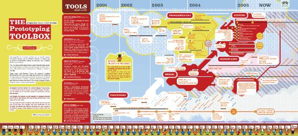

***[http://blog.experientia.com/uploads/2013/10/Interaction_Ivrea_arduino.pdf][44]***

This diagram was produced to tell the story of the prototyping tools developed at IDII. It was beautifully done by Giorgio Olivero, using the content provided by the school in 2005, and released in 2006.

The projects presented in the red blobs, although they were made with Wiring, appear to be associated with Arduino at a time *when Arduino didn't even exist*, nor was even close to being ready to do them.

Some of the authors of the projects inquired about the mistake, and why their projects were shifted to Arduino, but received no response.

Despite the fact that nothing was changed in this highly public document, I have to thank the support of the students who pointed it out and inquired about it.

### The Arduino Documentary

Another very public piece of media from 2010 was [The Arduino Documentary][45] (written and directed by Raúl Alaejos, Rodrigo Calvo).

This one is very interesting, especially seeing it today in 2016\. I think the idea of doing a documentary is very good, especially for a project with such a rich history.

Here are some parts that present some interesting contradictions:

[1:45][46] - "We wanted it to be open source so that everybody could come and help, and contribute."  It is suggested here that Wiring was closed source.  Because part of Wiring was based on Processing, and Processing was GPL open source, as well as all the libraries, Wiring, and hence Arduino, had to be open source.  It was not an option to have it be closed source.  Also, the insinuation that they made the software easier is misleading, since nothing changed in the language, which is the essence of the project's simplicity.

[3:20][47] - David Cuartielles already knew about Wiring, as he was hired to design two plug-in boards for it by IDII in 2005 as pointed out earlier in this document. David Mellis learned physical computing using Wiring as a student at IDII in 2004\. Interestingly, Gianluca came in as the person who was able to design the board itself (he wasn't just a contractor for manufacturing); he was part of the "Arduino Team".

[8:53][48] - David Cuartielles is presenting at the Media Lab in Madrid, in July 2005: "Arduino is the last project, I finished it last week.  I talked to Ivrea's technical director and told him: Wouldn't it be great if we can do something we offer for free? he says - For free? - Yeah!" David comes across here as the author of a project that he completed "last week", and convincing the "technical director" at IDII to offer it for free.

[18:56][49] - Massimo Banzi:

>For us at the beginning it was a specific need: we knew the school was closing and we were afraid that lawyers would show up one day and say - Everything here goes into a box and gets forgotten about. - So we thought - OK, if we open everything about this, then we can survive the closing of the school - So that was the first step.

This one is very special.  It misleadingly presents the fact of making Arduino open source as the consequence of the school closing.  This poses a question: why would a bunch of lawyers "put in a box" a project based on other open source projects?  It is almost puerile.  The problem is, common people might think this is true, forming altruistic reasons for the team to make Arduino open source.

* * *

## Absence of Recognition Beyond Wiring

There seems to be a trend in how the Arduino Team fails to recognize significant parties that contributed to their success.

In October 2013, Jan-Christoph Zoels (a former IDII faculty member) wrote to the IDII community mail list, a message presenting the article released at Core77 about the [Intel-Arduino news on Wired UK][50]:

>A proud moment to see Intel referring to an Interaction Ivrea initiative.

>And a good investment too:

>Arduino development was started and developed at Interaction Design Institute Ivrea with an original funding of circa 250.000€. Another good decision was to keep Arduino as open source at the end of Interaction Ivrea in 2005 before merging with Domus.

To which Massimo Banzi responded:

>I would like to point out that we never got any funding from Ivrea for Arduino (apart from buying 50 of them in the last year of the institute)

>250.000 EUR is ridiculous…

>This article must be retracted now

>Sorry JC but you had nothing to do.with  this.... You can't possibly try to get credit for.something you hadn't been involved with

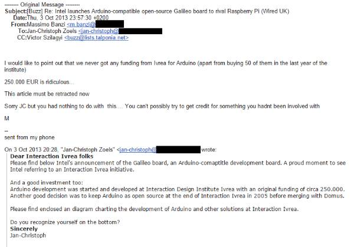

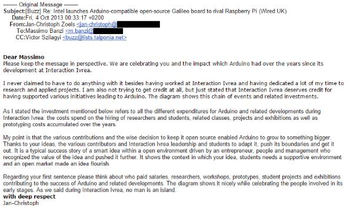

It was nice, however, to get this a few days later in the same email thread:

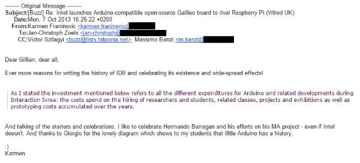

* * *

## Distorted Public Information

In this section, I just wanted to show a fraction of the many different articles (and other press) that have been written about Arduino, which include its history that is rarely told the same way twice.

So, please, read them at your leisure, and form your own opinions, and, definitely, ask questions!

### Poor Journalism

It is rare to see well researched journalism these days.  The articles below are excellent examples of that postulate.

#### Wired

In a [2008 Wired interview][51], Banzi explains how he did Arduino in a weekend:

>The two decided to design their own board and enlisted one of Banzi's students—David Mellis—to write the programming language for it. **In two days, Mellis banged out the code**; three days more and the board was complete. They called it the Arduino, after a nearby pub, and it was an instant hit with the students.

This article has been written without any fact checking.  It certainly doesn't help that the interviewee isn't telling them the right information.

#### IEEE Spectrum

Here is a [2011 IEEE Spectrum article][52], titled "The Making of Arduino".

Again, the history is taken verbatim from the interviewee.  I was not contacted before the article was published, even though I was mentioned.  And I doubt that anyone from IDII was contacted.

Just one of the many confusing parts of Arduino's history is in this quote:

>Since the purpose was to create a quick and easily accessible platform, they felt they'd be better off opening up the project to as many people as possible rather than keeping it closed.

It was never closed.

#### Circuits Today

[A 2014 article from Circuits Today][53] has a very confusing opening:

>It was in the Interactive Design Institute [sic] that a hardware thesis was contributed for a wiring design by a Colombian student named Hernando Barragan. The title of the thesis was "Arduino–La rivoluzione dell'open hardware" ("Arduino – The Revolution of Open Hardware"). Yes, it sounded a little different from the usual thesis but none would have imagined that it would carve a niche in the field of electronics.

>A team of five developers worked on this thesis and when the new wiring platform was complete, they worked to make it much lighter, less expensive, and available to the open source community.

The title of my thesis is obviously wrong.  There weren't five "developers" working on the thesis.  And the code was always open source.

Again, I wasn't contacted for reference.

#### Makezine

In [a 2013 interview by Dale Dougherty with Massimo Banzi][54], once again the story changes:

>Wiring had an expensive board, about $100, because it used an expensive chip.  I didn't like that, and the student developer and I disagreed.

In this version of the story by Massimo Banzi, Arduino originated from Wiring, but it is implied that I was insistent on having an expensive board.

Regarding the "disagreement": I never had a discussion with Massimo Banzi about the board being too expensive. I wish that he and I would have had more discussions on such matters, as I had with other advisors and colleagues, as I find it very enriching. The closest thing to a disagreement took place after a successful thesis presentation event, where Massimo showed some odd behaviour towards me. Because he was my advisor, I was at a disadvantage, but I asked Massimo why he was behaving badly towards me, to which I received no answer.  I felt threatened, and it was very awkward.

His odd behaviour extended to those who collaborated with me on Wiring later on.

>I decided that we could make an open source version of Wiring, starting from scratch. I asked Gianluca Martino [now one of the five Arduino partners] to help me manufacture the first prototypes, the first boards.

Here, Massimo is again implying that Wiring wasn't open source, which it was.  And also that they would build the software from "scratch", which they didn't.

### Academic Mistakes

I understand how easy it is to engage people with good storytelling and compelling tales, but academics are expected to do their homework, and at least check the facts behind unsubstantiated statements.

In this book, Making Futures: Marginal Notes on Innovation, Design, and Democracy Hardcover – October 31, 2014 by Pelle Ehn (Editor), Elisabet M. Nilsson (Editor), Richard Topgaard (Editor):

[Chapter 8: How Deep is Your Love? On Open-Source Hardware][55] (David Cuartielles)

!!! info
	In 2005, at the Interaction Design Institute Ivrea, we had the vision that making a small prototyping platform aimed at designers would help them getting a better understanding of technology.

David Cuartielles' version of Arduino's history doesn't even include Wiring.

This book has been released chapter by chapter under Creative Commons: [http://dspace.mah.se/handle/2043/17985][56]

## More Links for Your Perusal

Wiring as predecessor to Arduino:

* [http://ptgmedia.pearsoncmg.com/images/9780321906045/samplepages/9780321906045.pdf][57]

Interview with Ben Fry and Casey Reas:

* [http://rhizome.org/editorial/2009/sep/23/interview-with-casey-reas-and-ben-fry/][58]

Safari Books Online, Casey Reas, Getting Started with Processing, Chapter One, Family Tree:

* [https://www.safaribooksonline.com/library/view/getting-started-with/9781449379827/ch01.html][59]

Nicholas Zambetti Arduino Project Page:

* [http://www.zambetti.com/projects/arduino/][60]

(Nicholas did a lot of work with both Wiring and Arduino)

### Articles About Arduino vs. Arduino

**Wired Italy** - What's happening in Arduino?

[http://www.wired.it/gadget/computer/2015/02/12/arduino-nel-caos-situazione/][61]

**Repubblica Italy** - Massimo Banzi: "The Reason of the War for Arduino"

[http://playground.blogautore.repubblica.it/2015/02/11/la-guerra-per-arduino-la-perla-hi-tech-italiana-nel-caos/][62]

**Makezine** - Massimo Banzi Fighting for Arduino

[http://makezine.com/2015/03/19/massimo-banzi-fighting-for-arduino/][63]

**Hackaday** - Federico Musto of Arduino SRL discusses Arduino legal situation

[http://hackaday.com/2015/07/23/hackaday-interviews-federico-musto-of-arduino-srl/][64]

**Hackaday** - Federico Musto of Arduino SRL shows us new products and new directions

[http://hackaday.com/2016/01/04/new-products-and-new-directions-an-interview-with-federico-musto-of-arduino-srl/][65]

### Video

Massimo going to Ted Talk -- candid (2012-08-06)

This is a candid view of Massimo just before performing at a TED Talk.  You can make your own mind up about the majority of the video, however, the most interesting comment, in my opinion, is [at the end][66], where he says:

!!! info "Massimo going to Ted Talk"
	... Innovation without asking for permission. So, in a way, Open Source allows you to be innovative without asking for permission.

* * *

## Thank You!

Thank you for taking time to read this.  I think it is very important, not just in the academic world, to properly acknowledge the origin of things.  As I learned from fantastic educators, doing this properly not only enriches your work, but also positions it better to allow others to investigate and see where your ideas come from.  Maybe they will find other alternatives or improve what was done and better position their own ideas.

Personally, watching the outreach of what I created back in 2003 in so many different contexts, seeing those commands bringing to life people's ideas and creations from all over the world, has brought me so many satisfactions, surprises, new questions, ideas, awareness and friendships. I am thankful for that.

I think it is important to know the past to avoid making the same mistakes in the future.  Sometimes I wish I would have had a chance to talk about this differently, for a different motif. Instead, many times I have come across journalists and common people compromised in their independence. Either they had direct business with Arduino, or simply wanted to avoid upsetting Massimo Banzi. Or there are the close-minded individuals following a cause and refusing to see or hear anything different from what they believe. And then there are the individuals who are just part of the crowd that reproduce what they are told to reproduce. For those others, this document is  an invitation to trust your curiosity, to question, to dig deeper in whatever interests you and is important to you as an individual or as a member of a community.

I'll see you soon,

Hernando.

[^1]: 
The notion of a "Sketch" within the context of writing programs comes from Processing and previously from [Design by Numbers][67] (DBN). It was extended by Wiring within the context of prototyping with electronics or "sketching" with hardware.

[^2]:
Interactive Telecommunications Program at New York University

[^3]: 
Page 34, ISBN-13: 978-0596510510 ISBN-10: 0596510519, [http://www.amazon.com/Making-Things-Talk-Practical-Connecting/dp/0596510519/ref=sr_1_2?ie=UTF8&sr=8-2&keywords=Making+Things+Talk][68]

[^4]: 
[https://groups.google.com/a/arduino.cc/d/msg/developers/HEKecd0qhS4/nADS2jW6DgAJ][69]

[1]: http://hackaday.com/2015/03/12/arduino-v-arduino-part-ii/
[2]: https://www.unitedstatescourts.org/federal/mad/167131/
[3]: https://en.wikipedia.org/wiki/Interaction_Design_Institute_Ivrea
[4]: http://people.interactionivrea.org/h.barragan/thesis/thesis_low_res.pdf
[5]: https://en.wikipedia.org/wiki/C.E.B._Reas
[6]: https://en.wikipedia.org/wiki/Processing_(programming_language)
[7]: http://www.nastypixel.com/instantsoup
[8]: http://www.uniandes.edu.co/
[9]: https://www.parallax.com/
[10]: http://www.atmel.com/
[11]: http://www.atmel.com/devices/R40008.aspx
[12]: http://www.atmel.com/devices/ATMEGA128.aspx
[13]: http://www.atmel.com/tools/STK500.aspx
[14]: http://www.bdmicro.com/mavric-ib/
[15]: http://www.bdmicro.com/
[16]: http://www.ftdichip.com/
[17]: http://www.cadsoftusa.com/
[18]: http://www.serp.it/
[19]: http://www.billverplank.com/
[20]: http://www.nastypixel.com/prototype/people/yaniv-steiner-2
[21]: http://www.nastypixel.com/instantsoup/website/cover/
[22]: http://wiring.org.co/exhibition/images/brief.pdf
[23]: http://wiring.org.co/exhibition/images/book01.pdf
[24]: http://www.d4v3.net/resume/radios.php
[25]: http://www.andreeachelaru.com/ThesisOther.htm
[26]: http://neighbourhoodsatellites.com/project/the-amazing-all-band-radio/
[27]: http://www.4pcb.com/
[28]: https://twitter.com/nillocr
[29]: http://www.zambetti.com/projects/arduino/
[30]: https://www.flickr.com/photos/mbanzi/172472136/in/album-72157594173657338/
[31]: https://www.flickr.com/photos/mbanzi/172471940/in/album-72157594173657338/
[32]: http://www.amazon.com/Processing-Programming-Handbook-Designers-Artists/dp/0262182629
[33]: https://processing.org/tutorials/electronics/
[34]: https://processing.org/tutorials/electronics/
[35]: http://www.microchip.com/
[36]: https://www.flickr.com/photos/mbanzi/8610131426/in/album-72157633136997919/
[37]: http://justanotherlanguage.org/
[38]: https://www.arduino.cc/en/Main/Credits
[39]: https://www.flickr.com/photos/mbanzi/albums/72157633136997919/with/8610131426/
[40]: https://www.flickr.com/photos/mbanzi/8609019055
[41]: http://2013.oshwa.org/schedule/
[42]: https://www.unitedstatescourts.org/federal/mad/167131/1-0.html
[43]: http://sourceforge.net/projects/programma2003/
[44]: http://blog.experientia.com/uploads/2013/10/Interaction_Ivrea_arduino.pdf
[45]: https://vimeo.com/18539129
[46]: http://vimeo.com/18539129?#t=1m45s
[47]: http://vimeo.com/18539129?#t=3m20s
[48]: http://vimeo.com/18539129?#t=8m53s
[49]: http://vimeo.com/18539129?#t=18m56s
[50]: http://www.wired.co.uk/news/archive/2013-10/03/intel-arduino-galileo
[51]: http://www.wired.com/2008/10/ff-openmanufacturing/
[52]: http://spectrum.ieee.org/geek-life/hands-on/the-making-of-arduino
[53]: http://www.circuitstoday.com/story-and-history-of-development-of-arduino
[54]: http://makezine.com/2013/01/29/good-design-gets-out-of-the-way/
[55]: http://dspace.mah.se/bitstream/handle/2043/17985/MAKING-FUTURES-EHN-ET-AL-2014-CHAPTER-08.pdf?sequence=19&isAllowed=y
[56]: http://dspace.mah.se/handle/2043/17985
[57]: http://ptgmedia.pearsoncmg.com/images/9780321906045/samplepages/9780321906045.pdf
[58]: http://rhizome.org/editorial/2009/sep/23/interview-with-casey-reas-and-ben-fry/
[59]: https://www.safaribooksonline.com/library/view/getting-started-with/9781449379827/ch01.html
[60]: http://www.zambetti.com/projects/arduino/
[61]: http://www.wired.it/gadget/computer/2015/02/12/arduino-nel-caos-situazione/
[62]: http://playground.blogautore.repubblica.it/2015/02/11/la-guerra-per-arduino-la-perla-hi-tech-italiana-nel-caos/
[63]: http://makezine.com/2015/03/19/massimo-banzi-fighting-for-arduino/
[64]: http://hackaday.com/2015/07/23/hackaday-interviews-federico-musto-of-arduino-srl/
[65]: http://hackaday.com/2016/01/04/new-products-and-new-directions-an-interview-with-federico-musto-of-arduino-srl/
[66]: https://youtu.be/tZxY8_CNiCw?start=232
[67]: http://www.maedastudio.com/1999/dbn/index.php
[68]: http://www.amazon.com/Making-Things-Talk-Practical-Connecting/dp/0596510519/ref=sr_1_2?ie=UTF8&sr=8-2&keywords=Making+Things+Talk
[69]: https://groups.google.com/a/arduino.cc/d/msg/developers/HEKecd0qhS4/nADS2jW6DgAJ
[70]: http://arduinohistory.github.io