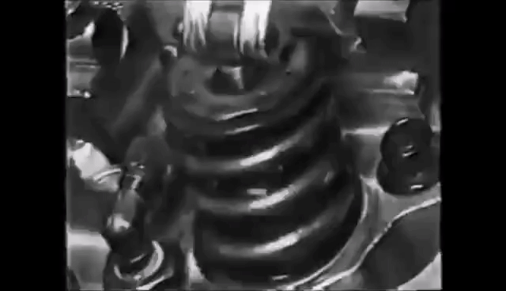
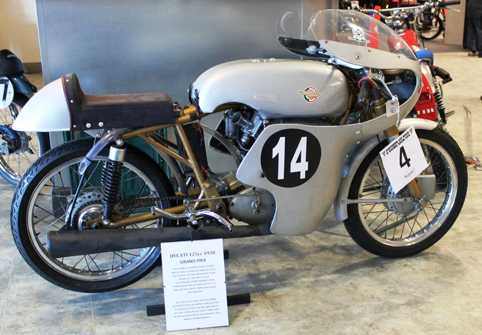
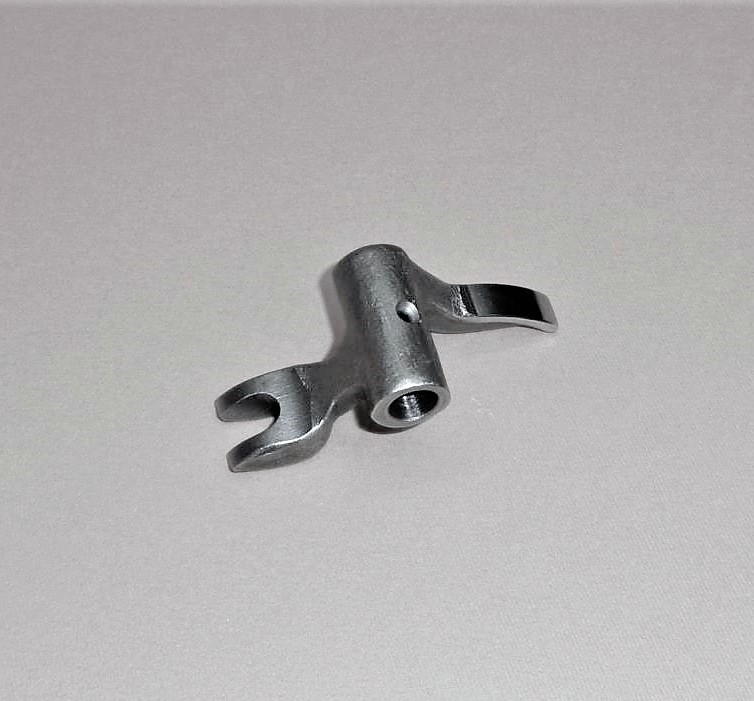
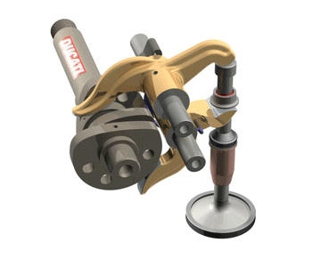
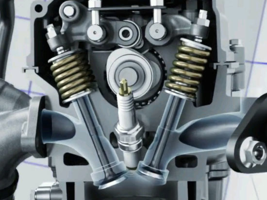
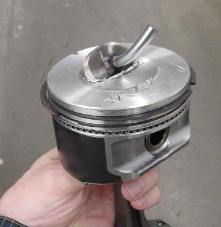
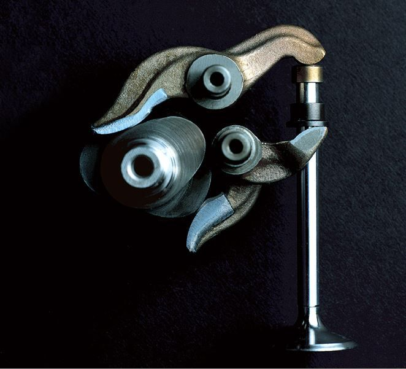

title: Mekanisme Katup Desmodromic
description: Mekanisme katup Desmodromic adalah mekanisme katup yang tidak menggunakan pegas untuk mengembalikan posisi katup setelah di tekan membuka namun menggunakan rocker arm penutup. Fabio Taglioni sering dikaitkan dengan penemu Desmodromic, namun sebenarnya bukanlah Ducati sebagai penemu Desmodromic.
hero: Mekanisme Katup Desmodromic
disqus: henduino

# Mekanisme Katup Desmodromic

Siklus pada mesin empat langkah diawali dengan proses pemasukan campuran udara bahan bakar dan diakhiri proses pembuangan sisa pembakaran. Mesin konvensional empat langkah memiliki katup sebagai pengatur proses-proses didalam silinder yang akan di buka oleh tonjolan yang disebut cam dan ditutup oleh pegas pengembali, mekanisme katup konvensional biasanya identik dengan mekanisme katup tipe [OHV](overhead-valve.md) dan [OHC](overhead-cam.md). Namun pada mesin dengan mekanisme katup desmodromic proses pembukaan dan penutupan katup dilakukan oleh dua cam dan dua aktuator, salah satu sebagai pembuka katup dan yang lainnya untuk menutup katup tanpa menggunakan pegas pengembali.

***

## Penamaan Desmodromic

Desmodromic berasal dari bahasa Yunani yang terdiri dari dua suku kata, yaitu ==desmos== (δεσμός) dan ==dromos== (δρόμος). *Desmos* berarti "terikat, terkontrol atau terhubung" dan *dromos* berarti "jalur", sehingga *desmodromic* bisa diartikan sebagai sebuah mekanisme katup yang terikat atau melekat kuat pada cam dan memiliki kinerja stabil yang tidak akan pernah keluar jalur. Dalam mekanika, ini digunakan untuk merujuk pada mekanisme yang memiliki kontrol untuk gerakan di satu arah dan kontrol khusus lainnya untuk gerakan di arah yang berlawanan ("penutupan" atau "kembali"). Saat ini, "desmodromic" biasanya mengacu pada sistem kontrol katup atau mekanisme katup yang khas digunakan sepeda motor Ducati.

***

## Ide Desmodromic

Penggunaan pegas katup baik pada tipe OHV atau OHC sebenarnya sudah cukup memuaskan sehingga umum digunakan pada mesin produksi masal dengan putaran yang tidak terlalu tinggi dan membutuhkan perawatan rendah. Pada periode pengembangan desmodromic, pegas katup menjadi isu utama karena performa mesin sangat terbatas hal ini disebabkan pegas katup akan patah atau pecah karena masalah tingkat kelelahan logam. Pada tahun 1950-an proses peleburan logam dengan vakum (*Vacuum Melt*) digunakan untuk membantu menghilangkan kotoran dari logam bahan pegas katup sehingga meningkatkan usia dan efisiensi. Namun demikian, masih banyak terjadi kegagalan operasi pada mesin ketika putaran diatas 8.000 RPM. Mekanisme katup (valvetrain) desmodromic dirancang untuk memperbaiki masalah ini dengan sepenuhnya menghilangkan kebutuhan pegas pengembali katup. Selain itu, seiring meningkatnya RPM maksimal, gaya pegas yang lebih tinggi diperlukan untuk mencegah katup mengambang (*Valve Float*), yang itu berarti menyebabkan peningkatan gesekan cam dan keausan yang lebih tinggi pada bagian-bagian mekanisme penggerak katup ketika mencapai kecepatan tinggi. Masalah tersebutlah yang mendasari pengembangan mekanisme katup tipe desmodromic.

*Gambar 1. Valve Float - Katup Mengambang*

***

## Desain dan Sejarah

Pengontrolan penggerak katup sudah dilakukan sejak masa-masa awal pengembangan mesin, tetapi merancang sistem mekanisme katup yang bekerja dengan andal dan tidak terlalu rumit ternyata membutuhkan waktu yang sangat lama. [Lihat Linimasa Desmodromic](https://henduino.github.io/library)

Desmodromic akan terasa sangat kental dengan pabrikan sepeda motor asal Itali yaitu Ducati, namun jauh hari sebelum tahun 1956, mekanisme katup tipe desmodromic telah mengalami perjalanan pajang, dengan berbagai prestasi yang ditorehkan dalam dunia balap. Tahun 1956 seorang insinyur mesin Ducati bernama Fabio Taglioni, berhasil menyempurnakan mekanisme katup Desmodromic yang sudah cukup lama menjadi bahan perencanaan, perbincangan hingga prototipe pada mesin-mesin balap maupun masal. Namun sebelum Taglioni menyempurnakan rancangannya, mekanisme katup Desmodromic tidaklah seperti mekanisme katup yang sekarang digunakan pada mesin Ducati.

*Gambar 2. Fabio Taglioni*

Fabio Taglioni lebih tepat di sebut sebagai pengembang, bukan pencipta mekanisme katup Desmodromic. Rancangan Desmodromic Taglioni digunakan untuk mengembangkan mesin Ducati 125 Grand Prix, dan terciptalah Ducati 125 Desmo.

*Gambar 3. Ducati 125 Desmo 1958*

!!! note "Kutipan Taglioni"

	Tujuan khusus dari sistem desmodromic adalah untuk memaksa katup agar sesuai dengan diagram waktu (timing diagram) sekonsisten mungkin. Dengan cara ini, energi yang hilang dapat diabaikan, kurva kinerja lebih seragam dan keandalan lebih baik.

Insinyur yang ada setelah Taglioni melanjutkan pengembangan Desmodromic, dan Ducati memegang sejumlah paten yang berkaitan dengan desmodromic. Mekanisme katup desmodromic telah diterapkan pada sepeda motor produksi terbaik Ducati sejak 1968, dengan diperkenalkannya silinder tunggal "widecase" Mark 3.

***

## Prinsip Kerja

Semua mesin empat langkah menggunakan cam untuk mendorong katup agar terbuka, terkadang dibantu oleh rocker arm, dan semua sepeda motor menggunakan pegas yang kuat untuk memaksa katup menutup. Semua sepeda motor, kecuali **Ducati**.

*Gambar 4. Rocker Arm Tutup Desmo*

Ducati menggunakan mekanisme katup desmodromic, yang disingkat *desmo*, dan perbedaannya terletak pada ==cara katup ditutup==. Alih-alih mengandalkan pegas untuk mendorong katup kembali ke dudukannya, kepala desmo memiliki cam lobe komplementer terpisah dan bercabang, rocker arm berbentuk L yang menempel pada *collar* yang terpasang pada batang katup dan bertindak untuk menarik katup agar tertutup. Jadi proses pembukaan dan penutupan katup dikontrol secara positif setiap saat dan mengikuti timing cam dengan tepat.

*Gambar 5. Prinsip Kerja Desmodromic*

Mengapa mekanisme katup yang tepat penting? Salah satunya adalah agar menghasilkan tenaga yang maksimal, tetapi juga untuk memastikan mesin tidak hancur sehingga potongan besi keluar dari pipa knalpot. Dahulu kala, hancurnya mekanisme katup cukup umum terjadi pada kurun waktu tahun 40-an dan 50-an ketika mesin balap mulai berputar sangat tinggi. Metalurgi hari itu tidak sebagus hari ini, dan pegas katup sering putus atau gagal mengembalikan katup ke tempat duduknya dengan cukup cepat, mengakibatkan hilangnya tenaga atau mesin meledak jika katup menabrak piston. Dan itu jelas bukan cara yang baik untuk memenangkan balapan.

Pada tahun 1956, Ducati di bawah bimbingan Fabio Taglioni, memutuskan untuk menghindari masalah pegas katup dengan memasang mekanisme katup desmodromik pada motor balap Grand Prix 125 miliknya. Sistem ini menjaga katup tetap terkendali pada putaran tinggi, Ducati memenangkan banyak balapan.

Ducati dan desmo mungkin identik, tetapi Ducati tidak menemukan teknologinya. Norton menerapkannya sebelum Ducati, dan Mercedes serta pabrikan mobil lain juga mencobanya, tetapi Ducati adalah satu-satunya perusahaan yang menerapkan mekanisme katup desmodromic ke dalam produksi massal dan itu menjadi ciri khas Ducato. Kesalahpahaman umum lainnya adalah bahwa tidak ada pegas apa pun pada mekanisme desmo. Tidak ada pegas coil pada setiap katup seperti pada katup konvensional, tetapi ada pegas yang cukup besar pada rocker arm penutup yang membantu katup menutup dan memastikan "collar" penutup tetap di tempatnya.

***

## Desmodromic v.s. Konvensional 

Pada mesin modern, kegagalan pegas katup pada RPM tinggi sebagian besar telah diperbaiki. Manfaat utama dari sistem desmodromic adalah mencegah terjadinya *valve float* (katup mengambang) pada rpm tinggi.

*Gambar 6. Single Overhead Cam*

Pada mekanisme katup pegas tradisional, saat kecepatan mesin meningkat, gaya inersia pada katup akan menurunkan kemampuan pegas untuk menutup sepenuhnya sebelum piston mencapai TMA (Titik Mati Atas). Ini dapat menyebabkan beberapa masalah. ***Pertama***, yang paling merusak, piston bertabrakan dengan katup dan keduanya hancur. ***Kedua***, katup tidak sepenuhnya kembali ke tempatnya sebelum pembakaran dimulai. Hal ini memungkinkan gas pembakaran keluar sebelum waktunya, ini mengarah pada penurunan tekanan kompresi di dalam silinder yang menyebabkan penurunan kinerja mesin. Ini juga dapat membuat katup menjadi terlalu panas, bahkan bengkok dan menyebabkan kegagalan yang parah. Pada mesin dengan pegas katup, penanggulangan masalah secara tradisional untuk kasus valve float adalah dengan meningkatkan kekerasan pegas. Ini meningkatkan kemampuan penutupan katup pada dudukan katup (tekanan statis yang menahan katup tertutup). Ini bermanfaat pada kecepatan mesin yang lebih tinggi karena pengaruh valve float yang disebutkan di atas. Kekurangannya adalah mesin harus bekerja lebih keras untuk membuka katup pada semua putaran mesin. Tekanan pegas yang lebih tinggi menyebabkan gesekan yang lebih besar (tentunya meningkatkan suhu dan keausan) pada seluruh bagian penggerak katup.

*Gambar 7. Kegagalan Mekanisme Katup*

Sistem desmodromik menghindari masalah tersebut, karena penggerak katup tidak harus melawan gaya pegas. Untuk mengatasi inersia pembukaan dan penutupan katup, itu sangat tergantung pada massa efektif dari bagian yang bergerak. Massa efektif katup tradisional dengan pegas termasuk didalamnya setengah dari massa pegas katup dan semua massa penahan pegas katup. Sedangkan, sistem desmodromic harus mampu menangani inersia dari dua rocker arm pada setiap katup, jadi keuntungan ini sangat bergantung pada keterampilan perancang. Kerugian lain yang harus diperhatikan adalah titik kontak antara cam dan rocker arm. Sebenarnya relatif mudah menggunakan tapet roller pada mekanisme katup konvensional, meskipun ia menambah massa bergerak yang cukup besar. Pada sistem desmodromic, roller akan dibutuhkan di setiap ujung rocker arm, yang akan mampu meningkatkan momen inersia dan menghilangkan "massa efektif". Dengan demikian, sistem desmo umumnya diperlukan untuk menangani gesekan antara cam dan rocker arm dan oleh karena itu desmo memiliki keausan yang lebih besar. Titik kontak pada sebagian besar rocker arm Ducati diperkeras untuk mengurangi keausan. Kerugian lain yang mungkin terjadi adalah akan sangat sulit untuk menggabungkan "*hydraulic valve lash adjuster*" (mekanisme penyetel celah katup hidrolik) dalam sistem desmodromic, sehingga katup harus distel secara berkala, tetapi ini hanya dilakukan untuk sepeda motor yang berorientasi pada kinerja karena penyetel celah katup biasanya disetel menggunakan shim di bawah "*cam follower*". 

***

## Kontroversi

Meskipun mekanisme katup desmodromic tidak ideal dalam dunia mekanika praktis, ia tetap bertahan dan bekerja tanpa masalah. Meskipun dapat lebih mahal perawatannya daripada mekanisme katup yang digerakkan pegas tradisional, banyak komponen mesin presisi purnajual dapat memperpanjang interval perawatan sehingga umur mesin bisa sebanding dengan sistem yang digerakkan pegas.

Sementara yang lebih baru, sistem pneumatik performa tinggi mungkin mengikuti spesifikasi desain dan teknik yang lebih spesifik (dengan bantuan komputer), sistem ini biasanya terbatas pada aplikasi balap (Formula 1, Moto GP, dan lain sebagainya). Saat ini, tidak ada metode untuk menentukan keawetan atau memperpanjang interval perawatan pada sistem praktis, sehari-hari, seperti halnya mobil.

*Gambar 8. Bagian Mekanisme Katup Desmo*

Meski desain desmodromic bisa lebih berisik, namun biasanya tertutup oleh kebisingan angin dan komponen mesin lainnya seperti saat proses pemasukan udara dan proses pembuangan sisa pembakaran. Meskipun suaranya *sangat keras sehingga tidak nyaman di mesin dengan empat silinder atau lebih*, jika benar, mungkin mesin akan dibuat terbatas (dalam hal ini Ducati) hanya untuk MotoGP, motor Replika Balap MotoGP, dan Ducati Panigale V4 2018, yang merupakan satu-satunya mesin desmodromic produksi saat ini yang menyuguhkan mesin empat silinder. (Namun demikian tingkat kebisingan knalpot dapat melebihi 110 dB pada sistem balapan penuh yang ini bisa menutup total kebisingan yang dihasilkan oleh desmodromic.)

***

## Daftar Pustaka

* [Desmodromic Valve][1]
* [Austin Marine Engines][2]
* [Desmodromic History][3]
* [About Fabio Taglioni][4]
* [Fabio Taglioni][5]
* [Desmodromology][6]
* [1974 Ducati 750 SS Green Frame][7]
* [Why Does Ducati Stick With Desmodromic Valve Operation?][8]
* [Here Is How Ducati's Desmodromic Valves Work][9]
* [The Return of the Twin][10]
* [Models from 1891 to the 20’s][11]
* [Birth of motor sport 120 years ago][12]
* [Panhard et Levassor][13]

[1]: https://en.wikipedia.org/wiki/Desmodromic_valve
[2]: http://www.austinmemories.com/page98/page98.html
[3]: http://www.italian.sakura.ne.jp/bad_toys/engine/engine05.html
[4]: http://www.ducatidesmo.com/taglioni.htm
[5]: https://www.ducati.com/ww/en/heritage/characters/fabio-taglioni
[6]: http://members.chello.nl/~wgj.jansen/
[7]: https://www.mecum.com/lots/LV0119-366191/1974-ducati-750-ss-green-frame/
[8]: https://www.cycleworld.com/2014/04/25/cw-tech-valve-control-history-and-why-ducati-is-committed-to-desmodromics/
[9]: https://jalopnik.com/here-is-how-ducatis-desmodromic-valves-work-1827954262
[10]: http://www.lightauto.com/The%20returnofthetwin.html
[11]: http://doyennes-panhard-levassor.fr/en/models-from-1891-to-the-20s-2/
[12]: https://media.daimler.com/marsMediaSite/en/instance/ko/Birth-of-motor-sport-120-years-ago-Daimler-engines-dominated-first-motor-car-race-in-1894.xhtml?oid=9919236
[13]: http://www.grandprixhistory.org/panhard.htm

***

<small>Artikel diperbarui pada: {{ git_revision_date_localized }}</small>