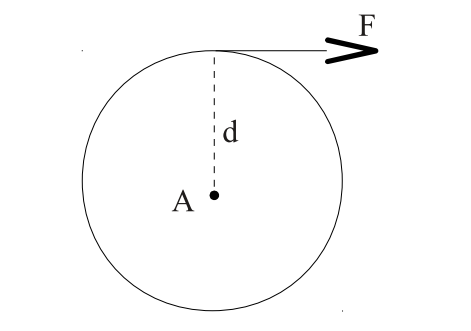
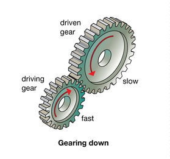
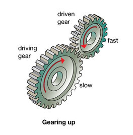

title: Rasio Roda Gigi, Torsi dan Kecepatan
description: Gear Ratio adalah jumlah rasio output dan input roda gigi pada porosnya. Torsi adalah ukuran dari kecenderungan gaya untuk memutar objek terhadap beberapa sumbu.
hero: Rasio Roda Gigi, Torsi dan Kecepatan
disqus: henduino

# Rasio Roda Gigi, Torsi dan Kecepatan

Perhitungan tentang roda gigi ini memang terkadang cukup membingungkan karena banyak faktor yang harus kita perhatikan. Hal ini tentunya memberikan tantangan tersendiri bagi siapa saja yang terlibat dalam dunia teknik mesin. Perhitungan roda gigi berpengaruh kepada banyak hal, dari mulai kecepatan tempuh, akselerasi, deselerasi, torsi atau daya dorong roda gigi, hingga tentang biaya produksi roda gigi. Roda gigi menjadi bagian dari banyak hal didunia ini, dari hal yang berukuran besar, hingga hal kecil seperti halnya mesin jam tangan. Artikel kali ini tidak akan jauh dari pembahasan tentang rasio roda gigi, torsi dari perkaitan roda gigi, dan kecepatan, baik kecepatan putar roda hingga kecepatan jangkauan roda.

!!! warning "PERHATIAN"
	Siapkan kopi, dan teman-temannya untuk menemani Anda belajar. Hindari membuka jejaring sosial, karena perhitungan dalam dunia teknik menuntut banyak sekali disiplin ilmu dari mulai matematika, fisika hingga komponen-komponen permesinan yang sering ditemukan. Sedangkan untuk mencetak halaman ini ke dalam format PDF, agar rumus ikut tercetak, render rumus dengan format SVG.

***

## Torsi

Torsi adalah ukuran dari kecenderungan gaya untuk memutar objek terhadap beberapa sumbu. Torsi dapat diartikan hanya berkaitan dengan sumbu tertentu, jadi kita membicarakan torsi tentang poros motor, torsi tentang axle (gandar), dan sebagainya. Untuk menghasilkan torsi, gaya harus bekerja agak jauh dari titik sumbu atau pivot. Misalnya, gaya yang diterapkan pada ujung pegangan kunci pas untuk memutar baut yang terletak pada rahang di ujung kunci pas menghasilkan torsi tentang baut. Demikian pula, suatu gaya yang diterapkan pada keliling roda gigi yang disatukan dengan poros menghasilkan torsi tentang poros. Jarak tegak lurus d dari garis gaya ke sumbu disebut lengan momen (*moment arm*). 

Pada gambar dibawah, lingkaran mewakili roda gigi dengan jari-jari d. Titik di tengah mewakili poros (A). Gaya F diterapkan pada tepi roda gigi, secara tangensial.



*Gambar 1. Lengan Momen*

Dalam contoh ini, jari-jari roda gigi adalah lengan momen. Gaya berlaku sepanjang garis singgung roda gigi, sehingga tegak lurus terhadap jari-jari. Jumlah torsi A pada poros roda gigi didefinisikan sebagai:

!!! info "Rumus Torsi"
	$$
	\mathbf{τ} = F \times d
	$$

Kami menggunakan huruf Yunani Tau (τ) untuk mewakili torsi. Satuan SI (metrik) untuk gaya adalah *newton*, dan satuan jarak adalah *meter*. Karena torsi adalah hasil perkalian gaya dikali jarak, satuan torsi adalah Newton-meter.

!!! fail "Kesalahan Penulisan Satuan"
	Jangan membacanya sebagai ~~newton per meter~~, yang akan menunjukkan pembagian, tetapi gunakan istilah hyphen *newton-meter*, atau lebih baik lagi *newton · meter*, menunjukkan bahwa itu adalah hasil perkalian.

Jadi, ingat gaya dan momen lengan (jarak), kita dapat menggunakan rumus tersebut untuk menghitung besar torsi. Sebagai contoh, mengacu pada Gambar 1, jika kita memberi gaya F sebesar 20 newton dan jari-jari d adalah 3 cm (0,03 meter), maka kita dapat menghitung torsi pada poros A sebagai berikut:

!!! info "Menghitung Torsi"
	$$
	\mathbf{τ} = 20Newton \times 0,03meter = 0,6 Newton.meter
	$$

Sebaliknya, jika kita sudah mengetahui torsi yang bekerja pada poros dan juga mengetahui radiusnya (jari-jarinya), maka kita dapat menghitung gaya yang berlaku di sepanjang garis singgung tepi roda dengan membagi torsi di bagi lengan momen. Ini berguna karena memungkinkan kita untuk mengetahui gaya horizontal roda terhadap lantai, yang mendorong roda untuk bergerak.

!!! info "Rumus Gaya"
	$$
	\mathbf{F} = \frac{τ}{d}
	$$

Sebagai contoh, masih merujuk pada Gambar 1, jika kita telah mengetahui bahwa torsi sebesar 0,54 newton-meter ditetapkan pada poros A, dan jari-jari d adalah 3 cm, maka kita dapat menghitung gaya pada tepi roda, tangensial pada roda gigi, yaitu:

!!! info "Menghitung Gaya"
	$$
	\mathbf{F} = \frac{0,54Newton.meter}{0,03meter} = 18 Newton
	$$

***

## Percepatan (Akselerasi)

Apa manfaat mengetahui gaya yang berlaku pada tepi roda? Karena itu memberi kita informasi tentang seberapa cepat roda (baik pada kendaraan maupun robot yang memiliki roda) akan berakselerasi.

!!! quote "Hukum Newton 2"
	Percepatan sebuah benda berbanding lurus dengan gaya total yang bekerja padanya dan berbanding terbalik dengan massanya. Arah percepatan sama dengan arah gaya total yang bekerja padanya.

Hukum Newton 2 tersebut dapat ditulis dengan persamaan:

!!! quote "Rumus Hukum Newton 2"
	$$
	\mathbf{a} = \frac{F}{m}
	$$

Semakin besar gaya yang berlaku, semakin cepat objek akan berakselerasi. Jika kita menggandakan gaya yang berlaku, maka laju akselerasi berlipat ganda, dan seterusnya.

!!! warning "Perhatian"
	Akselerasi atau percepatan tidak sama dengan kecepatan. Akselerasi adalah tingkat perubahan kecepatan. Atau bisa disebut peningkatan kecepatan suatu objek. Akselerasi negatif (deselerasi) adalah penurunan kecepatan suatu benda. Dalam sistem metrik, satuan kecepatan yang umum adalah *kilometer/detik*. Dengan demikian, satuan akselerasi adalah *kilometer/detik/detik* atau *km/detik^2^*. Atau sering dibaca sebagai "*kilometer per detik kuadrat*". Perhatikan bahwa perhitungan percepatan berarti tidak memberi tahu kita seberapa cepat objek tersebut akan bergerak; itu hanya memberitahu kita seberapa cepat suatu objek bergerak hingga mencapai kecepatan tertentu.

***

## Gear Ratio dan Torsi

Ketika serangkaian roda gigi digunakan untuk mentransmisikan daya dari penggerak ke roda, roda gigi yang terhubung ke penggerak disebut *driver gear* atau *gigi input*, dan gigi yang terhubung ke roda disebut *driven gear* atau *gigi output*. Secara umum, roda gigi yang terletak di antara *driver gear* dan *driven gear* disebut *idler gear*.

Rasio roda gigi atau Gear Ratio (GR) adalah rasio jumlah gigi pada gigi output (yang terhubung ke roda) ke jumlah gigi pada gigi input (yang terhubung ke penggerak atau motor).

Ingat! - rasio roda gigi adalah rasio dari:

```
output:input (di baca "output ke input")
driven:driver (di baca "driven ke driver")
```

Karena rasio hanyalah cara lain untuk mengekspresikan pecahan, kita juga dapat menulis rasio roda gigi sebagai:

!!! info "Rumus Gear Ratio"
	$$
	\mathbf{GR} = \frac{Output}{Input} = \frac{Driven}{Driver}
	$$

Secara ekivalen, ini adalah rasio keliling gigi output terhadap keliling gigi input, karena jumlah gigi pada setiap gigi sebanding dengan lingkar gigi C. Juga, karena rumus untuk keliling adalah $C = πD$ dan diameter (D) adalah dua kali jari-jari (R) yang dapat kita tulis:

!!! info "Rumus Gear Ratio"
	$$
	\mathbf{GR} = \frac{πD_o}{πD_i} = \frac{D_o}{D_i} = \frac{2R_o}{2R_i} = \frac{R_o}{R_i}
	$$

(Penggunaan *o* dan *i* masing-masing merujuk ke roda gigi ouput dan input.)

Rasio roda gigi merupakan penjabaran rasio torsi output terhadap torsi input. Dengan demikian, kita bisa mengalikan torsi poros penggerak (input) dengan rasio roda gigi untuk menemukan torsi di poros roda (output). 

Kita dapat menghitung torsi pada poros roda sebagai berikut:

!!! info "Rumus Torsi Roda"
	$$
	\mathbf{TorsiRoda} = TorsiPenggerak \times {\frac{GigiOutput}{GigiInput}}
	$$

atau lebih sederhana:

!!! info "Rumus Torsi Roda"
	$$
	\mathbf{TorsiRoda} = TorsiPenggerak \times GearRatio
	$$

Misal, jika torsi pada poros motor penggerak adalah 8 newton (newton adalah satuan metrik untuk torsi), gigi yang menyatu dengan poros motor memiliki 16 gigi dan gigi yang terpasang pada poros roda memiliki 48 gigi torsi pada poros roda adalah

!!! info "Hitung Torsi Roda"
	$$
	\mathbf{TorsiRoda} = 8 Newton \times {\frac{48}{16}} = 24 Newton
	$$

Sepertinya terlalu mudah jika kita sudah mengetahui torsi di poros penggerak dan ingin mengetahui torsi di poros roda. Bagaimana jika kita hanya mengetahui torsi pada poros roda dan ingin mengetahui torsi pada poros penggerak? Kita dapat mengalikan kedua sisi persamaan dengan pembalikan dari Gear Ratio:

!!! info "Rumus Torsi Penggerak"
	$$
	\frac{GigiInput}{GigiOutput} \times TorsiRoda = TorsiPenggerak \times {\frac{GigiOuput}{GigiInput}} \times {\frac{GigiInput}{GigiOutput}}
	$$

Kemudian, membatalkan beberapa syarat dan menukar sisi kanan dan kiri sehingga persamaan menjadi:

!!! info "Rumus Torsi Penggerak"
	$$
	\mathbf{TorsiPenggerak} = TorsiRoda \times {\frac{GigiInput}{GigiOutput}}
	$$

***

## Gear Ratio dan Kecepatan

Perpindahan daya melalui serangkaian roda gigi juga dapat mempengaruhi kecepatan putaran. Dalam suatu sistem yang terdiri dari hanya dua roda gigi, gigi pemutar biasa disebut dengan gigi input (driver gear), sedangkan gigi yang diputar sering disebut gigi output (driven gear). Jika gigi input memiliki gigi lebih sedikit dari gigi output, maka gigi input akan menyelesaikan setiap revolusi lebih cepat dari pada gigi output. Gigi output akan berputar lebih lambat dari gigi input. Ini disebut *Gearing Down*. Jika gigi input memiliki setengah jumlah gigi dari gigi output, gigi input akan berputar satu putaran penuh dalam waktu yang sama dengan gigi output yang berputar baru setengahnya, sehingga gigi output akan berputar setengah kecepatan gigi input.



*Gambar 2. Gearing Down*

Sedangkan, jika gigi input memiliki lebih banyak jumlah gigi dari pada gigi output, maka terjadi sebaliknya. Dalam hal ini gigi output akan berputar lebih cepat dari pada gigi input. Ini disebut *Gearing Up*. Jika gigi input memiliki dua kali lebih banyak gigi dari pada gigi output, gigi input hanya berputar setengah putaran dan dalam waktu sama gigi output berhasil berputar satu putaran penuh, sehingga gigi output akan berputar dua kali kecepatan input.



*Gambar 3. Gearing Up*

Dengan memperhatikan jumlah gigi pada kedua gigi, jika kita tahu kecepatan rotasi gigi input, maka kita dapat menghitung kecepatan rotasi gigi output dengan rumus sebagai berikut:

!!! info "Rumus Kecepatan Output"
	$$
	\mathbf{KecepatanOutput} = KecepatanInput \times {\frac{GigiInput}{GigiOutput}}
	$$

Karena roda gigi input dihubungkan langsung ke poros penggerak, roda gigi berputar pada kecepatan rotasi yang sama seperti poros penggerak. Demikian pula, jika gigi ouput terhubung langsung (melalui poros) ke roda, sehingga roda berputar pada kecepatan rotasi yang sama dengan gigi ouput.

Misalnya, jika motor penggerak berputar pada 300 RPM (*revolution per minute*), yang berarti 300 putaran per menit (300 rev/min atau dalam bahasa Indonesia 300 putaran/menit), sedangkan gigi input memiliki 8 gigi dan gigi output memiliki 24 gigi (ini berarti *gearing down*), kecepatan rotasi roda dapat di hitung sebagai berikut:

!!! info "Perhitungan Kecepatan Output"
	$$
	\mathbf{KecepatanOutput} = 300RPM \times {\frac{8}{24}} = 100RPM
	$$

Sedangkan jika motor penggerak berputar pada 300 RPM, gigi input memiliki 24 gigi dan gigi output memiliki 8 gigi (ini berarti *gearing up*), kecepatan rotasi roda dapat dihitung sebagai berikut:

!!! info "Perhitungan Kecepatan Output"
	$$
	\mathbf{KecepatanOutput} = 300RPM \times {\frac{24}{8}} = 900RPM
	$$

Jika ada satu atau lebih roda gigi tambahan (idler gear) antara roda gigi input dan output, itu bisa saja diabaikan dalam menentukan kecepatan akhir. Cukup untuk mempertimbangkan ukuran relatif (atau jumlah gigi) dari roda gigi input dan output.

Perhatikan bahwa naik dan turun pada perbandingan gigi gearing up dan gearing down mengacu pada kecepatan rotasi, tetapi tidak mengacu pada torsi. Penting untuk di ingat bahwa pembagian dalam persamaan di atas (==GigiInput / GigiOutput==) adalah kebalikan dari Gear Ratio, sehingga efek perkaitan roda gigi (gearing up atau gearing down) pada kecepatan adalah kebalikan pengaruhnya terhadap torsi. Sehingga pada pengaturan roda gigi, torsi akan meningkat namun kecepatan rotasi berkurang. Dan jika torsi berkurang, maka kecepatan rotasi meningkat.

Selain itu perhatikan pula bahwa semua referensi kecepatan pada bagian ini tentang perkaitan adalah tentang kecepatan rotasi (kecepatan putaran). Ini adalah tentang laju dalam *putaran per menit*, yang menceritakan dan menghitung komponen - roda, roda gigi, dll - berputar pada porosnya, dan ***bukan*** tentang kecepatan di mana suatu benda bergerak dari satu titik menuju ke titik lainnya.

***

## Roda dan Kecepatan

Bagian terakhir ini akan meninjau bagaimana ukuran roda mempengaruhi kecepatan maksimum. Perhatikan bahwa istilah *maksimum* itu adalah kecepatan maksimum di mana suatu benda akan bergerak di sepanjang jalan. Ini diasumsikan bahwa ada torsi yang cukup untuk mengatasi gaya gesekan yang menghambat pergerakan. Pada bagian tidak akan membahas pertanyaan tentang "berapa waktu yang dibutuhkan untuk akselerasi benda hingga mencapai kecepatan maksimum?". Itu tergantung pada daya dorong yang ditetapkan pada roda secara horizontal sepanjang lintasan, yang pada akhir tergantung pada ukuran roda dan torsi pada poros roda, selain itu juga tergantung pada perkaitan gigi (gearing up atau gearing down) dan jumlah torsi yang dapat dihasilkan motor. Di sini, kita anggap saja bahwa roda telah mencapai "*kecepatan penuh*" dengan mengabaikan faktor lainnya.

Ingat bahwa keliling roda di hitung dengan rumus $C = πD$. Saat roda berputar di sepanjang lintasan, setiap titik pada lingkar roda menyentuh titik yang sesuai di lantai. Bayangkan bahwa Anda menandai titik pada roda yang bersentuhan dengan lantai, juga menandai lantai pada titik tersebut, kemudian putar perlahan roda dalam garis lurus sampai titik asal pada roda bersentuhan lagi dengan lantai, dan tandai pula lantai pada saat titik roda bersentuhan tersebut. Sangat mudah untuk melihat jaraknya antara dua tanda di lantai yang itu adalah sama dengan keliling roda.
Untuk itu cukup mudah untuk menentukan jarak yang mampu ditempuh suatu benda untuk setiap putaran rodanya: karena itu hanya keliling roda. Jika kita mengalikan jarak yang ditempuh suatu benda dalam setiap rotasinya kemudian dikalikan jumlah rotasi per menit, kita akan tahu jarak tempuh per menitnya. Oleh karena itu, kecepatan yang di tempuh oleh suatu benda adalah hasil perkalian dari keliling roda penggerak (roda yang memberikan daya ke lintasan) dikalikan kecepatan rotasi roda. Jika dituliskan kedalam rumus menjadi:

!!! info "Rumus Kecepatan"
	$$
	\mathbf{v} = C \times ω
	$$

Pada rumus diatas, **v** mewakili kecepatan linier (kecepatan), **C** mewakili keliling roda, dan **ω** (huruf Yunani untuk omega) mewakili kecepatan rotasi.

Misal, jika roda penggerak berdiameter 4 cm dan berputar pada kecepatan 900 RPM, maka keliling rodanya adalah:

!!! info "Perhitungan Keliling Roda"
	$$
	\mathbf{C} = πD = 3,14 \times 4 cm = 12,56 cm
	$$

dan benda tersebut akan melakukan perjalanan sepanjang lintasan dengan kecepatan:

!!! info "Rumus Kecepatan Jangkau"
	$$
	\mathbf{v} = C \times ω = 12,56 cm \times 900RPM = 11.304{\frac{cm}{menit}}
	$$

Kita dapat melakukan perhitungan ini ke dalam unit yang lebih nyaman: $4 cm = 0,04 m$ dan $900 putaran / menit = 15 putaran / detik$ sehingga menjadi:

!!! info "Rumus Kecepatan"
	$$
	\mathbf{v} = C \times ω = π \times 0,04m \times 15{\frac{putaran}{detik}} = 1,884{\frac{m}{detik}}
	$$

***

## Kesimpulan

Artikel ini asalnya adalah sebuah catatan pendek dari beberapa penulis, terutama Joel Kammet. Beberapa istilah yang digunakan juga cukup sulit untuk dicarikan padanannya dalam bahasa Indonesia. Sehingga perlu ketelitian dalam memahaminya. 

Ada beberapa hal yang harus diperhatikan dalam artikel ini, karena persepsi yang salah justru membuat bingung dalam belajar. Misal; tentang kecepatan, ada kecepatan putar, ada kecepatan laju, adalah percepatan, ada kecepatan jangkauan dan kecepatan-kecepatan lainnya. Kita harus hati-hati untuk memahaminya, karena rumus-rumus yang digunakan berbeda pada masing-masing tujuan. Selamat belajar dan salam hangat dari Banjarsari - Ciamis - Jawa Barat...

***

## Daftar Pustaka

* [Circumference][1]
* [Supplemental notes on gear ratios, torque and speed, Joel Kammet][2]
* [What is a Moment?][3]

[1]: https://en.wikipedia.org/wiki/Circumference
[2]: http://www.sci.brooklyn.cuny.edu/~kammet/gear_notes.pdf
[3]: http://web.mit.edu/4.441/1_lectures/1_lecture5/1_lecture5.html

***

<small>Artikel diperbarui pada: {{ git_revision_date_localized }}</small>