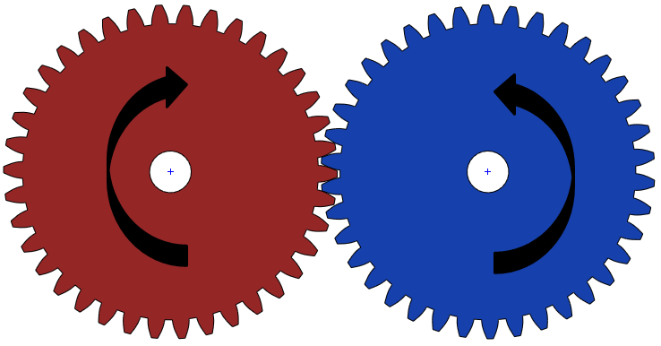
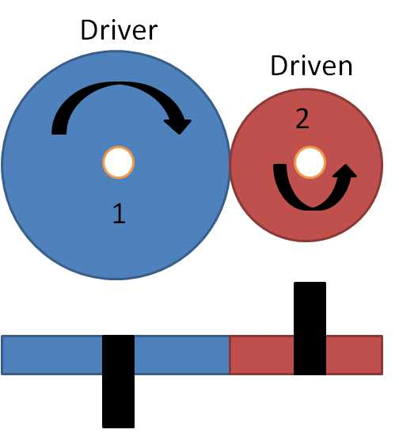
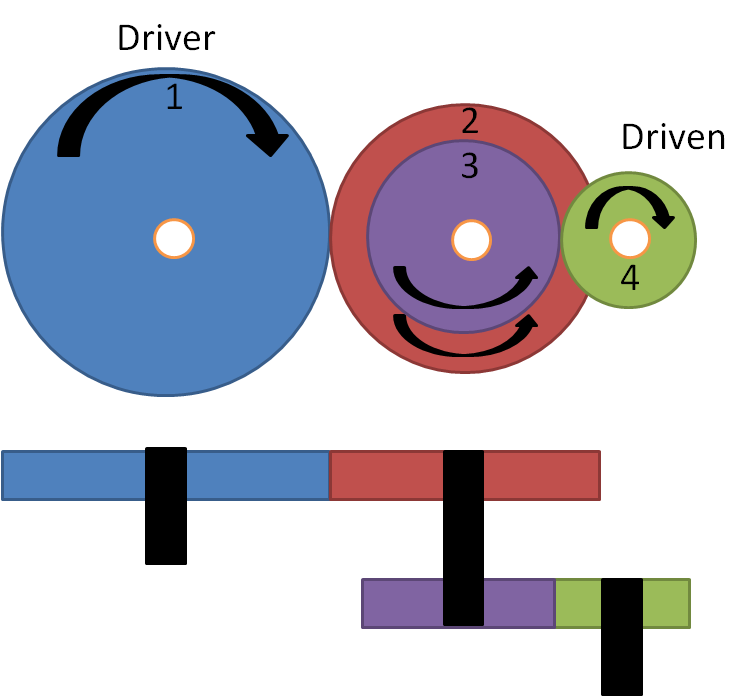
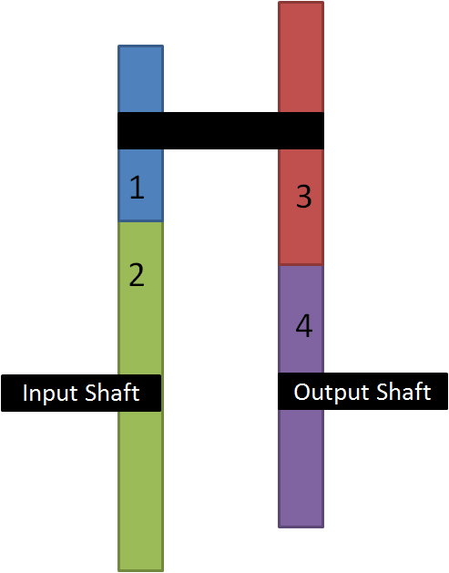

title: Roda Gigi - Rasio Torsi dan Kecepatan
description: Hukum roda gigi menyatakan bahwa angular velocity rasio ata rasio kecepatan sudut antara gigi yang berkaitan selalu konstan. 
hero: Roda Gigi : Rasio, Torsi dan Kecepatan
disqus: henduino

# Roda Gigi: Rasio, Torsi dan Kecepatan

Gear Ratio atau rasio roda gigi (atau perbandingan roda gigi) adalah jumlah rasio output dan input roda gigi pada porosnya. Gigi pemindah daya (dalam bahasa Inggris: *transmission gear* atau dalam bahasa Belanda: *versnelling*) terdiri dari gigi yang disusun secara seri. Mereka digunakan untuk menambah atau mengurangi kecepatan atau torsi pada poros output. Pada artikel ini kita akan membahas cara menghitung rasio roda gigi, kecepatan dan torsi untuk berbagai gigi pemindah daya.

***

## Hukum Roda Gigi

Hukum roda gigi menyatakan bahwa angular velocity rasio (rasio kecepatan sudut) antara gigi yang berkaitan selalu konstan.

*Gambar 1. Rotasi Gigi*

!!! info "Hukum Roga Gigi"
	$$
	\frac{ω1}{ω2}=\frac{n1}{n2}=\frac{d2}{d1}=\frac{T2}{T1}
	$$

* ω = Kecepatan Sudut/Angular Velocity dalam radian/detik
* n = Kecepatan Gigi dalam RPM
* d = Diameter roda gigi dan pinion
* T = Jumlah Gigi

***

## Rasio Roda Gigi

Roda gigi *input* (masukan) di mana torsi diterapkan di sebut juga sebagai roda gigi penggerak (***driver***). Sedangkan roda gigi *ouput* (keluaran) di sebut sebagai roda gigi yang digerakan (***driven***). Dan roda gigi yang digunakan antara roda gigi penggerak dengan roda gigi yang digerakan di sebut sebagai roda gigi perantara (***idler***). Selanjutnya dalam artikel ini akan menggunakan istilah *driver gear* untuk menyebut roda gigi penggerak, *driven gear* untuk roda gigi yang digerakan, dan *idler gear* untuk roda gigi perantara.

Rasio roda gigi (selanjutnya akan disebut *Gear Ratio*) adalah rasio jumlah gigi driven gear dan driver gear.

!!! info "Rumus Gear Ratio"
	$$
	\mathbf{GearRatio} = \frac{ω1}{ω2} = \frac{n1}{n2} = \frac{d2}{d1} = \frac{T2}{T1}
	$$

***

## Rasio Roda Gigi dan Kecepatan Roda Gigi

Pemindahan daya melalui roda gigi mempengaruhi kecepatan rotasi poros ouput. 

!!! info "Rumus Gear Ratio dan Kecepatan"
	$$
	\mathbf{GearRatio} = \frac{ω1}{ω2}=\frac{n1}{n2}=\frac{KecepatanGigiInput}{KecepatanGigiOutput}
	$$

Jika jumlah roda gigi pada poros output lebih besar dari roda gigi pada poros input. Poros output akan memiliki kecepatan rendah. Susunan ini juga dikenal sebagai susunan roda gigi reduksi .

Sedangkan jika jumlah roda gigi pada poros output kurang dari roda gigi pada poros input. Kecepatan poros output akan lebih tinggi dari pada roda gigi poros input.

Karena itu:

!!! info "Rumus Gear Ratio dan Kecepatan"
	$$
	\mathbf{KecepatanRodaGigiOutput} = \frac{GearRatio}{KecepatanRodaGigiInput}
	$$

***

## Rasio Roda Gigi dan Torsi Roda Gigi

Lihat lagi Hukum Roda Gigi. Gear Ratio juga sama dengan rasio dari torsi ouput terhadap torsi input. Oleh karena itu torsi ouput dihitung dengan mengalikan torsi input dengan gear ratio.

!!! info "Rumus Gear Ratio dan Torsi"
	$$
	\mathbf{GearRatio} = \frac{d2}{d1} = \frac{TorsiOutput}{TorsiInput}
	$$

atau:

!!! info "Rumus Gear Ratio dan Torsi"
	$$
	\mathbf{TorsiOuput} = {GearRatio} \times {TorsiInput}
	$$

***

## Tipe Roda Gigi dan Perhitungannya

Roda gigi pemindah daya terdiri dari sejumlah roda gigi untuk mentransfer daya dari satu poros ke poros lainnya. Sebagai contoh, daya dari mesin ditransfer ke roda melalui gear box (*Transmission Gear*).

Roda gigi pemindah daya dapat diklasifikasikan menjadi empat jenis:

* Roda Gigi Sederhana
* Roda Gigi Majemuk (Compound Gear)
* Roda Gigi Pembalik (Reverted Gear)
* Roda Gigi Planet (Planetary Gear)

***

### 1) Perhitungan Roda Gigi Sederhana

#### - Dua Roda Gigi

Perkaitan dua roda gigi sederhana. Perhatikan gambar yang ditunjukkan pada gambar di bawah ini. Di mana Gigi-1 adalah driver gear dan gigi-2 adalah driven gear. Saat driver gear diputar searah jarum jam maka driven gear akan berputar berlawanan arah jarum jam.

*Gambar 2. Dua Roda Gigi*

Contoh:

* Jumlah Gigi Driver Gear (T1) = 40
* Jumlah Gigi Driven Gear (T2) = 20
* Kecepatan Driver Gear ​​(n1) =  100 rpm
* Kecepatan Driven Gear (n2) ​​=  ... rpm
* Torsi Driver Gear =  10 N-m
* Torsi Driven Gear = ... N-m

##### Perhitungan Gear Ratio

!!! info "Rumus Gear Ratio"
	$$
	\mathbf{GearRatio} = \frac{T2}{T1} = \frac{JumlahGigiDrivenGear}{JumlahGigiDriverGear}
	$$

maka:

!!! info "Hasil Perhitungan Gear Ratio"
	$$
	\mathbf{GearRatio} = \frac{T2}{T1} = \frac{20}{40} = 0,5
	$$

##### Perhitungan Kecepatan Roda Gigi

!!! info "Rumus Kecepatan Roda Gigi"
	$$
	\mathbf{GearRatio} = \frac{n1}{n2} = \frac{KecepatanDriverGear}{KecepatanDrivenGear}
	$$

maka:

!!! info "Hasil Perhitungan Kecepatan Roda Gigi"
	$$
	\mathbf{n2} = \frac{n1}{GearRatio} = \frac{100}{0,5} = 200 rpm
	$$

##### Perhitungan Torsi Roda Gigi

!!! info "Rumus Torsi Roda Gigi"
	$$
	\mathbf{GearRatio} = \frac{d2}{d1} = \frac{TorsiOutput}{TorsiInput}
	$$

maka:

!!! info "Hasil Perhitungan Torsi Roda Gigi"
	$$
	\mathbf{TorsiOuput} = {GearRatio} \times {TorsiInput} = {0,5} \times {10} = 5N-m
	$$

#### - Multi Roda Gigi

Multi Roda Gigi terdiri lebih dari dua roda gigi untuk memindahkan daya dari satu poros ke poros lainnya. gear ratio yang dihasilkan dapat dihitung dengan mengalikan gear ratio individu. 

*Gambar 3. Multi Roda Gigi*

Contoh:

* Jumlah Gigi T1 = 40
* Jumlah Gigi T2 = 20
* Jumlah Gigi T3 = 10

Langkah 1:

!!! info "Gear Ratio T1 dan T2"
	$$
	GearRatio (1) = \frac{T2}{T1} = \frac{20}{40} = 0,5
	$$

Langkah 2:

!!! info "Gear Ratio T2 dan T3"
	$$
	GearRatio (2) = \frac{T3}{T2} = \frac{10}{20} = 0,5
	$$

Langkah-3: 

!!! info "Hasil Akhir Gear Ratio"
	$$
	GearRatio (Akhir) = {0,5} \times {0,5} = 0,25
	$$

***

### 2) Perhitungan Roda Gigi Majemuk (Compound Gear)

Roda Gigi Majemuk atau Compound Gear artinya terdiri lebih dari saru roda gigi pada poros tunggal. Karena roda gigi di pasang pada poros yang sama maka akan berputar dengan kecepatan yang sama pula.

*Gambar 4. Roda Gigi Majemuk*

Contoh:

* Jumlah Gigi T1 = 40
* Jumlah Gigi T2 = 30
* Jumlah Gigi T3 = 20
* Jumlah Gigi T4 = 10

Dalam contoh ini roda gigi 2 dan roda gigi 3 berada pada poros yang sama.

Langkah 1:

!!! info "Gear Ratio T1 dan T2"
	$$
	GearRatio (1) = \frac{T2}{T1} = \frac{30}{40} = 0,75
	$$

Langkah 2:

!!! info "Gear Ratio T3 dan T4"
	$$
	GearRatio (2) = \frac{T4}{T3} = \frac{10}{20} = 0,5
	$$

Langkah 3:

!!! info "Hasil Akhir Gear Ratio"
	$$
	GearRatio (Akhir) = {0.75} \times {0.5} = 0,375
	$$

***

### 3) Roda Gigi Pembalik (Reverted Gear)

Roda Gigi Pembalik atau Reverted Gear adalah tipe roda gigi majemuk dimana poros input dan output berada pada poros yang sama. Dalam contoh ini, gigi-1 dan gigi-3 berada pada sumbu poros yang sama. Sedangkan poros driver gear dan poros driver gear terpisah namun dalam garis poros yang sama. Sedikit berbeda dengan roda gigi majemuk hanya dalam penempatan poros driver gear dan driver driven gear.

*Gambar 5. Roda Gigi Pembalik*

Reverted gear digunakan untuk mencapai rasio gigi tinggi dalam ruang terbatas, sehingga membuat kontruksinya tampak lebih kecil namun tetap kompak. Perhitungan gear ratio roda gigi pembalik sama saja dengan perhitungan gear ratio roda gigi majemuk. 

***

## Kesimpulan

Rasio roda gigi atau *Gear Ratio* (**GR**) digunakan untuk menghitung kecepatan dan torsi roda gigi yang dihasilkan. Nilai rasio roda gigi tergantung pada jumlah gigi driver gear, idler gear dan driven gear. Apakah pada artikel ini ada yang terlewat untuk dibahas? Ya... Betul... Planetary Gear akan dibahas terpisah ya...

Salam hangat dari Banjarsari - Ciamis - Jawa Barat - Indonesia - Bumi - Galaksi Bima Sakti...

## Daftar Pustaka

* [Gear Reducing Formulas][1]
* [How to Calculate Gear Ratios and Torque][2]
* [Gear train][3]
* [Gear Train][4]
* [Gear Notes][5]

[1]: https://www.engineeringtoolbox.com/gear-output-torque-speed-horsepower-d_1691.html
[2]: https://itstillruns.com/calculate-gear-ratios-torque-8140164.html
[3]: https://en.wikipedia.org/wiki/Gear_train
[4]: https://www.smlease.com/entries/mechanism/gear-train-gear-ratio-torque-and-speed-calculation/
[5]: http://www.sci.brooklyn.cuny.edu/~kammet/gear_notes.pdf