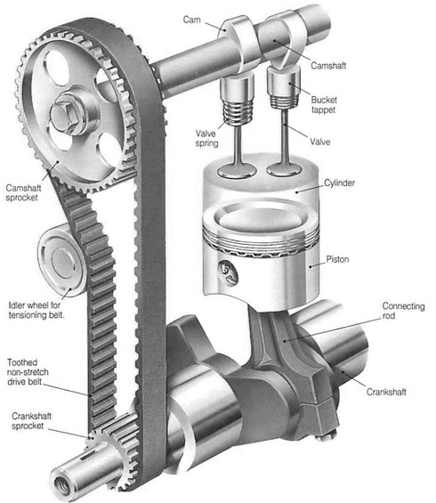
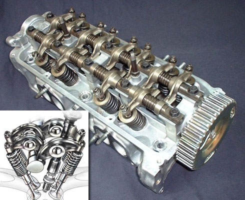
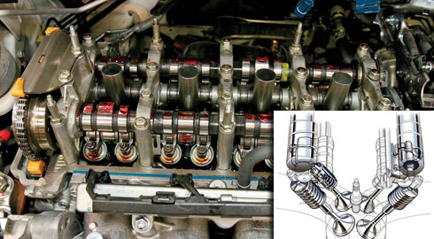

title: Overhead Cam
description: Overhead Camshaft menjadi sangat populer karena mampu menghasilkan tenaga mesin 9000 hingga 20000 RPM. Single Overhead Camshaft atau SOHC menjadi standar mekanisme katup untuk sepeda motor sekarang ini.
hero: Overhead Cam
disqus: henduino

# Mekanisme Katup - Overhead Camshaft

Hasil akhir tenaga mesin 9.000 hingga 20.000 RPM (Revolution Per Minutes) bisa dihasilkan oleh mesin dengan mekanisme katup tipe Double Overhead Camshaft atau DOHC. Hal ini membuat mekanisme katup tipe Overhead Camshaft menjadi sangat populer hingga mampu menggeser dominasi mekanisme katup [Overhead Valve](overhead-valve.md). Sedangkan Single Overhead Camshaft atau SOHC menjadi standar mekanisme katup untuk sepeda motor sekarang ini. 

Overhead Camshaft atau sering disingkat OHC adalah mekanisme penggerak katup (*valvetrain*) dengan konfigurasi penempatan camshaft di atas kepala silinder (*cylinder head*). Cam secara langsung menggerakan rocker arm dan atau katup-katup tanpa melalui pushrod, sehingga mampu memperkecil kehilangan gaya inersia pada mekanisme katup. Jika dibandingkan dengan mekanisme katup *Overhead Valve* (OHV) dengan jumlah katup yang sama, komponen dari *Overhead Camshaft* lebih sedikit dan lebih ringan secara keseluruhan. Walau mungkin saja mekanisme penggerak camshaft (*timing mechanism*) memiliki konstruksi yang lebih kompleks, namun para produsen mesin menerima kompleksitas mekanisme penggerak katup tersebut sebagai sebuah konsekuensi untuk meningkatkan performa mesin dan desain mesin yang lebih fleksibel.

*Gambar 1. Overhead Camshaft*

## Sejarah (Double) Overhead Camshaft

Di antara para pelopor DOHC adalah *Isotta Fraschini* (Giustino Cattaneo), *Austro-Daimler* (Ferdinand Porsche), *Stephen Tomczak* (Heinrich Prinz), dan *WO Bentley* (tahun 1919). *Sunbeam* merupakan mobil dengan model balap antara tahun 1921-1923 yang memperkenalkan desain *Twin Cams* pertama di dunia, di produksi pada tahun 1924. 1.925 Liter *3 Sunbeam Super Sports*, merupakan prototipe kedua yang turun di *Le Mans*. Desain pertama mesin DOHC dengan (entah) dua atau empat katup per silinder di desain oleh perusahaan seperti Fiat (1912), Peugeot Grand Prix (1913, empat katup), Alfa Romeo Grand Prix (1914, empat katup) dan 6C (1928), Maserati Tipo 26 (1926), Bugatti Type 51 (1931).

Ketika teknologi DOHC diperkenalkan ke dunia, hal ini mendapat sorotan dari berbagai kalangan. Pada mulanya desain DOHC baru diproduksi terbatas hanya pada mobil-mobil balap seperti 1.925 Liter *3 Sunbeam Alfa Romeo* yang merupakan salah satu pendukung serta pencetus *twin cam* terbesar saat itu. *6C Sport Alfa Romeo* mobil pertama dengan mesin DOHC diperkenalkan pada tahun 1928. Sejak itu, DOHC telah menjadi merk dagang dari kebanyak mesin yang diproduksi *Alfa Romeo* (Alfa V6 Engine menggunakan SOHC, dan kebanyak *Alfasud Boxer Engine* menggunakan SOHC).

Fiat merupakan salah satu perusahaan mobil pertama yang menggunakan *driven-belt* pada mesin DOHC produksi mereka dipertengahan tahun 1960-an. *Jaguar XK6 DOHC* dan *Jaguar XK120 DOHC* diperkenalkan pada *London Motor Show* pada tahun 1948, dan digunakan pada semua jenis mobil Jaguar pada akhir 1940-an, 1950 dan 1960. Pada akhir tahun 1970-an, Toyota adalah perusahaan dengan penjualan terbaik untuk mesin DOHC.

***

## Tata Letak Overhead Cam

Pada dasarnya ada dua jenis tata letak overhead camshaft, yaitu:

### 1. Single Overhead Camshaft (SOHC)

Single Overhead Camshaft (SOHC) adalah mesin yang didesain dengan menggunakan satu buah camshaft yang ditempatkan pada kepala silinder. Pada mesin dengan konfigurasi inline (sebaris) terdapat satu camshaft yang diletakan pada kepala silinder, sedangkan untuk mesin dengan konfigurasi lain (misal; konfigurasi mesin V atau konfigurasi mesin boxer) ini berarti mesin memiliki lebih dari satu kepala silinder, maka jumlah camshaft juga sebanyak jumlah kepala silinder, karena setiap satu kepala silinder terdapat satu camshaft.

*Gambar 2. Single Overhead Camshaft*

Pada desain SOHC, *camshaft* secara langsung menggerakan katup melalui perantara *bucket tappet* atau ada pula yang melalui perantara *rocker arm*. Desain SOHC memberikan kompleksitas yang lebih rendah jika dibandingkan dengan desain OHV, terutama jika menggunakan *multivalve* pada kepala silinder, dimana mesin memiliki lebih dari dua katup (isap-buang) pada masing-masing silinder. Exhaust manifold dan intake manifold ditempatkan sejajar pada kedua sisi kepala silinder sehingga kinerja mesin meningkat karena tidak lagi terjadi *crossflow*,  percikan api pada busi dapat dengan mudah berhadapan langsung dengan gas.

Pada awal tahun 1980-an, Toyota dan Volkswagen Group sudah menggunakan mekanisme katup SOHC. Toyota menggunakan *hidraulic tappet*, sedangkan Volkswagen menggunakan *bucket tappet* dengan *shim* sebagai penyesuai celah katup. Mesin dari kedua pabrikan ini mungkin merupakan mesin dengan konfigurasi yang paling kompleks pada saat itu.

### 2. Double Overhead Camshaft (DOHC)

Double Overhead Camshaft ditandai dengan dua camshaft yang terletak didalam satu kepala silinder, satu camshaft melayani semua katup masuk dan satu camshaft lagi melayani semua katup buang. Desain seperti ini mengurangi insersia penggerak mekanisme katup, karena rocker arm sudah tidak lagi digunakan (dihilangkan) pada mesin DOHC. Desain DOHC memungkinan sudut yang lebih luas antara katup masuk dan katup buang dibanding mesin SOHC. Hal ini dapat memperlancar aliran udara yang lebih baik pada kecepatan tinggi. DOHC yang didesain dengan *multivalve* juga memungkinkan penempatan busi secara optimal sehingga mampu meningkatkan efisiensi pembakaran.

*Gambar 3. Double Overhead Camshaft*

DOHC dengan desain multivalve (katup lebih dari dua) muncul pada kisaran tahun 1980-an, namun harus diingat bahwa DOHC tidak selalu *multivalve*. Hal ini kadang membingungkan, karena pada beberapa mesin SOHC juga didesain dengan *multivalve*. Memang, jika memperhatikan perkembangan mesin-mesin DOHC hampir semua menggunakan *multivalve* dengan jumlah katup antara tiga sampai lima katup per silinder. *Multivalve* tidak selalu DOHC karena keduanya merupakan fitur yang berbeda. 

***

## Keuntungan Overhead Camshaft

* *Pembakaran sempurna*. Alasan mendasar para produsen mesin memilih Overhead Camshaft adalah bahwa mekanisme jenis ini menawarkan peningkatan kemampuan mesin saat terjadi pertukaran (exchange) induksi dan gas buang (pertukaran ini sering disebut "engine breathing"). 
* *Torsi maksimum*. Keuntungan kinerja lainnya yaitu diperoleh dari konfigurasi saluran (port) yang lebih baik dengan mengoptimalkan desain overhead camshaft. Dengan tidak digunakannnya pushrod, desain kepala silinder bisa menggunakan saluran tegak sehingga perlintasan (crossection) lebih menguntungkan dan panjang. Desain Overhead Camshaft merupakan salah satu mekanisme katup yang dewasa ini banyak digunakan pada mobil-mobil dengan kecepatan dan teknologi tinggi, bahkan banyak digunakan untuk mobil-mobil balap, karena OHC mampu meningkatkan daya keluaran (output) sehingga menghasilkan torsi maksimum.
* *Ringan*. Mekanisme penggerak OHC bisa saja menggunakan metode yang sama seperti halnya yang digunakan pada OHV, tetapi dalam prakteknya (tergantung aplikasi), bobot yang lebih ringan dan bebas perawatan lebih sering digunakan pada mekanisme penggerak OHC. Misal; penggunaan timing belt karet/kevlar bergigi, rantai roller (roller chain) pada double overhead camshaft (DOHC), atau dalam beberapa kasus masih tetap menggunakan roda gigi. Pada mesin Ducati versi awal, penggerak camshaft pada mesin OHC-nya masih menggunakan roda gigi bevel (bevel gear).
* *Multivalve*. Pada mesin dengan konstruksi khusus ada yang menggunakan beberapa katup (tiga, empat, atau lima) per silinder, selain itu banyak mesin OHC sekarang ini yang telah menggunakan variable valve timing untuk meningkatkan efisiensi dan daya mesin. OHC dengan peletakan camshaft pada kepala silinder (cylinder head) memungkinkan mesin dengan kecepatan yang lebih tinggi dibanding dengan OHV (posisi camshaft pada blok mesin), hal ini karena OHC memiliki massa penggerak (valvetrain) yang rendah.

***

## Kerugian Overhead Camshaft

* Ukuran kepala sinlinder (Cylinder Head) menjadi lebih besar terutama pada tipe DOHC karena semua komponen mekanisme katup diletakan pada kepala silinder.
* Pada tipe DOHC celah katup sulit distel. Karena tidak tersedianya rocker arm, sehingga camshaft diletakan tepat diatas batang katup. Dan celah yang terbentuk adalah antara cam dengan batang katup. Penyetelan celah katup dilakukan dengan mengganti shim tipis yang terletak diantara cam dengan batang katup.
Pemeriksaan driven-belt (timing belt) harus dilakukan berkala, karena putusnya driven-belt dapat berakibat fatal pada mesin.
* Lebih mahal. Terutama pada mekanisme katup tipe DOHC. Karena camshaft terdiri dari dua batang dan biasanya jumlah katup yang digunakan juga lebih dari 2.

***

## Animasi Prinsip Kerja

### SOHC

<object type="application/x-shockwave-flash" data="http://static.howstuffworks.com/flash/camshaft-sohc.swf" width="405" height="300" style="visibility: visible; "><param name="allowScriptAccess" value="always"><param name="wmode" value="opaque"><param name="bgcolor" value="#FFFFFF"><param name="flashvars" value="_adRefresher=30s&amp;_adData="></object>

### DOHC

<object type="application/x-shockwave-flash" data="http://static.howstuffworks.com/flash/camshaft-dohc.swf" width="405" height="300" style="visibility: visible; "><param name="allowScriptAccess" value="always"><param name="wmode" value="opaque"><param name="bgcolor" value="#FFFFFF"><param name="flashvars" value="_adRefresher=30s&amp;_adData="></object>

***

## Daftar Pustaka

* [Overhead Camshaft][1]
* [OverHead Camshaft Engines][2]

[1]: https://en.wikipedia.org/wiki/Overhead_camshaft
[2]: http://www.honda-engines-eu.com/ohc

***

<small>Artikel diperbarui pada: {{ git_revision_date_localized }}</small>