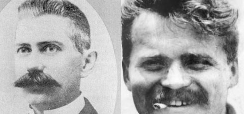
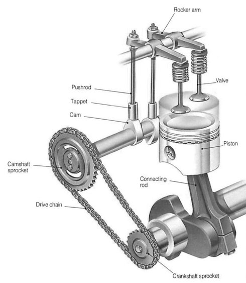
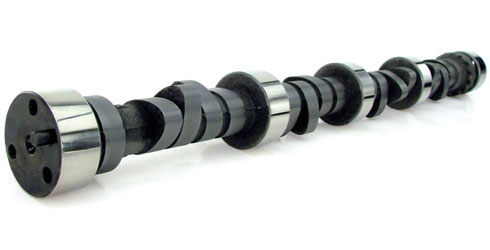
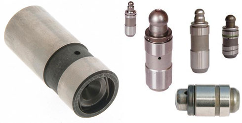
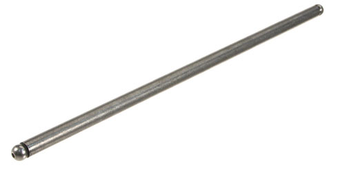
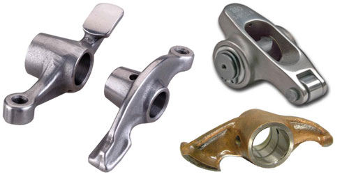
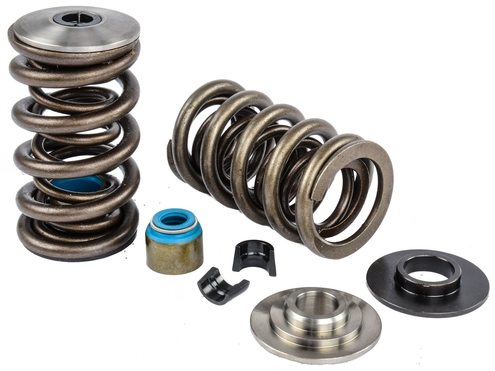
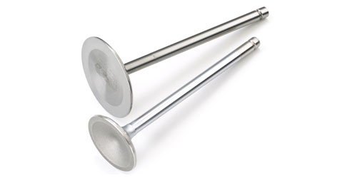
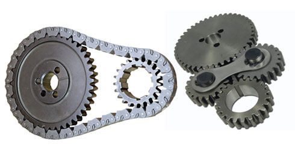

title: Overhead Valve
description: Mekanisme katup merupakan bagian penting dari mesin pembakaran dalam 4 langkah yang berfungsi untuk mengatur terjadinya proses-proses pada siklus di dalam mesin agar menghasilkan tenaga sesuai dengan berbagai tingkat percepatan
hero: Overhead Valve
disqus: henduino

# Mekanisme Katup - Overhead Valve (OHV)

Mekanisme katup (*Valve Mechanism*) merupakan bagian penting dari mesin pembakaran dalam (Internal Combustion Engine) 4 langkah (*4 stroke*) yang berfungsi untuk mengatur terjadinya proses-proses (proses isap, proses kompresi, proses usaha, proses buang) pada siklus di dalam mesin agar menghasilkan tenaga sesuai dengan berbagai tingkat percepatan. Mekanisme katup pada intinya digunakan untuk mengatur pembukaan dan penutupan saluran, baik itu saluran masuk (*intake manifold*) maupun saluran buang (*exhaust manifold*) sehingga proses yang terjadi pada ruang bakar (*combustion chamber*) dapat bekerja secara sistematis dan teratur.

Proses-proses yang terjadi pada siklus mesin 4 langkah sangat tergantung dari kinerja mekanisme katup. Mekanisme katup telah mengalami banyak perkembangan dan peningkatan kualitas kerja sehingga mengalami pula penambahan komponen yang diperlukan, namun secara teknis tipe mekanisme katup tidak mengalami penambahan atau perubahan yang signifikan. Salah satu tipe mekanisme katup yang banyak digunakan pada mesin adalah Overhead Valve atau disingkat OHV.

Overhead Valve merupakan tipe mekanisme katup yang tertua diantara tipe-tipe lainnya sehingga banyak yang menyebutnya sebagai mekanisme katup klasik. *Overhead Valve* sering pula disebut *pushrod engine* atau *I-head engine*. Ciri khas mekanisme katup overhead valve adalah terdapatnya komponen *pushrod* (batang pendorong) yang tidak terdapat pada mekanisme katup jenis lainnya sehingga banyak yang menyebutnya *pushrod engine*.

*Gambar 1. Overhead Valve 3 Dimensi*

***

## Sejarah Overhead Valve

Overhead Valve atau OHV awalnya dikembangkan oleh *David Dunbar Buick* dari perusahaan *Scottish-American* dengan menggunakan batang *pushrod* yang terpasang paralel terhadap piston. Konstruksi ini sangat berbeda jauh dengan konstruksi sebelumnya yang menggunakan *side valves* dan *sleeve valves*. Konstruksi OHV digunakan sampai hari ini. *Arthur Chevrolet* kemudian mendapatkan US Patent #1,744,526 untuk desain *Engine Valve Overhead*. Paten ini mencakup adaptor yang dapat diterapkan ke mesin yang ada, sehingga mengubahnya menjadi *Overhead Valve Engine*.
 

*Gambar 2. Kiri: David Dunbar Buick, Kanan: Arthur Chevrolet*

***

## Konstruksi dan Komponen Overhead Valve

Terdapat beberapa komponen khusus pada mekanisme katup jenis Overhead Valve yang tidak terdapat pada mekanisme katup jenis lainnya. Overhead Valve sering pula disebut pushrod engine, hal ini dikarenakan hanya mekanisme katup Overhead Valve yang memiliki komponen bernama pushrod.

Dibawah ini konstruksi dan komponen mekanisme katup jenis Overhead Valve.

*Gambar 3. Struktur Mekanisme Katup OHV*

***

## Fungsi Komponen Overhead Valve

Pada gambar diatas terlihat beberapa komponen yang digunakan pada *Overhead Valve*, berikut fungsi dari masing komponen:

### Cam

*Cam* memiliki bagian menonjol yang sering disebut *cam lobe*. Bagian inilah yang mengatur saat pembukaan katup. Letak *cam lobe* berbeda sesuai dengan urutan pembukaan katup masuk dan katup buang. Peletakan posisi *cam lobe* untuk katup masuk dan katup buang disusun berdasarkan konstruksi poros engkol (*crankshaft*).

*Gambar 4. Camshaft*

### Tappet / Valve Lifter

*Tappet* atau *Valve Lifter* digunakan sebagai landasan pushrod untuk mengurangi keausan yang terjadi pada *cam*. Pada mesin generasi baru, tappet selain digunakan untuk mengurangi keausan *cam* juga digunakan untuk menghilangkan celah yang terjadi antara komponen-komponen penggerak katup sehingga penyetelan celah katup pada perawatan berkala mesin (*tune-up*) tidak perlu lagi dilakukan. *Tappet* jenis ini sering disebut tappet hidrolik atau *hidraulic valve lifter*.

*Gambar 5. Valve Lifter*

### Pushrod

*Pushrod* merupakan komponen khusus yang hanya tersedia untuk mekanisme katup jenis *Overhead Valve*. Komponen ini sering pula disebut batang pendorong yang berfungsi untuk meneruskan daya dorong yang dihasilkan oleh *cam lobe* menuju ke *rocker arm*. *Pushrod* digunakan karena jarak antara *camshaft* (yang tersimpan pada cylinder block) dengan *rocker arm* (yang tersimpan pada *cylinder head*) berjauhan.

*Gambar 6. Pushrod*

### Rocker Arm

*Rocker Arm* atau lengan pengungkit digunakan untuk meneruskan daya dorong dari *pushrod* menuju ke batang katup. *Rocker arm* memiliki konstruksi berbeda-beda sesuai dengan posisi camshaft. Pada mesin generasi baru *rocker arm* mengalami penyempurnaan konstruksi dengan penambahan *roller bearing*, hal ini untuk mengurangi keausan yang terjadi pada bagian-bagian rocker arm.

*Gambar 7. Rocker Arm*

### Valve Spring

Valve Spring atau pegas katup berfungsi untuk mengembalikan posisi katup. Jika cam digunakan untuk membuka katup maka valve spring berfungsi sebaliknya untuk menutup katup.

*Gambar 8. Valve Spring*

### Valve

Valve atau katup berfungsi untuk mengatur saat terbuka dan tertutupnya saluran baik saluran buang maupun saluran masuk. Valve ini sangat berpengaruh besar terhadap proses-proses yang terjadi didalam ruang bakar. Saluran masuk dan saluran buang yang tidak tertutup rapat akan mempengaruhi tenaga hasil pembakaran.

*Gambar 9. Valve*

### Timing Mechanism

Timing Mechanism atau mekanisme penggerak berfungsi untuk menggerakan camshaft dengan meneruskan putaran dari crankshaft melalui perantara gigi (*timing gear*), rantai (*timing chain*) dan atau sabuk (*timing belt*).

*Gambar 10. Timing Chain/Gear*

***

## Keuntungan Overhead Valve

Mesin dengan mekanisme katup OHV (Overhead Valve) memiliki keuntungan sebagai berikut:

* *Ukuran mesin relatif kecil*; hal ini karena konstruksi mekanisme katup overhead valve relatif sederhana jika dibandingkan dengan overhead cam ([OHC](overhead-cam.md)) yang menempatkan camshaft pada kepala silinder.
* *Mekanisme penggerak lebih kompak*; Mekaniskme katup Overhead Valve memiliki konstruksi yang sederhana namun kompak karena posisi camshaft yang berdekatan dengan crankshaft. 
* *Mekanisme penggerak lebih responsif*; Mekanisme penggerak camshaft pada OHV biasanya menggunakan timing gear atau timing chain dengan lokasi yang sangat berdekatan, hal ini membuat proses penyaluran tenaga putaran cenderung lebih responsif jika dibandingkan OHC. Pada mekanisme katup OHC posisi camshaft ada pada kepala silinder, sehingga membutuhkan timing chain atau timing belt yang relatif lebih panjang. Walaupun ada penambahan high tensioner untuk memperkecil defleksi namun tetap penyaluran tenaga putar dari crankshaft ke camshaft kurang responsif bahkan lebih banyak resiko jeda waktu perpindahan putaran.

***

## Kerugian Overhead Valve

Beberapa masalah khusus yang terjadi pada mesin overhead valve (OHV) antara lain:

* *Kecepatan putaran mesin terbatas (RPM)*; OHV memiliki komponen-komponen yang relatif lebih banyak sehingga cenderung kehilangan gaya inersia akibat celah-celah yang terbentuk antar masing-masing komponen. Kehilangan gaya inersia membuat katup lebih mudah untuk "mengambang". Hal inilah yang membuat mesin-mesin dengan mekanisme katup OHV tidak mampu berputar pada putaran tinggi. Mesin OHV hanya mampu berputar pada putaran 6.000 sampai dengan 8.000 rpm (revolutions per minute) untuk mobil-mobil yang diproduksi umum, 9.000 sampai dengan 10.500 rpm untuk mobil-mobil balap. Sedangkan untuk mobil dengan mekanisme katup modern ([terutama yang menggunakan DOHC](overhead-cam.md)), mesin mampu berputaran pada kisaran 6.000 hingga 9.000 rpm untuk mobil produksi masal, dan hingga 20.000 rpm (walau sekarang dipatok hanya sampai 18.000 rpm) untuk mobil balap.
* *Desain kepala silinder kaku*; Hal ini dikarena pushrod yang lurus sehingga posisi antara blok silinder dengan kepala silinder tidak boleh dalam bentuk yang kompleks (cenderung lurus). Desain kepala silinder yang kaku membuat lokasi dan jumlah katup menjadi terbatas yang pada umumnya hanya terdiri dari 2 katup (1 katup masuk dan 1 katup buang). Sedangkan pada mesin OHC, desain kepala silinder bisa lebih fleksibel dengan lokasi dan jumlah katup yang bisa lebih dari 2 katup, hal ini karena posisi camshaft yang berada dikepala silinder dan mekanisme penggerak camshaft yang lebih fleksibel (biasanya menggunakan timing belt atau timing chain).
* *Bising dan kasar*; Hal ini karena banyaknya komponen mekanisme katup yang terlibat dan bergerak, membuat mekanisme katup OHV menimbulkan suara yang lebih bising. Pada saat mesin panas, celah yang terbetuk antar masing-masing komponen menjadi lebih lebar sehingga suara mesin terdengar lebih kasar.
Perawatan rumit; Salah satu komponen yang terkadang dilewati untuk diperiksa adalah camshaft, hal ini karena posisi dan lokasi camshaft yang tersimpan pada blok mesin, sehingga cenderung lebih sulit untuk di bongkar.

***

## Prinsip Kerja Overhead Valve

Katup Terbuka Tekanan hasil pembakaran pada ruang bakar akan mendorong torak turun ke bawah (langkah kerja/usaha). Poros engkol (*crankshaft*) kemudian merubah gerak bolak balik torak menjadi gerak putar pada ujung-ujungnnya. Putaran yang terjadi pada ujung poros engkol kemudian memutarkan camshaft gear/sprocket melalui valve timing drive mechanism (*timing gear, timing chain atau timing belt*). Cam Lobe pada cam akan mendorong tappet (*valve lifter*), mendorong pushrod kemudian mendorong rocker arm. Ungkitan dari rocker arm akan mendorong katup (*valve*) hingga terbuka, maka saluran terbuka. Saat katup membuka maka pegas katup (*valve spring*) memendek.

Katup Tertutup Camshaft terus berputar hingga cam lobe meninggalkan valve lifter dan tekanan pada valve spring akan terlepas. Valve spring memanjang dan menarik valve hingga saluran 
tertutup.

<object type="application/x-shockwave-flash" data="http://static.howstuffworks.com/flash/camshaft-pushrod.swf" width="405" height="300" style="visibility: visible; "><param name="allowScriptAccess" value="always"><param name="wmode" value="opaque"><param name="bgcolor" value="#FFFFFF"><param name="flashvars" value="_adRefresher=30s&amp;_adData="></object>

***

## Daftar Pustaka

* [Overhead Valve][1]
* [How Overhead Valve work?][2]

[1]: http://en.wikipedia.org/wiki/Overhead_valve
[2]: http://auto.howstuffworks.com/camshaft.htm

***

<small>Artikel diperbarui pada: {{ git_revision_date_localized }}</small>