title: Penyebab Overheating Mesin
description: Overheating bisa mengakibatkan kegagalan kinerja mesin, bahkan lebih fatal lagi yaitu kerusakan komponen-komponen vital mesin akibat tumbukan, gesekan dan atau benturan yang disebabkan pemuaian komponen yang melebihi batas normal.
hero: Penyebab Overheating Mesin
disqus: henduino

# Penyebab Overheating Mesin

Overheating atau panas berlebihan bisa mengakibatkan kegagalan kinerja mesin, bahkan lebih fatal lagi yaitu kerusakan komponen-komponen vital mesin akibat tumbukan, gesekan dan atau benturan. Hal ini disebabkan oleh pemuaian komponen mesin yang melebihi batas normal. Overheating merupakan hal yang harus dicegah. Pemahaman tentang penyebab terjadinya overheating tidaklah harus hanya dipahami oleh para mekanik, tapi juga supir atau pemilik mobil. Diagnosa pada mesin sejak dini dari cikal bakal terjadinya overheating akan mampu mencegah kejadian yang sangat fatal. Bahkan dalam kasus overheating parah, akan menguras jumlah 0 dalam buku rekening anda. Selamatkan buku rekening anda dengan belajar tetang penyebab terjadinya overheating pada mesin.

Kenapa terjadi overheating? Apakah karena cuaca yang panas? Ataukah kecepatan mesin yang melebihi batas kemampuan? Berbagai pertanyaan akan muncul dalam benak jika berhadapan dengan overheating. Artikel kali ini akan mengupas hal-hal sederhana yang sering penyebab terjadinya overheating pada mesin.

***

## Identifikasi Terjadinya Overheating

Dibawah ini akan diurutkan komponen yang mempengaruhi panas mesin, dari yang paling ringan hingga komponen yang tergolong berat untuk di identifikasi.

### 1. Tutup Radiator (Radiator Cap) Rusak

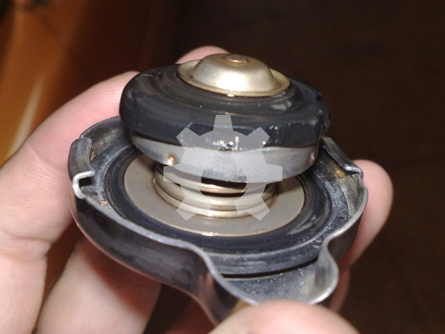

Tutup radiator atau *Radiator Cap* merupakan bagian penting dari sistem pendinginan pada mesin. Radiator Cap berada pada bagian atas radiator yang berfungsi untuk memelihara tekanan didalam radiator agar tidak sampai mendidih dan menguap. Pada tutup radiator terdapat 2 buah katup yang berfungsi untuk memelihara volume air pendingin dan tekanan didalam radiator. Untuk itu periksalah secara berkala tutup radiator dari kemungkinan kerusakan pada bagian-bagian tutup radiator.

### 2. Sensor Temperatur Rusak

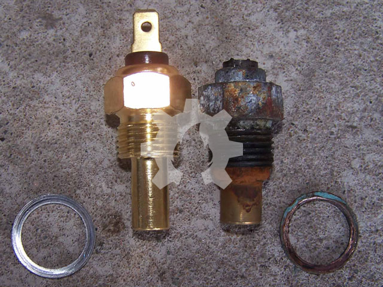

Pada mesin-mesin modern yang sudah melibatkan ECM atau ECU, sensor suhu/temperatur dipasang di beberapa tempat. Sensor ini berfungsi untuk mengirimkan sinyal suhu pada ECM atau ECU. Jika sensor suhu ini mengalami kerusakan maka sinyal tidak dapat dikirim dengan tepat ke ECM/ECU untuk dapat menyesuaikan proses yang terjadi pada mesin sehingga mampu mencegah terjadinya overheating. Untuk itu jangan abaikan sensor suhu yang sudah tidak mampu bekerja dengan baik. Pada beberapa jenis kendaraan, sensor suhu digunakan juga untuk mengaktifkan kipas pendingin radiator.

### 3. Sirip Radiator Tersumbat

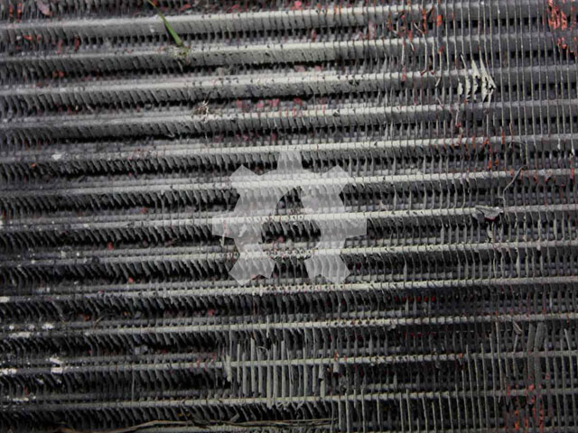

Semakin lebar sirip-sirip radiator maka semakin mudah proses pelepasan panas dari radiator ke udara luar yang mengalir diantara tabung-tabung radiator. Jika pelepasan panas dapat berjalan lancar tentunya temperatur mesin dapat diperlihara dalam batasan suhu yang stabil/normal. Dapat dibayang seandainya sirip-sirip pendingin pada radiator tersumbat karena benda-benda kecil semacam serangga, kerikil dan lain sebagainya dan atau sirip pendingin penyok sehingga dapat meningkatkan kecenderungan terjadinya overheating pada mesin.

### 4. Campuran Air Pendingin Salah

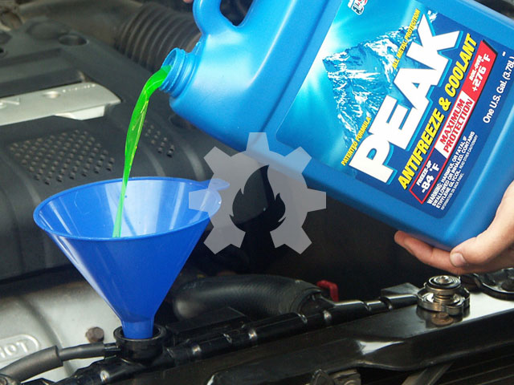

Seandainya semua sistem pendinginan dapat bekerja dengan baik sekalipun, tetapi tetap saja sistem pendinginan tidak akan bekerja efektif dan maksimal jika cairan pendingin yang bersirkulasi tidak dalam campuran yang tepat dan ideal. Cairan pendingin adalah campuran air dengan anti beku (*anti-freeze*) atau *ethylene glycol*. Bahan tambah (*additive*) anti-freeze berfungsi untuk mencegah air pendingin membeku pada saat suhu mencapai 0^o^C dan mencegah air mendidih pada saat suhu mencapai 100^o^C. Selain itu anti-freeze juga akan membantu mendinginkan air saat air mencapai titik didihnya yaitu 100^o^C dan bahkan membantu air pendingin saat suhu belum mencapai temperatur normal. Kombinasi campuran air pendingin yang ideal adalah 50% anti-beku dan 50% air. Pada beberapa kasus terutama pada saat musim dingin jumlah anti-freeze bisa ditingkatkan hingga 70%.

### 5. Kipas Radiator tidak Berfungsi

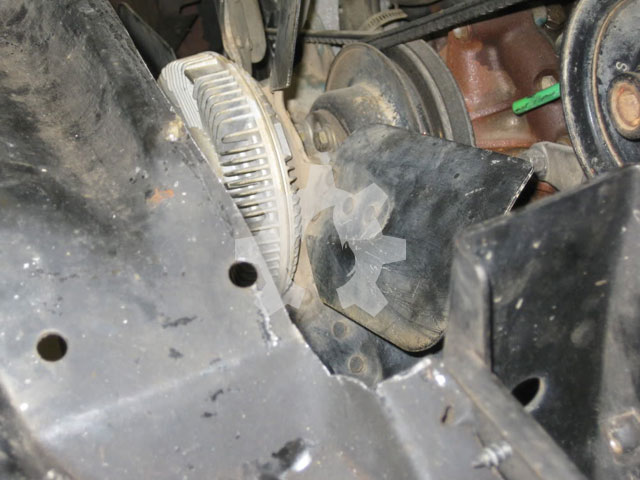

Kipas radiator terletak dibelakang radiator yang berfungsi untuk membantu aliran udara dari depan radiator melintasi sirip-sirip radiator sehingga proses pelepasan panas dari radiator keudara luar dapat berjalan lancar dan maksimal. Walaupun saat kendaraan berjalan cepat kipas radiator tidaklah terlalu dibutuhkan, makanya pada beberapa mesin mobil modern kipas radiator secara otomatis tidak berputar (mati). Kipas radiator sangat dibutuhkan terutama saat putaran idle dan putaran lambat ketika itu udara dingin tidak begitu baik mengalir melewati gril dan radiator.
Periksalah bilah-bilah kipas radiator dan motor (pada mesin tertentu) untuk memastikan pastikan bahwa udara mengalir melewati radiator dengan baik.

### 6. Pompa Air Macet

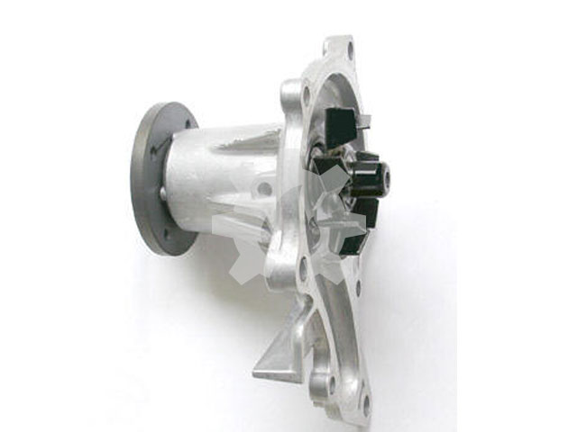

Pompa air terletak dibelakang kipas radiator. Pompa radiator berfungsi untuk men-sirkulasikan air pendingin melewati matel air (*water-jacket*), menyerap panas dari hasil pembakaran yang kemudian dialirkan menuju radiator untuk proses pelepasan panas. Periksalah pompa radiator dari kemungkinan terjadi kerusakan pada gasket dan atau korosi.

### 7. Thermostat Macet

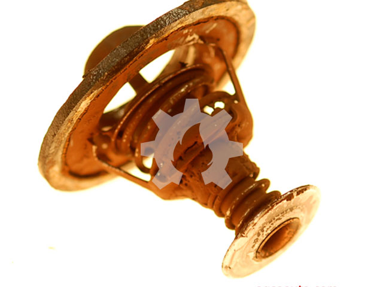

Thermostat berada pada sekitar aliran air pendingin, ada yang terdapat pada bagian atas mesin atau dibawah pompa air. Untuk Indonesia thermostat sudah jarang disertakan pada mesin oleh para perusahaan mobil Indonesia. Thermostat berfungsi sebagai stopper atau pintu yang mengatur sirkulasi air pendingin, pada saat mesin belum mencapai temperatur ideal maka thermostat akan menutup aliran air dari mantel air (water-jacket) ke radiator sehingga air pendingin hanya akan ber-sirkulasi di sekitar rongga-rongga mesin. Selanjutnya jika temperatur mesin mencapai suhu ideal maka thermostat akan membuka dan mengalirkan air pendingin menuju  radiator.

### 8. Radiator Hose Tersumbat

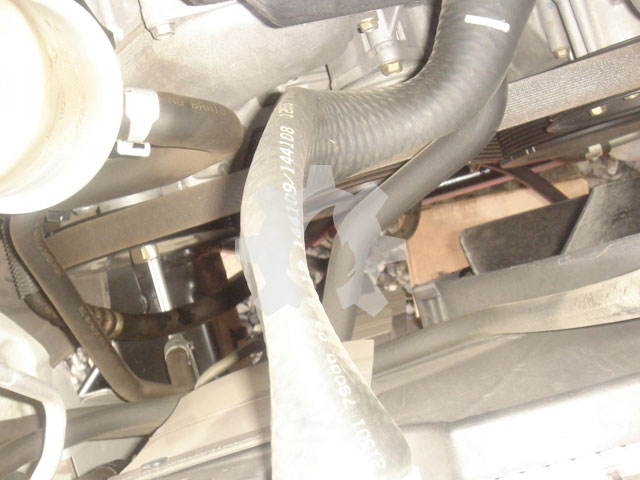

Pada umumnya sistem pendinginan hanya memiliki dua buah saluran (hose) yaitu *upper hose* (saluran atas) dan *lower hose* (saluran bawah). Upper hose mengalirkan air panas dari mesin menuju ke radiator sedangkan lower hose mengalirkan air dingin dari radiator menuju ke mesin. Periksalah saluran-saluran ini dari kemungkinan cacat, bocor, dan menyusut. Pada kasus tertentu terjadi penyusutan saluran radiator, hal tersebut karena kerusakan pada tutup radiator, tutup radiator yang rusak menciptakan kevakuman didalam radiator sehingga saluran radiator yang terbuat dari bahan lentur (karet) akan terhisap dan menyusut.

### 9. Kekurangan Cairan Pendingin

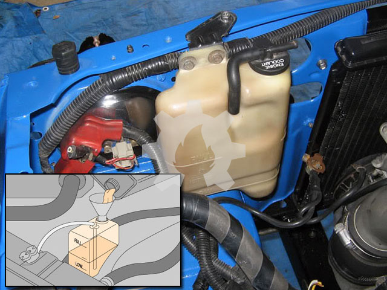

Cairan pendingin adalah darah dari sistem pendinginan, untuk itu keberadaannya merupakan hal mutlak yang tidak bisa di tawar. Jangan berhadap mesin dapat berjalan jauh jika sistem pendinginan kekurangan cairan. Untuk itu pastikan volume cairan pendingin dalam jumlah cukup, kita dapat memeriksanya melalui radiator atau melalui tangki cadangan (*reservoir tank*). Akan lebih baik kita memeriksa jumlah cairan pendingin secara berkala setiap hari atau setiap akan menggunakan kendaaraan melalui reservoir tank.

### 10. Sabuk Penggerak (Driving Belt) Kendur

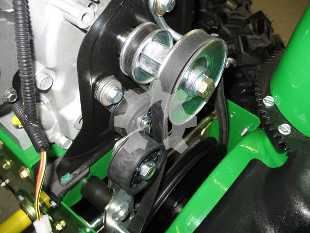

Sabuk penggerak atau sering disebut *driving belt* atau *fan belt* digunakan untuk meneruskan putaran dari poros engkol (*crankshaft*) ke pompa air (*water pump*). Jika driving belt kendur maka putaran dari pulley poros engkol tidak akan diteruskan dengan baik ke pompa air (water pump) sehingga putaran pompa air tidak akan maksimal, akibatnya sirkulasi cairan pendingin tidak berjalan lancar dan terjadilah overheating.

### 11. Kebocoran Saluran Pendinginan

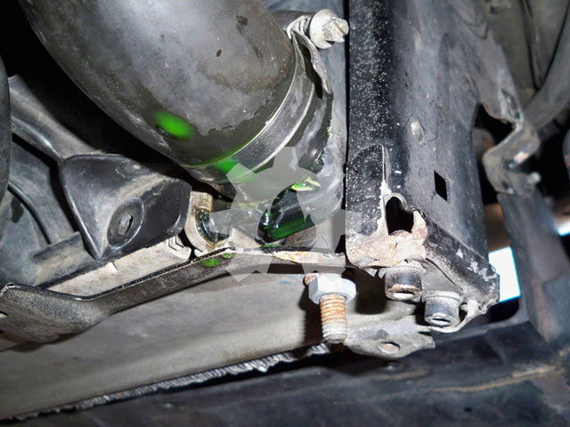

Radiator dan water jacket dihubungkan dengan upper hose dan lower hose yang terbuat dari bahan karet. Saluran ini sangat rawan mengalami kebocoran terutama pada sambungannya yang hanya diikat menggunakan klem. Pada saat cairan pendingin panas maka volume air bertambah dan terjadilah kompresi (tekanan naik) dan kemudian menyusut lagi saat mesin berhenti bekerja. Perubahan inilah yang membuat saluran pendinginan kembang kempis, mengembang saat panas dan menyusut saat dingin. Hal ini membuat sambungan-sambungan saluran pendinginan yang terbuat dari bahan karet mengalami pergeseran dan bahkan klem-an yang mengikat saluran menjadi kendur. Periksalah secara berkala ikatan klem antara saluran pendingin dengan blok mesin dan radiator.

Selain penyebab diatas ada pula beberapa faktor yang bisa memicu terjadinya overheating, diantaranya; gaya mengemudi yang berlebihan, cuaca yang terlalu panas, dan kondisi jalan yang macet.

Selamat bekerja, perhatikan baik-baik kelengkapan keselamatan kerja dan semoga artikel ini membantu memperlancar pekerjaan anda.

***