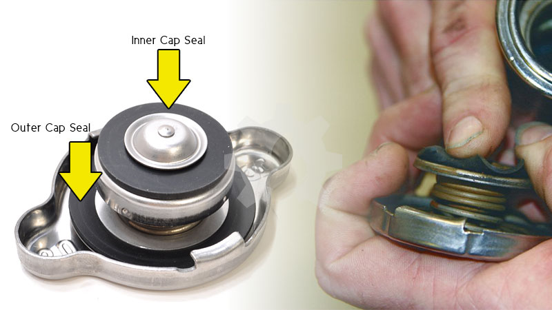
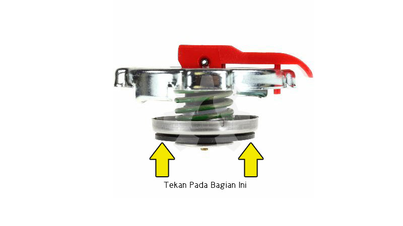
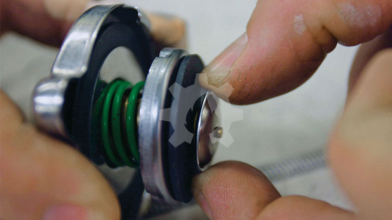
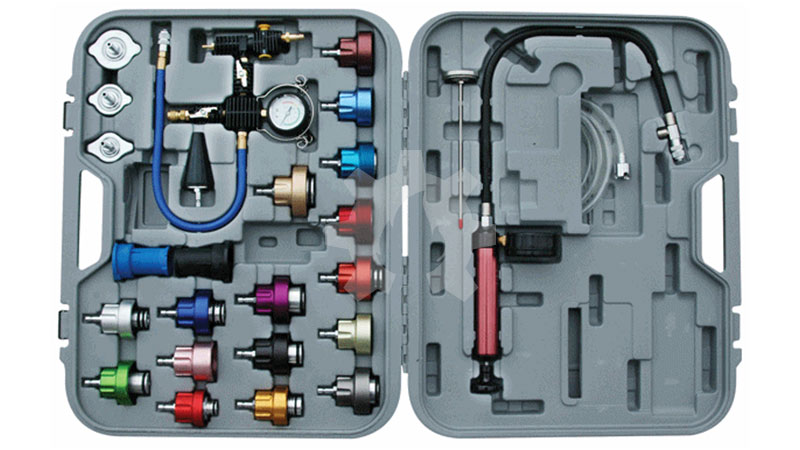
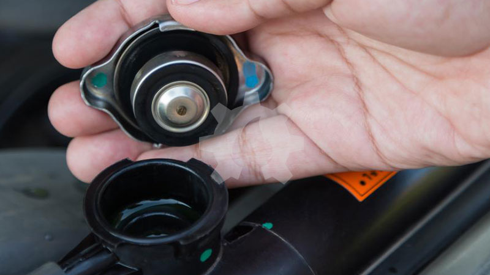
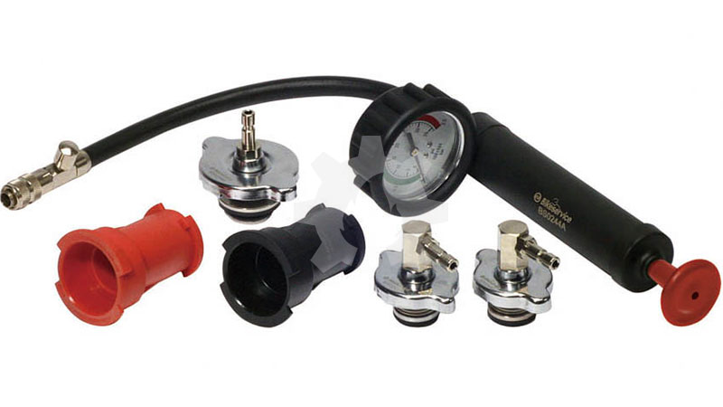
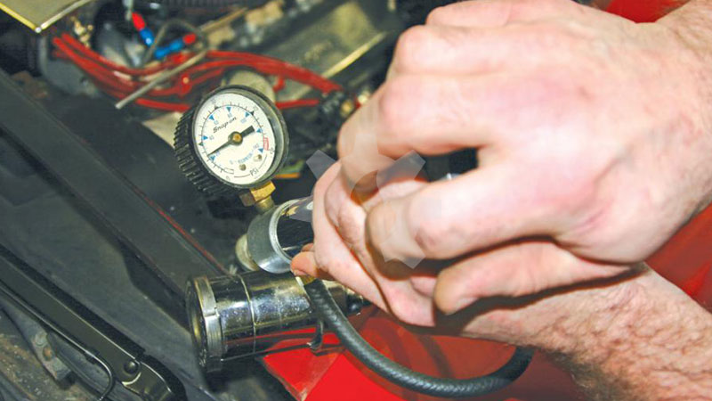

title: Memeriksa Tutup Radiator
description: Tutup radiator berfungsi untuk mengatur tekanan dan volume air pendingin didalam radiator.
hero: Memeriksa Tutup Radiator
disqus: henduino

# Memeriksa Tutup Radiator (Radiator Cap Test)

Tutup Radiator atau sering di sebut *Radiator Cap* bukanlah sekedar sebuah tutup, tapi juga memiliki peranan penting dalam sistem pendinginan mesin kendaraan. Tutup radiator berfungsi untuk mengatur tekanan dan volume air pendingin didalam radiator. Karena peranan yang penting inilah maka perlu dilakukan pemeriksaan tutup radiator secara berkala baik secara visual maupun menggunakan alat khusus (SST). Jangan pernah remehkan benda kecil ini karena bisa berakibat fatal, salah satu akibat kerusakan pada tutup radiator adalah terjadinya overheating (panas berlebihan) pada mesin, hal ini tentu akan merusak komponen-komponen mesin.

***

Sebelum kita menggunakan kendaraan biasanya kita melakukan pemeriksaan pada beberapa bagian penting mesin salah satunya adalah pemeriksaan volume air pendingin. Saat kita melakukan pemeriksaan air pendingin akan lebih baik sekaligus melakukan pemeriksaan tutup radiator. Tutup radiator merupakan salah satu komponen sistem pendinginan yang tidak boleh diabaikan kondisinya. Kondisi tutup radiator yang baik akan membuat sistem pendinginan bekerja dengan baik pula. Namun kondisi tutup radiator yang jelek akan memicu terjadinya [overheating](overheating-mesin.md). Lalu apa peranan tutup radiator dan bagaimana cara memeriksanya?

***

## Peranan Tutup Radiator

Ketika cairan pendingin menjadi panas, maka volume cairan pendingin akan mengembang, menyebabkan cairan menjadi bertekanan tinggi. Ketika memasuki radiator, tekanan meningkat bahkan lebih tinggi karena memasuki ruangan tertutup di dalam radiator. Tutup radiator bertindak sebagai katup pelepas tekanan yang telah diatur untuk membuka pada titik tekanan maksimum. Biasanya tekanan tutup radiator telah diatur dengan tekanan maksimum 13 PSI atau 0,9 Bar. Ketika tekanan cairan di dalam radiator melebihi 13 psi, maka cairan akan memaksa *pressure relief valve* terbuka, yang memungkinkan panas terlepas dan cairan pendingin meluap ke dalam tangki cadangan (*recervoir tank*) yang biasanya terletak pada sisi luar radiator. Setelah radiator dan cairan menjadi dingin, cairan pendingin dalam tangki cadangan akan terhisap kembali ke dalam pompa melalui *vacuum relief valve*, dan melanjutkan proses sirkulasi sistem pendinginan.

***

## Pemeriksaan Secara Visual

Kondisi tutup radiator akan mempengaruhi kinerja sistem pendinginan. Hal ini karena tutup radiator bukanlah sekedar sebuah tutup, tapi berperan pula dalam membantu memaksimalkan pelepasan panas dan sirkulasi sistem pendinginan. Oleh karena itu, pemeriksaan secara rutin terhadap tutup radiator haruslah dilakukan terutama oleh pemilik kendaraan. Pemeriksaan kondisi tutup radiator tidaklah sulit dan dibawah ini dijelaskan cara pemeriksaan tutup radiator secara visual tanpa memerlukan alat khusus.

### 1. Pemeriksaan Sil Tutup Radiator (Radiator Cap Seal)

Sil tutup radiator atau sering dikenal dengan nama Black Rubber Gasket merupakan perapat yang terbuat dari karet untuk membantu tutup radiator menutup rapat radiator. Pemeriksaan sil tutup radiator cukup mudah. Periksa kelenturan karet pada sil bagian luar (*Outer Cap Seal atau Upper Seal*) dan dan sil karet bagian dalam (*Inner Cap Seal atau Main Rubber Seal*) seperti terlihat pada gambar. Perhatikan kedua sil tersebut dari kemungkinan sobek, kemudian tekan kedua sil tersebut menggunakan kuku dan pastikan bahwa karet kembali rata. Jika pada karet terbentuk cekungan maka karet tutup radiator harus diganti karena karet tutup radiator sudah keras sehingga tidak mampu menutup radiator dengan sempurna.

*Gambar 1. Black Rubber Gasket*

### 2. Pemeriksaan Pressure Relief Valve (Katup Pembebas Tekanan)

Tekan pressure relief valve menggunakan kedua jempol, kemudian lepas. Pastikan bahwa katup kembali ke posisi semula dan jika katup tidak bisa kembali berarti pegas pressure relief valve sudah tidak lentur atau bahkan macet. Ganti tutup radiator jika *pressure relief valve* tidak mampu bekerja dengan baik, hal ini akan mengakibatkan tekanan didalam sirkulasi sistem pendinginan meningkat dan akan membahayakan sambungan-sambungan saluran air pendingin, perpak kepala silinder, upper hose, lower hose dan radiator. Bahkan pada beberapa kasus tekanan air yang telalu tinggi didalam sistem pendinginan mampu memecahkan radiator, upper hose dan lowe hose.

*Gambar 2. Pemeriksaan Katup Pembebas Tekanan*

### 3. Pemeriksaan Vacuum Relief Valve (Katup Vakum)

Tarik katup vakum (*Vacuum Reluef Valve*) kemudian lepas, pastikan bahwa katup vakum kembali pada posisi semula dengan posisi katup menutup sempurna pada Inner Cap Seal. Jika katup vakum tidak kembali ke posisi semula atau kembali tapi posisinya tidak sempurna maka tutup radiator harus diganti. Katup vakum yang jelek akan membuat air didalam radiator selalu berkurang setelah mesin digunakan. Setiap pagi periksa jumlah air pendingin pada radiator, jika jumlah carian pendingin berkurang didalam radiator padahal didalam tangki cadangan (*reservoir tank*) carian masih penuh itu berarti katup vakum tidak bekerja dengan baik atau bahkan macet.

*Gambar 3. Pemeriksaan Katup Vakum*

***

## Pemeriksaan dengan Alat SST

Setelah melakukan pemeriksaan tutup radiator secara visual maka selanjutnya kita akan melakukan pemeriksaan tutup radiator menggunakan alat khusus SST (*Special Service Tools*) seperti langkah-langkah dibawah ini.

### Langkah 1 - Mempersiapkan SST

Siapkan alat *Universal Radiator Pressure Cooling System Leak Tester* untuk memeriksa tutup radiator seperti gambar dibawah ini.

*Gambar 4. SST Sistem Pendinginan*

### Langkah 2 - Buka Tutup Radiator

Buka tutup radiator. Hati-hati jika mesin dalam keadaan masin panas, tunggulah hingga dingin atau kompres dengan lap basah untuk menurunkan temperature air pendingin.

*Gambar 5. Buka Tutup Radiator*

### Langkah 3 - Memilih Adapter

Pilihlah adapter yang tepat sesuai dengan ukuran tutup radiator. Pasang tutup radiator pada adapter kemudian pasang adapter pada handpump (pompa tangan).

*Gambar 6. Adapter SST*

### Langkah 4 - Periksa Tutup Radiator

Pompa tutup radiator dan perhatikan jarum tekanan (pressure gauge) pada pompa tangan. Pressure gauge harus menunjukan kisaran tekanan 0.9 Bar atau 13 PSI. Jika tekanan lebih dari atau kurang dari spesifikasi maka gantilah tutup radiator. Jika tekanan hasil pemeriksaan melebihi spesifikasi berarti katup pembebas tekanan bermasalah. Sedangkan jika tekanan kurang dari spesifikasi kemungkinan terdapat kebocoran baik pada sil maupun pada katup vakum.

*Gambar 7. Pemeriksaan Tutup Radiator*

Pemeriksaan menggunakan SST Universal Radiator Pressure Cooling System Leak Tester sudah cukup mewakili kondisi tutup radiator secara keseluruhan.

***

## Daftar Pustaka

* [How does a radiator cap work?][1]
* [How to Test Radiator Cap][2]
* [How to Check and Add Radiator Fluid][3]

[1]: https://www.freeasestudyguides.com/engine-radiator-cap.html
[2]: https://www.yourmechanic.com/article/how-to-pressure-test-a-radiator-cap-by-robert-kulp
[3]: https://www.wikihow.com/Check-and-Add-Radiator-Fluid

***

<small>Artikel diperbarui pada: {{ git_revision_date_localized }}</small>