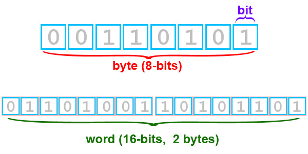
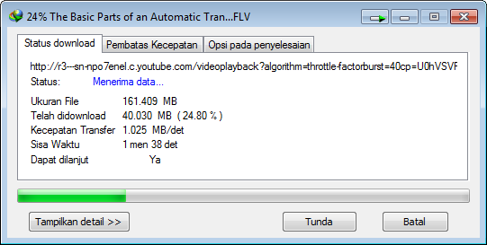
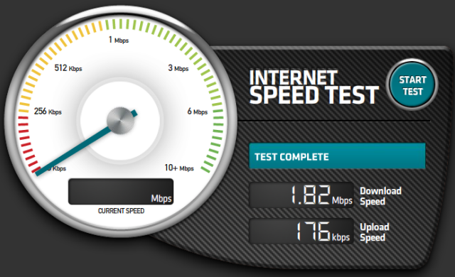

title: Memahami Bit dan Byte
description: Pernahkah anda bertanya-tanya, sebenarnya berapa kecepatan Internet Service Provider (ISP) yang anda sewa? Dikontrak kerjasama antara konsumen dengan ISP tertera demikian, namun pada informasi yang tertera saat melakukan unduhan berbeda dengan isi kontrak kerjasama.
hero: Memahami Bit dan Byte
disqus: henduino

# Memahami Bit dan Byte pada Kecepatan Internet

Pernahkah anda bertanya-tanya, sebenarnya berapa kecepatan Internet Service Provider (ISP) yang anda sewa? Dikontrak kerjasama antara konsumen dengan ISP tertera demikian, namun pada informasi yang tertera saat melakukan unduhan berbeda dengan isi kontrak kerjasama. Hal ini sering kali mencuat saat membicarakan tentang kecepatan upload dan download internet. Hal ini memang perlu dipahami dengan baik, terutama bagi mereka-mereka yang bergelut dengan mesin router. Bagi para administrator jaringan, kesalahpahaman antara bit dengan byte sering membuat proses pengesetan bandwidth internet menjadi kacau. Disinilah kita perlu memahami dengan baik tentang perbedaan bit dengan byte.

***

## Memahami Bit (Binary Digit)

Ingatlah bahwa satu bit (Binary Digit) adalah satu informasi dalam sistem digital, yang berisi 0 atau 1. Hal ini karena sistem angka biner (Binary) hanya terdiri dari 2 bilangan, yaitu 0 dan 1 atau sering disebut bilangan basis 2. Sebagai contoh, angka 1001011 memiliki panjang 7 bit. Binary Digit atau bit sering digunakan sebagai satuan terkecil dalam penyimpanan dan komunikasi informasi di dalam teori komputasi dan informasi digital. Bit juga digunakan sebagai satuan ukuran, yaitu kapasitas informasi dari sebuah Binary Digit. Lambang yang digunakan adalah bit, dan kemudian orang sepakat menggunakan huruf "b" (huruf b kecil) untuk mewakili bit (walau tidak resmi). Contoh penulisan satuan ukuran; modem dengan kecepatan 56 kbps atau 56 kb/s atau 56 kilo bit per second.

***

## Sejarah Bit

Pengkodean data dengan simbol diskrit digunakan dalam cipher Bacon (1626). Sedangkan penggunaan kode data dengan diskrit bit digunakan pada punched card yang diciptakan oleh Basile Bouchon dan Jean-Baptiste Falcon (1732), yang dikembangkan oleh Joseph Marie Jacquard (1804), dan kemudian diadopsi oleh Semen Korsakov, Charles Babbage, Hermann Hollerith, dan pada awal perancangan komputer seperti IBM.
Pada varian lain gagasan bit diawali dari penggunaan kertas pita berlubang (perforated paper tape). Pada semua sistem yang berlaku, konsep media (kartu atau pita) terdiri dari beberapa posisi lubang, setiap bagian tersebut dapat dilalui atau tidak tergantung posisi lubang, dan saat mesin melalui kartu atau pita itulah maka terbentuk satu bit informasi. Pengkodean teks dengan bit juga digunakan dalam kode Morse (1844) dan awal mesin komunikasi digital seperti teletypes dan stock ticker machines (1870).
Ralph Hartley menyarankan penggunaan ukuran logaritmik untuk informasi pada tahun 1928. Claude E. Shannon pertama kali menggunakan kata bit dalam seminar makalahnya "A Mathematical Theory of Communication" pada tahun 1948. Dia menjelaskan bahwa kata bit tersebut berasal dari John W. Tukey, yang telah menulis sebuah memo Bell Labs pada 9 Januari 1947 dengan memendekkan kata "binary digit" menjadi "bit". Yang menarik, Vannevar Bush telah menulisnya tahun 1936 pada "bits of information" yang tersimpan pada kartu punched yang digunakan dalam komputer mekanik pada waktu itu. Pemrograman komputer pertama kali dibangun oleh Konrad Zuse menggunakan notasi biner untuk angka.



*Gambar 1. Bit dan Byte*

***

## Memahami Byte

Byte adalah unit informasi digital yang umum digunakan pada komputasi dan telekomunikasi yang terdiri dari delapan bit. Jika merunut ke sejarah, byte adalah jumlah bit yang digunakan untuk mengkodekan satu karakter teks di dalam komputer, selain itu digunakan pula dalam unit pengalamatan memori terkecil pada banyak arsitektur komputer. Ukuran dari byte tergantung hardware dan tidak ada standar secara definitif yang mengharuskan dalam ukuran tertentu.

***

## Sejarah Byte

Istilah byte diciptakan oleh Werner Buchholz pada bulan Juli tahun 1956, selama fase awal desain untuk Komputer IBM Stretch. Ini adalah pengeja ulang byte untuk menghindari kesalahan mutasi ke bit. Komputer awal menggunakan sebuah variasi representasi 4-bit binary coded decimal (BCD) dan 6-bit kode untuk pencetakan pola grafis umum di Angkatan Darat dan Angkatan Laut Amerika. Ini termasuk representasi karakter alfanumerik dan simbol grafis khusus. Set ini kemudian diperluas pada tahun 1963 untuk penulisan kode 7-bit, yang disebut American Standard Code for Information Interchange (ASCII) sebagai Federal Information Processing Standard menggantikan kode teleprinter yang tidak kompatibel untuk digunakan oleh cabang-cabang yang berbeda pada pemerintah Amerika.

ASCII termasuk didalamnya perbedaan huruf besar dan huruf kecil dan sebuah set karakter kontrol untuk memfasilitasi transmisi bahasa tertulis serta fungsi perangkat pencetak, seperti pemindah halaman dan pemindah baris, dan kontrol fisik atau logis dari aliran data melalui transmisi media. Selama awal tahun 1960-an, yang juga aktif dalam standarisasi ASCII, IBM secara bersamaan memperkenalkan pada lini produk dari System/360 dengan 8-bit Extended Binary Coded Decimal Interchange Code (EBCDIC), yang merupakan reprenstasi pengembangan dari  6-bit binary-coded decimal (BCDIC) yang digunakan pada punched card. Keunggulan System/360 ini membuat penggunaan ukuran penyimpanan 8-bit digunakan dimana-mana, sedangkan secara rinci skema encoding EBCDIC dan ASCII berbeda.

Pada awal tahun 1960-an, AT&T memperkenalkan telepon digital pertama sambungan langsung jarak jauh. Ini menggunakan 8-bit µ-law encoding. Investasi besar ini menjanjikan pengurangan biaya transmisi untuk data 8-bit. Penggunaan kode 8-bit pada telepon digital juga menyebabkan 8-bit data oktet diadopsi sebagai awal unit data dasar internet. Perkembangan mikroprosesor 8-bit di sekitar tahun 1970-an sangat berperan dalam mempopulerkan ukuran penyimpanan ini. Mikroprosesor seperti Intel 8008, generasi sebelum 8080 dan 8086, digunakan pada komputer-komputer pribadi, juga mampu melakukan sejumlah kecil operasi data empat bit, seperti instruksi DAA (decimal add adjust), dan penjumlahan penanda (AC/NA), yang digunakan untuk melaksanakan rutinitas aritmatika desimal. Penjumlahan empat bit ini sering pula disebut nibbles (camilan), dan sesuai dengan digit heksadesimal. Istilah oktet kemudian digunakan untuk mempertegas penggunaan ukuran delapan bit, dan banyak digunakan misalnya dalam pendefinisian protokol.

***

## Simbol Unit

Kebingungan terhadap penggunaan simbol b (huruf b kecil) untuk bit dan B (huruf B besar) untuk byte, karena penggunaan simbol untuk kedua satuan tersebut belum secara resmi masuk dalam daftar metrik prefiks atau SI (International System of Units) prefiks. Sama membingungkannya seperti penggunaan simbol kilo apakah menggunakan k (huruf k kecil) atau K (huruf K besar). Belum resminya penggunaan simbol b untuk bit dan B untuk byte terkait dengan beberapa hal, yaitu:

* Kedua simbol ini sudah digunakan untuk satuan lain: "b" untuk barn dan "B" untuk bel;
* "bit" adalah singkatan dari "binary digit", jadi tidak mungkin untuk menyingkatnya lagi;
* Istilah byte tidak digunakan di negara-negara berbahasa Perancis, negara-negara ini menggunakan istilah octet (lambang: "o"), sehingga sulit untuk disetujui secara internasional;
* Namun karena simbol "B" untuk bel jarang digunakan, maka penggunaan "B" untuk byte menjadi hal lumrah dalam dunia komputer.
* Para pengguna dan praktisi komputer menggunakan simbol-simbol tersebut dengan beberapa acuan:
* Unit simbol untuk byte ditentukan pada IEC 60027, IEC 80000-13, IEEE 1541 dan Interchange Format Metric dengan huruf B
* Unit simbol untuk bit mengacu pada IEEE 1541 yang ditetapkan oleh Institute of Electrical and Electronics Engineers dengan huruf b

***

## Perbedaan Bit dan Byte dalam Penggunaan

Satuan bit biasanya digunakan untuk kecepatan laju pada bidang telekomunikasi, sebagian menyebutnya sebagai kecepatan transfer data antar perangkat keras. Jika melihat Model OSI (Open System Interconnection) maka satuan bit digunakan pada area Media Layer atau diarea perangkat keras. Didalam telekomunikasi, transmission rate (kapasitas transfer) telah secara tradisional dinyatakan dalam bit per second (bps) dan 1 kilobit sama dengan 1000 bit. Perhatikan keterangan dibawah in:

* bps = 1 bit/s
* Kbps = 1.000 bits/s 
* Mbps = 1.000 Kbits/s atau 1.000.000 bits/s 
* Gbps = 1.000 Mbit/s atau 1.000.000.000 bits/s 
* Tbps = 1.000 Gbit/s atau 1.000.000.000.000 bits/s

Sedangkan satuan byte biasanya digunakan pada media penyimpanan data (Data Storage), sedangkan jika melihat Model OSI, byte digunakan pada area Host Layer (terutama pada Application Layer). Perhatikan keterangan dibawah ini:

* Byte = 8 bits
* Kilobyte = 1024 bytes atau 8192 (8 x 1024) bits
* Megabyte = 1024 Kilobytes atau 1.048.576 (1024 x 1024) bytes atau 8.388.608 bits
* Gigabyte = 1024 Megabytes atau 1.073.741.824 bytes atau 8.589.934.592 bits
* Terabyte = 1024 Gigabytes atau 1.099.511.627.776 bytes atau 8.796.093.022.208 bits

## Menghitung Kecepatan Download

Ketika kita menyewa layanan internet dari ISP, berapakah kecepatan download sebenarnya? Berapa waktu yang diperlukan untuk mengunduh suatu file dengan besar file tertentu? Pertanyaan seperti ini kadang terlontar saat kita iseng-iseng memeriksa kecepatan internet dari situs penyedia internet speed test.



*Gambar 3. Informasi Kecepatan Unduhan*



*Gambar 4. Informasi Kecepatan Internet*

Perhatikan gambar diatas, bahwa perangkat lunak menampilkan informasi kecepatan unduhan dengan satuan KB/det (Kilo Byte per detik atau KBps atau KB/s). Sedangkan penyedia layanan internet, justru menyatakan kecepatan internetnya dalam bit per detik (bp/det atau bps atau bp/s). Perbedaan satuan inilah yang justru membingungkan dan selalu mengundang pertanyaan. Kenapa ISP menyatakan 1 mega tapi saat menunduh tidak sampai 1 mega? Mari kita pahami dan pecahkan pertanyaan-pertanyaan yang mengganjal tersebut...

### Contoh 1

Dalam kontrak kerjasama antara penyedia layanan internet (ISP) menyatakan bahwa bandwidth yang akan kita terima adalah 1 mega. 1 mega disini menggunakan satuan bit per detik sehingga seharusnya tertulis 1 Mbps (1 Mb/det). Maka, bandwidth sebesar 1 Mbps (mega bit per second) hanya mampu mengunduh file dengan kecepatan transfer file 122,0703125 KBps (kilo byte per second). Loh kok kecil banget? Ayo kita hitung...

Diketahui:

```
1 Mbps = 1.000 Kbps = 1.000.000 bps (kecepatan internet dalam satuan bit)
1 MBps = 1.024 KBps = 1.048.576 Bps (kecepatan transfer file dalam satuan byte)
1 byte = 8 bit (lihat penjelasan sebelumnya)
```

Maka:

Konversi dari bit ke byte dengan dibagi 8:

```
1.000.000 bps : 8 = 125.000 Bps
```

Konversi dari byte ke kilobyte dengan dibagi 1.024:

```
125.000 Bps : 1.024 = 122,0703125 KBps
```

Maka kecepatan internet 1 Mbps hanya mampu mengunduh dengan kecepatan transfer file 122,0703125 KBps

### Contoh 2

Kecepatan internet kita adalah 1 Mbps, berapa waktu yang dibutuhkan untuk mengunduh file sebesar 500 MB (Mega Byte)?

Diketahui:

Konversi dari mega byte ke kilo byte dengan mengkalikan 1.024:

```
500 MB x 1024 = 512.000 KB
```

Dibagi dengan kecepatan transfer file, misal kita bulatkan menjadi 122,1 KBps (lihat penyelesaian contoh 1):

```
512.000 KB : 122,1 KBps = 4193,284193284193 second (detik)
```

Konversi dari detik ke menit dengan dibagi 60 karena 1 menit sama dengan 60 detik:

```
4193,284193284193 detik : 60 = 69,9 menit
```

atau sekitar

```
1 jam 9 menit 9 detik
```

Nah, sekarang sudah jelaskan?!

Dibawah ini hasil perhitungan antara kecepatan internet dengan kecepatan download yang diberikan ISP di Indonesia:

* 256 kbps = 31,3 KB/s
* 512 kbps = 62,5 KB/s
* 1 mbps = 122,1 KB/s
* 5 mbps = 610,3 KB/s
* 10 mbps = 1220,7 KB/s

***

## Prinsip Oversubscription

Hal ini sangat penting untuk dipahami bagaimana suatu Internet Servie Provider (ISP) beroperasi. ISP atau Penyedia Layanan Internet pada dasarnya juga membeli konektivitas (Penyedia Bandwidth) dari operator 1 level diatasnya dan kemudian menjualnya kembali pada masyarakat yang lebih besar. Secara statistik, tidak setiap pelanggan akan menggunakan internet pada saat bersamaan dan tidak juga menggunakan bandwidth secara penuh (sebenarnya pola penyebaran ini berubah untuk layanan streaming video, tapi demi kesederhanaan penjelasan kita tidak akan membahas efek tersebut).

Konsep ini kemungkinan ISP untuk melakukan oversubscribe jalur DSL mereka, seperti halnya yang sudah dilakukan oleh operator telekomunikasi dengan jalur kabel tua. Rasio oversubscription dapat bervariasi dari 1:1 hingga 50:1 atau lebih tergantung rencana kualitas layanan ISP yang akan ditawarkan kepada pelanggan. Ini berarti jika ISP membeli jalur sebesar 10 megabit mereka bisa menawarkan kepada pelanggan DSL sebesar 1 megabit ke 50 titik pelanggan (rasio 5:1) dengan kualitas layanan tinggi, bahkan bisa saja ISP menawarkan 1 megabit DSL kepada 300 titik pelanggan (rasio 30:1) dengan kualitas layanan yang tidak dapat diandalkan (baca; jelek).

***

## Committed Information Rate (CIR)

Committed Information Rate atau dalam bahasa mesin router sering disebut limit at yang dalam bahasa Indonesia kurang lebih berarti batas kecepatan internet paling rendah yang akan diperoleh pelanggan. CIR harusnya dijelaskan oleh ISP dan diketahui dengan jelas oleh pelanggan saat melakukan kontrak sewa penggunaan internet, karena CIR berhubungan dengan bandwidth minimum yang akan diperoleh oleh pelanggan terutama dalam keadaan padat lalu lintas. Misal seperti dijelaskna diatas, jika sebuah ISP membeli 1 jalur bandwdith DSL sebesar 10 megabit dari penyedia layanan level 1 dan kemudian menggunakan rasio 5:1 yang artinya akan ditawarkan kepada 50 titik pelanggan, maka setiap pelanggan akan memperole CIR sekitar 200 kpbs.

Sebenarnya perhitungan CIR cukup kompleks, tapi kita bisa menghitung estimasi terbaik dalam pembagian bandwidth dedicated line ISP sesuai jumlah pelanggan. Bandwidth yang tersedia sebesar 10 Mbps berarti sama dengan 10.000 Kbps, dibagikan ke 50 titik pelanggan maka bandwidth minimal yang diperoleh per pelanggan sebesar 200 Kbps, hal ini cukup baik untuk standar saat ini.
Lalu bagaimana dengan ISP yang ada di sekitar kita? Apakah mereka cukup transparant dalam hal ini?

***

## Daftar Pustaka

* [Bit][1]
* [Byte][2]
* [Convert bps into Bps][3]
* [International System of Units][4]
* [Metric prefix][5]
* [IEEE 1541-2002][6]
* [Metric Interchange Format][7]
* [International Electrotechnical Commission][8]
* [ASCII][9]

[1]: http://en.wikipedia.org/wiki/Bit
[2]: http://en.wikipedia.org/wiki/Byte
[3]: http://innovationzen.com/blog/2006/07/28/the-broadband-speed-guide/
[4]: http://en.wikipedia.org/wiki/SI
[5]: http://en.wikipedia.org/wiki/SI_prefix
[6]: http://en.wikipedia.org/wiki/IEEE_1541
[7]: http://people.csail.mit.edu/jaffer/MIXF/
[8]: http://id.wikipedia.org/wiki/International_Electrotechnical_Commission
[9]: http://en.wikipedia.org/wiki/ASCII

***

<small>Artikel diperbarui pada: {{ git_revision_date_localized }}</small>