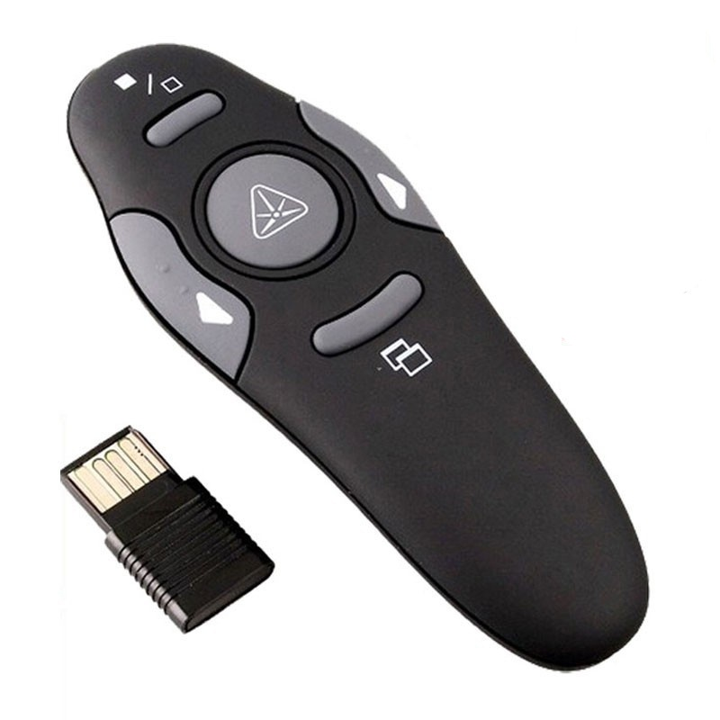
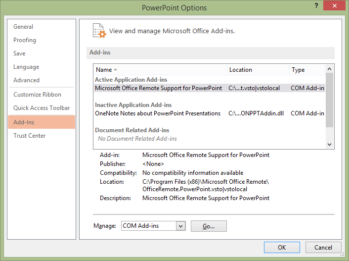
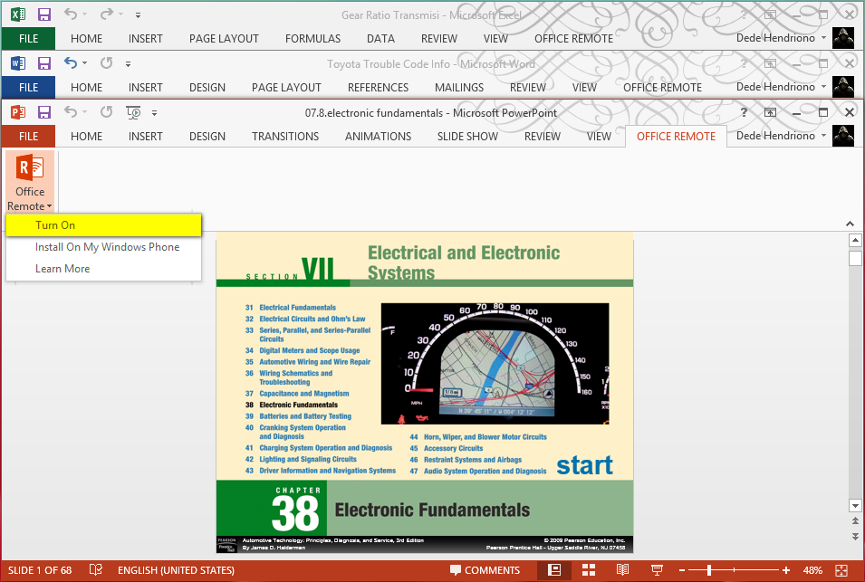
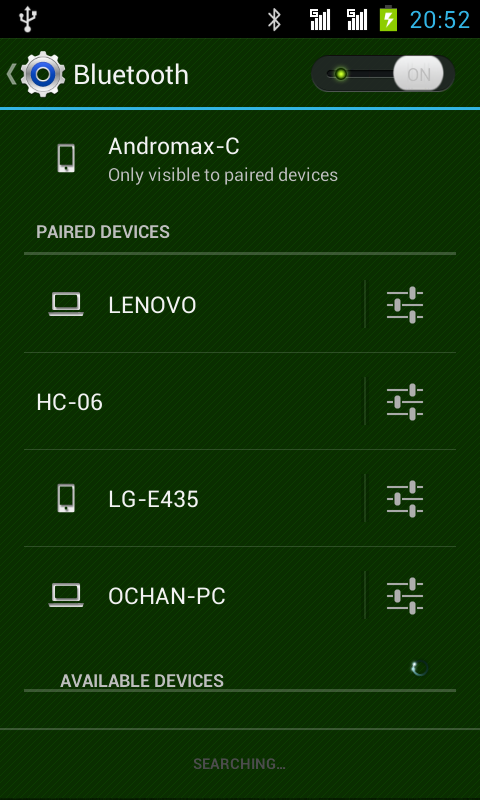
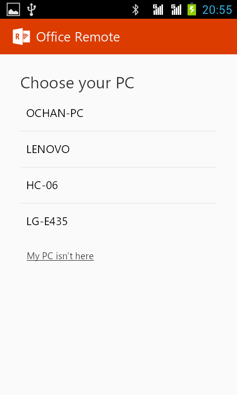
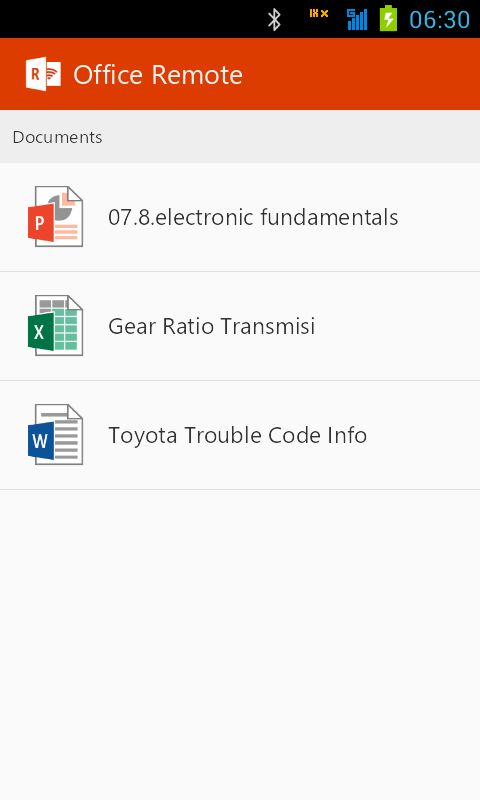
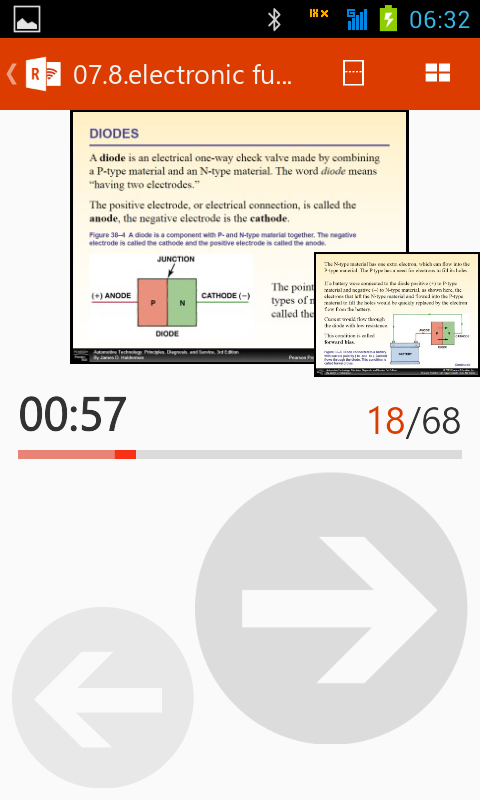

title: Office Remote
description: Office Remote Kendalikan Microsoft Office dengan Android. Office Remote dibuat untuk melengkapi produk paketan Microsoft Office. Office Remote dibuat untuk menggantikan peranan asisten presentasi hardware yang selama ini digunakan. Office Remote digunakan dengan memanfaatkan smartphone berbasis Android.
hero: Office Remote
disqus: henduino

# Office Remote Kendalikan Microsoft Office dengan Android

Menyampaikan suatu materi kepada orang lain terkadang membutuhkan visualisasi dalam bentuk gambar atau video untuk memperjelas materi yang kita sampaikan. Penggunaan perangkat lunak komputer untuk membantu penyampaian materi presentasi menjadi hal yang lazim dilakukan sekarang ini. Bahkan bagi sebagian orang menjadi tidak percaya diri jika harus mempresentasikan sesuatu materi tanpa menggunakan bantuan perangkat lunak komputer. Materi-materi presentasi yang berisi tulisan, gambar dan video biasanya disusun menjadi sebuah file yang dibuat menggunakan perangkat lunak khusus. Sebenarnya banyak perangkat lunak khusus pembuat presentasi dari mulai yang gratis hingga yang berbayar. Namun, produk Microsoft yang dibuat khusus untuk aplikasi perkantoran yang dikenal dengan nama Microsoft Office, merupakan perangkat lunak populer yang banyak digunakan di dunia. Paketan Microsoft Office itu sendiri terdiri dari beberapa aplikasi khusus perkantoran yang fungsi dari masing-masing aplikasi tersebut disediakan untuk memenuhi kebutuhan data-data perkantoran. Misalnya; Microsoft Word adalah perangkat lunak pengolah kata (word processing) yang khususkan untuk menyelesaikan pekerjaan yang berhubungan dengan sekumpulan kata atau gambar-gambar sederhana. Microsoft Excel adalah perangkat lunak pengolah tabel data (spreadsheet) yang dikhususkan untuk menyelesaikan pekerjaan yang berhubungan dengan tabel-tabel, angka-angka, serta formula-formula tertentu untuk mempermudah proses penyelesaian dan perhitungan data. Microsoft PowerPoint adalah perangkat lunak pengolah data-data presentasi yang disusun dalam bentuk slide-slide berisi kalimat, gambar, video, grapik dan lain sebagainya.

Ketika menyampaikan materi presentasi biasanya data-data pendukung tersusun dari beberapa file terpisah yang dibuat dengan aplikasi yang berbeda-beda. Misal; ketika menyampaikan laporan keuangan bulanan maka data pendukung dibuat menggunakan Microsoft Excel. Data-data pendukung visualisasi presentasi tidaklah selalu mampu disusun dalam satu file yang dibuat dengan perangkat lunak khusus presentasi (misal: Microsoft PowerPoint), namun terkadang memang harus disampaikan dengan data-data yang dibuat pada masing-masing aplikasi perkantoran tersebut.

***

## Asisten Presentasi – Manusia

Pada saat menyampaikan materi presentasi, maka visualisasi data-data pendukung yang telah dibuat melalui aplikasi perkantoran biasanya ditampilkan pada sebuah layar dengan bantuan proyektor, LCD atau perangkat sejenis. Data-data ditampilkan secara bergantian pada layar, slide demi slide, data demi data, dan hal ini terkadang cukup merepotkan pemateri. Belum lagi kendala-kendala teknis menambah daftar pemicu stress pemateri...

Untuk mempermudah penyampaian visualisasi data-data presentasi, biasanya pemateri dibantu oleh seorang asisten. Kelemahan dengan cara ini adalah antara asisten dengan pemateri tidaklah sinkron dalam menyuguhkan visualisasi data. Hal ini membuat proses penyampaian materi terkadang menjadi tampak repot bahkan kacau. Keadaan seperti ini lebih sering dihindari oleh para pemateri yang memiliki jam terbang banyak dengan materi yang cukup rumit. Sehingga para pemateri lebih nyaman menggunakan asisten presentasi berupa hardware (perangkat keras) yang tersedia banyak pada toko-toko komputer.

***

## Asisten Presentasi – Hardware

Asisten presentasi berupa hardware lebih sering digunakan oleh para pemateri karena dalam menyuguhkan data-data visualisasi presentasi lebih sinkron dengan materi yang disampaikan. Harga yang terjangkau, kemudahan dalam pengoperasian, dan laser pointer yang terintegrasi membuat alat bantu jenis ini menjadi perangkat yang favorit digunakan oleh para pemateri. Namun hardware asisten presentasi ini memiliki beberapa kelemahan, diantaranya:

1. Baterai lumayan boros, karena laser pointer biasanya membutuhkan daya yang cukup besar. Sehingga penggantian baterai remote presentasi lebih sering dilakukan; 
2. Perpindahan slide demi slide cukup merepotkan, apalagi jika harus meloncat-loncat antar slide yang jedanya melewati beberapa slide;
3. Hanya mendukung perangkat lunak presentasi semisal Microsoft Office PowerPoint, dan tidak mendukung seluruh perangkat lunak perkantoran (misal; Microsoft Office Word, Microsoft Office Excel dan sepaketnya).

Kendala diatas membuat para pemateri terkadang malas untuk menggunakan asisten presentasi perangkat keras.

***

## Asisten Presentasi - Smartphone

Android merupakan salah satu produk smartphone yang sedang merajai dunia mobile phone didunia ini yang mampu memberikan banyak sekali kemudahan kepada para penggunanya. Para pengembang Android pun berlomba-lomba menciptakan perangkat lunak yang berdaya guna. Sehingga semakin hari perangkat lunak yang tersedia semakin beragam memenuhi kebutuhan manusia. Microsoft sebagai pengembang sistem operasi komputer yang populer didunia pun tidak mau ketinggalan mengembangkan berbagai perangkat lunak untuk smartphone berbasis Android. Salah satunya adalah Office Remote.
Office Remote dibuat untuk melengkapi produk paketan Microsoft Office. Office Remote dibuat untuk menggantikan peranan asisten presentasi hardware yang selama ini digunakan. Office Remote digunakan dengan memanfaatkan smartphone berbasis Android atau berbasis Windows Phone sebagai pengendali (remote) data-data visualisasi presentasi. Beberapa keuntungan menggunakan Office Remote, antara lain:

1. Mampu mengendalikan hampir semua data yang dibuat melalui aplikasi Microsoft Office, baik itu Office Word, Office Excel, Office PowerPoint dan saudaranya;
2. Tidak perlu membeli hardware asisten presentasi, cukup manfaatkan smartphone berbasis Android atau Windows Phone;
3. Perangkat lunak yang berbasis Android atau Windows Phone tersedia gratis;
4. Add-Ins Office Remote untuk Microsoft Office tersedia gratis;
5. Mudah dalam installasi dan pengoperasian;
6. Halaman-halaman data yang dibuat pada komputer menggunakan Microsoft Office akan tampil pada smartphone sehingga mudah dalam berpindah-pindah data dari satu slide ke slide lainnya bahkan berpindah antar data baik dari Office Word, Office Excel maupun Office PowerPoint.

Office Remote terdiri dari dua bagian, yaitu bagian yang terpasang pada komputer sebagai Add-Ins Microsoft Office dan Office Remote yang terpasang pada Android sebagai remote atau pengendali.

***

## Office Remote pada Komputer

Office Remote dapat bekerja dengan baik jika kedua perangkat yang akan saling berkomunikasi yaitu komputer dengan smartphone didalamnya sudah terpasang perangkat lunak tersebut. Untuk memasang Office Remote pada komputer, ikuti langkah dibawah ini:

1. Unduh aplikasi Add-Ins Microsoft Office pada [link ini][1].
2. Pastikan bahwa tidak ada aplikasi Microsoft Office yang sedang aktif.
3. Klik mouse dua kali pada file OfficeRemoteSetup.exe hasil unduhan dan ikuti petunjuk untuk memasang aplikasi ini pada komputer.
4. Jika pemasangan aplikasi sudah selesai, buka salah satu aplikasi Microsft Office, misal; Microsoft Office PowerPoint.
5. Perhatikan menu-menu pada Microsoft Office PowerPoint, pastikan ada tambahan menu baru, yaitu “Office Remote”.
6. Masuklah ke menu “Options” misal; “PowerPoint Options” seperti gambar dibawah ini. Dan perhatikan pada bagian “Active Application Add-Ins”, pastikan bahwa “Microsoft Office Remote Support for PowerPoint” ada didalamnya. Dan periksa semua keadaan ini pada aplikasi Microsoft Office lainnya.

Sampai tahap ini, proses pemasangan Add-Ins Office Remote telah selesai. Selanjutnya adalah pemasangan Office Remote pada smartphone berbasis Android.

***

## Office Remote pada Android

Karena penulis hanya memiliki smartphone berbasis Android maka hanya akan dibahas integrasi Office Remote pada Android saja. Untuk integrasi Office Remote pada Android, ikuti langkah dibawah ini:

1. Unduh dan install aplikasi [Office Remote dari PlayStore melalui link ini][1].
2. Tunggu proses verifikasi dan installasi selesai.
3. Jika koneksi internet anda terbatas, unduh aplikasi Office Remote untuk komputer dan Android pada link ini. (hanya mirror, isi aplikasinya sama saja)

Proses installasi pada komputer dan pada Android selesai, selanjutnya adalah proses komunikasi dan sinkronisasi kedua perangkat.

***

## Sinkronisasi Office Remote

Setelah proses installasi Office Remote selesai, maka selanjutnya adalah menghubungkan komputer dengan Android dengan mengikuti langkah dibawah ini:

* [x] Aktifkan Bluetooth pada komputer dan pada Android. Hal ini karena Office Remote berkomunikasi melalui jalur komunikasi radio Bluetooth.
* [x] Buka aplikasi Microsoft Office dan sebaiknya dibuka juga file yang berisi data.
* [x] Klik menu “Office Remote” dan submenu dropdown “Office Remote” kemudian pilih “Turn On”. Hal ini agar aplikasi Microsoft Office yang sedang aktif bisa langsung dikenali oleh perangkat Office Remote pada Android. Jika aplikasi Microsoft Office belum di “Turn On” maka Android tidak mampu melakukan sinkronisasi data.

* [x] Lakukan sinkronisasi Bluetooth pada Android melalui “Setting – Bluetooth”. Pastikan bahwa komputer sudah masuk pada “Paired Devices”.

* [x] Buka aplikasi Office Remote pada Android. Pada area “Choose your PC” pilih perangkat yang sesuai dengan nama komputer.

* [x] Setelah komputer dipilih maka kotak dialog baru muncul. Dibawah “Documents” adalah nama-nama file yang sedang di buka oleh aplikasi Microsoft Office pada komputer.

* [x] Pilih salah satu file yang akan dipresentasikan, maka secara otomatis komputer kita akan dikendalikan oleh Android dan materi presentasi siap disampaikan.

Untuk menggunakan fasilitas ini, silahkan telusuri lebih jauh dan sesuaikan dengan kebiasaan kita agar proses pemaparan materi yang di bantu presentasi akan lebih nyaman, mudah, dan tepat. Selamat mencoba dan semoga berhasil...

***

[1]: https://drive.google.com/file/d/1_GfNIzNIVgJXCQ4pNkY10ytDsQa7LUJM/view?usp=sharing