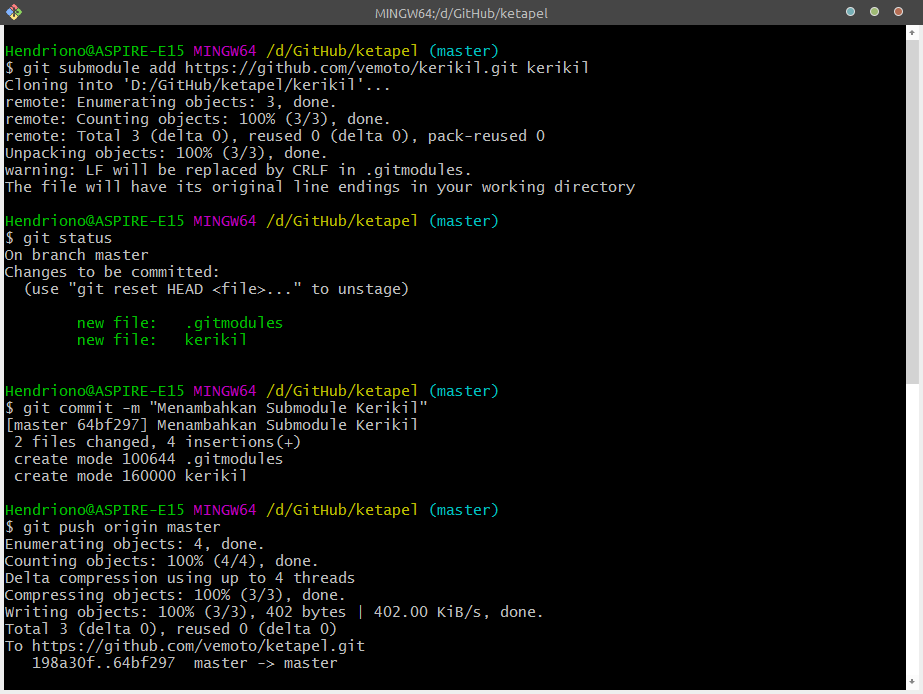
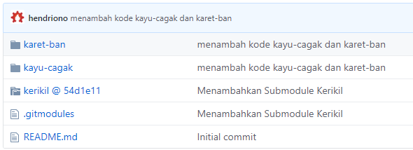

title: Menggunakan Submodule Git
description: Submodules adalah repositori Git yang ditanamkan di dalam repositori induk, melalui jalur tertentu di direktori kerja repositori induk.
hero: Menggunakan Submodule Git
disqus: henduino

# Menggunakan Submodule pada Git
Pada umumnya, setiap proyek perangkat lunak yang dikembangkan oleh seseorang, biasanya akan membutuhkan dan atau bergantung pada proyek lain, perpustakaan, atau kerangka kerja lainnya. Git menyediakan `submodule` untuk membantu masalah ini. Submodule memungkinkan Kita untuk memasukkan atau menanamkan satu atau lebih repositori sebagai sub-folder di dalam repositori yang sedang kita buat atau kembangkan.

Untuk proyek yang komplek atau banyak, submodule bukanlah solusi terbaik, bekerja dengan submodule bisa saja menjadi sangat rumit, tetapi mari kita pelajari bagaimana menggunakan submodule pada Git terutama GitHub.

* * *

## Menambahkan Submodule
Sebagai contoh Anda sedang mengerjakan proyek yang disebut `ketapel`. Didalam proyek `ketapel` sudah tersedia folder kode `kayu-cagak` dan folder kode `karet-ban`.

Disaat yang sama, di repositori yang lain, Anda punya proyek lain yang disebut `kerikil` dan itu hanya sebuah perpustakaan umum, tetapi Anda berpikir itu akan menjadi sempurna untuk proyek `ketapel`.

Anda dapat menambahkan proyek `kerikil` sebagai submodule dari proyek `ketapel`. Gunakan perintah dibawah ini untuk menambahkan repositori proyek `kerikil` ke dalam repositori proyek `ketapel`:
``` bash
git submodule add https://github.com/<user>/kerikil.git kerikil
```
Penggunaan perintah diatas ketika Anda berada di dalam repositori proyek `ketapel`.


*Gambar 1. Penggunaan Perintah Submodule Git*

Setelah perintah tersebut digunakan, Anda akan memiliki folder `kerikil` di dalam repositori `ketapel`, tetapi jika Anda membuka folder `kerikil`, tetapi juga tergantung pada versi Git Anda, Anda mungkin tidak akan menemukan apa-apa.

Versi Git yang yang terbaru akan mengunduh dan menempatkan `kerikil` secara otomatis, tetapi versi yang lebih lama akan meminta Anda untuk secara eksplisit memberitahu Git agar mengunduh konten dari `kerikil`. Gunakan perintah ini jika Anda menggunakan Git versi lama:
``` bash
git submodule update --init --recursive
```
Jika semuanya berjalan baik, Anda dapat menemukan perubahan dan Anda akan memiliki folder `kerikil` di dalam repositori `ketapel` dengan semua konten yang berasal dari repositori `kerikil`.

Tampilan pada GitHub, ikon folder `kerikil` akan memiliki sedikit indikator yang menunjukkan bahwa itu adalah submodule:


*Gambar 2. Indikator Ikon Folder Submodule GitHub*

Dan ketika anda membuka folder `kerikil` maka Anda akan di bawa menuju repositori `kerikil`.

Nah ini dia! Anda telah berhasil menyematkan repositori `kerikil` di dalam repositori `ketapel`. Anda dapat berinteraksi dengan semua konten dari `kerikil`, seolah-olah folder `kerikil` itu bagian terintegrasi di dalam repositori `ketapel` (dan karena memang begitu).

Pada baris perintah (command-line), perintah Git yang digunakan didalam repositori `ketapel` (atau didalam folder lain, seperti karet-ban dan cagak-kayu) akan beroperasi pada "repositori induk" ketapel, tetapi perintah yang Anda gunakan pada folder `kerikil` hanya akan beroperasi pada repositori `kerikil`:
``` sh
cd ~/ketapel
git log # menampilkan log commit dari Proyek Ketapel
cd ~/ketapel/karet-ban
git log # masih menampilkan log commit dari Proyek Ketapel
cd ~/ketapel/kerikil
git log # menampilkan commit dari Proyek Kerikil
```

* * *

## Bergabung pada Sebuah Proyek Menggunakan Submodule
Sekarang, misalkan Anda adalah seorang kolaborator baru yang akan bergabung dengan Proyek Ketapel. Tentunya Anda akan memulainya dengan menjalankan printah `git clone` untuk mengunduh konten dari repositori `ketapel`. Setelah itu, jika Anda membuka folder `kerikil`, Anda pasti tidak akan menemukan apa-apa.

Sekali lagi, Git mengharuskan kita secara eksplisit untuk mengunduh konten submodule. Anda dapat menggunakan perintah `git submodule update --init --recursive`, tetapi jika Anda melakukan `clone` proyek `ketapel` untuk pertama kalinya, Anda dapat menggunakan perintah `clone` yang dimodifikasi untuk memastikan Anda mengunduh semuanya, termasuk submodule didalamnya. Gunakan perintah dibawah ini:
``` sh
git clone --recursive <alamat url proyek>
```

* * *

## Alihkan ke Submodule
Mungkin agak sulit untuk mengambil subfolder yang ada didalam sebuah repositori dan kemudian mengubahnya menjadi *dependensi eksternal* (sesuatu yang bisa digunakan oleh proyek lain). Mari kita lihat sebuah contoh berikut.

Misal Anda akan memulai proyek baru - kaleng ajaib - yang ternyata di dalam proyek tersebut membutuhkan `karet-ban`, sedangkan `karet-ban` adalah sub folder dari proyek `ketapel`. Mari kita ambil `karet-ban` yang sudah Anda buat untuk proyek `ketapel`, membaginya / memisahkannya menjadi repositori yang berdiri sendiri, dan kemudian menanamkannya ke dalam kedua proyek tersebut (proyek `ketapel` dan proyek `kaleng ajaib`) melalui submodule.

Anda dapat mengambil semua dari folder `karet-ban` yang ada di dalam proyek `ketapel` dan mengekstraknya ke dalam repositori baru dengan tetap mempertahankan histori commit.

Mari kita mulai dengan mengekstraksi isi folder `karet-ban` keluar dari proyek `ketapel`. Anda dapat menggunakan perintah `git filter-branch`, kemudian membiarkan apa saja kecuali hal-hal yang berhubungan dengan commit terkait `karet-ban`. Perintah `git filter-branch` akan menulis ulang histori repositori kita, sehingga terlihat seolah-olah folder `karet-ban` merupakan repositori yang berdiri sendiri selama ini. Untuk informasi lebih lanjut tentang git filter-branch, silahkan baca [artikel ini][1].

Langkah pertama adalah membuat salinan `ketapel` untuk dikerjakan — tujuan akhirnya adalah membuat folder `karet-ban` sebagai repositori yang berdiri sendiri, jadi biarkan `ketapel` apa adanya. Anda dapat menggunakan `cp` dan `-r` untuk menyalin seluruh folder `ketapel` secara rekursif ke folder baru `karet-ban`.
``` sh
cd ..
cp -r ketapel karet-ban
```
Sekarang tampak `karet-ban` bagian lain dari `ketapel`, lalu sekarang, dari dalam repositori `karet-ban`, jalankan perintag `git filter-branch`:
``` sh
cd karet-ban # pindah ke direktori karet-ban
pwd # periksa dua kali sebelum memproses!
git filter-branch --subdirectory-filter karet-ban -- --all
```
Sampai di sini, Anda akan memiliki folder karet-ban, yang merupakan repositori yang mirip dengan Proyek `ketapel`, tetapi hanya memiliki file dan sejarah (history) dari folder `karet-ban` tersebut.

Karena Anda menyalinnya dari `ketapel`, repositori baru ini masih akan memiliki cabang pelacakan jarak jauh yang Anda siapkan saat di `ketapel`. Sedangkan Anda tidak ingin mengembalikan `karet-ban`kembali ke `ketapel`. Anda harus mengarahkannya ke repositori baru.

Buat repositori baru untuk `karet-ban` di GitHub, lalu perbarui remote untuk `karet-ban`. Dengan asumsi Anda memanggil remote origin, Anda bisa menuliskan perintah:
``` sh
git remote set-url origin https://github.com/<user>/karet-ban
```
Kemudian Anda dapat menerbitkan "modul karet-ban generik" yang baru dengan `git push`.

Sekarang setelah Anda memisahkan `karet-ban` ke dalam repositori sendiri, Anda harus menghapus folder `karet-ban` lama dari repositori `ketapel` dengan perintah:
``` sh
git rm -r karet-ban
git commit -m "Membuang karet-ban (persiapan untuk submodule)"
```
Untuk memperbarui proyek `ketapel` dengan menggunakan `karet-ban` sebagai submodule, gunakan perintah ini:
``` sh
git submodule add https://github.com/<user>/karet-ban karet-ban
git commit -m "submodule karet-ban"
```
Seperti yang pernah kita lakukan sebelumnya ketika kita menambahkan `kerikil`, *nah* sekarang kita telah memiliki repositori-didalam-repositori. Tiga repositori telah terbentuk, yaitu: repositori "induk" `ketapel`, ditambah dua repositori "sub", `kerikil` dan `karet-ban`.

Selain itu, jika kita melihat kembali sejarah `ketapel`, kita akan melihat commit awal yang telah kita buat pada `karet-ban` ketika itu masih sebagai folder - menghapus folder tidaklah menghapus history (sejarah). Terkadang hal ini bisa sedikit membingungkan - karena repositori `karet-ban` adalah "anak" yang merupakan versi lama yang telah disalin dan dimodifikasi dari commit `ketapel` yang lama, bahkan kita seperti mengalami *déja vu*.

Sayangnya, setiap kolaborator yang telah melakukan *clone* `ketapel` pada saat ini hanya akan memiliki folder `karet-ban` kosong. Anda bisa mengingatkan kolaborator untuk menjalankan perintah ini untuk memastikan mereka memiliki semua konten submodule:
``` sh
git submodule update --init --recursive
```
Jika Anda juga ingin menambahkan `karet-ban` sebagai submodule ke proyek *kaleng ajaib* Anda cukup mengikuti prosedur yang sama yang digunakan sebelumnya ketika Anda menambahkan `kerikil` ke ke dalam proyek `ketapel`:
``` sh
cd ~/kaleng-ajaib
git submodule add https://github.com/<user>/karet-ban karet-ban
git commit -m "menambahkan submodule karet-ban"
git submodule update --init --recursive
```
*Bagaimana? Mudah bukan?*

* * *

## Kesimpulan
* Sebelum Anda menambahkan repositori sebagai submodule, periksa terlebih dahulu untuk memperhatikan apakah Anda memiliki alternatif yang lebih baik. Submodule Git bekerja cukup baik untuk kasus-kasus sederhana, tetapi akhir-akhir ini ada peralatan yang lebih baik untuk mengelola dependensi daripada yang dapat ditawarkan oleh submodule Git. Bahasa modern seperti Go memiliki sistem pengelolaan dependensi didalam Git sejak awal dibuat. Yang lain, seperti Ruby rubygems, Node.js, npm , atau Cocoa's CocoaPods dan Carthage, telah ditambahkan fungsi terintegrasi oleh komunitas pemrograman. Bahkan pengembang front-end memiliki alat seperti Bower untuk mengelola perpustakaan dan kerangka kerja untuk sisi klien JavaScript dan CSS.
* Ingat bahwa Git tidak mengunduh konten submodule secara default. Jika Anda menambahkan submodule ke proyek yang ada, pastikan siapa pun yang bekerja di proyek tersebut tahu bahwa mereka perlu menjalankan perintah seperti `git submodule update` dan `git clone --recursive` untuk memastikan mereka mendapatkan keseluruhan isi proyeknya - ini termasuk penyebaran otomatis atau layanan pengujian yang mungkin terlibat dalam proyek! Kami menyarankan Anda menggunakan sesuatu seperti "Scripts to Rule Them All" untuk memastikan bahwa semua kolaborator dan layanan memiliki akses ke konten repositori yang sama di mana pun.
* Submodules mengharuskan Anda untuk menyeimbangkan konsistensi dan kenyamanan dengan cermat. Pengaturan yang digunakan di sini sangat mengutamakan konsistensi, dengan mengorbankan sedikit kenyamanan. Biasanya yang terbaik untuk mengelola proyek dengan submodule dengan dikunci menggunakan SHA tertentu, sehingga semua kolaborator menerima konten yang sama. Tetapi pengaturan ini juga menyulitkan pengembang di repositori "induk" untuk menyumbangkan perubahan kembali ke repositori submodule.
* Ingat bahwa kolaborator tidak akan secara otomatis melihat pembaruan pada submodul — jika Anda memperbarui submodule, Anda mungkin perlu mengingatkan teman Anda untuk menjalankan `git submodule update` atau mereka mungkin akan melihat perilaku yang tidak biasanya pada proyek tersebut.
* Mengelola repositori yang dinamis, berkembang dengan cepat pada submodul dapat dengan cepat memunculkan frustasi. Artikel ini difokuskan pada hubungan repositori sederhana antara orang tua dan anak. Artikel selanjutnya di masa depan akan merinci beberapa strategi untuk membantu mengelola alur kerja submodule yang lebih kompleks.
* Selamat belajar dan belajar lagi!

* * *

## Daftar Pustaka
1. [Working with submodules][2]
2. [Using submodules in Git][3]
3. [Git Tools - Submodules][4]
4. [git-filter-branch][5]

* * *

[1]: https://help.github.com/articles/splitting-a-subfolder-out-into-a-new-repository/
[2]: https://github.blog/2016-02-01-working-with-submodules/
[3]: https://www.vogella.com/tutorials/GitSubmodules/article.html
[4]: https://git-scm.com/book/en/v2/Git-Tools-Submodules
[5]: https://git-scm.com/docs/git-filter-branch

<small>Artikel ditulis pada: {{ git_revision_date_localized }}</small>