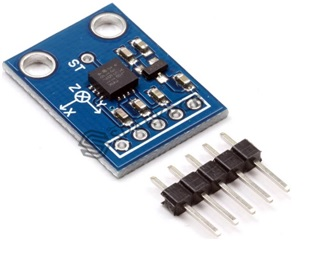
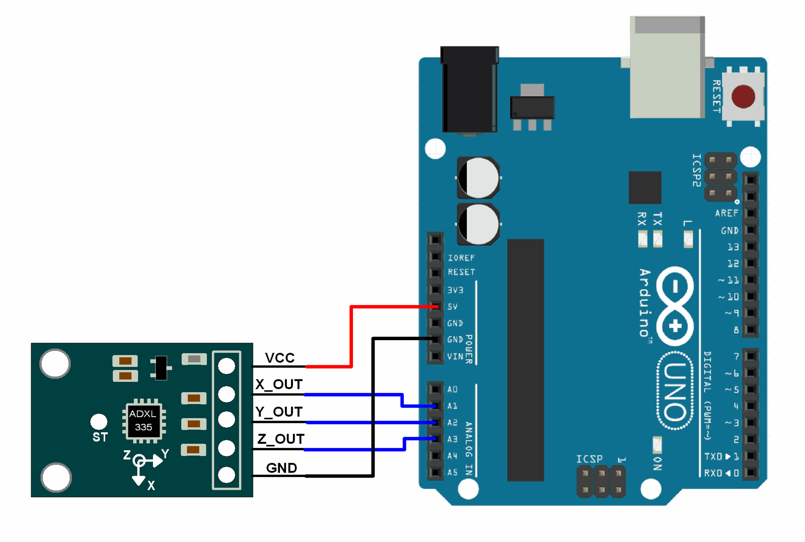

title: Accelerometer ADXL335
description: Arduino library to control Grove - 3-Axis Analog Accelerometer ADXL335
hero: Accelerometer ADXL335
path: tree/master/docs/library/sensor
source: accelerometer-adxl335.md
disqus: 

# Accelerometer ADXL335

## About ADXL 335 Accelerometer

What is Acceleration and ADXL 335 Accelerometer?  Acceleration is a process in which velocity is changed with respect to time and it is a vector quantity. Similarly, velocity is a speed and direction. There are two ways for explaining acceleration of anything  first one is change in speed and second one is change in direction. Sometimes both are changed simultaneously. If we talk about ADXL 335 accelerometer, then this accelerometer is a device that is used for measuring acceleration of any object. It measures the acceleration in the form of analog inputs,  in three dimension direction such as X,Y and Z. It is low noise and less power consume device. When it is used for acceleration measure purposes then it  is interfaced with any type of controller such as microcontroller or Arduino etc. It is mostly used in construction working machines such as drilling ,driving piles and demolition etc., human activities machines such running, walking, dancing and skipping etc. It is easily available in market or online shop.



* * *

## Pin Configure of ADXL 335 Accelerometer

Every ADXL 335 accelerometer consists of five pins which are used for different purposes. Its pin configuration is shown in below table and this ADXL 335 accelerometer is connected with any controller according to this table.

| Number of Pin | Configuration                                                                                                                                                    |
|---------------|------------------------------------------------------------------------------------------------------------------------------------------------------------------|
| 1             | This is VCC pin and is used for power on the ADLX 335 accelerometer. It is connected with 3.3V dc power source                                                   |
| 2             | This is ground pin and is used for supplying ground to this ADLX 335 accelerometer. It is connected with source ground.                                          |
| 3             | This is X pin and is used for analog input in x axis dimension. This pin provides analog input signal to controller which is measured by ADLX 335 accelerometer. |
| 4             | This is Y pin and is used for analog input in y axis dimension. This pin provides analog input signal to controller which is measured by ADLX 335 accelerometer. |
| 5             | This is Z pin and is used for analog input in Z axis dimension. This pin provides analog input signal to controller which is measured by ADLX 335 accelerometer. |

* * *

## Working Principle of ADXL 335 Accelerometer

Currently different types of  accelerometers are available in market which are used for different purposes. Some works on the principle of MEMS( micro electro mechanical sensor) working. Which consists of a small mass which is etched into silicon surface and then integrated into a small circuit. When force is applied on this mass then it covers some displacement, so acceleration is produced in this mass according to newton second law of motion F= ma which is sensed by its sensor. Similarly, if we talk about analog accelerometers then they work on two principles such as capacitive sensing and piezo electric sensing. Both have different advantages and disadvantages. Similary,ADXL335 accelerometer is an analog accelerometer therefore it works on the principle of capacitive sensing. In capacitive sensing accelerometer, when it is moved in any direction then its capacitance is changed. When this capacitance is changed then its analog voltages are changed which is sensed  by its interfacing controller.

* * *

## Interfacing Diagram
For gaining proper result form ADXL 335 accelerometer, a controller is necessary for interfacing purposes. We can interface with it any type of controller but here we shell only tell the user how interface the Arduino board with ADXL 335 accelerometer.



* * *

## Sample Sketch

Finding the roll and pitch of the device using analog voltages of accelerometer module and displaying them on serial monitor of Arduino.

``` c
#include <math.h>
const int x_out = A1; /* connect x_out of module to A1 of UNO board */
const int y_out = A2; /* connect y_out of module to A2 of UNO board */
const int z_out = A3; /* connect z_out of module to A3 of UNO board */

void setup() {
  Serial.begin(9600); 
}

void loop() {
  int x_adc_value, y_adc_value, z_adc_value; 
  double x_g_value, y_g_value, z_g_value;
  double roll, pitch, yaw;
  x_adc_value = analogRead(x_out); /* Digital value of voltage on x_out pin */ 
  y_adc_value = analogRead(y_out); /* Digital value of voltage on y_out pin */ 
  z_adc_value = analogRead(z_out); /* Digital value of voltage on z_out pin */ 
  Serial.print("x = ");
  Serial.print(x_adc_value);
  Serial.print("\t\t");
  Serial.print("y = ");
  Serial.print(y_adc_value);
  Serial.print("\t\t");
  Serial.print("z = ");
  Serial.print(z_adc_value);
  Serial.print("\t\t");
  //delay(100);
  
  x_g_value = ( ( ( (double)(x_adc_value * 5)/1024) - 1.65 ) / 0.330 ); /* Acceleration in x-direction in g units */ 
  y_g_value = ( ( ( (double)(y_adc_value * 5)/1024) - 1.65 ) / 0.330 ); /* Acceleration in y-direction in g units */ 
  z_g_value = ( ( ( (double)(z_adc_value * 5)/1024) - 1.80 ) / 0.330 ); /* Acceleration in z-direction in g units */ 

  roll = ( ( (atan2(y_g_value,z_g_value) * 180) / 3.14 ) + 180 ); /* Formula for roll */
  pitch = ( ( (atan2(z_g_value,x_g_value) * 180) / 3.14 ) + 180 ); /* Formula for pitch */
  //yaw = ( ( (atan2(x_g_value,y_g_value) * 180) / 3.14 ) + 180 ); /* Formula for yaw */
  /* Not possible to measure yaw using accelerometer. Gyroscope must be used if yaw is also required */

  Serial.print("Roll = ");
  Serial.print(roll);
  Serial.print("\t");
  Serial.print("Pitch = ");
  Serial.print(pitch);
  Serial.print("\n\n");
  delay(1000);
}
```