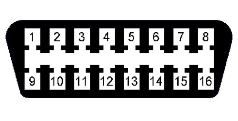
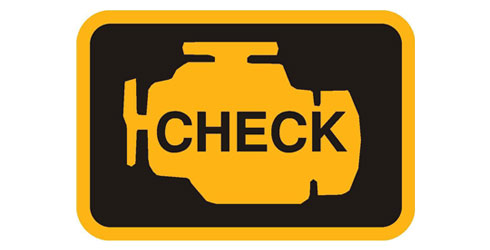

title: Mengenal EOBD EOBD2 dan OBDII
description: OBD digunakan untuk memantau dan mengurangi emisi kendaraan. Semua kendaraan juga harus memiliki soket standar diagnostik EOBD yang disediakan untuk mengakes ke sistem kendaraan tersebut.
hero: Mengenal EOBD EOBD2 dan OBDII
disqus: 

# Apa EOBD, EOBD2 dan OBDII?

EOBD adalah singkatan dari European On-Board Diagnostic. Semua kendaraan ber-mesin bensin yang dijual di Eropa sejak tanggal 1 Januari 2001, dan mobil bermesin diesel yang diproduksi dari tahun 2003, harus memiliki sistem on-board diagnostic untuk memantau emisi mesin. Sistem ini diperkenalkan sesuai dengan [Regulasi Standar Emisi Kendaraan Eropa Directive 98/69/EC][1] untuk memantau dan mengurangi emisi kendaraan terutama mobil. Semua kendaraan juga harus memiliki soket standar diagnostik EOBD yang disediakan untuk mengakes ke sistem kendaraan tersebut.

*Gambar 1. Soket Standar E-OBD*

Hanya scan tools dan code reader terbaru yang mampu membaca informasi-informasi diagnostik melalui soket EOBD. Untuk informasi tentang pin yang digunakan pada port EOBD akan dibahas lebih detail pada artikel terpisah.

***

## Lampu "Check Engine" Menyala

Peringatan lampu "Check Engine" yang menyala didasbor harus diketahui pertama kali oleh pemilik kendaraan, ini sebagai informasi kepada pemilik kendaraan bahwa terjadi masalah pada kendaraannya. Namun, informasi yang dikeluarkan melalui lampu "Check Engine" hanya memberikan sedikit sekali informasi untuk pemilik kendaraan. Lampu ini merupakan pertanda bahwa pemilik kendaraan harus membawa kendaraannya ke garasi dan menyelidiki masalah yang terjadi pada kendaraannya.

*Gambar 2. Simbol Check Engine*

***

## Masalah Diagnosis

Dengan peralatan yang canggih dan modern, seorang teknisi yang terampil harus mampu mendiagnosa dan memecahkan permasalah-permasalahan yang timbul pada kendaraan, namun sebelum itu, diperlukan suatu alat konsol yang canggih baik dari dealer utama maupun dari pihak ketiga sebagai penyedia peralatan. 

***

## Teknologi Baru

Pengenalan standar Eropa On-Board Diagnostic telah membuka peluang baru untuk para pemilik garasi atau bengkel. Berbagai alat modern dengan harga murah telah tersedia dipasaran yang digunakan untuk membaca dan membersihkan kode-kode kesalahan (error code), untuk melihat pembacaan secara langsung (saat mesin hidup) atau yang tersimpan didalam sensor kendaraan, dan mematikan lampu "Check Engine".

***

## Apa Informasi yang Tersedia?

EOBD memonitor sistem dan menyimpan informasi dari seluruh sensor yang ada, misal; sersor aliran udara (air flow sensor) dan sensor oksigen (oxygen sensor). Nilai Sensor yang keluar dari rentang (range) yang dapat diterima akan memicu [Diagnostic Trouble Code][2] (DTC). Alat diagostik terbaru dapat membantu kita untuk membaca dan menginterpretasikan kode ini, dan melihat secara langsung keluaran (output) dari sensor.

***

## EOBD atau OBD II?

On-Board Diagnostics, atau OBD, adalah nama yang diberikan untuk kontrol emisi dan sistem manajemen mesin yang diperkenalkan pertama kali pada mobil. Tidak ada standar tunggal untuk OBD sehingga memicu produsen mobil menggunakan sistem-sistem yang berbeda (bahkan berbeda pula untuk model mobil pribadi). Sistem OBD kemudian dikembangkan dan ditingkatkan kemampuannya, sesuai dengan persyaratan pemerintah Amerika Serikat hingga lahirlah OBD II yang menjadi standar saat ini. Persyaratan Federasi OBD II diberlakukan untuk mobil-mobil Amerika Serikat yang dijual sejak tahun 1996.
EOBD adalah persamaan standar OBD II Amerika hanya saja berlaku di Eropa, standar EOBD ini diberlakukan untuk mobil bensin yang dijual di Eropa sejak tahun 2001 (dan diberlakukan untuk mobil diesel 3 tahun kemudian). Untuk informasi lebih lanjut tentang mengapa OBD II hanya bekerja pada mobil bensin 2001 di Eropa, dan tidak diterapkan pada mobil Inggris dan Eropa dari tahun 1996, akan dibahas lain waktu.

***

## Apa EOBD2?

EOBD2 ini bukanlah versi terbaru dari EOBD. EOBD singkatan dari 'European On-Board Diagnostic', sedangkan EOBD2 sebenarnya singkatan dari 'European On-Board Diagnostic, Generasi Kedua'. EOBD2 cenderung untuk merujuk ke fitur spesifik pabrikan, yang biasanya hanya tersedia untuk produsen kendaraan tertentu, misal; Ford. Itu berarti tidak ada 'mobil EOBD2', yaitu mobil yang membutuhkan alat khusus EOBD2 untuk mengakses informasi diagnostik. Namun EOBD2 memungkinkan fungsi pengambilan informasi lebih lanjut dari sebuah mobil EOBD/OBDII.

***

## Pranala Luar

* [OBD II Home Page][3]
* [OnBoard Diagnostic II Help][4]
* [On-board diagnostics][5]
* [Why do OBDII and EOBD tools not in the UK and Europe?][6]

[1]: http://eur-lex.europa.eu/LexUriServ/LexUriServ.do?uri=CONSLEG:1998L0069:19981228:EN:PDF
[2]: http://en.wikipedia.org/wiki/OBD-II_PIDs
[3]: http://www.obdii.com/
[4]: http://www.aa1car.com/obd2help/
[5]: http://en.wikipedia.org/wiki/On-board_diagnostics
[6]: http://www.gendan.co.uk/article_1.html

***

<small>Artikel diperbarui pada: {{ git_revision_date_localized }}</small>