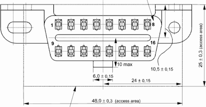
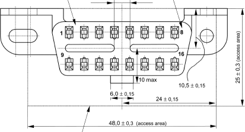

title: Konektor OBD-II dan Pinout
description: Konektor OBD-II yang terpasang pada kendaraan memiliki 16 Pinout yang masing-masing pin memiliki fungsi tersendiri, baik fungsi umum yang terstandarisasi internasional maupun fungsi khusus sesuai keinginan pabrikan kendaraan.
hero: Konektor OBD-II dan Pinout
disqus: henduino

# Konektor OBD-II dan Pinout

Untuk kendaraan yang dijual di pasar Internasional di luar AS, pin konektor OBD II kendaraan dapat membantu menentukan apakah alat scanner akan berfungsi dengan kendaraan Anda. Anda juga dapat memeriksa stiker emisi di bawah kap yang menunjukkan sertifikasi OBD II, EOBD, atau EOBD2. Alat pindai (scanner) keluaran terbaru biasanya berfungsi pada kendaraan EOBD ([European On-Board Diagnostics](EOBD2-OBDII.md)) dan EOBD2.

Harap dicatat, untuk kendaraan Internasional meskipun pinout konektor sesuai dengan salah satu protokol di bawah ini, masih ada sedikit kemungkinan tidak berfungsi dengan benar. Untuk kendaraan yang dijual di AS, pemerintah mengamanatkan kepatuhan OBD II sehingga tidak perlu memeriksa konektor kendaraan, kecuali jika Anda khawatir kendaraan Anda mungkin dilengkapi CAN.

Ada hingga 5 protokol yang umumnya didukung oleh produk scanner terbaru. Setiap protokol menggunakan pin yang berbeda untuk berkomunikasi dengan alat scanner eksternal. Beberapa pin bersifat wajib, dan beberapa opsional, tergantung pada protokol kendaraan. Konektor mungkin berisi pin lain yang tidak penting. Konektor OBD II memiliki 16 lokasi pin yang diberi nomor seperti gambar di bawah ini.

***

## Dimensi Konektor OBD-II

Harus di ingat bahwa konektor OBD pada mulanya adalah **DLC** atau *Diagnostic Link Connector* yang digunakan untuk mendiagnosa kondisi kendaraan, namun karena ada beberapa perusahaan yang membuat bentuk sendiri konektor DLC maka hal ini membuat para teknisi kebingungan dengan berbagai bentuk konektor scanner yang harus disediakan. Dari kejadian ini, para insinyur teknik di SAE membuat standarisasi DLC, baik standarisasi dimensi konektor DLC maupun standarisasi identifikasi gangguan kendaraan, maka lahirlah istilah OBD. Standarisasi dimensi konektor OBD mengacu pada aturan [SAE J1962][6] yang di keluarkan pada bulan Februari tahun 1998 dan selaras dengan aturan [ISO/DIS 15031-3][7] tertanggal 14 Desember 2001. Ada dua jenis *Diagnostic Link Connector* (DLC) yang ditentukan oleh SAE J1962, yaitu Tipe A dan Tipe B, yang ditunjukkan pada gambar di bawah ini. Perbedaan utama antara kedua konektor ini terletak pada bentuk dan posisi tab konektor.

*Gambar 1. Soket Standar OBD-II Tipe A*

*Gambar 2. Soket Standar OBD-II Tipe B*

***

## Pinout Konektor OBD-II

Dibawah ini gambar dan tabel pinout konektor OBD-II.

*Gambar 3. Soket Standar OBD-II*

| PIN | FUNGSI                                                       |
|:---:|--------------------------------------------------------------|
|  1  | Opsi Khusus Vendor                                           |
|  2  | Jalur Positif SAE J1850 PWM dan VPW                          |
|  3  | Opsi Khusus Vendor                                           |
|  4  | Chassis Ground                                               |
|  5  | Signal Ground                                                |
|  6  | CAN Bus High (ISO 15765-4 dan SAE J2284)                     |
|  7  | K-Line (ISO 9141-2 dan ISO 14230-4)                          |
|  8  | Opsi Khusus Vendor                                           |
|  9  | Opsi Khusus Vendor                                           |
|  10 | Jalur Negatif SAE J1850 PWM (tapi bukan untuk SAE J1850 VPW) |
|  11 | Opsi Khusus Vendor                                           |
|  12 | Opsi Khusus Vendor                                           |
|  13 | Opsi Khusus Vendor                                           |
|  14 | CAN Bus Low (ISO 15765-4 dan SAE J2284)                      |
|  15 | L-Line untuk ISO 9141-2 dan ISO 14230-4                      |
|  16 | Jalur Positif Baterai                                        |

***

## Opsi Khusus Vendor

Opsi Khusus Vendor adalah jalur yang disediakan untuk keleluasaan fungsi tergantung masing-masing vendor kendaraan. Jalur inilah yang kemudian melahirkan alat scanner khusus bagi kendaraan tertentu. Ini berarti, pin yang diberi tanda "Opsi Khusus Vendor" akan berbeda fungsi pada kendaraan yang berbeda tipe dan vendor sesuai keinginan perusahaan yang mengeluarkan. Sehingga, alat-alat scanner umum atau universal hanya mampu memindai pada fungsi-fungsi umum yang sudah distandarisasi dan tidak akan mampu melakukan pemindaian kendaraan secara menyeluruh. Walaupun ada alat scanner universal yang mampu melakukan akses pada jalur khusus vendor maka harus ditebus dengan harga yang sangat mahal.

***

## Pin Protokol OBD-II

Dari tabel pinout OBD-II diatas sebenarnya sudah jelas tentang protokol OBD-II yang digunakan pada kendaraan, namun akan lebih mudah jika kita membaginya lagi untuk mempermudahnya.

### ISO 15765 CAN

| PIN | FUNGSI          |
|-----|-----------------|
| 5   | Ground          |
| 6   | CAN Bus High    |
| 14  | Can Bus Low     |
| 16  | Positif Baterai |

### ISO 9141-2 dan ISO 14230 KWP2000

| PIN | FUNGSI          |
|-----|-----------------|
| 5   | Ground          |
| 7   | K-Line          |
| 15  | L-Line          |
| 16  | Positif Baterai |

### SAE J1850 VPW

| PIN | FUNGSI          |
|-----|-----------------|
| 2   | Bus (Data)      |
| 5   | Ground          |
| 16  | Positif Baterai |

### SAE J1850 PWM

| PIN | FUNGSI          |
|-----|-----------------|
| 2   | Bus + (Data +)  |
| 5   | Ground          |
| 10  | Bus - (Data -)  |
| 16  | Positif Baterai |

***

## Daftar Pustaka

* [On-board diagnostics][1]
* [OBD II Connector Pinout][2]
* [ODB-II Connector][3]
* [OBD II diagnostic interface pinout][4]
* [OBD-II J1962 Connector Pinout][5]
* [Diagnostic Connector Equivalent to ISO/DIS 15031-3][6]
* [Diagnostic Connector Equivalent to ISO/DIS 15031-3: December 14, 2001][7]

[1]: https://en.wikipedia.org/wiki/On-board_diagnostics
[2]: http://www.auterraweb.com/obdiipinout.html
[3]: https://components101.com/connectors/obd2
[4]: https://pinoutguide.com/CarElectronics/car_obd2_pinout.shtml
[5]: https://www.dashlogic.com/docs/technical/obdii_connector_pinout
[6]: https://law.resource.org/pub/us/cfr/ibr/005/sae.j1962.2002.pdf
[7]: https://www.sae.org/standards/content/j1962_201207/

***

<small>Artikel diperbarui pada: {{ git_revision_date_localized }}</small>