title: Bersihkan Terminal Baterai
description: Baterai kendaraan terutama tipe lead acid atau asam timbal harus mendapatkan perawatan khusus. Salah satunya pada bagian terminal baterainya, karena hasil reaksi oksidasi asam akan memicu penumpukan korosi pada terminal baterai. Bagaimana cara membersihkan terminal aki kendaraan.
hero: Bersihkan Terminal Baterai
disqus: 

# Bersihkan Terminal Baterai Kendaraan

Sering kali para pengemudi dan pemilik kendaraan mengeluh mesin mobilnya sangat sulit dihidupkan pada pagi hari atau pada saat-saat tertentu. Dan kita terkadang menyangka bahwa kerusakan terjadi pada komponen utamanya, misal; starter, pengapian dan lain sebagainya. Padahal sering yang menjadi masalah utama justru hanya penumpukan korosi pada terminal baterai. Penumpukan korosi pada terminal baterai memang suatu hal yang lumrah pada baterai mobil, hal ini karena baterai sering luput dari perhatian. Artikel kali ini akan membahas langkah-langkah pembersihan korosi pada terminal baterai untuk mengurangi biaya perawatan dan sambil belajar memelihara mobil sendiri. Ada dua cara untuk membersihkan terminal baterai mobil dari korosi yang menempel.

***

## Bersihkan Dengan Baking Soda 

* [x] Pastikan bahwa mesin dalam keadaan mati. Hal ini untuk mencegah terjadinya hubungan singkat.

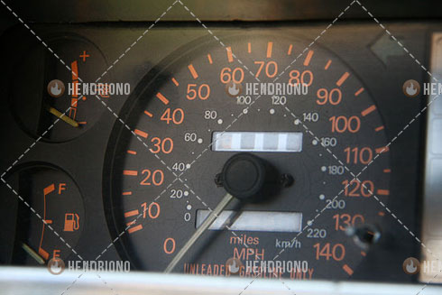

* [x] Menentukan konfigurasi terminal baterai yang anda miliki.

Pada umumnya terminal baterai memiliki 2 posisi mur baut yaitu; mur yang posisinya menghadap keatas (untuk menaruh kabel), biasanya menggunakan kunci 13mm atau 10mm. Dan satu lagi mur baut yang menghadap ke pinggir. Biasanya digunakan untuk pengunci klem pada terminal baterai. Gunakan kunci 8mm untuk melonggarkannya.

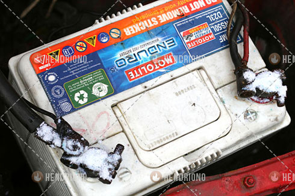

* [x] Longgarkan klem kabel negatif dari terminal baterai.

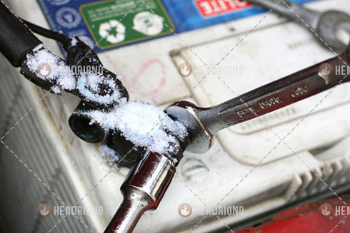

Ulangi langkah ini untuk melonanggarkan klem kabel positif. Jika anda merasa sulit untuk melepas klem dari terminal baterai, coba goyangkan klem atau diputar-putar sambil diangkat secara bersamaan.

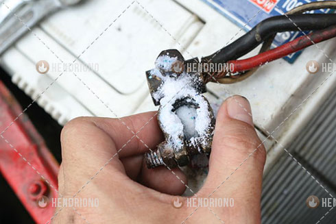

* [x] Setelah klem terlepas, periksalah sekeliling baterai dari kemungkinan retak, sehingga terlihat cairan asam sulfat keluar/rembes. Jika ditemukan keretakan maka persiapkan dana untuk mengganti baterai.

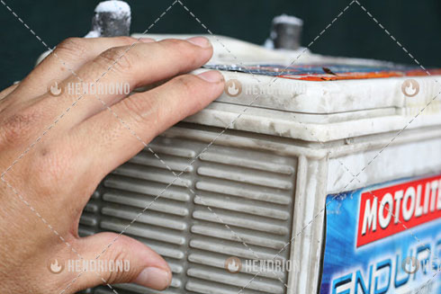

* [x] Periksa kabel baterai dan klem dari kemungkinan robek, rusak atau longgar. Jika kelonggaran klemnya sudah terlalu besar maka kita harus mengganti bagian ini.

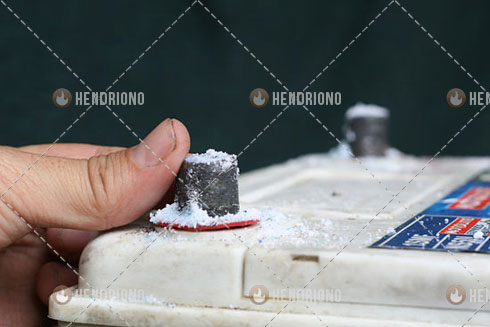

* [x] Campurkan satu sendok makan (15ml) baking soda kedalam 1 gelas air (250ml). Aduk baking soda dengan air hingga benar-benar tercampur. Celupkan sikat gigi bekas atau sejenisnya kedalam larutan baking soda untuk menggosok korosi dari terminal baterai dan klem terminal.

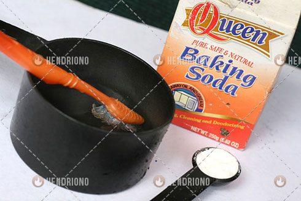

* [x] Gosokan sikat gigi pada permukaan terminal baterai hingga korosi lepas. Celupkanlah berulang-ulang sikat gigi kedalam larutan baking soda jika memang korosi terlalu menumpuk. Gosok juga klem terminal baterai hingga bersih dari korosi.

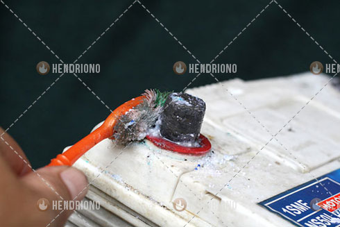

* [x] Bilaslah terminal baterai, baterai, dan kabel baterai, dengan air dingin. Pastikan bahwa tidak ada lagi baking soda yang menempel pada terminal baterai, baterai dan klem baterai. Setelah itu gunakan lap kering untuk membersihkan air dari terminal baterai, baterai dan klem baterai hingga kering.

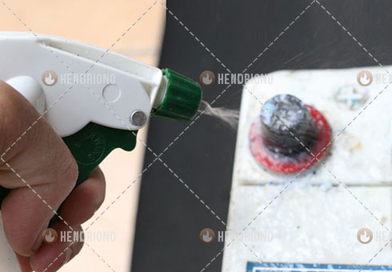

* [x] Atau gunakan alat khusus "*Battery Terminal Brush Cleaner*" untuk membersihkan terminal dan klemp baterai.

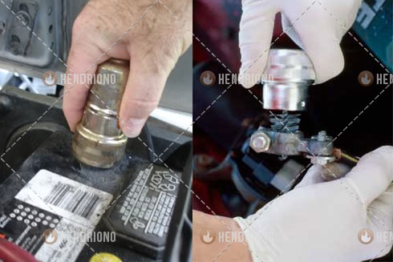

* [x] Lumasi semua permukaan logam terminal dan klem baterai menggunakan petrolium jelly (grease/stempet) atau menggunakan semprotan pelindung terminal baterai yang tersedia dipasaran.

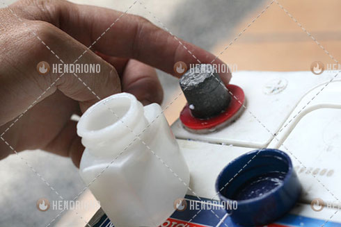

* [x] Pasang kembali klem positif pada terminal baterai dengan tepat. Kencangkan mur dengan kunci yang telah digunakan tadi.

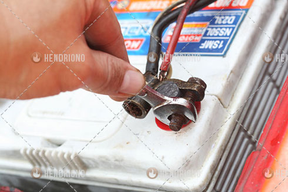

* [x] Lakukan hal yang sama pada klem negatif pada terminal baterai dengan tepat. Uji kekuatan klem mencengkram terminal baterai dengan cara memutar kiri kanan. Pastikan bahwa klem tidak longgar terhadap terminal baterai.

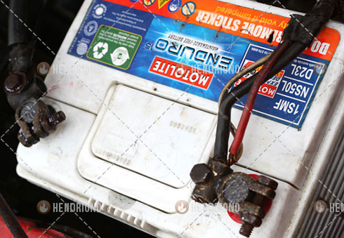

***

## Pembersihan Darurat

* [x] Selalu siapkan sarung tangan dan kunci pas pada kotak alat.

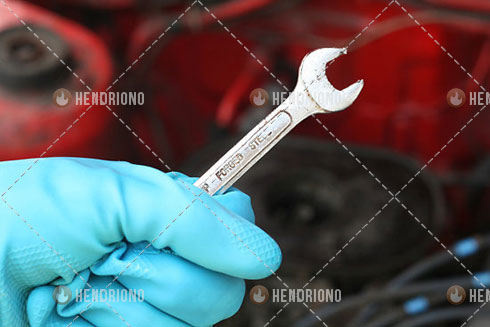

* [x] Kendurkan dan lepas setiap klem terminal baterai.

* [x] Tuangkan minuman cola atau bersoda tanpa gula (mengandung gula/pemanis juga tidak apa-apa, toh sedang darurat) diatas bagian tengah terminal baterai. Ulangi hal yang sama pada terminal baterai yang satu lagi. 

* [x] Biarkan terminal baterai terendam cairan soda selama kurang lebih 2 menit. Lalu bilaslah cairan soda dengan air bersih.

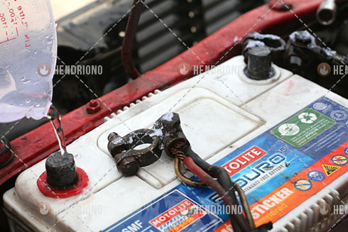

* [x] Kencangkan klem baterai dan cobalah hidupkan mobil.

***

## Video Cara Membersihkan Korosi Terminal Baterai

<iframe width="560" height="315" src="http://www.youtube.com/embed/Sn7BHBGY5xQ" frameborder="0" allowfullscreen></iframe>

<iframe width="560" height="315" src="http://www.youtube.com/embed/oWmblmpo7nI" frameborder="0" allowfullscreen></iframe>

***

## Hal Yang Harus Diperhatikan

* Selalu gunakan baju pelindung.
* Lepaskan semua perhiasan sebelum mulai bekerja. Cincin dan gelang bisa saja jatuh terjebak pada bagian mesin.
* Copotlah kabel negatif lebih dulu pada saat pembongkaran, dan pasanglah kabel negatif terakhir pada saat pemasangan. Hal ini untuk menghindari hubungan pendek.

***

## Perlengkapan Yang Dibutuhkan

* Goggles atau kacamata pengaman
* Sarung tangan lateks atau nitril
* Kunci pas: 5/16-inch (8 mm), 3/8-inch (10 mm) atau 1/2-inch (13 mm)
* Sikat gigi
* Baking soda
* Air
* Cangkir atau ember
* Sikat terminal (opsional)
* Petroleum jelly atau pelindung baterai semprot

***

## Referensi

* [Video How to Clean Corrosion From Car Battery Posts][1]
* [Video How to Clean Car Battery Terminals][2]
* [How to Clean Car Battery Terminals][3]
* [How to Clean Battery Corrosion and Build Up][4]
* [Replaced Brushes & replaced battery terminals][5]
* [How to Clean Corroded Car Battery Terminals][6]

[1]: http://automotivideo.blogspot.com/2012/11/how-to-clean-corrosion-from-car-battery.html
[2]: http://automotivideo.blogspot.com/2012/11/how-to-clean-car-battery-terminals.html
[3]: http://www.howtocleanstuff.net/how-to-clean-car-battery-terminals/
[4]: http://www.wikihow.com/Clean-Battery-Corrosion-and-Build-Up
[5]: http://www.hotrodders.com/forum/replaced-brushes-replaced-battery-terminals-99386.html
[6]: http://www.wikihow.com/Clean-Corroded-Car-Battery-Terminals

***

<small>Artikel diperbarui pada: {{ git_revision_date_localized }}</small>