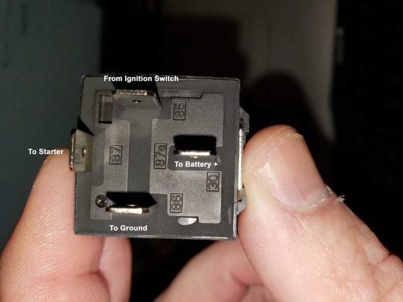

title: Standar DIN 72552
description: DIN 72552 adalah standar DIN untuk terminal kelistrikan mobil, yang menstandarisasi hampir setiap kontak pada mobil dengan kode
hero: Standar DIN 72552
disqus: 

# DIN 72552

***

## Terminal Designation

Terminal Designation atau *Petunjuk Terminal* adalah nomor tambahan atau huruf dalam teknik mesin dan teknik mekanikal serta dalam kelistrikan kendaraan untuk menyederhanakan koneksi kabel, tetapi juga untuk men-diagnosa kesalahan menggunakan diagram sirkuit (*wiring diagram*) pada kendaraan, sistem otomasi, atau *control cabinet*. Kode menunjukan terpasang ke atau dekat dengan terminal dan sering juga menunjukan jalur untuk dihubungkan atau dihubungkan ke kode/terminal tersebut.

***

## Dasar Terminal Designation

Terminal Designation untuk kendaraan bermotor distandarisasi di Jerman dengan nomor standar [DIN 72552](#standar-din-72552). Namun, spesifikasi pabrikan yang berbeda juga diperbolehkan untuk digunakan.

Terminal Designation bukanlah penunjukan kabel pada ke ujung/terminal yang sama, karena komponen dengan terminal designation yang berbeda dapat dihubungkan ke kedua ujung kabel tersebut.

***

## Standar DIN 72552

DIN 72552 adalah standar DIN (*Deutsches Institut für Normung* atau *German Institute for Standardization*) untuk terminal kelistrikan kendaraan, yang menstandarisasi hampir setiap kontak/terminal pada kendaraan dengan kode.

*Gambar 1. Terminal Relay DIN 72552*

***

## Tabel DIN 72552

Tabel dibawah ini menjelaskan tentang kode yang paling sering digunakan.

### Sistem Pengapian

| Terminal | Penggunaan                                                                |
|----------|---------------------------------------------------------------------------|
| 1        | Terminal ignition coil. Kabel menuju breaker point atau kontrol pengapian |
| 1a, 1b   | Distributor pengapian dengan 2 rangkaian terpisah                         |
| 2        | Breaker Point (untuk sistem pengapian magnet)                             |
| 4        | Terminal tegangan tinggi dari ignition coil ke ignition distributor       |
| 4a, 4b   | Distributor pengapian dengan dua rangkaian terpisah, tegangan tinggi      |
| 7        | Terminal pada balast resistor ke distributor pengapian                    |
| 15       | Baterai + dari ignition switch (Kunci Kontak)                             |
| 15a      | Dari balast resistor ke ignition coil atau motor starter                  |
| 15e      | Baterai + dari kunci kontak, juga dari motor starter saat berputar        |
| 15r      | Pengunci pengapian sesuai posisi radio (untuk membangunkan)               |

### Pre-Heat (Mesin Diesel)

| Terminal | Penggunaan                  |
|----------|-----------------------------|
| 15       | Input saklar sistem pemanas |
| 17       | Sistem pemanas - Mulai      |
| 19       | Sistem pemanas - Pre-Heat   |
| 50       | Control motor starter       |

### Baterai

| Terminal | Penggunaan                                                                   |
|----------|------------------------------------------------------------------------------|
| 29       | Positif Baterai , belakang, dengan crash shutdown                            |
| 29a      | Positif Baterai dengan pengaman, belakang, dengan crash shutdown             |
| 30       | Terminal positif langsung dari baterai                                       |
| 30a      | Terminal positif dari baterai ke-dua (saklar baterai untuk perangkat 12/24V) |
| 30b      | Terminal 30, saklar dengan lampu peringatan (hazard warning)                 |
| 30f      | Terminal 30, dimatikan ketika baterai lemah                                  |
| 30g      | Saklar terminal positif langsung dari baterai (tidak sama dengan 15)         |
| 30L      | Terminal positif permanen                                                    |
| 30t      | Terminal 30 untuk mode transport                                             |
| 31       | Terminal negatif langsung dari baterai atau massa bodi                       |
| 31a      | Terminal negatif dari baterai ke-2                                           |
| 31b      | Saklar masa body/terminal negatif (tipe pemutus lama)                        |
| 40       | Terminal positif langsung dari baterai 48 Volt                               |
| 41       | Terminal negatif dari baterai 48 Volt                                        |

### Motor Listrik

| Terminal | Penggunaan                                     |
|----------|------------------------------------------------|
| 32       | Jalur kembali motor listrik                    |
| 33       | Terminal utama (pertukaran 32 dan 33)          |
| 33a      | Saklar limit motor listrik                     |
| 33b      | Motor listrik medan shunt                      |
| 33f      | Motor listrik tingkat kecepatan rendah kedua   |
| 33g      | Motor listrik tingkat kecepatan rendah ketiga  |
| 33h      | Motor listrik tingkat kecepatan rendah keempat |
| 33L      | Arah putaran kiri motor listrik                |
| 33R      | Arah putaran kanan motor listrik               |

### Indikator Arah

| Terminal | Penggunaan                                  |
|----------|---------------------------------------------|
| 49       | Jalur masuk unit flasher                    |
| 49a      | Jalur keluar unit flasher, saklar indikator |
| 49b      | Jalur keluar 2 sirkuit flasher              |
| 49c      | Jalur keluar 3 sirkuit flasher              |
| C        | Lampu indikator flasher ke-1                |
| C2       | Lampu indikator flasher ke-2                |
| C3       | Lampu indikator flasher ke-3                |
| L        | Lampu indikator kiri                        |
| R        | Lampu indikator kanan                       |
| L54      | Jalur Lampu, kiri                           |
| R54      | Jalur Lampu, kanan                          |

### Sistem Starter

| Terminal | Penggunaan         |
|----------|--------------------|
| 45       | Starter relay      |
| 45a      | Keluaran starter 1 |
| 45b      | Keluaran starter 2 |
| 50       | Kontrol starter    |
| 50a      | Kontrol starter    |
| 50b      | Kontrol starter    |
| 50c      | Kontrol starter    |
| 50d      | Kontrol starter    |
| 50e      | Kontrol starter    |
| 50f      | Kontrol starter    |
| 50g      | Kontrol starter    |
| 50h      | Kontrol starter    |

### Generator AC (Alternator)

| Terminal | Penggunaan                                                        |
|----------|-------------------------------------------------------------------|
| 51       | Outut tegangan DC pada penyearah/rectifier                        |
| 51e      | Seperti 51, tetapi dengan lilitan untuk pengemudian di siang hari |
| 59       | Output AC, input penyearah, sakelar lampu                         |
| 59a      | Output lilitan pengisian                                          |
| 59b      | Output lilitan lampu belakang                                     |
| 59c      | Output lilitan lampu rem                                          |
| 63       | Terminal regulator untuk mengatur tegangan regulator              |
| 63a      | Terminal pengontrol untuk mengatur batasan arus                   |
| 64       | Jalur pengendali generator                                        |

### Generator (Voltage Regulator)

| Terminal | Penggunaan                                      |
|----------|-------------------------------------------------|
| 61       | indikator pengisian daya (lampu pengisian daya) |
| B+       | Baterai Positif                                 |
| B-       | Baterai Negatif                                 |
| D+       | Dinamo/Alternator Dioda Positif                 |
| D-       | Dinamo/Alternator Dioda Negatif                 |
| DF       | Lilitan Dinamo                                  |
| DF1      | Lilitan Dinamo 1                                |
| DF3      | Lilitan Dinamo 2                                |
| U-V-W    | 3 Phase terminal AC                             |

### Sistem Penerangan

| Terminal | Penggunaan                                                                          |
|----------|-------------------------------------------------------------------------------------|
| 54       | Lampu rem                                                                           |
| 54f      | Lampu rem melalui (kamuflase) saklar lampu                                          |
| 54g      | Lampu kabut belakang                                                                |
| 54L      | Lampu indikator rem kiri                                                            |
| 54R      | Lampu indikator rem kanan                                                           |
| S54      | Lampu rem kamuflase                                                                 |
| 55       | Lampu kabut (fog)                                                                   |
| 56       | Lampu depan (relay pergantian input)                                                |
| 56a      | Lampu depan jauh dan lampu indikatornya                                             |
| 56b      | Lampu depan dekat                                                                   |
| 56d      | Flasher                                                                             |
| S56      | Lampu kamuflase depan                                                               |
| 57a      | Lampu parkir                                                                        |
| 57L      | Lampu parkir kiri                                                                   |
| 57R      | Lampu parkir kanan                                                                  |
| 58       | Lampu kota, lampu plat nomor, lampu instrumen, lampu belakang                       |
| 58b      | Saklar lampu belakang pada traktor roda dua                                         |
| 58c      | Konektor trailer, lampu belakang inti tunggal dan pengaman trailer                  |
| 58d      | Lampu instrumen yang dapat disesuaikan                                              |
| 58e      | ?                                                                                   |
| 58g      | Lampu dim interior                                                                  |
| 58L      | Lampu parkir belakang kiri,jika dapat dinyalakan secara terpisah                    |
| 58R      | Lampu parkir belakang kanan, jika bisa dinyalakan secara terpisah, lampu plat nomor |
| S58      | Lampu kamuflase belakang                                                            |
| S58b     | Lampu panduan jalan                                                                 |

### Penyapu Kaca Mobil (Wiper Washer)

| Terminal | Penggunaan                                                                    |
|----------|-------------------------------------------------------------------------------|
| 53       | Input positif motor wiper                                                     |
| 53a      | Posisi akhir positif (nyambung ke 53e, terbuka di posisi akhir)               |
| 53b      | Lilitan shunt  (tipe lama, sekarang kontak geser tambahan untuk gerak lambat) |
| 53c      | Pompa pencuci kaca depan (washer)                                             |
| 53e      | Lilitan Penghenti (nyabung ke 53a, terbuka di posisi akhir)                   |
| 53i      | Motor wiper dengan magnet permanen dan brush ke-3 (kecepatan tinggi)          |

### Peringatan Akustik

| Terminal | Penggunaan                                                |
|----------|-----------------------------------------------------------|
| 71       | Klakson                                                   |
| 71a      | Klakson nada rendah dengan nada klakson berikutnya ("ta") |
| 71b      | Klakson nada tinggi dengan nada klakson berikutnya ("tü") |
| 72       | Saklar lampu hazard - suar (berputar/flash)               |
| 76       | Speaker                                                   |
| 85c      | Menyalakan/membunyikan hazard                             |

### Saklar

| Terminal | Penggunaan                        |
|----------|-----------------------------------|
| 81       | Input saklar NC (Normally Closed) |
| 81a      | Output ke-1 (NC)                  |
| 81b      | Output ke-2 (NC)                  |
| 82       | Input saklar NO (Normally Open)   |
| 82a      | Output ke-1 (NO)                  |
| 82b      | Output ke-2 (NO)                  |
| 83       | Input saklar multi-tahap          |
| 83a      | Output ke-1 (saklar multi-tahap)  |
| 83b      | Output ke-2 (saklar multi-tahap)  |

### Relay 

| Terminal | Penggunaan                                            |
|----------|-------------------------------------------------------|
| 84       | Input penggerak dan kontak relay (ujung awal lilitan) |
| 84a      | Ouput penggerak (ujung akhir lilitan)                 |
| 84b      | Ouput kontak relay                                    |
| 85       | Relay -/Ouput lilitan penggerak (ujung akhir lilitan) |
| 86       | Relay +/Input lilitan penggerak (ujung awal lilitan)  |
| 86a      | Input lilitan penggerak ke-1                          |
| 86b      | Input lilitan penggerak ke-2                          |
| 86s      | Input lilitan penggerak sistem alarm                  |

### Kontak Relay

| Terminal | Penggunaan                       |
|----------|----------------------------------|
| 87       | Kontak umum                      |
| 87a      | Kontak normally closed (NC)      |
| 87b      | Kontak normally open (NO)        |
| 88       | Kontak umum ke-2                 |
| 88a      | Kontak normally closed (NC) ke-2 |
| 88b      | Kontak normally open (NO) ke-2   |

### Tambahan

| Terminal | Penggunaan                     |
|----------|--------------------------------|
| 52       | Sinyal dari trailer            |
| 54g      | Katup magnet untuk rem trailer |
| 75       | Radio, pemantik rokok          |
| 77       | Kontrol katup pintu            |

### Pengkodean Tanpa Nomor

| Terminal | Penggunaa                                                        |
|----------|------------------------------------------------------------------|
| B+       | Baterai positif pada generator tiga fase                         |
| B-       | Baterai negatif pada alternator                                  |
| C        | Lampu kontrol untuk indikator arah                               |
| C0       | Jalur utama untuk lampu kontrol terpisah dari unit flasher       |
| C2       | Lampu indikator kedua (untuk indikator arah pada trailer)        |
| C3       | Lampu indikator ketiga (untuk indikator arah pada trailer kedua) |
| D+       | Dynamo Positif                                                   |
| D-       | Dynamo Negatif                                                   |
| DF       | Lilitan dinamo pada regulator generator (regulator tegangan)     |
| W        | Sinyal kecepatan pada alternator                                 |
| L        | Sinyal belok kiri                                                |
| R        | Sinyal belok kanan                                               |

### Petunjuk Spesifik Pabrikan

| Terminal | Penggunaan                                                |
|----------|-----------------------------------------------------------|
| ACC      | Accumulator atau Accessory (terminal 15 sebelum ignition) |
| IG       | Ignition (desain lain untuk terminal 15)                  |
| WW       | Wiper/Washer (sebagai contoh untuk wiper belakang)        |
| INT      | Interval (Wiper belakang)                                 |
| R        | Radio                                                     |
| S        | Accessories (Radio, Lampu peringatan sabuk pengaman, dll) |
| ST       | Starter (Ketika kunci kontak di posisi starter)           |
| X        | Ignition/terminal 15                                      |

***

## Daftar Pustaka

* [DIN 72552][1]
* [Klemmenbezeichnung nach DIN 72552][2]
* [Klemmenbezeichnung][3]
* [klemmenbezeichnungen][4]
* [Deutsches Institut für Normung][5]

[1]: https://en.wikipedia.org/wiki/DIN_72552
[2]: http://www.elektron-bbs.de/verkehr/klemmen.htm
[3]: https://de.wikipedia.org/wiki/Klemmenbezeichnung
[4]: http://www.bosch-classic.com/media/en/bosch_classic/teile_1/switches/downloads_3/klemmenbezeichnungen.pdf
[5]: https://en.wikipedia.org/wiki/Deutsches_Institut_f%C3%BCr_Normung

***

<small>Artikel diperbarui pada: {{ git_revision_date_localized }}</small>