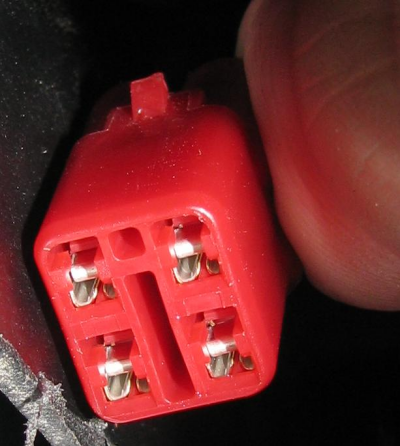
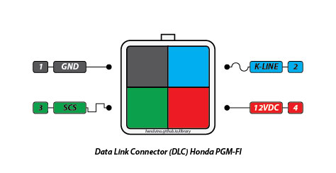
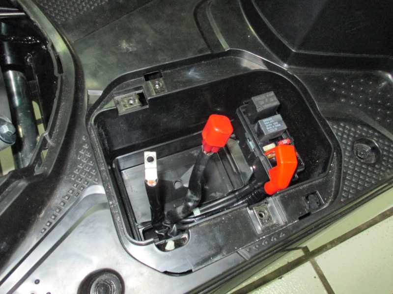

title: DLC Honda PGM-FI
description: Data Link Connector atau DLC adalah jalur koneksi diagnostik untuk kendaraan yang digunakan untuk komunikasi antarmuka alat pemindai (scanner) dengan modul pengendali pada kendaraan tertentu dan akses ke on-board diagnostic serta live data stream.
hero: DLC Honda PGM-FI
disqus:

# Tentang DLC

Data Link Connector (DLC) adalah jalur koneksi diagnostik untuk kendaraan, baik mobil maupun sepeda motor yang digunakan untuk komunikasi antarmuka alat pemindai (scanner) dengan *modul pengendali* (*Control Module*, Honda sering menyebut **ECM**; *Electronic Control Module*) pada kendaraan tertentu dan akses ke on-board diagnostic serta live data stream. DLC sudah tersedia hampir disemua kendaraan yang telah menggunakan sistem pengendali elektronik, baik pengendalian mesin, chasis, pemindah daya maupun pada sistem lain yang ada di kendaraan. Pada sepeda motor terutama Honda pada umumnya DLC digunakan untuk mengakses modul pengendali mesin dan ABS (*Anti-lock Braking System*).
Modul Pengendali sering di sebut Control Module, karena tersusun dari serangkaian komponen elektronik, maka ditambahkan kata "elektronik" didepannya, sehingga menjadi "**Electronic Control Module**" yang kemudian di singkat menjadi ECM. Singkatan ECM terkenal di Indonesia dan seakan bagian dari sepeda motor ber-teknologi injeksi, namun "Control Module" untuk mobil di kenal dengan istilah lain yaitu "**Electronic Control Unit**" yang kemudian di singkat menjadi ECU. Padahal ECM atau pun ECU adalah benda yang sama dengan fungsi yang sama, dengan cara mengakses data yang sama yaitu melalui DLC.
DLC pada mobil sudah menggunakan [standar OBD](OBDII-Pinout.md) (On-Board Diagnostic), baik standar dalam bentuk konektornya maupun standar pada kode diagnosa masalah-nya. *Kode Diagnosa Masalah* pada otomotif sering disingkat DTC yang merupakan kepanjangan *Diagnostic Trouble Code*.
Bagaimana DLC pada sepeda motor? Apakah DLC-nya sudah terstandarisasi? DLC pada sepeda motor tidak ada standarisasi untuk bentuk konektor dan peng-kode-annya, dan setiap pabrikan memiliki bentuknya sendiri dengan susunan pin yang unik. Ini seperti halnya pada mobil, yang belum ada standarisasi hingga tahun 1996. Setelah tahun 1996, banyak pabrikan mempertahankan konektor kepemilikan mereka selain konektor OBD, karena [jalur OBD](EOBD2-OBDII.md) hanya diperlukan untuk mengirimkan kode dan data yang terkait dengan emisi.

***

## Fungsi DLC Honda PGM-FI

Pabrikan sepeda motor Honda sebagai salah satu perusahaan dengan penjualan unit tertinggi di Indonesia, telah menerapkan teknologi injeksi dengan modul pengendali elektronik yang sudah menggunakan DLC sebagai jalur komunikasi-nya. DLC pada Honda PGM-FI digunakan untuk:

1. Mengakses data on-board diagnostic pada Electronic Control Module. Data on-board diagnostic kemudian didefinisikan menggunakan tabel DTC yang akan tampil pada alat pemindai. Selain itu, data on-board diagnostic juga ditampilkan dalam bentuk [kedipan MIL](mil-pgmfi.md) pada dasbor kendaraan.
2. Mengakses live data stream. Live data stream adalah data yang diproses secara terus menerus oleh ECM selama ECM aktif, baik dalam keadaan mesin menyala atau sekedar kunci kontak diaktifkan. Data yang diproses oleh ECM ini berasal dari data sensor, aktuator atau bahkan dari proses yang terjadi pada ECM-nya itu sendiri.
3. Menghapus DTC pada on-board diagnostic ECM. Ini adalah fungsi khusus yang digunakan Honda untuk mempermudah penyelesaian masalah. Dengan metode penghapusan manual (menggunakan SCS Connector) maka mekanik tidak lagi memerlukan alat pemindai hanya untuk melakukan penghapusan DTC.
4. Me-reset sensor tertentu yang digunakan pada sepeda motor, namun sifatnya insidentil (ada kejadian khusus pada waktu tertentu). Sensor-sensor analog yang digunakan oleh ECM akan mengalami perubahan nilai data dalam kurun waktu tertentu karena beberapa pengaruh, baik pengaruh kinerja maupun pengaruh internal pada sistem PGM-FI-nya itu sendiri.
5. Mengubah setingan Altitude (ketinggian dari permukaan air laut) pada tipe kendaraan tertentu.

***

## Pinout DLC Honda PGM-FI

Karena belum ada standarisasi mengenai bentuk konektor DLC, maka Honda pun menggunakan konektor dengan bentuk sendiri. Terdiri dari 4 pin dengan susunan unik dan dengan fungsi tersendiri.

*Gambar 1. Bentuk DLC Honda PGM-FI*

Gambar diatas merupakan bentuk DLC yang digunakan pada sepeda motor Honda PGM-FI. DLC tersebut sudah dibuka penutupnya sehingga tampak 4 soket besi didalamnya. Pada mulanya DLC ini memiliki tutup untuk melindungi dari hubungan singkat baik oleh kesalahan manusia atau air.

*Gambar 2. Pinout DLC Honda PGM-FI*

Gambar diatas menunjukan pinout DLC yang digunakan khusus pada sepeda motor Honda yang sudah menggunakan teknologi PGM-FI. Pinout DLC tersebut terdiri dari:

1. **GND** atau Ground. Ini adalah pin yang terhubung dengan terminal negatif baterai dan bodi sepeda motor.

2. **K-Line**. Ini adalah pin yang digunakan untuk berkomunikasi dengan alat pemindai (scanner sepeda motor). Hampir semua alat pemindai pasti dan wajib menggunakan jalur K-Line untuk dapat mengakses data dari ECM. Tidak ada jalur lain yang digunakan untuk mengakses informasi dari ECM. Pinout K-Line ini pada dasarnya menggunakan protokol komunikasi [ISO 9141-2](OBDII-Pinout.md). Namun sayang, Honda sepertinya tidak menggunakan protokol standar ISO 9141-2, sehingga komunikasi sulit terjadi antara ECM dengan alat pemindai universal. Urutan inisialisasi-nya saja tidak menggunakan protokol standar ISO sehingga perintah *ELM327* saja tidak mengenalinya. (*Apa ya ELM327? kita bahas kapan-kapan...*)

3. **SCS**. SCS adalah singkatan dari *Service Check Short*. Pin SCS ini digunakan untuk beberapa fungsi, diantaranya:

	1. Untuk mengakses data yang tersimpan pada **EEPROM ECM** untuk ditampilkan pada [MIL dasbor](mil-pgmfi.md).
	2. Untuk menghapus data kegagalan fungsi sensor atau aktuator yang tersimpan pada **EEPROM ECM**.
	3. Untuk me-reset sensor tertentu (pada beberapa tipe digunakan untuk mereset sensor *throttle valve*).
	4. Untuk menetapkan *mode altitude* sepeda motor. Altitude ini adalah posisi ketinggian dari permukaan air laut. Sederhananya; sepeda motor tersebut digunakan dimana? digunakan dipegunungan, di desa atau di kota, maka mode altitude-nya harus disesuaikan. Namun fungsi ini hanya terdapat pada beberapa tipe kendaraan yang diproduksi oleh Honda, jadi tidak semua tipe sepeda motor memiliki fungsi ini.

4. **12VDC**. Pin ini berasal dari terminal baterai positif yang melewati kunci kontak. Pin 12VDC ini hanya akan mengeluarkan tegangan positif pada saat kunci kontak diaktifkan.

***

## Lokasi DLC

Honda tidak membakukan lokasi penempatan DLC, hal ini memang cukup membingungkan. Dibawah ini adalah tabel yang disusun sesuai dengan informasi dari beberapa pihak. Informasi dibawah ini bisa saja benar namun bisa saja salah, karena kurang telitinya dalam menyusun informasi. Silahkan direvisi pada kolom komentar jika salah.

*Gambar 3. DLC pada Honda BeAT Pop*

| TIPE                | LOKASI                                     |
|---------------------|--------------------------------------------|
| BeAT Pop            | Dibawah pijakan kaki didalam kotak baterai |
| BeAT Sporty         | Dibawah jok dibalik cover body             |
| Scoopy              | Dibawah jok dibalik cover body             |
| Spacy               | Didalam cover lampu depan                  |
| Vario 125           | Didalam cover lampu depan                  |
| Vario 150           | Dibawah pijakan kaki didalam kotak baterai |
| Supra X 125         | Didalam cover lampu depan                  |
| Supra X 125 Helm In | Dibawah jok didalam kotak baterai          |
| CB150R              | Dibawah jok didalam kotak alat             |
| Verza               | Dibawah jok didalam kotak alat             |
| CBR250              | Dibawah jok belakang                       |
| PCX                 | Dibawah joka didalam kotak baterai         |
| Revo                | Dibawah jok dibalik cover bawah            |
| Sonic               | Dibawah jok didalam kotak baterai          |
| Blade 125           | Dibawah jok dibalik cover bawah            |

***

<small>Artikel diperbarui pada: {{ git_revision_date_localized }}</small>