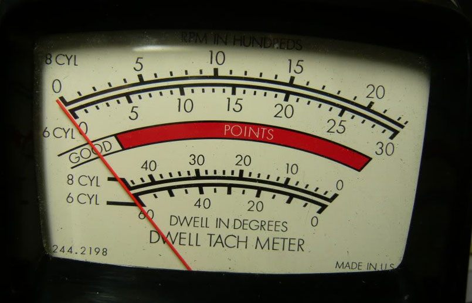
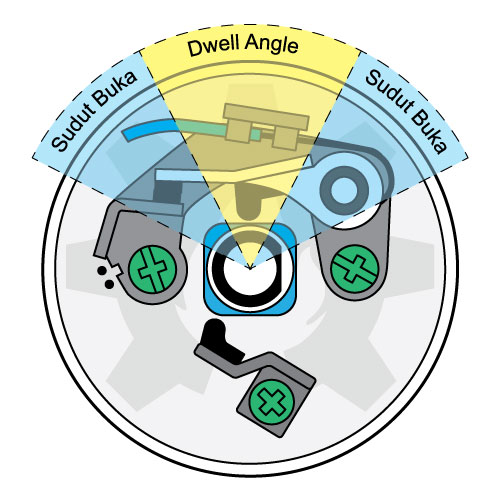
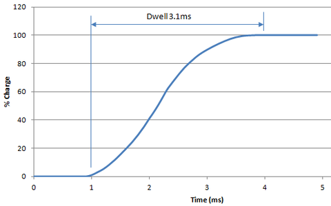
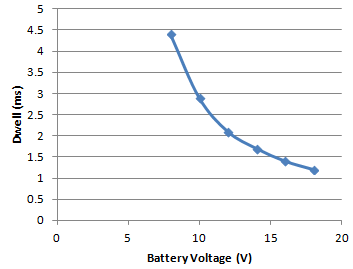
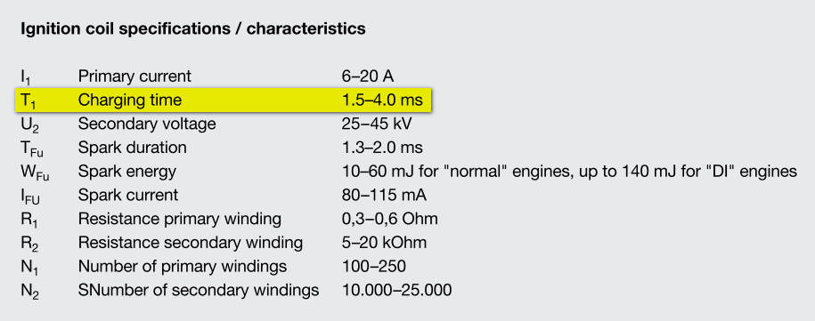
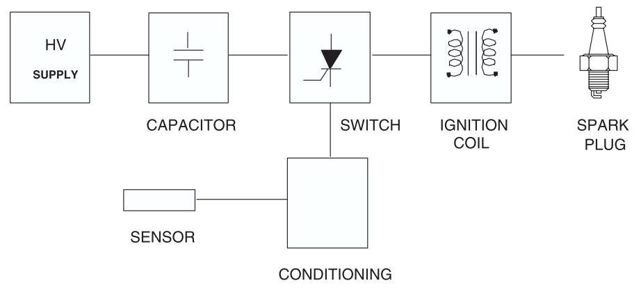

title: Dwell Sistem Pengapian
description: Dwell Angle adalah jumlah derajat poros cam distributor ketika kontak poin tertutup. Dwell Time adalah sejumlah waktu yang diperlukan untuk mengisi tegangan pada kumparan induktif hingga mencapai tingkat energi maksimum.
hero: Dwell Sistem Pengapian
disqus: henduino

# Dwell Sistem Pengapian

*Dwell Angle* (Sudut Dwell) adalah jumlah derajat poros cam distributor ketika kontak poin tertutup. *Dwell Angle* atau Sudut Dwell bernilai tetap pada berbagai tingkat kecepatan putaran mesin. *Dwell Time* (Waktu Dwell) adalah sejumlah waktu yang diperlukan untuk mengisi tegangan pada kumparan induktif hingga mencapai tingkat energi maksimum. Dwell Time atau waktu dwell akan bervariasi sesuai dengan perubahan putaran mesin.

***

## Memahami Dwell pada Sistem Pengapian

Sistem Pengapian atau *Ignition System* merupakan salah satu bagian penting yang secara langsung mempengaruhi kinerja mesin. Percikan bunga api pada busi digunakan untuk membakar campuran udara dan bahan bakar yang telah dikompresikan diruang bakar. Kualitas percikan bunga api yang jelek menyebabkan campuran udara dan bahan bakar tidak mampu terbakar dengan sempurna. Pembakaran tidak sempurna merupakan kasus yang terus diteliti, karena hal ini merupakan masalah serius yang menjadi penyebab utama penurunan performa mesin, konsumsi bahan bakar menjadi boros, dan gas buang sisa pembakaran yang berbahaya. Untuk menghasilkan percikan bunga api yang baik tidak hanya di perlukan komponen pengapian yang berkualitas, namun faktor-faktor yang mempengaruhi kinerja sistem pengapian juga berperan dalam menentukan kualitas percikan bunga api. Dwell merupakan faktor penting yang menunjang pada kualitas percikan bunga api. Akhir-akhir ini, pembahasan tentang Dwell sudah mulai memudar bahkan hampir menghilang dari pembahasan materi sistem pengapian.

*Gambar 1. Dwell Meter*

***

## Dwell Angle pada Sistem Pengapian Konvensional

Dwell Angle pada mulanya dibahas pada sistem pengapian konvensional yang secara spesifik berkaitan erat dengan kontak poin atau platina. Sistem pengapian konvensional adalah sistem pengapian tertua yang menjadi cikal bakal lahirnya sistem pengapian modern. Sistem pengapian konvensional identik dengan distributor dan kontak poin. Pada mesin yang berbasis distributor generasi lama, cam pada distributor digunakan untuk membuka dan menutup sebuah kontak poin. Kontak poin dihubungkan untuk mengalirkan tegangan dari baterai ke dalam kumparan ignition coil (kumparan primer). Ketika kontak poin menutup, kumparan primer diisi tegangan. Ketika kontak poin terbuka, tegangan pada kumparan primer dikosongkan, dan terjadi induksi terhadap kumparan sekunder. Tegangan tinggi yang dihasilkan kumparan sekunder dialirkan ke busi melalui distributor. Dari sinilah lahir penamaan "*Dwell Angle*" atau dalam bahasa Indonesia diterjemahkan menjadi "Sudut Dwell". *Dwell Angle* atau sudut dwell adalah jumlah derajat poros cam distributor ketika kontak poin tertutup. *Dwell angle* sering diartikan sebagai sudut tutup kontak poin (*Breaker Point Closed Angle*), hal ini karena pada mulanya hanya tersedia pada sistem pengapian konvensional.

*Gambar 2. Sudut Dwell pada Cam Distributor*

Sudut Dwell sebenarnya bukan untuk mendefinisikan keadaan kontak poin, tetapi untuk mendefinisikan proses pengisian dan pengosongan tegangan pada kumparan primer. Kontak poin digunakan untuk mengatur proses pengisian dan pengosongan pada kumparan primer. Oleh karena itu, *Dwell Angle* akan bernilai tetap pada berbagai tingkat kecepatan putaran mesin.
Misal; Pada mesin 4 langkah 4 silinder, sudut dwell biasanya telah ditetapkan oleh pabrikan sebesar 52 - 56 derajat. Nilai ini akan tetap pada putaran mesin rendah maupun putaran mesin tinggi.
Sistem pengapian konvensional dengan kontak poin memiliki banyak kelemahan, diantaranya:

* Perawatan kontak poin harus dilakukan secara berkala.
* Kontak poin atau platina akan mengalami keausan karena terjadi kontak fisik pada area kontak poinnya. Sehingga perlu dilakukan penggantian secara rutin.
* Terjadi penurunan kualitas percikan bunga api pada saat terjadi pertambahan putaran mesin. Semakin tinggi putaran mesin, semakin jelek kualitas percikan bunga api.

Kelemahan-kelamahan diatas memicu para pakar otomotif untuk mengembangkan sistem pengapian yang lebih handal dan lebih baik hingga lahirlah sistem pengapian elektronik.

***

## Dwell Time pada Sistem Pengapian Elektronik

*Dwell Angle* pada sistem pengapian konvensional akan bernilai tetap pada berbagai tingkat kecepatan putaran mesin. Sedangkan pada sistem pengapian elektronik tidak akan lagi ditemukan *Dwell Angle*, hal ini karena jenis pengaturan proses pengisian dan pengosongan kumparan induktif sudah tidak menggunakan kontak poin. Pengaturan proses pengisian dan pengosongan kumparan induktif digantikan oleh komponen-komponen elektronika. Penamaan *Dwell Angle* menjadi tidak relevan dengan prinsip kerja sistem pengapian elektronik, sehingga penamaan *Dwell Angle* berubah menjadi "*Dwell Time*".

*Dwell Time* adalah sejumlah waktu yang diperlukan untuk mengisi tegangan pada kumparan induktif hingga mencapai tingkat energi maksimum. Pada mesin dengan pengontrol modern, dwell didefinisikan dalam milisecond (ms) atau milidetik. Kumparan ignition coil pada umumnya memiliki dwell antara 2 milidetik hingga 5 milidetik. Pada sistem pengapian elektronik, pengaturan dwell jauh lebih baik daripada mesin berbasis distributor.
*Dwell Time* atau waktu dwell akan bervariasi sesuai dengan perubahan putaran mesin. Ketika putaran mesin meningkat, dwell mengalami penurunan waktu. Pada saat putaran mesin tinggi sistem pengapian induktif berbasis distributor kontak poin tidak akan memiliki "waktu" dwell yang cukup untuk mengisi penuh ignition coil. Hal ini akan mengakibatkan percikan bunga api menjadi lemah di putaran tinggi dan dapat menyebabkan menurunnya optimalisasi performa mesin. Hal ini menjadi penyebab lahirnya sistem pengapian elektronik yang mampu mengisi ignition coil dengan cepat pada putaran tinggi. 
Sistem pengapian pengosongan induktif (*Inductive Discharge*) modern telah mampu mengatasi penurunan performa mesin karena masalah dwell, yaitu dengan menggunakan ignition coil yang dipasang per silinder atau ignition coil pada masing-masing spark plug (busi).

***

## Pengaruh Dwell Terhadap Kinerja Mesin

Dwell sangat penting untuk kinerja mesin. Ketika melakukan perawatan berkala mesin kebanyakan orang/mekanik akan terfokus pada ignition timing atau waktu pengapian dan tidak memberi perhatian yang cukup pada masalah dwell. Dwell adalah hal yang paling sering diabaikan bahkan terlupakan. Padahal dwell diperlukan untuk mengontrol sejumlah energi yang tersimpan dalam kumparan pengapian. Terlalu cepat dwell (untuk sistem pengapian elektronik) atau terlalu kecil dwell (untuk sistem pengapian konvensional) maka proses pengisian kumparan induktif akan menjadi rendah, hal ini menghasilkan percikan bunga api busi yang lemah. Terlalu lama dwell (untuk sistem pengapian elektronik) atau terlalu besar dwell (untuk sistem pengapian konvensional) maka kumparan induktif akan menjadi lebih panas. Overheating (panas berlebihan) pada kumparan akan menyebabkan pengisian kumparan menjadi lebih mudah jatuh (breakdown), dan tidak akan mampu menyimpan banyak energi, hal ini juga menyebabkan hasil percikan bunga api lemah.

***

## Pengaruh Tegangan Terhadap Dwell Time

*Dwell Time* yang diperlukan tergantung pada tegangan baterai. Jika tegangan baterai meningkat, *Dwell Time* dapat diturunkan. Jika tegangan baterai berkurang, *Dwell Time* perlu ditingkatkan. Banyak ECU memiliki tabel trim (penyesuai) yang akan menyesuaikan dwell berdasarkan tegangan baterai. Jika ECU tidak mampu menyesuaikan dwell berdasarkan perubahan tegangan baterai, maka akan ada dua hal yang bisa terjadi, yaitu:

* Jika tegangan baterai menurun, jumlah energi dalam kumparan akan menurun dan mengakibatkan percikan bunga api lemah
* Jika baterai tegangan meningkat, kumparan akan terlalu panas - Maka hal ini pun tidak akan mencapai kualitas percikan api yang lebih kuat.

*Gambar 3. Grafik Pengisian Kumparan Induktif*

Grafik diatas adalah contoh dari waktu pengisian kumparan induktif. Anda dapat melihat bahwa *Dwell Time* meningkat secara signifikan di bawah 12V. Ketika terisi penuh kumparan induktif akan menghasilkan 0,9 milidetik durasi percikan dengan 25 mJ energi percikan, 26 kV tegangan jatuh dan 62 mA arus puncak.

***

## Dwell dan Ignition Coil

Jangan pernah mencoba-coba ignition coil. Pastikan Anda mengetahui secara persis berapa banyak *Dwell Time* yang diperlukan kumparan induktif (Ignition Coil) untuk mengoptimalkan kinerjanya. Pabrikan biasanya menerbitkan lembar data untuk kumparan induktif yang memberikan informasi tentang dwell v.s. tegangan. Jika tidak ditemukan lembar data, cobalah lakukan pengukuran dwell dengan osiloskop. Hubungkan osiloskop ke sisi primer koil dan ukurlah waktu yang dibutuhkan untuk mengisi kumparan induktif pada tingkat tegangan yang berbeda. Juga diperlukan pengukuran arus, bukan pengukuran tegangan (Perhatian: Berhati-hatilah saat terjadi pengosongan kumparan induktif).

*Gambar 4. Contoh Spesifikasi Ignition Coil*

Pengisian kumparan induktif tidak boleh melampaui 100% dari kapasitas energi. Jika kumparan memiliki *Dwell Time* 2 milidetik pada 12 Volt dan kemudian dinaikan dwell-nya untuk 5 milidetik pada 12 Volt ini hanya akan menyebabkan kumparan induktif terlalu panas. Kumparan overheating lebih rentan terhadap kerusakan internal dan akan menghasilkan percikan lemah.

***

## Capacitive Discharge Ignition dan Dwell

*Dwell Time* digunakan untuk mendefinisikan proses pengisian kumparan induktif. Sedangkan sistem pengapian elektronik tipe CDI (*Capacitive Discharge Ignition*) memiliki prinsip berbeda. Pada sistem *Capacitive Discharge* proses pengisian terjadi pada kapasitor bukan pada kumparan induktif. Pengisian kapasitor menggunakan tegangan tinggi hingga 400 Volt. Sehingga proses pengisian kapasitor akan lebih cepat jika dibandingkan proses pengisian kumparan induktif dengan tegangan 12 Volt. Proses pengisian kapasitor dengan tegangan 400 Volt membutuhkan waktu kurang lebih 500 mikrodetik hingga 1 milidetik, sedangkan proses pengisian kumparan induktif membutuhkan waktu antara 2 milidetik hingga 5 milidetik. 

*Gambar 5. Sirkuit Sistem Pengapian CDI*

Pada umumnya sistem pengapian *Capacitive Discharge* melakukan pra-pengisian (*pre-charge*) kapasitor dan menunggu pemicu dari ECU dalam melakukan pengosongan (*discharge*) kapasitor. Sistem *Capacitive Discharge* biasanya menggunakan output dwell untuk menentukan kapan harus di mulai pengisian kapasitor. Periksa produsen pembuat *Capacitive Discharg*e untuk menentukan bagaimana sistem pengapian dipicu. Satu hal yang harus diperhatikan adalah waktu antara pengisian dengan terjadinya percikan bunga api pada sistem *Capacitive Discharge Multi-Spark*. Karena beberapa sistem pengapian *Capacitive Discharge* menghasilkan *multi-spark* dibawah putaran spesifikasi. Kapasitor membutuhkan waktu pengisian yang cukup antar percikan bunga api yang terjadi, hal ini terkadang menyebabkan waktu pengapian menjadi terlambat.

***

## Mengetahui Kemampuan Ignition Coil

Pada umumnya Ignition Coil membutuhkan waktu pengisian maksimum kumparan induktif antara 2 milidetik hingga 5 milidetik. Dengan waktu tersebut, Ignition Coil mampu menghasilkan 200 hingga 500 kali percikan bunga api dalam setiap detik atau 12.000 hingga 18.000 kali percikan bunga api dalam setiap menit.
Bagaimana kita mengetahui kemampuan Ignition Coil?
**Misal**; Lembar Data Ignition Coil menunjukan waktu dwell 5 milidetik. `1 detik sama dengan 1.000 milidetik` sehingga dalam setiap detik terjadi pengisian kumparan induktif sebanyak `200 kali`. `1.000 milidetik / 5 milidetik` menghasilkan `200 kali`. Setiap menit berarti `200 x 60`, dihasilkan `12.000 kali` pengisian kumparan induktif atau percikan bunga api. Untuk mengetahui kemampuan maksimum Ignition Coil terhadap putaran mesin maka menggunakan rumus:

!!! info "Rumus"
    (Percikan dalam setiap menit x 2) / Jumlah silinder

Jika digunakan pada mesin 4 langkah 4 silinder maka:

!!! info "Rumus"
    (12.000 x 2 ) / 4 = 6.000 RPM

Dari perhitungan diatas, kita dapat mengetahui bahwa Ignition Coil dengan *Dwell Time* 5 milidetik hanya mampu bekerja maksimum hingga 6.000 RPM.

***

## Kesimpulan

Dari pembahasan diatas diketahui bahwa dwell bukanlah faktor yang bisa dikesampingkan, seharusnya justru menjadi faktor yang harus diperhatikan dengan baik agar mesin mampu menghasilkan performa yang optimal. Dwell yang tidak sempurna menghasilkan kualitas percikan bunga api yang jelek, dan pengapian yang jelek akan menurunkan performa mesin karena pembakaran yang tidak sempurna pada ruang bakar, efeknya antara lain:

* konsumsi bahan bakar boros; 
* tenaga mesin menurun;
* gas buang yang berbahaya dan; 
* detonasi yang memicu keausan komponen mesin.

Demikian artikel yang cukup panjang membahas tentang dwell pada sistem pengapian mesin. Bahasan diatas disusun untuk menggugah kembali materi-materi yang hampir terlupakan namun sebenarnya memiliki peranan penting dalam menghasilkan performa mesin yang maksimal. Bahasan diatas mungkin masih sangat terbatas dan belum mencakup secara keseluruhan pertanyaan-pertanyaan yang terkait dengan dwell pada sistem pengapian. Maka dari itu, penulis berencana membahas lebih detail tentang *Dwell Time* pada sistem pengapian elektronik dan *Dwell Angle* pada sistem pengapian konvensional pada artikel terpisah serta bagaimana melakukan pemeliharaan dan perawatan terhadap dwell.

***

## Daftar Pustaka
* [Ignition System, Wikipedia][1]
* [Ignition Coil Dwell Time, AutoSpeed][2]
* [Ignition Theory, ICE Ignition][3]
* [FAQ Dwell, SPDISpark][4]
* All About Ignition Coil, Federal Mogul
* Sistem Kelistrikan dan Bahan Bakar Otomotip, Direktorat Pendidikan Menengah dan Kejuruan 1979
* Capacitive Discharge Ignition, STMicroelectronics

[1]: https://en.wikipedia.org/wiki/Ignition_system
[2]: http://www.autospeed.com/cms/article.html?&A=113140
[3]: http://www.iceignition.com/ignition-theory
[4]: http://spdispark.com/pages/frequently-asked-questions-dwell

***

<small>Artikel ditulis pada: {{ git_revision_date_localized }}</small>