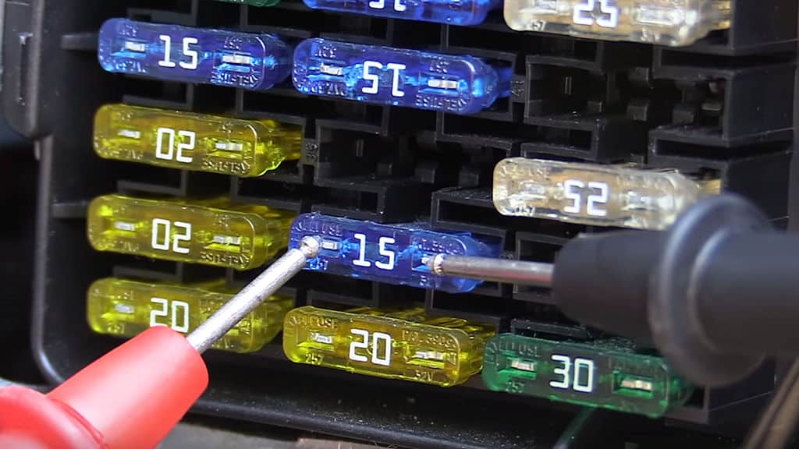

title: Mengenal Sekring
description: Sekring atau Fuse  berfungsi untuk melindungi sirkuit kelistrikan dari arus berlebih yang dapat menyebabkan kerusakan dan mampu memicu kebakaran kelistrikan
hero: Mengenal Sekring
disqus: 

# Mengenal Sekring

***

## Sejarah Sekring

Louis-François-Clement Breguet (22 Desember 1804 - 27 Oktober 1883) adalah seorang fisikawan dan pembuat jam dari Prancis, terkenal karena karyanya pada masa-masa awal telegraf. Breguet merekomendasikan penggunaan konduktor berpenampang lebih kecil untuk melindungi stasiun telegraf dari sambaran petir (dengan cara melelehkan dirinya sendiri), kabel yang lebih kecil akan melindungi peralatan dan kabel di dalam gedung. Berbagai elemen kawat atau foil sekring digunakan untuk melindungi kabel telegraf dan instalasi penerangan sejak tahun 1864. Tahun 1890 Thomas Edison mempatenkan sekring sebagai bagian dari sistem distribusi listriknya.

{: loading=lazy }

Gambar 1. Breguet (kiri) dan Thomas Edison (kanan)

***

## Konstruksi Sekring

Sekring terdiri dari strip logam atau elemen kawat, dengan penampang yang lebih kecil dibandingkan dengan konduktor rangkaian (kabel), dipasang di antara sepasang terminal listrik, dan (biasanya) ditutup oleh rumah yang tidak mudah terbakar. Sekring diatur secara seri untuk membawa semua arus yang melewati sirkuit yang dilindungi. Hambatan elemen menghasilkan panas karena aliran arus. Ukuran dan konstruksi elemen ditentukan (secara empiris) sehingga panas yang dihasilkan untuk arus normal tidak menyebabkan elemen mencapai suhu tinggi. Jika arus yang mengalir terlalu tinggi, suhu elemen naik ke suhu yang lebih tinggi dan langsung meleleh, atau melelehkan sambungan solder di dalam sekring, sehingga sirkuit terbuka (aliran arus terputus).

{: loading=lazy }

Gambar 2. Konstruksi Sekring

Elemen sekring terbuat dari seng, tembaga, perak, aluminium, atau paduan lain untuk memberikan karakteristik yang stabil dan dapat diprediksi. Sekring idealnya akan mengalirkan arus sesuai ratingnya, dan meleleh dengan cepat jika ada sedikit kelebihan arus yang melebihi ratingnya. Elemen tidak boleh rusak oleh lonjakan arus kecil yang tidak berbahaya, dan tidak boleh teroksidasi atau berubah perilakunya setelah digunakan selama bertahun-tahun.

Elemen sekering dapat dibentuk untuk meningkatkan efek pemanasan. Pada sekring besar, arus dapat dibagi menjadi beberapa strip logam. Sekring elemen ganda dapat berisi strip logam yang langsung meleleh pada saat korsleting, dan juga mengandung sambungan solder dengan tingkat leleh rendah yang merespons beban berlebih jangka panjang dengan nilai lebih rendah dibandingkan dengan korsleting. Elemen sekring dapat didukung oleh kawat baja atau nichrome, sehingga tidak ada regangan yang terjadi pada elemen, pegas juga dapat disertakan untuk meningkatkan kecepatan pemutusan fragmen elemen.

Elemen sekering mungkin dikelilingi oleh udara, atau oleh bahan yang dimaksudkan untuk mempercepat pendinginan busur api (saat meleleh). Pasir silika atau cairan non-konduktor dapat juga digunakan.

***

## Penurunan Tegangan (Voltage Drop)

Pabrikan dapat menentukan [penurunan tegangan](parasit-baterai.md) pada sekring sesuai rating arus. Ada hubungan langsung antara tahanan dingin sekring dan nilai tegangan jatuh. Setelah arus ditetapkan, resistansi dan penurunan tegangan sekring akan terus meningkat seiring dengan kenaikan suhu operasinya sampai sekring akhirnya mencapai kesetimbangan termal. Penurunan tegangan harus diperhitungkan, terutama saat menggunakan sekring dalam aplikasi tegangan rendah. Penurunan tegangan sering kali tidak signifikan pada sekering jenis kabel yang lebih tradisional, tetapi dapat menjadi signifikan dalam teknologi lain seperti sekering jenis Resettable Fuse atau PPTC (*Polymeric Positive Temperature Coefficient*).

{: loading=lazy }

*Gambar 3. Memeriksa Penurunan Tegangan pada Sekring*

***

## Fungsi Sekring

Sekring atau Fuse sangat penting dalam sistem kelistrikan apa pun yang berfungsi untuk melindungi sirkuit kelistrikan dari arus berlebih yang dapat menyebabkan kerusakan dan mampu memicu kebakaran kelistrikan.

{: loading=lazy }

Gambar 4. Sekring yang terbakar

Arus berlebih kemungkinan besar disebabkan oleh tiga hal:

1. *Kesalahan pengkabelan* - Koneksi pengkabelan  yang salah akibat kesalahan manusia.
2. *Kerusakan pada sirkuit* - Misal; kabel yang lepas atau insulator yang aus/terkelupas dan menyebabkan kabel positif yang berasal dari bateri terhubung langsung ke ground.
3. *Beban sirkuit yang berlebihan* - Misal; menghubungkan satu atau lebih peralatan yang menguras lebih banyak arus daripada yang dirancang sirkuit untuk digunakan atau, sebaliknya, menggunakan kabel dengan ukuran yang tidak memadai untuk menarik arus dari peralatan yang dimaksud.

***

## Penggunaan Sekring

Dalam dunia kelistrikan yang ideal, setiap bagian kabel positif akan menggunakan sekring karena ini akan memberikan perlindungan lebih dan akan mempermudah penemuan kesalahan kedepannya, karena ini akan memungkinkan kita untuk mempersempit masalah ke satu bagian kabel yaitu di mana sekring pada jalur tersebut terbakar. Penggunaan sekring yang ideal ini memang tampak tidak praktis karena akan menyebabkan penggunaan sekring yang lebih banyak di seluruh sistem kelistrikan. Hal ini memang tidak bisa di kompromi lagi bahwa setiap sirkuit secara individu harus terpasang sekring karena ini memberikan tingkat perlindungan yang lebih baik dan setidaknya memungkinkan untuk mempersempit masalah ke satu sirkuit.

{: loading=lazy }

Gambar 5. Bok sekring pada kendaraan

Penting untuk dicatat bahwa bagian kabel yang berasal dari terminal baterai positif ke sekring pertama (atau kotak distribusi) secara efektif merupakan bagian sirkuit yang tidak terlindungi. Jika ada arus pendek di mana saja sepanjang kabel ini maka sangat mungkin terjadi kebakaran karena sekring pertama tidak akan mengalami arus berlebih. Untuk itu panjang kabel dari baterai positif ke sekring pertama harus dibuat sependek mungkin agar kerusakan dapat diminimalisir jika terjadi kebakaran kelistrikan.

***

## Pengecualian Sekring

Ada beberapa contoh di mana sekring biasanya tidak digunakan dan salah satu contohnya adalah kabel pendek dari baterai ke motor starter. Motor starter merupakan peralatan listrik yang menarik arus tertinggi pada kendaraan karena harus menghidupkan mesin, dan arus yang digunakannya dapat mencapai beberapa ratus Ampere, terutama dengan mesin diesel yang memiliki rasio kompresi tinggi. Untuk alasan ini biasanya dianggap tidak praktis menggunakan sekring pada jalur kabel ini, meskipun beberapa kendaraan memang memiliki fusible link pada satu bagian kecil dari kabel rating arus yang lebih rendah yang dibungkus dengan selongsong tahan api. Mereka dipasang pada kabel yang dilindungi dan dirancang untuk meleleh dan memutuskan sirkuit dalam kondisi arus berlebih. Alasan lain untuk tidak menggunakan sekring pada rangkaian starter adalah jika aki terputus dari alternator saat sedang berputar (seperti yang terjadi jika sekring putus), dioda pada penyearah alternator dapat rusak.

Untuk menawarkan tingkat keselamatan yang lebih tinggi, ini umum digunakan pada banyak mobil balap, mobil kit, mobil kustom, dan kendaraan rekreasi yang dibuat dengan pemutus baterai atau sakelar utama yang dapat dioperasikan secara manual untuk mengisolasi baterai utama atau baterai tambahan dari sistem kelistrikan kendaraan jika terjadi masalah.

***

## Pengaturan sekring

Diagram berikut menunjukkan bagaimana beban listrik seperti lampu dan lain sebagainya disatukan di dalam sirkuit yang beredar dipasaran.

{: loading=lazy }

Gambar 6. Rangkaian Sederhana Penggunaan Sekring

Perhatikan bahwa umpan utama dari baterai menyatu untuk melindungi bagian kabel ini dan kabel ini harus cukup besar untuk memasok arus yang dibutuhkan oleh semua beban yang beroperasi pada waktu yang sama (kasus terburuk). Akibatnya sekring yang digunakan untuk kabel ini (sekring 1) akan memiliki nilai yang lebih tinggi daripada sekering 2-5 (lihat di bawah untuk memilih [nilai sekering](#memilih-nilai-sekring-yang-benar)).

Masing-masing dari empat sirkuit yang memasok beban kemudian digabungkan secara individual di kotak sekering di awal setiap sirkuit (dan sebelum sakelar). Hal ini penting karena jika suatu bagian kabel korslet ke ground maka hanya akan terlindungi jika sebelum titik korsleting ada sekring (jika tidak, sekring tidak akan mengalami arus berlebih karena akan berada di luar korsleting).

***

## Rating Sekring

### Continuous Rating

Sekring ditandai dengan arus yang akan dilewati secara terus menerus (pada suhu tertentu) tanpa terbakar, yang dikenal dengan sebutan rating kontinyu (*Continuous Rating*). Merupakan praktik yang baik untuk tidak membiarkan arus kontinyu melebihi 75% dari nilai rating sekring untuk mengakomodasi lonjakan arus sesaat yang dapat menyebabkan sekring kelelahan seiring waktu atau terbakar tanpa masalah (*nuisance blow*).

### Berapa arus yang dibutuhkan sekring untuk terbakar?

Dalam istilah yang disederhanakan, semakin besar arus di atas rating kontinyu, semakin cepat sekring akan putus. Misalnya, jika sekering 10A terkena 11A maka mungkin perlu beberapa menit untuk terbakar tetapi jika terkena 20A maka sekring mungkin terbakar dalam sepersekian detik. Pabrikan menunjukkan waktu terbakar ini pada *Grafik Waktu* tetapi untuk pengguna biasa tidak perlu masuk ke tingkat detail teknis ini selama mengikuti beberapa pedoman pemilihan sekering dasar seperti yang dijelaskan di bagian berikutnya.

***

## Memilih nilai sekring yang benar

Jika mengganti sekring yang putus pada aplikasi yang dirancang oleh pabrik, misalnya pada panel sekring kendaraan, maka jenis dan peringkat sekring yang sama harus digunakan. Jika sekring terus putus maka pasti ada masalah dengan sirkuitnya dan sekring dengan rating yang lebih tinggi tidak boleh dipasang untuk mengatasi hal ini, bahkan walaupun untuk sementara. Tindakan ini menyebabkan risiko tinggi, mungkin saja terjadi kegagalan kinerja komponen dan bahkan kebakaran sirkuit kelistrikan.

Saat menentukan sekring untuk suatu aplikasi, pertimbangan utamanya adalah bahwa sekring harus berada pada titik terlemah sehingga selalu putus sebelum terjadi kerusakan pada bagian lain dari rangkaian kelistrikan. Namun, Anda juga tidak ingin sekring terus terbakar dalam pengoperasian normal (*nuisance blow*), jadi dua elemen yang perlu dipertimbangkan adalah:

* Rating arus dari kabel terkecil di dalam sirkuit
* Penggunaan arus pada sirkuit dalam kondisi operasi normal

Nilai sekring harus berada di antara dua nilai ini untuk memungkinkan operasi normal tetapi terbakar saat kelebihan beban. Misalnya, jika penggunaan arus normal yang diharapkan adalah 10A dan ukuran kabel adalah 25A, maka sekering dengan nilai 15A akan sesuai.

************************************************

## Jenis Sekring

Ada beberapa jenis sekring yang saat ini digunakan di pasar otomotif, dibawah ini menggambarkan masing-masing jenisnya. Istilah dibawah tetap menggunakan istilah "Fuse" tanpa diterjemahkan menjadi sekring, untuk mempermudah pemahaman:

### Glass Cartridge Fuse

| Method      | Description                          |
| ----------- | ------------------------------------ |
| `GET`       | :material-check:     Fetch resource  |
| `PUT`       | :material-check-all: Update resource |
| `DELETE`    | :material-close:     Delete resource |

#### 20mm

#### 30mm

#### 32mm

***

### Blade Fuse

Blade Fuse sekarang menjadi kategori sekering yang paling umum digunakan hampir di setiap kendaraan baru dengan menggunaakan satu atau lebih tipe yang berbeda. Mereka terpasang sangat presisi (*push-fit*) di dalam dudukan sekring atau kotak sekring dan tahan terhadap gesekan.

#### Micro Blade Fuse

Sekering blade standar (juga dikenal sebagai sekering APR, ATC, atau ATO) adalah yang paling umum pada banyak mobil yang sekarang menggunakan versi blade mini (juga dikenal sebagai sekering APM atau ATM). Peningkatan popularitas adalah versi pisau mikro (juga dikenal sebagai sekering APS atau ATT) dengan penggunaan yang lebih luas diharapkan di masa depan karena produsen berusaha untuk memasukkan lebih banyak sistem kelistrikan ke dalam ruang yang sama

#### Mini Blade Fuse

#### Standard Blade Fuse

#### Maxi Blade Fuse

***

### Link Fuse

#### Strip Link Fuse

#### Midi Link Fuse

#### Mega Link Fuse

***

## Pemutus sirkuit

### Apa itu circuit breaker?

Pemutus sirkuit memberikan perlindungan beban berlebih untuk sirkuit dengan cara yang sama seperti sekring (dengan memutus kontinuitas sirkuit) tetapi, tidak seperti sekring, dapat diatur ulang daripada harus diganti. Ini berguna dalam aplikasi di mana, karena sifatnya, kondisi arus berlebih diperkirakan akan terjadi sesekali dalam penggunaan normal dan harus sering mengganti sekering akan merepotkan (misalnya motor listrik yang digunakan untuk derek, jendela daya, dll.) . Mereka juga berguna di mana Anda mungkin perlu mengatur ulang sirkuit dengan cepat dan tidak ingin menghabiskan waktu mencari sekring.

{: loading=lazy }

Gambar Circuit Breaker

### Bagaimana mereka bekerja?

Sebagian besar pemutus sirkuit yang ditemukan dalam sistem 12V atau 24V beroperasi secara termal. Panas yang dihasilkan oleh arus berlebih selama kelebihan beban menyebabkan kontak di dalam pemutus terlepas dan memutus rangkaian. Ini kemudian diatur ulang baik secara manual atau otomatis tergantung pada desain pemutus sirkuit. Pemutus sirkuit yang harus disetel ulang secara manual memberikan kesempatan untuk memeriksa masalah apa pun sebelum menggunakan sirkuit lagi dan pada beberapa tipe Anda dapat menghentikan pemutus secara manual, yang berguna untuk mengisolasi sirkuit dan untuk menguji pemutus.

### Sekering vs pemutus sirkuit

Sementara pemutus sirkuit adalah solusi yang sangat berguna dalam aplikasi tertentu, perlu dicatat bahwa sekring berkualitas baik pada akhirnya akan lebih andal (tidak ada bagian yang bergerak) jadi harus dipertimbangkan terlebih dahulu, dan di mana peralatan elektronik sensitif terlibat, pemutus sirkuit tidak boleh digunakan. bekas. Ini karena waktu yang dibutuhkan untuk pemutus sirkuit untuk beroperasi bisa lebih lama daripada yang dibutuhkan sekering tradisional untuk putus, berpotensi mengekspos sirkuit untuk merusak arus beban berlebih lebih lama.

***

## Daftar Pustaka

* [Fuse][1]
* [Fusing Guide][2]
* [The fuse-selection checklist: a quick update][3]
* [Miniature Circuit Breaker][4]
* [Circuit breaker][5]

[1]: https://en.wikipedia.org/wiki/Fuse_(electrical)
[2]: https://www.12voltplanet.co.uk/fuses-guide-uses.html
[3]: https://www.edn.com/edn-access-09-26-96-the-fuse-selection-checklist-a-quick-updat-5/
[4]: http://wiki.diyfaq.org.uk/index.php?title=MCB
[5]: https://en.wikipedia.org/wiki/Circuit_breaker
