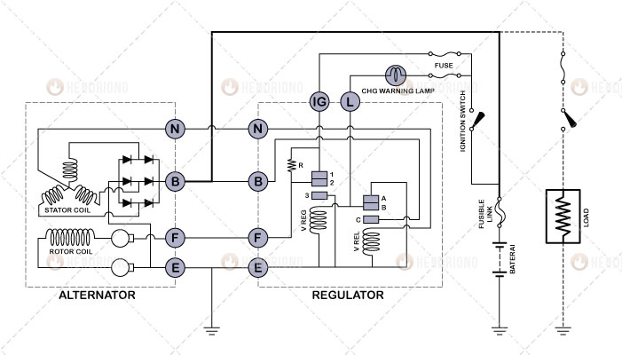
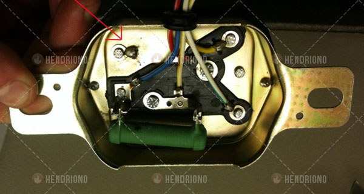
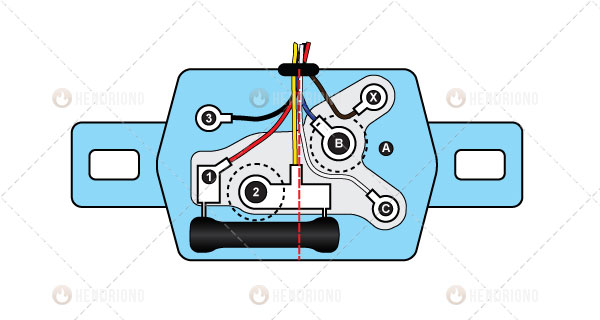
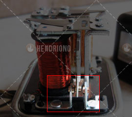

title: Identifikasi Regulator Mekanik
description: Cara mudah mengidentifikasi terminal Regulator mekanik pada sistem pengisian kendaraan ringan maupun kendaraan berat adalah dengan melihat bagian belakang terminal kabel. Bagaimana caranya?
hero: Identifikasi Regulator Mekanik
disqus: henduino

# Identifikasi Terminal Regulator Mekanik

Suatu hari dibalik telephone selular "*Mas, kabel-kabel terminal regulator mobilku dimakan tikus, hampir terputus semua. Sebagian kabel terlepas dari titik kontak solderannya. Bagaimana ini menyambungkannya? Pusing kalau urusan terminal regulator mekanik*". Terminal Regulator Mekanik itu hanya ada 6 kabel untuk regulator mekanik tipe umum (general), namun menentukan kabel-kabel terminal tersebut ternyata cukup membingungkan. Bagi anda yang masih kebingungan untuk menentukan terminal regulator mekanik, artikel ini mudah-mudahan dapat membantu. Karena ternyata menentukan terminal regulator mekanik itu mudah dan cepat jika kita tahu patokannya. Mari kita lanjutkan membacanya...

***

## Mengidentifikasi Terminal Regulator Mekanik

Untuk memudahkan dalam menentukan terminal regulator mekanik sebaiknya ikuti langkah-langkah dibawah ini, namun akan lebih mudah lagi jika artikel sebelumnya yang membahas tentang [Prinsip Kerja Regulator Mekanik](prinsip-regulator-mekanik.md) dipahami, minimal memahami gambar terutama aliran tegangannya.
Gambar dibawah ini merupakan acuan yang harus saling terkait satu sama lain untuk memudahkan dalam menentukan terminal regulator mekanik. Gambar telah disesuaikan antara gambar diagram aliran tegangan, gambar regulator mekanik aslinya, dan gambar regulator mekanik yang diperjelas.

*Gambar 1. Diagram Aliran Tegangan*

*Gambar 2. Bagian Bawah Regulator Mekanik*

*Gambar 3. Bagian Bawah Regulator Diperjelas*

Peganglah regulator, lihat bagian bawahnya dan ikuti langkah dibawah ini:

## 1. Membagi Dua Bagian Regulator

Regulator secara garis besar dibagi menjadi dua bagian utama yaitu; Voltage Relay dan Voltage Regulator. Perhatikan Gambar 2 dan Gambar 3, disana terlihat bahwa yang memiliki resistor hanyalah voltage regulator (lihat Gambar 1). Ambil garis tengah ilusi secara vertikal untuk memisahkan antara voltage regulator dengan voltage relay. Pada Gambar 3 terlihat garis vertikal terputus-putus berwarna merah sebagai garis ilusi untuk memisahkan bagian utama regulator mekanik.

***

## 2. Menentukan Titik Kontak

Setelah regulator mekanik dibagi menjadi dua bagian utama selanjutnya adalah menentukan titik kontak. Perhatikan gambar dibawah ini:

*Gambar 4. Titik Kontak Regulator Mekanik*

Setiap bagian utama regulator (voltage relay dan voltage regulator) memiliki 3 titik kontak (lihat gambar 1). 3 titik kontak pada voltage relay yaitu titik kontak A, titik kontak B dan titik kontak C. 3 titik kontak pada voltage regulator yaitu titik kontak 1, titik kontak 2 dan titik kontak 3. Ketiga titik kontak baik yang terdapat pada voltage relay maupun pada voltage regulator saling berhadapan dan salah satu dari masing-masing bagian utama, titik kontaknya dihubungkan ke massa bodi. Namun ada titik kontak yang memiliki ukuran lebih besar dari yang lainnya. Pada gambar 3 terlihat bahwa ada 2 titik kontak yang memiliki ukuran lebih besar dari yang lainnya yaitu titik kontak 2 dan titik kontak B, satu titik kontak terdapat pada voltage relay dan satu titik kontak terdapat pada voltage regulator. Sedangkan 5 titik kontak lainnya memiliki ukuran yang lebih kecil (titik kontak 1, 3, A, C, dan X).

***

## 3. Terminal Voltage Regulator

Lihat Gambar 3 dan perhatikan baik-baik titik kontak pada bagian voltage regulator (abaikan dulu voltage relay). Pada bagian voltage regulator hanya ada 3 titik kontak yaitu titik kontak 1, titik kontak 2 dan titik kontak 3.
Titik kontak 2 memiliki ukuran lebih besar dari titik kontak 1 dan 3, hal ini karena titik kontak 2 merupakan inti besi dari lilitan voltage regulator. Titik kontak 2 adalah bagian tengah dari 3 titik kontak yang saling berhadapan (lihat Gambar 1 dan Gambar 4) dan merupakan titik kontak yang bergerak pada saat regulator bekerja, terkadang berhubungan dengan titik kontak 1 dan atau berhubungan dengan titik kontak 3. Pada Gambar 1 terlihat bahwa titik kontak 2 (bagian tengah) merupakan terminal F, maka dapat dipastikan bahwa titik kontak yang paling besar (titik kontak 2) pada voltage regulator adalah terminal F (pada Gambar 3 kabel berwarna kuning).
Titik kontak 2 merupakan salah satu ujung resistor, sedangkan ujung resistor yang satu lagi merupakan titik kontak 1. Perhatikan Gambar 1 bahwa ujung resistor yang satu lagi menuju terminal IG, maka dapat dipastikan bahwa titik kontak 1 yang merupakan ujung resistor adalah terminal IG.

Ujung-ujung resistor berhubungan dengan titik kontak 1 dan titik kontak 2, sehingga mudah untuk diingat bahwa ujung resistor yang berhubungan titik kontak 2 (yang memiliki titik kontak lebih besar) merupakan terminal F sedangkan ujung resistor yang berhubungan dengan titik kontak 1 merupakan terminal IG.
Satu titik kontak tersisa pada voltage regulator dan saya yakin anda sudah bisa menebak titik kontak ini. Ya... Titik kontak 3 dihubungkan ke massa bodi maka dapat dipastikan bahwa titik kontak ini adalah terminal E.
Pastikan langkah ini dipahami, sehingga kita bisa dengan mudah menentukan 3 terminal pada 3 titik kontak di voltage regulator. Jika yakin sudah paham, lanjutkan langkah berikutnya...

***

## 4. Terminal Voltage Relay

Pada bagian voltage relay terdapat 4 titik kontak yaitu; titik kontak A, titik kontak B, titik kontak C dan titik kontak X.

Titik kontak B memiliki ukuran yang lebih besar dari titik kontak lainnya, hal ini karena titik kontak B merupakan inti besi dari lilitan voltage relay. Titik kontak B merupakan titik kontak bagian tengah dari 3 titik kontak yang saling berdekatan pada voltage relay. Titik kontak B merupakan bagian yang bergerak pada voltage relay. Pada Gambar 1 terlihat bahwa titik kontak B menuju ke terminal L, maka dapat dipastikan bahwa titik kontak B atau titik kontak yang paling besar pada voltage relay adalah terminal L.

Titik kontak C sejajar dengan titik kontak A jika ditarik garis lurus. Namun harus diingat bahwa disetiap 3 titik kontak yang saling berdekatan selalu ada satu titik kontak yang dihubungkan ke massa bodi. Pada gambar 3 terlihat bahwa titik kontak A dihubungkan ke massa bodi maka titik kontak A adalah terminal E, tetapi karena terminal E sudah diambil dari salah satu titik kontak voltage regulator, maka titik kontak A tidak perlu lagi dikeluarkan sebagai terminal E. Lalu titik kontak C sebagai terminal apa? Jika melihat Gambar 1 maka kita dapat menemukan jawabannya. Jika titik kontak B adalah terminal L, titik kontak A adalah massa bodi maka titik kontak C dapat dipastikan sebagai terminal B.

Tersisa satu titik kontak lagi yaitu titik kontak X. Titik kontak X merupakan bagian yang agak jauh dari 3 titik kontak yang saling berdekatan pada voltage relay. Bisakah anda menebak titik kontak X sebagai terminal apa? Ya betul... Titik kontak X adalah terminal N (Netral). Perhatikan Gambar 1 bahwa masih ada satu lagi terminal pada regulator yang belum dibahas, maka dapat dipastikan bahwa titik kontak X adalah terminal N.

***

## Kesimpulan

4 langkah diatas merupakan cara terbaik, termudah dan tercepat untuk menentukan terminal pada regulator mekanik bagi penulis secara pribadi. Langkah-langkah diatas merupakan pengalaman pribadi penulis yang sering digunakan dilapangan saat berhubungan dengan terminal regulator mekanik. Hal ini karena sering ditemukan regulator mekanik pada kendaraan yang dibuang soketnya. Namun bukan berarti cara diatas adalah hal baku yang wajib diikuti, cara diatas jelas tidak sesuai dengan SOP (standar operasional prosedur). Cara diatas hanya untuk memudahkan saat bekerja saja. Jika anda telah memiliki cara sendiri yang lebih cepat maka tidak usah mengikuti cara-cara diatas.
Semoga artikel diatas bermanfaat dan dapat mempercepat pekerjaan anda. Selamat bekerja dan ingat! Selalu gunakan alat keselamatan kerja pada saat bekerja...

Salam hangat dari Ciamis, Jawa Barat, Indonesia...

***
