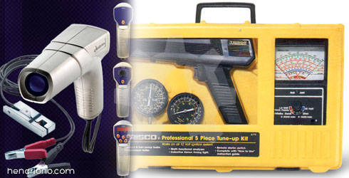
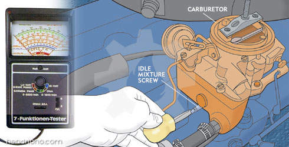
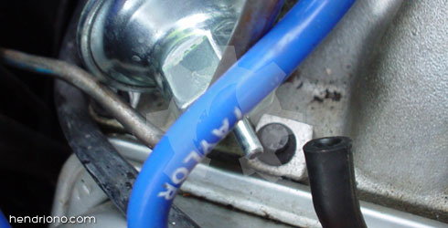
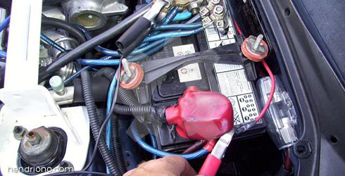
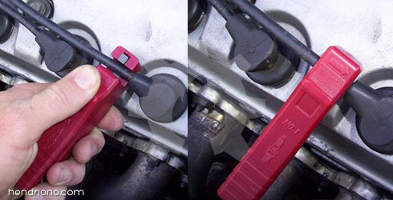
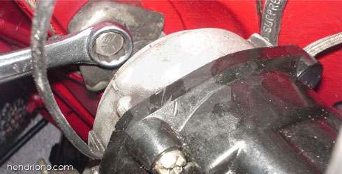
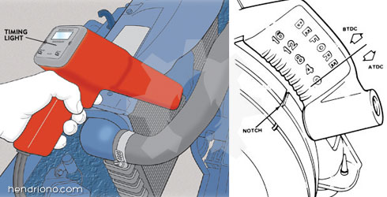
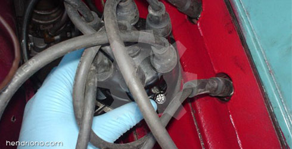

title: Menyetel Waktu Pengapian
description: Waktu pengapian pada mesin pembakaran dalam Internal Combustion Engine adalah proses pengaturan sudut relatif posisi piston dan sudut kecepatan angular velocity poros engkol untuk memicu pembakaran yang terjadi didalam ruang bakar sebelum akhir langkah kompresi.
hero: Menyetel Waktu Pengapian
disqus: 

# Menyetel Waktu Pengapian Mesin

## Peranan Waktu Pengapian

Waktu pengapian pada mesin pembakaran dalam (*Internal Combustion Engine*) adalah proses pengaturan sudut relatif posisi piston dan sudut kecepatan (*angular velocity*) poros engkol untuk memicu pembakaran yang terjadi didalam ruang bakar sebelum akhir langkah kompresi. Waktu pengapian dibutuhkan karena campuran udara dan bahan bakar yang dimampatkan (dikompresikan) tidak sekaligus terbakar secara keseluruhan oleh percikan bunga api dari busi, gas-gas pembakaran membutuhkan periode waktu tertentu untuk mampu terbakar sempurna didalam ruang bakar, dan kecepatan rotasi mesin berpengaruh langsung dalam memperpendek atau memperpanjang waktu yang dibutuhkan untuk menyelesaikan proses pembakaran dan ekspansi (langkah kerja) yang terjadi. 

Selanjutnya sudut waktu pengapian yang ditempatkan lebih maju sebelum titik mati atas disebut sebagai **STMA** (Sebelum Titik Mati Atas) atau sering disebut pula **BTDC** (*Before Top Dead Center*). Memajukan waktu pengapian pada posisi STMA berarti percikan diberikan sebelum titik dimana ruang pembakaran mencapai ukuran minimum, karena tujuan langkah kerja pada mesin pembakaran dalam adalah memaksa torak turun ke bawah atau untuk memperluas ruang pembakaran. Percikan api yang terjadi setelah titik mati atas atau **ATDC** (*After Top Dead Center*) biasanya kontra-produktif (menghasilkan percikan terbuang, ledakan ulang atau detonasi, ketukan mesin dan lain-lain) kecuali percikan tersebut dibutuhkan sebagai percikan tambahan atau sebagai pembakaran lanjutan sebelum langkah buang.

Pengaturan waktu pengapian yang tepat merupakan hal penting agar kinerja mesin bisa maksimal. Percikan yang terlalu cepat atau terlalu lambat dalam siklus mesin sangat mempengaruhi performa mesin, menimbulkan getaran yang berlebihan, dan bahkan merusak mesin. Waktu pengapian juga mempengaruhi umur mesin, konsumsi bahan bakar, dan tenaga mesin. Waktu pengapian pada mesin modern dikontrol secara terus menerus (*realtime*) menggunakan unit kontrol mesin dengan komputer sesuai dengan putaran mesin dan beban. Sedangkan pada mesin generasi lama yang masih menggunakan distributor masih menggunakan pemicu mekanik (*centrifugal advacer*) dengan memanfaatkan gaya inersia (dengan menggunakan bobot putar dan pegas) dan kevakuman pada manifold untuk mengatur waktu pengapian yang disesuaikan dengan putaran mesin dan beban (*vacuum advancer*).

Banyak faktor yang mempengaruhi waktu pengapian yang tepat. Diantaranya waktu buka tutup katup atau injeksi bahan bakar, tipe sistem pengapian yang digunakan, jenis dan kondisi busi, kualitas bahan bakar, suhu dan tekanan bahan bakar, kecepatan mesin dan beban, udara dan temperatur mesin, turbo boost pressure atau tekanan asupan udara, komponen yang digunakan oleh sistem pengapian, dan pengaturan masin-masing komponen sistem pengapian. Biasanya, setiap dilakukan perubahan dan peningkatan kualitas mesin maka diperlukan perubahan pengarutan waktu pengapian.

Waktu percikan pengapian untuk membakar campuran udara dan bahan bakar pada mesin generasi lama dikendalikan oleh perangkat mekanik yang terkumpul pada komponen sistem pembagi pengapian yang dikenal dengan nama distributor, digunakan untuk memicu percikan bunga api dan mendistribusikannya kepada setiap silinder yang disesuaikan dengan posisi piston atau derajat relatif poros engkol terhadap Titik Mati Atas (TMA).

Waktu pengapian, relatif terhadap posisi piston yang didasarkan pada waktu asal (awal atau dasar) sebelum sentrifugal maju. *Centrifugal Advancer* yang terdapat pada distributor adalah mekanisme mekanik untuk memajukan waktu percikan (yang menyesuaikan derajat poros engkol) sesuai dengan peningkatan putaran mesin. Selain sentrifugal sebagai cara untuk memajukan waktu pengapian, ada juga sistem lain yang memanfaatkan kevakuman intake manifold untuk memajukan waktu pengapian yang kemudian di kenal dengan Vacuum Advancer. 

***

## Penyetelan Waktu Pengapian

Seperti telah dijelaskan diatas, bahwa waktu pengapian sangatlah penting yang berpengaruh langsung terhadap kinerja mesin, konsumsi bahan bakar dan emisi gas buang. Di bawah ini akan dijelaskan cara melakukan penyetelan waktu pengapian untuk sistem pengapian konvensional.

### Langkah 1 : Siapkan Timing Light

Siapkan Timing Light yang biasanya tersedia satu paket dalam Tune-Up Kit seperti gambar dibawah ini.

*Gambar 1. Tune-Up Kit*

### Langkah 2 : Panaskan Mesin

Hidupkan mesin sampai mencapai temperatur normal, jika sudah mencapai suhu normal, kemudian stel putaran mesin sampai mencapai putaran normal idle atau stationer (langsam). Gunakan Tachometer untuk mengetahui putaran mesin saat dilakukan penyetelan pada karburator. Putaran mesin normal idle adalah berkisar 800 - 1200 RPM (*Revolution Per Minutes*). Hal ini dimaksudkan agar sistem pengajuan pengapian yang sesuai dengan putaran mesin (centrifugal advance) belum bekerja, jika putaran idle lebih dari 1200 RPM maka sistem pengajuan pengapian sudah bekerja untuk memajukan waktu pengapian. Kemudian matikan mesin.

*Gambar 2. Penyetal Putaran Mesin Pada Karburator*

### Langkah 3 : Lepas Selang Vacuum Advancer 

Lepas selang vacuum dari vacuum advancer (sistem pengajuan pengapian sesuai dengan kevacuuman) pada distributor yang menuju ke karburator. Hal ini agar waktu pengapian tidak dipengaruhi oleh vacuum advancer.

*Gambar 3. Lepas Selang Vacuum Advancer*

### Langkah 4 : Pasang Sumber Tegangan Timing Light

Pasang kabel postif negatif Timing Light ke sumber tegangan (baterei)

*Gambar 4. Pemasangan Kabel Tegangan Timing Light*

### Langkah 5 : Pasang Trigger Clamp 

Pasang trigger clamp Timing Light ke busi nomor satu sesuai dengan aliran tegangan. Perhatikan tanda panah yang ada pada trigger clamp dan arahkan tanda panah sesuai dengan arah aliran tegangan dari distributor menuju ke busi (spark plug).

*Gambar 5. Pemasangan Trigger Clamp Timing Light*

### Langkah 6 : Kendurkan Pengunci Distributor

Kendurkan pengunci distributor (*distributor lock*) agar rumah distributor bisa digeser/diputar ke kiri dan ke kanan tapi jangan pula terlalu kendur. Kemudian hidupkan mesin.

*Gambar 6. Kendurkan Baut Pengunci Distributor*

### Langkah 7 : Arahkan Timing Light

Arahkan timing light pada timing mark (tanda waktu pengapian). Dan perhatikan waktu pengapian yang terjadi sesuai yang ditunjukan oleh tanda waktu pengapian. Jika waktu pengapian tidak tepat, geserlah waktu pengapian.

*Gambar 7. Timing Mark*

### Langkah 8 : Sesuaikan Waktu Pengapian

Sesuaikan waktu pengapian dengan spesifikasi kendaraan (standar umum waktu pengapian adalah 8^o^ - 12^o^ STMA/BTDC). Pada sistem pengapian konvensional untuk menggeser waktu pengapian cukup dengan menggeser/memutar distributor. Jika diputar berlawanan arah putaran rotor maka waktu pengapian akan lebih cepat/awal. Jika di putar searah dengan putaran rotor maka waktu pengapian akan lebih lambat/akhir.

*Gambar 8. Memutar Distributor*

### Langkah 9 : Kencangkan Baut Distributor

Kencangkan baut distributor jika waktu pengapian sudah tepat.

***

## Video Penyetelan Waktu Pengapian

<iframe width="560" height="315" src="https://www.youtube.com/embed/UYGU7mTwsZc" frameborder="0" allow="accelerometer; autoplay; encrypted-media; gyroscope; picture-in-picture" allowfullscreen></iframe>

***

## Daftar Pustaka

* [Continental Ignition Timing][1]
* [Getting the Ignition Timing Right][2]
* [Your Engine's Ignition System and Timing Settings][3]
* [Setting Ignition Timing Curves][4]
* [Ignition timing][5]
* [Ignition Timing][6]
* [How Automobile Ignition Systems Work][7]
* [Checking ignition timing][8]
* [Improper Ignition Timing][9]
* [Video made by MSD Ignition][10]

[1]: http://www.weldmart.com/technical/Continentaltiming.html
[2]: http://autospeed.com/cms/title_Getting-the-Ignition-Timing-Right/A_109132/article.html
[3]: http://www.centuryperformance.com/ignition-and-timing-settings-spg-219.html
[4]: http://www.chevyhiperformance.com/howto/97438/index.html
[5]: http://en.wikipedia.org/wiki/Ignition_timing
[6]: http://www.bristoldyno.com/tech/ignitiontiming.htm
[7]: http://www.howstuffworks.com/ignition-system.htm
[8]: http://www.cdxetextbook.com/electrical/ignition/ignition/igntime.html
[9]: http://www.certifiedmastertech.com/wordpress/2010/08/18/improper-ignition-timing/
[10]: http://msdignition.com

***

<small>Artikel diperbarui pada: {{ git_revision_date_localized }}</small>