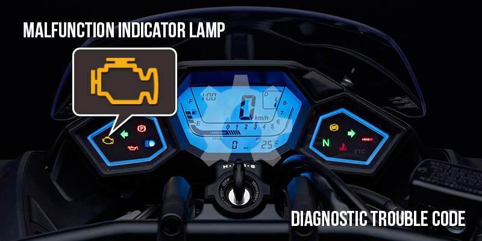
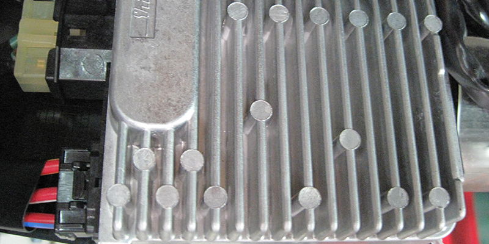
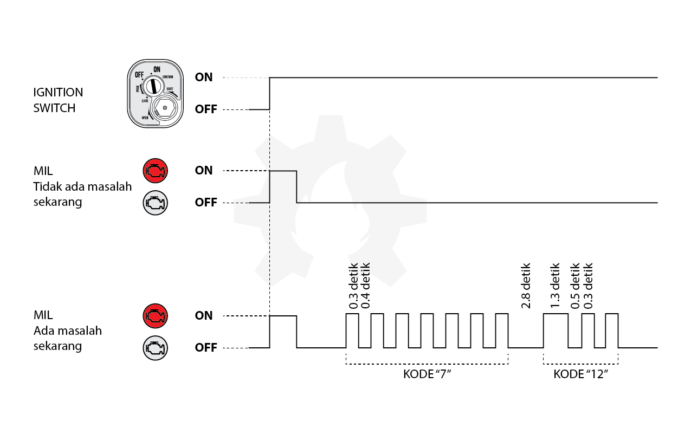

title: Kedipan MIL Honda PGM-FI
description: Malfunction Indicator Light atau disingkat MIL adalah lampu indikator dasbor yang berfungsi untuk memberitahu kepada pengguna atau mekanik tentang keadaan sepeda motor. MIL juga dikenal dengan istilah lain yaitu CEL atau Check Engine Lamp.
hero: Kedipan MIL Honda PGM-FI
disqus: henduino

# Kedipan MIL Honda PGM-FI

*Malfunction Indicator Light* atau disingkat **MIL** adalah lampu indikator dasbor yang berfungsi untuk memberitahu kepada pengguna atau mekanik tentang keadaan sepeda motor. MIL juga dikenal dengan istilah lain yaitu **CEL** atau *Check Engine Lamp*. Kedipan atau blink MIL dengan pola tertentu menunjukan kegagalan fungsi suatu [input/sensor](sensor-pgmfi.md) dan atau suatu output/aktuator. MIL merupakan bagian tak terpisahkan dari teknologi PGM-FI (*Programmed Fuel Injection*). Sedangkan Engine Control Module atau ECM adalah otak pengendali semua data yang masuk dari sensor, pengolah data, pengatur, hingga pengambil keputusan pada sepeda motor.

***

## MIL - DTC PGM-FI Honda

Perkembangan teknologi otomotif terutama sepeda motor semakin hari semakin canggih. Kecanggihan ini sebagai konsekwensi untuk menciptakan sepeda motor yang nyaman, irit, ramah lingkungan dan murah baik dari segi harga maupun murah dari segi perawatan. Konsumen pun dimanjakan dengan begitu banyak pilihan merk dan varian sepeda motor, hal ini memudahkan konsumen untuk memilih sepeda motor yang sesuai dengan kebutuhan. Salah satu produsen sepeda motor dunia yang sangat bersemangat untuk memperkenalkan produk buatan mereka adalah perusahaan Honda dibawah bendera PT Astra Honda Motor.

*Gambar 1. MIL dan DTC PGM-FI*

Honda memperkenalkan teknologi unggulannya pada hampir semua varian sepeda motor yang mereka buat yaitu teknologi PGM-FI. PGM-FI adalah singkatan dari **Programmed Fuel Injection** yang merupakan teknologi canggih dengan konsentrasi pada efisiensi penggunaan bahan bakar, sisa pembakaran dan tenaga mesin yang maksimal namun tetap ramah penggunaannya (*user-friendly*). Teknologi PGM-FI mampu menciptakan sepeda motor dengan beberapa keunggulan diantaranya:

* Efisiensi mesin tinggi
* Daya mesin tinggi
* Hemat bahan bakar
* Gas buang yang ramah lingkungan

Teknologi PGM-FI tidak bisa dipungkiri telah menggeser dominasi sistem bahan bakar karburasi yang banyak sekali kelemahan, baik dari sisi jumlah konsumsi bahan bakar hingga kualitas emisi gas buang yang tidak memenuhi standar internasional. Untuk mempelajari tahap demi tahap tentang PGM-FI maka artikel kali ini akan membahas beberapa hal yang merupakan tahap awal pengenalan teknologi PGM-FI.

***

## Engine Control Module

Seperti sudah menjadi hukum alam bahwa teknologi semakin canggih akan membuat para penggunanya nyaman dan tenang. Namun dibalik semua itu justru menghadirkan tingkat kerumitan tersendiri. Penggunaan teknologi PGM-FI membawa konsekwensi logis yang cukup berat bagi para mekanik sepeda motor. Para mekanik seperti menanggung beban yang sangat berat ketika harus berhadapan dengan teknologi tingkat tinggi sekelas PGM-FI. Hal ini karena teknologi PGM-FI membutuhkan suatu pengendali yang mampu memproses data dari berbagai sensor masukan dan mengambil keputusan untuk memerintahkan pada output aktuator sehingga menghasilkan mesin yang sempurna. Data diproses pada sebuah otak untuk menghasilkan kesimpulan tepat dalam mengendalikan mesin. Pengolah dan pengambil keputusan ini disebut dengan ECM atau Engine Control Module.

*Gambar 2. Engine Control Module*

***

## Malfunction Indicator Light

PGM-FI dilengkapi dengan sebuah self-diagnosis sytem yaitu suatu sistem yang mampu melakukan diagnosa pada dirinya sendiri ketika ditemukan keadaan yang tidak normal. *Self-Diagnosis System* terintegrasi didalam ECM. Keadaan yang tidak normal pada sepeda motor ini akan dikirim oleh ECM ke sebuah lampu indikator gangguan yang tersimpan didalam dasbor. Lampu indikator gangguan ini disebut dengan MIL (*Malfunction Indicator Light*) atau CEL (*Check Engine Lamp*). Setiap kunci kontak dihubungkan, ECM akan memeriksa kondisi sepeda motor dan jika ditemukan keadaan tidak normal maka MIL akan berkedip dengan pola tertentu yang kemudian kode kegagalan ini akan disimpan pada sebuah memori yang dapat dihapus.

*Gambar 3. Simbol MIL pada Dasbor*

***

## Malfunction Code (Kode Kegagalan)

Ketika sepeda motor mengalami masalah maka kode kegagalan fungsi tersebut akan ditunjukan dengan dua cara yang disesuaikan dengan status kegagalan.

* Kode kegagalan sekarang yaitu kode kegagalan yang akan ditampilkan melalui kedipan MIL pada dasbor ketika ECM mendeteksi suatu persoalan yang terjadi sekarang. MIL akan berkedip dengan pola tertentu sesuai dengan kode kegagalan sekarang, sehingga kita dapat dengan mudah membaca pola kedipannya dan mengetahui kegagalan fungsi pada kendaraan dengan mengacu pada tabel *DTC Index*. 
* Kode kegagalan tersimpan yaitu kode kegagalan yang tersimpan pada memori. Kegagalan ini tidak akan ditampilkan pada MIL oleh ECM karena kode kegagalan tersebut tidak terjadi sekarang. Kode kegagalan pada masa lalu akan tersimpan didalam memori sehingga kita membutuhkan cara khusus untuk menampilkan kode kegagalan tersebut dan kemudian menghapus kode kegagalan dari memori.

***

## Pola Kedipan MIL

MIL pada dasbor akan memudahkah pengguna maupun mekanik untuk mendiagnosa keadaan sepeda motor. MIL akan berkedip dengan pola tertentu sesuai dengan kode kegagalan yang terdeteksi oleh ECM. Pada saat kunci kontak diputar pada posisi "ON" perhatikan MIL.

*Gambar 4. Pola Kedipan MIL*

* Jika ECM tidak mendeteksi masalah sekarang maka MIL akan menyala terus beberapa detik dan kemudian mati tanpa terjadi kedipan, namun pada beberapa tipe, MIL justru akan menyala terus ketika tidak terjadi kegagalan fungsi pada sistem PGM-FI.
* Jika ECM mendeteksi masalah sekarang maka MIL akan menyala terus beberapa detik dan kemudian mati, setelah itu MIL berkedip dengan pola tertentu sesuai dengan kode kegagalannya.

MIL memiliki 2 pola kedipan, yaitu kedipan pendek dan kedipan panjang. Kedipan pendek berlangsung selama 0,3 detik. Sedangkan kedipan panjang berlangsung selama 1,3 detik. Satu kedipan panjang sama dengan sepuluh kedipan pendek.

***

## Contoh Pola Kedipan MIL

### Pola Kedipan Normal

Setelah Ignition Switch diputar ke posisi "ON" MIL akan menyala beberapa saat kemudian mati. Setelah itu MIL tidak menyala lagi.

<iframe width="560" height="315" src="https://www.youtube.com/embed/zjdLYrol2to?controls=0" frameborder="0" allow="accelerometer; autoplay; encrypted-media; gyroscope; picture-in-picture" allowfullscreen></iframe>

Dari contoh video di atas dapat disimpulkan bahwa ECM tidak mendeteksi kegagalan fungsi saat sekarang.

### Pola 7 Kedipan

Setelah Ignition Switch diputar ke posisi "ON" MIL akan menyala beberapa saat kemudian mati. Setelah beberapa saat mati, MIL berkedip pendek sebanyak 7 kali. Setelah 7 kedipan pendek maka MIL akan padam beberapa saat, sekitar 2,8 detik. Kemudian akan berkedip pendek sebanyak 7 kedipan lagi dan seterusnya.

Perhatikan video dibawah ini:

<iframe width="560" height="315" src="https://www.youtube.com/embed/9SbhaJl4YDA" frameborder="0" allow="accelerometer; autoplay; encrypted-media; gyroscope; picture-in-picture" allowfullscreen></iframe>

Dari contoh video diatas dapat disimpulkan sebagai berikut:

* Hanya ada satu kegagalan fungsi karena MIL berkedip pendek sebanyak 7 kali saja, dan setelah jeda diikuti kedipan yang sama.
* Jika melihat jumlah kedipan MIL maka kode kegagalannya adalah 7.
* Jika melihat ke tabel DTC Indeks bahwa kode 7 adalah kegagalan fungsi pada Sensor EOT (Engine Oil Temperature)

### Pola 12 Kedipan

Setelah Ignition Switch diputar ke posisi "ON" MIL akan menyala beberapa saat kemudian mati. Setelah beberapa saat mati, MIL berkedip panjang sebanyak 1 kali diikuti 2 kedipan pendek. Setelah itu MIL akan padam beberapa saat, sekitar 2,8 detik. Kemudian akan berkedip panjang sebanyak 1 kali diikuti 2 kedipan pendek lagi dan seterusnya. 

Perhatikan video dibawah ini:

<iframe width="560" height="315" src="https://www.youtube.com/embed/YbxgC9nWQqQ" frameborder="0" allow="accelerometer; autoplay; encrypted-media; gyroscope; picture-in-picture" allowfullscreen></iframe>

Dari contoh video diatas dapat disimpulkan sebagai berikut:

* Hanya ada satu kegagalan fungsi karena MIL berkedip panjang sebanyak 1 kali diikuti 2 kedipan pendek saja, dan setelah jeda diikuti kedipan yang sama.
* Jika melihat jumlah kedipan MIL maka kode kegagalannya adalah 12. Karena satu kedipan panjang ekuivalen dengan 10 kedipan pendek, dan diikuti 2 kedipan pendek. Maka kode menjadi 10 + 2 = 12.
* Jika melihat ke tabel DTC Indeks bahwa kode 12 adalah kegagalan fungsi pada Injektor.

***

## Fail-Safe Function

PGM-FI dilengkapi dengan sistem *Fail-Safe Function* yaitu suatu fungsi yang mampu menjalankan mesin dalam keadaan minimal walaupun ada persoalan pada sistem (ada sensor yang bermasalah walau ditemukan oleh ECM). Jika saat dihidupkan *self-diagnosis function* pada ECM menemukan masalah pada sistem maka mesin tetap bisa bekerja karena dipelihara oleh sebuah nilai awal (*default*) yang terprogram pada pemetaan program simulasi. Namun, jika *self-diagnosis function* ternyata mendeteksi kegagalan fungsi pada injektor, sensor CKP, sensor CMP, yang terbaru Ignition Coil maka *fail-safe function* akan mematikan mesin untuk melindunginya dari kemungkinan kerusakan yang lebih parah.

***

## DTC dan MIL Index

Dibawah ini adalah tabel indeks DTC yang digunakan sebagai acuan untuk mengambil kesimpulan kode permasalahan sistem PGM-FI yang terdeteksi oleh Self-Diagnosis Function, gejala yang terasa dan nilai awal dari Fail-Safe Function.

| DTC-MIL | Self-Diagnosis |                            Gejala                           |
|:-------:|:--------------:|:-----------------------------------------------------------:|
|    1    |   Sensor MAP   | Mesin beroperasi normal                                     |
|    7    | Sensor EOT/ECT | Sulit hidup pada suhu rendah                                |
|    8    |    Sensor TP   | Akselerasi mesin buruk                                      |
|    9    |   Sensor IAT   | Mesin beroperasi normal                                     |
|    11   |    Sensor VS   | Mesin beroperasi normal                                     |
|    12   |    Injektor    | Mesin tidak dapat dihidupkan                                |
|    21   |   Sensor O~2~  | Mesin beroperasi normal                                     |
|    29   |      IACV      | Mesin mati terus, sulit dihidupkan, putaran stasioner kasar |
|    33   |     EEPROM     | Mesin beroperasi normal atau bahkan mesin mati              |
|    52   |   Sensor CKP   | Mesin tidak dapat dihidupkan                                |
|    54   |   Sensor BAS   | Mesin beroperasi normal atau bahkan mesin mati              |
|    57   |Engine Overheat | Mesin dimatikan dan tidak bisa dihidupkan                   |
|    91   | Ignition Coil  | Mesin tidak dapat dihidupkan                                |

***

## Referensi

* PGM-FI Troubleshooting Tips, American Honda Motor Co., Inc.
* PGM-FI XL700V Service Manual, American Honda Motor Co., Inc.
* ANF125 Service Manual, American Honda Motor Co., Inc.
* Buku Pedoman Reparasi CV-Matic, PT Astra Honda Motor
* MIL Trouble Code Honda, Al Tech

***

<small>Artikel diperbarui pada: {{ git_revision_date_localized }}</small>