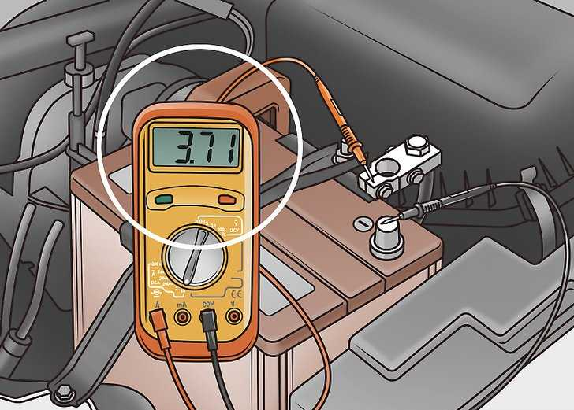
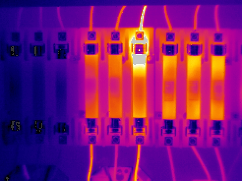
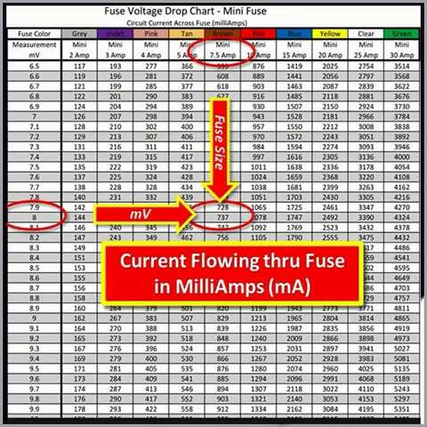

title: Parasit Penguras Arus Baterai
description: Parasit Penguras Arus Baterai adalah beban listrik yang menguras arus dari baterai ketika kunci kontak dimatikan.
hero: Parasit Penguras Arus Baterai
disqus: 

# Parasitic Current Draw

***

## Kebocoran Arus vs Parasit Penguras Arus

Pada buku-buku pedoman reparasi sebenarnya sudah sering di jelaskan tentang penguras arus. Penguras arus pada kendaraan sebenarnya dibagi menjadi dua jenis, yaitu:

1. Penguras arus cepat yang dapat menghabiskan baterai dalam hitungan jam.
2. Penguras arus lambat yang membutuhkan waktu seminggu atau lebih untuk menguras baterai hingga tidak dapat menghidupkan kendaraan.

Penguras arus baterai yang pertama adalah jenis yang sering di bahas pada buku-buku pedoman reparasi, jenis ini biasanya relatif mudah ditemukan dan diperbaiki, karena secara umum hanya digunakan alat berupa ampere meter. Teknik pemeriksaan penguras arus cepat disebut dengan *pemeriksaan kebocoran arus*.

Sedangkan jenis yang kedua sering kali disebut sebagai "*Penguras Hantu*" atau "*Panthom Drain*", dan untuk menemukannya membutuhkan keahlian khusus. Jenis yang kedua inilah yang akan kita bahas sebagai "**Parasit Penguras Arus**".

*Gambar 1. Pemeriksaan Kebocoran Arus*

***

## Parasit Penguras Arus Baterai

Dalam tinjauan dan istilah otomotif, **Parasit Penguras Arus** atau "*Parasitic Current Draw*" adalah beban listrik yang menguras arus dari baterai ketika kunci kontak dimatikan. Parasit penguras arus ini ada yang dianggap normal, namun ada juga yang tidak normal. Hal ini karena kendaraan memiliki beberapa perangkat elektronik yang sering disebut **F.R.E.D** (*Frustrating Ridiculous Electronic Device*) atau dalam bahasa Indonesia diterjemahkan menjadi *Perangkat Elektronik Konyol Pembuat Frustasi* yang terus menerus terhubung sepanjang waktu dengan daya baterai, sehingga terjadi penyusutan daya baterai dalam jumlah kecil. FRED sering menguras beberapa mA (milliampere) karena terdapat beberapa komponen yang disebut **KAM** (*Keep Alive Memory*) atau *memori yang dipertahankan untuk selalu hidup*, misal jam, alarm anti maling, GPS, memori [penyimpan DTC](mil-pgmfi.md), atau memori posisi terakhir kaca spion, sejumlah kecil arus yang digunakan KAM ini biasanya hanya akan menggunakan arus hingga 20 atau maksimal 35 mA. Artinya, kendaraan dapat diparkir selama berhari-hari, bahkan beberapa minggu tanpa masalah kehabisan baterai yang berlebihan yang mungkin menghambat proses menghidupkan mesin.

***

## Mode Tidur

Selama kendaraan digunakan secara berkala maka alternator mengisi ulang baterai, hal ini tidak akan menjadi masalah. Masalah dapat terjadi itu ketika, misal; kendaraan baru yang ter-parkir di dalam stok dealer, kendaraan diparkir di garasi dalam jangka panjang dan kondisi-kondisi lainnya yang membuat mobil masuk dalam mode "tidur" sepanjang hari dan dalam kurun waktu yang lama. Mode tidur adalah keadaan dimana kendaraan sama sekali tidak digunakan dalam waktu lama, sehingga sangat sedikit bahkan tidak ada (pada bebera jenis kendaraan) perangkat kelistrikan yang menggunakan daya baterai.

Tingkat *Reserve Capacity* (RC) atau *Kapasitas Cadangan* dikalikan dengan 0,7 memberikan perkiraan ampere-jam (Ah) yang tersedia dari pengisian penuh hingga pengisian ulang. Terkadang antara pengisian penuh hingga pengisian ulang, baterai akan mencapai titik di mana ia tidak dapat lagi menyalakan starter. Menggunakan sekitar 40% dari total Ah yang tersedia biasanya akan membuat baterai yang terisi penuh hingga menjadi tidak mampu lagi start walau pada suhu sedang 25°C (77°F). Dengan kata lain, baterai pada umumnya jika menghabiskan Ah yang tersedia sebesar 20 hingga 30 Ah akan mengakibatkan baterai tidak mampu melakukan start.

***

## Kapasitas Cadangan Baterai

*Reserve Capacity* (RC) atau *Kapasitas Cadangan* adalah kemampuan baterai menyimpan daya dalam kurun waktu tertentu. Dengan menggunakan nilai arus parasit yang diperoleh selama mode tidur kendaraan, kita dapat menghitung indikasi perkiraan waktu untuk meninggalkan kendaraan sebelum kesehatan baterai menurun. Untuk menghitung cadangan baterai, gunakan rumus berikut:

1. Pastikan baterai terisi penuh pada suhu 21°C-25°C
2. Nilai Ah (tertera pada baterai) x 70/100 = 70% dari nilai Ah
3. Hasil hitung 70% dari nilai Ah / nilai parasit yang diperoleh selama mode tidur = Jam sebelum pengisian ulang baterai
4. Jam sebelum pengisian ulang baterai / 24 jam = hari sebelum pengisian ulang baterai

***

## Menghitung Umur Cadangan Baterai

Sebagai contoh, ada sebuah baterai dengan kapasitas 50 Ah, parasit penguras arusnya sebesar 30 mA atau 0,03 A maka baterai bisa ditinggalkan selama 48,6 hari dengan perhitungan sebagai berikut:

!!! info "Menghitung Umur Cadangan Baterai"

	$$
	\begin{align*}
	&50Ah \times (70/100) =\text{35Ah dari nilai Ah yang disebutkan pada baterai kendaraan}\\
	&35Ah/0,03 A =\text{1.166,7 jam}\\
	&1.166,7 jam/24 jam = \text{48,6 hari sebelum baterai perlu diisi ulang}
	\end{align*}
	$$

***

## Tabel Parasit Penguras Arus

Meskipun secara spesifikasi parasit penguras arus adalah sekitar 35 mA (0,035 amp), pengurasan arus biasanya ada di kisaran 7-12 mA, meskipun beberapa kendaraan mewah memang mendekati maksimum. Pengurasan arus yang sebenarnya mungkin kecil, tetapi seiring waktu baterai menjadi semakin lemah.
Misal; Kendaraan dengan parasit arus 30 mA dan baterai dengan kapasitas cadangan 70% akan bertahan selama 3 minggu. Tetapi jika baterai itu hanya 65% dari pengisian penuh, itu akan bertahan hanya 2 minggu sebelum akhirnya tidak mampu lagi menghidupkan mesin. Parasit arus akan cukup konstan pada kisaran suhu. Suhu yang baik adalah suhu kendaraan pada saat dinyalakan. Ketika suhu turun menjadi 0°C (32°F), baterai hanya akan dapat mengeluarkan sekitar 85% dari daya start yang biasanya tersedia, dan mesin mungkin memerlukan sebanyak 165% dari daya biasa untuk memulai menghidupkan mesin.

Efek gabungan dari kedua faktor ini (kapasitas cadangan dan suhu) akan mengurangi jumlah hari baterai untuk bertahan dengan parasit arus. Pada suhu 0°C (32°F), baterai hanya dapat bertahan setengah jika dibandingkan pada suhu 25°C (77°F). Pada suhu 25°C (77°F) atau lebih akan meningkatkan pengosongan diri sendiri baterai (terjadi pengurasan diri sendiri akibat proses elektrolisa). Jika kendaraan berada di tempat yang suhunya rata-rata 32°C (90°F), tambahan 5% hingga 10% dari ampere-jam yang tersedia akan hilang dalam sebulan karena pengosongan diri sendiri di dalam baterai. Pada suhu di bawah kisaran sedang, pelepasan diri sendiri tidak terlalu tinggi dibandingkan dengan hilangnya arus akibat parasit.

Berapa banyak yang modul-modul elektronik dapat menguras arus pada [baterai](bersihkan-terminal-baterai.md)? Meskipun tabel dibawah ini bukan kumpulan spesifikasi yang tepat, hal ini memberikan perkiraan yang baik untuk parasit arus dari berbagai perangkat yang ada pada kendaraan.

| Komponen                  | Pengurasan Normal (mA) | Pengurasan Maksimum (mA) | Batas Waktu (Menit) |
|---------------------------|:-------------------------:|:---------------------------:|:----------------------:|
| Anti-Theft System         |            0,4            |              1              |            -           |
| Auto Door Lock            |             1             |              1              |            -           |
| Body Control Module       |            3,6            |             12,4            |           20           |
| Central Processing System |            1,6            |             2,7             |           20           |
| Electronic Control Module |            5,6            |              10             |            -           |
| Electronic Level Control  |             2             |             3,3             |           20           |
| Heated Winshield Module   |            0,3            |             0,4             |            -           |
| HVAC Power Module         |             1             |              1              |            -           |
| Illuminated Entry         |             1             |              1              |            1           |
| Light Control Module      |            0,5            |              1              |            -           |
| Oil Level Module          |            0,1            |             0,1             |            -           |
| Multi-Fucntion Chime      |             1             |              1              |            -           |
| Pass Key Decoder Module   |            0,75           |              1              |            -           |
| Power Control Module      |             5             |              7              |            -           |
| Retained Accessory Power  |            3,8            |             3,8             |            -           |
| Radio                     |             7             |              8              |           15           |
| Twilight Sentinel Module  |             1             |              1              |            -           |
| Voltage Regulator         |            1,4            |              2              |            -           |

Parasit arus intermiten (putus-sambung) dapat terjadi karena perangkat memori (KAM) yang tidak mati walaupun kunci kontak dimatikan. Dengan beban parasit yang terputus-putus, pengurasan baterai bisa lebih besar dari 1,0 A.

***

## Mempersiapkan Kendaraan

Pada tabel parasit penguras arus diatas, kita dapat menemukan beberapa perangkat kelistrikan membutuhkan waktu cukup lama untuk memasuki mode tidur. Misal; Radio membutuhkan waktu hingga 15 menit untuk memasuki mode tidur, ini berarti, Radio tidak bisa langsung mati saat kunci kontak baru dimatikan.

Fakta dilapangan bahwa beberapa produsen kendaraan membuat prosedur khusus yang harus diikuti ketika akan melakukan pemeriksaan parasit penguras arus. Beberapa dari prosedur umum diantaranya:

1. Jalankan kendaraan hingga mencapai jarak minimum dengan semua beban listrik yang diaktifkan
2. Melepaskan terminal baterai negatif untuk waktu tertentu (tidak semua kendaraan)
3. Menjaga jarak minimum *key fob* (kunci kontak *wireless* atau sejenis) dari kendaraan selama pengujian untuk mencegah kunci membangunkan beberapa modul atau bahkan mencegah beberapa modul masuk ke mode tidur
4. Lihat buku manual tentang berapa lama waktu yang dibutuhkan kendaraan untuk memasuki mode tidur

Namun ada hal lain dari prosedur yang ditetapkan, dan ini harus diperoleh dari informasi layanan yang pasti dan diikuti dengan benar untuk memastikan hasil tes yang akurat. Mungkin kita melakukan pencarian online yang akan memunculkan banyak petunjuk yang menjelaskan prosedur tes umum untuk penarikan arus parasit, dan itu sangat banyak, maka berhati-hatilah dengan prosedur *melepaskan baterai*, kita harus mengetahui alasan yang tepat dan akurat mengenai prosedur yang satu ini.

Faktanya adalah bahwa melepaskan baterai ketika itu tidak ada dalam prosedur pasti (buku pedoman reparasi) dapat menghasilkan hal yang tidak dapat diprediksi, yang paling serius adalah penghapusan memori dan atau kerusakan program kritis di sejumlah modul pengendali. Efek lainnya adalah ketika menyambungkan kembali baterai, itu justru membangunkan semua atau sebagian besar modul pengendali di dalam kendaraan, itu juga berarti kendaraan harus ditunggu hingga satu jam atau lebih agar kendaraan kembali memasuki mode tidur, dan dengan memastikan tidak ada modul pengendali yang mengalami kerusakan. Karenanya, untuk menghindari kemungkinan adanya kerusakan pada modul pengendali, maka **==JANGAN==** mencabut baterai kecuali sudah memiliki informasi servis yang akurat yang secara spesifik mengatakan bahwa *==harus melepaskan baterai==*.

Jadi sebelum memulai pengujian sirkuit, persiapkan kendaraan dengan membuka semua pintu dan menutup pengaitnya ke posisi tertutup, agar pintu terdeteksi sedang tertutup, atau tekan saklar pintu (untuk beberapa tipe kendaraan). Buka kap mesin dan palka belakang, dan pasang kabel jumper di sekitar sakelar untuk mensimulasikan kondisi tertutup. Pastikan semua kaca pintu tertutup dan lampu dalam keadaan mati sebelum mematikan kunci kontak, matikan kunci kontak, cabut anak kunci, dan menempatkannya sejauh mungkin dari kendaraan. Tunggu sekitar satu jam hingga kendaraan memasuki mode tidur. Cukup waktu untuk mempertimbangkan beberapa teori kelistrikan, teori penurunan tegangan (*drop voltage*).

***

## Penurunan Tegangan (Drop Voltage)

*Gambar 2. Panas pada Sekring*

Gambar di atas diambil menggunakan kamera thermal pada kotak sekring yang menunjukkan terjadinya penurunan tegangan yang parah. Sekring menyala merah terang sebagai akibat dari panas berlebih yang dihasilkan oleh hambatan listrik yang tinggi terhadap aliran arus, inilah yang menjadi dasar pengukuran *penurunan tegangan* (*drop voltage*).

Cara termudah untuk menjelaskan cara kerja pengukuran penurunan tegangan adalah dengan mengutip Hukum Ohm, yang menyatakan bahwa tegangan sama dengan arus dikalikan dengan resistansi (`V = I * R`). Dinyatakan secara berbeda bahwa arus sama dengan tegangan dibagi dengan resistansi, yang dinyatakan dengan rumus (`I = V / R`). Jika kita menerapkan hukum ini pada diagnostik otomotif, tegangan biasanya konstan 12 volt, sedangkan konsumsi listrik memiliki resistansi integral terhadap arus yang mengalir, dan kombinasi dari kedua faktor inilah yang menentukan kekuatan atau intensitas arus yang mengalir melalui sebuah sirkuit. Anggaplah bahwa resistansi kabel diabaikan karena nilai ini biasanya dapat diabaikan.

Saat arus mengalir melalui suatu rangkaian, resistansi konduktor (kabel) yang diabaikan dapat menyebabkan perubahan kecil dalam intensitas arus dari satu titik rangkaian ke titik lainnya. Oleh karena itu, jika menempatkan probe negatif multimeter pada ujung kabel, dan probe positif pada ujung yang lain ***di kabel yang sama***, ini memungkinkan untuk mengukur pengurangan intensitas arus antara kedua titik ujung kabel tersebut.

***

## Pemeriksaan Penurunan Tegangan pada Sekring

Anda mungkin pernah mendengar bahwa mencabut sekring satu per satu dilakukan untuk menemukan sirkuit yang aktif padahal seharusnya tidak boleh. Meskipun hal ini benar, mencabut sekring pada kendaraan modern menjadikan metode ini hanya berfungsi jika beruntung dan itu juga jika mencabut sekring pada sirkuit yang rusak. Mencabut sekring secara acak cenderung membangunkan modul pengendali, yang berarti harus menunggu lagi selama satu jam atau lebih agar seluruh kendaraan kembali ke mode tidur, bagaimana jika menunggu itu harus dilakukan setiap kali kita mencabut sekring? Ini jelas tidak praktis, lalu bagaimana cara terbaik?

*Gambar 3. Memeriksa Penurunan Tegangan pada Sekring*

Ikuti langkah dibawah ini untuk melakukan pengujian parasit penguras arus pada kendaraan.

1. Sebelum memulai pengujian, ingatlah bahwa pada tahap ini bukanlah untuk menentukan kekuatan atau intensitas pengurasan arus. Apa yang dilakukan adalah mengidentifikasi sirkuit di mana terdapat parasit penguras arus, jadi siapkan pena kertas untuk mencatat nilai pengukuran dan label sekering yang menunjukan nilai.

2. Hasil pengujian yang paling akurat diperoleh dengan menggunakan multimeter digital berkualitas baik dan putar multimeter ke *==skala milivolt==*. Gunakan probe yang memiliki ujung tajam karena probe tumpul biasanya agak sulit melakukan kontak yang tepat dengan filamen sekring, oleh karena itu perlu memiliki probe dengan ujung tipis dan tajam.

3. Ketika sudah siap untuk memulai pengujian, cari kotak sekring di dalam kendaraan. Mulailah menguji sekring dengan menempatkan satu probe di salah satu ujung filamen sekring, dan probe lainnya di ujung filamen sekring pada sekring yang sama (*lihat gambar 2 diatas*), tetapi harus diingat bahwa hal ini dilakukan saat kendaraan dalam mode tidur, itu berarti seharusnya tidak ada penggunaan listrik. Pada saat pengujian ini tidak akan ditemukan tegangan sebesar tegangan sumber listrik (12 Volt).

Pastikan probe multimeter tajam dan terjadi kontak yang baik antara sekring dan probe, Jika ditemukan tegangan pada sekring, nilai yang terbaca ada dalam kisaran milivolt. Jika hasil pembacaan yang berfluktuasi dengan cepat, dapat dipastikan bahwa probe tidak terhubung dengan baik, ubah posisi probe dan tunggu pembacaan nilai hingga stabil.Jika tidak mendapatkan pembacaan sama sekali atau nilainya nol, rangkaian kelistrikan yang ada dalam jalur sekring tersebut dapat dipastikan dalam keadaan baik.

Lanjutkan pengujian pada semua sekring, sekering utama (fusible link), dan relay dengan cara ini, catat hasil pembacaan pada nomor/label sekering yang di periksa jika ditemukan nilai pada multimeter. Setelah semua sekring, sekering utama (fusible link) dan relay sudah diperiksa dan ditemukan nilai tertentu yang melebihi spesifikasi, lakukan pemeriksaan jalur kelistrikan. Untuk mengetahui nilai hasil pemeriksaan melebihi spesifikasi atau masih aman, gunakan tabel konversi dibawah untuk mengubah nilai hasil pemeriksaan dalam milivolt ke nilai miliampere. Lalu ambil kesimpulan dari hasil pembacaaan, apakah rangkaian kelistrikan dalam keadaan baik atau ditemukan parasit penguras arus yang melebihi spesifikasi.

***

## Bagan Konversi Sekring

Dengan grafik ini Anda akan dapat mengubah bacaan milivolt menjadi angka miliamp yang mewakili arus yang mengalir melalui sekring.

1. Pilih tabel yang benar untuk sekring yang sedang diuji ([Mini][11], [Maxi][12], [Standar][13], [Kartrid][14])
2. Temukan kolom yang cocok dengan pembacaan amp yang sedang diuji
3. Temukan baris yang cocok dengan nilai milivolt (pencocokan pembacaan multimeter)
4. Perhatikan baris dan kolom berpotongan, itu adalah nilai tertinggi yang akan menjadi bahan pertimbangan pengambilan keputusan, nilai tertulis dalam satuan miliamp

*Gambar 4. Membaca Tabel Konversi Sekring*

Klik tautan di bawah untuk mengunduh bagan sekering:

* [Sekring Mini (Mini Fuses)][11]
* [Sekering Maxi (Maxi Fuses)][12]
* [Sekring Standar (Standard Fuses)][13]
* [Sekering Kartrid (Cartridge Fuses)][14]

***

## Kesimpulan

Cara diatas bukanlah metode terbaik untuk menemukan parasit penguras arus pada kendaraan modern karena ada cara yang lebih kompleks dibandingkan melakukan pemeriksaan penurunan tegangan (*drop voltage*) pada sekering untuk menguji sirkuit dalam menemukan parasit penguras arus.   

Namun, metode penurunan tegangan adalah cara yang paling sederhana, termudah, tercepat, dan paling dapat diandalkan bagi siapa saja untuk menemukan parasit penguras arus bahkan pada kendaraan kelas mewah sekalipun. Bagian tersulit dari metode penurunan tegangan sering kali berkaitan dengan persiapan kendaraan dengan benar, tetapi memahami kondisi kendaraan untuk benar-benar masuk kedalam mode tidur sebelum memulai pengujian penurunan tegangan adalah perjuangan yang harus dilakukan. Ini berhubungan dengan kesabaran dalam melakukan pengujian. Metode sederhana ini hampir bisa dilakukan oleh siapapun walaupun bukan mekanik profesional. Sekali lagi! Ini masalah **==KESABARAN==**.

Selamat mencoba! Salam hangat dari Banjarsari, Ciamis, Jawa Barat, Indonesia, Bumi, Galaksi Bima Sakti.

***

## Daftar Pustaka

* [How To Perform a Parasitic Draw Test][1]
* [Fuse Charts][2]
* [Testing Parasitic Draw via Fuse Voltage Drop][3]
* [Parasitic Draw Test with a Multimeter][4]
* [Parasitic Draw Testing][5]
* [Parasitic Drain testing][6]
* [Measuring Parasitic Draw][7]
* [Parasitic Battery Drain Diagnostics for Non-Electricians][8]
* [Battery Drained Overnight? How to Fix Parasitic Power Loss][9]
* [Parasitic Current Draw][10]

[1]: https://m.roadkillcustoms.com/how-to-perform-a-parasitic-draw-test/
[2]: https://www.carcertifiedtools.com/pages/fuse-charts
[3]: https://us.autologic.com/news/testing-parasitic-draw-via-fuse-voltage-drop
[4]: https://testmeterpro.com/parasitic-draw-test-with-a-multimeter/
[5]: https://www.ericthecarguy.com/parasitic-draw-testing/
[6]: https://www.picoauto.com/library/training/parasitic-drain-testing
[7]: http://www.nissantechnicianinfo.mobi/htmlversions/Winter_2012/Parastic_Draw.html
[8]: https://www.mechanic.com.au/news/parasitic-battery-drain-diagnostics-for-non-electricians/
[9]: https://shop.advanceautoparts.com/r/car-projects/battery-drained-overnight-how-to-fix-parasitic-power-loss
[10]: https://aamcouniversity.com/wp-content/uploads/sites/7/2019/08/LBT-270-MAN-PARASITIC_DRAIN_WEB_V1-41126.pdf
[11]: ./pdf/Mini_Fuse_Chart.pdf
[12]: ./pdf/Maxi_Fuse_Chart.pdf
[13]: ./pdf/Standard_ATC_Chart.pdf
[14]: ./pdf/Cartridge_Fuse_Chart.pdf

***

<small>Artikel diperbarui pada: {{ git_revision_date_localized }}</small>