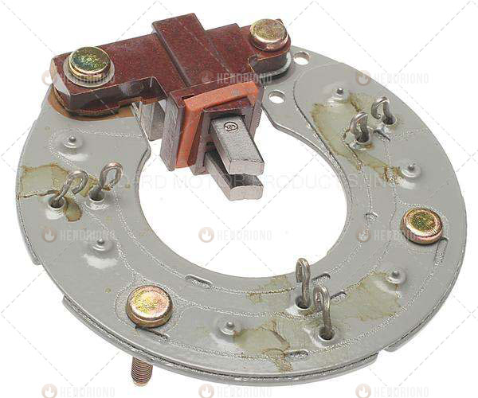
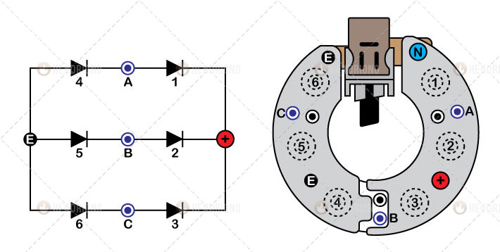
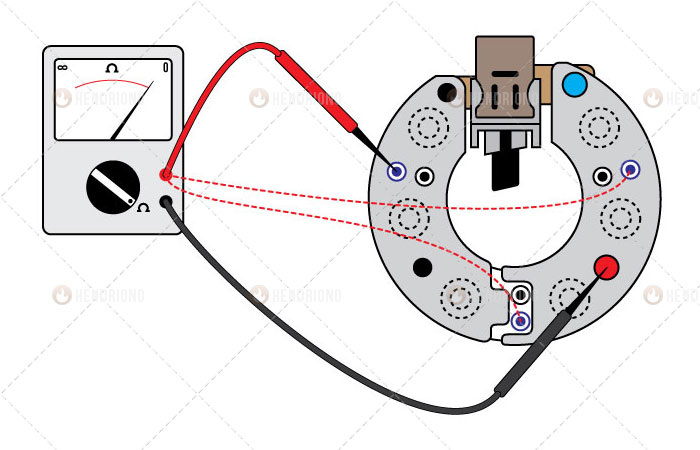
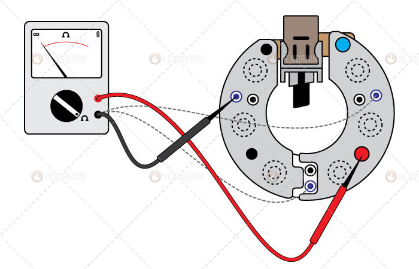
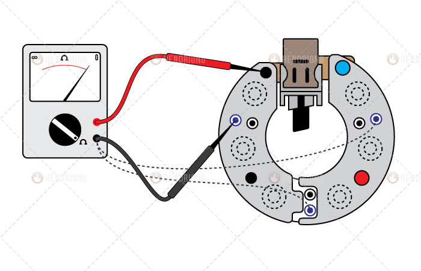
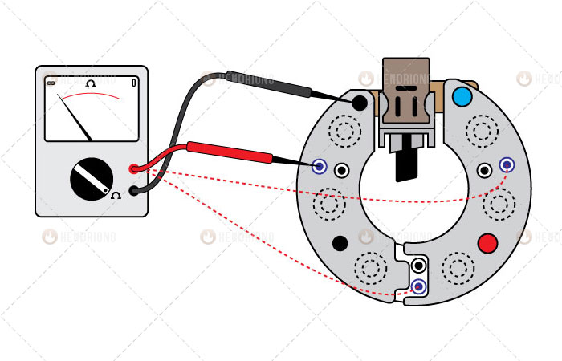

title: Memeriksa Rectifier Alternator
description: 
hero: Memeriksa Rectifier Alternator
disqus: henduino

# Memeriksa Rectifier Alternator

## Fungsi Rectifier

**Rectifier** merupakan komponen penting didalam sistem pengisian (*charging system*). Rectifier memiliki 2 fungsi; mengubah arus AC menjadi DC dan melindungi lilitan stator. Rectifier pada alternator dengan [regulator mekanik](prinsip-regulator-mekanik.md) hanya memiliki 6 buah diode, yang terdiri dari 3 buah diode negatif dan 3 buah diode positif. Diode hanyalah sebuah komponen elektronika yang juga rentan terhadap kerusakan hal ini bisa menyebabkan kegagalan kerja sistem pengisian. Bahkan bisa berakibat fatal pada komponen-komponen kelistrikan yang sensitif terhadap arus AC. Perawatan berkala pada komponen-komponen alternator harus dilakukan agar sistem pengisian dapat bekerja dengan optimal. Kegagalan kerja sistem pengisian akan menyebabkan beban tertumpu hanya pada baterai, sedangkan baterai memiliki kemampuan menyimpan arus yang sangat terbatas. Jika beban yang digunakan pada mobil terlalu besar maka proses pengosongan baterai pun akan lebih cepat. Salah satu penyebabkan kegagalan kerja sistem pengisian adalah kerusakan pada rectifier. Bagaimana memeriksa diode rectifier? Mari kita lanjutkan...

***

## Penyebab Kerusakan Rectifier

Beberapa hal dibawah ini merupakan pemicu kerusakan pada rectifier, diantaranya:

1. Kesalahan penyetelan pada regulator mekanik bisa mengakibatkan tegangan dan arus yang dihasilkan oleh alternator melebihi batas kemampuan diode yang mampu merusak rectifier.
2. Hubungan pendek (*Short Circuit*) atau korsleting (dari bahasa Belanda *kortsluiting*) pada rangkaian kelistrikan. Terjadinya shortcircuit pada rangkain kelistrikan kendaraan juga bisa mengakitabkan rectifier mengalami kerusakan, terutama pada rangkaian kelistrikan jalur utama yang menggunakan kabel ukuran besar.
3. Short Circuit sel-sel internal baterai, walau kasus ini jarang terjadi, namun kemungkinan bisa saja terjadi. Baterai yang telah berumur, mengalami penurunan kinerja akibat penumpukan gram timbal didalam separator baterai, tepung/gram timbal tersebut bisa menjadi pemicu terjadi short circuit baterai, yang tertunya mengancam pula rectifier pada alternator.
4. Air masuk kedalam alternator dan menyebabkan hubungan pendek didalam alternator, hal ini juga dapat memicu kerusakan pada rectifier.

***

## Akibat Kerusakan pada Rectifier

Recitifer yang rusak dapat mengakibatkan kerusakan fatal pada beberapa komponen dan bagian pada sistem kelistrikan kendaraan, diantaranya:

1. *Sistem Elektronika rusak*. Ini biasanya terjadi karena diode yang rusak justru menghubungkan langsung tegangan AC yang dihasilkan alternator tanpa merubahnya menjadi arus DC. Diode seakan-akan hanya menjadi sebuah penghantar tanpa mampu menyearahkan tegangan.
2. *Baterai rusak*. Hal ini bisa saja terjadi akibat diode tak mampu merubah arus AC menjadi arus DC. Tegangan AC yang diterima langsung oleh baterai akan merusak atau memperpendek umur baterai. Pada kondisi ekstrim baterai bisa meledak.
3. *Stator terbakar*. Ini terjadi akibat tegangan dari baterai masuk kedalam rotor atau tegangan yang dihasilkan dari ujung-ujung lilitan stator justru saling beradu antar ujung lilitan.
4. *Baterai kosong*. Hal ini karena tegangan tidak bisa mengalir dari alternator. Kerusakan lain pada diode adalah terputus, sehingga tegangan dari stator tidak mampu mengalir.

***

## Mengidentifikasi Rectifier pada Alternator

Sebelum melakukan pemeriksaan, maka hal yang pertama harus dilakukan adalah mengidentifikasi jenis, bentuk, lokasi terminal dari rectifier. Apa yang dipaparkan pada artikel dibawah ini hanya sebuah ilustrasi yang bisa saja berbeda bentuk, lokasi dan jenis dengan rectifier yang anda hadapi. Namun secara garis besar, proses pemeriksaan rectifier tetap saja sama, baik itu untuk alternator dengan regulator mekanik maupun alternator dengan regulator elektronik. Proses identifikasi akan mempermudah proses pemeriksaan diode.

Gambar 1. Rectifier Regulator Mekanik

Gambar 2. Identifikasi Rectifier

Gambar diatas adalah illustrasi antara gambar pada rangkaian dengan pada benda kerjanya. Perhatikan baik-baik Gambar 2 diatas dan ikuti proses identifikasi dibawah ini:

1. Gambar sebelah kiri pada gambar 2 adalah rangkaian yang sering digunakan untuk menjelaskan kinerja rectifier dan gambar kanan pada gambar 2 adalah rectifier yang telah dilepas dari statornya.
2. Rectifier terdiri dari 6 buah diode yang disusun menjadi 2 blok; 3 diode positif dengan label angka (1, 2 dan 3) dan 3 diode negatif dengan label angka (4, 5 dan 6).
3. Setiap satu dari tiga buah diode positif ujungnya disatukan untuk menghasilkan terminal positif (+) atau sering dikenal dengan terminal B+.
4. Setiap satu dari tiga buah diode negatif ujungnya disatukan untuk menghasilkan terminal negatif (-) atau sering dikenal dengan terminal E.
5. Terdapat dua buah terminal E dari recitifier pada alternator sebenarnya.
6. Setiap ujung lainnya dari masing-masing diode digabungkan sehingga menjadi titik tengah antara diode positif dan negatif. Titik ini dihubungkan dengan ujung-ujung lilitan stator. Pada gambar terdiri dari 3 buah ujung yang diberi label (A, B dan C).
7. Pada rectifier sebenarnya (gambar 2 kanan), terdapat 6 buah titik dengan bentuk sama namun dengan warna berbeda. Titik-titik yang diberi label (A, B dan C) adalah titik yang berhubungan dengan diode, sedangkan titik sebelahnya yang berwarna hitam adalah ujung-ujung lilitan stator yang satukan dan menghasilkan terminal N.

***

## Pemeriksaan Rectifier Alternator

Pemeriksaan rectifier pada alternator dengan regulator mekanik sebenarnya bukanlah hal yang sulit, asalkan kita mampu mengidentifikasi terminal-terminal yang ada pada diode rectitifier dan memahami prinsip kerja dari diode. Sebelum membahas pemeriksaan rectifier sebaiknya pahami dulu prinsip kerja diode, bahwa diode "*hanya mampu mengalirkan salah satu jenis tegangan, dan memblok jenis tegangan lainnya*".

### Persiapan Pemeriksaan

Beberapa hal yang harus disiapkan sebelum memeriksa rectifier:

1. Siapkan Multimeter (AVO Meter)
2. Set Multimeter pada posisi pemeriksaan tahanan dengan simbol &#8486; (ohm)
3. Bongkar alternator dan lepaskan rectifier dari stator, hal ini untuk memperoleh hasil yang lebih akurat, walau sebenarnya bisa saja melakukan pemeriksaan rectifier tanpa harus melepasnya dari stator. Namun hindari memeriksa alternator yang masih berhubungan dengan stator.
4. Bersihkan ujung dan terminal pada rectifier.

### A. Pemeriksaan 3 Diode Positif

Hati-hati dalam melakukan pemeriksaan dan pahami dengan baik. Ikuti langkah pemeriksaan 3 diode positif dibawah ini:

#### Pemeriksaan 1

Perhatikan gambar dibawah ini:

Gambar 3. Pemeriksaan 1 Diode Positif

Ikuti langkah pemeriksaan dibawah ini:

* Pastikan bawa multimeter adan pada posisi pemeriksaan tahanan &#8486; (ohm)
* Hubungkan terminal positif Multimeter (kabel warna merah) ke terminal positif (+) rectifier
* Hubungkan terminal negatif Multimeter (kabel warna hitam) ke ujung A, B dan C
* Perhatikan Multimeter selama pemeriksaan. Pastikan bahwa Multimeter menunjukan kontinyuitas (adanya hubungan/tahanan hingga nilai 0), jika Multimeter tidak menunjukan kontinyuitas maka rectifier harus diganti.

#### Pemeriksaan 2

Perhatikan gambar dibawah ini:

Gambar 4. Pemeriksaan 2 Diode Positif

Ikuti langkah pemeriksaan dibawah ini:

* Tukar posisi terminal Multimeter
* Hubungkan terminal negatif Multimeter (kabel warna hitam) ke terminal positif (+) rectifier
* Hubungkan terminal positif Multimeter (kabel warna merah) ke ujung A, B dan C
* Perhatikan Multimeter selama pemeriksaan. Pastikan bahwa Multimeter tidak menunjukan kontinyuitas (tidak ada hubungan atau nilai tahanan &#8734; tak terhingga), jika Multimeter menunjukan kontinyuitas maka rectifier harus diganti.

### B. Pemeriksaan 3 Diode Negatif

Ikuti langkah pemeriksaan 3 diode negatif dibawah ini:

#### Pemeriksaan 1

Perhatikan gambar dibawah ini:

Gambar 5. Pemeriksaan 1 Diode Negatif

Ikuti langkah pemeriksaan dibawah ini:

* Hubungkan terminal negatif Multimeter (kabel warna hitam) ke terminal negatif (E) rectifier
* Hubungkan terminal positif Multimeter (kabel warna merah) ke ujung A, B dan C
* Perhatikan Multimeter selama pemeriksaan. Pastikan bahwa Multimeter menunjukan kontinyuitas (adanya hubungan/tahanan hingga nilai 0), jika Multimeter tidak menunjukan kontinyuitas maka rectifier harus diganti.

#### Pemeriksaan 2

Perhatikan gambar dibawah ini:

Gambar 6. Pemeriksaan 2 Diode Negatif

Ikuti langkah pemeriksaan dibawah ini:

* Tukar posisi terminal Multimeter
* Hubungkan terminal positif Multimeter (kabel warna merah) ke terminal negatif (E) rectifier
* Hubungkan terminal negatif Multimeter (kabel warna hitam) ke ujung A, B dan C
* Perhatikan Multimeter selama pemeriksaan. Pastikan bahwa Multimeter tidak menunjukan kontinyuitas (tidak ada hubungan atau nilai tahanan &#8734; tak terhingga), jika Multimeter menunjukan kontinyuitas maka rectifier harus diganti.

***

## Kesimpulan

Teknik pemeriksaan ini berlaku untuk semua jenis rectifier pada alternator dengan regulator mekanik. Sedangkan untuk regulator elektronik proses pemeriksaan ada sedikit perbedaan karena jumlah diode yang digunakan lebih banyak. Diode yang digunakan pada alternator bisa kita hitung dengan melihat tonjolan bulat pada rectifier. Namun teknik pemeriksaannya sebenarnya hampir sama asalkan kita tahu ujung stator dan terminal yang menghasilkan positif negatif pada alternator. Pada artikel berikutnya akan dibahas pemeriksaan rectifier untuk jenis alternator yang menggunakan regulator elektronik serta proses pembongkaran alternator.

Semoga artikel ini membantu mempercepat pekerjaan anda, dan jangan lupa selalu gunakan perlengkapan keselamatan kerja... Salam hangat dari Ciamis, Jawa Barat, Indonesia...