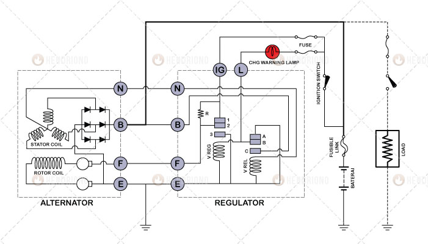
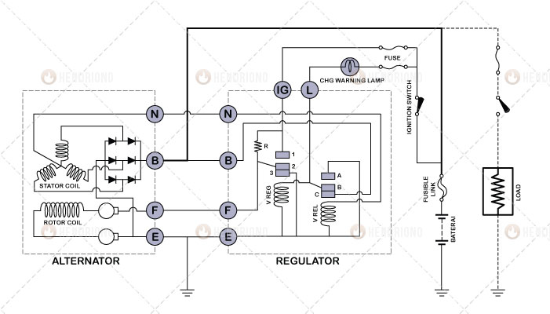

title: Prinsip Kerja Regulator Mekanik
description: Regulator mekanik yang digunakan pada sistem pengisian kendaraan menggunakan prinsip sederhana, yang bekerja untuk memantau kenaikan tegangan dan memanfaatkannya untuk membetuk sifat kemagnetan yang dapat mengatur posisi kontak poin.
hero: Prinsip Kerja Regulator Mekanik
disqus: 

# Prinsip Kerja Regulator Mekanik - Alternator

Sistem Pengisian atau *Charging System* pada mobil sangat berperan penting, selain berfungsi untuk mengisi kembali baterai setelah digunakan oleh beberapa komponen kelistrikan juga berfungsi untuk mengambil alih fungsi baterai pada saat mesin mencapai kecepatan tertentu. Namun, alternator tidak konstan dalam menghasilkan tegangan, karena besarnya tegangan yang dihasilkan alternator terpengaruhi oleh kecepatan putaran mesin. Semakin cepat putaran mesin, semakin besar tegangan yang dihasilkan dan demikian sebaliknya. Selain itu, besar kecilnya tegangan/arus yang dihasilkan oleh alternator berpengaruh terhadap proses pengisian baterai. Jangan sampai baterai kehabisan muatan karena alternator tidak mampu mengisi dengan sempurna.

***

## Regulator Alternator

Banyak faktor yang mempengaruhi kestabilan alternator dalam menghasilkan energi listrik, salah satunya adalah regulator. Regulator berperan mengatur besar kecilnya energi listrik yang dihasilkan oleh alternator melalui pengaturan besar kecilnya tegangan dari baterai yang masuk kedalam rotor. Ada dua jenis Regulator yang terdapat pada mobil yaitu Regulator Mekanik (*Mechanical Regulator*) dan Regulator Elektronik (*Electronic Regulator* atau *IC Regulator*), namun pada artikel ini hanya akan dibahas tentang Regulator Mekanik.

Secara umum regulator memang digunakan untuk mengatur kestabilan tegangan yang dihasilkan oleh alternator, namun secara spesifik, regulator mengatur kekuatan medan magnet yang dihasilkan oleh rotor. Ketika putaran mesin tinggi maka regulator menurunkan tegangan yang masuk kedalam rotor, sehingga kekuatan kemagnetan rotor menurun. Ketika putaran mesin rendah, regulator memberikan tegangan penuh kedalam rotor, sehingga kekuatan kemagnetan rotor besar. Bagaimana regulator mengatur besar kecilnya tegangan dari baterai yang masuk kedalam rotor?

***

## 1. Mesin Mati

Perhatikan Gambar 1. Pada saat mesin mati dan kunci kontak OFF, titik kontak (contact point) A berhubungan dengan titik kontak B pada Voltage Relay. Sedangkah pada Voltage Regulator, titik kontak 1 berhubungan dengan titik kontak 2. Tegangan belum mengalir ke Regulator, namun pada terminal B Alternator terdapat tegangan yang berasal dari Baterai. Tegangan dari baterai hanya sampai pada terminal B karena tertahan oleh Diode. Saat keadaan seperti ini Diode Rectifier berfungsi untuk melindungi lilitan stator (Stator Coil) terhadap arus balik yang berasal dari Baterai. Hal ini karena Diode adalah pintu satu arah yang hanya bisa mengalirkan salah satu jenis tegangan. Makanya, apabila terjadi kerusakan pada Diode (terutama short circuit) baterai akan cepat habis karena tegangan masuk kedalam lilitan stator, bahkan dalam kondisi tertentu bisa saja lilitan stator terbakar, namun kejadian terbakarnya lilitan stator jarang sekali terjadi.

*Gambar 1. Mesin Mati dan Kunci Kontak OFF*

***

## 2. Mesin Mati Kunci Kontak ON

Perhatikan Gambar 2. Pada saat mesin belum dihidupkan dan kunci kontak di putar ke posisi ON, maka tegangan mengalir dari baterai menuju kunci kontak dan mengalir melewati 2 fuse (sekring). 1 fuse digunakan sebagai pengaman terminal IG dan 1 fuse lagi digunakan sebagai pengaman terminal L.

*Gambar 2. Mesin Mati Kunci Kontak ON*

Arus mengalir melalui dua saluran yaitu:

### A. Arus ke Lampu CHG (Charger Warning Lamp)

{==

Terminal (+) Baterai --> Fusible Link --> Kunci Kontak (Ignition Switch) --> Fuse --> Lampu CHG --> Terminal L --> Titik Kontak B --> Titik Kontak A --> Terminal E Regulator --> Massa Bodi

==}

Maka Lampu CHG (*Charger Warning Lamp*) menyala yang menandakan bahwa alternator belum menghasilkan tegangan. Jika saat kita berkendara dan tiba-tiba lampu CHG menyala, segera perbaiki karena lampu CHG yang menyala menandakan alterator tidak menghasilkan tegangan. Jika terus digunakan maka muatan baterai akan habis dan mesin pun berhenti bekerja.

### B. Arus ke Rotor Coil

{==

Terminal (+) Baterai --> Fusible Link --> Kunci Kontak (Ignition Switch) --> Fuse --> Terminal IG --> Titik Kontak 1 --> Titik Kontak 2 --> Terminal F Regulator --> Terminal F Alternator --> Brush --> Slip Ring --> Rotor Coil --> Slip Ring --> Brush --> Terminal E Alternator --> Massa Bodi

==}

Maka pada Rotor Coil akan terbentuk medan magnet. Kemagnetan yang terbentuk pada lilitan rotor masih besar karena titik kontak 1 masih berhubungan langsung dengan titik kontak 2. Sampai disini alternator belum menghasilkan tegangan karena kemagnetan yang terbentuk pada lilitan rotor belum diputar oleh mesin sehingga belum terjadi induksi pada lilitan stator.

***

## 3. Mesin Hidup Putaran Idle

Perhatikan Gambar 3. Pada saat mesin hidup, maka lilitan rotor sebagai medan magnet berputar diantara lilitan stator. Pada lilitan stator terjadi induksi sehingga dari setiap ujung-ujung lilitan stator menghasilkan GGL (Gaya Gerak Listrik atau Electromotive Force). Arus yang dihasilkan dari 3 ujung lilitan stator kemudian di searahkan (arus diubah dari AC menjadi DC) oleh diode rectifier dan keluar melalui terminal B. Arus dari terminal B inilah yang kemudian digunakan untuk mengisi baterai atau digunakan secara langsung oleh Load (beban kelistrikan kendaraan).

*Gambar 3. Mesin Hidup Putaran Idle*

Perhatikan aliran tegangan dari Alternator berikut ini:

### A. Tegangan Netral

Tegangan netral adalah tegangan yang bernilai setengah jika diambil dari dari setiap 3 ujung lilitan stator. Tegangan ini hanya digunakan untuk mengisi lilitan voltage relay pada regulator. Perhatikan aliran tegangan dibawah ini:

{==

Terminal N Alternator --> Terminal N Regulator --> Voltage Relay --> Massa Bodi

==}

Maka pada lilitan voltage relay akan terbentuk kemagnetan. Kemagnetan yang terbentuk pada lilitan voltage relay digunakan untuk menarik titik kontak B. Sehingga titik kontak B terlepas dari titik kontak A dan kemudian berhubungan dengan titik kontak C. Ketika titik kontak B terlepas dari titik kontak A maka Lampu CHG (dari terminal L) akan kehilangan massa bodi, hal ini menyebabkan lampu CHG padam. Sedangkan titik kontak B berhubungan dengan titik kontak C yang berasal dari terminal B alternator. Tegangan yang berasal terminal B regulator kemudian masuk ke dalam lilitan voltage regulator maka pada lilitan voltage regulator terbentuk kemagnetan. Tegangan dari B alternator yang mengisi kedalam lilitan voltage regulator mengalami perubahan sesuai dengan putaran mesin, sehingga sifat kemagnetan yang terbentuk pada lilitan voltage relay pun akan berubah.
Sampai disinilah voltage relay bekerja. Voltage relay akan tetap dalam kondisi seperti ini selama mesin berjalan, baik dalam putaran idle, putaran menengah, hingga putaran tinggi. Sehingga dalam penjelasan berikutnya, voltage relay tidak akan dibahas lagi. Sederhananya, voltage relay digunakan untuk mengatur menyala dan padamnya lampu CHG, serta mengaktifkan kemagnetan didalam lilitan voltage regulator dengan cara menghubungan ujung lilitan voltage regulator dengan terminal B yang berasal dari alternator.

### B. Tegangan Yang Keluar (Output Voltage)

Ketika terjadi induksi pada lilitan stator maka pada setiap ujung lilitan stator menghasilkan arus begitupun pada terminal N (Netral). 3 ujung lilitan stator menghasilkan arus dengan jenis arus AC, dan kemudian disearahkan oleh diode rectifier. Dari setiap 3 buah diode rectifier disatukan dalam satu ujung, ujung keluaran yang menuju ke terminal B dan ujung keluaran yang menuju ke terminal E. Terminal E kemudian disatukan dengan massa bodi kendaraan, sedangkan terminal B kemudian dialirkan menuju ke dua saluran, yaitu:

#### 1. Ke Baterai

{==

Lilitan Stator --> Diode Rectifier --> Terminal B Alternator --> Terminal (+) Baterai

==}

Maka terjadi proses pengisian (charge) pada baterai. (Mengenai proses elektrolisa pengisian pada baterai akan dibahas pada artikel terpisah)

#### 2. Ke Regulator

{==

Lilitan Stator --> Diode Rectifier --> Terminal B Alternator --> Terminal B Regulator --> Voltage Regulator (melalui pertemuan titik kontak B dengan titik kontak C) --> Terminal E Regulator --> Massa Bodi

==}

Lilitan Voltage Regulator mendapat tegangan dari terminal B alternator maka terbentuk kemagnetan pada lilitan. Namun sifat kemagnetan lilitan voltage regulator belum mampu menarik titik kontak 2 untuk terlepas dari titik kontak 1, hal ini karena mesin masih berputar lambat (idle).

***

## 4. Putaran Idle ke Putaran Menengah

Perhatikan Gambar 4. Dari mulai putaran idle, putaran menengah hingga ke putaran tinggi, bahasan terkonsentrasi pada voltage regulator. Tegangan yang dikeluarkan alternator melalui terminal B kemudian masuk kedalam regulator melalui terimal B regulator dan mengisi lilitan voltage regulator. Arus medan (field current) yang ke rotor dikontrol dan disesuaikan dengan tegangan yang dikeluarkan terminal B yang beraksi pada voltage regulator. Pengaturan besar arus medan (untuk pembentukan magnet) yang masuk ke dalam rotor diatur dengan arus yang melewati resistor (R) atau langsung tanpa melewati resistor. Arus akan melewati resistor atau tidak melewati resistor tergantung posisi titik kontak 2.

*Gambar 4. Putaran Idle ke Putaran Menengah*

### Arus Yang Ke Rotor Coil

{==

Terminal B Alternator --> Ignition Switch --> Fuse --> Terminal IG Regulator --> Titik Kontak 1 --> Titik Kontak 2 --> Resistor --> Terminal F Regulator --> Terminal F Alternator --> Rotor Coil --> Terminal E Alternator --> Massa Bodi

==}

Dalam hal ini arus yang akan masuk kedalam rotor coil bisa melalui 2 saluran yang saling bergantian, yaitu:

* Bila kemagnetan yang terbentuk didalam Voltage Regulator besar, akan mampu menarik titik kontak 2 terlepas dari titik kontak 1, maka arus yang akan ke rotor coil harus melewati resistor (R). Akibatnya arus yang mengalir menuju ke rotor coil akan mengecil (berkurang karena terhambat resistor) dan kemagnetan yang ditimbulkan rotor coil pun mengecil (berkurang).
* Sedangkan jika kemagnetan pada voltage regulator lemah, titik kontak 2 tidak akan tertarik dari titik kontak 1, maka arus yang akan ke rotor coil tidak akan melewati resitor karena titik kontak 2 berhubungan dengan titik kontak 1, sehingga kemagnetan pada rotor coil akan normal kembali.

Pergantian saluran ini terus berlangsung jika mesin berputar dalam putaran idle ke menengah atau mesin bertahan pada putaran menengah.

***

## 5. Putaran Menengah ke Putaran Tinggi

Perhatikan Gambar 5. Jika putaran mesin bertambah maka arus yang dihasilkan oleh stator coil pun akan bertambah, dan sifat kemagnetan pada voltage regulator menjadi lebih kuat. Dengan sifat kemagnetan yang lebih kuat pada voltage regulator membuat arus medan yang ke rotor coil akan mengalir terputus-putus (intermittenly). Hal ini terjadi karena titik kontak 2 dari voltage regulator kadang-kadang berhubungan dengan titik kontak 3 (yang menuju ke massa bodi). Walaupun titik kontak 2 kadang berhubungan dengan titik kontak 3 pada voltage regulator, namun titik kontak B pada voltage relay tidak akan terlepas dari titik kontak C, karena tegangan N (Netral) terpelihara dalam sisa flux dari rotor.

*Gambar 5. Putaran Menengah ke Putaran Tinggi*

### Pembatasan dan Kehilangan Arus Medan

Pada saat mesin mencapai putaran tinggi, maka arus yang akan masuk kedalam rotor coil sebagian akan dibuang untuk membatasi arus medan. Dalam hal ini arus yang akan masuk kedalam rotor coil bisa saja dialirkan dan atau dibuang. Proses pengaliran dan pembuangan arus medan terjadi secara bergantian, dengan rincian aliran sebagai berikut:

#### 1. Pembatasan Arus Medan

Pembatasan arus medan dilakukan oleh Resistor, hal ini terjadi karena titik kontak 2 tertarik oleh kemagnetan yang cukup besar dari voltage regulator seiring dengan pertambahan putaran mesin, hingga terlepas dari titik kontak 1. Namun titik kontak 2 belum berhubungan dengan titik kontak 3 (titik kontak 2 mengambang diantara titik kontak 1 dan titik kontak 3). Arus yang berasal dari terminal IG regulator menuju rotor coil akan tertahan oleh Resistor. 

Perhatikan aliran arus medan dibawah ini:

{==

Terminal B Alternator --> Ignition Switch --> Fuse --> Terminal IG Regulator --> Resistor (R) --> Terminal F Regulator --> Terminal F Alternator --> Rotor Coil --> Terminal E Alternator --> Massa Bodi

==}

#### 2. Pembuangan Arus Medan

Pada saat arus yang dihasilkan terminal B alternator bertambah lebih besar lagi seiring dengan pertambahan putaran mesin, maka sifat kemagnetan pada voltage regulator semakin kuat, hingga mampu menarik titik kontak 2 berhubungan titik kontak 3. Saat titik kontak 2 berhubungan dengan titik kontak 3 maka arus yang melewati Resistor akan dibuang ke massa bodi tanpa dialirkan kedalam rotor coil. 

Perhatikan aliran arus medan dibawah ini:

{==

Terminal B Alternator --> Ignition Switch --> Fuse --> Terminal IG Regulator --> Resistor (R) --> Titik Kontak 2 --> Titik Kontak 3 --> Terminal E Regulator --> Massa Bodi

==}

Ketika arus medan rotor ini dibuang ke massa, maka hilang kemagnetan pada rotor coil. Ketika kemagnetan menghilang maka tegangan yang dihasilkan stator coil akan turun drastis, ketika terjadi penurunan tegangan maka sifat kemagnetan pada voltage regulator akan menghilang. Kehilangan sifat kemagnetan membuat kontak 2 akan kembali ke posisi semula (ke kontak 1), namun baru saja lepas dari kontak 3, tegangan sudah dihasilkan lagi oleh stator coil. Ketika putaran mesin tinggi, kejadian putus sambung antara kontak 2 dengan kontak 3 terus berlangsung. Hal ini tentu akan menjaga kenaikan/lonjakan tegangan listrik dari stator coil yang melebihi kemampuan sistem kelistrikan.

***

## Kesimpulan

Pada dasarnya regulator apapun jenisnya, baik mekanik maupun elektronik mempunya tugas untuk membatasi, menjaga, menstabilkan tegangan listrik yang dihasilkan oleh generator listrik. Hal ini karena kemampuan baterai dan komponen kelistrikan otomotif lainnya telah dibatasi kemampuannya dalam menerima tegangan listrik. Secara umum, kemampuan baterai dan komponen sistem kelistrikan otomotif hanya mampu menerima tegangan maksimal sebesar 15 Volt.

Salam hangat dari Banjarsari - Ciamis - Jawa Barat - Indonesia - Bumi - Galaksi Bima Sakti...

***

<small>Artikel diperbarui pada: {{ git_revision_date_localized }}</small>