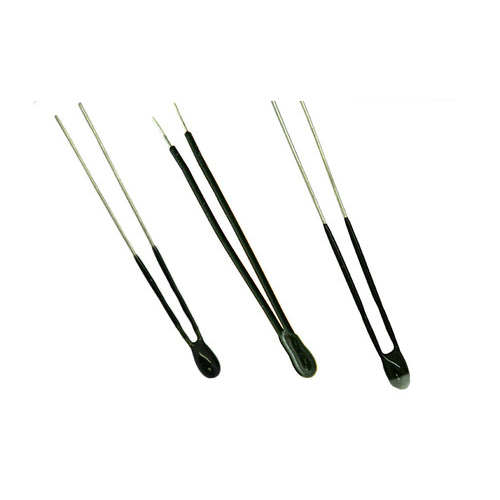
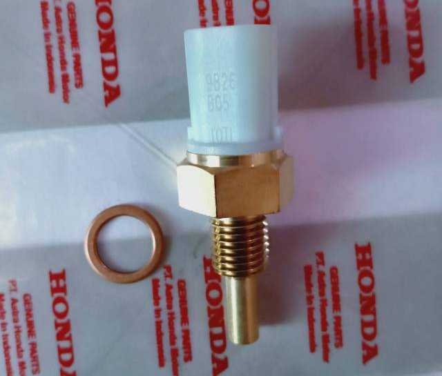
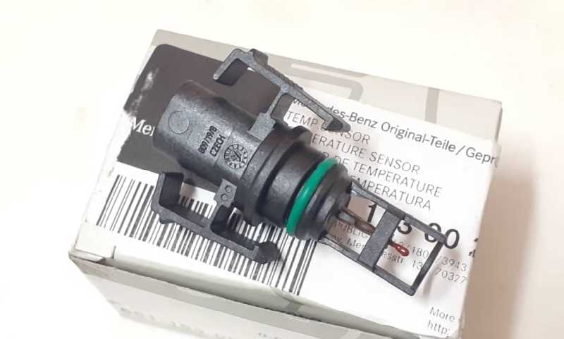
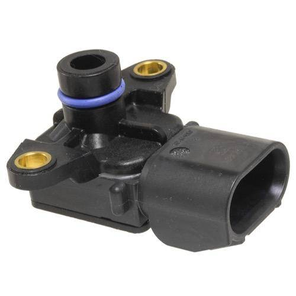
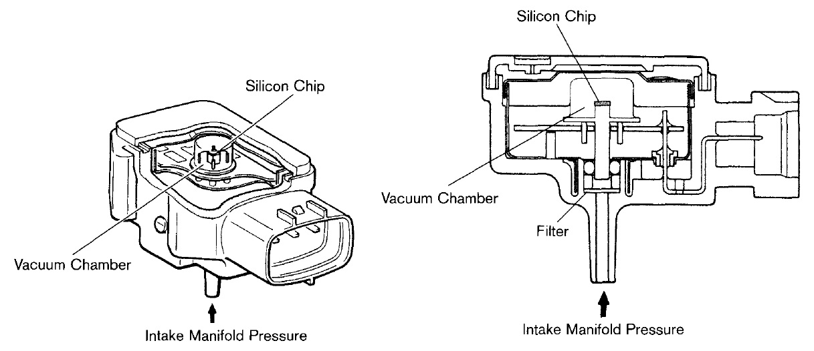
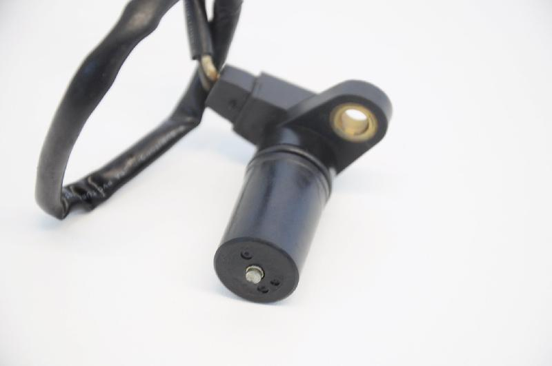
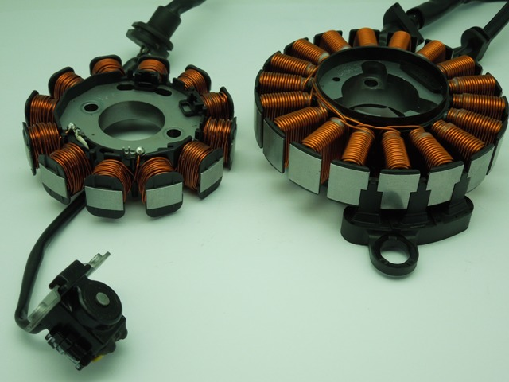
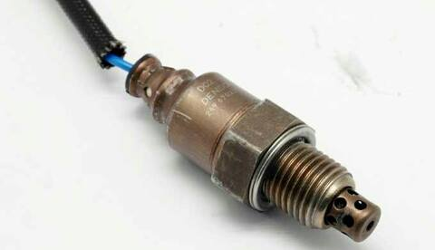
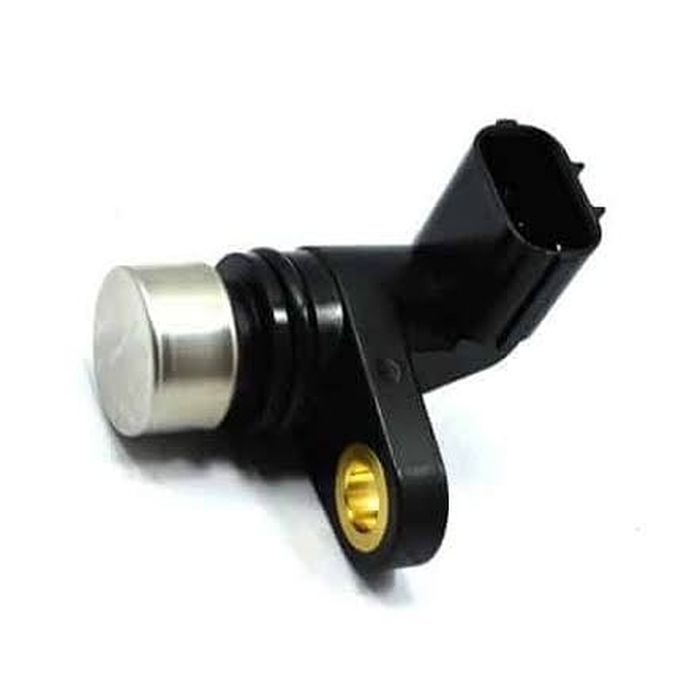
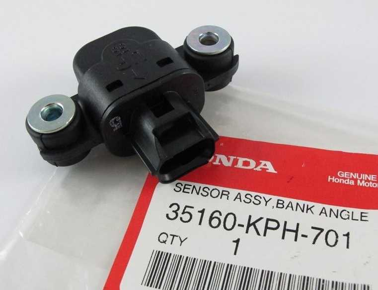

title: Sensor Honda PGM-FI
description: Sensor pada sistem injeksi berfungsi memberikan informasi atau data ke modul pengendali sebagai masukan yang kemudian akan diproses menjadi suatu kondisi yang harus dilakukan oleh aktuator.
hero: Sensor Honda PGM-FI
disqus: 

# Sensor Sistem Injeksi Bahan Bakar

Sensor pada sistem injeksi bahan bakar berfungsi memberikan informasi atau data ke module pengendali (Electronic Control Module atau ECM) sebagai masukan yang kemudian akan diproses menjadi suatu kondisi yang harus dilakukan oleh aktuator. Sensor bekerja layaknya panca indera pada makhluk hidup yang hanya bisa menerima perubahan apa saja dan kemudian mengirimkannya ke bagian pemroses data (ECM). 
Perubahan nilai pada sensor-sensor sistem injeksi akan digunakan sebagai masukan bagi ECM untuk melakukan perhitungan ulang dan hasil perhitungan ini akan digunakan untuk menyesuaikan beberapa hal, diantaranya:

1. Jumlah penginjeksian bahan bakar pada ruang bakar
2. Waktu pembakaran atau waktu percikan bunga api pada busi
3. Mengubah *duty cycle PWM* ke pompa injeksi
4. Mengatur posisi katup FISV (Fast Idle Solenoid Valve) atau IACV (Idle Air Control Valve)

Setiap terjadi kegagalan fungsi pada sensor maka ECM akan mengeluarkan peringatan pada dashboard melalui [pola kedipan MIL](mil-pgmfi.md). Dibawah ini beberapa sensor yang digunakan pada sistem injeksi bahan bakar yang ada pada sepeda motor Honda berteknologi PGM-FI.

***

## Temperature Sensor

Sensor temperatur yang digunakan sistem injeksi bahan bakar menggunakan komponen elektronika yang bernama **thermistor**, yang merupakan *solid-state variable resistor* terbuat dari bahan semiconductor. Prinsip dasar dari thermistor adalah perubahan nilai tahanan (atau hambatan atau werstan atau resistance) jika suhu atau temperatur yang mengenai thermistor ini berubah. Thermistor ini merupakan gabungan antara kata *thermo (suhu)* dan *resistor*.
Thermistor ditemukan oleh [*Samuel Ruben*][6] pada tahun 1930, dan mendapat hak paten di Amerika Serikat dengan nomor #2.021.491. Ada dua macam termistor secara umum, yaitu: **PTC (Positive Temperature Coefficient)**, dan **NTC (Negative Temperature Coefficient)**. Nilai tahanan pada PTC akan bertambah jika suhu yang mengenainya naik (nilai tahanan berbanding lurus terhadap temperatur). Sedangkan NTC adalah thermistor yang nilai tahanannya berkurang bila temperatur yang mengenainya naik (nilai tahanan berbanding terbalik terhadap temperatur).
Sedangkan thermistor yang digunakan sebagai sensor temperatur pada sistem injeksi adalah tipe NTC atau Negative Temperature Coefficient yang nilai tahanannya akan terus berkurang hingga mendekati 0 ohm jika temperatur yang mengenai thermistor mengalami kenaikan.

*Gambar 1. Bentuk Umum Thermistor*

Sensor temperatur akan mendeteksi perubahan temperatur yang kemudian akan diterima oleh ECM untuk mengatur beberapa hal, diantaranya:

1. Mengatur campuran udara dan bahan bakar
2. Mengatur waktu pembakaran (percikan bunga api pada busi)
3. Mengatur putaran idle pada saat mesin dingin
4. Mengaktifkan fungsi start dingin (pada beberapa tipe untuk mengatur FISV atau IACV)

***

### Engine Oil/Coolant Temperature Sensor

Engine Oil Temperatur Sensor sering disingkat menjadi EOT, sedangkan Engine Coolant Temperature Sensor sering disingkat ECT, kedua nama ini menggunakan bahan yang sama yaitu thermistor tipe NTC yang berubah namanya menjadi EOT atau ECT sesuai dengan lokasi suhu yang di baca pada mesin. Nama EOT digunakan jika menggunakan sistem pendinginan udara, sehingga lokasi sensor diletakan pada bagian saluran oli mesinnya. Perubahan oli mesin akan dibaca oleh sensor EOT dan di kirim ke ECM. Sedangkan nama ECT digunakan jika sistem pendinginan yang digunakan adalah sistem pendinginan air. Sensor ECT di tempatkan pada saluran air pendinginan mesin. Perubahan suhu air pendingin akan dibaca oleh sensor ECT dan dikirimkan ke ECM. Baik ECT maupun EOT memiliki bentuk sensor yang hampir sama, bahkan pada beberapa tipe bisa saling bertukar sensor.

*Gambar 2. Bentuk Sensor EOT ECT*

Secara sederhana sensor ECT dan EOT berfungsi untuk mendeteksi perubahan suhu mesin. Perubahan suhu mesin tersebut akan mempengaruhi nilai tahanan thermistor, dan jika nilai tahan berubah maka terjadi perubahan sinyal elektrik yang akan diterima oleh ECM. ECM sebagai pengolah data akan memproses perubahan sinyal elektrik tersebut sebagai tegangan yang berubah-ubah. Perubahan tegangan ini akan digunakan oleh ECM untuk menyesuaikan jumlah penginjeksian bahan bakar dan waktu pembakaran (percikan bunga api busi).

***

### Intake Air Temperatur Sensor

Intake Air Temperatur Sensor atau disingkat IAT berfungsi untuk memonitor suhu udara yang masuk ke mesin. Modul pengendali (ECM) membutuhkan informasi ini untuk memperkirakan kerapatan udara sehingga dapat menyeimbangkan campuran udara dan bahan bakar. Udara yang lebih dingin itu lebih padat daripada udara panas, sehingga udara dingin membutuhkan lebih banyak bahan bakar untuk menjaga rasio udara dan bahan bakar yang tepat. ECM mengubah rasio udara dan bahan bakar dengan mengubah durasi (tepat waktu) pulsa injektor.

*Gambar 3. Bentuk Intake Air Temperatur Sensor*

!!! failure "Perhatian!"

	Gambar diatas bukanlah gambar yang diambil dari sepeda motor Honda berteknologi PGM-FI. Gambar diatas diambil dari sistem injeksi pada mobil. Hal ini untuk mempermudah pemahaman tentang sensor IAT.

Sensor IAT menggunakan bahan yang sama dengan ECT dan EOT yaitu thermistor dengan tipe NTC. Itu berarti sensor IAT memiliki prinsip kerja yang sama dengan ECT dan EOT hanya saja tujuan dipasangnya sensor IAT berhubungan erat dengan perbandingan udara dan bahan bakar. Perubahan tegangan dari IAT yang diterima ECM akan digunakan untuk menyesuaikan durasi pulsa injektor. Semakin lama durasi pulsa injektor semakin banyak bahan bakar yang dikeluarkan oleh injektor.

!!! info "Perhatian!"

	Tidak semua sepeda motor Honda PGM-FI memiliki sensor IAT, hanya ada beberapa tipe saja. Lokasi pemasangan IAT biasanya terintegrasi dengan sensor MAP dan sensor TP.

***

## Throttle Position Sensor

Throttle Position Sensor sering disingkat TP atau TPS. Throttle Position Sensor berfungsi untuk mendeteksi perubahan sudut pembukaan throttle valve. Sensor TP dipasang pada sumbu poros throttle valve sehingga mudah untuk mencari lokasi pemasangannya. Sensor TP masih tetap menggunakan jenis resistor dengan tipe *variable resistor*, yang nilai tahanannya akan berubah sesuai dengan perubahan posisi pada resistor tersebut. Ketika throttle valve berubah posisi bukaannya maka berubah pula nilai tahanan pada sensor TP. Pada saat throttle valve tertutup penuh sensor TP memiliki nilai tahanan besar, sedangkan ketika throttle valve terbuka penuh sensor TP memiliki tahanan kecil dan hampir 0 ohm. Jika dibaca dari sisi sinyal elektrik yang akan diterima ECM, pada saat throttle valve tertutup penuh maka sensor TP akan mengeluarkan tegangan pada kisaran 0,5 Volt, sedangkan ketika throttle valve terbuka penuh maka sensor TP akan mengeluarkan tegangan pada kisaran 4,7 Volt.

*Gambar 4. Bentuk Throttle Position Sensor*

Sensor posisi throttle (TPS) adalah bagian dari sistem manajemen bahan bakar, dan membantu memastikan bahwa campuran udara dan bahan bakar yang tepat disalurkan ke ruang bakar mesin. TPS memberikan sinyal langsung ke sistem injeksi bahan bakar mengenai kebutuhan daya yang harus dihasilkan oleh mesin. Sinyal TPS terus-menerus diukur dan dihitung berkali-kali per detik dengan data lain seperti suhu udara, putaran mesin, jumlah aliran udara, dan seberapa cepat posisi throttle berubah. Data ini menentukan dengan tepat berapa banyak bahan bakar yang harus diinjeksikan ke ruang bakar pada saat tertentu. Jika sensor TP dan sensor lainnya melakukan tugasnya dengan benar, mesin akan berakselerasi dengan mulus dan efisien, dengan tetap menjaga penghematan bahan bakar yang optimal.

***

## Manifold Absolute Pressure Sensor

Manifold Absolute Pressure atau MAP. Penamaan Manifold Absolute Pressure lebih cocok digunakan dibandingkan menggunakan nama *Intake Vacuum Sensor*, karena MAP digunakan untuk mengukur tekanan (atau kekurang-tekanan) di dalam intake manifold. Atau bisa didefiniskan bahwa MAP berfungsi untuk mendeteksi perubahan tekanan didalam intake manifold. Sensor MAP merupakan salah satu sensor penting karena MAP mampu membaca beban mesin. Sensor MAP menghasilkan sinyal yang sebanding dengan jumlah ke-vakum-an di intake manifold. ECM kemudian menggunakan informasi ini untuk menyesuaikan waktu pengapian dan jumlah penyemprotan bahan bakar.

*Gambar 5. Manifold Absolute Pressure Sensor*

!!! failure "Perhatian!"

	Gambar diatas bukanlah gambar yang diambil dari sepeda motor Honda berteknologi PGM-FI. Gambar diatas diambil dari sistem injeksi pada mobil. Hal ini untuk mempermudah pemahaman tentang sensor MAP.

Saat mesin bekerja berat, ke-vakum-an pada intake manifold menurun karena katup throttle terbuka lebar (WOT; Wide Open Throttle). Mesin menghisap lebih banyak udara, yang membutuhkan lebih banyak bahan bakar untuk menjaga keseimbangan perbandingan udara dan bahan bakar. Ketika ECM membaca sinyal beban berat dari sensor MAP, biasanya hal itu membuat campuran bahan bakar menjadi sedikit lebih kaya dari biasanya sehingga mesin dapat menghasilkan tenaga yang lebih besar. Pada saat yang bersamaan, ECM akan sedikit memperlambat waktu pengapian (back off) untuk mencegah terjadinya detonasi (spark knock) yang dapat merusak mesin dan mengganggu performa.

Ketika kondisi berubah, kendaraan melaju di bawah beban ringan dan melambat, maka sedikit tenaga mesin yang dibutuhkan. Katup throttle tidak terbuka sangat lebar atau mungkin tertutup menyebabkan kevakuman di intake manifold meningkat. Sensor MAP mendeteksi hal ini dan ECM merespon dengan mengurangi campuran udara dan bahan bakar untuk mengurangi konsumsi bahan bakar dan mengatur ulang waktu pengapian untuk menghasilkan tenaga mesin yang ekonomis bahan bakar.

*Gambar 6. Piezo Resistive*

Sensor MAP terbuat dari bahan Piezo Resistive. Piezo Resistive adalah bahan yang nilai tahanannya berubah tergantung dari perubahan bentuknya. Piezo Resistive dibuat sebagai silicon diaphragm (diafragma silikon) yang berfungsi sebagai membran penyekat antara ruang vakum sebagai referensi dengan ruangan yang berhubungan dengan intake manifold. Perbedaan tekanan antara ruang vakum dengan intake manifold berakibat perubahan lengkungan pada membran. Pengolah sinyal merubah lengkungan pada membran menjadi sinyal dan ECM menerima perubahan sinyal tersebut sebagai tegangan yang berubah-ubah.

***

## Crankshaft/Camshaft Position Sensor

Crankshaft Position Sensor atau disingkat CKP berfungsi untuk memantau posisi dan kecepatan rotasi dari poros engkol. Sedangkan Camshaft Position Sensor atau disingkat CMP berfungsi untuk memantau posisi katup pada mesin. CKP dapat dikombinasikan dengan CKP yang digunakan untuk memantau hubungan antara piston dan katup di mesin, hal ini sangat penting pada mesin-mesin yang menggunakan teknologi "Variable Valve Timing" (pengaturan waktu katup variabel). Metode ini juga digunakan untuk mensinkronkan mesin empat langkah saat dihidupkan, memungkinkan ECM mengetahui kapan harus menginjeksikan bahan bakar. CKP juga biasanya digunakan sebagai sensor utama untuk pengukuran kecepatan mesin dalam putaran per menit (Revolution Per Minute atau RPM).

*Gambar 7. Reluctor CKP dan CMP*

Sensor CKP yang umum digunakan pada Sepeda Motor Honda terdiri dari dua jenis, yaitu:

1. Tipe **Magnetic Pickup** atau sering di sebut Reluctor. Tipe ini biasanya digunakan pada sepeda motor injeksi yang masih menggunakan [sistem starter dengan motor listrik tipe *brush*](starter-sepeda-motor.md). Sensor jenis ini menggunakan prinsip induksi medan magnet yang menghasilkan sinyal listrik atau tegangan. Sensornya terdiri dari 2 kabel yang terhubung langsung dengan ECM. Sensor tipe ini juga yang paling sering digunakan pada sensor CMP dan VSS.
2. Tipe **Hall Effect**. Tipe ini biasanya digunakan pada sepeda motor injeksi yang sudah menggunakan sistem starter dengan motor listrik tipe *brushlesss* (Honda menyebutnya ACG). Sensor jenis ini masih tetap menggunakan prinsip kemagnetan, hanya saja perubahan kemagnetan yang diterima oleh sensor akan diubah langsung menjadi sinyal digital. Sehingga ECM tidak lagi membutuhkan sistem pengubah analog ke digital. Sensor tipe Hall Effect memiliki 3 kabel yang terhubung langsung ke ECM. Dan terkadang, sensor tipe ini juga digunakan pada sensor CMP.

*Gambar 8. Sensor CKP Tipe Reluctor (Kiri) dan Hall Effect (Kanan)*

***

## Oxygen Sensor

Oxygen Sensor atau dalam bahasa sehari-hari sering disebut 0~2~ Sensor berfungsi untuk memperbaiki campuran udara dan bahan bakar dengan membandingkan jumlah oksigen yang terkandung didalam gas buang dengan oksigen di udara luar. Sensor oksigen sebenarnya tidak mengukur konsentrasi oksigen, melainkan memantau perbedaan antara jumlah oksigen dalam gas buang dan jumlah oksigen di udara bebas. Campuran yang kaya menyebabkan kebutuhan oksigen meningkat. Permintaan ini menyebabkan tegangan sensor meningkat, karena mengalirnya ion oksigen melalui lapisan sensor. Campuran miskin menyebabkan tegangan rendah, karena jumlah oksigen berlebihan.

*Gambar 9. Oxygen Sensor*

Sensor oksigen bekerja dengan menghasilkan tegangan sendiri saat menjadi panas (sekitar 600°F atau sekitar 400°C). Sensor oksigen terbuat dari bahan Zirconium Dioxide (ZrO~2~) dan elektroda platina. Di ujung sensor oksigen yang dihubungkan ke exhaust manifold adalah bola keramik zirkonium. Bagian dalam dan luar bola dilapisi dengan lapisan platinum berpori, yang berfungsi sebagai elektroda. Bagian dalam bola dikosongkan yang secara internal melewati badan sensor dan terhubung ke atmosfer luar. Ketika bagian luar bola sensor terkena gas panas dari exhaust manifold, perbedaan kadar oksigen antara sensor bola dan atmosfer luar di dalam sensor menyebabkan tegangan mengalir melalui bola. Jika rasio bahan bakar miskin (tidak cukup bahan bakar di dalam campuran), tegangan relatif rendah - sekitar 0,1 volt. Jika rasio bahan bakar kaya (terlalu banyak bahan bakar di dalam campuran), voltase relatif tinggi - sekitar 0,9 volt. Ketika campuran udara dan bahan bakar berada pada rasio stoikiometri (14,7 bagian udara dengan 1 bagian bahan bakar), sensor oksigen menghasilkan 0,45 volt.

***

## Vehicle Speed Sensor

VS atau Vehicle Speed Sensor merupakan sensor kecepatan roda atau sensor kecepatan kendaraan dengan jenis tachometer. VS berfungsi sebagai perangkat pengirim data yang digunakan untuk membaca kecepatan putaran roda kendaraan.

Sensor VS awalnya digunakan untuk mengganti hubungan mekanis dari roda ke speedometer, menghilangkan kerusakan kabel mekanis dan menyederhanakan konstruksi pengukur kecepatan (menghilangkan semua bagian yang bergerak). Dengan hadirnya alat bantu mengemudi otomatis, seperti ABS (Antilock Braking System), sensor tersebut juga memberikan data kecepatan roda kepada module pengontrol untuk membantu aktuator dalam mempertahankan kendali kendaraan. Sensor VS juga digunakan dalam hal penghematan bahan bakar. Sinyal yang dikirimkan oleh sensor VS akan diolah oleh ECM sebagai data dalam menentukan perhitungan jumlah campuran udara dan bahan bakar sesuai dengan tingkat percepatan kendaraan. Pada beberapa tipe kendaraan yang menggunakan teknologi ISS (Idle Stop System), sinyal yang dikirimkan oleh sensor VS digunakan oleh ECM untuk menghentikan pasokan bahan bakar ketika kendaraan berhenti sejenak tanpa mematikan kunci kontak.

*Gambar 10. Vehicle Speed Sensor*

VS Sensor menggunakan konstruksi dan prinsip kerja yang hampir sama dengan sensor CKP dan CMP dengan tipe Magnetic Pickup atau Reluctor, namun untuk beberapa tipe (terutama kendaraan dengan teknologi ISS) telah menggunakan tipe Hall Effect Sensor. Pada beberapa tipe kendaraan, VS bukanlah bagian dari sistem injeksi bahan bakar. Sensor VS hanya bagian dari dashboard yang berfungsi sederhana sebagai sensor speedometer.

***

## Bank Angle Sensor

Bank Angle Sensor atau BAS, merupakan sensor sistem injeksi yang fungsinya sama sekali tidak berhubungan dengan kondisi kerja mesin. Bank Angle Sensor berfungsi mengirimkan sinyal kepada ECM agar ECM mematikan mesin saat kendaraan berada pada posisi diam (berhenti) di waktu dan kemiringan tertentu. Pada saat BAS mengirimkan sinyal maka ECM akan menghentikan pasokan bahan bakar yang dikirim oleh fuel pump dan injektor serta menghentikan ignition coil agar tidak menciptakan percikan bunga api pada busi.

*Gambar 11. Bank Angle Sensor*

BAS merupakan sensor keamanan berkendara yang akan aktif dan mengirimkan sinyal ke ECM jika kendaraan dalam keadaan miring (jatuh) dalam waktu tertentu.

BAS menggunakan prinsip kerja pendulum yang memanfaatkan gravitasi bumi. Pendulum dibuat 3/4 lingkaran yang mampu menjaga keseimbangan tegak lurus mengikuti gaya gravitasi atau gaya sentrifugal. BAS ada dua tipe, yaitu:

1. BAS yang menggunakan kontak poin. Ketika pendulum bergerak tegak lurus mengikuti gaya gravitasi sedangkan kendaraan miring hingga derajat tertentu, maka pendulum akan menyentuh kontak poin dan sinyal pun dikirim ke ECM. ECM tidak akan langsung mematikan mesin, tetapi memiliki delay beberapa detik. Jika melebihi waktu tertentu makan kendaraan dianggap jatuh dan mesin pun di matikan oleh ECM.
2. BAS yang menggunakan sensor elektronik. Prinsipnya sebenarnya sama dengan tipe kontak poin, hanya saja ketika pendulum mendekati sirkuit latch-up maka sinyal akan dikirim ke ECM. Pertemuan pendulum dengan sirkuit Latch-Up bukan kontak fisik, hanya melewati dan berada tepat didepannya.

Pada sepeda motor Honda PGM-FI yang memiliki BAS, ECM akan mematikan mesin jika sepeda motor dalam keadaan diam dan dengan kemiringan 55°±5°. Jika ingin menghidupkan sepeda motor setelah fungsi BAS aktif, sepeda motor harus diposisikan tegak dan kunci kontak dimatikan (OFF) terlebih dahulu. Kemudian putar kunci kontak ke posisi ON maka sepeda motor baru dapat dihidupkan.

***

## Daftar Pustaka

* [Bosch Automotive Electrics and Automotive Electronics][1], Springer Nature Switzerland AG
* [Throttle Position Sensing with Linear Hall Sensors Sensors][2],  Infineon Technologies AG
* [Engine Throttle Position Sensor][3], AA1Car website
* Sensor dan Pengolah Sinyal, VEDC Malang
* [Manifold Absolute Pressure MAP Sensors][4], AA1Car website
* [Oxygen Sensors: How to Diagnose and Replace][5], AA1Car website
* [Samuel Ruben][6], Wikipedia
* [Thermistor][7], Wikipedia

[1]: https://link.springer.com/book/10.1007/978-3-658-01784-2
[2]: https://www.infineon.com/dgdl/TLE499x_AppNote_Throttle_Position_Sensing_v1.0.pdf
[3]: https://www.aa1car.com/library/tps_sensors.htm
[4]: https://www.aa1car.com/library/map_sensors.htm
[5]: https://www.aa1car.com/library/o2sensor.htm
[6]: https://en.wikipedia.org/wiki/Samuel_Ruben
[7]: https://en.wikipedia.org/wiki/Thermistor

***

<small>Artikel diperbarui pada: {{ git_revision_date_localized }}</small>