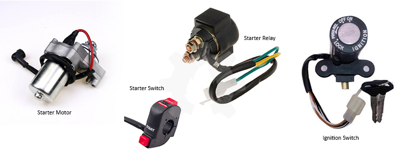
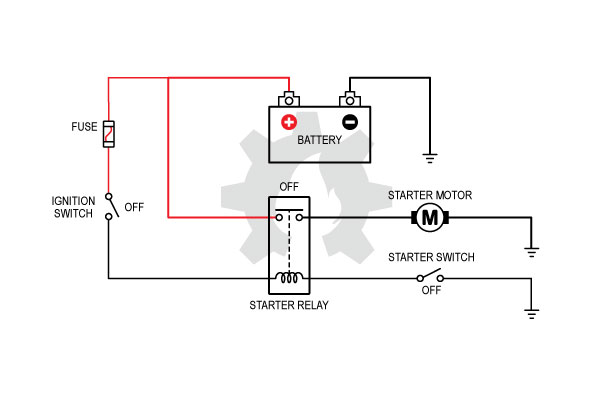
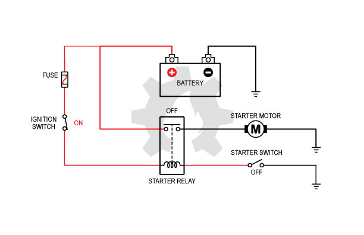
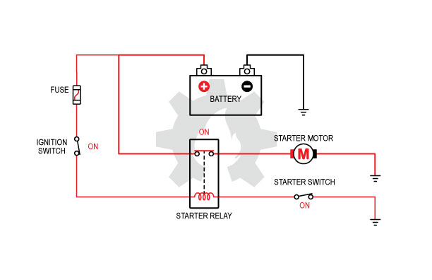

title: Sistem Starter Sepeda Motor
description: Sistem Starter Sepeda Motor menggunakan motor listrik arus searah yang mengubah energi listrik menjadi energi mekanik untuk memberikan gerak mula pada poros engkol.
hero: Sistem Starter Sepeda Motor
disqus: 

# Sistem Starter Sepeda Motor

Sistem Starter Sepeda Motor menggunakan motor listrik arus searah yang mengubah energi listrik menjadi energi mekanik untuk memberikan gerak mula pada poros engkol. Gerak mula pada poros engkol atau crankshaft digunakan untuk menggerakan torak naik ke TMA dan turun ke TMB agar proses isap, kompresi, kerja dan buang bisa dimulai. Tugas Sistem Starter hanya untuk memberikan gerakan awal poros engkol saat memulai menghidupkan mesin.

***

## Sistem Starter Motor Listrik Sepeda Motor

Untuk menghidupkan mesin sepeda motor diperlukan gerakan awal pada poros engkol (*crankshaft*) agar torak bergerak naik turun sehingga mesin dapat memulai siklusnya. Gerakan awal berupa putaran pada poros engkol diberikan oleh Sistem Starter atau Sistem Penggerak Mula. Sistem Starter dibedakan menurut jenis penggerak yang memulai putaran, yaitu: 

1. Sistem starter mekanis; 
2. Sistem starter motor listrik.

Kedua sistem starter ini hampir semuanya dipasang pada berbagai jenis sepeda motor. Dari kedua sistem starter tersebut, jenis penggerak motor listrik merupakan jenis yang paling banyak digunakan oleh pengguna sepeda motor karena penggunaanya yang mudah dan ringan. Sedangkan sistem starter jenis penggerak mekanis atau sering disebut juga dengan *Kick Starter* lebih banyak digunakan sebagai cadangan. *Kick Starter* membutuhkan tenaga yang cukup besar untuk menggerakan poros engkol sehinga digunakan hanya ketika sistem starter motor listrik mengalami gangguan.

***

## Petunjuk Umum Wiring

*Wiring* adalah teknik pengkabelan yang menghubungkan antar komponen kelistrikan untuk membentuk suatu rangkaian kelistrikan. Pada penjelasan berikut akan ditunjukan gambar wiring dengan warna pengkabelan berbeda. Warna merah digunakan untuk menggambarkan kabel yang dialiri tegangan positif baterei. Sedangkan warna hitam digunakan untuk menggambarkan kabel yang terhubung dengan negatif baterei. Hati-hati dalam melihat posisi saklar atau switch baik dalam keadaan OFF (terputus) maupun ON (terhubung).

***

## Komponen Sistem Starter Motor Listrik

Pada gambar berikutnya tertera nama dari masing-masing komponen kelistrikan yang digunakan pada sistem starter motor listrik, diantaranya:

*Gambar 1. Komponen Sistem Starter Sepeda Motor*

1. **Baterei** adalah sumber listrik berarus DC dengan tegangan 12 Volt. Hampir semua komponen kelistrik pada sepeda motor mengambil energi listrik dari baterei. Kapasitas baterei berbeda-beda pada setiap merk dan tipe sepeda motor, yang biasanya disesuaikan dengan kapasitas mesin dan kelengkapan kelistrikan lainnya. Semakin besar energi yang dibutuhkan maka semakin besar kapasitas baterei.
2. **Fuse** atau Sekring adalah komponen pengaman rangkaian kelistrikan saat terjadi short circuit atau hubungan singkat. Ketika terjadi short circuit maka fuse akan memutuskan dirinya sendiri agar komponen dan kabel dalam rangkaian kelistrikan tidak terbakar atau rusak.
3. **Ignition Switch** atau *Main Switch* atau Kunci Kontak adalah sejenis saklar yang digunakan untuk menghubungkan dan memutuskan rangkaian kelistrikan secara keseluruhan menggunakan bantuan anak kunci yang dibuat unik. Hampir semua sistem kelistrikan pada sepeda motor akan mengambil tegangan dari baterei dengan melewati Saklar Utama ini.
4. **Starter Relay** atau *Magnetic Switch* adalah saklar dengan kemampuan daya besar untuk mengalirkan listrik dari baterei menuju ke Motor Starter yang akan terhubung (ON) dan terputus (OFF) dengan teknik picuan kemagnetan. Ada dua bagian didalam Starter Relay yaitu: Selenoid dan Kontak Besar yang dihubungkan oleh plat. Ketika sifat kemagnetan terbentuk pada selenoid maka kontak besar dalam posisi ON, jika sifat kemagnetan menghilang pada selenoid maka kontak besar dalam posisi OFF. *Starter Relay* menggunakan kontak saklar berukuran besar karena konsumsi daya motor listrik yang besar pula. Hal ini untuk memperlambat tingkat keausan kontak saklar akibat panas yang muncul ketika saklar mulai terhubung dan terputus serta untuk memaksimalkan energi listrik yang dialirkan menuju ke Motor Starter.
5. **Motor Starter** adalah motor listrik arus searah yang mengubah energi listrik baterei menjadi energi mekanik untuk menggerakan poros engkol. Motor Listrik ini membutuhkan daya yang besar sehingga kabel dan saklar yang digunakan untuk mengalirkan energi listrik juga harus yang berdaya besar agar motor listrik mampu menghasil putaran yang cepat dan kuat.
6. **Starter Switch** atau Saklar Starter adalah saklar khusus yang digunakan untuk mengaktifkan *Starter Relay*. Pada saat *Starter Switch* dalam posisi terhubung (ON) atau posisi ditekan maka akan terbentuk kemagnetan pada selenoid yang mampu menghubungkan saklar didalam *Magnetic Switch*. Pada saat *Starter Switch* dalam posisi terputus (OFF) maka sifat kemagnetan pada selenoid akan menghilang dan saklar didalam *Magnetic Switch* akan terputus. Starter Switch berperan sebagai saklar pemicu untuk mengatur pembentukan sifat kemagnetan pada selenoid didalam Starter Relay. Starter Switch ditempatkan pada area kemudi yang mudah untuk dijangkau jari tangan.

***

## Pada saat Ignition Switch OFF

Pada saat Ignition Switch atau Kunci Kontak terputus (OFF) maka seluruh sistem kelistrikan dalam keadaan mati termasuk sistem starter.

*Gambar 2. Sistem Starter saat Kunci Kontak OFF*

Aliran listrik positif (Warna Merah):

* Baterei + --> Fuse --> Ignition Switch --> X
* Baterei + --> kontak besar Starter Relay --> X

Tanda **X** berarti tidak berhubungan dengan apapun.

***

## Pada saat Ignition Switch ON

Pada saat Ignition Switch terhubung (ON) maka beberapa sistem kelistrikan mendapat asupan listrik dari baterei, termasuk Starter Relay.

*Gambar 3. Sistem Starter saat Kunci Kontak ON*

Aliran listrik positif (Warna Merah):

* Baterei + --> Fuse --> Ignition Switch --> Lilitan Selenoid Starter Relay --> Starter Switch --> X
* Baterei + --> Kontak Besar Starter Relay --> X

Tanda **X** berarti tidak berhubungan dengan apapun.

Lilitan selenoid pada Starter Relay juga mendapat asupan listrik dari kunci kontak namun karena Starter Switch belum terhubung ke negatif/massa baterei maka belum terbentuk sifat kemagnetan sehingga plat kontak saklar tidak tertarik dan saklar yang besar pun masih dalam keadaan terputus.

***

## Pada saat Starter Switch ON

Pada saat Starter Switch dihubungkan (ON) maka aliran listrik dari selenoid akan diteruskan ke massa dan terbentuklah sifat kemagnetan pada selenoid.

*Gambar 4. Sistem Starter Saat Saklar Starter OFF*

Aliran listrik positif (Warna Merah):

* Baterei + --> Fuse --> Ignition Switch --> Lilitan Selenoid Starter Relay --> Starter Switch --> Massa
* Baterei + --> Kontak Besar Starter Relay --> Starter Motor --> Massa

Ada dua kejadian saat Starter Switch dalam kondisi terhubung, yaitu:

* Terbentuknya kemagnetan pada lilitan selenoid. Sifat kemagnetan tersebut digunakan untuk menarik plat kontak besar diatasnya yang berfungsi untuk menghubungkan aliran tegangan dari baterei menuju Starter Motor. Sifat kemagnetan terbentuk karena Starter Switch pada awalnya sudah mendapat tegangan dari positif baterei dan sedang menunggu tegangan negatif atau massa baterei. Ketika Starter Switch dihubungkan, selenoid mendapat asupan tegangan positif dan negatif maka terbentuklah sifat kemagnetan pada lilitan selenoid.
* Ketika plat kontak tertarik oleh sifat kemagnetan yang terbentuk pada selenoid maka tegangan dari positif baterei akan mengalir menuju Starter Motor. Starter Motor mendapat asupan tegangan positif dan negatif baterei maka terjadi transformasi energi listrik menjadi energi mekanik. Energi putaran yang terbentuk pada Starter Motor digunakan untuk menggerakkan poros engkol.

Beberapa saat kemudian... Brum! Brum! Brum! Bruuuuuuuuuuuummmm! Bruuuuuuuuuuuuuuuuuuuummmm! Bleph! Bleph! Bleph! Bleph! Argh! Bensin habis...!

***

## Kesimpulan

Kenapa wiring sistem starter harus menggunakan Starter Relay atau Magnetic Switch? Starter Relay digunakan pada wiring sistem starter motor listrik karena alasan sebagai berikut:

* Mencegah terjadinya drop (penurunan) tegangan. Dengan menggunakan Starter Relay maka jarak antara baterei dengan starter motor menjadi lebih dekat sehingga rugi tegangan akibat tahanan (resistansi) kabel akan semakin kecil.
* Jika tidak menggunakan Relay Starter maka dibutuhkan kontak saklar berukuran besar dan hal ini tentu tidak memungkinkan untuk ditempatkan pada kemudi agar dekat dengan jari tangan.
* Lebih hemat biaya. Motor Starter membutuhkan energi yang besar maka dibutuhkan kabel penghubung yang besar pula. Tanpa Starter Relay maka kabel yang dibutuhkan akan lebih panjang dan mahal.

Demikianlah beberapa alasan penggunaan Starter Relay dan demikian pula bahasan tentang prinsip kerja wiring sistem starter jenis motor listrik. Wiring atau pengkabelan Sistem Starter Motor Listrik yang digunakan pada artikel ini diambil dari jenis umum yang secara prinsip hampir sama pada semua merk dan type sepeda motor. Sedangkan secara spesifik yang membahas tentang fitur-fitur tambahan akan dijelaskan pada artikel terpisah. Sekian...

***

## Referensi

1. Motorcycle Electrical Systems, American Honda Motor Co., Inc., 1977
2. Pedoman Reparasi Umum, Astra Honda Motor, 2014
3. Manual Service, Yamaha Motor Co., Ltd, 2006
4. New Step I Training Manual, Toyota Astra Motor, 1995

***

<small>Artikel diperbarui pada: {{ git_revision_date_localized }}</small>