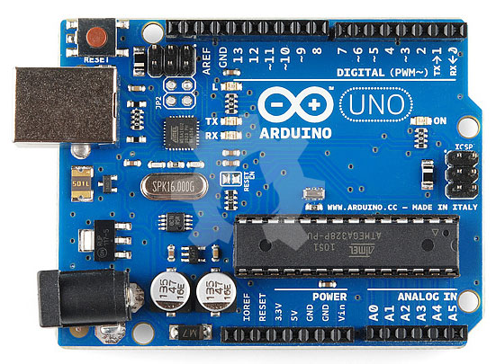
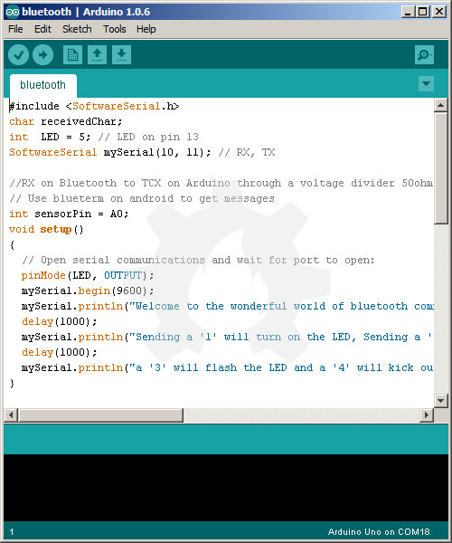
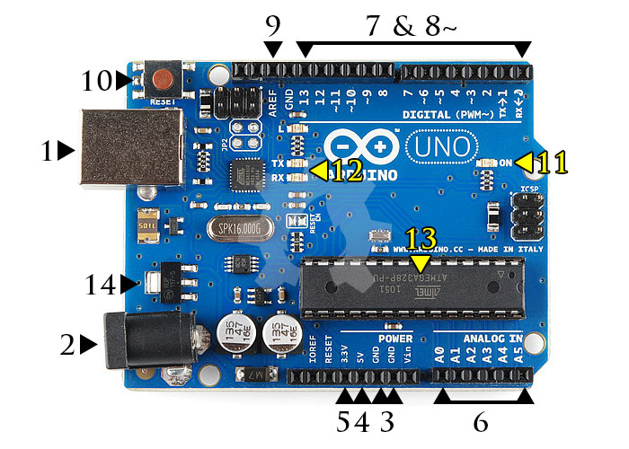
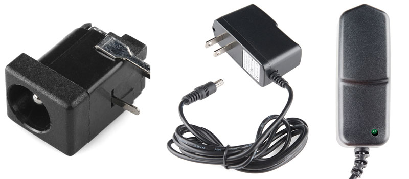
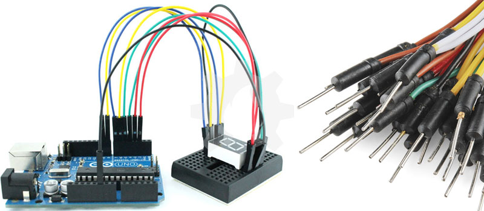
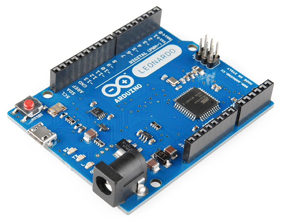
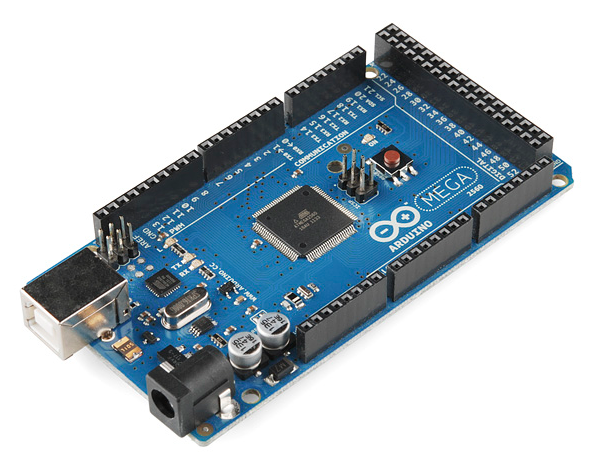
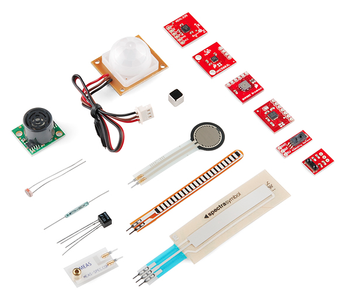
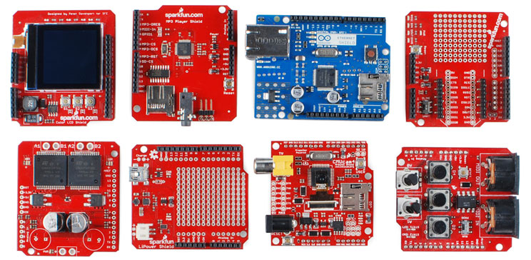

title: Apa itu Arduino
description: Arduino merupakan salah satu platform mikrokontroler dengan chip produksi Atmel dan dikembangkan oleh Tim Arduino Italia
hero: Apa itu Arduino
disqus: henduino

# Mengenal Arduino

Arduino merupakan salah satu platform mikrokontroler yang sangat populer akhir-akhir ini. Para pegiat mikrokontroler dari segala penjuru dunia sebagian besar terpusat untuk membahas pembahasan Arduino. Sifatnya yang Open Source Hardware membuatnya berkembang sangat pesat. Orang-orang begitu bersemangat untuk saling berbagi kode-kode yang sudah disusun oleh mereka untuk dibagikan keseluruh dunia. Selain itu, perangkat keras yang tersedia pun semakin melimpah dan semakin murah. Para pecinta mikrokontroler berlomba-lomba untuk membuat platform Arduino ini dengan berbagai fasilitas dan fungsi yang lebih namun dengan tetap menjualnya dengan harga murah. Setiap pecinta mikrokontroler diperbolehkan untuk membuat Arduino sesuai dengan selera dan kebutuhannya masing-masing, inilah yang membuat Arduini menjadi sangat menarik untuk dipelajari. Lalu apa Arduino?

* * *

## Apa itu Arduino?

Arduino adalah sebuah platform open source (sumber terbuka) yang digunakan untuk membuat proyek-proyek elektronika. Arduino terdiri dari dua bagian utama yaitu sebuah papan sirkuit fisik (sering disebut juga dengan mikrokontroler) dan sebuah perangkat lunak atau IDE (Integrated Development Environment) yang berjalan pada komputer. Perangkat lunak ini sering disebut Arduino IDE yang digunakan untuk menulis dan meng-upload kode dari komputer ke papan fisik (hardware) Arduino. Ketika membicarakan Arduino maka ada dua hal yang terlintas dalam pikiran para penggunanya, yaitu hardware dan software. Dua bagian ini seakan satu kesatuan utuh yang tidak bisa di pisahkan.
Platform Arduino sekarang ini menjadi sangat populer dengan pertambahan jumlah pengguna baru yang terus meningkat. Hal ini karena kemudahannya dalam penggunaan dan penulisan kode. Tidak seperti kebanyakan papan sirkuit pemrograman sebelumnya, Arduino tidak lagi membutuhkan perangkat keras terpisah (disebut programmer atau downloader) untuk memuat atau meng-upload kode baru ke dalam mikrokontroler. Cukup dengan menggunakan kabel USB untuk mulai menggunakan Arduino. Selain itu, Arduino IDE menggunakan bahasa pemrograman C++ dengan versi yang telah disederhanakan, sehingga lebih mudah dalam belajar pemrograman. Arduino akhirnya berhasil menjadi papan sirkuit pemrograman paling disukai hingga menjadikannya sebagai bentuk standar dari fungsi mikrokontroler dengan paket yang mudah untuk diakses.

Gambar diatas menunjukan papan Arduino Uno yang merupakan salah satu papan paling populer diantara keluarga Arduino dan papan ini merupakan pilihan yang sangat cocok bagi para pemula. Dan selanjutnya artikel ini akan membahas lebih dalam mengenai Arduino terutama Arduino Uno.

Sebelum Arduino diciptakan, menulis kode mikrokontroler adalah hal yang sangat rumit dan memusingkan, tapi sekarang, hal yang sangat rumit itu menjadi lebih sederhana. Bahkan sebagian orang menyebutnya tidak mungkin, ketika hanya dengan 10 baris kode kita mampu membuat LED berkedip.

* * *

## Apa Itu Mikrokontroler?

Berbagai jenis komputer dirancang dan dibangun dengan tujuan berbeda. Komputer yang menjadi jantung laptop Anda dioptimalkan untuk tujuan berbeda dari apa yang ada didalam ponsel atau didalam mouse yang anda pegang sekarang. Komputer sederhana adalah perangkat yang dirancang untuk mengambil perangkat inpu (masukan) dari dunia fisik dan atau mengendalikan perangkat output (keluaran) di dunia fisik. Inilah yang disebut mikrokontroler.
Sebagian perangkat elektronik yang ada sekarang ini memiliki mikrokontroler pada bagian intinya. Mikrokontroler yang dioptimalkan untuk mengendalikan input saja atau output saja. Mereka pada umumnya memiliki kemampuan komputasi yang rendah jika dibandingkan dengan prosesor yang digunakan pada komputer multimedia atau komputer server. Mikrokontroler membutuhkan daya yang lebih rendah dibanding prosesor lainnya dan lebih mudah untuk berinteraksi dengan dunia fisik melalui sirkuit input yang disebut sensor dan sirkuit output yang disebut aktuator. Mikrokontroler juga dapat berkomunikkasi dengan prosesor lain melalui berbagai antarmuka komunikasi (communication interface).
Komputer, mikrokontroler, prosesor? Jadi yang mana? Kita sering mendengar istilah-istilah ini disebutkan silih berganti disekitar kita. Komputer dan Prosesor adalah istilah umum untuk apapun yang pada dasarnya mampu menjalankan program. Sedangkan Kontroler atau Mikrokontroler biasanya diperuntukan bagi prosesor sederhana yang hanya mampu menjalankan satu tugas saja, seperti membaca sensor.

* * *

## Apa Yang Bisa Dilakukan Arduino?

Hardware dan software Arduino dirancang bagi para seniman, desainer, pe-hobi, hacker, pemula dan siapapun yang tertarik untuk menciptakan objek interaktif dan pengembangan lingkungan. Arduino mampu berinteraksi dengan tombol, LED, motor, speaker, GPS, kamera, internet, ponsel pintar bahkan dengan televisi anda. Fleksibilitas ini dihasilkan dari kombinasi ketersediaan software Arduino yang gratis, papan perangkat keras yang murah, dan keduanya yang mudah untuk dipelajari. Hal inilah yang menciptakan jumlah pengguna menjadi sebuah komunitas besar dengan berbagai kontribusinya yang telah dirilis pada berbagai proyek dengan berbasiskan Arduino.
Jika Anda ingin mengetahui dimana kita bisa menemukan berbagai contoh proyek Arduino yang telah tercipta, dibawah ini adalah beberapa sumber daya yang bagus untuk proyek-proyek berbasis Arduino, yang bisa memicu cara berfikir Anda dan menggugah kreatifitas:

* [Sparkfun][1]
* [Instructables][2]
* [Bildr][3]
* [Arduino Playground][4]
* [Adafruit][5]
* [Make Projects][6]
* Dan tentu saja anda dapat menemukan banyak tutorial menarik disini di [https://henduino.github.io/library/][7]

* * *

## Apa Yang Ada Pada Papan Arduino?

Ada banyak jenis papan Arduino yang dapat digunakan untuk tujuan yang berbeda. Beberapa papan memiliki ukuran, jumlah pin, mikrokontroler yang berbeda seperti pada gambar dibawah ini. Namun, sebagian besar Arduino memiliki komponen utama yang sama.

### Daya (USB/Barrel Jack)

Setiap papan Arduino membutuhkan jalur untuk terhubung ke sumber listrik. Arduino Uno dapat diaktifkan melalui kable USB ang berasal dari komputer atau power supply terpisah yang dihubungkan ke Barrel Jack. Pada gambar diatas koneksi USB diberi label (1) dan Barrel Jack diberi label (2).
Koneksi USB selain digunakan sebagai jalur listrik untuk mengaktifkan papan, juga digunakan untuk meng-upload kode dari komputer ke papan Arduino. Dua fungsi melalui satu jalur atau 2 in 1 (seperti iklan Shampo).

Perhatian!: JANGAN menggunakan power supply lebih dari 20 Volt untuk mengaktifkan papan Arduino melalui Barrel Jack karena itu tegangan berlebihan yang cukup untuk menghacurkan papan Arduino Anda. Tegangan yang dianjurkan untuk sebagian besar keluarga Arduino adalah antara 6 Volt sampai dengan 12 Volt.

### Pin (5V, 3.3V, GND, Analog, Digital, PWM, AREF)

Pin pada Arduino adalah tempat dimana kita menghubungkan kabel untuk membuat suatu rangkaian (menghubungkan satu titik dengan titik lainnya pada breadboard dengan sejumlah kabel penghubung).
Kabel penghubung (jumper wire) yang digunakan dalam membuat rangkaian biasanya memiliki kepala yang terbuat dari plastik berwarna hitam yang memungkin kawat dari kabel penghubungnya saja yang terhubung langsung ke papan.

Arduino memiliki beberapa jenis pin yang masing-masing diberi label pada papan dan digunakan untuk fungsi yang berbeda-beda.

* GND (3) : GND merupakan singkatan dari GROUND. Ada beberapa pin GND pada Arduino, dan semuanya dapat digunakan untuk hubungan ke ground.

* 5V (4) dan 3.3V (5) : Pin 5V digunakan untuk menyediakan tegangan sebesar 5 volt. Sedangkan pin 3.3V digunakan untuk menyediakan tegangan 3,3 volt. Sebagian besar komponen sederhana yang digunakan bersama dengan Arduino berjalan pada kisaran tegangan 3,3 volt hingga 5 volt.

* Analog (6) : Pin yang berada pada area berlabel "ANALOG IN" (A0 sampai A5 pada Arduino Uno) digunakan sebagai pin analog. Yaitu pin yang digunakan untuk membaca sinyal-sinyal analog dari sensor-sensor analog (misal; sensor suhu) dan mengubahnya menjadi nilai digital yang dapat kita baca.

* Digital (7) : Pin digital berada diseberang pin analog (0 sampai 13 pada Arduino Uno). Pin ini dapat digunakan dalam 2 arah digital yaitu input digital (misal untuk melihat kondisi bahwa tombol sedang ditekan) dan output digital (memberikan tegangan sebuah LED).

* PWM (8) : Perhatikanlah simbol tilde (~) disamping beberapa pin digital (yaitu pada pin 3, 5, 6, 9, 10 dan 11 pada Arduino Uno). Pin ini dapat digunakan sebagai pin digital biasa, tetapi juga dapat digunakan sebagai pin PWM (Pulse Width Modulation). PWM biasanya digunakan sebagai pin yang mampu mensimulasikan output analog (seperti mengatur pemudaran cahaya dan warna LED saat datang dan pergi). PWM bukan analog, hanya mampu mensimulasikan analog saja. Jadi tidaklah sama antara analog dengan PWM. (Bahasan di artikel lain).

* AREF (9) : Kepanjangan dari Analog Reference atau Referensi Analog. Selama belajar, tinggalkan saja pin ini. Pin ini terkadang digunakan sebagai referensi dalam mengatur tegangan eksternal (antara 0 sampai 5 volt) untuk memberikan limit (batasan akhir) pada input pin analog.

### Tombol Reset

Menekan tombol Reset (10) beberapa saat pada papan Arduino akan menghubungkan pin Reset ke Ground. Ini digunakan untuk me-restart kode yang telah dimuat oleh Arduino. Ini sangat bermanfaat untuk menguji ulang kode, jika kode tersebut ditulis tanpa pengulangan (repeat) atau sekali jalan. Jika anda pernah menggunakan Nintendo pasti tahu fungsi tombol Reset ini. Pada Nintendo ketika menekan tombol Reset maka hal itu digunakan untuk memperbaiki masalah, tetapi tidak demikian pada Arduino.
 
### LED Indikator Daya

Tepat di bawah dan di sebelah kanan kata "UNO" pada papan Arduino Uno, terdapat sebuah LED kecil berlabel "ON" (11). LED ini harus menyala setiap kita mengubungkan papan Arduino pada sumber listrik. Jika lampu LED ini tidak menyala, kemungkinan ada papan mengalami kerusakan atau terjadi kesalahan. Periksa ulang rankaian yang anda buat.

### TX RX LED

TX adalah singkatan dari 'transmit' (kirim), dan RX adalah singkatan dari 'receive' (terima). LED indikator TX dan RX (12) ini akan berkedip redup atau terang dengan jeda tak tentu untuk memberitahukan bahwa telah terjadi komunikasi serial. Kedipan LED ini sebagai indikasi visual yang merupakan pertanda baik bahwa telah terjadi pengiriman dan penerimaan data pada papan Arduino (misal ketika kita meng-upload kode baru ke dalam papan).

### IC Utama

Sesuatu yang berwarna hitam dengan semua kakinya terbuat dari logam inilah yang sebut IC atau Integrated Circuit (13). Ini adalah otak dari papan Arduino. IC utama Arduino berbeda-beda sesuai dengan jenis papan, tetapi biasanya memiliki ciri khas bertuliskan ATmega yang merupakan IC buatan perusahaan ATMEL. Ini merupakan hal penting, karena kita perlu untuk memahami jenis IC (sesuai juga dengan jenis papan Arduino) sebelum memuat atau meng-upload sekumpulan kode program yang telah kita buat dari perangkat lunak Arduino IDE kedalam papan Arduino. Informasi tentang tipe IC dapat kita temukan pada permukaan IC tersebut. Jika kita ingin tahu lebih jauh tentang perbedaan jenis IC yang digunakan pada keluarga Arduino maka sebaiknya selalu unduh datasheet dari masing-masing tipe IC.

### Regulator Tegangan

Voltage Regulator (14) bukanlah sesuatu yang mampu berinteraksi dengan papan Arduino. Tetapi kita harus mengetahui fungsi dari voltage regulator. Voltage Regulator atau Regulator Tegangan akan mengalirkan sejumlah tegangan teregulati ke dalam papan Arduino. Voltage Regulator berperan sebagai penjaga pintu gerbang, dia akan membalikan atau membuang tegangan berlebihan yang bisa membahayan rangkaian. Tapi tentu saja ada batasnya, pastikan bahwa tegangan yang masuk ke dalam papan tidak lebih besar dari 20 volt.

* * *

## Keluarga Arduino

Perusahaan Arduino telah membuat beberapa tipe papan yang berbeda-beda, masing-masing tipe tersebut memiliki kemampuan yang berbeda pula. Selain itu, Arduino merupakan Open Source Hardware yang berarti bahwa siapa saja dapat memodifikasi dan menghasilkan turunan Arduino dengan bentuk dan fungsi yang lebih beragam. Jika Anda belum begitu paham mengenai papan Arduino, berikut adalah beberapa pilihan yang cocok untuk mereka yang baru saja ingin berkenalan dengan Arduino.

### Arduino Uno (R3)

Arduino Uno adalah pilihan yang tepat bagi mereka yang baru pertama kali ingin mempelajari Arduino. Karena Uno merupakan paket lengkap untuk memulai belajar Arduino. Memiliki 14 pin input/output digital (dimana 6 pin dapat digunakan sebagai output PWM), 6 pin input analog, koneksi USB, jack daya, tombol reset, dan masih banyak lagi. Ini semua sudah cukup untuk keperluan belajar mikrokontroler. Hanya dengan menghubungkan papan Arduino ke komputer melalui kabel USB, atau menggunakan adaptor AC-DC, atau menggunakan baterai untuk mengaktifkan papan Arduino.

### Arduino Leonardo

Arduino Leonardo adalah tipe papan yang dikembangkan pertama kali oleh Arduino dengan menggunakan satu mikrokontroler dengan fungsi komunikasi USB yang terintegrasi didalamnya. Ini membuat Leonardo lebih sederhana dan lebih murah. Karena Leonardo dapat menanganai komunikasi USB secara langsung, kode perpustakaan yang tersedia pun memungkinkan Leonardo dapat meniru keyboard komputer, mouse dan masih banyak lagi.

### Arduino Mega

Arduino Mega itu seperti halnya kakak UNO. Memiliki banyak (54) pin digital input/output (14 pin digunakan sebagai output PWM), 16 pin analog, koneksi USB, jack daya, tombol reset, dan masih banyak lagi. Ini merupakan papan lengkap yang diperlukan untuk mendukung pembelajaran mikrokontroler. Jumlah pin yang banyak membuat Arduino Mega digunakan untuk proyek-proyke yang memerlukan banyak input dan ouput digital.

* * *

## Bagian Pelengkap

Jika anda sudah yakin dengan papan Arduino yang akan digunakan, maka selanjutnya adalah menentukan bagian pelengkap, karena papan Arduino tidak bisa berdiri sendiri tanpa sesuatu terpasang pada papan. Anda bisa menghubungkan sensor atau shield Arduino. Peralatan ini sangat berguna untuk digunakan pada proyek yang akan anda buat.

### Sensor
dengan beberapa baris kode sederhana, Arduino dapat mengontrol dan berinteraksi dengan berbagai sensor, misalnya; pengukur intensitas cahaya, suhu, tekanan, akselerasi, kandungan karbon monoksida, aktifitas radioaktif, kelembaban, tekanan udara, dan mungkin suatu sensor yang bisa anda buat dan beri nama sendiri.

### Shield
Selain sensor, ada juga yang sebut shield (marilah kita sebut dengan perisai). Pada dasarnya shield adalah papan rangkaian yang tidak belum disempurnakan atau dilengkapi secara keseluruhan dan dibuat dengan pin yang sesuai dengan papan Ardiuno agar mudah saat digunakan atau dihubungkan. Shield memberikan kemampuan tambahan seperti halnya; pengendari motor, menghubungkan dengan internet, komunikasi seluler, komunikasi nirkabel, mengontrol layar LCD dan masih banyak lagi shield dengan berbagai fungsi yang bisa dipilih sesuai dengan proyek yang akan anda buat.

Untuk mengetahui lebih jauh tentang shield yang banyak digunakan para pengguna Arduino anda bisa memeriksanya pada situs [ShieldList.org][8].

* * *

## Kesimpulan
Penulis berharap sekarang anda mulai memahami tentang Arduino, keluarga Arduino, dan beberapa informasi tentang Arduino sebagai awalan untuk belajar tentang mikrokontroler. Ada ribuan sensor dan shield yang bisa anda manfaatkan untuk membantu proyek anda ke tingkat selanjutnya. Selamat belajar...

* * *

## Referensi
* [Learn the basics][9]

* [Arduino Tutorials][9]

* [Beginner Arduino][11]

* [Learn Electronics and Microcontrollers][12]

* [Physical Computing][13]

* [The Complete Arduino Guide For Beginners][14]

* [The Absolute Beginner's Guide to Arduino][15]

[1]: https://learn.sparkfun.com/tutorials
[2]: http://www.instructables.com/tag/type-id/category-technology/channel-arduino/
[3]: http://bildr.org/
[4]: http://playground.arduino.cc/
[5]: https://learn.adafruit.com/category/learn-arduino
[6]: http://makezine.com/category/arduino/
[7]: https://henduino.github.io/library/
[8]: http://www.shieldlist.org/
[9]: http://arduino.cc/en/Tutorial/HomePage
[10]: https://learn.sparkfun.com/tutorials
[11]: http://www.instructables.com/id/Beginner-Arduino/
[12]: http://www.ladyada.net/learn/arduino/
[13]: https://itp.nyu.edu/physcomp/
[14]: http://codeduino.com/tutorials/the-complete-arduino-guide-for-beginners/
[15]: http://www.forefront.io/a/beginners-guide-to-arduino

***

<small>Artikel diperbarui pada: {{ git_revision_date_localized }}</small>