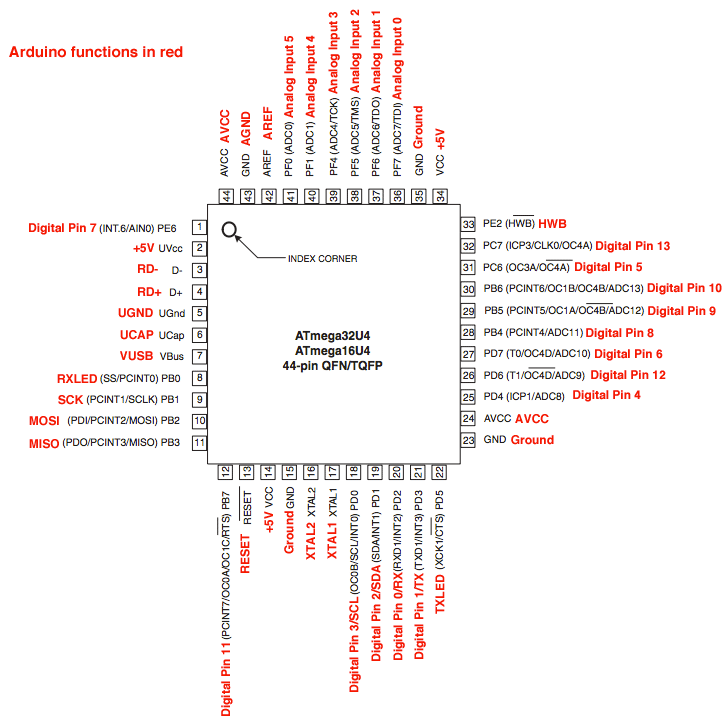

title: Mengenal Arduino Leonardo
description: Arduino Leonardo adalah papan mikrokontroler berbasis ATmega32U4 yang dikembangkan oleh Tim Arduino Italia
hero: Mengenal Arduino Leonardo
disqus: henduino

# Mengenal Arduino Leonardo

Arduino Leonardo adalah papan mikrokontroler berbasis ATmega32u4 [(datasheet ATmega32U4)][1]. Arduino Leonardo memiliki 20 digital pin input/output (yang mana 7 pin dapat digunakan sebagai output PWM dan 12 pin sebagai input analog), 16 MHz kristal osilator, koneksi micro USB, jack power suplai tegangan, header ICSP, dan tombol reset. Ini semua yang diperlukan untuk mendukung mikrokontroler. Cukup dengan menghubungkannya ke komputer melalui kabel USB atau power dihubungkan dengan adaptor AC-DC atau baterai untuk mulai mengaktifkannya.

Leonardo berbeda dari semua papan Arduino yang lainnya karena ATmega32u4 secara terintegrasi (*built-in*) telah memiliki komunikasi USB, sehingga tidak lagi membutuhkan prosesor sekunder (tanpa chip ATmega16U2 sebagai konverter USB-to-serial). Hal ini memungkinkan Arduino Leonardo yang terhubung ke komputer digunakan sebagai mouse dan keyboard, selain bisa digunakan sebagai virtual (CDC) serial/COM port.

* * *

## Spesifikasi

Dibawah ini spesifikasi sederhana dari Arduino Leonardo:

|Info|Spesifikasi|
|----------------|----------------------------------------|
|Mikrokontroler|>ATmega32u4|
|Tegangan Operasi|5V|
|Input Voltage (disarankan)|7-12V|
|Input Voltage (limit)|6-20V|
|Digital I/O Pins|20 pin|
|Channel PWM|7 pin|
|Input Analog|12 pin|
|Arus DC per pin I/O|40 mA|
|Arus DC untuk pin 3.3V|50 mA|
|Flash Memory|32 KB (ATmega32u4) 4 KB digunakan bootloader|
|SRAM|2.5 KB (ATmega32u4)|
|EEPROM|1 KB (ATmega32u4)|
|Clock Speed|16 MHz|

* * *

## Skema & Referensi Desain

Dibawah ini file skema dan desain PCB untuk Arduino Leonardo:

* Skema Arduino Leonardo (EagleCAD): [Arduino-leonardo-referensi-design.zip][2]

* Skema Arduino Leonardo (PDF): [Arduino-leonardo-skema-rev3b.pdf][3]

* Untuk membuka file EagleCAD disarankan menggunakan EagleCAD versi 6.0 keatas

* * *

## Sumber Daya (Tegangan)

Arduino Leonardo dapat diaktifkan melalui koneksi USB mikro atau dengan catu daya eksternal. Sumber daya dipilih secara otomatis. Sumber daya Eksternal (non-USB) dapat berasal baik dari adaptor AC-DC atau baterai. Adaptor dapat dihubungkan dengan mencolokkan steker 2.1 mm denan pusat-positif ke jack power pada papan. Sumber tegangan dari baterai dapat dihubungkan ke header pin Gnd dan Vin pin sebagai konektor sumber daya tegangan papan.
Papan Arduino Leonardo dapat beroperasi dengan pasokan daya eksternal 6 Volt sampai 20 volt. Jika diberi tegangan kurang dari 7 Volt, maka, pin 5 Volt mungkin akan menghasilkan tegangan kurang dari 5 Volt dan ini akan membuat papan menjadi tidak stabil. Jika sumber tegangan menggunakan lebih dari 12 Volt, regulator tegangan akan mengalami panas berlebihan dan bisa merusak papan. Rentang sumber tegangan yang dianjurkan adalah 7 Volt sampai 12 Volt.
Pin tegangan yang tersedia pada papan Arduino Leonardo adalah sebagai berikut:

* VIN : Adalah input tegangan untuk papan Arduino ketika menggunakan sumber daya eksternal (sebagai 'saingan' tegangan 5 Volt dari koneksi USB atau sumber daya ter-regulator lainnya). Anda dapat memberikan tegangan melalui pin ini, atau jika memasok tegangan untuk papan melalui jack power, kita bisa mengakses/mengambil tegangan melalui pin ini.

* 5V : Tegangan listrik ter-regulator yang digunakan untuk daya mikrokontroler dan komponen lainnya pada papan Arduino. Tegangan dapat menggunakan pin VIN melalui regulator on-board, atau dipasok oleh USB atau power suplai lain dengan besar tegangan 5V ter-regulator.

* 3V3 : Sebuah pin yang menghasilkan tegangan 3,3 Volt. Tegangan ini dihasilkan oleh regulator yang terdapat pada papan (on-board). Arus maksimum yang dihasilkan adalah 50 mA.

* GND : Pin Ground atau Massa.

* IOREF : Pin ini pada papan Arduino berfungsi untuk memberikan referensi tegangan yang beroperasi pada mikrokontroler (atau VCC untuk papan). Pin ini bertegangan 5V pada Leonardo.

* * *

## Memori

ATmega32u4 memiliki memori sebesar 32 KB (4 KB digunakan untuk bootloader). Juga memiliki 2,5 KB SRAM dan 1 KB EEPROM (yang dapat dibaca dan ditulis dengan perpustakaan EEPROM).

* * *

## Input dan Output

20 pin digital I/O pada Leonardo dapat digunakan sebagai input atau output, menggunakan fungsi `pinMode()`, `digitalWrite()`, dan `digitalRead(`. Mereka beroperasi pada tegangan 5 volt. Setiap pin dapat memberikan atau menerima maksimum 40 mA dan memiliki resistor pull-up internal sebesar 20-50 kOhm yang terputus secara default. Selain itu, beberapa pin memiliki fungsi khusus, yaitu:

* Serial : Pin 0 (RX) dan pin 1 (TX). Digunakan untuk menerima (RX) dan mengirimkan (TX) data serial TTL menggunakan hardware ATmega32U4 yang memiliki kemampuan serial didalamnya. Perhatikan bahwa pada Leonardo, kelas Serial mengacu pada komunikasi USB (CDC); untuk TTL serial pada pin 0 dan 1, menggunakan kelas Serial 1.

* TWI : Pin 2 (SDA) dan pin 3 (SCL). Dukungan komunikasi TWI menggunakan perpustakaan Wire.

* Eksternal Interupsi : Pin 3 (interrupt 0), pin 2 (interrupt 1), pin 0 (interrupt 2), pin 1 (interrupt 3) dan pin 7 (interrupt 4). Pin ini dapat dikonfigurasi untuk memicu sebuah interupsi pada nilai yang rendah, meningkat atau menurun, atau merubah nilai.

* PWM : Pin 3, 5, 6, 9, 10, 11, dan 13. Menyediakan 8-bit output PWM dengan fungsi `analogWrite()`.

* SPI : Pin pada header ICSP ini mendukung komunikasi SPI menggunakan perpustakaan SPI. Perhatikan bahwa pin SPI tidak terhubung ke salah satu pun pin digital I/O karena yang terhubung langsung hanya pada Arduino Uno, Mereka hanya menyediakan konektor ICSP. Ini berarti bahwa jika Anda memiliki shield yang menggunakan SPI, tetapi tidak terdapat 6 pin konektor ICSP yang terhubung ke 6 pin ICSP header Leonardo, maka shield tidak akan bekerja.

* LED : Pin 13. Tersedia secara built-in pada papan Arduino ATmega2560. LED terhubung ke pin digital 13. Ketika pin diset bernilai HIGH, maka LED menyala (ON), dan ketika pin diset bernilai LOW, maka LED padam (OFF).

* Input Analog : Pin A0-A5, Pin A6 - A11 (pada pin digital 4, 6, 8, 9, 10, dan 12). Leonardo memiliki 12 input analog, berlabel A0 sampai A11, yang semuanya juga dapat digunakan sebagai digital I/O. Pin A0-A5 terdapat di lokasi yang sama seperti pada Arduino Uno; Pin input A6-A11 masing-masing ada pada digital I/O pin 4, 6, 8, 9, 10, dan 12. Masing-masing pin menyediakan resolusi 10 bit (yaitu 1024 nilai yang berbeda). Secara default pin ini dapat diukur/diatur dari mulai Ground sampai dengan 5 Volt, juga memungkinkan untuk mengubah titik jangkauan tertinggi atau terendah mereka menggunakan pin AREF dan fungsi `analogReference()`.

Masih ada beberapa pin lainnya pada Arduino Leonardo, yaitu:

* AREF : Referensi tegangan untuk input analog. Digunakan dengan fungsi `analogReference()`.

* RESET : Jalur LOW ini digunakan untuk me-reset (menghidupkan ulang) mikrokontroler. Jalur ini biasanya digunakan untuk menambahkan tombol reset pada shield yang menghalangi papan utama Arduino.

*Gambar 1. Arduino Leonardo dari Atas*

* * *

## Pemetaaan

Dibawah ini pemetaan Pin ATmega32U4 dan Pin Arduino Leonardo:

*Gambar 2. Pemetaan Pin ATmega32U4*

|Pin Number|Pin Name|Mapped Pin Name|
|----------|--------|-------------------------------|
|1|PE6 (INT.6/AIN0)|Digital pin 7|
|2|UVcc|+5V|
|3|D-|RD-|
|4|D+|RD+|
|5|UGnd|UGND|
|6|UCap|UCAP|
|7|VUSB|VBus|
|8|(SS/PCINT0) PB0|RXLED|
|9|(PCINT1/SCLK) PB1|SCK|
|10|(PDI/PCINT2/MOSI) PB2|MOSI|
|11|(PDO/PCINT3/MISO) PB3|MISO|
|12|(PCINT7/OCA0/OC1C/#RTS) PB7|Digital pin 11 (PWM)|
|13|RESET|RESET|
|14|Vcc|+5V|
|15|GND|GND|
|16|XTAL2|XTAL2|
|17|XTAL1|XTAL1|
|18|(OC0B/SCL/INT0) PD0|Digital pin 3 (SCL)(PWM)|
|19|(SDA/INT1) PD1|Digital pin 2 (SDA)|
|20|(RX D1/AIN1/INT2) PD2|Digital pin 0 (RX)|
|21|(TXD1/INT3) PD3|Digital pin 1 (TX)|
|22|(XCK1/#CTS) PD5|TXLED|
|23|GND1|GND|
|24|AVCC|AVCC|
|25|(ICP1/ADC8) PD4|Digital pin 4|
|26|(T1/#OC4D/ADC9) PD6|Digital pin 12|
|27|(T0/OC4D/ADC10) PD7|Digital Pin 6 (PWM)|
|28|(ADC11/PCINT4) PB4|Digital pin 8|
|29|(PCINT5/OC1A/#OC4B/ADC12) PB5|Digital Pin 9 (PWM)|
|30|(PCINT6/OC1B/OC4B/ADC13) PB6|Digital Pin 10 (PWM)|
|31|(OC3A/#0C4A) PC6|Digital Pin 5 (PWM)|
|32|(ICP3/CLK0/)C4A) PC7|Digital Pin 13 (PWM)|
|33|(#HWB) PE2|HWB|
|34|Vcc1|+5V|
|35|GND2|GND|
|36|(ADC7/TDI) PF7|Analog In 0|
|37|(ADC6/TDO) PF6|Analog In 1|
|38|(ADC5/TMS) PF5|Analog In 2|
|39|(ADC4/TCK) PF4|Analog In 3|
|40|(ADC1) PF1|Analog In 4|
|41|(ADC0) PF0|Analog In 5|
|42|AREF|AEF|
|43|GND3|GND|
|44|AVCC1|AVCC|

* * *

## Komunikasi

Leonardo memiliki sejumlah fasilitas untuk berkomunikasi dengan komputer, dengan Arduino lain, atau dengan mikrokontroler lainnya. ATmega32U4 mampu menyediakan komunikasi serial UART TTL (5V), yang tersedia pada pin digital 0 (RX) dan 1 (TX). ATmega32U4 juga memungkinkan untuk komunikasi serial (CDC) melalui USB dan muncul sebagai com port virtual pada perangkat lunak komputer. Chip ini juga bertindak sebagai perangkat USB 2.0 dengan kecepatan tinggi, serta menggunakan standar driver USB COM, tetapi ntuk sistem operasi Windows masih tetap memerlukan file inf. Perangkat lunak Arduino termasuk didalamnya serial monitor memungkinkan data tekstual sederhana dikirim ke dan dari papan Arduino. LED RX dan TX yang tersedia pada papan akan berkedip ketika data sedang dikirim atau diterima melalui chip USB-to-serial yang terhubung melalui USB komputer (tetapi tidak untuk komunikasi serial seperti pada pin 0 dan 1).

Sebuah perpustakaan SoftwareSerial memungkinkan komunikasi serial pada beberapa pin digital Leonardo. ATmega32U4 juga mendukung komunikasi I2C (TWI) dan SPI. Perangkat lunak Arduino termasuk perpustakaan Wire digunakan untuk menyederhanakan penggunaan bus I2C. Untuk komunikasi SPI, menggunakan perpustakaan SPI. Leonardo muncul pada komputer sebagai keyboard dan mouse generik, dan dapat diprogram untuk mengontrol perangkat input menggunakan kelas/kelompok Keyboard dan Mouse.

* * *

## Pemrograman

Arduino Mega dapat diprogram dengan software Arduino [(Unduh perangkat lunak Arduino)][4]. (Mengenai pemahasan lebih rinci tentang perangkat lunak Arduino akan dibahas pada artikel terpisah). ATmega32U4 pada Arduino Leonardo sudah tersedia preburned dengan bootloader (*preburned* dan *bootloader* apa bahasa Indonesianya?) yang memungkinkan Anda untuk meng-upload kode baru tanpa menggunakan programmer hardware eksternal. Hal ini karena komunikasi yang terjadi menggunakan protokol AVR109. Anda juga dapat melewati (*bypass*) bootloader dan program mikrokontroler melalui pin header ICSP (*In-Circuit Serial Programming*).

* * *

## Reset (Software) Otomatis dan Inisiasi Bootloader

Daripada menekan tombol reset sebelum upload, Arduino Leonardo didesain dengan cara yang memungkinkan Anda untuk me-reset melalui perangkat lunak yang berjalan pada komputer yang terhubung. Reset dipicu ketika virtual (CDC) port serial/COM Leonardo dibuka pada 1200 baud dan kemudian ditutup. Ketika ini terjadi, prosesor akan mengatur ular (reset), memutuskan hubungan koneksi USB ke komputer (virtual port serial/COM akan hilang dari komputer). Setelah prosesor melakukan reset, bootlader akan dimuat, yang akan segera aktif dalam waktu sekitar 8 detik. Bootloader juga dapat dimuat dengan menekan tombol Reset pada Leonardo. Perhatikan bahwa ketika pertama kali papan diaktifkan, ia akan melompat langsung ke sketch, jika tersedia, dari pada harus memuat bootloader.

Karena itu metode yang terbaik untuk melakukan reset pada Leonardo adalah dengan membiarkan software arduino melakukan reset sebelum upload sketch, terutama bagi mereka yang terbiasa menekan tombol reset sebelum melakukan upload. Jika software Arduino tidak dapat melakukan reset terhadap papan, kita bisa memulai bootloader dengan menekan tombol reset yang tersedia pada papan.

* * *

## Perlindungan Beban Berlebih pada USB

Arduino Leonardo memiliki polyfuse reset yang melindungi port USB komputer Anda dari hubungan singkat dan arus lebih. Meskipun pada dasarnya komputer telah memiliki perlindungan internal pada port USB mereka sendiri, sekring memberikan lapisan perlindungan tambahan. Jika arus lebih dari 500 mA dihubungkan ke port USB, sekring secara otomatis akan memutuskan sambungan sampai hubungan singkat atau overload dihapus/dibuang.

* * *

## Karakteristik Fisik

Maksimum panjang dan lebar PCB Arduino Leonardo sama dengan Arduino Uno yaitu 2.7 x 2.1 inch (6,8 x 5,3 cm), dengan konektor USB dan jack power menonjol melampaui batas dimensi. Empat lubang sekrup memungkinkan papan terpasang pada suatu permukaan atau wadah. Perhatikan bahwa jarak antara pin digital 7 dan 8 adalah 160 mil (0.16 inch), tidak seperti pin lainnya dengan kelipatan genap berjarak 100 mil.

[1]: http://www.atmel.com/devices/atmega32u4.aspx?tab=documents
[2]: http://arduino.cc/en/uploads/Main/arduino-leonardo-reference-design_3b.zip
[3]: http://arduino.cc/en/uploads/Main/arduino-leonardo-schematic_3b.pdf
[4]: http://arduino.cc/en/Main/Software

* * * 
