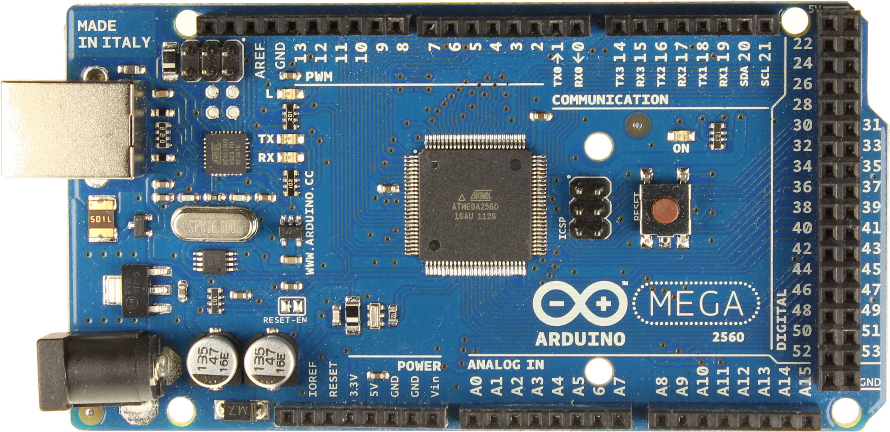
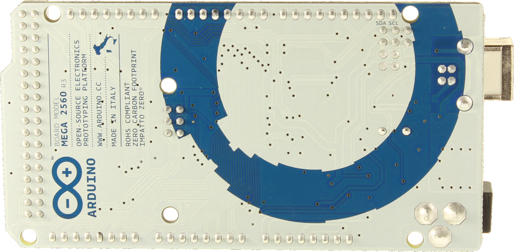
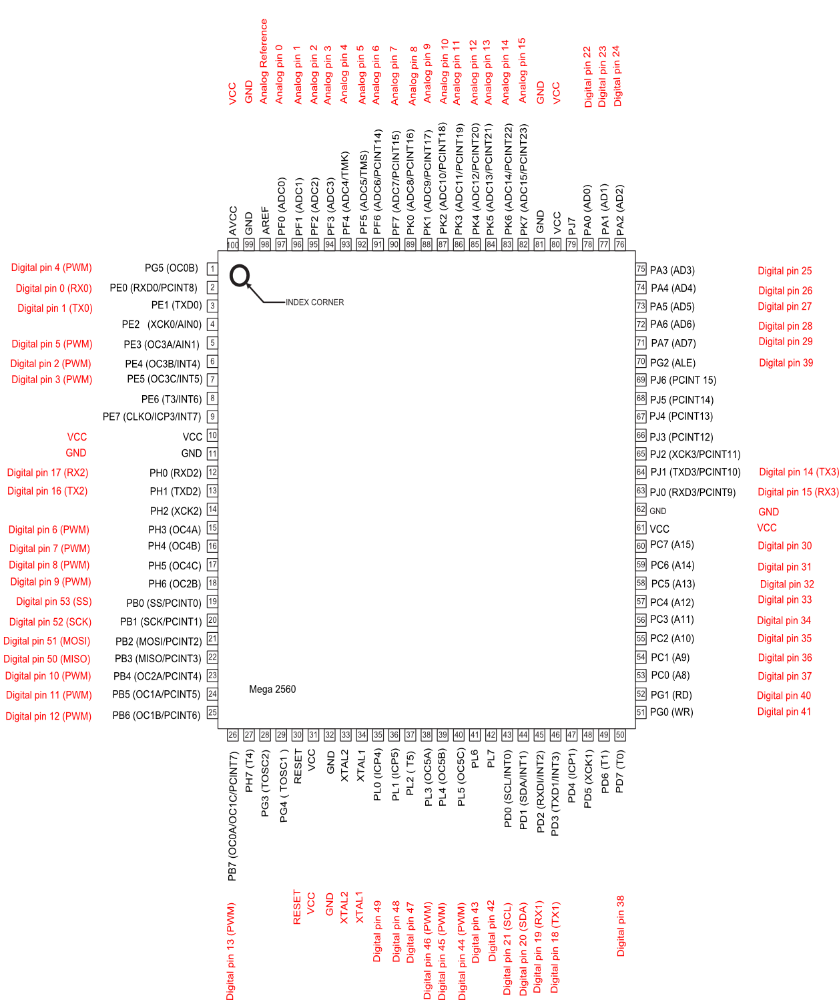

title: Mengenal Arduino Mega2560
description: Arduino Mega2560 adalah papan mikrokontroler berbasiskan ATmega2560. Arduino Mega2560 memiliki 54 pin digital input output, dimana 15 pin dapat digunakan sebagai output PWM, 16 pin sebagai input analog, dan 4 pin sebagai UART , 16 MHz kristal osilator, koneksi USB, jack power, header ICSP, dan tombol reset.
hero: Mengenal Arduino Mega2560
disqus: henduino

# Mengenal Arduino Mega2560

## Arduino Mega2560

Arduino Mega2560 adalah papan mikrokontroler berbasiskan ATmega2560 ([datasheet ATmega2560][1]). Arduino Mega2560 memiliki 54 pin digital input/output, dimana 15 pin dapat digunakan sebagai output PWM, 16 pin sebagai input analog, dan 4 pin sebagai UART (port serial hardware), 16 MHz kristal osilator, koneksi USB, jack power, header ICSP, dan tombol reset. Ini semua yang diperlukan untuk mendukung mikrokontroler. Cukup dengan menghubungkannya ke komputer melalui kabel USB atau power dihubungkan dengan adaptor AC-DC atau baterai untuk mulai mengaktifkannya. Arduino Mega2560 kompatibel dengan sebagian besar shield yang dirancang untuk Arduino Duemilanove atau Arduino Diecimila. Arduino Mega2560 adalah versi terbaru yang menggantikan versi Arduino Mega.

Arduino Mega2560 berbeda dari papan sebelumnya, karena versi terbaru sudah tidak menggunakan chip driver FTDI USB-to-serial. Tapi, menggunakan chip ATmega16U2 (ATmega8U2 pada papan Revisi 1 dan Revisi 2) yang diprogram sebagai konverter USB-to-serial. Arduino Mega2560 Revisi 2 memiliki resistor penarik jalur HWB 8U2 ke Ground, sehingga lebih mudah untuk dimasukkan ke dalam mode DFU.

*Gambar 1. Arduino Mega2560 Tampak Depan*

*Gambar 2. Arduino Mega2560 Tampak Belakang*

Arduino Mega2560 Revisi 3 memiliki fitur-fitur baru berikut:

* 1.0 pinout : Ditambahkan pin SDA dan pin SCL yang dekat dengan pin AREF dan dua pin baru lainnya ditempatkan dekat dengan pin RESET, IOREF memungkinkan shield untuk beradaptasi dengan tegangan yang tersedia pada papan. Di masa depan, shield akan kompatibel baik dengan papan yang menggunakan AVR yang beroperasi dengan 5 Volt dan dengan Arduino Due yang beroperasi dengan tegangan 3.3 Volt. Dan ada dua pin yang tidak terhubung, yang disediakan untuk tujuan masa depan.
* Sirkuit RESET.
* Chip ATmega16U2 menggantikan chip ATmega8U2.

***

## Skema & Referensi Desain

Dibawah ini Skema dan Referensi Arduino Mega2560:

* Skema Arduino Mega2560 EagleCAD : [Arduino-mega2560_R3-referensi-design.zip][2]
* Skema Arduino Mega2560 PDF : [Arduino-mega2560_R3-schematic.pdf][3]

***

## Pemetaan Pin

Dibawah ini pemetaan [pin ATmega2560][4] dengan Arduino Mega2560:

*Gambar 3. Pinout ATMega2560*

Tabel Pemetaan Pin Arduino Mega2560

| Nomor Pin | Nama Pin               | Peta Nama Pin         |
|-----------|------------------------|-----------------------|
| 1         | PG5 (OC0B)             | Digital pin 4 (PWM)   |
| 2         | PE0 (RXD0/PCINT8)      | Digital pin 0 (RX0)   |
| 3         | PE1 (TXD0)             | Digital pin 1 (TX0)   |
| 4         | PE2 (XCK0/AIN0)        |                       |
| 5         | PE3 (OC3A/AIN1)        | Digital pin 5 (PWM)   |
| 6         | PE4 (OC3B/INT4)        | Digital pin 2 (PWM)   |
| 7         | PE5 (OC3C/INT5)        | Digital pin 3 (PWM)   |
| 8         | PE6 (T3/INT6)          |                       |
| 9         | PE7 (CLKO/ICP3/INT7)   |                       |
| 10        | VCC                    | VCC                   |
| 11        | GND                    | GND                   |
| 12        | PH0 (RXD2)             | Digital pin 17 (RX2)  |
| 13        | PH1 (TXD2)             | Digital pin 16 (TX2)  |
| 14        | PH2 (XCK2)             |                       |
| 15        | PH3 (OC4A)             | Digital pin 6 (PWM)   |
| 16        | PH4 (OC4B)             | Digital pin 7 (PWM)   |
| 17        | PH5 (OC4C)             | Digital pin 8 (PWM)   |
| 18        | PH6 (OC2B)             | Digital pin 9 (PWM)   |
| 19        | PB0 (SS/PCINT0)        | Digital pin 53 (SS)   |
| 20        | PB1 (SCK/PCINT1)       | Digital pin 52 (SCK)  |
| 21        | PB2 (MOSI/PCINT2)      | Digital pin 51 (MOSI) |
| 22        | PB3 (MISO/PCINT3)      | Digital pin 50 (MISO) |
| 23        | PB4 (OC2A/PCINT4)      | Digital pin 10 (PWM)  |
| 24        | PB5 (OC1A/PCINT5)      | Digital pin 11 (PWM)  |
| 25        | PB6 (OC1B/PCINT6)      | Digital pin 12 (PWM)  |
| 26        | PB7 (OC0A/OC1C/PCINT7) | Digital pin 13 (PWM)  |
| 27        | PH7 (T4 )              |                       |
| 28        | PG3 (TOSC2)            |                       |
| 29        | PG4 (TOSC1)            |                       |
| 30        | RESET                  | RESET                 |
| 31        | VCC                    | VCC                   |
| 32        | GND                    | GND                   |
| 33        | XTAL2                  | XTAL2                 |
| 34        | XTAL1                  | XTAL1                 |
| 35        | PL0 (ICP4)             | Digital pin 49        |
| 36        | PL1 (ICP5)             | Digital pin 48        |
| 37        | PL2 (T5 )              | Digital pin 47        |
| 38        | PL3 (OC5A)             | Digital pin 46 (PWM)  |
| 39        | PL4 (OC5B)             | Digital pin 45 (PWM)  |
| 40        | PL5 (OC5C)             | Digital pin 44 (PWM)  |
| 41        | PL6                    | Digital pin 43        |
| 42        | PL7                    | Digital pin 42        |
| 43        | PD0 (SCL/INT0)         | Digital pin 21 (SCL)  |
| 44        | PD1 (SDA/INT1)         | Digital pin 20 (SDA)  |
| 45        | PD2 (RXDI/INT2)        | Digital pin 19 (RX1)  |
| 46        | PD3 (TXD1/INT3)        | Digital pin 18 (TX1)  |
| 47        | PD4 (ICP1)             |                       |
| 48        | PD5 (XCK1)             |                       |
| 49        | PD6 (T1)               |                       |
| 50        | PD7 (T0)               | Digital pin 38        |
| 51        | PG0 (WR)               | Digital pin 41        |
| 52        | PG1 (RD)               | Digital pin 40        |
| 53        | PC0 (A8)               | Digital pin 37        |
| 54        | PC1 (A9)               | Digital pin 36        |
| 55        | PC2 (A10)              | Digital pin 35        |
| 56        | PC3 (A11)              | Digital pin 34        |
| 57        | PC4 (A12)              | Digital pin 33        |
| 58        | PC5 (A13)              | Digital pin 32        |
| 59        | PC6 (A14)              | Digital pin 31        |
| 60        | PC7 (A15)              | Digital pin 30        |
| 61        | VCC                    | VCC                   |
| 62        | GND                    | GND                   |
| 63        | PJ0 (RXD3/PCINT9)      | Digital pin 15 (RX3)  |
| 64        | PJ1 (TXD3/PCINT10)     | Digital pin 14 (TX3)  |
| 65        | PJ2 (XCK3/PCINT11)     |                       |
| 66        | PJ3 (PCINT12)          |                       |
| 67        | PJ4 (PCINT13)          |                       |
| 68        | PJ5 (PCINT14)          |                       |
| 69        | PJ6 (PCINT 15)         |                       |
| 70        | PG2 (ALE)              | Digital pin 39        |
| 71        | PA7 (AD7)              | Digital pin 29        |
| 72        | PA6 (AD6)              | Digital pin 28        |
| 73        | PA5 (AD5)              | Digital pin 27        |
| 74        | PA4 (AD4)              | Digital pin 26        |
| 75        | PA3 (AD3)              | Digital pin 25        |
| 76        | PA2 (AD2)              | Digital pin 24        |
| 77        | PA1 (AD1)              | Digital pin 23        |
| 78        | PA0 (AD0)              | Digital pin 22        |
| 79        | PJ7                    |                       |
| 80        | VCC                    | VCC                   |
| 81        | GND                    | GND                   |
| 82        | PK7 (ADC15/PCINT23)    | Analog pin 15         |
| 83        | PK6 (ADC14/PCINT22)    | Analog pin 14         |
| 84        | PK5 (ADC13/PCINT21)    | Analog pin 13         |
| 85        | PK4 (ADC12/PCINT20)    | Analog pin 12         |
| 86        | PK3 (ADC11/PCINT19)    | Analog pin 11         |
| 87        | PK2 (ADC10/PCINT18)    | Analog pin 10         |
| 88        | PK1 (ADC9/PCINT17)     | Analog pin 9          |
| 89        | PK0 (ADC8/PCINT16)     | Analog pin 8          |
| 90        | PF7 (ADC7)             | Analog pin 7          |
| 91        | PF6 (ADC6)             | Analog pin 6          |
| 92        | PF5 (ADC5/TMS)         | Analog pin 5          |
| 93        | PF4 (ADC4/TMK)         | Analog pin 4          |
| 94        | PF3 (ADC3)             | Analog pin 3          |
| 95        | PF2 (ADC2)             | Analog pin 2          |
| 96        | PF1 (ADC1)             | Analog pin 1          |
| 97        | PF0 (ADC0)             | Analog pin 0          |
| 98        | AREF                   | Analog Reference      |
| 99        | GND                    | GND                   |
| 100       | AVCC                   | VCC                   |

***

## Ringkasan Spesifikasi

Dibawah ini spesifikasi sederhana dari Arduino Mega2560:

| Mikrokontroler             | ATmega2560                                    |
|----------------------------|-----------------------------------------------|
| Tegangan Operasi           | 5V                                            |
| Input Voltage (disarankan) | 7-12V                                         |
| Input Voltage (limit)      | 6-20V                                         |
| Pin Digital I/O            | 54 (yang 15 pin digunakan sebagai output PWM) |
| Pins Input Analog          | 16                                            |
| Arus DC per pin I/O        | 40 mA                                         |
| Arus DC untuk pin 3.3V     | 50 mA                                         |
| Flash Memory               | 256 KB (8 KB digunakan untuk bootloader)      |
| SRAM                       | 8 KB                                          |
| EEPROM                     | 4 KB                                          |
| Clock Speed                | 16 MHz                                        |

## Sumber Daya

Arduino Mega dapat diaktifkan melalui koneksi USB atau dengan catu daya eksternal. Sumber daya dipilih secara otomatis. Sumber daya eksternal (non-USB) dapat berasal baik dari adaptor AC-DC atau baterai. Adaptor dapat dihubungkan dengan mencolokkan steker 2,1 mm yang bagian tengahnya terminal positif ke ke jack sumber tegangan pada papan. Jika tegangan berasal dari baterai dapat langsung dihubungkan melalui header pin Gnd dan pin Vin dari konektor POWER.

Papan Arduino ATmega2560 dapat beroperasi dengan pasokan daya eksternal 6 Volt sampai 20 volt. Jika diberi tegangan kurang dari 7 Volt, maka, pin 5 Volt mungkin akan menghasilkan tegangan kurang dari 5 Volt dan ini akan membuat papan menjadi tidak stabil. Jika sumber tegangan menggunakan lebih dari 12 Volt, regulator tegangan akan mengalami panas berlebihan dan bisa merusak papan. Rentang sumber tegangan yang dianjurkan adalah 7 Volt sampai 12 Volt.

Pin tegangan yang tersedia pada papan Arduino adalah sebagai berikut:

* **VIN** : Adalah input tegangan untuk papan Arduino ketika menggunakan sumber daya eksternal (sebagai 'saingan' tegangan 5 Volt dari koneksi USB atau sumber daya ter-regulator lainnya). Anda dapat memberikan tegangan melalui pin ini, atau jika memasok tegangan untuk papan melalui jack power, kita bisa mengakses/mengambil tegangan melalui pin ini.
* **5V** : Sebuah pin yang mengeluarkan tegangan ter-regulator 5 Volt, dari pin ini tegangan sudah diatur (ter-regulator) dari regulator yang tersedia (built-in) pada papan. Arduino dapat diaktifkan dengan sumber daya baik berasal dari jack power DC (7-12 Volt), konektor USB (5 Volt), atau pin VIN pada board (7-12 Volt). Memberikan tegangan melalui pin 5V atau 3.3V secara langsung tanpa melewati regulator dapat merusak papan Arduino.
* **3V3** : Sebuah pin yang menghasilkan tegangan 3,3 Volt. Tegangan ini dihasilkan oleh regulator yang terdapat pada papan (on-board). Arus maksimum yang dihasilkan adalah 50 mA.
* **GND** : Pin Ground atau Massa.
* **IOREF** : Pin ini pada papan Arduino berfungsi untuk memberikan referensi tegangan yang beroperasi pada mikrokontroler. Sebuah perisai (shield) dikonfigurasi dengan benar untuk dapat membaca pin tegangan IOREF dan memilih sumber daya yang tepat atau mengaktifkan penerjemah tegangan (voltage translator) pada output untuk bekerja pada tegangan 5 Volt atau 3,3 Volt.

***

## Memori

Arduino ATmega2560 memiliki 256 KB flash memory untuk menyimpan kode (yang 8 KB digunakan untuk bootloader), 8 KB SRAM dan 4 KB EEPROM (yang dapat dibaca dan ditulis dengan perpustakaan EEPROM).

***

## Input dan Output

Masing-masing dari 54 digital pin pada Arduino Mega dapat digunakan sebagai input atau output, menggunakan fungsi `pinMode()` , `digitalWrite()` , dan `digitalRead()`. Arduino Mega beroperasi pada tegangan 5 volt. Setiap pin dapat memberikan atau menerima arus maksimum 40 mA dan memiliki resistor pull-up internal (yang terputus secara default) sebesar 20-50 kOhms. Selain itu, beberapa pin memiliki fungsi khusus, antara lain:

* **Serial** : 0 (RX) dan 1 (TX); Serial 1 : 19 (RX) dan 18 (TX); Serial 2 : 17 (RX) dan 16 (TX); Serial 3 : 15 (RX) dan 14 (TX). Digunakan untuk menerima (RX) dan mengirimkan (TX) data serial TTL. Pins 0 dan 1 juga terhubung ke pin chip ATmega16U2 Serial USB-to-TTL.
* **Eksternal Interupsi** : Pin 2 (interrupt 0), pin 3 (interrupt 1), pin 18 (interrupt 5), pin 19 (interrupt 4), pin 20 (interrupt 3), dan pin 21 (interrupt 2). Pin ini dapat dikonfigurasi untuk memicu sebuah interupsi pada nilai yang rendah, meningkat atau menurun, atau perubah nilai.
* **SPI** : Pin 50 (MISO), pin 51 (MOSI), pin 52 (SCK), pin 53 (SS). Pin ini mendukung komunikasi SPI menggunakan perpustakaan SPI. Pin SPI juga terhubung dengan header ICSP, yang secara fisik kompatibel dengan Arduino Uno, Arduino Duemilanove dan Arduino Diecimila.
* **LED** : Pin 13. Tersedia secara built-in pada papan Arduino ATmega2560. LED terhubung ke pin digital 13. Ketika pin diset bernilai HIGH, maka LED menyala (ON), dan ketika pin diset bernilai LOW, maka LED padam (OFF).
* **TWI** : Pin 20 (SDA) dan pin 21 (SCL). Yang mendukung komunikasi TWI menggunakan perpustakaan Wire. Perhatikan bahwa pin ini tidak di lokasi yang sama dengan pin TWI pada Arduino Duemilanove atau Arduino Diecimila.

Arduino Mega2560 memiliki 16 pin sebagai analog input, yang masing-masing menyediakan resolusi 10 bit (yaitu 1024 nilai yang berbeda). Secara default pin ini dapat diukur/diatur dari mulai Ground sampai dengan 5 Volt, juga memungkinkan untuk mengubah titik jangkauan tertinggi atau terendah mereka menggunakan pin AREF dan fungsi `analogReference()`

Ada beberapa pin lainnya yang tersedia, antara lain:

* **AREF** : Referensi tegangan untuk input analog. Digunakan dengan fungsi `analogReference()`.
* **RESET** : Jalur LOW ini digunakan untuk me-reset (menghidupkan ulang) mikrokontroler. Jalur ini biasanya digunakan untuk menambahkan tombol reset pada shield yang menghalangi papan utama Arduino.

***

## Komunikasi

Arduino Mega2560 memiliki sejumlah fasilitas untuk berkomunikasi dengan komputer, dengan Arduino lain, atau dengan mikrokontroler lainnya. Arduino ATmega328 menyediakan 4 hardware komunikasi serial UART TTL (5 Volt). Sebuah chip ATmega16U2 (ATmega8U2 pada papan Revisi 1 dan Revisi 2) yang terdapat pada papan digunakan sebagai media komunikasi serial melalui USB dan muncul sebagai COM Port Virtual (pada Device komputer) untuk berkomunikasi dengan perangkat lunak pada komputer, untuk sistem operasi Windows masih tetap memerlukan file inf, tetapi untuk sistem operasi OS X dan Linux akan mengenali papan sebagai port COM secara otomatis. Perangkat lunak Arduino termasuk didalamnya serial monitor memungkinkan data tekstual sederhana dikirim ke dan dari papan Arduino. LED RX dan TX yang tersedia pada papan akan berkedip ketika data sedang dikirim atau diterima melalui chip USB-to-serial yang terhubung melalui USB komputer (tetapi tidak untuk komunikasi serial seperti pada pin 0 dan 1).

Sebuah perpustakaan `SoftwareSerial` memungkinkan untuk komunikasi serial pada salah satu pin digital Mega2560. ATmega2560 juga mendukung komunikasi TWI dan SPI. Perangkat lunak Arduino termasuk perpustakaan Wire digunakan untuk menyederhanakan penggunaan bus TWI. Untuk komunikasi SPI, menggunakan perpustakaan SPI.

***

## Pemrograman

Arduino Mega dapat diprogram dengan software Arduino ([Unduh perangkat lunak Arduino][5]). (Mengenai pemahasan lebih rinci tentang perangkat lunak Arduino akan dibahas pada artikel terpisah). ATmega2560 pada Arduino Mega sudah tersedia *preburned* dengan *bootloader* (preburned dan bootloader apa bahasa Indonesianya?) yang memungkinkan Anda untuk meng-upload kode baru tanpa menggunakan programmer hardware eksternal. Hal ini karena komunikasi yang terjadi menggunakan protokol asli STK500. Anda juga dapat melewati (bypass) bootloader dan program mikrokontroler melalui pin header ICSP (*In-Circuit Serial Programming*).

Chip ATmega16U2 (atau 8U2 pada board Rev. 1 dan Rev. 2) source code firmware tersedia pada repositori Arduino. ATmega16U2/8U2 dapat dimuat dengan bootloader DFU, yang dapat diaktifkan melalui:

* Pada papan Revisi 1: Menghubungkan jumper solder di bagian belakang papan (dekat dengan peta Italia) dan kemudian akan me-reset 8U2.
* Pada papan Revisi 2: Ada resistor yang menghubungkan jalur HWB 8U2/16U2 ke ground, sehingga lebih mudah untuk dimasukkan ke dalam mode DFU.
* Kemudian Anda dapat menggunakan [Atmel FLIP software][6] (sistem operasi Windows) atau [DFU programmer][7] (sistem operasi Mac OS X dan Linux) untuk memuat firmware baru. Atau Anda dapat menggunakan pin header ISP dengan programmer eksternal (overwrite DFU bootloader).

***

## Reset (Software) Otomatis

Daripada menekan tombol reset sebelum upload, Arduino Mega2560 didesain dengan cara yang memungkinkan Anda untuk me-reset melalui perangkat lunak yang berjalan pada komputer yang terhubung. Salah satu jalur kontrol hardware (DTR) mengalir dari ATmega8U2/16U2 dan terhubung ke jalur reset dari ATmega2560 melalui kapasitor 100 nanofarad. Bila jalur ini di-set rendah/low, jalur reset drop cukup lama untuk me-reset chip. Perangkat lunak Arduino menggunakan kemampuan ini untuk memungkinkan Anda meng-upload kode dengan hanya menekan tombol upload pada perangkat lunak Arduino. Ini berarti bahwa bootloader memiliki rentang waktu yang lebih pendek, seperti menurunkan DTR dapat terkoordinasi (berjalan beriringan) dengan dimulainya upload.

Pengaturan ini juga memiliki implikasi lain. Ketika Mega2560 terhubung dengan komputer yang menggunakan sistem operasi Mac OS X atau Linux, papan Arduino akan di-reset setiap kali dihubungkan dengan software komputer (melalui USB). Dan setengah detik kemudian atau lebih, bootloader berjalan pada papan Mega2560. Proses reset melalui program ini digunakan untuk mengabaikan data yang cacat (yaitu apapun selain meng-upload kode baru), ia akan memotong dan membuang beberapa byte pertama dari data yang dikirim ke papan setelah sambungan dibuka. Jika sebuah sketsa dijalankan pada papan untuk menerima satu kali konfigurasi atau menerima data lain ketika pertama kali dijalankan, pastikan bahwa perangkat lunak diberikan waktu untuk berkomunikasi dengan menunggu satu detik setelah terkoneksi dan sebelum mengirim data.

Mega2560 memiliki trek jalur yang dapat dipotong untuk menonaktifkan fungsi auto-reset. Pad di kedua sisi jalur dapat hubungkan dengan disolder untuk mengaktifkan kembali fungsi auto-reset. Pad berlabel "**RESET-EN**". Anda juga dapat menonaktifkan auto-reset dengan menghubungkan resistor 110 ohm dari 5V ke jalur reset.

***

## Perlindungan Beban Berlebih pada USB

Arduino Mega2560 memiliki polyfuse reset yang melindungi port USB komputer Anda dari hubungan singkat dan arus lebih. Meskipun pada dasarnya komputer telah memiliki perlindungan internal pada port USB mereka sendiri, sekring memberikan lapisan perlindungan tambahan. Jika arus lebih dari 500 mA dihubungkan ke port USB, sekring secara otomatis akan memutuskan sambungan sampai hubungan singkat atau overload dihapus/dibuang.

***

## Karakteristik Fisik dan Kompatibilitas Shield

Maksimum panjang dan lebar PCB Mega2560 adalah 4 x 2.1 inch (10,16 x 5,3 cm), dengan konektor USB dan jack power menonjol melampaui batas dimensi. Empat lubang sekrup memungkinkan papan terpasang pada suatu permukaan atau wadah. Perhatikan bahwa jarak antara pin digital 7 dan 8 adalah 160 mil (0.16"), tidak seperti pin lainnya dengan kelipatan genap berjarak 100 mil. Arduino Mega2560 dirancang agar kompatibel dengan sebagian shield yang dirancang untuk Arduino Uno, Arduino Diecimila atau Arduino Duemilanove. Pin Digital 0-13 (pin AREF berdekatan dan pin GND), input analog 0 sampai 5, header power, dan header ICSP berada di lokasi yang ekuivalen. Selanjutnya UART utama (port serial) terletak di pin yang sama (0 dan 1), seperti pin interupsi eksternal 0 dan 1 (masing-masing pada pin 2 dan 3). SPI di kedua header ICSP yaitu Mega2560 dan Duemilanove/Diecimila. Harap dicatat bahwa pin I2C tidak terletak pada pin yang sama pada Mega pin (20 dan pin 21) seperti halnya Duemilanove/Diecimila (input analog pin 4 dan pin 5).

***

## Daftar Pustaka

* [Arduino Mega2560][8] (Halaman diakses pada tanggal 7 Agustus 2014, 0:01 AM)

[1]: http://www.atmel.com/Images/Atmel-2549-8-bit-AVR-Microcontroller-ATmega640-1280-1281-2560-2561_datasheet.pdf
[2]: http://arduino.cc/en/uploads/Main/arduino-mega2560_R3-ref-design.zip
[3]: http://arduino.cc/en/uploads/Main/arduino-mega2560_R3-sch.pdf
[4]: http://arduino.cc/en/uploads/Hacking/PinMapp2560.zip
[5]: https://www.arduino.cc/en/Main/Software
[6]: https://www.microchip.com/developmenttools/ProductDetails/flip
[7]: https://dfu-programmer.github.io/
[8]: https://www.arduino.cc/en/Guide/ArduinoMega2560

***

<small>Artikel diperbarui pada: {{ git_revision_date_localized }}</small>