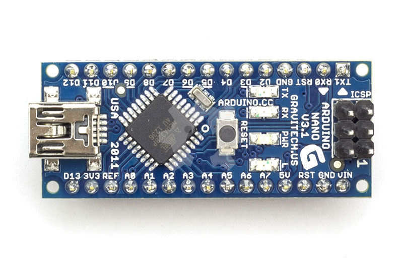
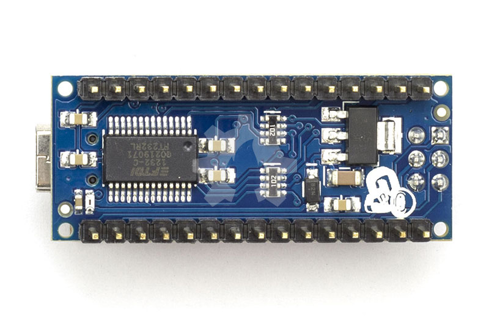
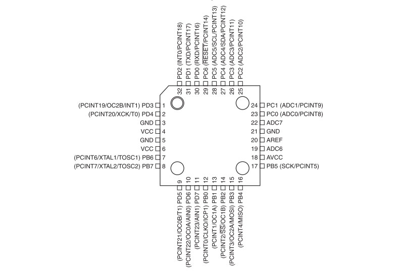
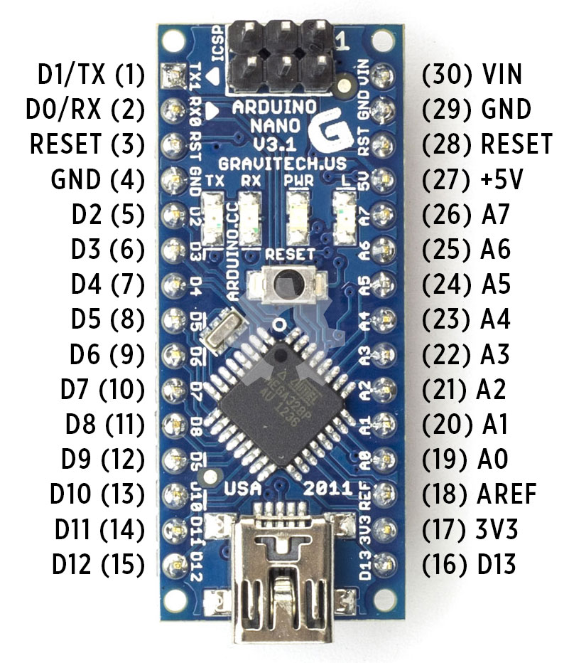

title: Mengenal Arduino Nano
description: Arduino Nano adalah papan mikrokontroler berbasis ATmega328 dikembangkan oleh Gravitech
hero: Mengenal Arduino Nano
path: tree/master/docs/papan
source: mengenal-arduino-nano.md
disqus: henduino

# Mengenal Arduino Nano

Papan pengembangan elektronika mikrokontroler yang diberi nama Arduino ini memiliki banyak sekali turunannya. Baik itu yang diturunkan langsung dari pihak Arduino sendiri atau pihak ketiga yang ikut mengembangkan papan Arduino. Hal ini karena Arduino bersifat Open Source Hardware (OSH), karena sifatnya yang terbuka ini maka membuat para pengembang tidak perlu takut dengan Hak Atas Kekayaan Intelektual. Siapapun dapat membangun papan Arduino dengan versi sendiri dan disesuaikan dengan kebutuhan sendiri atau bahkan disesuaikan dengan dana yang dimiliki, namun tetap bekerja normal layaknya papan Arduino aslinya. Salah satu papan Arduino yang dikembangkan pihak ke tiga dan dapat diterima oleh pasar dengan baik adalah Arduino Nano. Seperti apa Arduino Nano?

Arduino Nano adalah salah satu papan pengembangan mikrokontoler yang berukuran kecil, lengkap dan mendukung penggunaan breadboard. Arduino Nano diciptakan dengan basis mikrokontroler ATmega328 (untuk Arduino Nano versi 3.x) atau ATmega 168(untuk Arduino versi 2.x). Arduino Nano kurang lebih memiliki fungsi yang sama dengan Arduino Duemilanove, tetapi dalam paket yang berbeda. Arduino Nano tidak menyertakan colokan DC berjenis Barrel Jack, dan dihubungkan ke komputer menggunakan port USB Mini-B. Arduino Nano dirancang dan diproduksi oleh perusahaan [Gravitech][1].

*Gambar 1. Arduino Nano Depan*

*Gambar 2. Arduino Nano Belakang*

* * *

## Skema dan Desain

Karena Arduino Nano dibuat oleh Gravitech maka dibawah ini ada dua lampiran file tentang skema Arduino Nano. Yang keduanya identik, baik yang berasal dari situs Arduino maupun dari situs Gravitech.

* Unduh Skema (PDF) Arduino Nano versi 3.0 (ATmega328) : [skema dari Arduino][2] dan [skema dari Gravitech][3]

* Unduh Skema (EagleCAD) Arduino Nano versi 3.0 (ATmega328): [skema dari Arduino][4] dan [skema dari Gravitech][5]

* Unduh Skema (PDF) Arduino Nano versi 2.3 (ATmega168) : [skema PDF][6], [skema EagleCAD][7]

**Catatan**: Jika anda menggunakan EagleCAD versi gratis maka tidak bisa menangani layer lebih dari 2, sedangkan Arduino Nano versi 2.3 terdiri dari 4 lapisan (layer).

* * *

## Spesifikasi

Dibawah ini spesifikasi dari Arduino Nano:

| Info                        | Spesifikasi                               |
|-----------------------------|-------------------------------------------|
|Mikrokontroler|Atmel ATmega168 atau ATmega328|
|Tegangan Operasi|5V|
|Input Voltage (disarankan)|7-12V|
|Input Voltage (limit)|6-20V|
|Pin Digital I/O|14 (6 pin digunakan sebagai output PWM)|
|Pins Input Analog|8|
|Arus DC per pin I/O|40 mA|
|Flash Memory|16KB (ATmega168) atau 32KB (ATmega328) 2KB digunakan oleh Bootloader|
|SRAM|1 KB (ATmega168) atau 2 KB (ATmega328)|
|EEPROM|512 byte (ATmega168) atau 1KB (ATmega328)|
|Clock Speed|16 MHz|
|Ukuran|1.85cm x 4.3cm|

* * *

## Sumber Daya

Arduino Nano dapat diaktifkan melalui koneksi USB Mini-B, atau melalui catu daya eksternal dengan tegangan belum teregulasi antara 6-20 Volt yang dihubungkan melalui pin 30 atau pin VIN, atau melalui catu daya eksternal dengan tegangan teregulasi 5 volt melalui pin 27 atau pin 5V. Sumber daya akan secara otomatis dipilih dari sumber tegangan yang lebih tinggi. Chip FTDI FT232L pada Arduino Nano akan aktif apabila memperoleh daya melalui USB, ketika Arduino Nano diberikan daya dari luar (Non-USB) maka Chip FTDI tidak aktif dan pin 3.3V pun tidak tersedia (tidak mengeluarkan tegangan), sedangkan LED TX dan RX pun berkedip apabila pin digital 0 dan 1 berada pada posisi HIGH.

* * *

## Pemetaan Pin

Dibawah ini pemetaan pin ATmega168 pada Arduino Nano.

*Gambar 3. Pemetaan Pin ATmega168*

Perhatikan pemetaan antara pin Arduino Nano dan port ATmega168. Pemetaan untuk ATmega8, ATmega168, dan ATmega328 sangat identik atau sama persis.

*Gambar 4. Pin Layout Arduino Nano*

* * *

## Tabel Pemetaan

|No Pin ATmega328|Nama Pin ATmega328|No Pin Nano|Peta Pin Nano|
|----------------|------------------|-----------|-------------|
|1|PD3 (PCINT19/OCB2B/INT1)|6|Digital Pin 3 (PWM)|
|2|PD4 (PCINT20/XCK/T0)|7|Digital Pin 4|
|3|GND|4|GND|
|4|VCC|27|VCC|
|5|GND|4|GND|
|6|VCC|27|VCC|
|7|PB6 (PCINT6/XTAL1/TOASC1)|-|-|
|8|PB7 (PCINT7/XTAL2/TOASC2)|-|-|
|9|PD5 (PCINT21/OC0B/T1)|8|Digital Pin 5 (PWM)|
|10|PD6 (PCINT22/OC0A/AIN0)|9|Digital Pin 6 (PWM)|
|11|PD7 (PCINT23/AIN1)|10|Digital Pin 7|
|12|PB0 (PCINT0/CLK0/ICP1)|11|Digital Pin 8|
|13|PB1 (PCINT1/OC1A)|13|Digital Pin 9 (PWM)|
|14|PB2 (PCINT2/SS/OC1B)|13|Digital Pin 10 (PWM - SS)|
|15|PB3 (PCINT3/OC2A/MOSI)|14|Digital Pin 11 (PWM - MOSI)|
|16|PB4 (PCINT4/MISO)|15|Digital Pin 12 (MISO)|
|17|PB5 (PCINT5/SCK)|16|Digital Pin 13 (SCK)|
|18|AVCC|27|VCC|
|19|ADC6|25|Analog Input 6|
|20|AREF|18|AREF|
|21|GND|29|GND|
|22|ADC7|26|Analog Input 7|
|23|PC0 (PCINT8/ADC0)|19|Analog Input 0|
|24|PC1 (PCINT9/ADC1)|20|Analog Input 1|
|25|PC2 (PCINT10/ADC2)|21|Analog Input 2|
|26|PC3 (PCINT11/ADC3)|22|Analog Input 3|
|27|PC4 (PCINT12/ADC4/SDA)|24|Analog Input 4 (SDA)|
|28|PC5 (PCINT13/ADC5/SCL)|25|Analog Input 5 (SCL)|
|29|PC6 (PCINT14/RESET)|18|RESET|
|30|PD0 (PCINT16/RXD)|2|Digital Pin 0 (RX)|
|31|PD1 (PCINT17/TXD)|1|Digital Pin 1 (TX)|
|32|PD2 (PCINT18/INT0)|5|Digital Pin 2|

* * *

## Memory

ATmega168 memiliki 16 KB flash memory untuk menyimpan kode (2 KB digunakan untuk bootloader); Sedangkan ATmega328 memiliki flash memory sebesar 32 KB, (juga dengan 2 KB digunakan untuk bootloader). ATmega168 memiliki 1 KB memory pada SRAM dan 512 byte pada EEPROM (yang dapat dibaca dan ditulis dengan perpustakaan EEPROM); Sedangkan ATmega328 memiliki 2 KB memory pada SRAM dan 1 KB pada EEPROM.

* * *

## Input dan Output

Masing-masing dari 14 pin digital pada Arduino Nano dapat digunakan sebagai input atau output, dengan menggunakan fungsi `pinMode()`, `digitalWrite()`, dan `digitalRead()`. Semua pin beroperasi pada tegangan 5 volt. Setiap pin dapat memberikan atau menerima arus maksimum 40 mA dan memiliki resistor pull-up internal (yang terputus secara default) sebesar 20-50 KOhm. Selain itu beberapa pin memiliki fungsi khusus, yaitu:

* Serial : 0 (RX) dan 1 (TX). Digunakan untuk menerima (RX) dan mengirimkan (TX) TTL data serial. Pin ini terhubung ke pin yang sesuai dari chip FTDI USB-to-TTL Serial.
External Interrupt (Interupsi Eksternal): Pin 2 dan pin 3 ini dapat dikonfigurasi untuk memicu sebuah interupsi pada nilai yang rendah, meningkat atau menurun, atau perubahan nilai.

* PWM : Pin 3, 5, 6, 9, 10, dan 11. Menyediakan output PWM 8-bit dengan fungsi `analogWrite()`. Jika pada jenis papan berukuran lebih besar (misal: [Arduino Uno][12]), pin PWM ini diberi simbol tilde atau "~" sedangkan pada Arduino Nano diberi tanda titik.

* SPI : Pin 10 (SS), 11 (MOSI), 12 (MISO), 13 (SCK). Pin ini mendukung komunikasi SPI. Sebenarnya komunikasi SPI ini tersedia pada hardware, tapi untuk saat belum didukung dalam bahasa Arduino.

* LED : Pin 13. Tersedia secara built-in pada papan Arduino Nano. LED terhubung ke pin digital 13. Ketika pin diset bernilai HIGH, maka LED menyala, dan ketika pin diset bernilai LOW, maka LED padam.

Arduino Nano memiliki 8 pin sebagai input analog, diberi label A0 sampai dengan A7, yang masing-masing menyediakan resolusi 10 bit (yaitu 1024 nilai yang berbeda). Secara default pin ini dapat diukur/diatur dari mulai Ground sampai dengan 5 Volt, juga memungkinkan untuk mengubah titik jangkauan tertinggi atau terendah mereka menggunakan fungsi `analogReference()`. Pin Analog 6 dan 7 tidak dapat digunakan sebagai pin digital. Selain itu juga, beberapa pin memiliki fungsi yang dikhususkan, yaitu:

* I2C : Pin A4 (SDA) dan pin A5 (SCL). Yang mendukung komunikasi I2C (TWI) menggunakan perpustakaan Wire.
Masih ada beberapa pin lainnya pada Arduino Nano, yaitu:

* AREF : Referensi tegangan untuk input analog. Digunakan dengan fungsi `analogReference()`.

* RESET : Jalur LOW ini digunakan untuk me-reset (menghidupkan ulang) mikrokontroler. Biasanya digunakan untuk menambahkan tombol reset pada shield yang menghalangi papan utama Arduino.

* * *

## Komunikasi

Arduino Nano memiliki sejumlah fasilitas untuk berkomunikasi dengan komputer, dengan Arduino lain, atau dengan mikrokontroler lainnya. ATmega168 dan ATmega328 menyediakan komunikasi serial UART TTL (5 Volt), yang tersedia pada pin digital 0 (RX) dan pin 1 (TX). Sebuah chip FTDI FT232RL yang terdapat pada papan Arduino Nano digunakan sebagai media komunikasi serial melalui USB dan [driver FTDI][8] (tersedia pada software Arduino IDE) yang akan menyediakan COM Port Virtual (pada Device komputer) untuk berkomunikasi dengan perangkat lunak pada komputer. Perangkat lunak Arduino termasuk didalamnya serial monitor memungkinkan data tekstual sederhana dikirim ke dan dari papan Arduino. LED RX dan TX yang tersedia pada papan akan berkedip ketika data sedang dikirim atau diterima melalui chip FTDI dan koneksi USB yang terhubung melalui USB komputer (tetapi tidak untuk komunikasi serial pada pin 0 dan 1).
Sebuah perpustakaan SoftwareSerial memungkinkan komunikasi serial pada beberapa pin digital Nano. ATmega168 dan ATmega328 juga mendukung komunikasi I2C (TWI) dan SPI. Perangkat lunak Arduino termasuk perpustakaan Wire digunakan untuk menyederhanakan penggunaan bus I2C. Untuk komunikasi SPI, silakan lihat datasheet ATmega168 atau ATmega328.

* * *

## Pemrograman

Arduino Nano dapat diprogram dengan software Arduino ([Unduh perangkat lunak Arduino][9]). Pilih "Arduino Diecimila, Duemilanove, atau Nano w/ ATmega168 " or "Arduino Duemilanove atau Nano w/ ATmega328" melalui menu Tools > Board  (sesuaikan dengan jenis mikrokontroler yang anda miliki). 
ATmega168 dan ATmega328 pada Arduino Nano sudah dipaket preburned dengan bootloader yang memungkinkan Anda untuk meng-upload kode baru tanpa menggunakan programer hardware eksternal. Hal ini karena komunikasi yang terjadi menggunakan protokol asli STK500. Anda juga dapat melewati (bypass) bootloader dan program mikrokontroler melalui pin header ICSP (In-Circuit Serial Programming) menggunakan Arduino ISP atau yang sejenis.

* * *

## Reset (Software) Otomatis

Daripada menekan tombol reset sebelum upload, Arduino Nano didesain dengan cara yang memungkinkan Anda untuk me-reset melalui perangkat lunak yang berjalan pada komputer yang terhubung. Salah satu jalur kontrol hardware (DTR) mengalir dari FT232RL dan terhubung ke jalur reset dari ATmega168 atau ATmega328 melalui kapasitor 100 nanofarad. Bila jalur ini di-set rendah/low, jalur reset drop cukup lama untuk me-reset chip. Perangkat lunak Arduino menggunakan kemampuan ini untuk memungkinkan Anda meng-upload kode dengan hanya menekan tombol upload pada perangkat lunak Arduino. Ini berarti bahwa bootloader memiliki rentang waktu yang lebih pendek, seperti menurunkan DTR dapat terkoordinasi (berjalan beriringan) dengan dimulainya upload.
Pengaturan ini juga memiliki implikasi lain. Ketika Arduino Nano terhubung dengan komputer yang menggunakan sistem operasi Mac OS X atau Linux, papan Arduino akan di-reset setiap kali dihubungkan dengan software komputer (melalui USB). Dan setengah detik kemudian atau lebih, bootloader berjalan pada papan Arduino Nano. Proses reset melalui program ini digunakan untuk mengabaikan data yang cacat (yaitu apapun selain meng-upload kode baru), ia akan memotong dan membuang beberapa byte pertama dari data yang dikirim ke papan setelah sambungan terbuka.  Jika sebuah sketsa dijalankan pada papan untuk menerima satu kali konfigurasi atau menerima data lain ketika pertama kali dijalankan, pastikan bahwa perangkat lunak diberikan waktu untuk berkomunikasi dengan menunggu beberapa detik setelah terkoneksi dan sebelum mengirim data.

* * *

## Referensi
1. [Arduino Nano Board][10]
2. [Arduino Nano 3.0 with ATmega328][11]

* * *

[1]: http://www.gravitech.us/
[2]: http://arduino.cc/en/uploads/Main/ArduinoNano30Schematic.pdf
[3]: http://site.gravitech.us/Arduino/NANO30/ArduinoNano3_0schematic.pdf
[4]: http://arduino.cc/en/uploads/Main/ArduinoNano30Eagle.zip
[5]: http://site.gravitech.us/Arduino/NANO30/ArduinoNano30_Eagle.zip
[6]: http://arduino.cc/en/uploads/Main/ArduinoNanoManual23.pdf
[7]: http://gravitech.us/Arduino/Arduino_Nano_V2_3_Eagle.zip
[8]: http://www.ftdichip.com/Drivers/VCP.htm
[9]: http://arduino.cc/en/Main/Software
[10]: http://arduino.cc/en/Main/arduinoBoardNano
[11]: http://www.gravitech.us/arna30wiatp.html
[12]: https://henduino.github.io/library/papan/mengenal-arduino-uno/