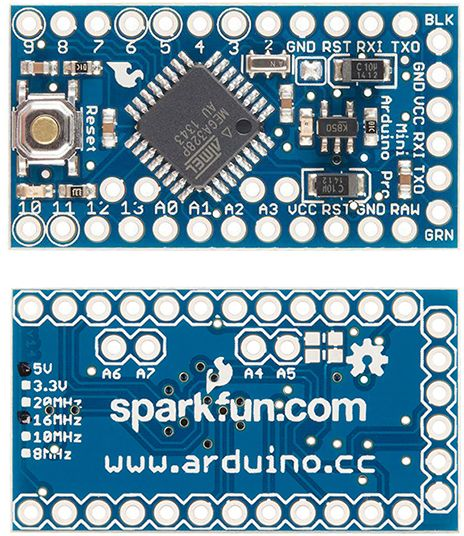
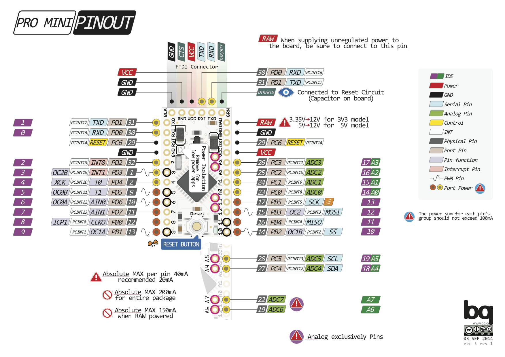

title: Mengenal Arduino Pro Mini
description: Arduino Pro Mini merupakan keluarga Arduino yang murah, sederhana dan ukurannya yang kecil membuat popularitasnya hampir mengalahkan Arduino Uno. Selain itu, Arduino Pro Mini hadir dalam 2 versi yaitu versi 3,3 Volt 8 Mhz dan versi 5 Volt 16 MHz yang membuatnya mudah untuk dipilih sesuai kebutuhan
hero: Mengenal Arduino Pro Mini
disqus: henduino

# Mengenal Arduino Pro Mini

## Arduino Pro Mini

Satu lagi anggota keluarga Arduino yang cukup populer, yaitu Arduino Pro Mini. Merupakan keluarga Arduino yang murah, sederhana dan ukurannya yang kecil membuat popularitas Arduino Pro Mini hampir mengalahkan Arduino Uno. Selain itu, Arduino Pro Mini hadir dalam 2 versi yaitu versi 3,3 Volt 8 Mhz dan versi 5 Volt 16 MHz yang membuatnya mudah untuk dipilih sesuai kebutuhan. Dimensi yang kecil membuat Arduino Pro Mini bisa langsung ditanamkan pada proyek-proyek robotika. Kelemahan Arduino Pro Mini adalah tidak ditanamkannya USB Adapter pada papan sehingga para pengguna harus menyediakan sendiri USB Adapter terpisah.

Arduino Pro Mini adalah sebuah papan mikrokontroler berbasis ATmega168 ([datasheet][1]) pada mulanya, namun kemudian ditingkatkan lagi menggunakan ATmega328. Pro Mini memiliki 14 pin digital input/output (yang mana 6 pin digunakan sebagai ouput PWM), 8 pin input analog, sebuah resonator, sebuah tombol reset, dan lubang-lubang untuk memasang kepala pin. Terdapat 6 kepala pin yang dapat dihubungkan ke kabel FTDI atau ke kabel USB Adapter lainnya untuk memberikan tegangan dari USB dan berkomunikasi antara komputer dengan Arduino Pro Mini. Arduino Pro Mini tidak dapat langsung dihubungkan ke komputer karena Pro Mini tidak memiliki USB Adapter terintegrasi sehingga para pengguna diwajibkan menyediakan USB Adapter tersendiri. Ada beberapa USB Adapter yang tersedia di pasaran dari mulai yang mahal hingga yang termurah. Penggunan bisa menggunakan USB Adapter dengan chip ATmega16U2, FTDI, CP1202, atau CH340. Pada dasarnya Arduino Pro Mini hanyalah breakout dari chip ATmega168/ATmega328 hanya saja dilengkapi dengan beberapa komponen pelengkap.

Pro Mini dibuat dengan tujuan sebagai papan yang dipasang didalam objek semi-permanen atau sekedar sebagai pertunjukan. Papan Pro Mini pada umumnya dijual tanpa pin kepala yang terpasang pada lubang, hal ini memberikan keleluasaan kepada para penggunanya untuk memasang pin kepala sesuai keinginannya atau bahkan langsung dihubungkan ke kabel. Dipasaran ada 2 versi papan Pro Mini. Jenis pertama yang bekerja pada tegangan 3,3 Volt dengan pewaktu 8 MHz, sedangkan papan lainnya bekerja pada tegangan 5 Volt dengan pewaktu 16 MHz. Pinout Arduino Pro Mini sama dengan Pinout Arduino Mini hanya saja ukuran papan yang berbeda. Papan Arduino Pro Mini dibuat dan dikembangkan oleh perusaahaan SparkFun Electronics.

*Gambar 1. Arduino Pro Mini*

***

## Skema & Referensi Desain

Dibawah ini Skema dan Referensi Arduino Pro Mini:

* Skema Arduino Pro Mini EagleCAD : [arduino-pro-mini-reference-design.zip][2]
* Skema Arduino Pro Mini PDF : [Arduino-Pro-Mini-schematic.pdf][3]

## Ringkasan Spesifikasi

Dibawah ini spesifikasi sederhana dari Arduino Pro Mini:

| Mikrokontroler      | ATmega168/ATmega328                                                      |
|---------------------|--------------------------------------------------------------------------|
| Tegangan Operasi    | 3V atau 5V (tergantung model)                                            |
| Input Voltage       | 5 - 12V                                                                  |
| Pin Digital I/O     | 14 (6 pin sebagai output PWM)                                            |
| Pins Input Analog   | 8                                                                        |
| Arus DC per pin I/O | 40 mA                                                                    |
| Flash Memory        | 16 KB (ATmega168) dan 32KB (ATmega328) (2 KB digunakan untuk bootloader) |
| SRAM                | 1 KB (ATmega168) atau 2KB (ATmega328)                                    |
| EEPROM              | 512 Byte (ATmega168) atau 1KB (ATmega328)                                |
| Clock Speed         | 8MHz (model 3V) atau 16 MHz (model 5V)                                   |

***

## Sumber Daya

Arduino Pro Mini dapat diberi tegangan dari USB Adapter yang dihubungkan pada 6 kepala pin, atau dari tegangan luar yang teregulasi sebesar 3,3 Volt atau 5 Volt (tergantung pada model) melalui pin VCC. Jika pengguna ingin memberikan tegangan sumber yang tidak teregulasi ke dalam papan, pastikan untuk menghubungkannya ke pin "RAW" dan BUKAN ke pin VCC. Jika melalui pin RAW terdapat regulator tegangan terintegrasi didalam papan Arduino Pro Mini yang dapat menerima tegangan maksimal 12 VDC. 

Pin untuk sumber daya yang tersedia adalah sebagai berikut:

* **VCC** : Terdapat 2 pin VCC. Pin ini untuk memberikan tegangan pada papan yang berasal dari USB Adapter, dari baterai atau sumber tegangan lain yang sudah teregulasi 3,3 Volt atau 5 Volt tergantung model papan.
* **RAW** : Untuk memberikan tegangan belum teregulasi pada papan yang bersumber dari luar dengan tegangan maksimal sebesar 12 VDC.
* **GND** : Pin untuk ground atau massa.

***

## Memori

ATmega168 memiliki 16 KB flash memory untuk menyimpan kode (yang mana 2 KB digunakan untuk menyimpan bootloader). 1KB untuk SRAM dan 512 Byte untuk EEPROM (yang dapat dibaca dan ditulis dengan menggunakan perpustakaan EEPROM). Sedangkan yang menggunakan ATmega328 memiliki 32 KB flash memory, 2 KB untuk SRAM, dan 1KB untuk EEPROM.

***

## Input dan Output

Masing-masing dari 14 pin digital pada Arduino Pro Mini dapat digunakan sebagai input atau output, dengan menggunakan fungsi `pinMode()`, `digitalWrite()`, dan `digitalRead()`. Semua pin beroperasi pada tegangan 3,3 volt atau 5 volt tergantung model papan. Setiap pin dapat memberikan atau menerima arus maksimum 40 mA dan memiliki resistor pull-up internal (terputus secara default) sebesar 20-50 kOhm. Selain itu beberapa pin memiliki fungsi khusus, yaitu:

* **Serial** : 0 (RX) dan 1 (TX). Digunakan untuk menerima (RX) dan mengirimkan (TX) data serial TTL. Pin ini terhubung ke pin TX-0 dan RX-1 ke 6 kepala pin yang dihubungkan ke USB Adapter.
* **External Interrupt** (Interupsi Eksternal): Pin 2 dan pin 3 ini dapat dikonfigurasi untuk memicu sebuah interupsi pada nilai yang rendah, meningkat atau menurun, atau perubahan nilai. Baca rincian fungsi attachInterrupt().
* **PWM** : Pin 3, 5, 6, 9, 10, dan 11. Menyediakan output PWM 8-bit dengan fungsi `analogWrite()`.
* **SPI** : Pin 10 (SS), 11 (MOSI), 12 (MISO), 13 (SCK). Pin ini mendukung komunikasi SPI menggunakan perpustakaan SPI.
* **LED** : Pin 13. Tersedia secara terintegrasi pada papan. LED terhubung ke pin digital 13. Ketika pin diset bernilai HIGH, maka LED menyala, dan ketika pin diset bernilai LOW, maka LED padam.
* **ANALOG** : Arduino Pro Mini memiliki 8 pin sebagai input analog, diberi label A0 sampai dengan A7, yang masing-masing menyediakan resolusi 10 bit (yaitu 1024 nilai yang berbeda). Secara default pin ini dapat diukur dari Ground ke VCC. 4 Pin terdapat pada bagian pinggir papan (A0 - A3), 2 pin (A4 dan A5) terdapat pada bagian dalam papan. Sedangkan 2 pin (A6 dan A7) pada beberapa model tidak dikeluarkan, namun pada model terbaru sudah tersedia. 

Selain itu juga, beberapa pin memiliki fungsi yang dikhususkan, yaitu pin:

* **TWI** : Pin A4 atau SDA dan pin A5 atau SCL. Yang mendukung komunikasi TWI menggunakan perpustakaan Wire.
* **RESET** : Jalur LOW ini digunakan untuk me-reset (menghidupkan ulang) mikrokontroler. Jalur ini biasanya digunakan untuk menambahkan tombol reset pada shield yang menghalangi papan utama Arduino atau ingin meletakan tombol reset di area lain.

***

## Pemetaan Pin

Perhatikan tabel pemetaan antara pin ATmega168/ATmega328 dengan pin Arduino. Pemetaan untuk ATmega8, 168, dan 328 sangat identik.

| PIN | ATmega            | ARDUINO                   |
|-----|-------------------|---------------------------|
| 1   | PD3 (INT1)        | Digital Pin 3 (PWM)       |
| 2   | PD4 (XCK/T0)      | Digital Pin 4             |
| 3   | GND               | GND                       |
| 4   | VCC               | VCC                       |
| 5   | GND               | GND                       |
| 6   | VCC               | VCC                       |
| 7   | PB6 (XTAL1/TOSC1) |                           |
| 8   | PB7 (XTAL2/TOSC2) |                           |
| 9   | PD5 (T1)          | Digital Pin 5 (PWM)       |
| 10  | PD6 (AIN0)        | Digital Pin 6 (PWM)       |
| 11  | PD7 (AIN1)        | Digital Pin 7             |
| 12  | PB0 (ICP)         | Digital Pin 8             |
| 13  | PB1 (OC1A)        | Digital Pin 9 (PWM)       |
| 14  | PB2 (SS/OC1B)     | Digital Pin 10 (SS/PWM)   |
| 15  | PB3 (MOSI/OC2)    | Digital Pin 11 (MOSI)     |
| 16  | PB4 (MISO)        | Digital Pin 12 (MISO/PWM) |
| 17  | PB5 (SCK)         | Digital Pin 13 (SCK)      |
| 18  | AVCC              |                           |
| 19  | ADC6              | Analog Pin 6              |
| 20  | AREF              |                           |
| 21  | GND               | GND                       |
| 22  | ADC7              | Analog Pin 7              |
| 23  | PPC0 (ADC0)       | Analog Pin 0              |
| 24  | PC1 (ADC1)        | Analog Pin 1              |
| 25  | PC2 (ADC2)        | Analog Pin 2              |
| 26  | PC3 (ADC3)        | Analog Pin 3              |
| 27  | PC4 (ADC4/SDA)    | Analog Pin 4 (SDA)        |
| 28  | PC5 (ADC5/SCL)    | Analog Pin 5 (SCL)        |
| 29  | PC6 (RESET)       | RESET                     |
| 30  | PD0 (RXD)         | Digital Pin 0 (RX)        |
| 31  | PD1 (TXD)         | Digital Pin 1 (TX)        |
| 32  | PD2 (INT0)        | Digital Pin 2             |

***
## Pinout

Dibawah ini gambar pinout Arduino Pro Mini.

*Gambar 2. Pinout Arduino Pro Mini*

***

## Komunikasi

Arduino Pro Mini memiliki sejumlah fasilitas untuk berkomunikasi dengan komputer, dengan Arduino lain, atau dengan mikrokontroler lainnya. ATmega168 dan ATmega328 menyediakan komunikasi serial UART TTL, yang tersedia pada pin digital 0 (RX) dan pin 1 (TX). Software Arduino IDE menyertakan sebuah serial monitor yang akan menampilkan data tekstual sederhana yang dikirim dari dan ke Papan Arduino melalui koneksi USB.
Perpustakaan SoftwareSerial memungkinkan komunikasi serial pada beberapa pin digital Pro Mini. ATmega168 dan ATmega328 juga mendukung komunikasi I2C (TWI) dan SPI. Perangkat lunak Arduino termasuk perpustakaan Wire digunakan untuk menyederhanakan penggunaan bus I2C. Sedangkan untuk komunikasi SPI, menggunakan perpustakaan SPI.

***

## Pemrograman

Arduino Pro Mini dapat diprogram dengan software Arduino ([Unduh perangkat lunak Arduino][4]). (Mengenai pemahasan lebih rinci tentang perangkat lunak Arduino akan dibahas pada artikel terpisah). ATmega 168 dan ATmega328 pada Arduino Pro Mini didalamnya sudah tersedia preburned dengan bootloader yang memungkinkan pengguna untuk meng-upload kode baru tanpa menggunakan hardware pemrograman eksternal. Hal ini karena komunikasi yang terjadi menggunakan protokol asli STK500. Anda juga dapat melewati (bypass) bootloader dan memprogram mikrokontroler melalui pin header ICSP (In-Circuit Serial Programming).

***

## Reset (Software) Otomatis

Daripada menekan tombol reset sebelum upload, Arduino Pro Mini didesain dengan cara yang memungkinkan Anda untuk me-reset melalui perangkat lunak yang berjalan pada komputer yang terhubung. Salah satu pin dari 6 kepala pin dihubungkan ke jalur reset ATmega168/ATmega328 melalui kapasitor 100 nanofarad. Pin ini akan terhubung secara langsung pada jalur hardware dari USB Adapter: terhubung dengan jalur RTS jika menggunakan FTDI atau DTR jika menggunakan USB Adapter lainnya. Bila jalur ini di-set rendah/low, jalur reset drop cukup lama untuk me-reset chip. Perangkat lunak Arduino menggunakan kemampuan ini untuk memungkinkan Anda meng-upload kode dengan hanya menekan tombol upload pada perangkat lunak Arduino. Ini berarti bahwa bootloader memiliki rentang waktu yang lebih pendek, seperti menurunkan DTR dapat terkoordinasi (berjalan beriringan) dengan dimulainya upload.

Pengaturan ini juga memiliki implikasi lain. Ketika Arduino Pro Mini terhubung dengan komputer yang menggunakan sistem operasi Mac OS X atau Linux, papan Arduino akan di-reset setiap kali dihubungkan dengan software komputer (melalui USB). Dan setengah detik kemudian atau lebih, bootloader berjalan pada papan Arduino Pro Mini. Proses reset melalui program ini digunakan untuk mengabaikan data yang cacat (yaitu apapun selain meng-upload kode baru), ia akan memotong dan membuang beberapa byte pertama dari data yang dikirim ke papan setelah sambungan dibuka. Jika sebuah sketsa dijalankan pada papan untuk menerima satu kali konfigurasi atau menerima data lain ketika pertama kali dijalankan, pastikan bahwa perangkat lunak diberikan waktu untuk berkomunikasi dengan menunggu satu detik setelah terkoneksi dan sebelum mengirim data.

***

## Karakteristik Fisik

Panjang dan lebar maksimum PCB Arduino Pro Mini adalah 0.7" x 1.3" (1.778 x 3,302 cm), dengan 6 pin kepala untuk dihubungkan ke USB Adapter menonjol melampaui batas dimensi. Jarak antar pin adalah 100 mil.

***

## Daftar Pustaka

* [Arduino Pro Mini][5], Arduino (Halaman diakses pada tanggal 20 September 2016, 0:01 AM)
* [Arduino Pro Mini][6], Sparkfun (Halaman diakses pada tanggal 20 September 2016, 0:01 AM)

***

[1]: http://ww1.microchip.com/downloads/en/DeviceDoc/Atmel-9365-Automotive-Microcontrollers-ATmega88-ATmega168_Datasheet.pdf
[2]: http://arduino.cc/en/uploads/Main/arduino-pro-mini-reference-design.zip
[3]: http://arduino.cc/en/uploads/Main/Arduino-Pro-Mini-schematic.pdf
[4]: https://www.arduino.cc/en/Main/Software
[5]: http://arduino.cc/en/Main/ArduinoBoardProMini
[6]: https://www.sparkfun.com/products/11113