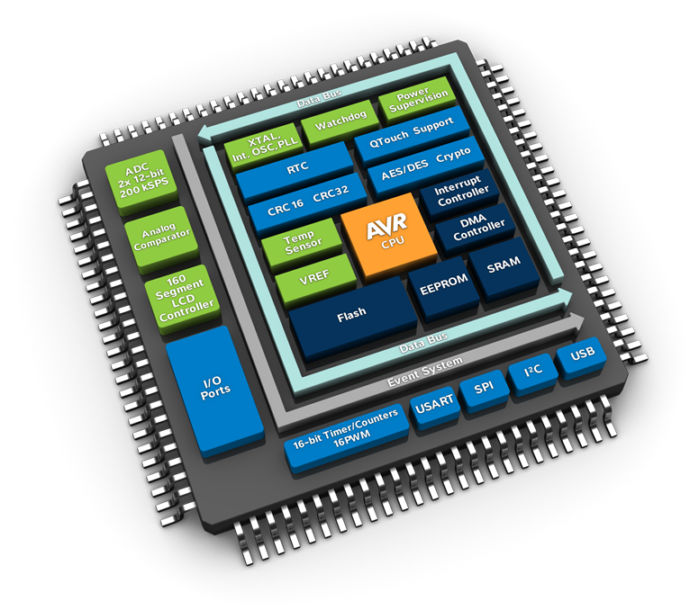
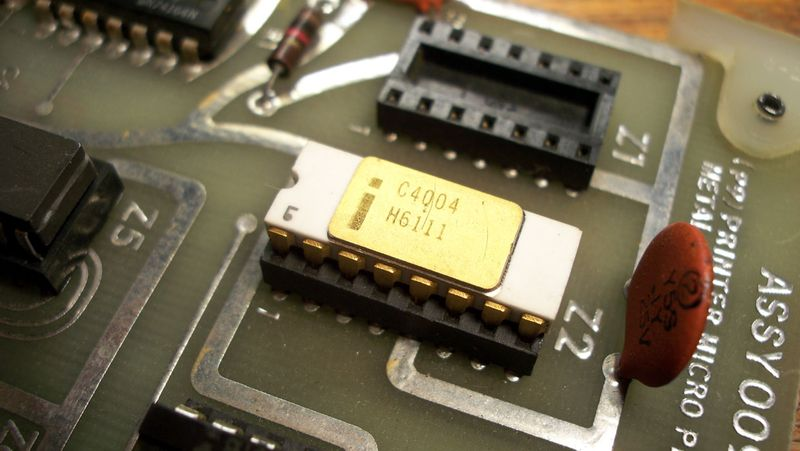
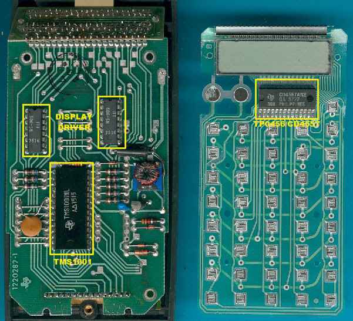
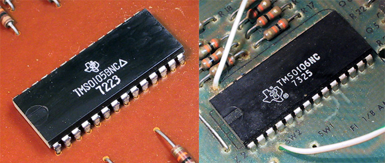
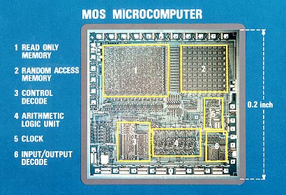
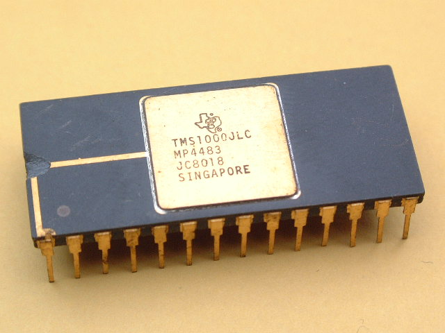
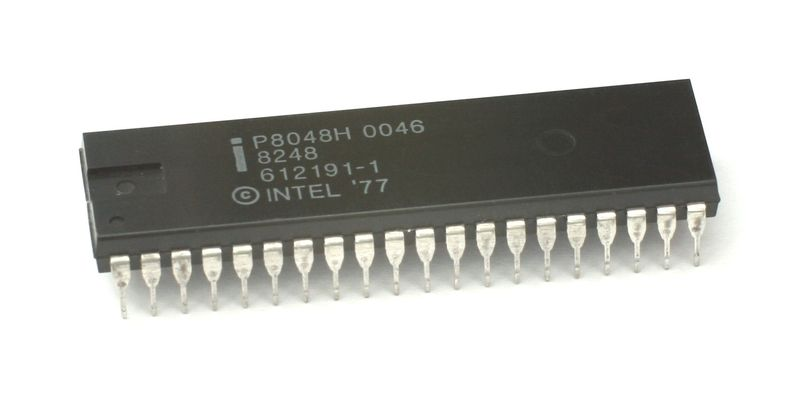
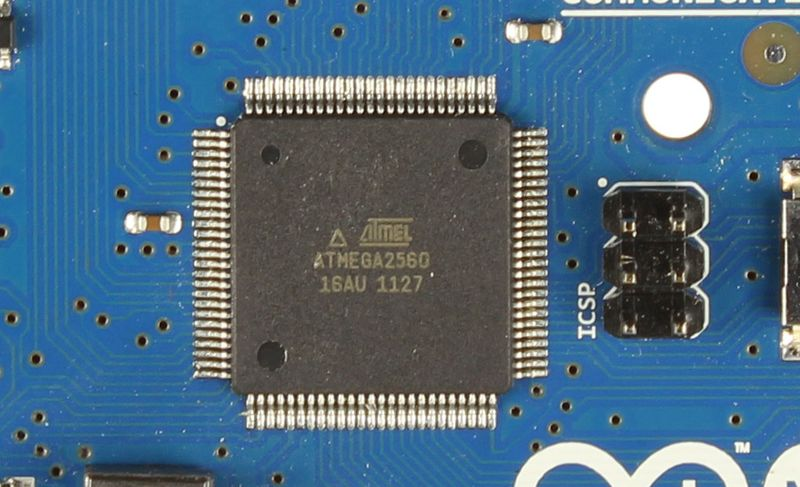
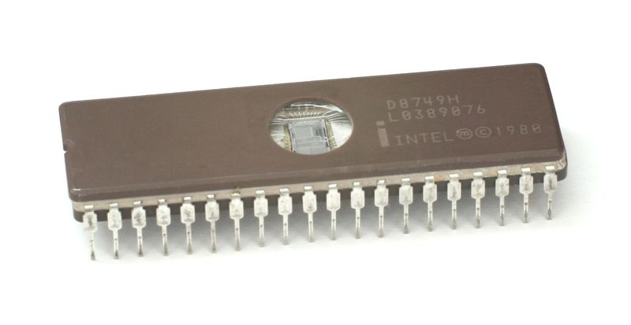

title: Mengenal Mikrokontroler
description: Mikrokontroler atau MCU (singkatan dari Microcontroller Unit) atau ada juga yang menyebut Mikrokomputer adalah komputer kecil pada sirkuit terpadu (IC) tunggal yang didalamnya berisi inti prosesor, memori, dan periferal Input/Output terprogram
hero: Mengenal Mikrokontroler
path: tree/master/docs/papan
source: mikrokontroler.md
disqus: henduino

# Mengenal Mikrokontroler

Memang cukup membingungkan ketika mendengar istilah Mikrokontroler dan Mikroprosesor. Bagi para pengguna yang masih awam kedua istilah diatas dianggap sama, bahkan ada yang menganggap hanya beda istilah saja. Anggapan tersebut tidak salah 100% namun juga tidak benar 100%. Mikrokontroler dan Mikroprosesor adalah dua benda yang beda target penggunaan, beda kelengkapan fungsinya dan beda perusahaan yang awal menciptakan, namun berangkat dari ide yang sama, arsitektur yang sama, bahkan dari tahun lahir yang hampir sama pula. Lalu apa sebenarnya Mikrokontroler dan Mikroprosesor?

Dalam dunia komputer dan mikroelektronik, banyak pengguna yang menghabiskan banyak dana untuk memiliki Mikroprosesor. Sebagian besar orang mengabaikan sebuah penemuan penting yang sempat mencapai kejayaann pada masanya, penemuan itu adalah Mikrokontroler. Kita tidak menyadari bahwa disekitar rumah kita, ada sekitar 5 hingga 20 perangkat elektronik yang dikendalikan oleh Mikrokontroler. Begitulah faktanya, karena lebih dari 2 miliar Mikrokontroler diproduksi setiap tahunnya. Hal ini berarti, sangat tidak mungkin manusia di era sekarang ini hidup tanpa Mikrokontroler.
Mikrokontroler merupakan kepingan komputer terintegrasi yang mengendalikan sebagian besar perangkat elektronik disekitar kita yang hampir setiap hari digunakan, dari mulai gadget, mesin cuci, mesin pembuat kopi, remote kontrol, mainan anak-anak, televisi, hingga ke kendaraan. Lalu bagaimana ide tentang Mikrokontroler dan Mikroprosesor ini muncul? Lalu siapa yang pertama kali membuatnya?

* * *

## Mikrokontroler

Mikrokontroler atau MCU (singkatan dari Microcontroller Unit) atau ada juga yang menyebut Mikrokomputer adalah komputer kecil pada sirkuit terpadu (IC) tunggal yang didalamnya berisi inti prosesor, memori, dan periferal Input/Output terprogram. Program memori dalam bentuk Ferroelectric RAM, NOR flash atau OTP ROM juga sering ditanamkan didalam kepingan Mikrokontroler, serta sejumlah kecil RAM. Karena itulah, Mikrokontroler dapat berdiri sendiri untuk menjalankan suatu fungsi tanpa perlu bantuan perangkat penunjang kinerja.

*Gambar 1. Blok Diagram Mikrokontroler*

Sangat kontras dengan Mikroprosesor yang membutuhkan perangkat eksternal sebagai penunjang kinerja agar bisa menjalankan suatu fungsi. Perangkat penunjang kinerja tersebut misalnya; RAM, ROM, chip Input/Output (BIOS), dan lain sebagainya. Yang kesemuanya itu adalah perangkat terpisah yang dihubungkan ke Mikroprosesor dengan sebuah perantara (biasanya ada di motherboard).

* * *

## Sejarah Mikrokontroler

Selama kurun waktu 1970 hingga 1971, perusahaan Intel sedang bersemangat untuk menciptakan Mikroprosesor pertama didunia. 1971 Intel merilis Mikroprosesor pertamanya yaitu Intel 4004 4-bit, kemudian diikuti Intel 8008 dan beberapa Mikroprosesor yang lebih mumpuni tersedia dipasaran beberapa tahun berikutnya. Namun, kedua Mikroprosesor tersebut membutuhkan perangkat eksternal lain untuk dapat bekerja menjalankan suatu fungsi dan ini tentunya akan meningkatkan biaya total pembuatan suatu perangkat, sehingga sangat mustahil menciptakan peralatan komputerisasi yang ekonomis. Gary Boone dan Michael Cochran, insinyur di Texas Instruments bekerja pada konsep yang hampir sama dengan Intel diawal-awal tahun 1970-an.

*Gambar 2. Mikroprosesor Intel 4004, 1971*

Pada mulanya bisnis di Departemen MOS Texas Instruments adalah bisnis yang sesuai pesanan, dimana perusahaan seperti halnya pabrik kalkulator desktop datang ke Texas Instruments dengan beberapa set pengajuan spesifik. Texas Instruments kemudian mengkonversi spesifikasi tersebut ke dalam kepingan chip terpisah, yang terdiri dari empat, lima atau enam chip untuk menjalankan atau melaksanakan suatu spesifikasi dari perusahaan-perusahaan populer seperti Canon, Olympia, atau Olivetti. Untuk perusahaan-perusahaan tersebut, pekerjaan Texas Instruments sangatlah menakjubkan karena mampu memberikan pelayanan yang memuaskan dengan menekan banyak unit hanya menjadi sekitar empat, lima atau enam chip saja. Saat itu teknologi yang sangat populer adalah TTL, yang membutuhkan sekitar 100 hingga 200 chip. Sangat wajar jika bisnis ini merupakan bisnis yang menggairahkan bagi Texas Instruments.

*Gambar 3. Kalkulator Texas Instruments, 1974*

Selama waktu itu Gary Boone melakukan penelitian yang lebih luas dengan melibatkan beberapa orang dari negara lain seperti Jerman, Itali, dan dari beberapa negara lainnya. Mereka mencoba memahami kebutuhkan pelanggan-pelanggan baru dan menyelesaikan pesanannya. Boone pada akhirnya merasa bosan setelah melakukan hal tersebut berulang kali. Selain itu, sejak proyek-proyek sebelumnya berhasil dan mereka memiliki sekumpulan pelanggan-pelanggan setia, pelanggan-pelanggan baru meminta pekerjaan yang sama seperti yang orang lain pesan ditahun-tahun sebelumnya. Sehingga, ini berarti menjadi tuntutan untuk melakukan hal yang sama, lagi dan lagi pada setiap proyek yang dikerjakan.

Aturan umum di Texas Instruments adalah "one riot, one ranger" yang berarti "satu chip, satu insinyur". Jadi, jika Texas Instruments memiliki 12 insinyur desainer MOS maka mereka di pecah menjadi tiga atau empat bagian untuk mengerjakan satu proyek diwaktu yang sama. Dan itu membutuhkan waktu sekitar enam bulan untuk menyelesaikan satu proyek. Oleh karena itu, kapasitas bisnis adalah jumlah insinyur di bagi jumlah chip, satu kasus dalam setiap enam bulan. Walaupun permintaan dari masing-masing proyek berbeda secara detail, namun pada prinsip umum semua proses pekerjaan adalah sama saja. Hal ini membuat para insinyur merasa lelah untuk mengerjakan proyek-proyek yang monoton. Mereka bekerja dalam jangka waktu yang cukup lama dan mereka merasa telah melakukan yang terbaik untuk menyelesaikan suatu proyek.

Boone dan para insinyur akhirnya memikirkan acuan satu arah yang dibutuhkan konsumen dan potongan rangkaian atau blok-blok fungsi dengan metode lain. Boone dapat menemukan penggunaan komponen yang sama, ia dan yang lainnya mempertimbangkan gagasan simulasi, "Baiklah, mungkin jika sekarang kita memiliki beberapa byte didalam penyimpanan data, beberapa byte didalam penyimpanan program, dan memiliki beberapa bit untuk memindai antarmuka keyboard, maka itu akan mencakup semua spesifikasi yang kira-kira saya ketahui". Sebagai penemuan terbaik dari gagasan ini maka lahirlah kepingan Mikrokontroler yang petama kali, tepatnya di bulan September 1971 yaitu TMS0100.

*Gambar 4. Mikrokontroler Pertama TMS0100*

Salah satu aspek teknis yang penting sekali adalah bahwa desain teknologi pada saat itu sangat tidak efisien dalam memanfaatkan silicon. Arsitektur yang berbeda kemudian harus dipilih sehingga struktur lebih teratur dan penggunaan memori lebih ditekan, selain itu, pitch-matching juga harus diberi penekanan sehingga konsep bit-slice cocok di berbagai kebutuhan pada masing-masing 4 bit dari penambah 4 bit ditata menjadi dimensi yang sama dalam hal fisik. Hanya dengan itu akan ada kecocokan dan keselarasan didalam pitch. Pada akhirnya, faktor lain dari tiga atau empat dalam hal kepadatan silikon akan tercapai. Terlepas dari kendala arsitektur terutama pada orientasi memori dan pitch-matching, kemudian Mikrokontroler diciptakan lebih baik dari pada teknologi sebelumya (disebut TTL) dan akhirnya mampu memaksimalkan penggunaan silicon yang lebih efisien.

*Gambar 5. Bagian Mikrokontroler*

TMS0100 merupakan kepingan tunggal yang digunakan untuk mengendalikan mesin kalkulator. Setelah Mikrokontroler pertama ini berhasil, Gary Boone dan Michael Cochran kemudian mengembangkan desainnya, lahirlah turunan TMS0100 yaitu TMX1795. Pada tanggal 31 Agustus 1971, Boone mendaftarkan hak paten hasil penemuannya untuk mesin pengolah kepingan tunggal (single-chip). Tanggal 4 September 1973, Gary Boone memperoleh penghargaan U.S. Patent 3,757,306.

Berbekal pengalaman selama proses pembuatan TMS0100 dan Prototipe Mikrokontroler 8-bit buatannya, Boone kemudian mendesain Mikrokontroler 4-bit seri TMS1000. Boone memperoleh penghargaan U.S. Patent 4,074,351 untuk penemuan Mikrokontroler Modern.

Setelah dilakukan beberapa perbaikan kecil, Texas Instruments merilis mikrokontroler TMS1000 untuk dijual ke industri elektronik di tahun 1974. Mikrokontroler ini tersedia dalam berbagai konfigurasi ukuran ROM dan RAM. Keluarga TMS1000 dijual kepasaran dengan harga murah, sehingga meraih sukses besar dan disukai oleh industri elektronika saat itu. Selain karena harganya yang murah, keluarga TMS1000 dapat diprogram untuk melakukan fungsi yang berbeda, sehingga beberapa industri elektronik saat itu menciptakan banyak produk seperti oven microwave, video permainan, mesin cuci, jukebox, mainan anak-anak, alat-alat, permainan dan ratusan produk elektronik lainnya. Sampai tahun 1983, keluarga TMS1000 terjual lebih dari 100 juta keping. Wow!!!

*Gambar 6. Mikrokontroler TMS1000, 1974*

* * *

## Mikrokontroler Seri TMS1000

Setelah kesuksesan TMS1000 dipasaran, Texas Instruments kemudian mengembangkan keluarga TMS1000 menjadi beberapa varian seperti pada tabel dibawah ini:

|Nomor Seri|ROM|RAM|I/O Pin|Teknologi|Catatan|
|----------|---|---|-------|---------|-----------------|
|TMS1000|1KB|64x4|23|pMOS|-|
|TMS1000C|1KB|64x4|23|CMOS|Identik dengan TMS1000, CMOS|
|TMS1018|-|64x4|4|pMOS|-|
|TMS1070|1KB|64x4|-|pMOS|Built-in VF display controller|
|TMS1098|-|128x4|-|pMOS|-|
|TMS1099|-|64x4|-|pMOS|-|
|TMS1099C|-|64x4|-|CMOS|Identik dengan TMS1099, CMOS|
|TMS1100|2KB|128x4|-|pMOS|-|
|TMS1117|2KB|128x4|-|pMOS|-|
|TMS1200|1KB|64x4|-|pMOS|-|
|TMS1200C|1KB|64x4|-|CMOS|Identik dengan TMS1200, CMOS|
|TMS1270|1KB|64x4|-|pMOS|-|
|TMS1300|2KB|128x8|23|pMOS|-|
|TMS1400|4KB|128x4|22|pMOS|-|
|TMS1600|4KB|128x4|33|pMOS|-|
|TMS1700|512B|32x4|21|pMOS|-|
|TMS2000|1KB|64x4|-|nMOS|versi nMOS untuk TMS1000|
|TMS2100|2KB|128x4|-|nMOS|versi nMOS untuk TMS1100|
|TMS2200|1KB|64x4|-|nMOS|versi nMOS untuk TMS1200|
|TMS2300|2KB|128x4|-|nMOS|versi nMOS untuk TMS1300|
|TMS2098|-|128x4|-|nMOS|Contoh Developer|
|TMS2099|-|164x4|-|nMOS|Contoh Developer|

* * *

## Mikrokontroler Intel
Disisi perusahaan lain, sebagai tanggapan terhadap keberadaan kepingan tunggal Mikrokontroler TMS1000, Intel tidak mau ketinggalan mengembangkan Mikrokontroler. Intel mengembangkan sistem komputer pada chip yang dioptimalkan untuk aplikasi kontrol, maka lahirlah Mikrokontroler Intel pertama yaitu Intel 8048 (termasuk 8048, 8035, dan 8749). Seri MCS-48 termasuk didalamnya Intel 8048 dirilis ke pasar pada tahun 1976, 2 tahun lebih lambat dari pada TMS1000. Intel 8048 menggabungkan RAM dan ROM didalam satu kepingan, menggunakan teknologi NMOS, dan menggunakan arsitektur Harvard yang telah dimodifikasi. Chip ini ditanamkan sebagai pengendali pada Keyboard PC produk IBM. Chip ini akan ditemukan didalam 1 miliar keyboard PC dan berbagai aplikasi lainnya. Pada saat itu Presiden Intel, Lukas J. Valenter, menyatakan bahwa mikrokontroler ini adalah salah satu yang paling sukses dalam sejarah perusahaan Intel, dan anggaran divisi ini ditambah lebih dari 25%.

*Gambar 7. Mikrokontroler Intel 8048, 1977*

Pada tahun 1980, Intel kembali memperkenalkan seri MCS-51, termasuk didalamnya Mikrokontroler 8051 dengan teknologi CMOS dan ini menjadi Mikrokontroler paling populer yang digunakan. Bahkan Intel 8051 digunakan hingga hari ini, sehingga menjadi salah satu Mikrokontroler yang berumur panjang.

* * *

## Embedded Design

Sebuah mikrokontroler dapat dianggap sebagai sistem mandiri dengan prosesor, memori dan periferal dan dapat digunakan sebagai sistem embedded (sistem-tertanam). Mayoritas mikrokontroler yang digunakan saat ini tertanam di mesin secara langsung, seperti di mobil, telepon, peralatan, dan peripheral untuk sistem komputer. Sementara beberapa embedded system yang sangat canggih, banyak memiliki persyaratan minimal untuk memori dan panjang program, dengan tidak ada sistem operasi, dan kompleksitas perangkat lunak yang rendah. Perangkat khusus input dan output meliputi switch, relay, solenoid, LED , Layar LCD kecil, perangkat frekuensi radio, dan sensor-sensor untuk data seperti suhu, kelembaban, tingkat cahaya dan lain-lain. Embedded sistem biasanya tidak memiliki keyboard, layar, disk, printer, atau perangkat lain yang biasa ditemukan di I/O dari komputer pribadi, dan mungkin tidak memiliki perangkat interaksi manusia apapun.

*Gambar 8. Arduino Mega2560*

* * *

## Erasable Programmable Memory

Sekitar tahun 1990, mikrokontroler terus dikembangkan, salah satu teknologi yang cukup populer adalah Erasable Programmable ROM (EPROM), yaitu memori yang dapat dihapus dan diprogram ulang. Mikrokontroler ini memiliki jendela kaca transparan pada bagian atasnya, jika bagian ini terpapar sinar ultraviolet maka memori akan terhapus. Tipe ini biasanya digunakan hanya sebagai prototipe. Tipe lainnya adalah Programmed ROM oleh produsen, varian PROM hanya bisa diprogram sekali. Varian ini di tandai dengan penunjukan OTP (one-time programmable). PROM adalah jenis yang sama seperti halnya EPROM, tetapi karena tidak ada cara untuk memasukan sinar ultraviolet kedalam chip, maka memori tidak dapat dihapus. Versi yang bisa dihapus memerlukan jendela kuarsa, membuat versi ini lebih mahal dibandingkan versi OTP yang biasanya terbuat dari plastik buram.

*Gambar 9. Intel 8749 UV EPROM, 1980*

Tahun 1993, pengenalan memori jenis EEPROM (Electrically Erasable Programmable ROM) yang memungkinkan memori mikrokontroler dihapus dengan cepat secara elektris tanpa paket yang mahal seperti halnya EPROM, membuat proses prototipe lebih cepat dan In System Programming. Teknologi ini diawali oleh perusahaan Microchip pada chip seri PIC16x84. Teknologi EEPROM telah tersedia sebelumnya, tapi EEPROM sebelumnya lebih mahal dan kurang tahan lama, sehingga tidak cocok untuk mikrokontroler berbiaya murah dan diproduksi secara massal. Pada tahun yang sama, perusahaan Atmel memperkenalkan mikrokontroler pertama yang menggunakan Flash Memory, khusus jenis EEPROM. Kemudian perusahaan lain dengan cepat mengikuti, dengan menggunakan kedua jenis memori tersebut.

* * *

## Interupsi

Mikrokontroler harus menyediakan real-time (dapat ditebak, meskipun tidak harus cepat) untuk menanggapi peristiwa dalam sistem tertanam yang mereka kendalikan. Bila ada kejadian tertentu, sebuah sistem interupsi mendapatkan sinyal dari prosesor untuk menangguhkan pengolahan urutan instruksi saat ini dan untuk memulai layanan interupsi rutin (ISR, atau "interrupt handler") yang akan melakukan proses pengolahan dibutuhkan berdasarkan sumber interrupt, sebelum kembali ke urutan instruksi asli.
Sumber interrupt mungkin perangkat yang berdiri sendiri, dan sering termasuk peristiwa seperti internal timer overflow, menyelesaikan konversi analog ke digital, perubahan tingkat logika pada masukan seperti dari tombol yang ditekan, dan data yang diterima melalui link komunikasi. Di mana konsumsi daya adalah hal yang penting seperti pada perangkat yang menggunakan baterai, interupsi juga dapat membangunkan sebuah mikrokontroler dari keadaan tidur berdaya rendah dimana prosesor dihentikan sampai diperlukan untuk melakukan sesuatu oleh peristiwa (perangkat) disekitarnya.

* * *

## Program

Biasanya program mikrokontroler harus dapat dimasukan kedalam memori yang tersedia didalam chip, karena akan menjadi mahal
jika harus menyediakan sistem dengan perangkat eksternal, atau memori yang dapat di-upgrade. Compiler dan Assembler digunakan untuk mengkonversi kedua bahasa kode tingkat-tinggi dan bahasa assembly menjadi kode kompak mesin agar bisa disimpan di dalam memori mikrokontroler. Jenis memori tergantung pada perangkat, memori program mungkin permanen, read-only memory yang hanya bisa diprogram oleh pabrik, atau mungkin flash memory, atau read-only memory yang dapat dihapus. Produsen sering membuat versi khusus dari mikrokontroler mereka untuk membantu pengembangan perangkat keras dan perangkat lunak dari sistem target. 
Awalnya adalah veri EPROM yang memiliki "jendela" di bagian atas perangkat yang mana memori program dapat dihapus dengan sinar ultraviolet, siap diprograman ulang setelah pemrograman ("burn") dan siklus tes. Sejak tahun 1998, versi EPROM ini menjadi langka dan telah digantikan oleh EEPROM dan Flash, yang lebih mudah digunakan (dapat dihapus secara elektronik) dan lebih murah untuk diproduksi.
Versi lain mungkin ROM diakses sebagai perangkat eksternal daripada ditanamkan sebagai memori internal, namun ini menjadi langka karena meluasnya ketersediaan mikrokontroler programmer yang lebih murah.
Penggunaan perangkat field-programmable pada mikrokontroler memungkinkan pembaruan pada firmware atau revisi pabrik yang terlambat untuk produk yang telah siap dipasarkan tetapi belum direvisi. Memori Programmable juga mengurangi waktu yang diperlukan untuk penyebaran produk baru. Di mana ratusan ribu perangkat identik yang dibutuhkan, menggunakan bagian yang terprogram pada saat pembuatan akan menjadi lebih ekonomis. Ini bagian "pelindung program" memiliki program yang telah ditetapkan dalam cara yang sama seperti logika chip, pada saat yang sama pula.
Mikrokontroler dapat disesuaikan dalam menggabungkan blok logika digital yang dapat dipersonalisasi untuk kemampuan pemrosesan tambahan, peripheral dan antarmuka yang disesuaikan dengan kebutuhan aplikasi. Salah satu contohnya adalah AT91CAP yang diproduksi oleh perusahaan Atmel.

* * *

## Fitur Lain Mikrokontroler

Selain fitur yang sudah dibahas sebelumnya, ada beberapa fitur lain yang sekarang banyak ditemukan pada berbagai seri mikrokontroler, baik buatan perusahaan Atmel, Microchip, NXP, atau perusahaan lainnya. Diantaranya yaitu:

* GPIO : Mikrokontroler biasanya terdiri dari beberapa tujuan umum pin input/output (GPIO; General Purpose Input/Output). Pin GPIO dikonfigurasi oleh perangkat lunak yang digunakan sebagai jalur input (masukan) atau keluaran (output). Ketika pin GPIO dikonfigurasi sebagai input, maka biasanya disandingkan dengan perangkat sensor pembaca atau sinyal eksternal. Namun, jika pin GPIO dikonfigurasi sebagai output, biasanya digunakan untuk menggerakan perangkat eksternal seperti LED atau Motor secara tidak langsung, yaitu melalui sumber daya eksternal.

* Konverter : Banyak Mikrokontroler dengan sistem-tertanam harus membaca sensor yang menghasilkan sinyal analog. Maka dari itulah ditanamkan perangkat konverter analog ke digital (ADC; Analog-to-Digital Converter). Sejak prosesor dibuat hanya mampu untuk menafsirkan dan memproses data digital, yaitu 1 dan 0, prosesor tidak dapat melakukan apa-apa dengan sinyal analog yang dapat dikirimkan kepadanya oleh perangkat lain. Jadi analog ke digital digunakan untuk mengkonversi data yang masuk dan mengubahnya ke dalam bentuk data yang prosesor dapat mengenalinya. Sebuah fitur yang kurang umum pada beberapa mikrokontroler adalah konverter digital-ke-analog (DAC; Digital-to-Analog Converter) yang memungkinkan prosesor untuk mengeluarkan sinyal analog atau tingkatan tegangan.

* PIT : Selain konverter, banyak mikroprosesor menyediakan berbagai timer juga. Salah satu jenis yang paling umum dari timer adalah Programmable Interval Timer (PIT). Sebuah PIT digunakan untuk menghitung mundur dari suatu nilai ke nilai nol, atau sampai dengan kapasitas hitungan tertentu, hingga sampai ke nol. Setelah mencapai nol, ia akan mengirimkan interupsi ke prosesor menunjukkan bahwa mereka telah selesai menghitung. Hal ini berguna untuk perangkat seperti termostat, yang secara berkala menguji suhu di sekitar mereka untuk melihat apakah mereka perlu mengaktifkan AC, pemanas, atau yang lainnya.

* PWM : Tersedia juga fasilitas blok Pulse Width Modulation (PWM) yang memungkinkan CPU untuk mengontrol konverter daya, beban resistif, motor, dan lain sebagainya, tanpa menggunakan banyak sumber daya CPU di waktu pengulangan yang singkat.

* UART : Universal Asynchronous Receiver/Transmitter (UART) blok yang memungkinkan untuk menerima dan mengirim data melalui jalur serial dengan sangat sedikit beban pada CPU.

* Lainnya : Perangkat yang terintegrasi pada chip juga sering mencakup kemampuan untuk berkomunikasi dengan perangkat lain (chip) dalam format digital seperti Inter-Integrated Circuit (I2C), Serial Peripheral Interface (SPI), Universal Serial Bus (USB), dan juga Ethernet.

* * *

## Integrasi yang Lebih Tinggi
Mikrokontroler mungkin tidak mengimplementasikan alamat eksternal atau data bus karena mereka mengintegrasikan RAM
dan memori non-volatile pada chip yang sama dengan CPU. Menggunakan pin yang lebih sedikit, chip dapat dibuat lebih kecil, dengan paket yang lebih murah.
Mengintegrasikan memori dan peripheral lainnya pada satu chip dan mengujinya sebagai satu unit meningkatkan biaya pembuatan chip, tetapi sering mengakibatkan penurunan biaya total dari sistem tertanam secara keseluruhan.
Bahkan jika biaya dari CPU yang telah terintegrasi peripheral sedikit lebih mahal dari biaya CPU dan periferal eksternal, melibatkan lebih sedikit chip biasanya memungkinkan sebuah papan sirkuit yang lebih kecil dan lebih murah, dan mengurangi tenaga kerja yang dibutuhkan untuk merakit dan menguji papan sirkuit, selain itu cenderung menurunkan tingkat kecacatan untuk perakitan akhir.
Mikrokontroler adalah suatu sirkuit terpadu yang biasanya dilengkapi fitur berikut:

* Central Processing Unit - kisaran dari yang kecil dan sederhana yaitu prosesor 4-bit hingga yang kompleks dengan prosesor 32-bit atau 64-bit

* Volatile Memory (RAM) untuk penyimpanan data ROM, EPROM, EEPROM atau Flash memory untuk program dan penyimpanan parameter operasi

* Memiliki sedikit input dan output, yang digunakan untuk mengendalikan atau mendeteksi status logika pada masing-masing pin

* Serial Input/Output seperti halnya serial port (UART)

* Antarmuka komunikasi serial lainya seperti I2C, Serial Peripheral Interface dan Controller Area Network untuk koneksi antar sistem

* Perangkat lain seperti pewaktu, penghitung peristiwa, generator PWM, dan watchdog (pengawas kejadian)

* Generator Pulse, seringkali digunakan osilator seperti Crystal, Resonator, Sirkuit RC

* Termasuk beberapa ADC dan beberapa DAC

* Dukungan pemrograman didalam sirkuit (in-circuit programming) dan debugging didalam sirkuit (in-circuit debugging)

Integrasi ini secara drastis akan mengurangi jumlah chip, jumlah kabel, dan memperkecil area papan sirkuit yang diperlukan untuk menghasilkan sistem yang hampir sama dengan chip terpisah. Jumlah pin sedikit, karena beberapa pin dapat dihubungkan dengan perangkat internal lainnya dengan fungsi pin yang dikonfigurasi oleh perangkat lunak. Hal ini memberikan keleluasan dalam penggunaanya diberbagai aplikasi daripada jika pin telah ditentukan memiliki fungsi khusus.

Beberapa mikrokontroler menggunakan arsitektur Harvard: bus memori terpisah untuk instruksi dan data, yang memungkinkan akses untuk pengambilan diwaktu yang bersamaan. Yang mana arsitektur Harvard digunakan, instruksi untuk prosesor mungkin saja memiliki ukuran sedikit berbeda dari pada panjang memori internal dan register. Sebagai contoh; 12-bit instruksi digunakan dengan register 8-bit.
Keputusan untuk mengintegrasikan periferal seringkali kali sulit. Vendor mikrokontroler sering menjual frekwensi operasi dan fleksibilitas desain sistem kepasar tertentu bagi para pelanggan untuk menekan biaya secara keseluruhan. Produsen harus mampu meminimalkan ukuran chip dengan beberapa penambahan fungsi.

Arsitektur mikrokontroler sangat bervariasi. Beberapa desain memasukan fungsi umum dari inti mikroprosesor, dengan satu atau lebih ROM, RAM, dan atau fungsi I/O yang terintegrasi didalam paket. Sedangkan desain lain khusus dibuat untuk tujuan aplikasi kontrol.
Sekumpulan instruksi mikrokontroler biasanya memiliki banyak instruksi yang bertujuan untuk memanipulasi bit agar tercipta program pengendalian yang lebih kompak. Sebagai contoh, prosesor pada umumnya memerlukan beberapa instruksi untuk melakukan pemeriksaan sebuah bit pada register dan percabangannya jika bit tersebut telah ditentukan, dimana mikrokontroler memiliki instruksi tunggal untuk menetapkan fungsi yang diperlukan. Mikrokontroler biasanya tidak memiliki prosesor pembantu perhitungan, jadi perhitungan aritmatika dilakukan oleh perangkat lunak.

* * *

## Lingkup Pemrograman

Mikrokontroler awalnya diprogram hanya dalam bahasa assembly, tetapi berbagai bahasa pemrograman tingkat tinggi, seperti C, Python dan JavaScript, sekarang juga umum digunakan untuk menargetkan mikrokontroler dan sistem-tertanam. Bahasa tersebut ada yang dirancang khusus, namun ada juga bahasa dengan tujuan umum seperti bahasa pemrograman C. Compiler untuk bahasa dengan tujuan umum biasanya akan memiliki beberapa pembatasan serta memerlukan perangkat tambahan untuk lebih mendukung karakteristik unik dari mikrokontroler. Beberapa mikrokontroler memiliki perangkat lunak khusus untuk membantu pengembang dalam membuat aplikasi tertentu. Vendor mikrokontroler juga biasanya sering membuat alat yang bebas untuk dibuat dan dikembangkan agar lebih mudah dalam mengadopsi perangkat keras yang mereka buat.

Simulator dalam bentuk perangkat lunak biasanya tersedia untuk beberapa mikrokontroler. Ini memungkinkan pengembang untuk menganalisis tentang perilaku mikrokontroler dan program sebelum mereka menggunakan komponen yang sebenarnya. Sebuah simulator akan menunjukkan keadaan internal prosesor dan juga output, serta memungkinkan sinyal masukan yang akan dihasilkan. Namun, simulator memiliki beberapa keterbatasan, salah satunya yaitu simulator tidak dapat mensimulasikan banyak perangkat keras didalam sistem, kondisi seperti ini tentunya menyulitkan pengguna untuk mengetahui kinerja sebenarnya secara fisik.

Mikrokontroler baru-baru mengintegrasikan sirkuit on-chip debug yang mampu diakses oleh emulator melalui JTAG, memungkinkan debugging dari firmware dengan debugger. Real-time ICE memungkinkan untuk melihat dan atau memanipulasi status internal yang sedang berjalan. ICE tracing dapat merekam program yang dijalankan dan status MCU sebelum atau sesudah dipicu.

Interrupt Latency
Coming soon...

Jenis Mikrokontroler
Coming soon...

* * *

## Volume

Biaya produksi menurun dari waktu ke waktu, mikrokontroler 8-bit termurah dijual di bawah $0,25 dalam jumlah ribuan pada tahun 2009, dan beberapa mikrokontroler 32-bit dijual sekitar $1 untuk jumlah yang sama. Saat ini mikrokontroler dengan harga murah tersedia untuk para penggemar mikrokontroler, dengan komunitas online besar pada jenis prosesor tertentu. Di masa depan, MRAM berpotensi dapat digunakan di mikrokontroler karena memiliki daya tahan yang tak terbatas dan biaya yang terus menurun pada proses pembuatan wafer semikonduktor.

Pada tahun 2002, sekitar 55% dari semua CPU yang terjual di dunia adalah mikrokontroler 8-bit dan mikroprosesor. Lebih dari dua miliar mikrokontroler 8-bit terjual pada tahun 1997, dan menurut Semico, lebih dari empat miliar mikrokontroler 8-bit terjual pada tahun 2006. Baru-baru ini, Semico telah mengklaim pasar MCU tumbuh 36,5% pada tahun 2010 dan 12% pada tahun 2011.

Sebuah rumah khusus di negara maju cenderung memiliki hanya empat jenis umum mikroprosesor tetapi terbentuk sekitar tiga lusin mikrokontroler. Sebuah mobil khusus kelas menengah memiliki sebanyak 30 atau lebih mikrokontroler. Mereka juga dapat ditemukan di banyak perangkat listrik seperti mesin cuci, oven microwave, dan telepon.

Secara historis, segmen 8-bit telah mendominasi pasar MCU. 16-bit mikrokontroler menjadi kategori volume MCU yang terbesar pada tahun 2011, menyalip perangkat 8-bit untuk pertama kalinya di tahun itu. IC Insights percaya peningkatan pasar MCU akan mengalami perubahan substansial dalam lima tahun ke depan dengan perangkat 32-bit yang terus meraih pangsa lebih besar dari penjualan dan volume unit. Tahun 2017, MCU 32-bit diharapkan dapat meraih 55% dari penjualan mikrokontroler. Dalam hal volume unit, MCU 32-bit diharapkan mencatat 38% dari penjualan mikrokontroler pada tahun 2017, sedangkan perangkat 16-bit akan mewakili 34% dari total, dan desain 4/8-bit diperkirakan memperoleh 28% dari unit yang terjual tahun itu. 

Pasar MCU 32-bit diperkirakan akan tumbuh pesat karena meningkatnya permintaan untuk tingkat yang lebih presisi dalam sistem pengolahan-embedded dan pertumbuhan konektivitas pengguna Internet. Pada beberapa tahun ke depan, MCU 32-bit kompleks diharapkan melakukan perhitungan lebih dari 25% dari kekuatan pemrosesan dalam kendaraan.

IC Insights, Pasar MCU sedang migrasi ke 32-bit dan Perangkat berbasis ARM

Pada tahun 2012, menyusul krisis global - penurunan penjualan terburuk yang pernah terjadi dan pemulihan dan rata-rata harga jual turun 17% - penurunan terbesar sejak tahun 1980-an, harga rata-rata untuk mikrokontroler adalah 0,88 USD ($0,69 untuk 4/8-bit, $0,59 untuk 16-bit, $1,76 untuk 32-bit).

Pada tahun 2012, penjualan di seluruh dunia dari mikrokontroler 8-bit adalah sekitar $4 milyar karena mikrokontroler tipe ini begitu dibutuhkan untuk pengembangan teknologi yang lebih baik. Pada tahun 2012, mikrokontroler 4-bit juga mengalami penjualan yang signifikan. Pada 2015, mikrokontroler 8-bit dapat dibeli dengan harga $0,311 (1.000 unit),  16-bit seharga $0,385 (1.000 unit), dan 32-bit seharga $0,378 (1.000 unit tapi dapat juga seharga $ 0,35 untuk 5.000 unit).

* * *