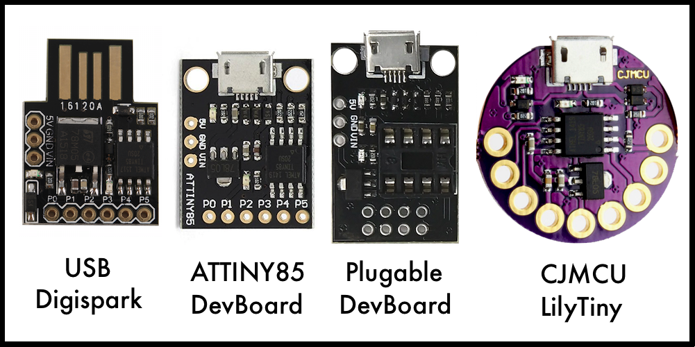
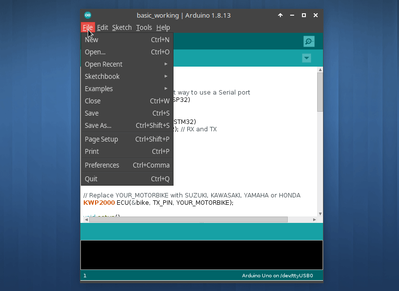
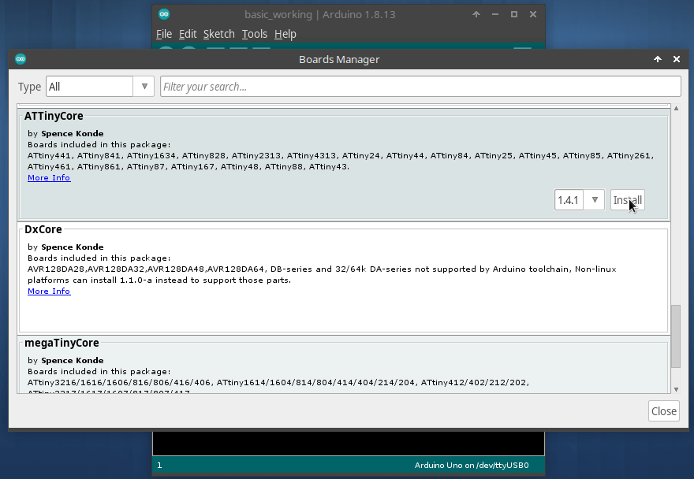
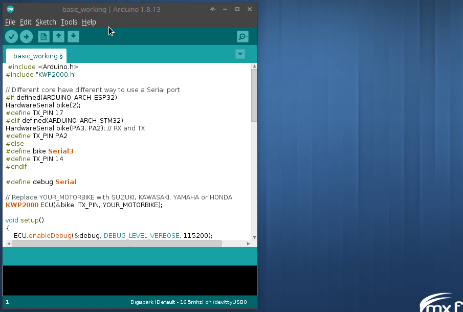
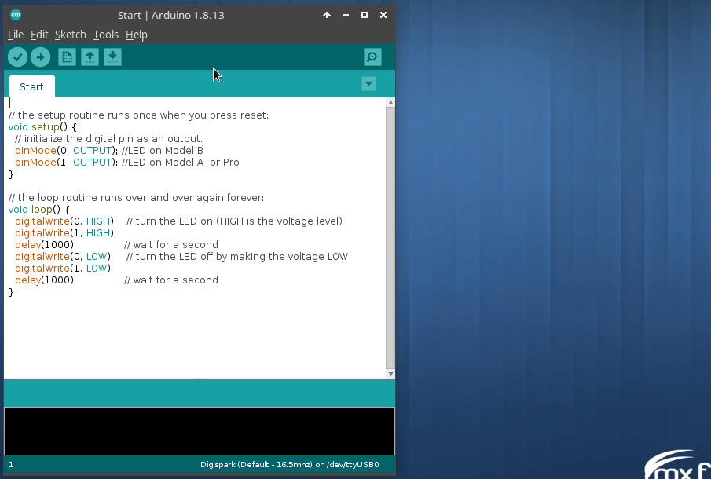
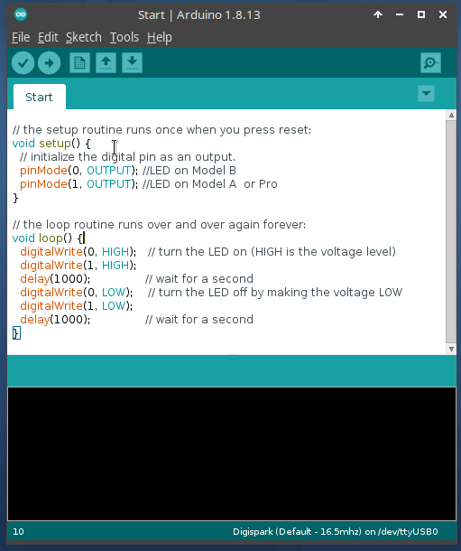

title: Memprogram ATiny85 di Arduino IDE
description: ATtiny85 dibangun dengan arsitektur berbasis RISC 8-bit AVR, performa tinggi, konsumsi daya rendah, dikombinasikan dengan 8KB ISP flash memori, 512B EEPROM, 512-Byte SRAM, 6 port Input Output, 32 register kerja, 1 buah pengatur waktu (timer) atau penghitung kecepatan (counter) 8-bit, USI, interupsi intenal dan eksternal, 4-channel 10-bit Analog Digital Converter, pengawas waktu (wathcdog timer) yang bisa di program dengan osilator internal, tiga mode hemat daya yang dapat dipilih perangkat lunak
hero: Memprogram ATiny85 di Arduino IDE
disqus: henduino

# Memprogram ATtiny85 dengan Arduino IDE

Satu lagi mikrokontroler ATmel (sekarang [Microchip Technology Inc.][1]) yang cukup populer digunakan. Ukurannya yang sangat kecil membuat keluarga ATtiny menjadi favorit diseluruh dunia, terutama untuk seri [ATtiny85][2]. ATtiny85 dibangun dengan arsitektur berbasis RISC 8-bit AVR, performa tinggi, konsumsi daya rendah, dikombinasikan dengan 8KB ISP flash memori, 512B EEPROM, 512-Byte SRAM, 6 port Input Output, 32 register kerja, 1 buah pengatur waktu (timer) atau penghitung kecepatan (counter) 8-bit, USI, interupsi intenal dan eksternal, 4-channel 10-bit Analog Digital Converter, pengawas waktu (wathcdog timer) yang bisa di program dengan osilator internal, tiga mode hemat daya yang dapat dipilih perangkat lunak. Perangkat mencapai throughput 20 MIPS pada 20 MHz dan beroperasi antara 2,7-5,5 volt.

[ATtiny85][3] sangat populer dan ideal untuk proyek mikrokontroler berkebutuhan rendah daya dan sedikit input output yang terlibat. Misal untuk membuat Signal Generator, Pulse Spot Welder, dan lain sebagainya. Boleh dikatakan sebagai mikrokontroler kecil cabe rawit dengan kekuatan mumpuni dan tentunya dengan harga yang super murah.

Selain alasan kemudahan dan murah, ATtiny sudah banyak dikembangkan baik dari sisi jenis papan pengembangan maupun dari sisi bootloader oleh pihak ketiga. Walau pun secara resmi ATtiny85 bukanlah keluarga Arduino namun kepopulerannya membuat ATtiny sekarang bisa di program menggunakan [Arduino IDE](install-arduino.md). Banyaknya pilihan papan pengembangan dan pilihan bootloader membuat pecinta mikrokontoler semakin mudah untuk mempelajarinya. Bahkan ada bootloader yang mendukung V-USB (Virtual USB), sehingga ATtiny85 tidak membutuhkan USB-to-TTL converter. ATtiny85 dengan bootloader yang mendukung V-USB menjadikannya sebagai papan pengembangan yang murah dan mudah seperti halnya menggunakan Arduino Pro Micro atau Arduino Leonardo.

***

## Jenis Bootloader ATtiny85

Sebenarnya ATtiny bisa di isi program dan dijalankan tanpa bootloader, hanya saja kita membutuhkan perangkat tambahan untuk meng-upload program yang sudah ditulis. Ketika upload program tanpa bootloader maka dibutuhkan USB-ASP atau USB-ISP sebagai perangkat keras tambahan untuk membantu proses upload program. Namun jika tidak mau ribet dengan perangkat keras tambahan berupa USB-ISP ataupun USB-ASP, maka masukan bootloader kedalam ATtiny85 sehingga ketika melakukan upload program ke papan ATtiny85 lebih mudah dan praktis. Ada dua bootloader yang terkenal untuk ATtiny85 yaitu [OptiBoot][4] dan [Micronucleus][5] (DigiSpark).



*Gambar 1. Tipe papan ATtiny85 Populer*

***

## Menambahkan Board ATiny85 di Arduino IDE

Karena ATtiny85 bukanlah keluarga [Arduino](memilih-arduino.md), ketika kita menginstall Arduino IDE, maka tidak akan ditemukan papan ATtiny85 pada Board Manager. ATtiny85 harus ditambahkan sendiri ke dalam Board Manager Arduino IDE. Untuk menambahkan/integrasi keluarga ATtiny kedalam Arduino IDE, ikuti langkah dibawah ini:

**==Langkah 1==**. Buka Arduino IDE, masuk ke menu

```
File > Preferences
```

**==Langkah 2==**. Perhatikan kotak dialog `Preferences` pada bagian `Additional Boards Manager URLs:`. Klik icon disamping kanan kotak isian, maka kotak dialog `Additional Boards Manager URLs` akan terbuka, kemudian masukan (copy - paste) URL dibawah ini kedalam kotak `Enter additional URLs, one for each row`.

```
http://drazzy.com/package_drazzy.com_index.json
http://digistump.com/package_digistump_index.json
```

URL diatas merupakan link yang menuju ke lokasi core keluarga ATtiny disimpan. Terdiri dari 2 link, Anda bisa memasukan salah satunya. Link pertama berisi core "[ATtinyCore][6]" yang dibuat oleh Spence Konde aka Dr. Azzy dan link kedua berisi core "Micronusleus" yang dibuat oleh [Digistump LLC][7]. Perbedaannya ada pada penggunaan bootloader, ATinyCore mendukung 2 bootloader yaitu OptiBoot dan Micronucleus, sedangkan Digistump hanya menggunakan bootloader Micronucleus karena Digistump adalah pembuat bootloader Micronucleus.



*Gambar 2. Memasukan URL Board ATtiny*

**==Langkah 3==**. Jika salah satu link atau keduanya sudah dimasukan, klik tombol OK pada kotak dialog `Additional Boards Manager URLs` dan klik OK lagi pada kotak dialog `Preferences`.

**==Langkah 4==**. Kembali ke Arduino IDE, buka menu

```
Tools > Board > Board Manager...
```

**==Langkah 5==**. Kotak dialog `Board Manager` akan terbuka, tunggu beberapa saat karena proses sinkronisasi akan dilakukan. Jika koneksi internet-nya lambat ini akan cukup banyak memakan waktu.

**==Langkah 6==**. Setelah proses sinkronisasi selesai, scrool ke bawah dan cari `Digistump AVR Board` dan atau `ATtinyCore`, arahkan mouse pointer pada salah satu bagian yang akan di install, ketika mouse pointer pada area tersebut akan muncul tombol `Install`, klik tombol tersebut. Proses installasi akan berjalan, tunggu beberapa saat hingga proses pemasangan selesai. Waktu yang dibutuhkan sesuai dengan kecepatan koneksi internet.



*Gambar 3. Installasi Board ATtiny85*

**==Langkah 7==**. Jika proses instalasi selesai, klik tombol Close. Periksa hasil instalasi pada menu

```
Tools > Board
```

Jika berhasil maka pilihan Board ATtiny tersedia, selanjutnya pilihlah Board sesuai dengan papan ATtiny yang kita miliki. Jika Anda memiliki papan ATtiny85 jenis Digispark pilih menu

```
Tools > Board > Digistump AVR Boards > Digispark (Default - 16.5mhz)
```



*Gambar 4. Memilih Board ATtiny85*

***

## Upload Sketch ke ATtiny85

Setelah proses instalasi papan ATtiny berhasil, mari kita tes, apakah Arduino IDE sudah terintegrasi sempurna dengan papan ATiny yang kita miliki. Disini penulis menggunakan papan pengembangan ATiny85 tipe [Digispark][7] yang dikembangkan di [KickStarter][8]. Untuk memulainya pastikan sudah dipilih dengan benar jenis papan yang kita miliki pada Arduino IDE (*Lihat Arduino IDE pojok kanan bawah tertulis "Digispark (Default - 16.5mhz)"*).

**==Langkah 1==**. Untuk membuat Sketch blink pada ATtiny85 klik menu dibawah ini

```
File > Examples > Digispark_Examples > Start
```

File Sketch Start tersebut berisi kode dibawah ini

``` C++
// the setup routine runs once when you press reset:
void setup() {                
  // initialize the digital pin as an output.
  pinMode(0, OUTPUT); //LED on Model B
  pinMode(1, OUTPUT); //LED on Model A  or Pro
}

// the loop routine runs over and over again forever:
void loop() {
  digitalWrite(0, HIGH);   // turn the LED on (HIGH is the voltage level)
  digitalWrite(1, HIGH);
  delay(1000);             // wait for a second
  digitalWrite(0, LOW);    // turn the LED off by making the voltage LOW
  digitalWrite(1, LOW); 
  delay(1000);             // wait for a second
}
```



*Gambar 5. Sketch Example Blink*

**==Langkah 2==**. Klik tombol Upload pada toolbar Arduino IDE, tunggu hingga keluar informasi seperti dibawah ini

```
Sketch uses 718 bytes (11%) of program storage space. Maximum is 6012 bytes.
Global variables use 9 bytes of dynamic memory.
Running Digispark Uploader...
Plug in device now... (will timeout in 60 seconds)
```

**==Langkah 3==**. Masukan Papan ATtiny85 ke port USB dan tunggu hingga keluar informasi seperti dibawah ini

```
> Please plug in the device ... 
> Press CTRL+C to terminate the program.
> Device is found!
connecting: 16% complete
connecting: 22% complete
connecting: 28% complete
connecting: 33% complete
> Device has firmware version 1.11
> Available space for user applications: 6330 bytes
> Suggested sleep time between sending pages: 8ms
> Whole page count: 99  page size: 64
> Erase function sleep duration: 792ms
parsing: 50% complete
> Erasing the memory ...
erasing: 55% complete
erasing: 60% complete
erasing: 65% complete
> Starting to upload ...
writing: 70% complete
writing: 75% complete
writing: 80% complete
> Starting the user app ...
running: 100% complete
>> Micronucleus done. Thank you!
```



*Gambar 6. Upload Sketch Blink*

**==Langkah 4==**. Perhatikan salah satu lampu LED pada papan ATtiny85, akan terlihat blink atau berkedip. Untuk mengubah kecepatan kedipan, silahkan lakukan perubahan pada kedua kode `delay(1000);`. Ubah angka `1000` menjadi `500` untuk mempercepat kedipan atau `2000` untuk memperlambat kedipan. Setelah dilakukan perubahan, lakukan upload ulang ke papan ATtiny85

Selamat mencoba! Salam hangat dari Banjarsari, Ciamis, Jawa Barat, Bumi, Galaksi Bima Sakti.

***

[1]: https://www.microchip.com/
[2]: https://www.microchip.com/wwwproducts/en/ATtiny85
[3]: https://ww1.microchip.com/downloads/en/DeviceDoc/Atmel-2586-AVR-8-bit-Microcontroller-ATtiny25-ATtiny45-ATtiny85_Datasheet.pdf
[4]: https://github.com/Optiboot/optiboot
[5]: https://github.com/micronucleus/micronucleus
[6]: https://github.com/SpenceKonde/ATTinyCore
[7]: http://digistump.com/products/1
[8]: https://www.kickstarter.com/projects/digistump/digispark-the-tiny-arduino-enabled-usb-dev-board

<small>Artikel diperbarui pada: {{ git_revision_date_localized }}</small>