title: Mengenal Baterai
description: Baterai sudah menjadi bagian dari kehidupan yang tidak dapat dipisahkan. Penemuan baterai modern sering dikaitkan dengan seorang ilmuwan yang bernama Alessandro Volta. Padahal, sejarah dimulai dari ketidaksengajaan yang mengagetkan saat proses pembedahan katak. Ya benar! Sejarah baterai dimulai dari seekor katak! Artikel kali ini akan mengupas hal-hal yang berhubungan dengan baterai, dimulai dari sejarah baterai, komponen baterai, prinsip kerja baterai, teminologi baterai, hingga penggunaan baterai.
hero: Mengenal Baterai
disqus: henduino

# Mengenal Baterai

!!! warning "PERHATIAN"
	Sebelum membaca artikel ini mohon diperhatikan, bahwa gambar pelengkap pada artikel ini semuanya bukanlah milik penulis atau milik situs ini, gambar diambil dari situs [sparkfun][38] dan [wikimedia][39] yang pernyataan kepemilikannya ada pada situs tersebut.

Baterai adalah kumpulan dari satu atau lebih sel yang hasil dari reaksi kimianya membuat elektron mengalir didalam rangkaian. Semua jenis baterai terdiri dari tiga komponen dasar, yaitu; *Anoda* (sisi 'Negatif'), *Katoda* (sisi 'Positif'), dan beberapa jenis *elektrolit* (sebuah zat yang secara kimia bereaksi terhadap anoda dan katoda).

Ketika anoda dan katoda baterai terhubung ke rangkaian, reaksi kimia terjadi antara sisi anoda dengan elektrolit. Reaksi ini menyebabkan elektron mengalir melalui rangkaian menuju ke katoda dan hal ini menyebabkan reaksi kimia lain terjadi antara sisi katoda dengan elektrolit. Ketika bahan di katoda dan atau anoda habis di konsumsi akibat dari reaksi kimia yang terjadi di kedua sisi, maka reaksi pun berhenti. Ketika reaksi kimia berhenti, baterai tidak dapat lagi menghasilkan listrik. Saat seperti ini Baterai menjadi "*mati*".

Pada dasarnya baterai terdiri dari 2 jenis, yaitu **baterai primer** dan **baterai sekunder**. Baterai primer adalah baterai yang harus dibuang setelah digunakan atau sudah dalam keadaan mati. Reaksi kimia sudah tidak dapat dibangkitkan lagi pada baterai primer. Sedangkan baterai sekunder adalah baterai yang dapat diisi ulang (*recharge*). Reaksi kimia pada baterai jenis ini dapat dibangkitkan kembali setelah baterai "mati".

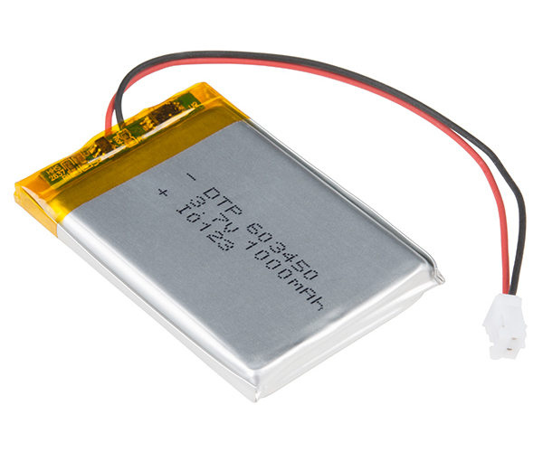

*Gambar 1. Baterai Lithium Polimer*

Baterai sudah menjadi bagian dari kehidupan yang tidak dapat dipisahkan. Tanpa baterai, Handphone akan menjadi pajangan di dinding, mobil harus diengkol menggunakan tangan hingga otot-otot keluar layaknya atlit binaraga, harus tersedia batang bambu untuk memindahkan kanal televisi (dan seperti itulah yang terjadi dimasa lalu). Baterai menawarkan cara mudah dan murah untuk menyimpan energi potensial listrik didalam sebuah wadah yang portabel.

*Gambar 2. Baterai dibuat dalam berbagai bentuk, ukuran, dan bahan kimia*

Penemuan baterai modern sering dikaitkan dengan seseorang yang bernama **Alessandro Volta**. Padahal, *sejarah dimulai dari ketidaksengajaan yang mengagetkan saat proses pembedahan katak*.

***

## A. Sejarah Baterai

Baterai telah menciptakan sejarah panjang dan melahirkan ilmuwan-ilmuwan hebat dimasanya. Pada umumnya, orang enggan untuk mengenal baterai lebih jauh, cukup dengan menggunakan dan selesai. Baterai telah memberikan pelayanan memuaskan dari masa ke masa, dari jaman analog hingga jaman digital. Dari suatu teknologi yang tidak mungkin hingga menjadi mungkin, baterai dengan setia melayani kebutuhan listrik pada berbagai perangkat yang digunakan manusia. Tahukah anda bahwa sejarah baterai diawali dari seekor katak?

***

### 1) Istilah Baterai

Dalam bahasa Inggris kata Battery mengandung arti "Deretan". Secara historis, kata "Battery" digunakan untuk menggambarkan "serangkaian objek serupa yang dikelompokkan bersama-sama untuk melakukan suatu fungsi", seperti dalam deretan pasukan artileri. Sedangkan dalam bahasa Indonesia kata "Battery" diterjemahkan menjadi "Baterai". Pada tahun 1749, Benjamin Franklin untuk pertama kalinya menggunakan istilah "Battery" untuk menggambarkan serangkaian kapasitor yang dihubungkan bersama-sama dalam eksperimen listriknya. Kemudian, istilah tersebut digunakan untuk setiap sel elektrokimia yang dihubungkan bersama-sama dengan tujuan menyediakan tenaga listrik.

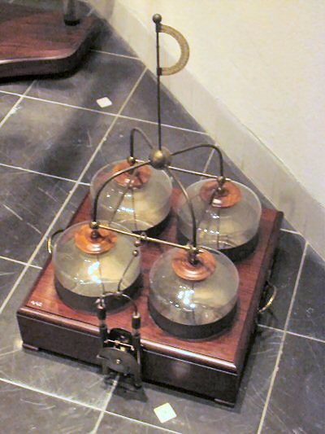

*Gambar 3. Baterai dari Leyden Jar "kapasitor" dihubungkan bersamaan*

***

### 2) Penemuan Baterai

Suatu hari pada tahun 1780, seorang fisikawan Italia, dokter, ahli biologi, dan juga filsuf yang bernama Luigi Galvani, melakukan pembedahan katak yang dikaitkan pada kail kuningan. Saat ia menyentuh kaki katak dengan pisau bedah yang terbuat dari besi, kaki katak tersebut bergerak-gerak. Galvani berteori bahwa energi berasal dari kaki katak itu sendiri, tetapi seorang mahasiswanya, Alessandro Volta, justru percaya sebaliknya.

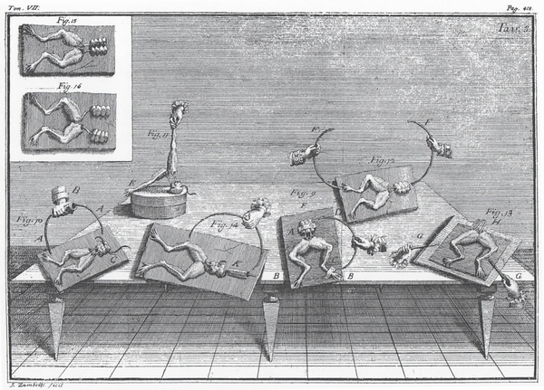

*Gambar 4. Adalah pembedahan katak Luigi Galvani sebagai awal sejarah baterai*

Volta menghipotesakan bahwa penggerak (impuls) kaki katak yang sebenarnya adalah disebabkan oleh logam berbeda yang dibasahi oleh cairan. Dia mengulangi percobaan dengan menggunakan kain yang direndam didalam air garam (tidak menggunakan mayat katak), hal ini menghasilkan tegangan yang sama. Volta mempublikasikan hasil penemuannya pada tahun 1791 dan kemudian menciptakan baterai pertama yang diberi nama "Voltaic Pile" pada tahun 1800.

Voltaic Pile terganggu oleh dua isu utama, yaitu: berat tumpukan yang menyebabkan elektrolit bocor keluar dari kain, dan sifat kimia tertentu dari komponen mengakibatkan rentang waktu hidup yang sangat singkat (sekitar satu jam). Dibutuhkan waktu 200 tahun kemudian untuk menyempurnakan desain Volta dan memecahkan masalah ini.

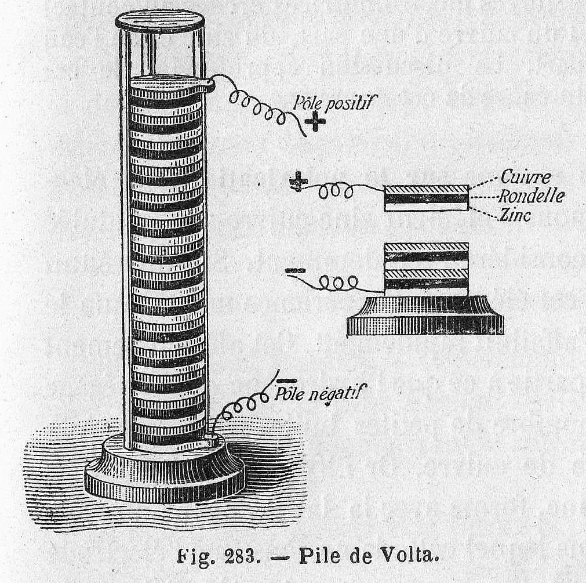

*Gambar 5. Voltaic Pile terdiri dari tumpukan plat seng dan tembaga yang dipisahkan oleh kain rendaman air garam*

***

### 3) Perbaikan Voltaic Pile

William Cruickshank dari Skotlandia berhasil memecahkan masalah kebocoran dengan meletakkan voltaic pile pada posisi berdiri (tidak ditumpuk) dan diletakan didalam sebuah bak baterai.

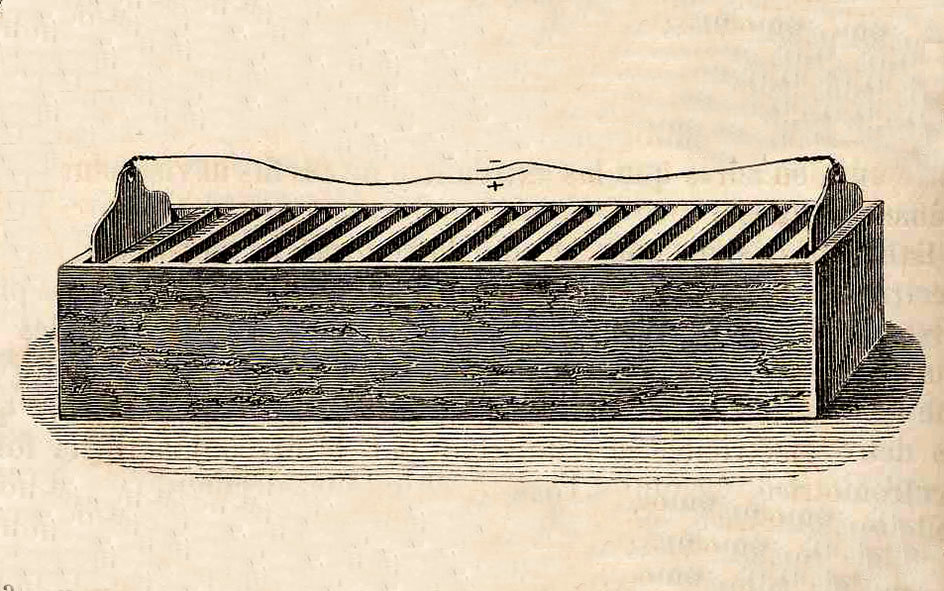

*Gambar 6. Wadah Baterai memecahkan masalah kebocoran tumpukan volta*

Masalah kedua adalah umur baterai yang pendek, hal ini disebabkan degradasi (penurunan kemampuan) seng karena kotoran yang terbentuk pada area permukaan seng (sisi anoda). Selain itu, terbentuk gelembung hidrogen pada permukaan tembaga (sisi katoda). Kotoran pada permukaan seng dan gelembung hidrogen pada permukaan tembaga menghalangi terjadinya reaksi kimia pada kedua sisi. Pada tahun 1835, William Sturgeon menemukan cara untuk mengatasi terbentuknya kotoran pada permukaan seng yaitu dengan merkuri untuk mencegah terjadinya degradasi seng.

Kimiawan Inggris bernama John Frederic Daniell menggunakan sebuah elektrolit pendukung yang bereaksi dengan hidrogen sehingga mampu mencegah penumpukan kotoran pada katoda tembaga. Baterai Daniell dua-elektrolit ini, yang dikenal sebagai "Daniell Cell" menjadi solusi yang sangat populer untuk menyediakan listrik pada awal kejayaan jaringan telegraf.

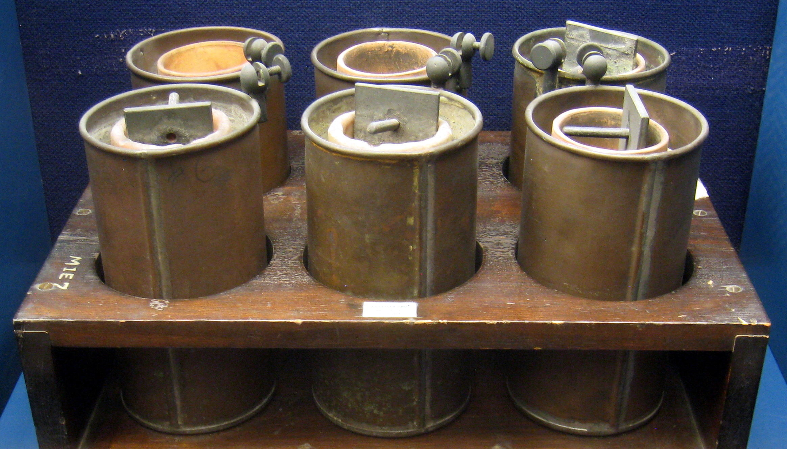

*Gambar 7. Koleksi sel Daniell dari tahun 1836*

***

### 4) Baterai Isi Ulang Pertama

Pada tahun 1859, fisikawan Prancis bernama Gaston Plante menciptakan baterai menggunakan dua lembar gulungan timbal yang direndam pada asam sulfat (Sulfuric Acid). Dengan memasukan kembali arus listrik menuju baterai membuat proses kimia akan kembali ke keadaan semula, sejak saat itu terciptalah baterai isi ulang pertama (Rechargeable Battery).

Kemudian, pada tahun 1881, Camille Alphonse Faure meningkatkan kemampuan desain Plante dengan membentuk lembaran timah menjadi plat tebal. Desain baru ini membuat baterai lebih mudah untuk diproduksi, dan baterai asam timbal (Lead Acid Battery) meluas penggunaannya hingga ke dunia otomotif.

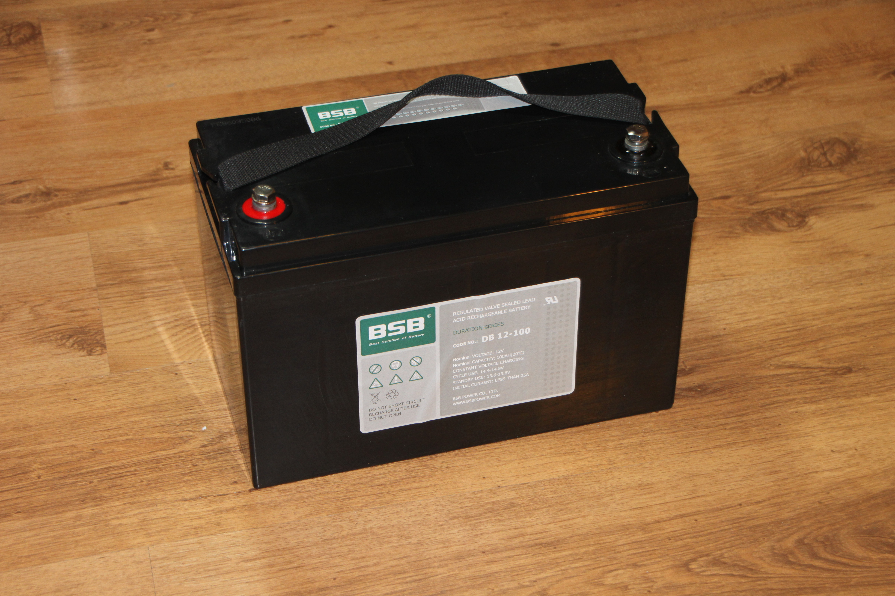

*Gambar 8. Desain umum "baterai mobil" yang telah ada selama lebih dari 100 tahun*

***

### 5) Sel Kering (Dry Cell)

Sampai akhir tahun 1800-an, elektrolit didalam baterai menggunakan bahan cair. Hal ini membuat proses pengiriman baterai dari satu tempat ke tempat lainnya harus sangat hati-hati dan sebagian besar baterai tidak pernah berpindah tempat ketika baterai sudah dihubungkan kedalam suatu sirkuit. Pada tahun 1866, Georges Leclanché menciptakan baterai menggunakan anoda seng (sisi negatif), katoda mangan dioksida (sisi positif), dan amonium klorida (ammonium chloride) sebagai elektrolitnya. Elektrolit dalam sel Leclanché masih menggunakan kimia cair, namun kimia baterai ini menjadi langkah penting untuk penemuan sel kering (Dry Cell).

Carl Gassner menemukan cara untuk membuat pasta elektrolit dari amonium klorida dan Plaster Paris (semacam Gypsum). Dia mem-paten-kan baterai "sel kering" baru ini pada tahun 1886 di Jerman.
Baterai sel kering baru ini biasa disebut "Baterai Seng-Karbon" yang diproduksi secara masal dan terbukti sangat populer hingga akhir tahun 1950-an. Karbon pada baterai sel kering tidak digunakan dalam reaksi kimia, ia melakukan peran penting hanya sebagai konduktor listrik didalam baterai seng-karbon.

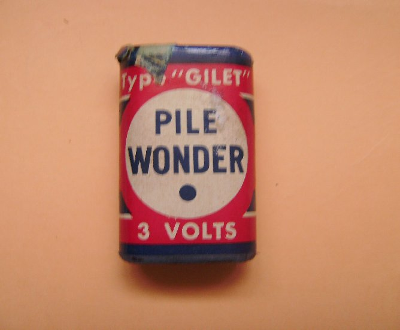

*Gambar 9. 3V Baterai Seng-Karbon dari tahun 1960-an*

Pada tahun 1950, Lewis Urry, Paul Marsal, dan Karl Kordesch dari perusahaan Union Carbide (yang kemudian dikenal sebagai "Eveready" dan selanjutnya "Energizer") mengganti elektrolit ammonium klorida dengan bahan kimia alkaline (basa), berdasar pada rumus kimia baterai yang diformulasi oleh Waldemar Jungner pada tahun 1899. 

Baterai sel kering dengan alkaline mampu menyimpan lebih banyak energi jika dibanding baterai seng-karbon dengan ukuran sama dan dengan umur yang lebih panjang. Popularitas baterai alkaline terus naik pada kurun waktu tahun 1960-an dan mampu menggeser dominasi baterai seng-karbon hingga menjadi standar sel primer yang digunakan oleh konsumen.

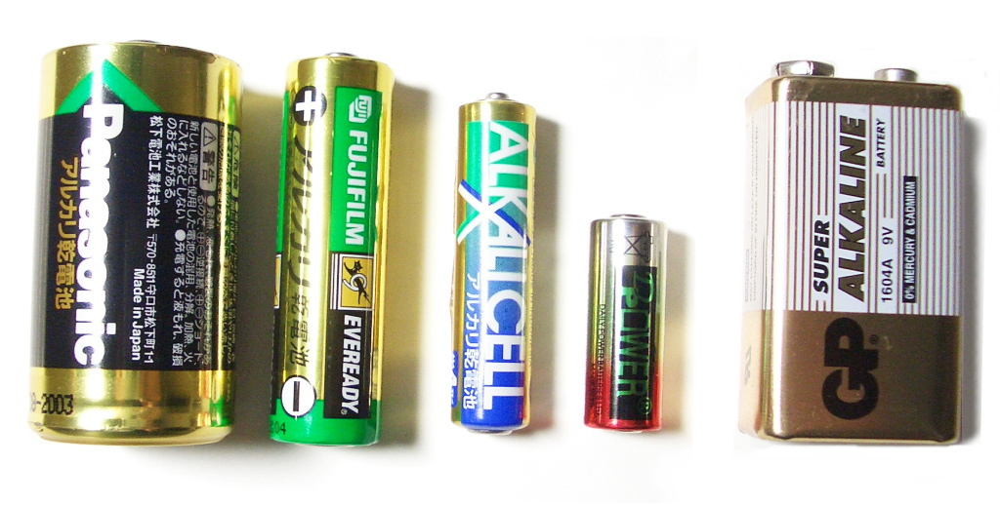

*Gambar 10. Baterai Alkaline dibuat dalam berbagai bentuk dan ukuran*

***

### 6) Baterai Isi Ulang Abad Ke-20

Pada tahun 1970-an, COMSAT mengembangkan baterai Nikel-Hidrogen untuk digunakan pada satelit komunikasi. Baterai ini menggunakan gas hidrogen bertekanan. Sebagian besar satelit yang sudah lama mengudara, seperti halnya International Space Station, masih mengandalkan baterai nikel-hidrogen.
Penelitian dari beberapa perusahaan sejak tahun 1960-an telah memicu terciptanya baterai Nickel-Metal Hydride (NiMH). Baterai NiMH yang dirilis ke pasar konsumen pada tahun 1989, menyuguhkan baterai yang berukuran kecil, lebih murah untuk baterai sel kering Nikel-Hidrogen yang bisa diisi ulang.

Perusahaan Asahi Chemical Jepang menciptakan baterai Lithium-Ion pertama pada tahun 1985 dan perusahaan Sony membuat baterai Lithium-Ion komersil untuk pertama kalinya pada tahun 1991. Pada akhir tahun 1990-an, lunak, wadah fleksibel dibuat untuk baterai Lithium-Ion dan melahirkan baterai "Lithium-Polymer" atau lebih dikenal secara luas dengan nama baterai "LiPo".

*Gambar 11. Reaksi kimia Baterai LiPo pada dasarnya sama dengan baterai Li-Ion*

Perkembangan teknologi dewasa ini telah melahirkan banyak sekali baterai kimia lainnya, diproduksi secara masal, hingga menjadi usang dan tidak tersedia dipasaran lagi. Pada artikel berikutnya akan dibahas lebih jauh tentang teknologi baterai yang populer.

***

## B. Komponen Baterai

Baterai terdiri dari tiga komponen dasar, yaitu: Anoda, Katoda, dan Elektrolit. Sebuah pemisah (separator) sering digunakan untuk mencegah anoda dan katoda saling bersentuhan ketika elektrolit tidak mencukupi (hingga habis). Untuk menyimpan ketiga komponen dasar ini, baterai disimpan dalam sebuah wadah (casing) yang memiliki bermacam bentuk unik.

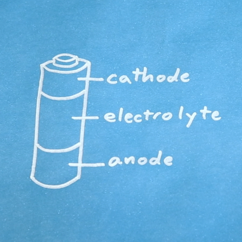

*Gambar 12. Sebenarnya baterai tidaklah dibagi dalam tiga bagian yang sama, tetapi kita dapat mengambil ide.*

Anoda dan katoda adalah jenis elektroda. Elektroda adalah konduktor yang mampu mengalirkan listrik baik itu memasuki atau meninggalkan komponen dalam sebuah rangkaian kelistrikan.

***

### 1) Anoda (Sisi Negatif)

Elektron bergerak keluar dari anoda menuju ke perangkat yang terhubung didalam sirkuit. Ini berarti secara konvensional "arus" mengalir masuk ke anoda.

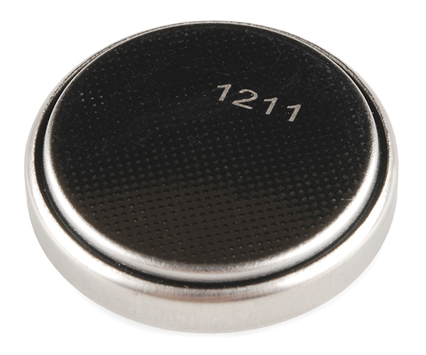

*Gambar 13. Pada baterai, anoda ditandai dengan simbol - (negatif)*

Didalam baterai, reaksi kimia yang terjadi antara anoda dan elektrolit menyebabkan terbentuknya elektron didalam anoda. Elektron tersebut sebenarnya ingin bergerak menuju ke katoda, tetapi tidak mampu melewati elektrolit atau pemisah. Hal ini menyebabkan elektron harus mengalir melalui komponen yang terhubung didalam rangkaian hingga sampai ke katoda.

***

### 2) Katoda (Sisi Positif)

Elektron bergerak masuk ke dalam katoda dari perangkat yang terhubung didalam sirkuit. Ini berarti secara konvensional "arus" mengalir keluar dari katoda.

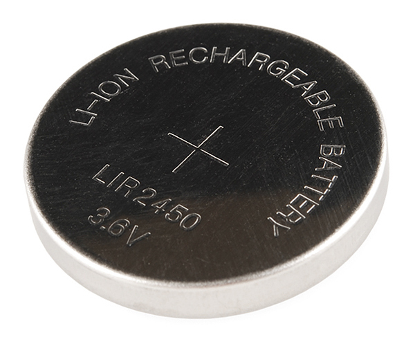

*Gambar 14. Pada baterai, katoda ditandai dengan simbol + (positif)*

Didalam baterai, reaksi kimia yang terjadi antara katoda dan elektrolit membutuhkan elektron yang dihasilkan oleh anoda. Tanpa elektron dari anoda maka tidak akan terjadi reaksi kimia antara katoda dengan elektrolit. Satu-satunya jalan elektron untuk bisa sampai ke katoda adalah melewati rangkaian yang berada diluar baterai. Pergerakan elektron inilah yang kemudian dikenal dengan nama "listrik".

***

### 3) Elektrolit

Elektrolit adalah zat, bisa berupa cairan atau gel, yang mampu mengangkut ion saat terjadi reaksi kimia pada sisi anoda dan katoda. Elektrolit juga bertindak sebagai insulator listrik antara anoda dan katoda sehingga elektron lebih mudah mengalir melalui sirkuit eksternal (diluar baterai) daripada harus melalui elektrolit.

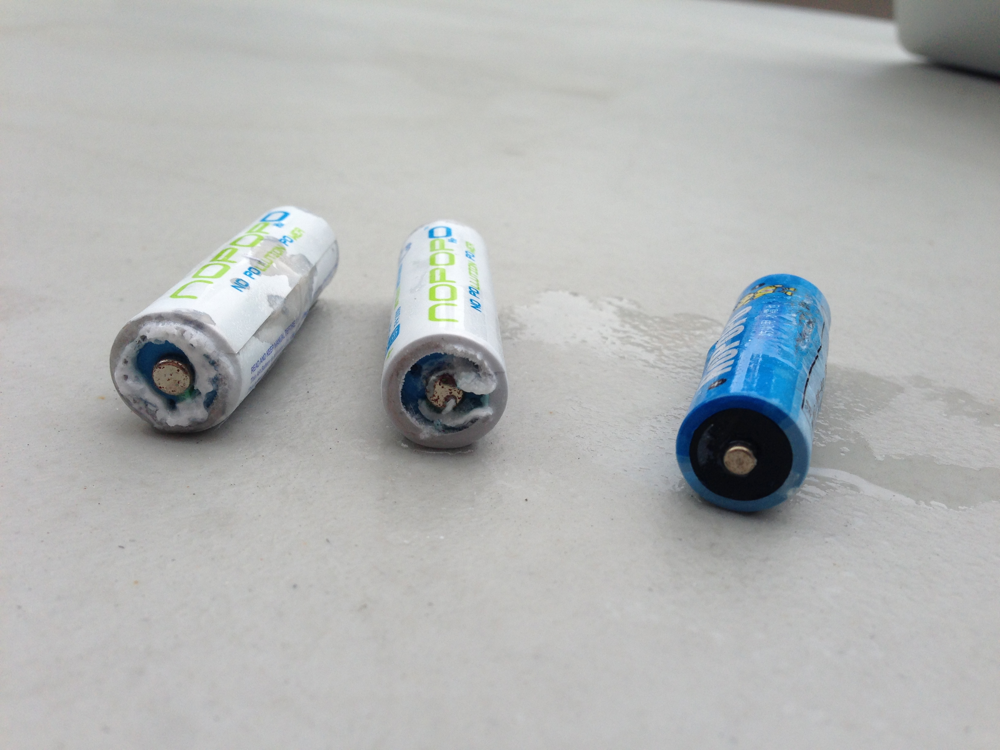

*Gambar 15. Elektrolit baterai alkaline bisa saja bocor, potassium hydroxide, jika mengalami panas tinggi atau tegangan balik*

Elektrolit sangat berperan penting dalam kinerja baterai. Karena elektron tidak dapat melewati elektrolit, mereka dipaksa untuk melakukan perjalanan melalui konduktor listrik didalam sirkuit diluar baterai yang menghubungkan anoda ke katoda.

***

### 4) Separator (Pemisah)

Separator adalah bahan berpori yang mencegah anoda dan katoda saling bersentuhan yang akan menyebabkan hubungan singkat (*korsleting* atau *short circuit*) didalam baterai. Separator baterai dibuat dari beberapa bahan seperti; kapas, nilon, polyester, kardus, dan film polimer sintetik. Separator tidak bereaksi secara kimia dengan anoda, katoda, ataupun elektrolit.

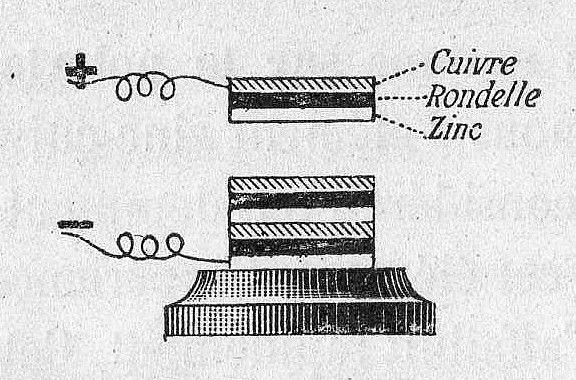

*Gambar 16. Voltaic Pile menggunakan kain atau kardus (pemisah) direndam dalam air garam (elektrolit) untuk memisahkan elektroda*

Ion didalam elektrolit dapat bermuatan positif, bermuatan negatif, dan dapat datang dalam berbagai ukuran. Separator khusus biasanya dibuat untuk memungkinkan beberapa ion dapat melewatinya dengan baik namun yang lainnya tidak.

***

### 5) Casing (Wadah)

Casing baterai dapat dibuat hampir dari semua bahan: plastik, baja, laminasi polimer ringan, dan sebagainya. Beberapa baterai menggunakan casing konduktor baja yang secara elektrik terhubung kesalah satu elektroda. Sebagai contoh, umumnya sel baterai AA alkaline menggunakan casing baja yang terhubung ke katoda.

*Gambar 17. Baterai Lead Acid yang menggunakan casing plastik*

***

## C. Prinsip Kerja Baterai

Baterai membutuhkan reaksi kimia untuk beroperasi. Setidaknya satu reaksi terjadi disekitar anoda dan satu atau lebih reaksi terjadi disekitar katoda. Pada saat baterai berkerja, reaksi pada anoda menghasilkan banyak sekali elektron yang disebut proses oksidasi (*oxidation*). Sedangkan reaksi yang terjadi pada katoda menggunakan banyak sekali elektron selama baterai bekerja, proses ini dikenal dengan proses reduksi (*reduction*).

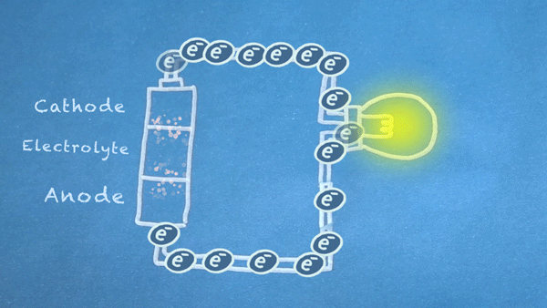

*Gambar 18. Elektron mengalir dari anoda ke katoda. Elektron ini memicu reaksi kimia di anoda dan katoda*

Pada intinya, kita membagi jenis reaksi kimia tertentu, reaksi reduksi-oksidasi atau sering disebut juga reaksi redoks (*red-uksi oks-idasi*), menjadi dua bagian reaksi terpisah. Reaksi redoks terjadi ketika elektron ditransfer diantara bahan kimia. Kemudian pergerakan elektron dalam reaksi ini mengalir keluar baterai untuk memberikan daya pada sirkuit.

***

### 1) Oksidasi Anoda (Anode Oxidation)

Oksidasi adalah reaksi yang pertama kali terjadi didalam reaksi redoks. Oksidasi terjadi antara anoda dan elektrolit yang menghasilkan elektron (ditandai dengan simbol e^-). Pada beberapa reaksi kimia, reaksi oksidasi menghasilkan ion, misal didalam baterai lithium-ion. Namun dalam reaksi kimia lainnya, reaksi oksidasi justru mengkonsumsi ion, seperti yang terjadi pada baterai alkaline. Pada kedua kasus tersebut dapat disimpulkan bahwa ion dapat mengalir bebas melalui elektrolit tetapi elektron justru tidak bisa mengalir didalam elektrolit.

***

### 2) Reduksi Katoda (Cathode Reduction)

Sisi lain dari reaksi redoks adalah reaksi reduksi yang terjadi antara katoda dan elektrolit. Elektron yang dihasilkan oleh reaksi oksidasi dikonsumsi didalam reaksi reduksi. Pada beberapa kasus, seperti pada baterai lithium-ion, ion bermuatan positif yang dihasilkan selama reaksi oksidasi dikonsumsi didalam reaksi reduksi. Sedangkan pada baterai alkaline, ion bermuatan negatif justru diproduksi selama terjadi reaksi reduksi.

***

### 3) Aliran Elektron

Beberapa atau hampir semua reaksi kimia dapat terjadi bahkan ketika baterai tidak terhubung ke dalam sirkuit diluar baterai. Reaksi-reaksi ini dapat berdampak pada umur pakai baterai. Pada umumnya, reaksi hanya akan terjadi pada kekuatan penuh ketika sirkuit diluar baterai terhubung antara anoda dan katoda. Semakin sedikit resistansi sirkuit antara anoda dan katoda, elektron akan lebih banyak mengalir, dan semakin cepat reaksi kimia yang terjadi didalam baterai.

Elektron mengalir bergerak melalui berbagai komponen listrik yang lebih dikenal sebagai "*load*" atau "beban", untuk menghasilkan sesuatu yang bermanfaat. Seperti pada gambar diatas, elektron mengalir melalui sirkuit melewati sebuah lampu dan lampu pun menyala. Dan harus di ingat bahwa aliran elektron mengalir dari anoda (sisi negatif) menuju ke katoda (sisi positif).

***

### 4) Baterai Mati

Bahan kimia didalam baterai pada akhirnya akan mencapai keseimbangan reaksi (*Equilibrium*). Dalam keadaan seperti ini, bahan kimia tidak akan lagi memiliki kecenderungan untuk bereaksi, dan pada akhirnya baterai tidak akan lagi menghasilkan aliran listrik. Saat baterai mencapai titik ini maka baterai dinyatakan "mati".

Baterai dengan sel primer harus dibuang ketika sudah mati. Namun baterai sel sekunder masih bisa diisi ulang (*recharge*), hal ini bisa dilakukan dengan metode terbalik yaitu memasukan aliran listrik kedalam baterai melalui anoda dan katoda. Pengisian terjadi ketika bahan kimia melalukan tahapan lain dari reaksi untuk mengembalikan bahan kimia ke keadaan asal.

***

## D. Terminologi Baterai

Orang sering menggunakan beberapa istilah umum ketika berbicara tentang tegangan baterai, kapasitas baterai, kemampuan arus baterai dan sebagainya. Berikut adalah istilah umum yang sering digunakan dalam menggambarkan baterai.

***

### 1) Sel

Satu sel mengacu pada penggunaan satu anoda dan satu katoda yang dipisahkan oleh elektrolit untuk menghasilkan tegangan dan arus listrik. Baterai dapat terdiri dari satu atau lebih sel. Sebuah baterai AA terdiri dari satu sel saja. Sedangkan baterai mobil terdiri dari enam sel yang masing-masing sel memproduksi tegangan sebesar 2,1 Volt.

***

### 2) Sel Primer

Sel Primer berisi bahan kimia yang tidak dapat dikembalikan keadaannya, akibatnya baterai harus dibuang setelah mati.

***

### 3) Sel Sekunder

Sel sekunder dapat diisi ulang karena memiliki bahan kimia yang dapat dikembalikan ke keadaan semula setelah terjadi reaksi redoks. Baterai jenis ini dikenal dengan nama "Rechargeable Battery" dan sel pada baterai jenis ini dapat digunakan berulang kali.

***

### 4) Tegangan Nominal

Tegangan nominal baterai adalah tegangan yang dinyatakan oleh produsen. Misalnya, baterai AA Alkaline dinyatakan menghasilkan tegangan sebesar 1,5 Volt. Hasil pengujian Mad Scientist Hut menunjukan bahwa baterai Alkaline ketika awal diuji menghasilkan tegangan sebesar 1,55 Volt dan kemudian perlahan-lahan tegangan menurun hingga habis. Dalam hal ini, tegangan 1,5 volt adalah tegangan nominal yang mengacu pada nilai maksimum dan atau tegangan awal penggunaan baterai.

Pengujian lain menggunakan baterai jenis LiPo, saat awal penggunaan baterai menghasilkan tegangan sebesar 4,2 Volt dan kemudian perlahan jatuh hingga 2,8 Volt selama proses pengosongan. Tegangan nominal yang tercantum untuk sebagian besar sel Lithium-Ion dan LiPo adalah sebesar 3,7 Volt. Dalam hal ini, 3,7 Volt adalah tegangan nominal yang mengacu pada tegangan rata-rata baterai selama siklus pengosongan. 

***

### 5) Kapasitas

Kapasitas Baterai ini adalah sebuah ukuran dari banyaknya muatan listrik yang dapat dihasilkan pada tegangan tertentu. Pada umumnya kapasitas baterai dinyatakan dalam satuan amp hours (Ah) atau dalam bahasa Indonesia sering disebut Ampere Jam dan ada juga yang dinyatakan dalam satuan milliamp hours (mAh) atau dalam bahas Indonesia dinyatakan dalam Milli Ampere Jam.

*Gambar 19. Baterai Lipo dengan kapasitas 1000 mAh*

Baterai Lipo pada gambar diatas dinilai memiliki kapasitas 1000 mAh, yang itu berarti bahwa baterai tersebut dapat memberikan 1 ampere (1000 milliamp) selama 1 jam sebelum baterai dianggap mati.
Kebanyakan grafik pengosongan baterai menunjukkan tegangan baterai sebagai fungsi yang mampu menggambarkan kapasitas. Untuk mencari tahu apakah baterai memiliki kapasitas yang cukup untuk memberikan daya pada sirkuit, maka ketahuilah tegangan terendah yang dapat diterima sirkuit dan ketahui hal terkait rating mAh atau Ah.

***

### 6) C-Rate

Kebanyakan baterai, terutama baterai kuat jenis lithium-ion, menyatakan pengosongan arus dengan "C-Rate" agar lebih mudah dalam mendefinisikan atribut baterai. C-Rate adalah nilai pengosongan relatif terhadap kapasitas maksimum baterai. 1C adalah jumlah arus yang dibutuhkan untuk pengosongan baterai dalam 1 jam. Sebagai contoh, 400 mAh baterai berkemampuan 1C akan mampu memasok arus hingga 400 mA. Sedangkan 5C untuk baterai yang sama akan mampu memasok arus hingga 2 A. Kebanyakan baterai kehilangan kapasitas di saat menggunakan arus yang lebih tinggi.

!!! warning "CATATAN"
	Saran secara umum menyatakan bahwa kita harus mengisi baterai Lipo di 1C atau kurang.

***

## E. Penggunaan Baterai

Dalam penggunaan dan pemeliharaan baterai kadang kita lalai untuk memperhatikannya. Terkadang kita menghubungkan satu baterai dengan baterai lainnya tanpa memperhatikan kaidah listrik. Insiden kebakaran yang dipicu oleh baterai pun telah sering ditemukan. Bagaimana sebenarnya penggunaan baterai?

***

### 1) Sel Tunggal

Beberapa sirkuit dapat didukung oleh satu sel, tapi pastikan bahwa baterai dapat memberikan tegangan dan arus yang cukup. Jika tegangan terlalu tinggi atau terlalu rendah untuk suatu sirkuit, maka dibutuhkan DC/DC converter. DC/DC Converter mampu memasok tegangan yang dapat disesuaikan secara manual atau otomatis berdasar pada kebutuhan sirkuit.

***

### 2) Hubungan Seri

Untuk meningkatkan besarnya tegangan antara terminal baterai maka sel baterai dapat dihubungkan secara seri. Hubungan seri berarti sel-sel baterai diurutkan end-to-end atau ujung ke ujung dengan cara menghubungkan anoda pada satu baterai dengan katoda pada baterai berikutnya. Menghubungkan baterai secara seri akan meningkatkan tegangan yang dihasilkan baterai. Penambahan tegangan dari semua sel akan menentukan tegangan operasi yang dihasilkan baterai. Namun kapasitas baterai akan tetap sama (tidak ada peningkatan kapasitas).

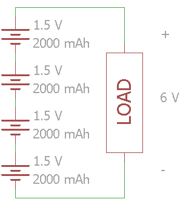

*Gambar 20. Baterai yang dihubungkan secara seri*

Gambar diatas menunjukan empat sel baterai 1,5 Volt yang dihubungkan secara seri. Tegangan total beban akan diperoleh sebesar 6 Volt sedangkan kapasitas baterai sebesar 2000 mAh.
Perangkat elektronik yang menggunakan baterai alkaline biasanya menggunakan sel baterai yang dihubungkan seri. Misal, tertulis 2x AA pada dudukan baterai, maka tegangan nominal yang dihasilkannya adalah 3 Volt.

!!! warning "CATATAN"
	Jika Anda melakukan pengisian baterai lithium-ion atau baterai LiPo secara seri, maka perlu memastikan untuk menggunakan sirkuit khusus yang dikenal sebagai "balancer" atau "penyeimbang" untuk memastikan tegangan yang seimbang diantara sel-sel tersebut. Beberapa perangkat charger (pengisi baterai), telah dilengkapi balancer untuk memastikan proses pengisian yang aman.

***

### 3) Hubungan Paralel

Jika tegangan dari satu sel sudah cukup memadai untuk memenuhi kebutuhan beban, maka baterai dapat ditambahkan secara paralel untuk meningkatkan kapasitas. Ini juga berarti meningkatkan ketersediaan arus (C-Rate).

Hati-hati saat menghubungkan baterai secara paralel! Pastikan semua baterai yang terhubung secara paralel memiliki tegangan nominal yang sama dan tingkat pengisian yang sama pula. Jika ada perbedaan tegangan, arus pendek (korsleting) bisa terjadi yang menyebabkan baterai overheating bahkan bisa memicu terjadinya kebakaran.

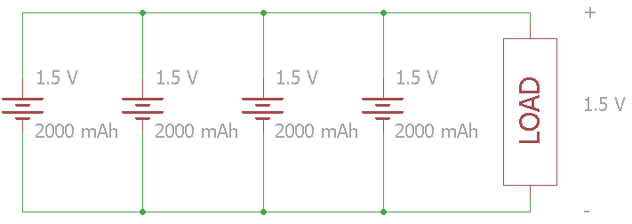

*Gambar 21. Baterai yang dihubungkan secara paralel*

Pada gambar diatas, ada empat sel 1,5 Volt yang terhubung secara paralel. Tegangan beban tetap di 1,5 Volt tetapi total kapasitas meningkat menjadi 8000 mAh.

***

### 4) Hubungan Seri Paralel

Jika kita ingin meningkatkan tegangan dan kapasitas baterai maka kita dapat menggabungkan baterai secara seri dan paralel. Sekali lagi harus diperhatikan! Pastikan bahwa tingkat tegangan pada semua baterai yang akan dihubungkan secara paralel adalah sama, hal ini untuk menghindari arus pendek.

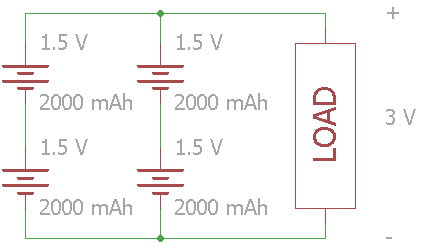

*Gambar 22. Baterai yang dihubungkan 2 seri 2 paralel (2S2P)*

Dalam kemasan baterai yang besar, terutama jenis lithium-ion, kita sering melihat konfigurasi yang tercantum menggunakan simbol 'S' dan 'P'. 'S' untuk hubungan seri dan 'P' untuk hubungan paralel. Konfigurasi untuk gambar rangkaian di atas adalah 2S2P. Sebagai contoh, mobil listrik modern menggunakan susunan baterai yang besar dimana baterai-baterai tersebut dihubungkan secara seri dan paralel.

***

## Penutup

Sekarang, kita telah memiliki pemahaman tentang bagaimana baterai diciptakan dan bagaimana baterai bekerja. Baterai adalah salah satu benda yang mampu menyediakan energi listrik untuk proyek-proyek yang kita buat, dan baterai sangat berguna jika kita memerlukan sumber daya listrik yang portabel.

***

## Daftar Pustaka

* [Luigi Galvani][1]
* [Alessandro Volta][2]
* [Voltaic Pile][3]
* [Benjamin Franklin][4]
* [William Cruickshank][5]
* [William Sturgeon][6]
* [John Frederic Daniell][7]
* [Gaston Plante][8]
* [Camille Alphonse Faure][9]
* [Georges Leclanché][10]
* [Carl Gassner][11]
* [Waldemar Jungner][12]
* [Manganese Dioxide][13]
* [Ammonium Chloride][14]
* [Plaster of Paris][15]
* [Alkaline][16]
* [Electricity Insulator][17]
* [Electric Current][18]
* [Redox Reaction][19]
* [Electron][20]
* [Ion][21]
* [Lithium-Ion Battery][22]
* [Alkaline Battery][23]
* [Shelf Life][24]
* [Electrical Load][25]
* [Chemical Equilibrium][26]
* [Union Carbide][27]
* [Asahi Chemical][28]
* [COMSAT][29]
* [International Space Station][30]
* [AA Battery Discharge Curve][31]
* [Storm Battery Pack][32]
* [AA Battery Test][33]
* [Discharge Curve][34]
* [Battery Spesification][35]
* [Tesla Model][36]
* [What is A Battery][37]

[1]: https://en.wikipedia.org/wiki/Luigi_Galvani
[2]: https://en.wikipedia.org/wiki/Alessandro_Volta
[3]: https://en.wikipedia.org/wiki/Voltaic_pile
[4]: https://en.wikipedia.org/wiki/Benjamin_Franklin
[5]: https://en.wikipedia.org/wiki/William_Cruickshank_(chemist)
[6]: https://en.wikipedia.org/wiki/William_Sturgeon
[7]: https://en.wikipedia.org/wiki/John_Frederic_Daniell
[8]: https://en.wikipedia.org/wiki/Gaston_Plant%C3%A9
[9]: https://en.wikipedia.org/wiki/Camille_Alphonse_Faure
[10]: https://en.wikipedia.org/wiki/Georges_Leclanch%C3%A9
[11]: http://www.worldofchemicals.com/32/chemistry-articles/carl-gassner-inventor-of-dry-cell-battery.html
[12]: https://en.wikipedia.org/wiki/Waldemar_Jungner
[13]: https://en.wikipedia.org/wiki/Manganese_dioxide
[14]: https://en.wikipedia.org/wiki/Ammonium_chloride
[15]: https://en.wikipedia.org/wiki/Plaster#Gypsum_plaster_.28plaster_of_Paris.29
[16]: https://en.wikipedia.org/wiki/Alkalinity
[17]: https://en.wikipedia.org/wiki/Insulator_(electricity)
[18]: https://en.wikipedia.org/wiki/Electric_current#Current
[19]: https://en.wikipedia.org/wiki/Redox
[20]: https://en.wikipedia.org/wiki/Electron
[21]: https://en.wikipedia.org/wiki/Ion
[22]: https://en.wikipedia.org/wiki/Lithium-ion_battery#Electrochemistry
[23]: https://en.wikipedia.org/wiki/Alkaline_battery#Chemistry
[24]: https://en.wikipedia.org/wiki/Shelf_life
[25]: https://en.wikipedia.org/wiki/Electrical_load
[26]: https://en.wikipedia.org/wiki/Chemical_equilibrium
[27]: https://en.wikipedia.org/wiki/Eveready_Battery_Company
[28]: https://en.wikipedia.org/wiki/Asahi_Kasei
[29]: https://en.wikipedia.org/wiki/COMSAT
[30]: https://en.wikipedia.org/wiki/International_Space_Station
[31]: http://madscientisthut.com/wordpress/daily-blog/aa-battery-discharge-curves/
[32]: http://www.helipal.com/storm-11-1v-2200mah-20c-lipo-battery-pack-xt60.html
[33]: http://www.powerstream.com/AA-tests.htm
[34]: http://www.chargery.com/productImage/battery/PHE2600-discharge-curve.jpg
[35]: http://web.mit.edu/evt/summary_battery_specifications.pdf
[36]: https://en.wikipedia.org/wiki/Tesla_Model_S#Battery
[37]: https://learn.sparkfun.com/tutorials/what-is-a-battery
[38]: https://www.sparkfun.com/
[39]: https://commons.wikimedia.org/