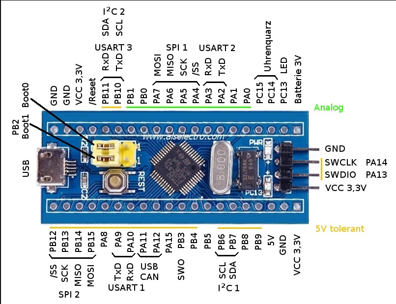
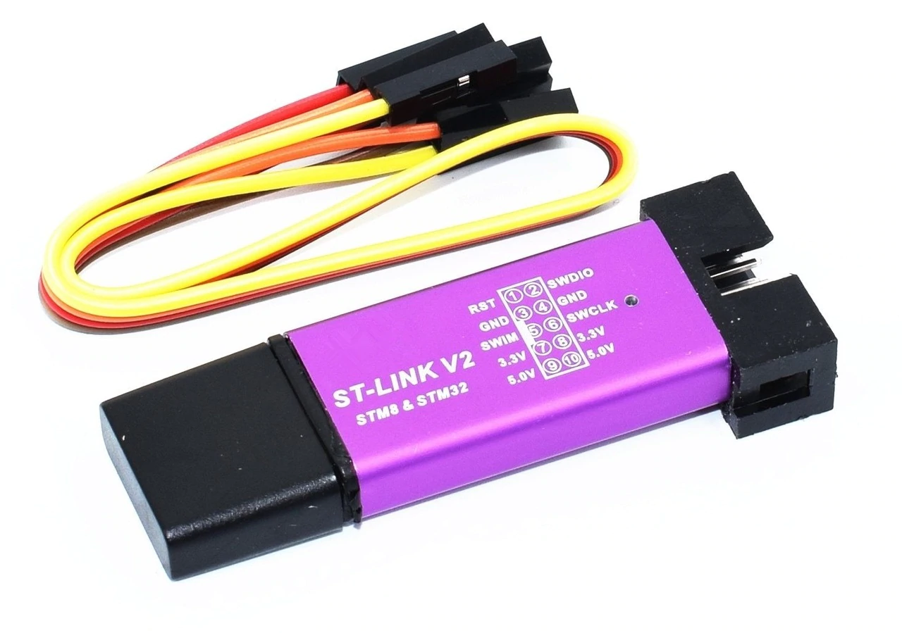
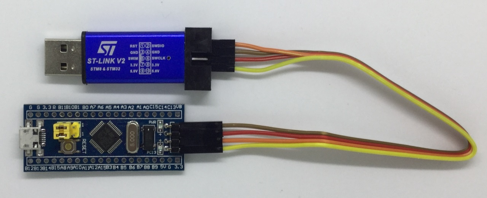
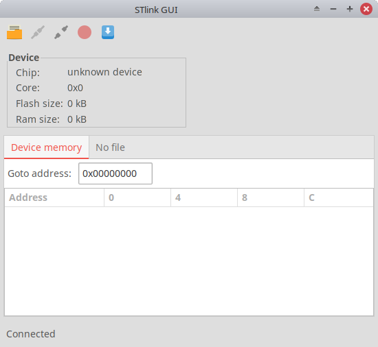
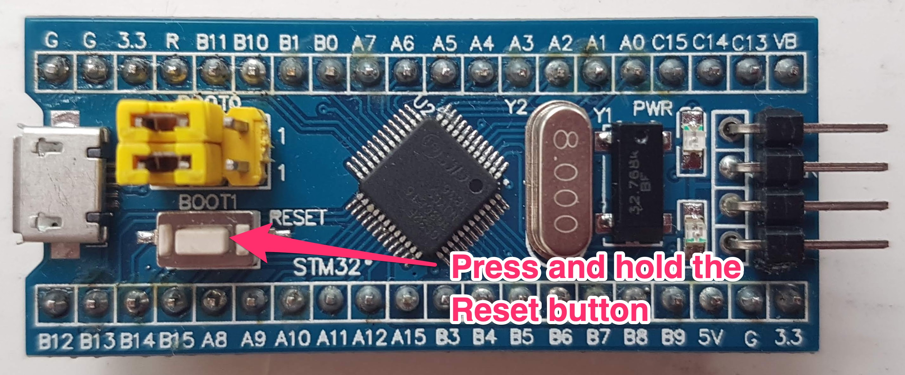
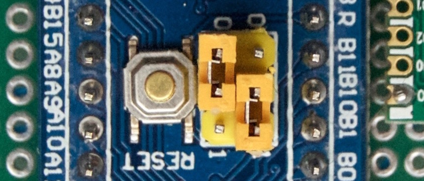

title: Blue Pill Unknown Device
description: Blue Pill merupakan salah satu MCU terkenal yang banyak di gunakan oleh para pehobi mikrokontroler, hal ini karena harganya yang murah namun dengan kemampuan yang lumayan tinggi membuat popularitas STM32F103C8T6 naik perlahan menggeser dominasi Arduino. Namun keluar STM32 bukanlah MCU yang mudah ditaklukan, hal ini membuat sebagian orang enggan untuk mempelajarinya. Salah satunya adalah kasus Blue Pill STM32F103C8T6 Unknown Device.
hero: Blue Pill STM32F103C8T6 Unknown Device
disqus: henduino

# Blue Pill STM32F103C8T6 Unknown Device

Suatu hari ada seorang teman melakukan trial error dengan MCU keluaran [STMicroelectronics][1] yang terkenal murah meriah. Papan MCU tersebut diberi kode [Blue Pill][2] yang menggunakan chip [STM32F103C8T6][3] sebagai otaknya. Dengan ukuran sebesar [Arduino Nano][4] namun memiliki kemampuan lebih tinggi jika dibandingkan dengan Arduino Nano. Selain dari sisi kemampuan, juga dari sisi harga lebih murah karena Blue Pill dibanderol hampir sama dengan [Arduino Pro Mini][5]. Bahkan ada yang menyebutkan bahwa Blue Pill kemampuannya sekelas [Arduino Mega2560][6] namun seharga Arduino Pro Mini.


*Gambar 1. Blue Pill STM32F103C8T6*

Namun karena tingkat kerumitan yang lebih tinggi dari pada pemrograman Arduino, maka Blue Pill tersebut terabaikan selama berbulan-bulan hingga lupa menyimpan. Suatu hari saya melihat Blue Pill yang merana tersebut sehingga merasa kasihan untuk membiarkannya merangkak perlahan dengan kaki seribunya, *ya* akhirnya saya minta untuk dipelajari.
Setelah mendaki gunung lewati lembah, sungai mengalir indah ke samudra, bersama teman bertualang. Akhirnya Blue Pill sampai di meja berantakan saya, mulailah mempersiapkan beberapa senjata untuk melakukan penyiksaan terhadap Blue Pill.

***

## ST-Link V2

Bagi anda yang ingin memulai belajar mem-program keluarga STM32 sebaiknya persiapkan perangkat keras pemrogramannya yaitu ST-Link. Walaupun Blue Pill bisa di program menggunakan perangkat keras USB TTL seperti FTDI atau Silabs namun menggunakan ST-Link akan lebih mudah.



*Gambar 2. ST-Link V2*

Hubungkan ST-Link ke pin Blue Pill dengan benar, jangan sampai tertukar, karena kalau tertukar Blue Pill bisa saja mogok bahkan *brick*. Hubungkan dengan tepat antara 3V, SWDIO, SWCLK, dan GND. Samakan saja antara pin ST-Link dengan pin Blue Pill.



*Gambar 3. Hubungkan Blue Pill dengan ST-Link*

***

## Texane/ST-Link Open Source

Untuk perangkat lunaknya saya menggunakan [Texane/ST-Link][7] untuk menyesuaikan sistem operasi yang digunakan yaitu Linux. Karena keluarga linux maka perangkat lunak Texane/ST-Link sudah jelas open source sebagai pengganti STLink STMicroelectronics yang hanya berjalan di Windows. Selain itu Texane/ST-Link ini lintas-platform jadi bisa berjalan di Mac dan Linux.
Setelah Blue Pill terhubung dengan ST-Link, hubungkan ST-Link ke port USB. Buka terminal pada Linux dan masukan perintah `st-info --probe` dan apa yang terjadi? Ternyata muncul pesan kesalahan bahwa Blue Pill "Unknown Device" atau tidak dikenali dengan isi pesan sebagai berikut:
``` sh
$ st-info --probe
Found 1 stlink programmers
 serial: 493f7806493f48484316133f
openocd: "\x49\x3f\x78\x06\x49\x3f\x48\x48\x43\x16\x13\x3f"
  flash: 0 (pagesize: 0)
   sram: 0
 chipid: 0x0000
  descr: unknown device
```
Penasaran, saya jalankan STlink GUI-nya Linux dan hasilnya sama saja, bahwa Blue Pill memang tidak dikenali. Ada apa gerangan? Apakah Blue Pill ini *ngambek* karena terlalu lama diabaikan atau memang sang pemilik sebelumnya melakukan kesalahan sehingga Blue Pill hanya tinggal jasad tanpa ruh?



*Gambar 4. STlink GUI pada LINUX*

Jurus pamungkas si malas dan si bodoh pun dikeluarkan yaitu Browsing dengan mendatangi simbah Google. "*Simbah kenapa Blue Pill saya menjadi unknown device?*". Simbah Google pun membuka primbonnya sambil menjawab "*Cucuku, silahkan pilih sendiri halaman yang mau dibuka ya, mata simbah sudah mulai kurang jelas melihat huruf*". Akhirnya saya pun klik sana klik sini sampai pegel telunjuknya, akhirnya ditemukan suatu artikel berjudul "[CS32 Blue Pill clone connection problems][8]". Sang penulis artikel bahkan mengalami hal yang lumrah namun kurang ajar, yaitu Blue Pill-nya menggunakan chip CS32F103C8T6 bukannya STM32F103C8T6. Dari nomor serinya saja sudah bisa di tebak kalau Blue Pill tersebut sangat asli bajakan.

***

## Metode 1

Mengikuti cara Eugene pada artikel tersebut tetapi sedikit berbeda dalam urutannya adalah sebagai berikut:



*Gambar 5. Tekan dan Tahan Tombol Reset*

* Lepas ST-Link dari port USB komputer
* Tekan tombol Reset kemudian tahan (jangan di lepas)
* Hubungkan ST-Link ke port USB komputer dalam keadaan tombol Reset masih di tekan tahan
* Ketik perintah `st-info --probe` pada terminal
* Dan perhatikan hasil pembacaan pada terminal, jika tampil seperti dibawah ini berarti tidak ada masalah dengan Blue Pill
``` sh
$ st-info --probe
Found 1 stlink programmers
 serial: 493f7806493f48484316133f
openocd: "\x49\x3f\x78\x06\x49\x3f\x48\x48\x43\x16\x13\x3f"
  flash: 0 (pagesize: 1024)
   sram: 20480
 chipid: 0x0410
  descr: F1 Medium-density device
```
* Lepas tombol Reset dan ketik ulang perintah `st-info --probe` jika hasilnya sama berarti anda behasil
* Dari tampilan terminal tersebut, saya mengambil kesimpulan bahwa [Flash Memory][9] atau System Memory terisi penuh karena tertulis `flash: 0 (pagesize: 1024)`, ini berarti sudah tidak ada ruang penyimpanan lagi. Kemungkinan terbesar ruang Flash Memory atau System Memory terisi suatu firmware, dan firmware tersebut rusak karena sesuatu hal. Atau mungkin, firmware tersebut menutup jalur komunikasi melalui ST-Link
* Ketikan perintah `st-flash erase` untuk menghapus total data didalam Flash Memory
* Ketika memasukan perintah `st-flash erase` tampil seperti dibawah ini, kita berarti masih gagal:
``` sh
$ st-flash erase
st-flash 1.5.1
2020-03-12T01:02:25 INFO common.c: Loading device parameters....
2020-03-12T01:02:25 INFO common.c: Device connected is: F1 Medium-density device, id 0x20036410
2020-03-12T01:02:25 INFO common.c: SRAM size: 0x5000 bytes (20 KiB), Flash: 0 bytes (0 KiB) in pages of 1024 bytes
Mass erasing
```
* Perhatikan `Flash: 0 bytes (0 KiB) in pages of 1024 bytes` itu menunjukan ruang Flash Memory atau System Memory belum terhapus, data masih ada dan tidak berhasil terhapus. Jika seperti ini ikuti Metode 2
* Dan atau jika setelah tombol Reset dilepas, Blue Pill kembali "Unknown Device" maka ikuti Metode 2

***

## Metode 2

Metode kedua ini dilakukan jika ternyata setelah tombol Reset di lepas keadaan kembali menjadi "Unknown Device" dan atau "Flash: 0 bytes (0 KiB)" maka ikuti langkah di bawah ini:



*Gambar 6. Pindahkan Jumper Boot0*

* Lepaskan ST-Link dari port USB komputer
* Pindahkah jumper Boot0 ke posisi angka 1 (HIGH), hal ini bertujuan agar ST-Link dapat mengakses System Memory
* Hubungkan ST-Link ke port USB komputer
* Ketikan perintah `st-info --probe` pada terminal, jika hasilnya seperti dibawah ini, berarti kita berhasil mengakses System Memory
``` sh
$ st-info --probe
Found 1 stlink programmers
 serial: 493f7806493f48484316133f
openocd: "\x49\x3f\x78\x06\x49\x3f\x48\x48\x43\x16\x13\x3f"
  flash: 65536 (pagesize: 1024)
   sram: 20480
 chipid: 0x0410
  descr: F1 Medium-density device
```
* Perhatikan baris `flash: 65536 (pagesize: 1024)` artinya ruang penyimpanan pada System Memory masih kosong, namun ruang Flash Memory kemungkinan habis sehingga komunikasi ST-Link tertutup.
* Segera hapus seluruh data yang ada di Flash Memory maupun System Memory dengan mengetikan perintah `st-flash erase` pada terminal. Jika hasilnya seperti dibawah ini:
``` sh
$ st-flash erase
st-flash 1.5.1
2020-03-12T01:18:55 INFO common.c: Loading device parameters....
2020-03-12T01:18:55 INFO common.c: Device connected is: F1 Medium-density device, id 0x20036410
2020-03-12T01:18:55 INFO common.c: SRAM size: 0x5000 bytes (20 KiB), Flash: 0x10000 bytes (64 KiB) in pages of 1024 bytes
Mass erasing
```
* Perhatikan baris `Flash: 0x10000 bytes (64 KiB) in pages of 1024 bytes` berarti semua data sudah terhapus
* Lepas ST-Link dari port USB komputer dan pindahkan jumper Boot0 keposisi 0 (LOW) atau posisi semula
* Pasang kembali ST-Link ke port USB komputer dan ketika perintah `st-info --probe` pada terminal dan tampil seperti dibawah ini:
``` sh
$ st-info --probe
Found 1 stlink programmers
 serial: 493f7806493f48484316133f
openocd: "\x49\x3f\x78\x06\x49\x3f\x48\x48\x43\x16\x13\x3f"
  flash: 65536 (pagesize: 1024)
   sram: 20480
 chipid: 0x0410
  descr: F1 Medium-density device
```

***

Selamat!!! Anda telah berhasil... Dan sekarang anda bisa menulis kode apapun ke dalam Blue Pill... Alhamdulillah...!!!
Anda masih bingung antara Flash Memory dan System Memory... Tunggu ya... Insya Allah kapan-kapan kita bahas...

[1]: https://www.st.com/content/st_com/en.html
[2]: https://stm32-base.org/boards/STM32F103C8T6-Blue-Pill.html
[3]: https://www.st.com/en/microcontrollers-microprocessors/stm32f103c8.html
[4]: https://henduino.github.io/library/papan/mengenal-arduino-nano/
[5]: https://henduino.github.io/library/papan/mengenal-arduino-pro-mini/
[6]: https://henduino.github.io/library/papan/mengenal-arduino-mega2560/
[7]: https://github.com/texane/stlink
[8]: http://www.eugenesia.co.uk/2019/07/cs32-blue-pill-clone-connection-problems/
[9]: https://www.electronicshub.org/getting-started-with-stm32f103c8t6-blue-pill/

***

<small>Artikel diperbarui pada: {{ git_revision_date_localized }}</small>