title: Breadboard Prototyping
description: Breadboard adalah salah satu bagian yang paling mendasar ketika belajar bagaimana membuat sirkuit dalam elektronika. Kita akan belajar tentang apa breadboard, mengapa disebut breadboard, dan bagaimana menggunakan breadboard untuk prototyping.
hero: Breadboard Prototyping
path: tree/master/docs/tnt
source: breadboard-prototyping.md
disqus: henduino

# Breadboard Elektronika untuk Prototyping

## Breadboard

Menciptakan suatu rangkaian pada elektronika itu memang membutuhkan waktu yang cukup lama, mulai dari pembuatan skematik, pembuatan prototype, analisis dan berbagai proses yang semuanya membutuhkan waktu yang tidak sebentar. Diantara proses pembuatan rangkaian tersebut ada proses yang cukup unik dan menarik yaitu proses prototyping. Proses ini merupakan proses awal untuk menganalisis kinerja dari rangkaian dan proses pencarian kekurangan dan kesalahan rangkaian. Prototyping membutuhkan beberapa perangkat wajib yang harus tersedia. Salah satu komponen yang wajib ada adalah breadboard. Breadboard adalah papan khusus yang digunakan untuk membuat prototype atau rangkaian elektronik yang bersifat percobaan.

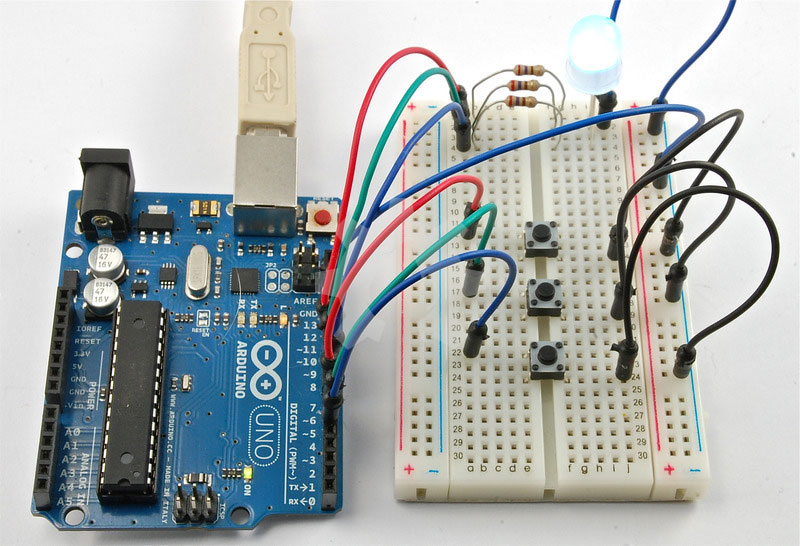

***

## Sejarah Breadboard

Sebelum tahun 1960-an, jika kita ingin membuat sebuah rangkaian prototype (rangkaian percobaan awal), biasanya dengan menggunakan teknik wire-wrap. Wire wrap adalah proses melilitkan ujung kabel pada sekitar ujung kawat konduktif yang melekat pada perfboard atau sering disebut protoboard. Pada gambar dibawah terlihat cukup jelas bagaimana membuat rangkaian elektronik dengan menggunakan teknik wire-wrap. Cara seperti ini memang cukup rumit namun lebih cepat. Walaupun demikian rumitnya, metode ini masih tetap digunakan sampai hari ini, namun dengan cara dan perlengkapan prototyping yang lebih mudah, salah satunya adalah kelengkapan prototyping adalah breadboard.

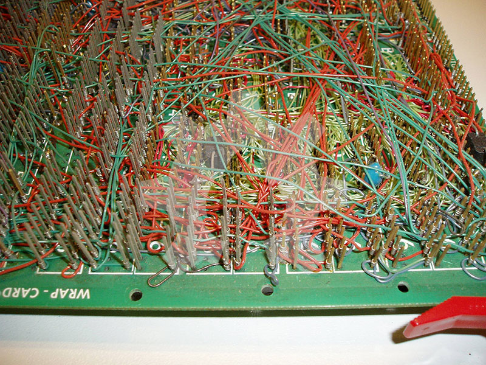

*Gambar 1. Teknik Wire-Wrap*

***

## Arti Nama Breadboard

Breadboard (bahasa Inggris) jika diterjemahkan dalam bahasa kita berarti tatakan atau papan tempat memotong roti. Ketika kita membayangkan breadboard, maka akan tergambar bahwa breadboard itu adalah sebuah papan kayu yang tebal dan sebuah roti segar diatasnya yang baru diambil dari pemanggang roti. Maka bayangan itu tidak terlalu jauh dari mana penamaan Breadboard itu ditemukan.

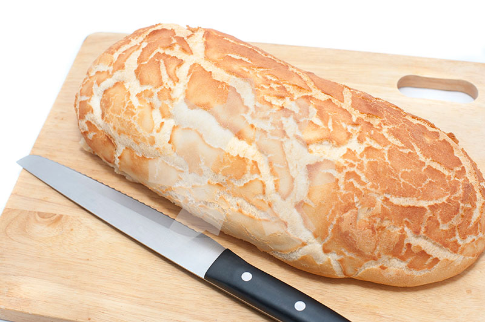

*Gambar 2. Roti diatas Tatakan Kayu*

Jadi mengapa kita menyebut "pembuat rangkaian" elektronika ini dengan nama breadboard? Beberapa tahun yang lalu, ketika rangkaian elektronika itu masih rumit dan besar, orang akan mengambil tatakan atau papan kayu pemotong roti dari dapur, menggunakan beberapa paku atau paku payung, dan mulai menghubungkan titik-titik paku tersebut dengan kabel atau kawat untuk menciptakan sebuah rangkaian elektronika percobaan atau prototype.

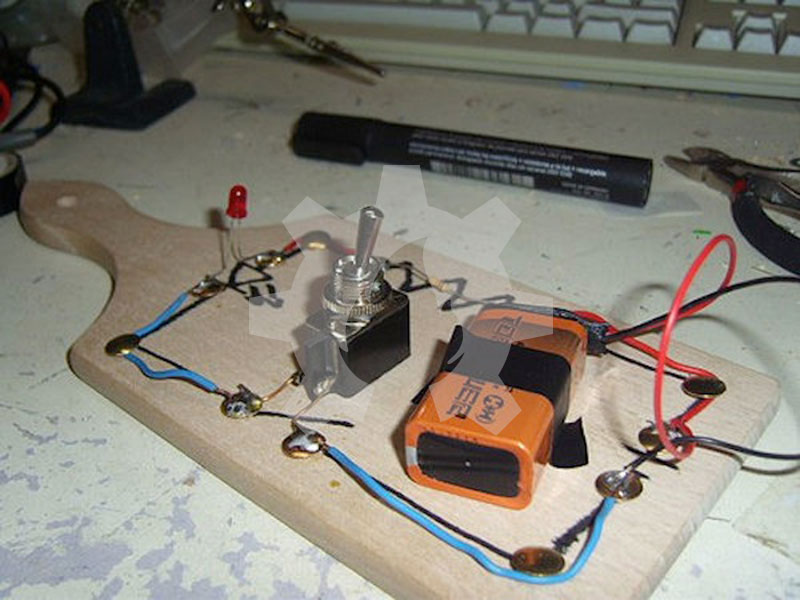

*Gambar 3. Rangkaian Elektronik pada Tatakan Roti*

Dunia elektronika berkembang sangat pesat, komponen-komponen elektronika semakin banyak dengan ukuran yang lebih kecil dari pada jaman dulu, dan metode untuk membangun rangkaian prototype elektronika pun semakin baik dan mudah, ini membuat Ibu sebagai pemilik dapur kembali senang karena anaknya tak perlu lagi mencuri tatakan kayu pemotong roti dari dapur. Namun ternyata, nama "Breadboard" yang diambil dari nama tatakan kayu pemotong roti pun membuat kita terjebak dengan penamaan "Breadboard" yang cukup membingungkan (terutama Google Terjemahan). Secara teknis, media untuk membuat rangkaian elektronika ini disebut breadboard walau sudah tidak menggunakan papan kayu pemotong roti. Sebagian besar diskusi yang membahas tentang elektronika mencoba membedakan penamaan antara breadboard tatakan kayu dengan breadboard prototype elekronika, mereka sering menyebutnya "solderless" breadboard.

***

## Alasan Menggunakan Breadboard

Sebuah breadboard elektonika (agar berbeda dengan breadboard tatakan kayu pemotong roti) sebenarnya mengacu pada sebuah papan tempat membuat rangkaian elektronika yang tidak perlu dilakukan penyolderan untuk menghubungkan antara satu komponen dengan komponen lainya sehingga dikenal dengan solderless breadboard. Breadboard adalah sebuah perangkat yang digunakan untuk membuat rangkaian sementara atau rangkaian prototype yang sama sekali tidak membutuhkan proses penyolderan. Cara seperti ini akan menghemat waktu dan biaya.

Prototypting adalah proses pengujian ide dengan menciptakan sebuah model awal dari bentuk rangkaian elektronik sebelum dikembangkan atau disalin. Disinilah penggunaan breadboard diperlukan. Jika kita tidak terlalu yakin bagaimana suatu rangkaian akan bereaksi yang terdiri dari berbagai komponen dan parameter, maka sebaiknya kita membuat prototype dan melakukan pengujian diatas breadboard.
Bagi mereka yang baru mengenal elektronik dan rangkaiannya, breadboard adalah tempat terbaik untuk mulai mempelajarinya. Breadboard merupakan tempat atau media yang sangat mudah digunakan baik untuk rangkaian sederhana maupun rangkaian yang sangat kompleks. Penggunaan umum lain dari breadboard adalah untuk menguji bagian-bagian atau fungsi-fungsi bari dari sirkuit terpadu atau sering disebut IC (Integrated Circuit). Ketika kita ingin mencari tahu bagaimana bagian-bagian dari IC ini bekerja dan bagaimana menghubungkannya dengan komponen lain, maka kita tidak perlu melakukan penyolderan. Cukup gunakan breadboard dan beberapa kabel penghubung (jumper wire).

Terkadang kita memang tidak perlu untuk membuat suatu rangkaian elektronik itu menjadi permanen. Hal ini bermanfaat ketika kita ingin mencari kesalahan-kesalahan yang ditemukan dikemudian hari. Ketika pelanggan menyampaikan suatu masalah, maka perlu proses duplikasi rangkaian ke atas breadboard, hal ini akan sangat membantu ketika kita mencoba untuk menguji rangkaian, beberapa perubahan rangkaian, dan menganalisis rangkaian. Kita akan dengan mudah untuk menghubungkan suatu rangkaian yang bermasalah untuk melakukan perbaikan rangkaian dan mencari tahu permasalahan yang terjadi pada suatu rangkaian. Rangkaian yang dibuat pada breadboard akan dengan mudah kita lepas dan kemudian dirangkai lagi untuk melakukan beberapa analisis dalam mencari permasalahan yang tiba-tiba saja terjadi pada pelanggan yang membeli rangkaian buatan kita. 

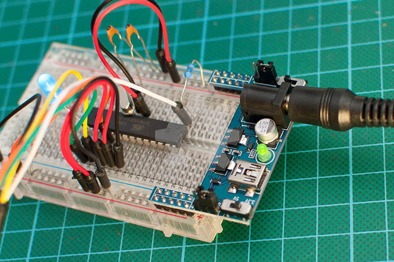

*Gambar 4. Rangkaian yang dibuat pada Breadboard*

***

## Anatomi Breadboard

Agar lebih mudah memahami bagaimana cara menggunakan breadboad, maka sebaiknya kita memisahkan beberapa bagiannya agar terlihat lebih dalam bagaimana sebaiknya breadboard itu digunakan dan bagaimana breadboard itu difungsikan dengan maksimal.

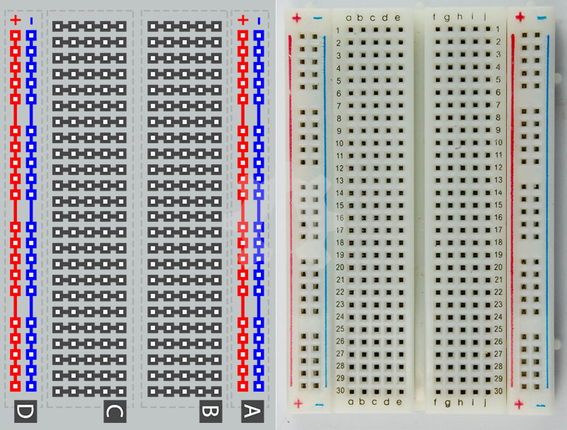

*Gambar 5. Fitur Utama Breadboard*

### 1. Strips Terminal

Pada gambar dibawah ini terlihat sebuah breadboard yang tidak memiliki perekat pada bagian bawahnya. Terlihat dari bagian bawah (bagian belakang breadboard) ada beberapa baris logam yang disusun horisontal.

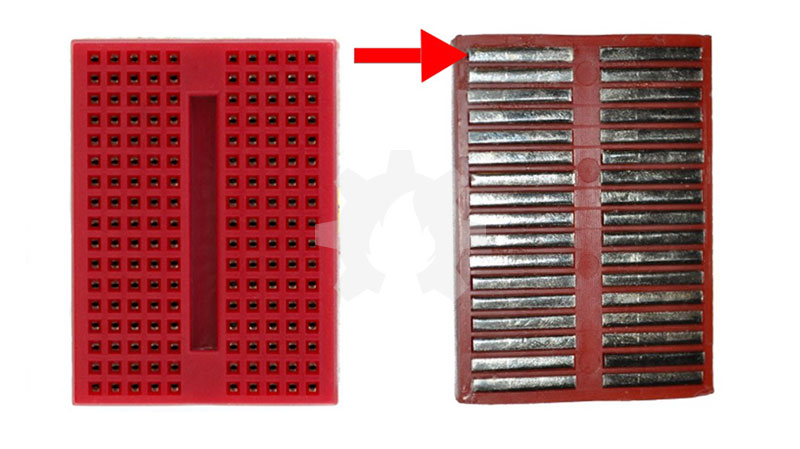

*Gambar 6. (Kiri) Sebuah Mini Breadboard, (Kanan) Bagian bawah breadboard yang telah dibuang perekatnya*

Bagian atas dari baris logam memiliki klip pengunci kecil yang tersembunyi dibalik lubang plastik. Klip ini memungkinkan kabel atau kaki komponen yang masuk melalui lubang plastik atas breadboard akan terkunci dengan kuat pada bagian dalam breadboard.

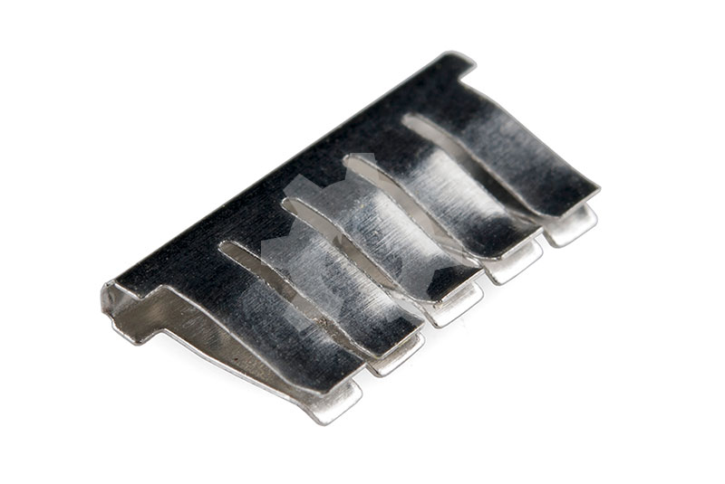

*Gambar 7. Logam Konduktif pada Bagian dalam Breadboard*

Setelah komponen yang dimasukan maka komponen akan tersambung secara elektrik ke titik lain pada baris tersebut. Hal ini karena logam konduktif akan mengalirkan arus di setiap titik pada jalur tersebut. Pada gambar diatas terlihat ada lima klip pengunci pada setiap setengah barisnya. Ini hal yang sama pada semua jenis dan ukuran breadboard. Dengan demikian, kita hanya bisa menghubungkan lima komponen dalam satu bagian atau setengah dari satu baris pada breadboard. Setiap barisnya ada sepuluh lubang, dengan setiap strip memiliki lima lubang. Itulah mengapa kita hanya bisa menghubungkan lima komponen dalam setiap stripnya. Setiap satu baris horisontal dipisahkan oleh ngarai atau selokan ditengah-tengah breadboard. Selokan ini memisahkan atau mengisolasi setiap baris menjadi dua strip dan tidak terhubung secara elektrik satu strip kiri dengan satu strip sebelah kanannya. Ini berarti kita hanya bisa memasangkan lima komponen dalam setiap strip yang saling terhubung, dan lima komponen lain pada strip sebelahnya yang saling terhubung juga, namun setiap lima lubang pada strip tidak terhubung dengan lima lubang pada strip lainnya.

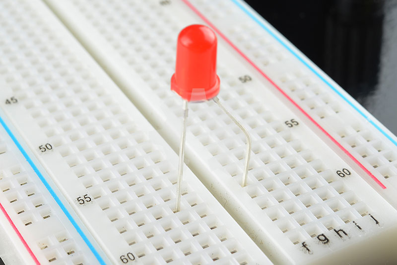

*Gambar 8. Sebuah LED yang dipasang pada lubang breadboard. Perhatikan kaki LED yang ditempatkan pada strip kiri dan kanan dan terpisah oleh selokan*

### 2. Hubungan Rel Listrik

Pada beberapa jenis breadboard lainnya, selain beberapa baris horisontal, breadboard juga memiliki bagian lain yang berfungsi sebagai strip daya. Strip daya ini setiap titiknya dihubungkan secara vertikal sepanjang sisinya.

*Gambar 9. (Kiri) Breadboard dengan rel daya bagian atas (Kanan) Breadboard bagian bawah yang terlihat strip logamnya*

Rel Listrik ini adalah strip logam yang identik ditempatkan secara vertikal dan biasanya setiap titiknya saling terhubung. Ketika membuat sebuah rangkaian, biasanya kita membutuhkan banyak sumber daya dengan tempat yang berbeda. Rel Listrik ini memberikan kita keleluasaan untuk memperoleh akses sumber daya yang dibutuhkan rangkaian. Biasanya baris vertikal tegangan positif diberi label simbol "+" dengan strip warna merah dan tegangan negatif diberi simbol "-" dengan strip berwarna hitam atau biru.
Rel Listrik di kedua sisi tidak saling terhubung, baik antara rel strip positif (merah) dengan rel strip negatif (hitam) serta antara kedua sisi kiri dan kanan. Kita perlu mengubungkan rel strip positif kiri dengan rel strip positif kanan, dan rel strip negatif kiri dengan rel strip negatif kanan menggunakan kabel jumper. Itu juga jika rangkaian elektronik yang kita buat pada breadboard membutuhkan tegangan yang sama dari satu sumber tegangan. Tetapi tanda-tanda yang ada pada breadboard rel listrik bukanlah sebuah ketetapan itu hanya digunakan sebagai referensi. Jadi tidak adalah aturan yang mengatakan bahwa rel strip positif harus selalu diberi tegangan positif dan rel strip negatif harus selalu tegangan negatif, itu hanya dalam rangka menjaga kesalahan konektifitas saja. 

### 3. Dukungan DIP

Telah disebutkan bahwa bagian tengah breadboard itu terpisah oleh sebuah selokan yang memisahkan strip sisi kiri dengan strip sisi kanan. Selokan ini memiliki tujuan khusus. Pada saat kita membuat suatu rangkaian pada breadboard, tekadang kita melibatkan Integrated Circuit atau sering disebut IC, dan IC ini biasanya telah dibuat agar mendukung terhadap breadboard. IC dibuat dalam rangka untuk meminimalkan area yang dibutuhkan pada breadboard dan IC biasanya dibuat dalam bentuk Dual In-Line Package atau sering disebut DIP.
IC DIP memiliki kaki-kaki yang keluar dengan ujung yang panjang, kaki-kaki ini dibuat oleh perusahaan agar mampu ditempatkan pada lubang-lubang breadboard dengan tepat. Setiap kaki IC ini memiliki fungsi unik, sehingga tidak boleh saling terhubung antara kaki-kakinya saat dirangkai pada breadboard. Maka dari itu, selokan tengan pada breadboard menjadi penting sebagai "jurang" pemisah antara kaki sebalah kiri dan kanan. Sehingga kita dapat menghubungkan kaki IC sebelah kanan ke komponen elektronik lainnya tanpa mengganggu kaki IC sebelah kiri.

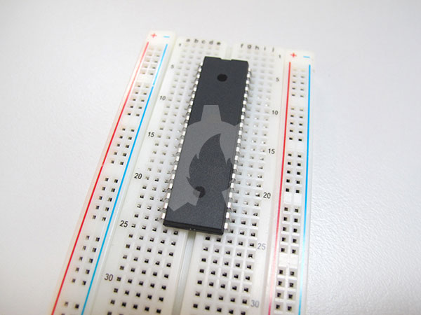

*Gambar 10. IC DIP kaki 40 pada Breadboard*

### 4. Baris dan Kolom

Jika kita perhatikan pada breadboard akan kita lihat banyak sekali angka dan huruf yang tertera pada kolom dan barisnya. Ini sebenarnya tidak memiliki tujuan apapun, hanya untuk memandu kita saat membuat rangkaian, hal ini jelas mempermudah dalam membuat rangkaian elektronika. Sirkuit yang dibuat mungkin saja rumit dan komplek, dan bisa saja terjadi kesalahan rangkaian yang bisa berpengaruh secara total atau bahkan kerusakan fatal pada komponen. Jika kita menelusuri rangkaian dengan mengikuti koneksi nomor baris dan huruf kolom mungkin kesalahan tersebut akan dengan cepat kita temukan. Penomoran baris dan huruf kolom juga akan membantu kita untuk membuat rangkaian dengan melihatnya langsung dari skema. Banyak buku dan panduan yang menyertakan diagram sirkuit sebagai acuan pada saat kita membuat rangkain pada breadboard.

### 5. Fitur Lainnya

Ketika membuat suatu rangkaian yang cukup komplek, terkadang kita tidak bisa menampungnya dalam satu breadboard. Beberapa rangkaian elektronik membutuhkan lebih banyak ruangan. Banyak jenis breadboard yang memiliki tonjolan kecil dan slot pada sisi kiri dan kanannya. Ini berfungsi untuk menghubungkan satu breadboard dengan breadboard lainnya untuk membentuk area prototype yang lebih luas.

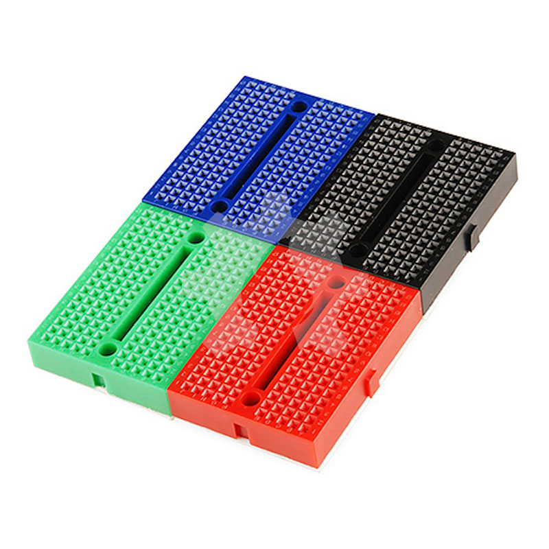

*Gambar 11. Empat Mini Breadboard yang digabungkan*

Beberapa breadboard dilengkapi dengan perekat yang memungkin kita untuk menempelkannya pada suatu permukaan. Ini bermanfaat ketika kita ingin melampirkan suatu rangkaian prototype terhadap rangkaian yang sudah tersedia. Ini biasanya dilakukan pada proyek-proyek khusus yang bersifat pengembangan dari rangkaian yang sudah ada atau sudah jadi.
Pada breadboard dengan ukuran yang lebih besar, biasanya strip rel listrik atas (setengah bagian atas) tidak berhubungan degan rel listrik bawah (setengah bagian bawa) pada satu breadboard. Hal ini membuat kita lebih mudah jika rangkaian elektronik yang kita buat membutuhkan daya berbeda, misal; satu rangkaian membutuhkan daya 3.3 volt sedangkan rangkaian berikutnya membutuhkan daya 5 volt. Namun terkadang atau sebagian besar pengguna baru breadboard, menyangka bahwa satu strip tegangan positif akan berhubungan dari atas sampai bawah, padahal tidak. Hal ini sering membuat rangkaian tidak bekerja. Maka periksalah terlebih dahulu strip konduktor positif dan negatifnya, apakah saling berhubungan satu sama lain menggunakan multimeter.

***

## Menyediakan Sumber Daya pada Breadboard

### 1. Meminjam dari pin Arduino

Jika kita berkerja menggunakan papan pengembangan seperti misalnya Arduino, dengan mudah kita bisa meminjam sumber daya yang berasal dari pin Arduino. Arduino memiliki banyak pin sumber daya dan pin ground yang dapat kita hubungkan pada rel tegangan breadboard atau baris lainnya pada breadboard.

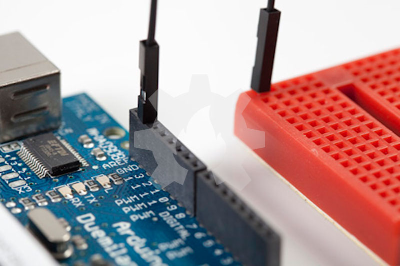

*Gambar 12. Menghubungkan pin Ground (GND) Arduino ke dalam lubang Mini Breadboard*

Arduino biasanya memperoleh sumber daya yang berasal dari port USB komputer atau melalui sumber daya luar seperti halnya Baterai atau power supply

### 2. Sumber Daya Khusus Breadboard

Cara lain untuk menyediakan sumber daya pada breadboard adalah dengan menggunakan sumber daya khusus yang didesain untuk breadboard. Banyak yang sudah menjual module khusus ini dan berharga murah. Sumber daya breadboard ini biasanya menyediakan beberapa port sumber daya yang bisa dihubungkan keluar. Power supply atau sumber daya ini menyediakan tegangan teregulasi yang diambil baik dari USB komputer ataupun menggunakan power supply khusus.

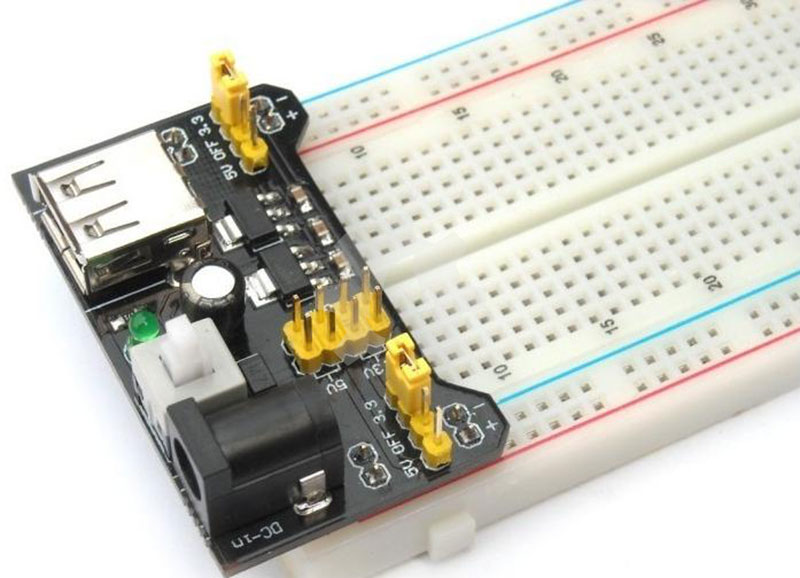

*Gambar 13. Power Regulator khusus Breadboard*

***

## Membangun Rangkaian Sederhana pada Breadboard

Setelah memahami apa dan bagaimana breadboard, mengetahui bagaimana menggunakan sumber daya pada breadboard, lalu bagaimana memulia membangun suatu rangkaian elektronik? Mari kita mencoba membuatnya...

### 1. Apa yang dibutuhkan?

Untuk membangun suatu rangkaian elektronik maka kebutuhannya pun sebenarnya mengikuti rangkaian apa yang akan dibuat. Dibawah ini hanya akan disebutkan komponen umum yang wajib disediakan pada saat membangun rangkaian elektronik, mengenai komponen yang merupakan kelengkapan rangkaian elektronikanya tidak akan disebutkan.
Breadboard
Untuk keleluasaan dalam membangun rangkaian elektronika sebaiknya kita menggunakan breadboard dengan ukuran cukup luas. Breadboard dijual dengan spesifikasi yang dilihat dari jumlah lubang yang tersedia.

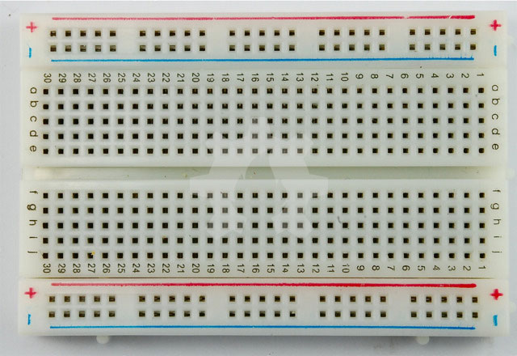

*Gambar 14. Breadboard 400 lubang*

#### a. Jumper Wire

Jumper wire atau kabel jumper merupakan komponen yang wajib ada, karena perangkat ini digunakan untuk menghubungkan satu komponen dengan komponen lainyya yang memiliki jarak berjauhan. Anda bisa membeli jumper wire dari toko elektronika atau membuat sendiri dari kabel tunggal berukuran kecil. Kita bisa memanfaatkan kabel tunggal bekas kabel UTP bekas LAN atau menggunakan kabel tunggal bekas kabel telephone rumah.

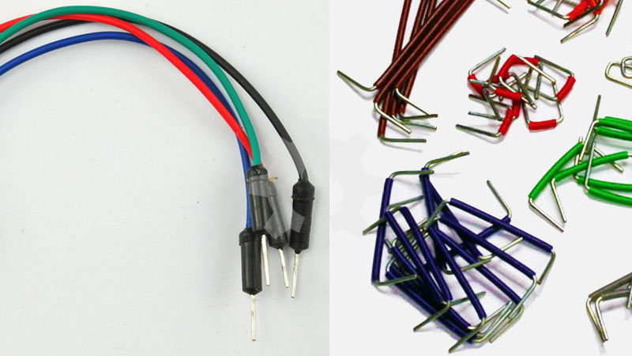

*Gambar 15. (Kiri) Kabel Jumper Komersil (Kanan) Kabel Jumper buatan sendiri*

#### b. Breadboard Regulator

Ini adalah modul khusus yang dibuat untuk breadboard. Modul sumber daya ini memiliki pin dibawahnya yang sudah disesuaikan dengan lubang rel tegangan breadboard. Modul regulator ini biasanya menghasilkan tegangan yang teregulasi dengan 2 variasi besaran tegangan yaitu 3,3 volt dan 5 volt. Dan menghasilkan tegangan pada pin sisi kiri dan pin sisi kanannya. Kita tinggal menancapkannya pada breadboard maka rel tegangan kiri dan kanan sudah tersedia tegangan tanpa perlu menyambungkannya dengan kabel jumper. Juga kita bisa menge-set tegangan yang berbeda antara kiri dan kanan. Misal, rel kanan diset 5 volt, maka rel kiri bisa kita set 3,3 volt.

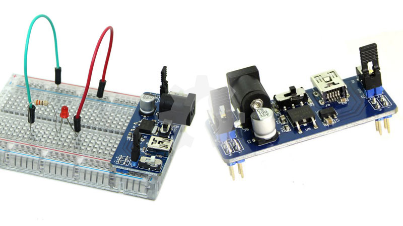

*Gambar 16. Module Regulator Breadboard*

#### c. Eksternal Power Supply

Eksternal Power Supply atau ada yang menyebutnya dengan sumber daya tempel (wall power supply). Power supply jenis ini banyak tersedia dipasaran dengan harga cukup murah. Jika anda bermaksud membeli power supply jenis ini, pastikan bahwa power supply mengasilkan tegangan 12 volt dengan arus minimal sebesar 1 ampere.

*Gambar 17. Eksternal Power Supply*

### 2. Membuat Rangkaian

Siapkan skematik rangkaian elektronika yang akan kita buat diatas breadboard. Misal seperti gambar dibawah ini:

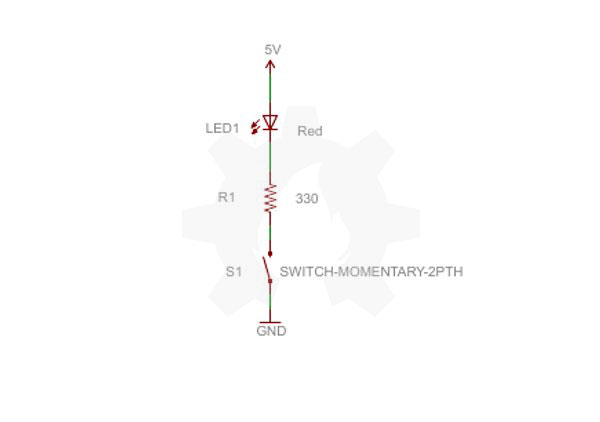

*Gambar 18. Skematik Rangkaian Elektronika*

Setelah rangkaian tersedia, siapkan peralatan prototyping seperti telah dibahas diatas, kemudian buat rangkaian dengan mengacu pada skematik diatas. Jika kita perhatikan skematik diatas maka dapat kita baca sebagai berikut:

* Panah keatas yang bertuliskan 5V berarti harus dihubungkan ke rel positif breadboard dengan warna strip 'merah'. Pasang kabel jumper kelubang rel positif ini satu ujung.
* LED1 dengan keterangan 'Red' berarti menerima tegangan langsung dari rel positif breadboard. Tanjapkan kaki LED pada baris yang berbeda pada breadboard. Misal, kaki Anoda dipasang pada baris nomor 5 maka kaki katoda dipasang pada baris nomor 4 atau bari nomor 6 (atau sesuai keinginan). Pasangkan ujung jumper lainnya yang berasal dari rel positif tadi pada kaki Anoda LED yang dipasang pada baris 5.
* Pasangkan sebuah Resistor dengan keterangan 'R1 330' pada lubang breadboard yang lurus dengan baris kaki katoda LED, misal tadi kita pasang kaki katoda pasa baris nomor 6, maka hubungkan resistor lurus pada baris nomor 6. Lalu tancapkan kaki resistor yang satunya pada baris lain pada breadboard. Misal kita pasang pada baris nomor 10.
* Pasangkan saklar dengan keterengan 'S1 SWITCH-MOMENTARY-2PTH' pada breadboard. Satu kaki kita pasangkan lurus pada baris nomor 10 yang berasal dari kaki resistor. Dan kaki saklar yang satunya lagi kita pasang pada baris lainnya, misal baris 12.
* Tancapkan sebuah kabel jumper ke rel negatif breadboard. Kemudian tancapkan ujung kabel jumper yang satunya lagi lurus dengan baris kaki saklar. Beres!!!

Maka kurang lebih gambar rangkaian prototyping-nya seperti dibawah ini:

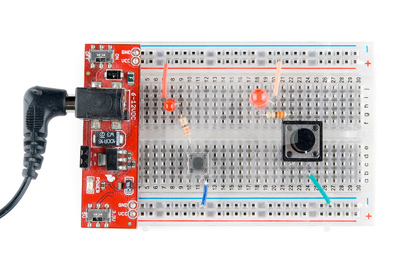

*Gambar 19. Prototyping Rangkaian Sederhana*

### 3. Prototyping tanpa Breadboard

Perkembangan teknologi saat ini membuat proses prototyping menjadi sangat mudah dan cepat. Sebelum anda membangun prototype langsung diatas breadboard, kita bisa membuat prototyping menggunakan perangkat lunak terlebih dahulu. Hal ini untuk mempermudah proses prototyping pada breadboard. Perangkat lunak yang sangat terkenal dan dianjurkan adalah Fritzing. Perangkat lunak ini semakin hari semakin lengkap. Bahkan versi terakhir Fritzing sudah mendukung penulisan kode untuk Arduino, kompilasi kode bahkan upload kode ke papan Arduino. Pada awalnya Fritzing hanya digunakan untuk membantu proses prototyping, tapi makin hari fungsinya semakin lengkap. Anda bisa mengunduh perangkat lunak Fritzing disini.

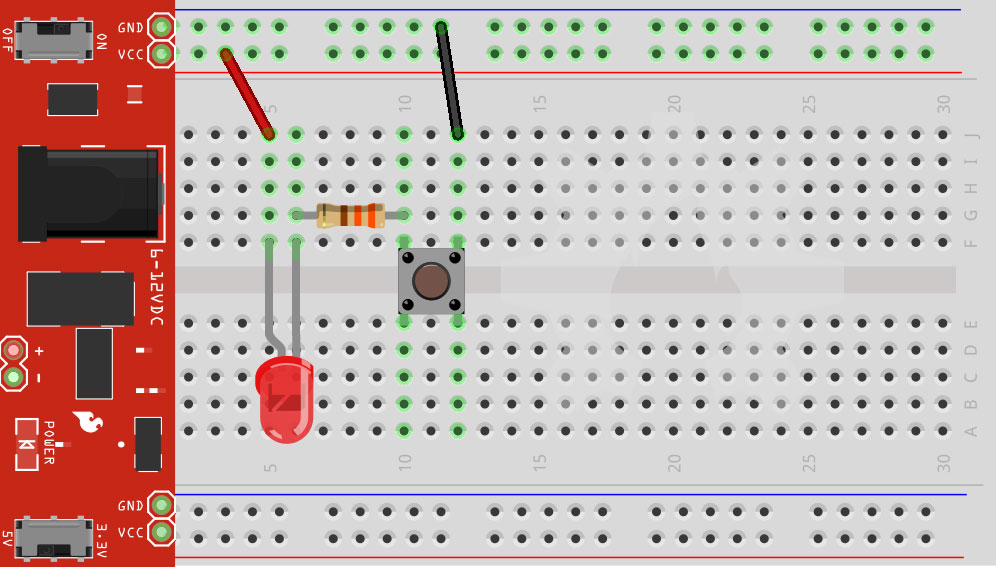

*Gambar 20. Hasil Prototyping dengan Perangkat Lunak Fritzing*

***

## Kesimpulan

Setelah membaca artikel panjang ini, penulis berharap bahwa artikel ini membantu siapapun yang baru mengawali belajar tentang elektronika. Prototyping bukanlah lagi hal sulit karena semakin hari perlengkapan prototyping itu semakin lengkap. Protityping adalah hal menyenangkan dan memusingkan namun bisa meminimalisir kesalahan produk yang akan kita buat. Kita bisa menganalisa rangkaian, menemukan kesalahan dan memperbaikinya tanpa melakukan penyolderan. Hal yang sangat membantu dalam proses pembuatan perangkat elektronika.

***

## Referensi

* [How to Use a Breadboard][1]
* [What is a Breadboard and How to use it][2]
* [Breadboard][3]
* [Wire wrap][4]
* [Breadboard and LEDs][5]
* [Make an RGB LED Fader][6]
* [Instructables Bradboard Story][7]
* [Fritzing][8]

[1]: https://learn.sparkfun.com/tutorials/how-to-use-a-breadboard
[2]: http://www.tweaking4all.com/hardware/breadboard/
[3]: http://en.wikipedia.org/wiki/Breadboard
[4]: http://en.wikipedia.org/wiki/Wire_wrap
[5]: http://www.ladyada.net/learn/arduino/lesson3.html
[6]: https://learn.adafruit.com/adafruit-arduino-lesson-7-make-an-rgb-led-fader
[7]: http://www.instructables.com/member/mischka/
[8]: http://www.fritzing.org/