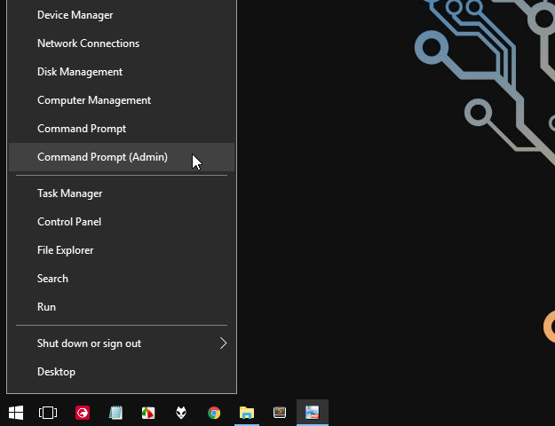
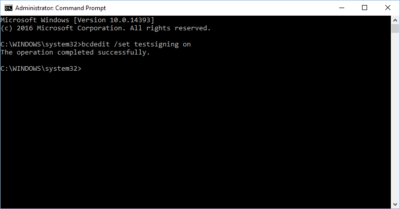
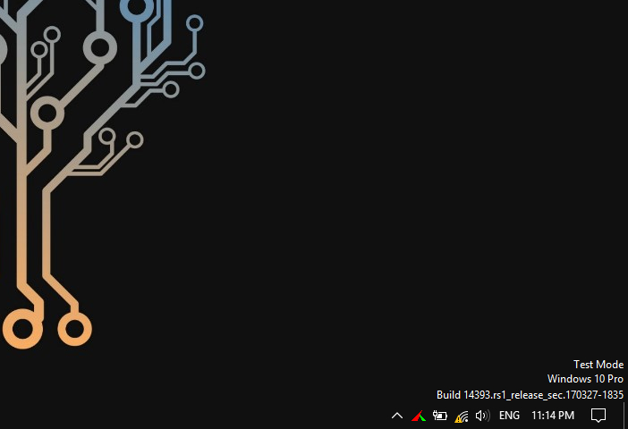
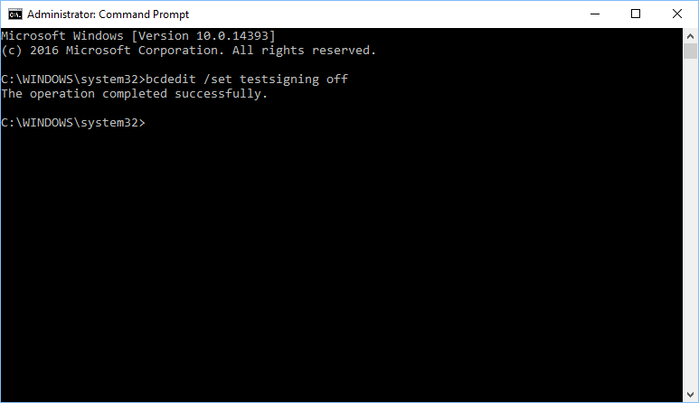
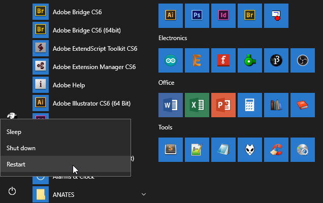
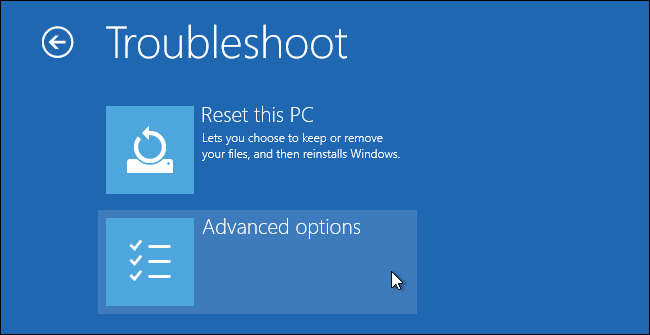
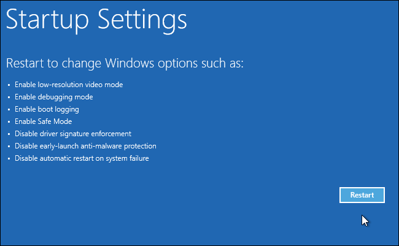
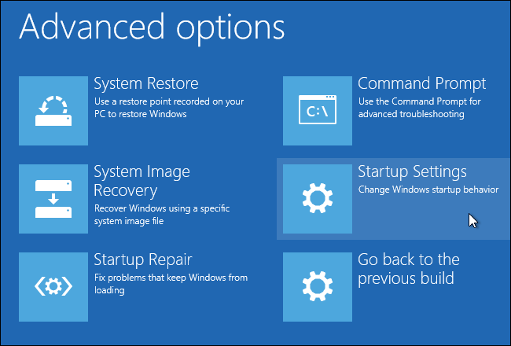
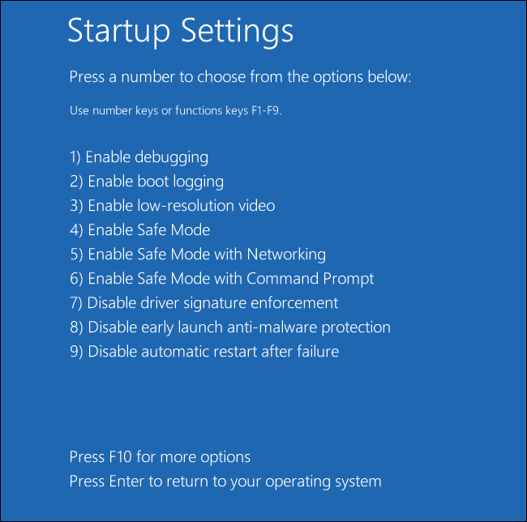
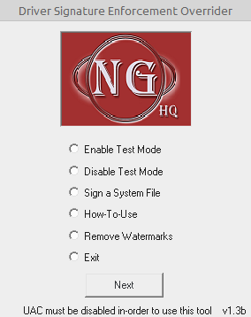

title: Driver Signature Enforcement Windows
description: Kebijakan Microsoft hanya mengizinkan driver yang ditandatangani untuk dimuat di dalam OS Microsoft dapat dianggap sebagai tindakan keamanan ekstra yang bertujuan untuk membuat sistem Anda sedikit lebih aman dan mencegah eksekusi kode berbahaya.
hero: Driver Signature Enforcement Windows 10 x64
disqus: henduino

# Driver Signature Enforcement Windows

Windows 10 dan 8 versi 64-bit memasukan fitur "**Driver Signature Enforcement**" atau "*pengesahan tanda tangan*" pada *driver hardware* (penggerak perangkat keras). Windows hanya akan memuat driver yang telah ditandatangani oleh pihak Microsoft. Jika akan menginstal driver yang tidak resmi, driver lama yang tidak ditandatangani, atau driver yang dikembangkan sendiri, maka fitur pengesahan tanda tangan ini harus di nonaktifkan.

Dengan Update ulang pada Windows 10, pihak Microsoft memperkuat cengkramannya terhadap tingkat keamanan sistem operasi mereka. Tapi kita sebenarnya masih bisa menghindari persyaratan pengesahan driver (*driver-signing*) dengan cara menonaktifkan Secure Boot (Boot yang terjamin Keamanannya).

***

## Driver Signature Enforcement - Fitur Keamanan

Sebelum memulai, ingatlah bahwa Microsoft bukan hanya sedang berusaha menciptakan kehidupan Anda semakin sulit disini. Persyaratan bahwa driver yang telah sah (*Driver Signature Enforcement*) juga memaksa pihak perusahaan untuk mengirimkan driver mereka ke Microsoft, agar setelah Microsoft melakukan penelitian spesifik terhadap suatu driver, barulah driver yang telah ditandatangani tersebut akan dimuat ke dalam kernel Windows. Tujuannya adalah untuk mencegah malware menggali jalan masuk ke kernel Windows. Jika malware menemukan jalan masuk maka sistem operasi dalam keadaan gawat darurat.

Nonaktifkan fitur *Driver-Signing* maka kita akan dapat menginstal driver yang tidak ditandatangani secara resmi oleh pihak Microsoft. Yakinlah dengan apa yang akan lakukan ini! Karena seharusnya kita hanya menginstal driver yang sudah dipercaya.

***

## Apa Manfaatnya Me-non-aktifkan DSE?

Bagi para pehobi robotika mikrokontroler biasanya akan menemukan perangkat keras yang digunakan untuk berkomunikasi dengan komputer yang merupakan perangkat keras generasi lama, hal ini karena dalam dunia robotika mikrokontroler perangkat-perangkat keras yang digunakan tidaklah harus generasi terbaru. Justru ketika menggunakan perangkat keras generasi baru, para pehobi kurang tertantang. Hal inilah yang dapat menimbulkan masalah, karena sistem operasi terus diperbaharui terutama dari sisi kelengkapan perangkat lunak dan dari sisi keamanan sistem operasi, sedangkan perangkat robotika mikrokontroler justru menggunakan perangkat yang dianggap tertinggal jaman. Sistem Operasi tidak mau memasukan daftar perangkat lama, sedangkan pehobi tetap menggunakan perangkat keras lama, terjadilah masalah driver tidak dikenali. Padahal sih dikenali secara komunikasi antar perangkat keras hanya saja pihak Microsoft tidak mau memasukan daftar perangkat keras lama kedalam sistem operasinya hanya karena masalah keamanan. Disinilah peran menon-aktifkan Driver Signature Enforcement dibutuhkan. Matikan fasilitas Driver Signature Enforcement pada sistem operasi dan install kedalam sistem operasi maka perangkat keras lama dapat berjalan dengan baik. Misal perangkat keras yang tidak dimasukkan ke dalam daftar Microsoft Windows adalah USB TTL produk WinChip dengan seri CH340 dan CH341.

***

## Cara Menonaktifkan Driver Signature

Dibawah ini terdapat tiga metode untuk menon-aktifkan Driver Signature dari cara yang termudah hingga cara yang paling sangat super mudah... Silahkan dipilih menurut selera masing-masing dan semua metode gratis tanpa berbayar...

### Metode 1 : Aktifkan Mode Uji

Windows menyediakan fitur "*Test Mode*" atau "*Test Signing*" atau dalam bahasa Indonesia diartikan "Mode Uji". Aktifkan saja fitur mode ini maka "*Driver Signature Enforcement*" tidak akan diaktifkan hingga Windows keluar dari Mode Uji. Ketika Windows masuk ke Mode Uji maka informasi "*Test Mode*" dan beberapa informasi sistem operasi akan tampil di pojok kanan bawah desktop, tepat diatas informasi jam. Informasi ini untuk memberitahu pengguna bahwa Windows sedang masuk ke mode uji.

Untuk mengaktifkan mode uji kita harus mengetikan perintah "*Boot Configuration Data*" atau disingkat BCD melalui Command Prompt Administrator. Untuk menjalankan Command Prompt Administrator bisa dilakukan dengan dua cara, yaitu: Klik Kanan pada tombol Start atau tekan kombinasi tombol keyboard Windows + X kemudian pilih menu "Command Prompt (Admin)"



*Gambar 1. Menu Command Prompt (Admin)*

Jendela Command Prompt akan tampil, ketikan perintah dibawah ini kemudian tekan tombol Enter

```
bcdedit /set testsigning on
```



*Gambar 2. Test Mode On*

Restart komputer untuk memasuki mode uji. Setelah komputer di Restart, perhatikan informasi di pojok kanan bawah desktop tepat diatas jam, ada informasi tentang "Test Mode". 



*Gambar 3. Berhasil Mengaktifkan Mode Uji*

Saat mode uji seperti ini, kita bebas memasang driver apapun yang belum ditandatangani oleh pihak Microsoft termasuk driver lawas saat kernel Windows belum disertakan fitur Driver Signature Enforcement.

Untuk meninggalkan mode uji, bukan jendela "Command Prompt (Admin)" sekali lagi, kemudian ketika perintah dibawah ini

```
bcdedit /set testsigning off
```



*Gambar 4. Meninggalkan Mode Uji*

Restart komputer dan pastikan bahwa tanda air (*watermark*) yang berada di pojok kanan bawah dekstop telah menghilang. Berarti kita sudah masuk ke mode normal.

***

### Metode 2 : Menggunakan Pilihan Boot Lanjutan

Selain metode 1 diatas, kita bisa memanfaatkan fitur *Advanced Boot Option* (Pilihan Boot Lanjutan) pada Windows 10 untuk menonaktifkan fitur *Driver Signature Enforcement*. Cara seperti ini bukanlah konfigurasi yang permanen. Ketika kita melakukan restart pada Windows, maka fitur *Driver Signature Enforcement* akan diaktikan ulang, kecuali jika kita melakukan *Advanced Boot Option* lagi.

Untuk membuka menu opsi booting lanjutan pada Windows 8 atau 10, ikuti langkah berikut.

**Langkah 1.** Tekan tombol Shift saat Anda mengeklik pilihan "Restart" di Windows. Komputer akan melakukan restart dan masuk ke menu.



*Gambar 5. Masuk ke menu melalui Shift + Restart*

**Langkah 2.** Pilih dan klik kotak menu "Troubleshoot" pada layar "Choose an option".


*Gambar 6. Menu Troubleshoot*

**Langkah 3.** Pilih dan klik kotak menu "Advanced Option"



*Gambar 7. Menu Advanced Option*

**Langkah 4.** Klik dan klik kotak menu "Startup Settings".



*Gambar 8. Menu Startup Settings*

**Langkah 5.** Klik tombol "Restart" untuk me-restart komputer dan memasuki layar "Startup Settings".



*Gambar 9. Layar Startup Settings*

**Langkah 6.** Ketik tombol "7" atau tombol "F7" di layar Startup Settings untuk mengaktifkan opsi "Disable driver signature enforcement".



*Gambar 10. Layar Pilihan Startup Settings*

Setelah itu komputer akan menjalankan boot dengan fitur pengesahan tanda tangan driver yang dinonaktifkan dan kita dapat menginstal driver yang tidak ditandatangani atau belum disyahkan oleh Microsoft. Namun, pada saat komputer di-restart, fitur "*Driver Signature Enforcement*" tersebut akan dinonaktifkan, kecuali jika kita menjalankan menu ini lagi. 

***

### Metode 3 : Menggunakan Perangkat Lunak Khusus

Metode yang ketiga merupakan metode yang paling sederhana yang menggunakan bantuan perangkat lunak khusus yang bernama "**Driver Signature Enforcement Overrider**".



*Gambar 11. Driver Signature Enforcement Overrider*

Dengan perangkat lunak ini proses ribet seperti metode diatas akan terhindari. Untuk penggunaannya penulis tidak akan menjabarkannya tapi untuk perangkat lunaknya silahkan [unduh Driver Signature Enforcement Overrider disini][1].

***

Sekarang, silahkan anda menginstal driver yang belum secara resmi ditandatangani oleh Microsoft. Semoga berhasil...

[1]: https://www.softpedia.com/get/Tweak/Video-Tweak/Driver-Signature-Enforcement-Overrider.shtml