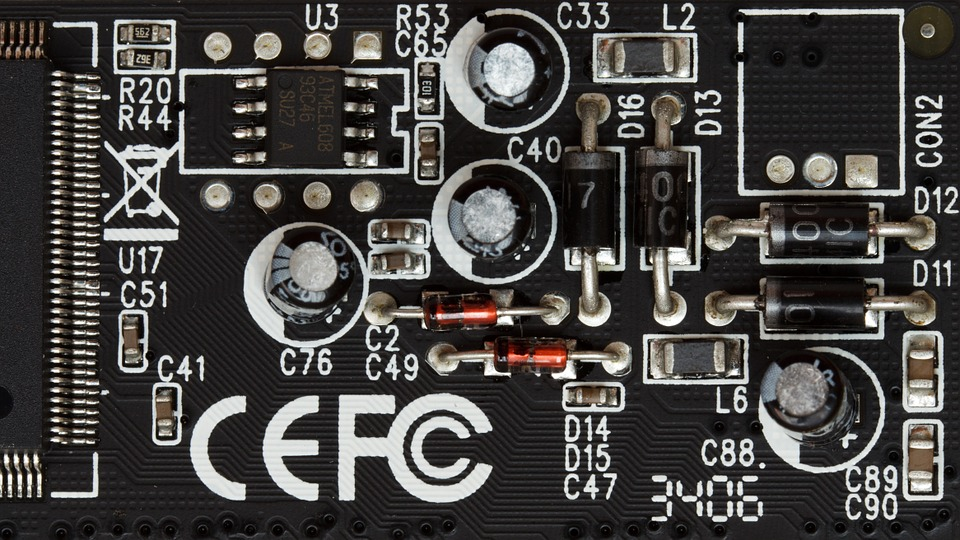
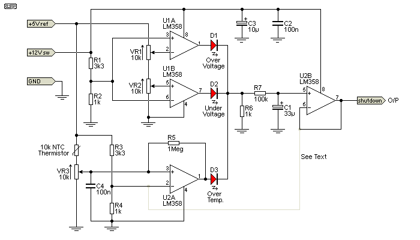

title: Reference Designator
description: Reference Designator atau disingkat RefDes adalah suatu cara untuk mengidentifikasi komponen didalam skema kelistrikan atau pada printed circuit board - PCB
hero: Reference Designator
disqus: henduino

# Reference Designator

**Reference Designator** atau disingkat ==RefDes== adalah suatu cara untuk mengidentifikasi komponen didalam skema kelistrikan atau pada printed circuit board (PCB). RefDes biasanya terdiri dari satu atau dua huruf yang diikuti oleh angka, misal; R10, C105. Terkadang setelah nomor diikuti juga dengan huruf, yang menunjukan bahwa komponen tersebut dikelompokan atau dicocokan satu sama lain, misal; R10A, R10B, IC1A, IC1B. Pengelompokan tersebut biasanya menunjukan bahwa didalam satu komponen fisik, terdiri dari sekumpulan komponen lain yang ada didalamnya. Contoh komponen LM358 sebagai IC1 didalamnya terdiri dari 2 Operational Amplifier, maka bRefDes-nya akan ditulis IC1A dan IC1B. RefDes merupakan kesepakatan bersama secara internasional yang direncanakan, diterbitkan dan direvisi hanya oleh Organisasi Nirlaba bernama "*Institute of Electrical and Electronics Engineers*" atau sering disingkat "IEEE". Sehinga bagi para pecinta elektronika, menggambar skema dan membuat desain PCB harus mengikuti standar internasional agar siapapun yang hendak membaca skema anda akan dengan mudah untuk memahaminya. Khusus untuk dunia skema kelistrikan, elekronik dan PCB mengacu pada standar IEEE nomor 315 yang distandarisasi sejak tahun 1975 sehingga terkenal dengan [IEEE 315-1975][3]. IEEE 315 berisi daftar huruf-huruf penanda kelas yang khusus digunakan untuk skema atau rangkaian kelistrikan dan elektronika. Misal; huruf R adalah awalan referensi untuk resistor dalam perakitannya, C untuk kapasitor (capacitor), dan K untuk relai (relay). Hati-hati, banyak orang kemudian menganggap bahwa huruf yang digunakan pada RefDes diambil dari huruf awal komponen yang digunakan, tidak salah 100% namun tidak juga benar, misal; R digunakan untuk menunjukan Resistor, C untuk capacitor, tapi bagaimana dengan T? T tidak digunakan untuk Transistor namun digunakan sebagai awalan referensi Trafo atau Transformer, sedangkan Transistor menggunakan huruf Q.



*Gambar 1. Reference Designator pada PCB*

***

## Sejarah

[IEEE 200-1975][1] atau "*tandard Reference Designations for Electrical and Electronics Parts and Equipments*" adalah standar yang digunakan untuk menentukan sistem referensi penamaan untuk koleksi peralatan elektronik. IEEE 200 diratifikasi pada tahun 1975. IEEE memperbarui standarnya pada tahun 1990-an, tetapi menarik dukungan aktif tersebut tidak lama kemudian. Dokumen ini juga memiliki nomor dokumen ANSI yaitu [ANSI Y32.16-1975][1].

Informasi kodifikasi standar ini antara lain bersumber dari standar militer Amerika Serikat MIL-STD-16 yang berasal dari setidaknya tahun 1950-an di industri Amerika.

Untuk menggantikan IEEE 200-1975, ASME (American Society of Mechanical Engineers) yaitu badan standar untuk insinyur mekanik, memprakarsai standar baru yaitu [ASME Y14.44-2008][5]. Standar ini bersama dengan IEEE 315-1975, memberikan panduan kepada desainer kelistrikan tentang cara mereferensikan dan memberi anotasi dengan benar mulai dari papan sirkuit tunggal hingga kumpulan sistem kelistrikan/elektronika secara lengkap.

***

## Definisi

[ASME Y14.44-2008][5] dan [IEEE 315-1975][4] memuat cara mereferensikan dan menjelaskan komponen perangkat elektronik.
Terkadang suatu rakitan kelistrikan atau elektronik buat beberapa unit dalam satu sistem. Misal; ketika membuat "sound system" kita akan dengan mudah mengidentifikasinya jika terbagi menjadi beberapa sub-bagian, misal; tone control, pre amplifier, amplifier, sub woofer dan lain sebagainya. Unit adalah tingkat demarkasi tertinggi dalam suatu sistem dan selalu berupa angka. Batasan berikutnya disebut rakitan dan selalu memiliki Huruf Kelas "A" sebagai awalan yang diikuti dengan nomor urut yang dimulai dengan 1. Sejumlah sub-rakitan dapat ditentukan hingga akhirnya mencapai bagian terkecil yaitu komponen. Perhatikan bahwa IEEE-315-1975 mendefinisikan *huruf penanda kelas yang terpisah* untuk rakitan yang dapat dipisahkan (penanda kelas 'A') dan *rakitan yang tidak dapat dipisahkan* (penanda kelas 'U'). Rakitan yang tidak terpisahkan yaitu, "item yang biasanya diganti sebagai satu item/paket pengganti" - biasanya diperlakukan sebagai komponen dalam skema referensi ini.



*Gambar 2. Reference Designator pada Schematic*

Contoh:

```
1A12A2R3 - Unit 1, Perakitan 12, Sub-rakitan 2, Resistor 3
1A12A2U3 - Unit 1, Perakitan 12, Sub-rakitan 2, Perakitan Tak Terpisahkan 3
```

Yang sangat berharga adalah metode referensi dan anotasi kabel ditambah konektornya di dalam dan di luar rakitan.

Contoh:

```
1A1A44J5 - Unit 1, Perakitan 1, Sub-Perakitan 44, Jack 5 (J5 adalah konektor pada kotak yang direferensikan sebagai A44)
1A1A45J333 - Unit 1, Perakitan 1, Sub-Perakitan 45, Jack 333 (J333 adalah konektor pada kotak yang direferensikan sebagai A45)
```

Kabel yang menghubungkan keduanya mungkin:

```
1A1W35 - Dalam perakitan A1 ada kabel yang disebut W35.
```

Konektor pada kabel ini akan ditetapkan:

```
1A1W35P1
1A1W35P2
```

ASME Y14.44-2008 melanjutkan konvensi Plug P dan Jack J ketika menetapkan referensi untuk konektor listrik pada rangkaian di mana J (atau jack) lebih tetap dan P (atau steker) adalah tidak tetap dari pasangan konektor, tanpa memperhatikan jenis kelamin kontak konektor tersebut.

Konstruksi RefDes dicakup oleh IEEE 200-1975/ANSI Y32.16-1975 dan diganti atau direvisi oleh ASME Y14.44-2008 dan IEEE-315-1975.

***

## Tabel Designator (Ref Des)

Tabel di bawah ini adalah daftar Designator yang biasa digunakan, walaupun tidak selalu sesuai dengan standar.

| **RefDes** | **Tipe Komponen**                                                                                                                            |
|:------:|------------------------------------------------------------------------------------------------------------------------------------------|
|   A    | Rakitan terpisah atau sub-rakitan                                                                                                         |
|   AT   | Attenuator atau isolator                                                                                                                 |
|   BR   | Bridge Rectifier                                                                                                                         |
|   BT   | Battery                                                                                                                                  |
|   C    | Capacitor                                                                                                                                |
|   CN   | Capacitor Network                                                                                                                        |
|   D    | Diode (semua tipe, termasuk LED), Thyristor                                                                                              |
|   DL   | Delay Line                                                                                                                               |
|   DS   | Display                                                                                                                                  |
|   F    | Fuse atau Sekering                                                                                                                       |
|   FB   | Ferrite bead                                                                                                                             |
|   FD   | Fiducial                                                                                                                                 |
|   FL   | Filter                                                                                                                                   |
|   G    | Generator atau oscillator                                                                                                                |
|   GN   | General Network                                                                                                                          |
|   H    | Hardware, misal; baut, mur, ring                                                                                                         |
|   HY   | Circulator atau directional coupler                                                                                                      |
|   IR   | Infrared Diode atau Infra-Merah                                                                                                          |
|   J    | Jack (biasanya konektor yang bisa di pasang-cabut), Jack Connector (konektor memiliki pin "laki-laki" dan atau "perempuan")              |
|   JP   | Jumper (Link)                                                                                                                            |
|   K    | Relay atau contactor                                                                                                                     |
|   L    | Inductor atau coil atau ferrite bead                                                                                                     |
|   LS   | Loudspeaker atau buzzer                                                                                                                  |
|   M    | Motor                                                                                                                                    |
|   MK   | Microphone                                                                                                                               |
|   MP   | Mechanical Part (termasuk skrup dan fastener)                                                                                            |
|   P    | Plug (biasanya konektor yang bisa di pasang-cabut), Plug Connector (konektor memiliki pin "laki-laki" dan atau "perempuan")              |
|   PS   | Power supply                                                                                                                             |
|   Q    | Transistor (semua tipe)                                                                                                                  |
|   R    | Resistor                                                                                                                                 |
|   RN   | Resistor Network                                                                                                                         |
|   RT   | Thermistor                                                                                                                               |
|   RV   | Varistor, Variable Resistor                                                                                                              |
|   S    | Switch (semua tipe, termasuk tombol)                                                                                                     |
|   T    | Transformer atau Trafo                                                                                                                   |
|   TC   | Thermocouple                                                                                                                             |
|   TP   | Test point                                                                                                                               |
|  TUN   | Tuner                                                                                                                                    |
|   U    | Integrated circuit (IC)                                                                                                                  |
|   V    | Vacuum Tube                                                                                                                              |
|   VR   | Voltage Regulator (Voltage Reference), Variable Resistor (Potentiometer atau Rheostat)                                                   |
|   X    | Socket Sonnector selain pada P atau J, bisanya disambungkan dengan komponennya (XV untuk soket vacuum tube, XF untuk dudukan fuse, dsb.) |
|  XTAL  | Crystal                                                                                                                                  |
|   Y    | Crystal atau Oscillator                                                                                                                  |
|    Z   | Zener Diode                                                                                                                              |

***

## Daftar Pustaka

* [IEEE 200-1975][1]
* [IEEE 200][2]
* [IEEE 315-1975][3]
* [IEEE 315][4]
* [ASME Y14.44-2008][5]
* [Reference designator][6]
* [Standard Reference Designations for Electrical Equipment][7]
* [Standard Reference Designators][8]

[1]: https://www.noao.edu/ets/Mechanical/Policies/ANSI%20Y32.16-1975.pdf
[2]: https://ieeexplore.ieee.org/document/4483758
[3]: https://www.ee.iitb.ac.in/~spilab/Tips/ansii_graphic_symbols_for_electrical_and_electronics_daigrams_1993.pdf
[4]: https://ieeexplore.ieee.org/document/985670
[5]: https://www.asme.org/codes-standards/find-codes-standards/y14-44-reference-designations-electrical-electronics-parts-equipment
[6]: https://en.wikipedia.org/wiki/Reference_designator
[7]: https://bmet.fandom.com/wiki/Standard_Reference_Designations_for_Electrical_Equipment
[8]: https://dexpcb.com/manual/standard-reference-designators.htm

***

<small>Artikel diperbarui pada: {{ git_revision_date_localized }}</small>