title: Mengenal Resistor
description: Resistor adalah komponen listrik pasif dua terminal yang menerapkan hambatan listrik sebagai elemen sirkuit
hero: Mengenal Resistor
disqus: henduino

# Resistor

Resistor adalah komponen listrik pasif dua terminal yang menerapkan hambatan listrik sebagai elemen sirkuit. Di sirkuit elektronik, resistor digunakan untuk mengurangi aliran arus, menyesuaikan level sinyal, untuk membagi tegangan, elemen bias aktif, dan mengakhiri saluran transmisi, serta penggunaan lainnya. Resistor berdaya tinggi dapat menghilangkan banyak daya listrik menjadi panas, dapat digunakan sebagai bagian dari kontrol motor, sistem distribusi daya, atau sebagai beban uji untuk generator. Resistor tetap memiliki resistansi yang sedikit sekali perubahan nilainya akibat pengaruh suhu, waktu atau tegangan operasi. Resistor variabel dapat digunakan untuk menyesuaikan elemen sirkuit (seperti kontrol volume atau peredup lampu), atau sebagai perangkat penginderaan panas, cahaya, kelembapan, gaya, atau aktivitas kimia.

## Dasar Resistor

Resistor merupakan komponen elektronik yang spesifik, yang memiliki nilai hambatan listrik yang tidak berubah. Resistansi resistor membatasi aliran elektron yang mengalir didalam sirkuit. Resistor merupakan komponen fasif yang berarti bahwa resistor hanya mengkonsumsi daya dan tidak dapat menghasilkannya. Resistor biasanya ditambahkan ke dalam sirkuit untuk melengkapi komponen aktif seperti halnya op-amp, mikrokontroler, dan sirkuit terpadu (IC) lainnya. Umumnya resistor digunakan untuk membatasi arus (limit current), membagi tegangan (voltage divider), dan sebagai pull-up I/O.

***

## Unit resistor

Hambatan listrik dari sebuah resistor diukur dalam satuan ohm. Simbol untuk ohm menggunakan huruf Yunani (greek-capital) yaitu omega: Ω. Definisi dari 1Ω (yang mendekatinya) adalah resistansi antara dua titik di mana 1 volt (1V) energi potensial yang digunakann akan mengalirkan arus sebesar 1 ampere (1A).
Seperti halnya satuan SI lain, besar atau kecilnya nilai ohm dapat disederhanakan dengan prefix (awalan) seperti kilo-, mega-, atau giga-, sehingga membuat resistor bernilai besar mudah untuk dibaca. Kita sudah terbiasa untuk melihat nilai resistor dengan satuan antara kilohm (kΩ) dan megaohm (MΩ) (namun sangat jarang untuk menemukan resistor dalam satuan miliohm (mΩ)). Sebagai contoh, resistor 4.700Ω setara dengan resistor 4,7kΩ, dan resistor 5.600.000Ω dapat ditulis menjadi 5.600kΩ atau (lebih umumnya) 5,6MΩ.

***

## Simbol Skematik

Pada umumnya resistor memiliki dua terminal. Satu titik sambungan pada setiap ujung resistor. Ketika membaca skema rangkaian elektronik, resistor biasanya digambarkan seperti salah satu dari dua simbol dibawah ini.

*Dua simbol umum resistor pada skematik. R1 adalah simbol bergaya Amerika sebesar 1KΩ, dan R2 adalah simbol resistor bergaya Internasional sebesar 47kΩ*

Terminal dari masing-masing simbol resistor diatas adalah garis perpanjangan dari gerigi atau persegi panjang. Garis perpanjangan inilah yang terhubung kedalam rangkaian. Simbol resistor dalam rangkaian biasa diberi dua keterangan, yaitu nilai resistansi dan nama/nomor urutan resistor. Nilai resistor ditampilkan dalam satuan ohm, dan nama resistor biasanya diawali menggunakan huruf R yang diikuti nomor urut resistor, dan nomor urut resistor haruslah unik antara satu resistor dengan lainnya (tidak boleh ada resistor dengan nomor urut sama, karena beberapa perangkat lunak pembuat rangkaian akan menampilkan pesan kesalahan). Kedua hal ini sangatlah penting untuk mengevaluasi dan menciptakan sirkuit sebenarnya. Sebagai contoh, dibawah ini ada beberapa resistor yang digunakan pada rangkaian 555:

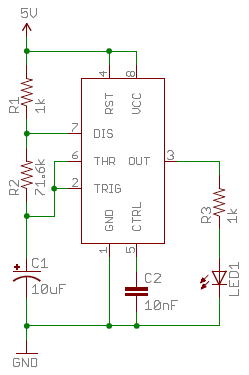

*Contoh skema dengan resistor pada timer (pewaktu) 555.*

Pada sirkuit diatas, resistor memiliki peran kunci untuk menentukan frekuensi output timer 555 (R1 dan R2). Sedangkan resistor lainnya (R3) membatasi arus yang mengalir ke LED.

***

## Jenis Resistor

Resistor dibuat dalam berbagai bentuk dan ukuran. Resistor dibuat dalam bentuk througt-hole atau surface-mount. Sesuai standar, resistor dibuat secara khusus seperti; static resistor (nilai hambatan tidak berubah), pack resistor (gabungan resistor dalam satu bentuk), atau variable resistor (nilai hambatan yang bisa diubah).

***

## Bentuk dan Ukuran

Resistor dibuat dengan bentuk salah satu dari dua jenis yang umumnya digunakan: yaitu through-hole dan atau surface-mount. Jenis resistor through-hole biasanya disingkat menjadi PTH (plated through-hole) sedangkan surface-mount biasa disingkat menjadi SMD (surface mount device) atau SMT (surface mount technology). Resistor through-hole dibuat dengan ukuran yang lebih panjang, kedua ujungnya diperpanjang dengan kawat dan dibuat lentur agar dapat terpasang dengan baik pada breadboard, atau disolder tangan pada papan prototype dan atau pada Printed Circuit Board (PCB). Resistor PTH ini biasanya digunakan pada breadboarding (rangkaian uji coba), prototyping (rangkaian sebelum tahap pembuatan masal), atau dalam rangkaian jadi dimana kita menggunakan solder manual. Resistor PTH lebih panjang 0,6mm dibanding resistor SMD. Kelemahan resistor PTH ini adalah sisa ujung kawat terminal resistor cukup panjang yang terkadang butuh pemangkasan untuk merapihkannya, dan membutuhkan ruangan lebih luas jika dibandingkan resistor jenis SMD.

Biasanya resistor through-hole dibuat dalam paket aksial. Ukuran resistor aksial disesuaikan dengan rating dayanya. Sebuah resistor ½W memiliki panjang sekitar 9,2mm, sedangkan resistor ¼W memiliki dimensi yang lebih kecil yaitu panjang sekitar 6,3mm.

*Resistor ½W (atas) dan resistor ¼W watt*

Resistor surface-mount biasanya memiliki dimensi persegi panjang hitam kecil, diakhir kedua sisinya lebih tipis, mengkilap, perak dan merupakan sisi konduktif. Tahanan ini dibuat untuk bisa ditempatkan diatas PCB, dimana resistor jenis ini disolder diatas pad yang sudah disesuaikan dengan dimensi resistor. Pad ini tidak berlubang layaknya dudukan resistor PTH namun pad resistor SMD dibuat landasan persegi empat, sehingga proses penyolderan lebih mudah dengan luas area yang lebih sempit. Posisi pemasangan resistor pun berhadapan langsung dengan pad tidak bersebrangan layaknya resistor PTH. Resistor SMD ini sangat kecil, posisi pemasangan biasanya diatur oleh robot kemudian dimasukan kedalam oven untuk melelehkan timah solder pada permukaan pad sehingga melekat dengan kuat pada PCB.

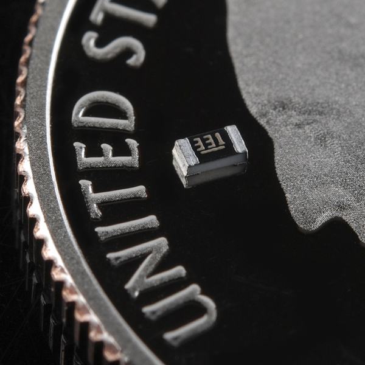

*Sebuah resistor SMD kecil 0603 diletakan didepan hidung George Washington di atas coin uang AS yang mengkilap.*

Resistor SMD dibuat dengan beberapa standar ukuran, yaitu; 0805 (panjang 0,8mm dan lebar 0,5mm), 0603, dan 0402. Mereka biasanya digunakan pada papan sirkuit yang diproduksi secara masal, atau pada desain dimana ruang merupakan hal yang sangat diperhatikan. Resistor jenis ini tetap bagus dan menarik walau proses pemasangan pada PCB menggunakan solder manual, namun hati-hati dalam memilih standar ukuran, resistor SMD dengan standar ukuran yang terlalu kecil (misal 0402) sangatlah sulit jika proses penyolderan dilakukan secara manual.

***

## Komposisi Resistor

Resistor dapat dibuat dari berbagai bahan. Paling umum, resistor modern dibuat dari bahan carbon, metal, atau metal-oxide film. Didalam resistor, sebuah bahan film konduktif tipis (yang bersifat resistif) dibalutkan secara heliks dan ditutup bahan isolator. Pada umumnya resistor jenis through-hole dibuat dengan komposisi carbon-film dan metal-film.

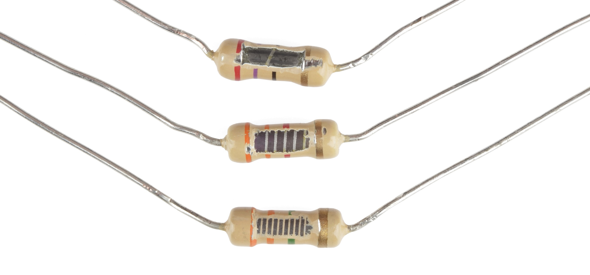

*Melihat bagian dalam dari beberapa resistor karbon film. Nilai resistansi dari atas ke bawah: 27Ω, 330Ω dan 3,3MΩ Di dalam resistor, carbon-film dililitkan dan dilindungi isolator. Lebih banyak lilitan carbon-film berarti nilai resistansinya lebih tinggi.*

Resistor through-hole lainnya bisa saja terbuat dari lilitan-kawat khusus atau dibuat dari metalic foil super-tipis. Resistor jenis ini biasanya lebih mahal, komponen khusus berkualitas tinggi yang dipilih untuk karakteristik unik seperti power-rating yang tinggi, atau untuk kisaran suhu maksimum.
Resistor surface-mount biasanya terdiri dari jenis lapisan film tebal dan film tipis. Film tebal biasanya lebih murah tapi kurang akurat jika dibandingkan dengan yang tipis. Kedua jenis resistor ini terbuat dari sebuah film kecil yang merupakan paduan logam resistif, ditempatkan di antara bahan dasar keramik dan lapisan epoxy/kaca. Dan kemudian terhubung ke tepi ujung konduktif perak.

***

## Resistor Bentuk Khusus

Ada jenis resistor lainnya, yaitu resistor yang di pak khusus. Didalam resistor tersebut sebenarnya hanya sekumpulan resistor yang disusun sejajar dan dikenal dengan nama array resistor. Resistor ini dibuat dengan tujuan khusus. Resistor jenis ini dibuat dari sekumpulan resistor yang dipaket rapi dengan salah satu kakinya digabungkan, sehingga jumlah kakinya lebih sedikit dan lebih pendek. Salah satu ujung array resistor ini merupakan pin umum untuk membagi tegangan atau digunakan sebagai pemisah tegangan.

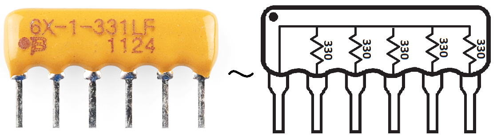

*Sebuah array resistor yang terdiri dari gabungan lima resistor bernilai 330Ω, salah satu ujung dari lima resistor tersebut diikat menjadi satu.*

Resistor tidak hanya bernilai statis. Variabel resistor atau sering dikenal dengan nama ***rheostat***, adalah resistor yang nilainya dapat disesuaikan diantara nilai-nilai tertentu. Rheostat yang paling terkenal adalah jenis potensiometer. Potensiometer terdiri dari dua resistor internal yang dihubungkan seri. Nilai resistornya diatur oleh pergerakan center tap (titik pusat) yang berfungsi untuk menyesuaikan pembagian tegangan. Variabel resistor biasanya digunakan sebagai input, seperti halnya untuk knob volume, sehingga mudah dalam penyesuaian tingkat kekerasan volume.

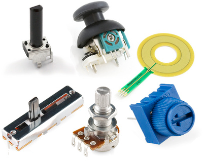

*Sekumpulan bentuk potensiometer. Dari atas kiri, searah jarum jam: Standar trimpot, 2-axis joystick, softpot, slide pot, classic pot, dan breadboard trimpot.*

***

## Mendekode (Membaca) Nilai Resistor

Meskipun resistor tidak menampilkan nilai secara langsung, sebagian besar resistor ditandai dengan tanda khusus untuk menunjukkan nilai resistansinya. Resistor PTH menggunakan sistem kode-warna (ini membutuhkan keteletitian dalam membacanya), dan resistor SMD memiliki tanda-nilai dengan sistem tersendiri.

### Mendekode (Membaca) Pita Warna Resistor Through-Hole

Through-hole, resistor aksial biasanya menggunakan sistem warna-pita untuk menampilkan nilai resistansinya. Sebagian besar resistor jenis ini memiliki empat pita warna mengelilingi tubuh resistornya.

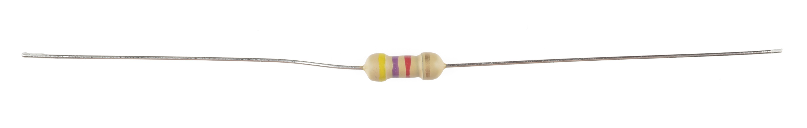

*Pita Warna Resistor Through-Hole*

#### Resistor 4 Pita

Dua pita pertama menunjukkan dua angka paling signifikan dari nilai resistor. Pita ketiga adalah nilai besaran yang mengalikan dua angka signifikan dengan kelipatan sepuluh. Pita terakhir menunjukan toleransi resistor. Toleransi menjelaskan seberapa banyak rentang kurang lebihnya nilai resistansi resistor sebagai pembanding dengan nilai nominal sebenarnya. Tidak ada resistor yang dibuat dengan nilai resistansi sempurna. Dengan proses pembuatan yang berbeda akan menghasilkan nilai toleransi yang lebih baik atau bahkan sebaliknya. Sebagai contoh, sebuah resistor bernilai 1kΩ dengan toleransi 5% maka akan memiliki rentang nilasi resistansi antara 0,95kΩ sampai dengan 1,05kΩ.

Bagaimana kita membedakan mana pita pertama dan pita terakhir? Pita terakhir sebagai pita toleransi biasanya dapat dengan jelas terlihat jaraknya berjauhan dengan pita nilai resistor, dan biasanya pita ini hanya berwarna perak atau berwarna emas.

#### Resistor 5 dan 6 Pita

Resistor lima pita memiliki pita digit signifikan ketiga antara dua pita pertama dan pita pengali. Resistor lima pita juga memiliki rentang toleransi yang lebih luas.

Resistor enam pita pada dasarnya adalah resisto lima pita dengan pita tambahan di akhir yang menunjukkan koefisien suhu. Ini menunjukkan perubahan yang diharapkan dalam nilai resistor saat suhu berubah dalam derajat Celcius. Umumnya nilai koefisien suhu ini sangat kecil, dalam kisaran ppm.

#### Mendekode (Membaca) Pita Warna

Dibawah ini merupakan tabel dari masing-masing warna yang mewakili nilai, perkalian dan toleransi:

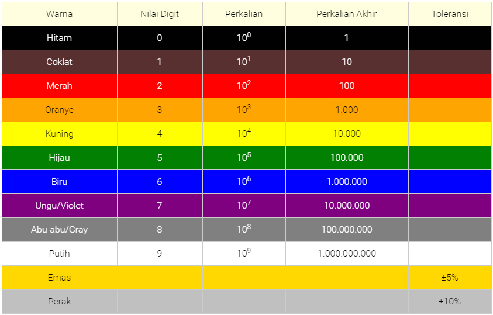

Berikut ini adalah contoh resistor 4.7kΩ dengan empat pita warna:

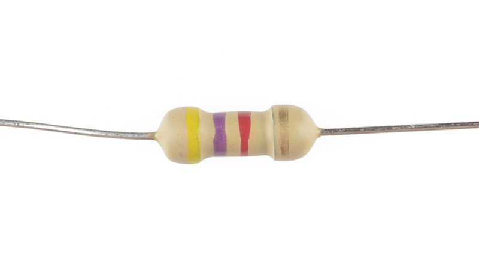

*Resistor 4.7kΩ dari dekat*

Ketika membaca pita warna resistor, sebaiknya merujuk pada tabel kode warna resistor diatas. Dua pita pertama digunakan untuk menentukan nilai digit sesuai dengan warnanya. Resistor diatas memiliki nilai resistansi 4,7kΩ karena; pita pertama berwarna Kuning yang bernilai 4 (lihat tabel), sedangkan pita kedua berwarna Ungu yang bernilai 7 (lihat tabel), nilai digit resistor tersebut adalah 4 dan 7 (47). Dan pita ketiga berwarna merah yang bernilai 102 (atau 100, lihat tabel), yang berarti bahwa 47 harus dikalikan 102 (atau 100). 47 dikalikan 100 adalah 4.700ohm. Jika ingin dibaca lebih sederhana maka menggunakan satuan kiloohm, untuk menjadi kiloohm maka harus dibagi 1000 maka menjadi 4,7kΩ.
Jika kita mencoba untuk mengingat kode warna pita resistor, ada beberapa cara untuk mengingatnya, walau terdengar rancu, tapi metode yang penulis gunakan cukup lumayan membantu dalam mengingat pita kode warna resistor, yaitu sebagai berikut:

"Hi-Co-Me-O-Ku-Hi-Bi-U-A-Pu-E-Pe"

***

### Kalkulator Kode Warna Resistor

Jika anda merasa malas dengan perhitungan matematika maka terkadang saya pun demikian :), maka cara termudah adalah dengan menggunakan kalkulator kode warna resistor yang bisa unduh pada [link ini][1]. Tentang bagaimana cara menggunakan, saya yakin anda akan dengan mudah untuk memahami dalam menggunakan kalkulator kode warna resistor tersebut. Selamat mencoba!

***

### Decoding (Membaca) Tanda Resistor Surface-Mount

Resistor Surface-Mount (SMD), seperti paket 0603 atau 0805, memiliki cara sendiri menampilkan nilainya. Ada beberapa metode umum yang bisa anda perhatikan dalam membaca tanda pada resistor SMD ini. Biasanya resistor jenis ini memiliki 3-4 karakter angka atau huruf yang dicetak diatas badan resistornya.
Jika terdiri dari tiga karakter yang terlihat dan semuanya nomor (bukan huruf), maka anda sedang melihat resistor dengan pengkodean E24. Tanda ini sebenarnya sama saja dengan cara decoding (membaca) sistem pita-warna yang digunakan pada resistor jenis PTH. Dua angka pertama mewakili dua digit pertama nilai paling signifikan, nomor terakhir mewakili besarannya (kelipatan 10).

*Resistor SMD dengan Penanda E-24*

Pada gambar contoh di atas, resistor ditandai dengan 104, 105, 205, 751, dan 754. Resistor yang ditandai dengan 104 maka bernilai 100kΩ (10x104), 105 bernilai 1MΩ (10x105), dan 205 bernilai 2MΩ (20x105). 751 bernilai 750Ω (75x101), dan 754 bernilai 750kΩ (75x104).
Sistem pengkodean yang umum lainnya adalah E96, pengkodean ini adalah pengkodean yang samar. Pengkodean resistor E96 ditandai dengan tiga karakter - dua angka diawal dan satu huruf diakhir. Dua angka diawal bernilai tiga digit, berdasarkan pada salah kode dan nilai yang tertera pada tabel dibawah ini. 

| Kode | Nilai | Kode | Nilai | Kode | Nilai | Kode | Nilai | Kode | Nilai | Kode | Nilai |
|:----:|:-----:|:----:|:-----:|:----:|:-----:|:----:|:-----:|:----:|:-----:|:----:|:-----:|
|   1  |  100  |  17  |  147  |  33  |  215  |  49  |  316  |  65  |  464  |  81  |  681  |
|   2  |  102  |  18  |  150  |  34  |  221  |  50  |  324  |  66  |  475  |  82  |  698  |
|   3  |  105  |  19  |  154  |  35  |  226  |  51  |  332  |  67  |  487  |  83  |  715  |
|   4  |  107  |  20  |  158  |  36  |  232  |  52  |  340  |  68  |  499  |  84  |  732  |
|   5  |  110  |  21  |  162  |  37  |  237  |  53  |  348  |  69  |  511  |  85  |  750  |
|   6  |  113  |  22  |  165  |  38  |  243  |  54  |  357  |  70  |  523  |  86  |  768  |
|   7  |  115  |  23  |  169  |  39  |  249  |  55  |  365  |  71  |  536  |  87  |  787  |
|   8  |  118  |  24  |  174  |  40  |  255  |  56  |  374  |  72  |  549  |  88  |  806  |
|   9  |  121  |  25  |  178  |  41  |  261  |  57  |  383  |  73  |  562  |  89  |  825  |
|  10  |  124  |  26  |  182  |  42  |  267  |  58  |  392  |  74  |  576  |  90  |  845  |
|  11  |  127  |  27  |  187  |  43  |  274  |  59  |  402  |  75  |  590  |  91  |  866  |
|  12  |  130  |  28  |  191  |  44  |  280  |  60  |  412  |  76  |  604  |  92  |  887  |
|  13  |  133  |  29  |  196  |  45  |  287  |  61  |  422  |  77  |  619  |  93  |  909  |
|  14  |  137  |  30  |  200  |  46  |  294  |  62  |  432  |  78  |  634  |  94  |  931  |
|  15  |  140  |  31  |  205  |  47  |  301  |  63  |  442  |  79  |  649  |  95  |  953  |
|  16  |  143  |  32  |  210  |  48  |  309  |  64  |  453  |  80  |  665  |  96  |  976  |

Huruf pada akhir kode merupakan pengganda, yang disesuaikan dengan tabel dibawah ini:

|  Simbol  |  Perkalian |  Simbol  |  Perkalian | Simbol |  Perkalian |
|:--------:|:----------:|:--------:|:----------:|:------:|:----------:|
|     Z    |    0.001   |     A    |      1     |    D   |    1000    |
| Y atau R |    0.01    | B atau H |     10     |    E   |    10000   |
| X atau S |     0.1    |     C    |     100    |    F   |   100000   |

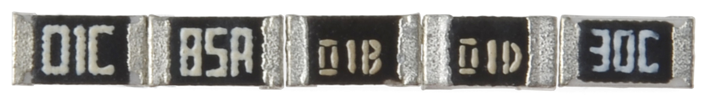

*Resistor SMD dengan Penanda E-96*

Jadi resistor dengan tanda 01C adalah yang paling sering ditemukan dengan nilai 10kΩ (100x100), 01B bernilai 1kΩ (100x10), dan 01D bernilai 100kΩ (100x1000). Yang tiga kode ini mungkin terasa mudah, namun yang lainnya akan terasa agak sulit. Kode 85A pada gambar adalah bernilai 750Ω (750x1) dan kode 30C sebenarnya bernilai 20kΩ (200x100). Hati-hati! teliti dengan baik, karena kami tidak menjelaskan konversi dari ohm ke kiloohm pada contoh diatas.

***

## Power Rating (Resistor Daya)

Power rating dari resistor adalah salah satu nilai yang tersembunyi. Namun demikian dapat menjadi sangat penting, dan itu adalah topik yang akan muncul ketika memilih jenis resistor.
Daya adalah tingkat di mana energi diubah menjadi sesuatu yang lain. Ini dihitung dengan mengalikan perbedaan tegangan dan arus di antara dua titik yang sedang mengalir, dan diukur dalam satuan watt (W). Bola lampu, misalnya, daya listrik diubah menjadi cahaya. Tapi resistor hanya dapat mengubah energi listrik yang berjalan melaluinya menjadi panas. Sedangkan panas bukanlah teman yang baik bagi perangkat elektronik; terlalu banyak panas dapat menimbulkan asap, percikan api, dan bahkan terbakar!

Setiap resistor memiliki rating daya maksimum tertentu. Dalam rangka menjaga resistor dari panas yang berlebihan (overheat), penting untuk memastikan kekuatan pada sebuah resistor yang digunakan, resistor yang akan digunakan harus berada dalam lingkup rating nilai maksimum. Power rating dari resistor diukur dalam watt, dan biasanya ditentukan antara ¼WW (0,125W) dan 1W. Resistor dengan peringkat daya lebih dari 1W biasanya disebut sebagai resistor daya, dan digunakan khusus untuk mempertahakan kemampuan power.

### Menentukan Sebuah Resistor Power Rating

Sebuah resistor power rating biasanya dapat disimpulkan dengan mengamati ukuran kemasannya. Standar resistor through-hole biasanya dibuat dengan nilai ¼W atau ½W. Untuk tujuan khusus, resistor daya mungkin bisa dipertimbangkan untuk dimasukan kedalam daftar yang disesuaikan dengan power rating-nya.

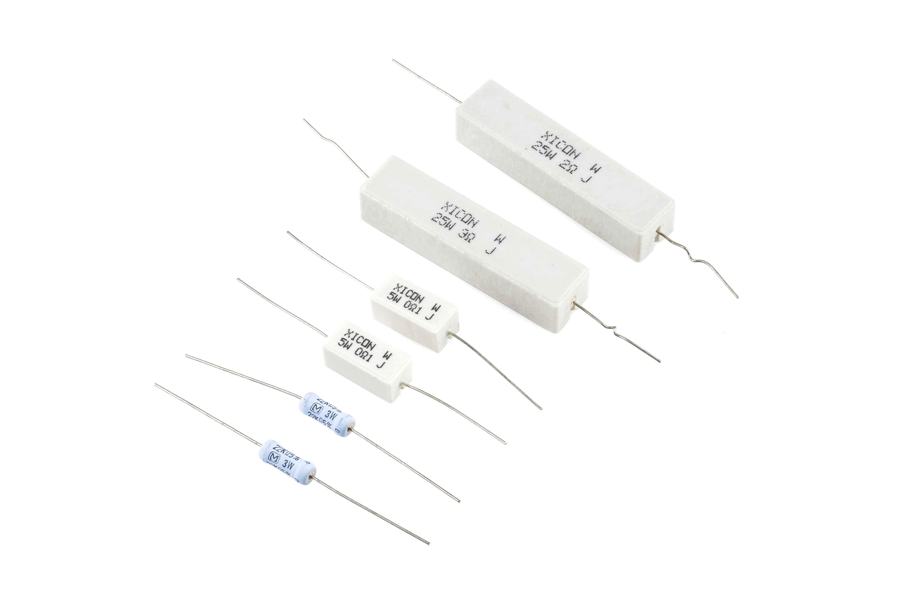

*Beberapa Contoh Resistor Daya*

Resistor daya ini dapat menangani lebih banyak power sebelum terbakar. Dari kanan-atas ke bawah-kiri adalah contoh resistor daya yang bernilai dari 25W, 5W dan 3W, dengan nilai resistansi 2Ω, 3Ω, 0.1Ω dan 22kΩ. Resistor daya dengan nilai kecil biasanya digunakan untuk memaksimalkan arus yang mengalir.

Peringkat daya dari resistor surface-mount biasanya dapat dilihat dari ukurannya juga. Resistor dengan ukuran 0402 dan 0603 biasanya bernilai 1/16W, dan 0805 bernilai 1/10W.

***

## Menghitung Daya Resistor

Power biasanya dihitung dengan mengalikan Tegangan (V) dan Arus (I) (P = V.I). Tapi dengan menggunakan hukum Ohm, kita juga bisa menggunakan nilai resistansi dalam menghitung daya. Jika kita tahu arus yang mengalir pada sebuah resistor, kita dapat menghitung daya sebagai berikut:

!!! info "Rumus Daya"
	$$
	\mathbf{P} = I^2 \times R
	$$

Atau, jika kita tahu tegangan dan resistor, daya dapat dihitung sebagai berikut:

!!! info "Rumus Daya"
	$$
	\mathbf{P} = \frac{V^2}{R}
	$$

***

## Hubungan Resistor Seri dan Paralel

Resistor selalu terhubung sepanjang waktu dalam rangkaian elektronik, biasanya terhubung dengan rangkaian seri atau paralel. Ketika resistor digabungkan secara seri atau paralel, mereka menciptakan resistansi total, yang dapat dihitung dengan menggunakan salah satu dari dua persamaan. Untuk mengetahui berapa nilai resistor yang digabungkan maka kita harus  mengetahui terlebih dahulu nilai dari resistor tertentu.

### Resistor Hubungan Seri

Bila resistor terhubung seri maka nilainya cukup dengan menambahkan antara nilai satu resistor dengan resistor berikutnya.

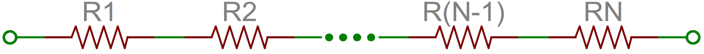

!!! info "Rumus untuk mengetahui nilai resistor total yang terhubung seri"
	$$
	\mathbf{R_{tot}} = R_1+R_2+ ... + R_{N-1}+R_N
	$$

*N resistor pada hubungan seri. Total resistensi adalah jumlah dari semua resistor yang terhubung seri.*

Misalnya, jika Anda membutuhkan resistor dengan nilai total 3,6kΩ, maka cukup mencari resistor dengan nilai-nilai yang sudah umum, misal; 2,2kΩ, 1,2kΩ dan 2 resistor dengan nilai 100Ω dan kemudian setiap ujung dari masing-masing resistornya dihubungkan secara seri. Maka hasilnya ==2,2+1,2+0,1+0,1 = 3,6kΩ==.

***

### Resistor Hubungan Paralel

Menemukan nilai resistansi resistor yang dihubungkan secara paralel tidak begitu mudah. Total nilai resistansi dari N resistor secara paralel adalah kebalikan dari jumlah semua resistensi. Persamaan ini mungkin lebih masuk akal dari kalimat sebelumnya diatas:

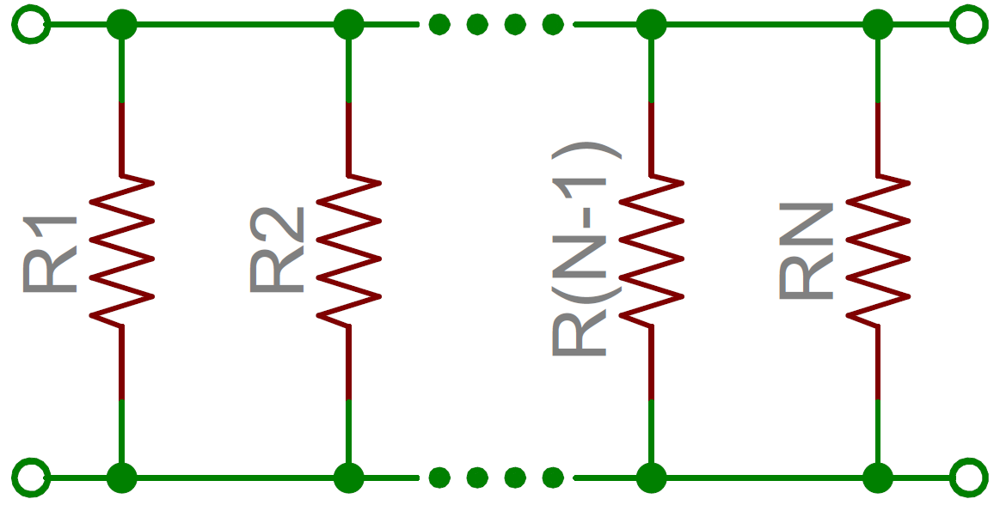

!!! info "Rumus untuk mengetahui nilai resistor total yang terhubung paralel"
	$$
	\frac{1}{R_{tot}} = \frac{1}{R_1}+\frac{1}{R_2}+ ... + \frac{1}{R_{N-1}}+\frac{1}{R_N}
	$$

*N resistor secara paralel. Untuk menemukan resistansi total dengan cara balikan setiap nilai resistansi, atau tambahkan tambahkan satu persatu, dan kemudian membalikkan nilai akhirnya.*

(Kebalikan dari resistansi sebenarnya disebut konduktansi, sehingga secara ringkas: konduktansi dari resistor paralel adalah jumlah dari masing-masing konduktansi mereka).

Sebagai kasus khusus dari persamaan ini: jika Anda memiliki dua resistor secara paralel, resistansi totalnya dapat dihitung dengan persamaan ini:

!!! info "Rumus untuk menghitung dua resistor secara paralel"
	$$
	\mathbf R_{tot} = \frac {R_1 \times R_2}{R_1 + R_2}
	$$

Sebagai kasus persamaan itu, jika Anda memiliki dua resistor paralel dengan nilai yang sama resistansi total adalah setengah dari nilai tersebut. Sebagai contoh, jika dua resistor memiliki nilai 10kΩ secara paralel, resistansi total mereka adalah 5kΩ.

Sebuah cara singkat untuk mengatakan dua resistor secara paralel adalah dengan menggunakan operator paralel: ||. Misalnya, jika R1 dihubungkan secara paralel dengan R2, persamaan konseptual dapat ditulis ==R1 || R2==. Penulisan seperti ini jauh lebih tersusun dan nyaman.

***

### Jaringan Resistor

Sebagai pengantar khusus untuk menghitung jumlah resistansi, guru elektronik lebih suka memaksakan kepada siswa untuk memahami cara gila, jaringan resistor berbelit-belit.

Sebuah pertanyaan jaringan resistor mungkin akan seperti ini: "Berapa nilai resistansi dari terminal A ke B pada rangkaian ini?"

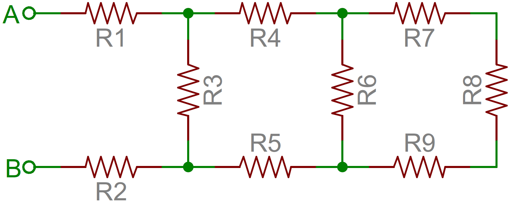

Untuk mengatasi masalah tersebut, mulai dari unjung sirkuit dan menyederhanakannya pada dua terminal. Dalam hal ini R7, R8 dan R9 semua di susun secara seri dan dapat dijumlahkan. Ketiga resistor disusun secara paralel terhadap R6, sehingga keempat resistor dapat diubah susunannya menjadi satu dengan resistansi ==R6 || (R7 + R8 + R9)==. Membuat sirkuit menjadi:

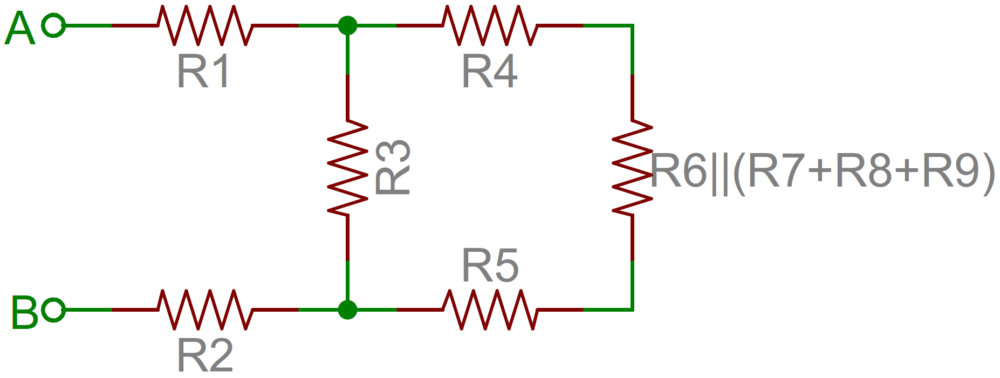

Sekarang empat resistor paling kanan dapat disederhanakan lebih mudah. R4, R5 dan konglomerasi dengan R6 - R9 yang semua disusun seri dan dapat dijumlahkan. Kemudian resistor seri tersebut disusun secara paralel dengan R3. Sehingga jika ditulis akan menjadi ==R3 || (R4 + R5 + R6 || (R7 + R8 + R9))==.

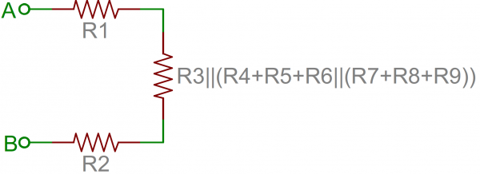

Dan tersisa tiga resistor yang disusun seri antara terminal A dan B. Jadi resistansi total rangkaian yaitu: ==R1 + R2 + R3 || (R4 + R5 + R6 || (R7 + R8 + R9))==.

***

## Contoh Penggunaan Resistor

Resistor ada di hampir setiap sirkuit elektronik yang pernah Anda temukan. Berikut adalah beberapa contoh sirkuit, yang sangat bergantung pada sejumlah resistor.

### Membatasi Arus LED

Resistor merupakan kunci dalam memastikan LED tidak terbakar ketika sumber listrik dihubungkan. Dengan menghubungkan sebuah resistor secara seri dengan LED, arus yang mengalir melalui dua komponen dapat dibatasi pada nilai yang aman.

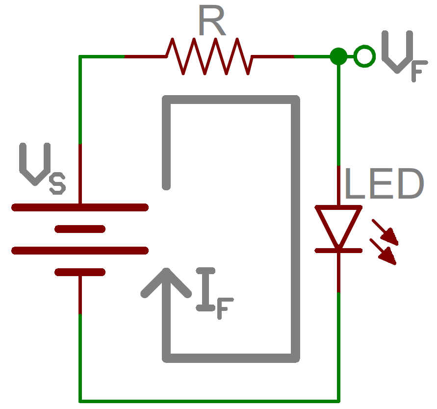

Ketika sebuah resistor digunakan sebagai pembatas arus, ada dua hal yang harus diperhatikan dari karakteristik sebuah LED: laju tegangan (*typical forward voltage*), dan laju arus maksimum (*maximum forward current*). Laju tegangan adalah tegangan yang diperlukan untuk membuat lampu LED menyala, dan bervariasi (biasanya di antara 1,7V hingga 3,4V) tergantung pada warna LED. Laju arus maksimum biasanya sekitar 20mA untuk LED pada umumnya (bukan tipe khusus); arus kontinyu yang mengalir melalui LED harus selalu sama dan atau kurang dari rating arus masuk.

Setelah Anda mengetahui kedua nilai diatas, Anda dapat menentukan ukuran sebuah resistor pembatas arus dengan persamaan ini:

!!! info "Rumus Resistor Pembatas Arus"
	$$
	\mathbf R = \frac {V_S - V_F}{I_F}
	$$

VS adalah tegangan sumber - biasanya tegangan baterai atau catu daya. VF dan IF adalah laju tegangan LED dan arus yang dibutuhkan yang berjalan melewatinya.

Sebagai contoh, asumsikan bahwa Anda memiliki baterai 9V untuk daya LED. Jika LED Anda berwarna merah, mungkin memiliki laju tegangan sekitar 1,8V. Jika Anda ingin membatasi arus 10mA, menggunakan resistor secara seri maka dibutuhkan resistor sekitar 720Ω.

!!! info "Resistor Pembatas Arus"
	$$
	\mathbf R = \frac {V_S-V_F}{I_F} = \frac {9V-1,8V}{0,010} = 720Ω
	$$

***

### Pembagi Tegangan (Voltage Divider)

Sebuah pembagi tegangan adalah rangkaian resistor yang mengubah tegangan besar menjadi lebih kecil. Menggunakan hanya dua resistor yang disusun secara seri, sehingga tegangan keluar dapat ditentukan yang itu merupakan pembagian dari tegangan masuk.

Berikut rangkaian pembagi tegangan:

Dua resistor, R1 dan R2 , dihubungkan secara seri dan sumber tegangan (Vin) terhubung di antaranya. Tegangan dari Vout ke GND dapat dihitung sebagai berikut:

!!! info "Rumus Pembagi Tegangan"
	$$
	\mathbf Vout = Vin \times \frac {R_2}{R_1 + R_2}
	$$

Misalnya, jika R1 adalah 1.7kΩ dan R2 adalah 3,3kΩ, input tegangan (Vin) 5V bisa diubah menjadi 3,3V pada terminal Vout.

Pembagi tegangan sangat berguna untuk membaca sensor resistif, seperti photocells, sensor fleksibel, dan resistor tekanan-sensitif. Satu dari setengah pembagi tegangan biasanya adalah sensor, dan satu bagian lagi adalah resistor statis. Output tegangan antara dua komponen yang terhubung ke konverter analog-ke-digital (ADC) pada mikrokontroler (MCU) digunakan untuk membaca nilai sensor.

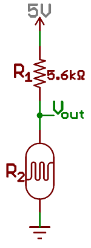

*Gambar diatas adalah resistor R1 dan fotosel yang digunakan untuk membuat pembagi tegangan sehingga tegangan output menjadi variabel.*

***

### Pull-up Resistor

Sebuah resistor pull-up yang digunakan ketika Anda harus membuat bias pin input mikrokontroler untuk mengetahui kondisi. Salah satu ujung resistor terhubung ke pin MCU, dan ujung lainnya terhubung ke tegangan sumber (biasanya 5V atau 3,3V).

Tanpa resistor pull-up, input pada MCU bisa anggap mengambang dan itu sangat membingungkan untuk menetukan kondisi. Sulit menententukan pin yang mengambang, apakah dalam kondisi tinggi (5V) atau kondisi rendah (0V).

Pull-up resistor sering digunakan ketika berinteraksi dengan tombol atau saklar input. Pull-up resistor memperoleh bias pin-input ketika saklar terbuka. Dan itu akan melindungi sirkuit dari hubungan pendek (short circuit) ketika saklar ditutup.

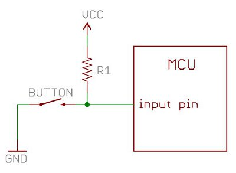

Dalam rangkaian di atas, ketika saklar terbuka pin input MCU terhubung melalui resistor ke sumber 5V. Ketika saklar menutup, pin input terhubung langsung ke GND.

Nilai resistor pull-up biasanya tidak perlu nilai yang spesifik. Tapi harus cukup tinggi sehingga tidak terlalu banyak daya yang hilang jika tegangan sumber yang digunakan sekitar 5V atau lebih. Biasanya nilai resistor sekitar 10kΩ  dan itu sudah cukup bekerja dengan baik.

***

## Daftar Pustaka

* [Resistor][2]
* [Resistors][3]
* [Resistor Color Code Calculator and Chart][4]
* [4 Band Resistor Color Code Calculator][5]
* [What is Resistor][6]

[1]: http://www.moyerelectronics.com/FreeDownloads/ResistorColorCode24.zip
[2]: https://en.wikipedia.org/wiki/Resistor
[3]: https://learn.sparkfun.com/tutorials/resistors/all
[4]: https://www.allaboutcircuits.com/tools/resistor-color-code-calculator/
[5]: https://www.digikey.com/en/resources/conversion-calculators/conversion-calculator-resistor-color-code-4-band
[6]: https://www.rapidtables.com/electric/resistor.html

***

<small>Artikel diperbarui pada: {{ git_revision_date_localized }}</small>