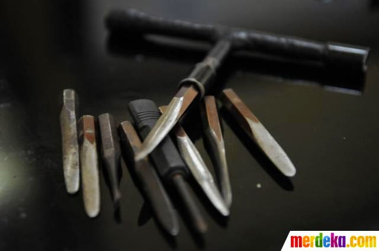
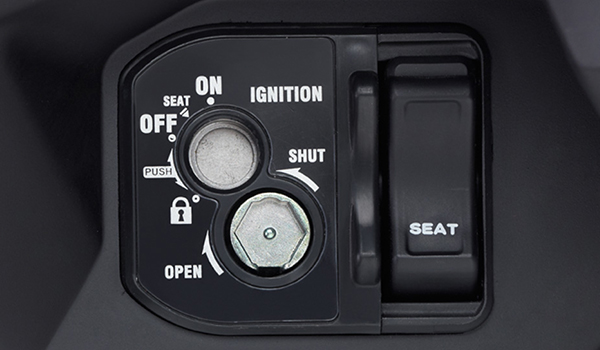
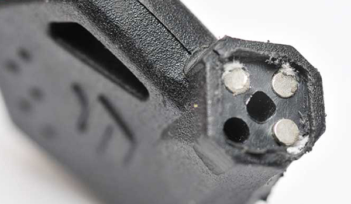
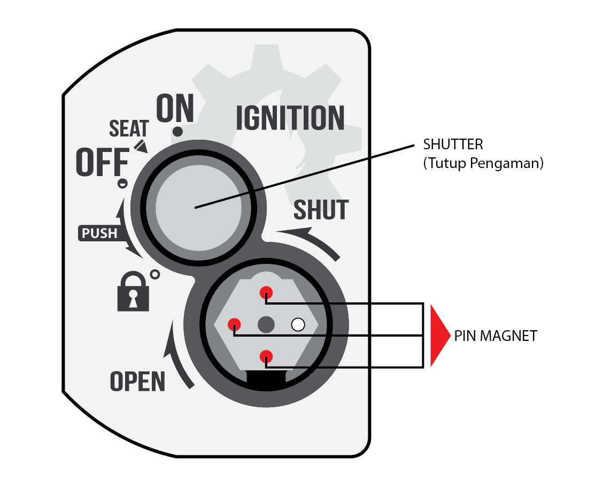
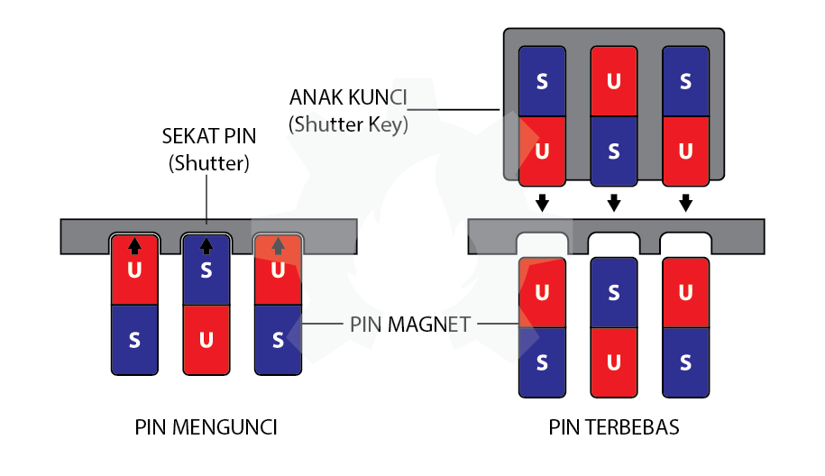
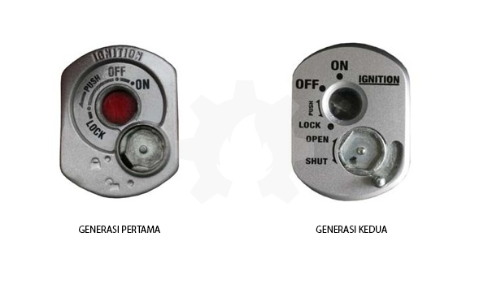
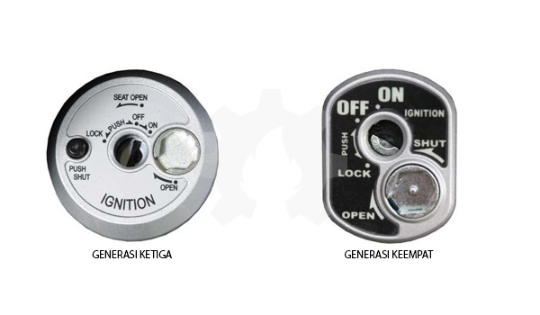

title: Secure Key Shutter
description: Secure Key Shutter atau Kunci Magnet atau Penutup Lubang Kunci adalah teknologi yang dikembangkan untuk menjawab kebutuhan para pemilik kendaraan dalam meningkatkan keamanan sepeda motornya.
hero: Secure Key Shutter
disqus: henduino

# Secure Key Shutter - Kunci Magnet

Secure Key Shutter atau Kunci Magnet atau Penutup Lubang Kunci adalah teknologi yang dikembangkan untuk menjawab kebutuhan para pemilik kendaraan dalam meningkatkan keamanan sepeda motornya. SKS mampu memperlambat pembobolan kunci utama dengan kunci T oleh para pencuri kendaraan bermotor. Secure Key Shutter cukup membantu walau hanya sekedar memperlambat, namun hal ini cukup efektif untuk menekan tingkat pencurian sepeda motor yang akhir-akhir ini cukup rawan terjadi di beberapa tempat di Indonesia. Namun selalu ingat nasehat bang napi bahwa "*Kejahatan terjadi bukan hanya karena niat pelakunya tapi karena ada kesempatan. Waspadalah! Waspadalah!*"

*Kunci T Pembobol Kunci Sepeda Motor*

Rawannya pencurian motor dibeberapa wilayah di Indonesia melahirkan ide-ide kreatif bagi perusahaan sepeda motor. Namun disisi lain, para pencuri pun berevolusi mencari teknik pembobol kunci yang cepat dan dapat digunakan pada berbagai merk sepeda motor. Setiap teknologi yang dilahirkan, para pencuri seakan selalu mencari kelemahan-kelemahan teknologi tersebut. Kunci T adalah peralatan yang sangat sulit ditaklukan dan alat ini pulalah yang selalu menjadi andalan para pencuri sepeda motor. Kunci T menjadi alat sederhana namun handal bagi para pencuri selama beberapa tahun terakhir. Kunci T seakan menjadi alat mengerikan yang sulit dikalahkan sehingga perusahaan sepeda motor berfikir keras untuk menciptakan pengaman. Hingga diciptakanlah teknologi ***Secure Key Shutter*** atau disingkat ***SKS***.

*Gambar 1. Secure Key Shutter*

***

## Fungsi Secure Key Shutter

Pada dasarnya Secure Key Shutter adalah pengaman kunci utama. Dari namanya dapat kita tebak bahwa peranan Secure Key Shutter adalah sebagai daun/bilah penutup yang menjamin keamanan lubang kunci utama. Hal ini membuat kunci T sebagai andalan pencuri sepeda motor pun membutuhkan waktu yang lebih lama dari pada sepeda motor tanpa SKS. Secure Key Shutter memiliki bilah (shutter) yang kuat untuk menutup lubang kunci utama pada sepeda motor. Hal ini menjadikan sepeda motor memiliki pengamanan ganda. Kunci utama digunakan sebagai pengaman sepeda motor dan Secure Key Shutter digunakan untuk mengamankan lubang kunci utamanya. Secure Key Shutter dilengkapi dengan pin magnet sebagai pengunci daun penutup (shutter) lubang kunci. Sedangkan daun penutup (shutter) lubang kunci dibuat dari bahan kuat serta dilengkapi dengan tuas yang sangat kuat. Secure Key Shutter hanya dapat dibuka dengan anak kunci bermagnet yang memiliki kutub sesuai dengan pin magnet yang ada pada Secure Key Shutter.

*Gambar 2. Pin Magnet Secure Key Shutter*

***

## Prinsip Kerja Secure Key Shutter

Prinsip kerja Secure Key Shutter sebenarnya sederhana hanya dengan memanfaatkan sifat-sifat kemagnetan. Magnet yang kutubnya senama akan saling tolak menolak dan kutub yang tidak senama akan saling tarik menarik (pelajaran IPA waktu di SD). Prinsip "Kutub Senama" inilah yang digunakan pada Secure Key Shutter. Perhatikan Video Animasi Secure Key Shutter dibawah ini.

<iframe width="560" height="315" src="https://www.youtube.com/embed/ZrTs7FmtzKY" frameborder="0" allow="accelerometer; autoplay; encrypted-media; gyroscope; picture-in-picture" allowfullscreen></iframe>

Secure Key Shutter memiliki empat lubang pin. 3 lubang di isi pin magnet dan 1 lubang dibiarkan kosong. Kekosongan 1 lubang pin ini untuk menciptakan kombinasi urutan peletakan pin magnet. Sehingga setiap sepeda motor memiliki urutan peletakan pin magnet yang berbeda. Setiap pin magnet memiliki dua kutub medan magnet yaitu kutub utara magnet (disingkat U), dan kutub selatan magnet (disingkat S).

*Gambar 3. Bagian Secure Key Shutter*

### Saat Pin Magnet SKS Mengunci

Pada saat lubang kunci utama tertutup shutter keadaan 3 pin magnet didalam Secure Key Shutter menempel ke bagian sekat pin karena sifat kemagnetan pada pin yang cenderung menempel terhadap logam-logan jenis besi. Pada saat seperti ini shutter akan terkunci kuat sehingga tidak bisa diputar. 3 pin magnet pengunci memiliki kombinasi tertentu. Seperti pada gambar dibawah ini, 3 pin magnet pengunci memiliki kombinasi U-S-U jika dilihat dari posisi atas (dekat dengan sekat pin atau shutter).

*Gambar 4. Keadaan Pin Magnet Secure Key Shutter*

### Saat Pin Magnet SKS Terbebas

Ketika kita memasukan Shutter Key kedalam lubang segi enam pada Secure Key Shutter maka pin magnet yang ada pada anak kunci akan bertemu dengan pin magnet yang ada di dalam SKS. Hal ini menyebabkan pin magnet yang ada didalam SKS terdorong karena sifat kemagnetan senama yang saling tolak menolak. Saat pin magnet yang ada didalam SKS terdorong maka sekat pin akan terbebas sehingga ketika di putar maka tuas penggerak daun penutup kunci utama akan terbuka. Namun jika kutub-kutub medan magnet yang ada pada anak kunci tidak sesuai dengan kombinasi susunan pin magnet yang ada didalam SKS maka justru pin magnet akan saling tarik menarik dan sekat pin akan tetap terkunci. Sehingga daun pengaman kunci utama tidak bisa dibuka.

***

## Perkembangan Secure Key Shutter

Berikut beberapa perkembangan Secure Key Shutter produk salah satu perusahaan sepeda motor terkemuka, HONDA.

* Generasi Pertama

Pada generasi pertama ini, Secure Key Shutter masih dioperasikan secara manual. Artinya kita perlu menancapkan anak kunci pin magnet kedalam SKS kemudian memutarnya untuk membuka atau menutup Daun Pengaman Kunci Utama.

* Generasi Kedua

Generasi kedua lebih sederhana dalam pengoperasian. Ketika anak kunci utama dicabut, kita cukup menggeser tuas disamping SKS untuk menutup daun pengaman kunci utama. Namun tetap membutuhkan anak kunci pin magnet untuk membuka daun pengaman kunci utamanya. Fungsi manual dengan menancapkan anak kunci pin magnet untuk menutup daun kunci utama tetap bisa dilakukan.

*Gambar 5. SKS Generasi Pertama dan Kedua*

* Generasi Ketiga

Menggeser tuas SKS untuk menutup daun pengaman kunci utama ternyata masih sering diabaikan. Maka dibuatkan tombol tekan untuk memudahkan penutupan daun pengaman kunci utamanya. Cukup dengan menekan tombol disamping SKS untuk menutup shutter. Untuk membuka daun penutup tetap harus dilakukan secara manual dengan manancapkan anak kunci pin magnet.

* Generasi Keempat

Ketiga generasi yang sudah disebutkan diatas dirasa masih terlalu ribet bagi mereka yang hidupnya penuh keburu-buruan, maka dikembangkan lagi menjadi lebih praktis. Ketika kita mematikan mesin, mengunci stang (lock), dan kemudian mencabut anak kunci utama maka daun pengaman lubang kunci akan menutup secara otomatis. Namun harus diingat, shutter menutup otomatis jika leher stang dikunci. Jika tidak dikunci maka shutter tidak akan menutup otomatis. Pada saat stang tidak dikunci maka shutter harus ditutup secara manual dengan menggunakan anak kunci pin magnet. Sedangkan untuk membuka daun penutup kunci utama tetap harus dilakukan secara manual.

*Gambar 6. SKS Generasi Ketiga dan Keempat*

***