title: Vernier Caliper
description: Salah satu alat ukur presisi untuk pemeriksaan bagian-bagian pada automotive adalah Vernier Caliper. Vernier Caliper dikenal juga dengan nama Sigmat dan Jangka Sorong.
hero: Vernier Caliper
disqus: henduino

# Vernier Caliper

Alat ukur (*Measuring Tool*) adalah bagian dari peralatan *automotive* yang tidak dapat dipisahkan dalam proses pemeliharaan maupun perbaikan. Alat-alat pengukuran yang digunakan pada saat perbaikan automotive dituntut memiliki tingkat ketelitian dan presisi yang sangat tinggi. Hal itu karena nilai toleransi antar bagian komponen yang saling bergerak sangat kecil dan hampir tidak ada. Kepresisian ini membuat alat-alat pengukuran yang digunakan juga menjadi cukup rumit untuk dibaca secara cepat. Salah satu alat ukur presisi untuk pemeriksaan bagian-bagian pada automotive adalah Vernier Caliper. ***Vernier Caliper*** dikenal juga dengan nama ***Sigmat*** dan ***Jangka Sorong***.

Vernier Caliper atau Sigmat atau Jangka Sorong memiliki dua skala pengukuran, yaitu skala utama dan skala vernier, dan digunakan untuk mengukur diameter luar, diameter dalam dan kedalaman. Skala utama dan skala vernier digunakan untuk mengukur jarak kecil dengan cara mencari perbedaan antara dua tanda. Metode ini disebut prinsip pengukuran vernier.

***

## Fungsi dan Bagian Vernier Caliper

Vernier Caliper memiliki beberapa bagian yang memiliki fungsi masing-masing. Bagian-bagian Vernier Caliper sangat penting untuk diketahui karena hasil pengukuran menjadi salah jika penggunaan bagian-bagian tersebut tidak sesuai dengan fungsinya. Perhatikan bagian-bagian Vernier Caliper pada gambar dibawah ini:

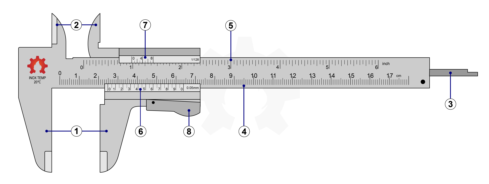

1. **Outside Jaws**; Atau disebut Rahang Luar. Bagian ini digunakan untuk mengukur jarak bagian luar suatu benda, dan atau pada umumnya digunakan untuk mengukur diameter luar pada benda yang berbentuk silinder.
2. **Inside Jaws**; Atau disebut Rahang Dalam. Bagian ini digunakan untuk mengukur jarak bagian dalam suatu benda, dan atau pada umumnya digunakan untuk mengukur diameter dalam pada benda yang berbentuk tabung silinder.
3. **Depth Probe**; Atau disebut juga Depth Bar atau Batang Kedalaman. Bagian ini digunakan untuk mengukur jarak kedalaman suatu benda yang berbentuk rongga yang tidak memungkinkan diukur menggunakan bagian Outside Jaws maupun Inside Jaws.
4. **Main Scale Milimeter**; Atau Skala Utama Milimeter. Bagian ini digunakan untuk membaca hasil pengukuran suatu benda. Hasil pembacaan pengukuran pada Main Scale masih belum detail dan pada skala utama ini hasil pengukuran dinyatakan dalam satuan Milimeter (mm).
5. **Main Scale Inch**; Atau Skala Utama Inch. Bagian ini digunakan untuk membaca hasil pengukuran suatu benda. Hasil pembacaan pengukuran pada Main Scale masih belum detail dan pada skala utama ini hasil pengukuran dinyatakan dalam satuan Inch.
6. **Vernier Scale Milimeter**; Atau Skala Vernier Milimeter. Bagian ini digunakan untuk membaca hasil pengukuran suatu benda. Bagian Vernier Scale merupakan skala detail yang menunjukan nilai desimal dibelakang koma setelah pembacaan hasil pengukuran pada Main Scale. Pada skala vernier ini hasil pengukuran dinyatakan dalam satuan Milimeter (mm).
7. **Vernier Scale Inch**; Atau Skala Vernier Inch. Bagian ini digunakan untuk membaca hasil pengukuran suatu benda. Bagian Vernier Scale merupakan skala detail yang menunjukan nilai desimal dibelakang koma setelah pembacaan hasil pengukuran pada Main Scale. Pada skala vernier ini hasil pengukuran dinyatakan dalam satuan Inch.
8. **Retainer**; Atau Clamp Screw atau Pengunci. Bagian ini digunakan untuk mengunci bagian bergerak Vernier Caliper ketika proses pengukuran telah dilakukan. Pada saat pengukuran dilakukan dan posisi pengukuran sudah tepat maka sebelum Vernier Caliper dilepas dari benda yang diukur, harus dilakukan penguncian pada bagian yang bergerak dengan menggunakan Retainer. Hal ini untuk menghindari perubahan jarak hasil pengukuran.

***

## Jenis Vernier Caliper

### Vernier Caliper Analog

Vernier Caliper Analog adalah Vernier Caliper yang proses hasil pengukuran dibaca secara manual. Hasil pengukuran besar dibaca pada area Main Scale sedangkan hasil pengukuran kecil dibaca pada area Vernier Scale. Vernier Caliper jenis analog terdiri dari dua tingkat ketelitian yaitu;

*Vernier Caliper dengan ketelitian 0,05 biasanya tertulis pada skala vernier, atau terkadang tertulis 1/20. Penulisan 1/20 karena jumlah garis skala vernier sebanyak 20 garis. 1/20 = 0,05 mm.*

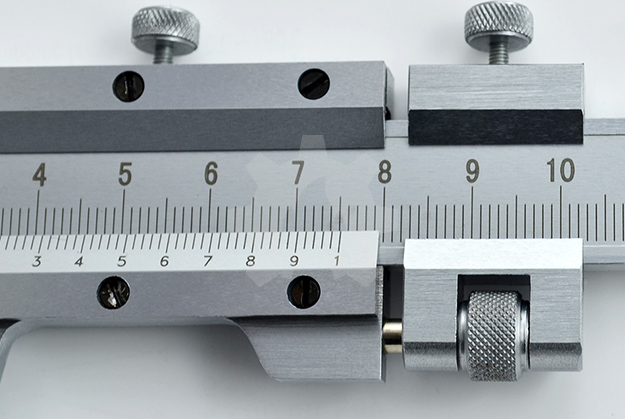

*Vernier Caliper dengan ketelitian 0,02 biasanya tertulis pada skala vernier, atau terkadang tertulis 1/50. Penulisan 1/50 karena jumlah garis skala vernier sebanyak 50 garis. 1/50 = 0,02 mm.*

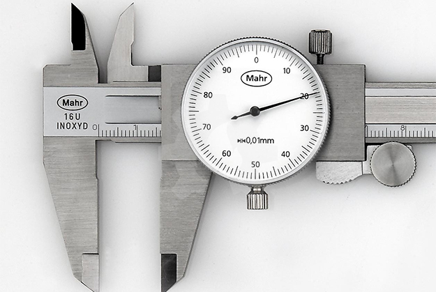

*Vernier Caliper dengan ketelitian 0,01mm. Khusus untuk pembacaan Vernier Caliper jenis jarum dengan ketelitian 0,01 mm ini akan dibahas pada artikel terpisah.*

***

### Vernier Caliper Digital

Vernier Caliper Digital ini merupakan alat ukur presisi keluaran terbaru. Penggunaannya pun sangat mudah, kita hanya tinggal membaca nilai yang keluar pada layar LCD. Kita bisa berganti satuan dari milimeter ke inch dengan mudah. Namun disetiap penggunaan kita harus melakukan kalibrasi "Zero Set" agar hasil pengukuran lebih akurat. Kelemahannya Vernier Caliper adalah ketika Vernier Caliper kotor dan baterai lemah maka hasil pengukuran menjadi kacau dan tidak akurat.

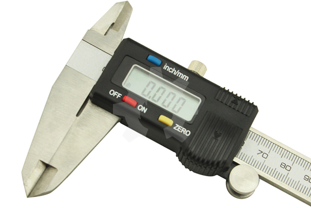

***

## Penggunaan Vernier Caliper

Beberapa hal yang harus diperhatikan pada saat menggunakan Vernier Caliper, diantaranya:

### 1. Bersihkan

Sebelum melakukan pengukuran maka bersihkanlah terlebih dahulu objek yang akan diukur dan Vernier Caliper terutama pada permukaan Outside Jaws, Inside Jaws, dan Depth Probe.

### 2. Periksa Vernier Caliper

Sebelum menggunakan Vernier Caliper pastikan bahwa bagian skala vernier dapat bergeser dengan baik, dan pastikan pula (kalibrasi) bahwa angka "0" pada kedua sekala bertemu sejajar dengan tepat.

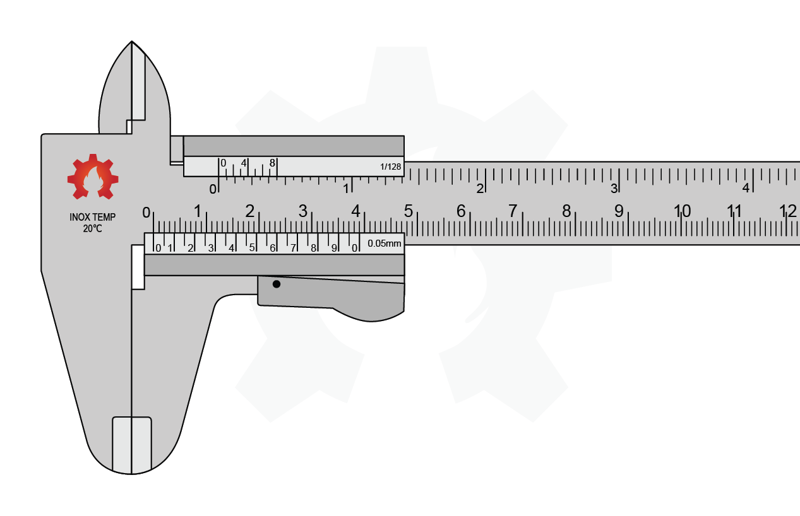

### 3. Objek Dekat Skala Utama

Posisi pengukuran usahakan bahwa objek yang diukur sedekat mungkin dengan skala utama. Pengukuran di ujung rahang pengukuran menghasilkan pengukuran yang kurang akurat.

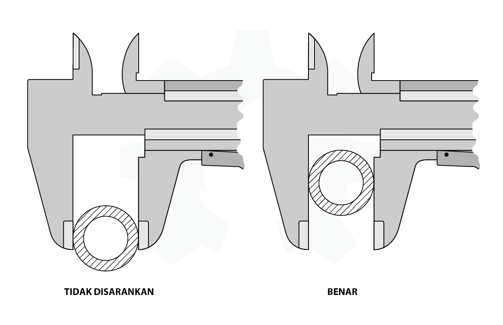

### 4. Tegak Lurus Terhadap Objek

Tempatkan Vernier Caliper tegak lurus terhadap objek yang diukur.

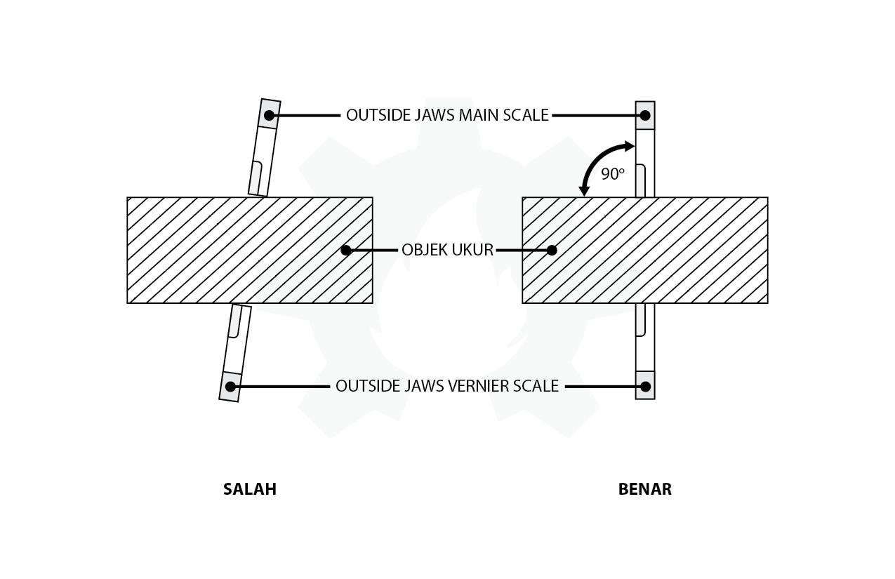

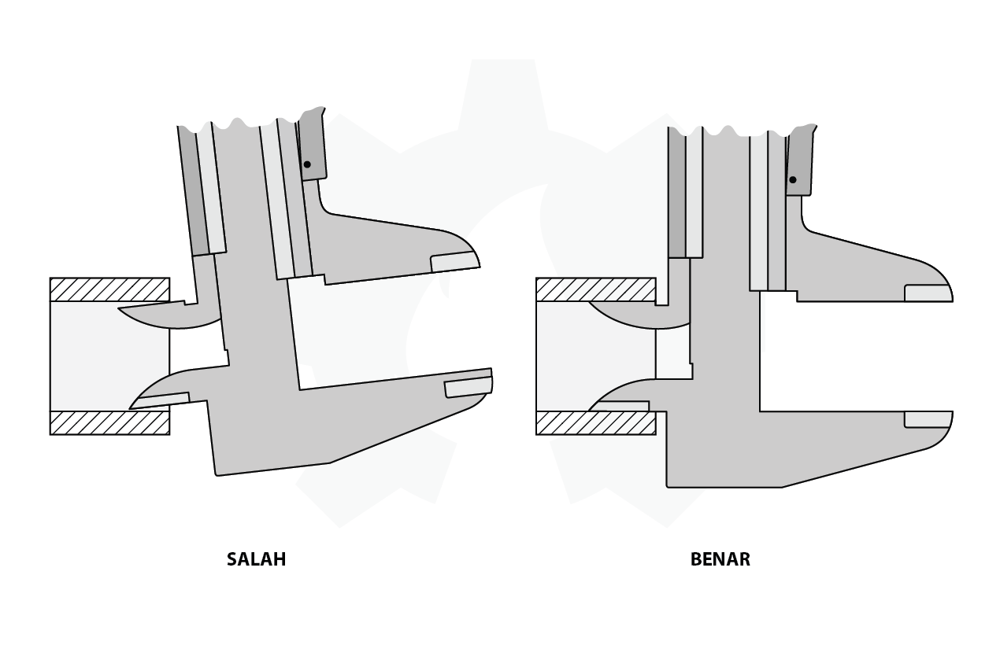

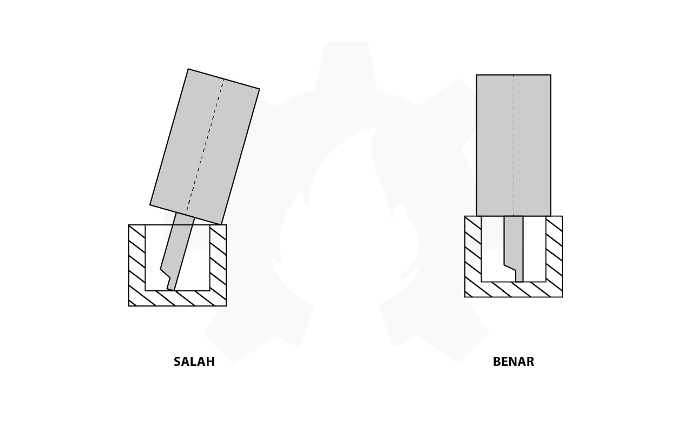

### 5. Pembacaan Tepat Didepan Strip

Usahakan bahwa posisi kita tegak lurus terhadap Vernier Caliper. Jangan dari sisi kiri, kanan, atas maupun bawah. Tetapi tepat didepan strip.

### 6. Gunakan Oli

Setelah melakukan pengukuran bersihkan Vernier Caliper kemudian basahi dengan oli untuk mencegah karat.

***

## Membaca Nilai Pengukuran

Karena Vernier Caliper merupakan salah satu alat ukur dengan tingkat presisi tinggi maka hasil pembacaannya pun sampai pada ketelitian tertentu. Pada contoh dibawah ini digunakan Vernier Caliper dengan tingkat ketelitian 0,05 mm. Perhatikan 2 gambar hasil pengukuran dibawah ini:

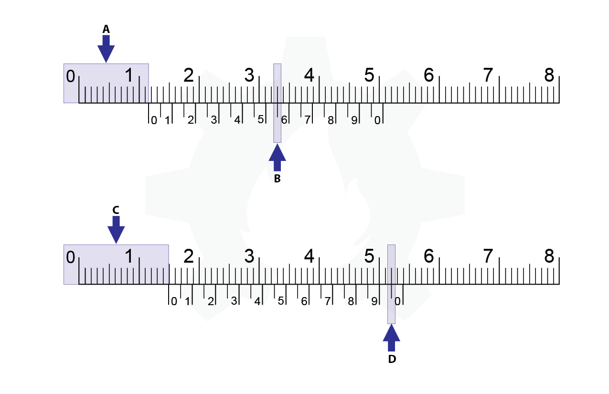

### Pembacaan Gambar 1:

* *Posisi A*; Nilai didepan koma dibaca dari skala utama sampai posisi "0" skala vernier atau sebelah kiri angka "0" skala vernier pada skala utama, yaitu 11 mm.
* *Posisi B*; Sedangkan angka dibelakang koma diambil dari titik dimana kedua garis skala vernier dan skala utama bertemu, namun pembacaan hasilnya ada pada skala vernier, yaitu 55.
* *Hasil*; Maka hasil pembacaan pada gambar atas adalah 11,55 mm.

### Pembacaan Gambar 2:

* *Posisi C*; Nilai didepan koma dibaca dari skala utama sampai posisi "0" skala vernier atau sebelah kiri angka "0" skala vernier pada skala utama, yaitu 14 mm.
* *Posisi D*; Sedangkan angka dibelakang koma diambil dari titik dimana kedua garis skala vernier dan skala utama bertemu, namun pembacaan hasilnya ada pada skala vernier, yaitu 95.
* *Hasil*; Maka hasil pembacaan pada gambar atas adalah 14,95 mm.

***

## Nilai Koma

Nilai koma disesuaikan dengan tingkat ketelitian Vernier Caliper, karena nilai koma merupakan kelipatan tingkat ketelitian.

* Ketelitian 0,05 mm; Jika menggunakan Vernier Caliper dengan tingkat ketilitan 0,05 mm maka nilai komanya adalah kelipatan 0,05, yaitu; `0,05|0,10|0,15|0,20|0,25|...|0,80|0,85|0,90|0,95`. Sehingga menjadi tidak mungkin jika kita menggunakan Vernier Caliper dengan ketelitian 0,05 namun diperoleh nilai koma yang bukan termasuk kelipatan 0,05 mm. Misal hasil pembacaannya adalah 11,53 mm, nilai 0,53 bukan merupakan kelipatan 0,05 mm.
* Ketelitian 0,02 mm; Jika menggunakan Vernier Caliper dengan tingkat ketilitan 0,02 mm maka nilai komanya adalah kelipatan 0,02, yaitu; `0,02|0,04|0,06|0,08|0,10|...|0,90|0,92|0,94|0,96|0,98`. Sehingga menjadi tidak mungkin jika kita menggunakan Vernier Caliper dengan ketelitian 0,02 namun diperoleh nilai koma yang bukan termasuk kelipatan 0,02 mm. Misal hasil pembacaannya adalah 14,95 mm, nilai 0,95 bukan merupakan kelipatan 0,02 mm.

***

## Test Pengukuran

Untuk memperlancar kemampuan anda membaca hasil pengukuran Vernier Caliper maka silahkan berlatih dengan contoh hasil pengukuran Vernier Caliper dibawah ini. Tingkat ketelitian Vernier Caliper yang digunakan adalah 0,05 mm.

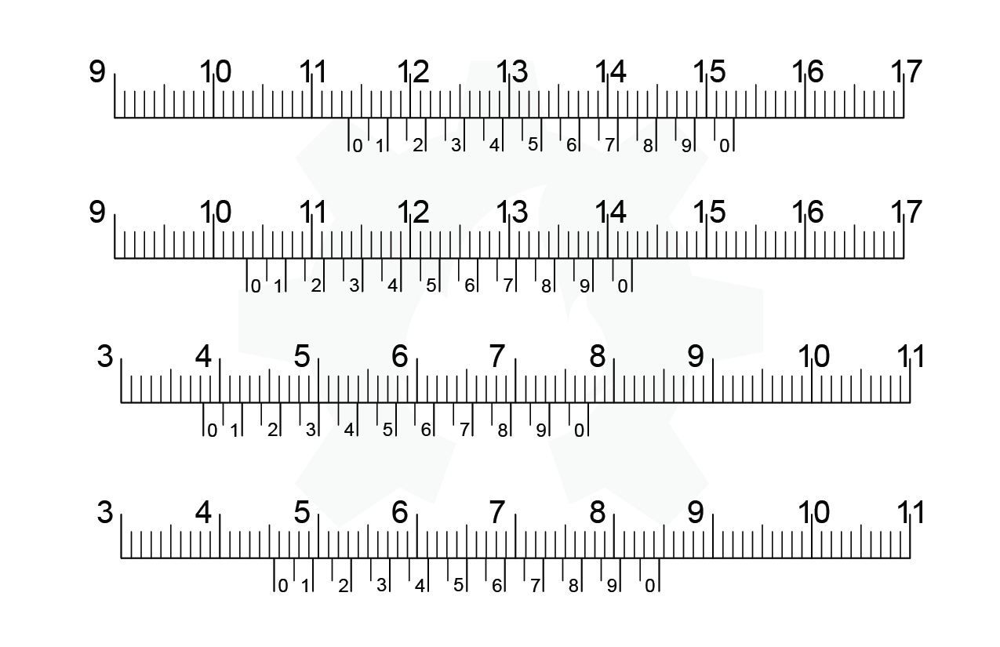

***

## Referensi

* New Step 1 Training Manual, PT Toyota-Astra Motor, 1995
* Materi Teknik Dasar Sepeda Motor Honda, Astra Honda Training Center
* Alat-Alat Ukur Untuk Servis, Astra Honda Training Center

***